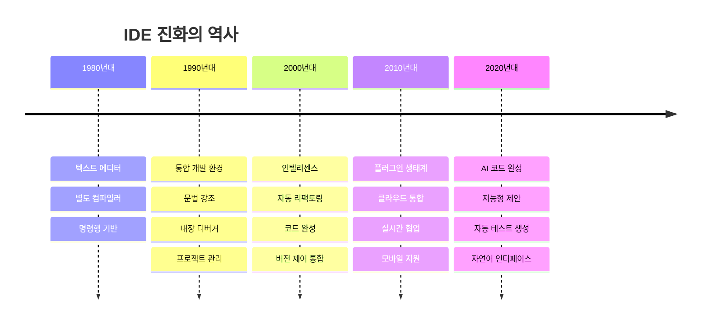
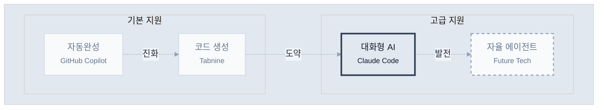
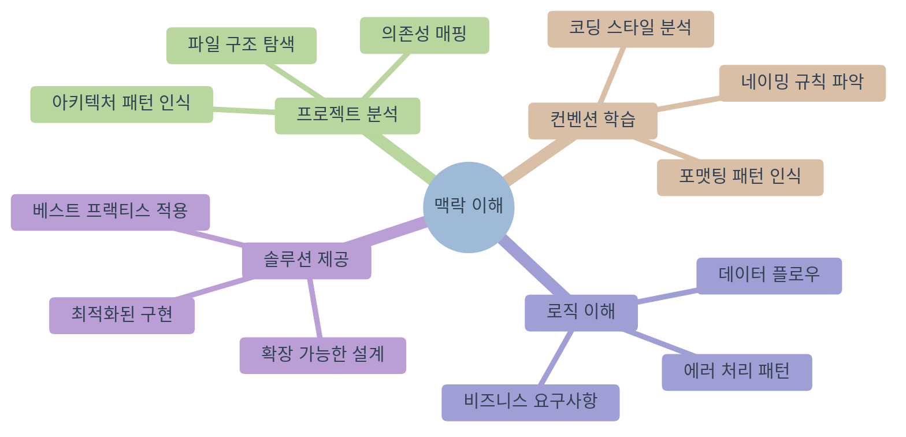
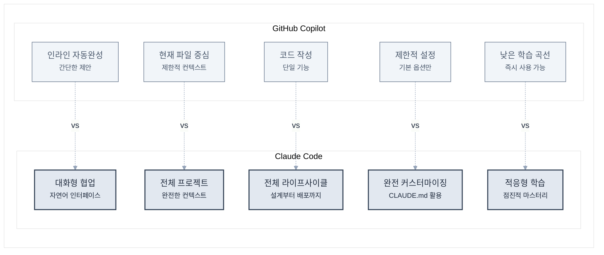
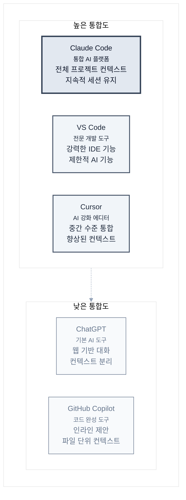
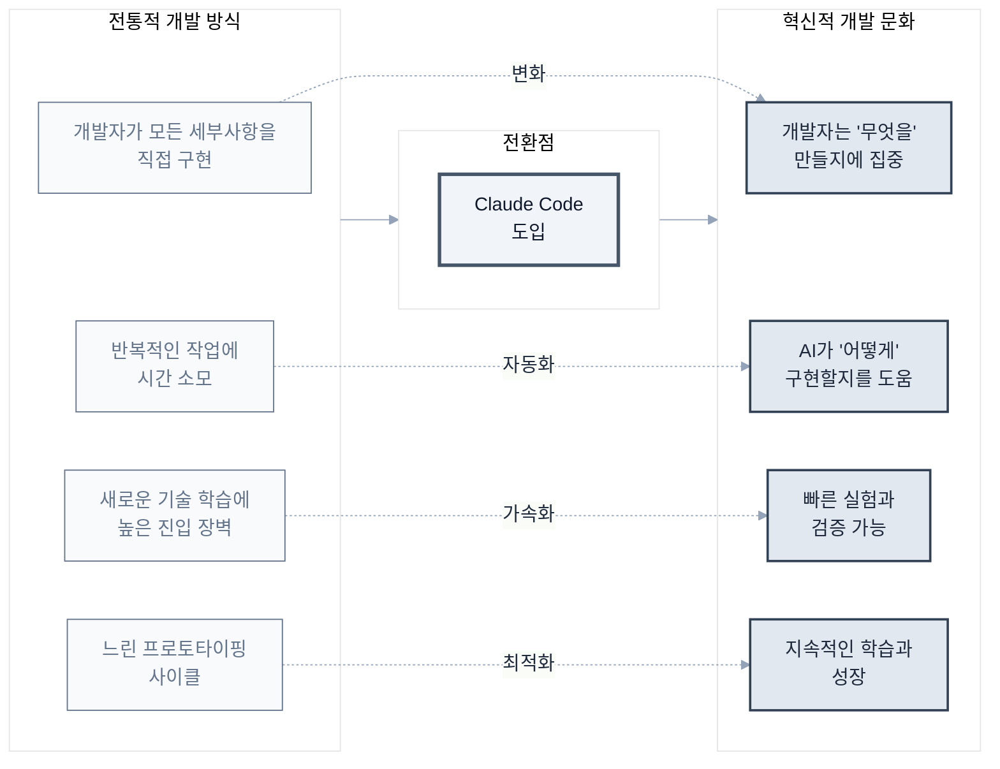

# 제1장: Claude Code란 무엇인가?

> "The best way to predict the future is to invent it." - Alan Kay

이 장에서는 Claude Code가 무엇인지, 왜 중요한지 알아보겠습니다.

프로그래밍의 역사는 끊임없는 **추상화와 도구 발전**의 역사입니다. 기계어에서 어셈블리로, 고급 언어에서 프레임워크로, 그리고 이제 AI와 자연어로 대화하며 코드를 작성하는 새로운 시대에 도달했습니다.

Claude Code는 이런 발전의 연장선상에 있는 혁신적인 도구입니다. 기존 개발 방식의 한계를 극복하고, 더 효율적이고 생산적인 개발 환경을 제공합니다.

## 1.1 전통적인 개발 도구의 한계

### 현재 개발 환경의 도전 과제

먼저 Claude Code가 왜 필요한지 이해하기 위해, 현재 개발자들이 직면한 주요 어려움들을 살펴보겠습니다.

**1. 폭발적으로 증가하는 복잡성**

현대의 소프트웨어는 정말 복잡해졌습니다. 예를 들어:
- 평범한 웹 애플리케이션도 100개 이상의 라이브러리에 의존합니다
- 마이크로서비스 환경에서는 수십 개의 독립적인 서비스를 관리해야 합니다
- 한 명의 개발자가 프론트엔드, 백엔드, 데이터베이스, DevOps까지 모두 알아야 하는 풀스택 시대입니다

이런 복잡성 때문에 새로운 프로젝트를 시작할 때마다 어디서부터 시작해야 할지 막막함을 느끼는 개발자들이 많습니다.

**2. 끊임없이 변화하는 기술 스택**

기술 변화의 속도도 정말 빠릅니다:
- JavaScript 생태계에서는 매년 새로운 프레임워크가 등장합니다
- AWS만 해도 200개가 넘는 서비스를 제공하고 있습니다
- 각 프로그래밍 언어마다 고유한 철학과 생태계를 가지고 있어서 학습 부담이 큽니다

빠르게 변화하는 기술 환경에서 지속적인 학습과 적응이 필요한 상황입니다.

**3. 반복적이고 지루한 작업들**

개발을 하다 보면 창의적인 부분보다는 반복적인 작업에 시간을 많이 쓰게 됩니다:
- 매번 똑같은 형태의 보일러플레이트 코드 작성
- 비슷비슷한 CRUD 기능들의 반복 구현
- 귀찮지만 꼭 필요한 문서화와 주석 작성
- 중요하지만 지루한 테스트 코드 작성

이런 작업들은 필요하지만, 개발자의 창의적인 에너지를 소모시키는 요인이 되고 있습니다.

### IDE의 진화와 한계

통합 개발 환경(IDE)은 지난 수십 년간 꾸준히 발전해왔습니다:



하지만 여전히 한계가 존재합니다:

1. **컨텍스트 이해 부족**: IDE는 코드의 문법은 이해하지만, 비즈니스 로직이나 의도는 파악하지 못합니다.

2. **수동적인 도구**: 개발자가 명시적으로 요청해야만 도움을 제공합니다.

3. **단편적인 지원**: 코드 작성, 테스트, 문서화, 배포 등이 분리되어 있습니다.

## 1.2 AI 페어 프로그래밍의 등장

### 페어 프로그래밍의 재정의

전통적인 페어 프로그래밍:
- 두 명의 개발자가 하나의 컴퓨터 앞에 앉아 작업
- 한 명은 코드를 작성(Driver), 다른 한 명은 검토(Navigator)
- 지식 공유와 코드 품질 향상이 목적

AI 페어 프로그래밍:
- 개발자와 AI가 대화하며 협업
- AI는 24시간 사용 가능한 시니어 개발자 역할
- 즉각적인 피드백과 다양한 관점 제공

### AI 개발 도구의 스펙트럼



Claude Code는 '대화형 어시스턴트' 영역에서 가장 진보된 형태를 보여줍니다.

## 1.3 Claude Code의 핵심 철학

### 1. 유연성 (Flexibility)

Claude Code는 특정 워크플로우를 강제하지 않습니다:

```bash
# 다양한 접근 방식 모두 가능
claude "버그를 찾아서 수정해줘"
claude "TDD 방식으로 새 기능을 구현해줘"
claude "이 코드를 함수형 스타일로 리팩토링해줘"
claude "아키텍처를 분석하고 개선점을 제안해줘"
```

### 2. 투명성 (Transparency)

모든 작업 과정이 투명하게 공개됩니다:

```bash
# Claude Code의 작업 과정을 실시간으로 확인
> 파일 탐색 중: src/components/
> 코드 분석 중: UserProfile.jsx
> 수정 사항 적용 중...
> 테스트 실행 중...
```

### 3. 협업 (Collaboration)

AI는 도구가 아닌 동료입니다:

- 제안과 대안 제시
- 잠재적 문제 사전 경고
- 더 나은 해결책 토론
- 학습과 성장 지원

### 4. 맥락 이해 (Context Awareness)

전체 프로젝트 맥락을 이해합니다:



## 1.4 다른 AI 코딩 도구와의 차별점

### GitHub Copilot과의 비교



| 특징 | GitHub Copilot | Claude Code |
|------|----------------|-------------|
| 작동 방식 | 인라인 자동완성 | 대화형 상호작용 |
| 컨텍스트 | 현재 파일 중심 | 전체 프로젝트 |
| 작업 범위 | 코드 작성 | 설계, 구현, 테스트, 배포 |
| 커스터마이징 | 제한적 | 완전 커스터마이징 가능 |
| 학습 곡선 | 낮음 | 중간 |

### ChatGPT와의 비교



| 특징 | ChatGPT | Claude Code |
|------|---------|-------------|
| 파일 시스템 접근 | 불가능 | 완전한 접근 |
| 코드 실행 | 제한적 | 직접 실행 가능 |
| 지속성 | 대화별 리셋 | 프로젝트 컨텍스트 유지 |
| 도구 통합 | 없음 | Git, 테스트, 빌드 도구 등 |

### Claude Code만의 독특한 기능

**1. CLAUDE.md를 통한 프로젝트 맞춤화**
```markdown
# 우리 프로젝트의 규칙
- 모든 컴포넌트는 함수형으로 작성
- 테스트 커버리지 80% 이상 유지
- 커밋 메시지는 conventional commits 따르기
```

**2. 멀티모달 입력 지원**
- 디자인 스크린샷을 보고 UI 구현
- 다이어그램을 코드로 변환
- 에러 스크린샷으로 디버깅

**3. 진정한 풀스택 지원**
```bash
# 프론트엔드부터 배포까지 한 번에
claude "사용자 인증 기능을 만들어줘. React 프론트엔드, Node.js 백엔드, PostgreSQL 데이터베이스, Docker 컨테이너화까지"
```

## 실제 사례: 30분 만에 만든 실시간 채팅 앱

한 스타트업 개발자의 경험담:

> "새로운 프로젝트를 시작해야 했는데, 실시간 채팅 기능이 핵심이었습니다. 
> 보통이라면 아키텍처 설계부터 시작해서 일주일은 걸렸을 텐데, 
> Claude Code와 함께 30분 만에 작동하는 프로토타입을 만들었습니다.
> 
> 더 놀라운 건, 코드 품질이 제가 직접 작성한 것보다 나았다는 점입니다.
> 에러 핸들링, 보안, 확장성까지 고려되어 있었죠."

이것이 가능했던 이유:
1. Claude Code가 실시간 통신의 베스트 프랙티스를 알고 있음
2. 프로젝트 구조를 자동으로 파악하고 적절히 통합
3. 테스트 코드까지 함께 생성
4. 잠재적 문제점을 사전에 지적하고 해결

## 마치며

Claude Code는 단순한 도구가 아닙니다. 이는 개발 방식의 패러다임 전환입니다.



다음 장에서는 Claude Code를 실제로 설치하고 첫 번째 명령을 실행해보겠습니다. AI와 함께하는 개발의 새로운 여정을 시작해보겠습니다.