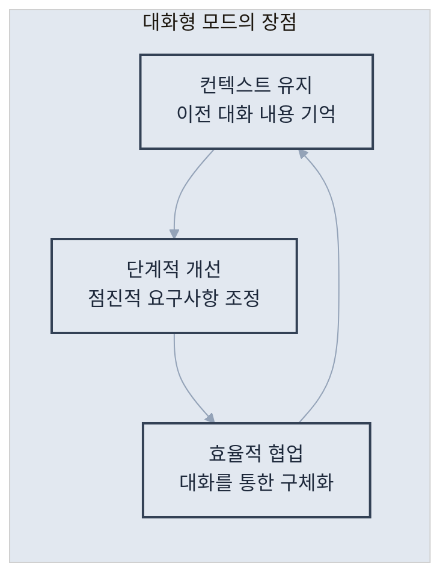
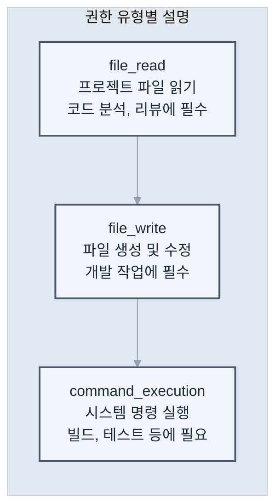
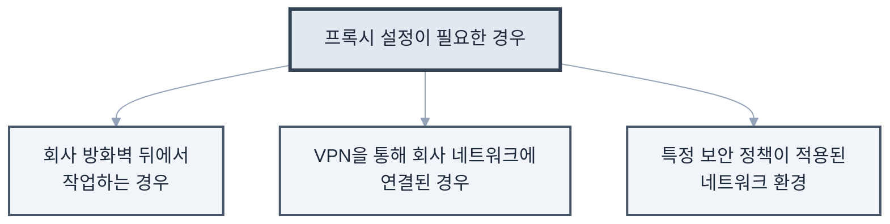
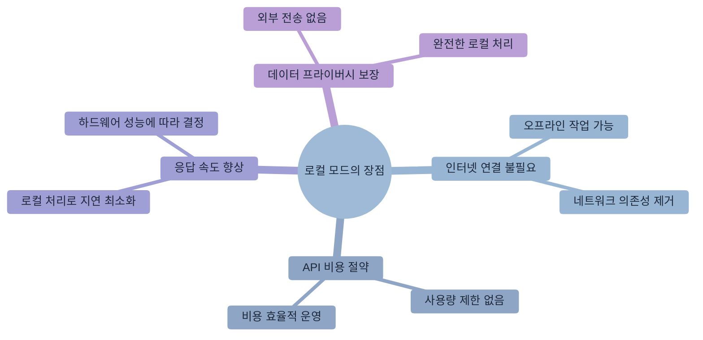

# 제2장: 설치와 초기 설정

> "시작이 반이다" - 한국 속담

이제 Claude Code를 설치해보겠습니다. 이 장에서는 **각 운영체제별로 단계별 설치 가이드**를 제공하며, 설치 과정에서 발생할 수 있는 문제들과 해결 방법도 함께 다룹니다.

## 2.1 시스템 요구사항

### 최소 요구사항

먼저 시스템이 Claude Code를 실행할 수 있는지 확인해보겠습니다. 최소 요구사항은 일반적인 개발 환경과 유사하며, 대부분의 현대적인 시스템에서 실행 가능합니다.

| 구성 요소 | 최소 요구사항 | 권장 사항 |
|----------|-------------|----------|
| 운영체제 | macOS 12+, Windows 10+, Ubuntu 20.04+ | 최신 버전 |
| RAM | 8GB | 16GB 이상 |
| 저장공간 | 2GB 여유 공간 | 10GB 이상 |
| 인터넷 | 안정적인 연결 필요 | 고속 인터넷 |
| Node.js | 18.0 이상 | 20.0 이상 |

### 사전 준비사항

설치 전 시스템 환경을 확인하겠습니다. 터미널을 열고 다음 명령어들을 실행하여 필요한 도구들이 설치되어 있는지 확인하세요.

**터미널 실행 방법**

- **Mac**: `Cmd + Space` → "터미널" 검색
- **Windows**: `Win + R` → "cmd" 입력
- **Linux**: `Ctrl + Alt + T`

```bash
# Node.js 버전 확인
node --version

# npm 버전 확인
npm --version

# Git 설치 확인 (선택사항이지만 권장)
git --version
```

**Node.js가 설치되어 있지 않거나 버전이 낮다면**

1. [Node.js 공식 사이트](https://nodejs.org)에서 LTS 버전을 다운로드하세요
2. 또는 패키지 매니저를 사용하세요
   - **Mac**: `brew install node` (Homebrew 필요)
   - **Windows**: `choco install nodejs` (Chocolatey 필요)
   - **Linux**: `sudo apt install nodejs npm` (Ubuntu/Debian)

> **권장사항**: LTS(Long Term Support) 버전을 사용하면 안정성과 호환성을 보장받을 수 있습니다.

## 2.2 설치 가이드 (OS별)

이제 운영체제별로 Claude Code를 설치하겠습니다. 각 OS에 최적화된 설치 방법을 제공합니다.

### macOS에서 설치하기

macOS에서는 두 가지 설치 방법을 제공합니다.

**방법 1: npm을 통한 설치 (권장)**

가장 간단하고 안정적인 방법입니다.

```bash
# Claude Code 설치
npm install -g @anthropic-ai/claude-code

# 설치 확인
claude --version
```

**방법 2: Homebrew를 통한 설치**

```bash
# Homebrew tap 추가
brew tap anthropic-ai/claude-code

# Claude Code 설치
brew install claude-code

# 설치 확인
claude --version
```

**macOS 특화 설정**

```bash
# 터미널 권한 설정 (필요한 경우)
# 시스템 환경설정 > 보안 및 개인정보 > 개인정보 > 전체 디스크 접근 권한
# Terminal.app 또는 사용 중인 터미널 앱 추가

# Spotlight 검색 제외 (선택사항)
# .claude-code 디렉토리를 Spotlight 검색에서 제외하여 성능 향상
```

### Windows에서 설치하기

Windows에서는 WSL 2(Windows Subsystem for Linux)를 통해 Claude Code를 설치하는 것이 권장됩니다. 현재 Claude Code는 Windows 네이티브 클라이언트를 지원하지 않으므로, Linux 환경이 필요합니다.

**시스템 요구사항**

| 항목 | 최소 조건 |
|------|-----------|
| OS | Windows 10 (21H2) 또는 Windows 11 + WSL 2 |
| RAM | 4GB 이상 |
| 네트워크 | 인터넷 연결 (OAuth 인증 및 API 호출) |
| 소프트웨어 | WSL 2, Node.js 18+, Git(선택사항) |

**1단계: WSL 2 설치**

PowerShell을 **관리자 권한**으로 실행하고 다음 명령어를 입력하세요.

```powershell
# WSL 설치 (Ubuntu 22.04 LTS 기본 포함)
wsl --install

# 설치 후 시스템 재부팅
```

기존에 WSL 1을 사용하고 있다면 다음과 같이 업그레이드하세요.

```powershell
# WSL 2로 업그레이드
wsl --set-version Ubuntu 2

# 설치 상태 확인
wsl --status
wsl --list --verbose
```

**2단계: Node.js 설치 (WSL 내부)**

WSL 터미널(Ubuntu)을 열고 NVM을 통해 Node.js를 설치하세요.

```bash
# NVM 설치
curl -o- https://raw.githubusercontent.com/nvm-sh/nvm/v0.39.7/install.sh | bash

# 변경사항 적용
source ~/.bashrc

# Node.js 18 LTS 설치 및 사용
nvm install 18
nvm use 18

# 설치 확인
node --version
npm --version
```

> **중요**: `which node` 명령 실행 시 경로가 `/home/<username>/.nvm/...`으로 표시되어야 합니다. `/mnt/c/...` 경로가 나타나면 Windows와 경로가 충돌하는 상황이므로 위 과정을 다시 진행하세요.

**3단계: Claude Code 설치**

```bash
# Claude Code 설치
npm install -g @anthropic-ai/claude-code

# 설치 확인
claude --version
```

**설치 오류 해결**

| 오류 | 해결방법 |
|------|----------|
| `OS detection failed` | `npm config set os linux` 실행 후 `npm install -g @anthropic-ai/claude-code --force --no-os-check` |
| `exec: node: not found` | Node.js 설치 재확인, `which node` 경로 점검 |
| 권한 오류 | `npm config set prefix '~/.npm-global'` 실행 후 재설치 |

### Linux (Ubuntu/Debian)에서 설치하기

```bash
# 시스템 패키지 업데이트
sudo apt update && sudo apt upgrade

# Node.js 설치 (아직 없는 경우)
curl -fsSL https://deb.nodesource.com/setup_20.x | sudo -E bash -
sudo apt install nodejs

# Claude Code 설치
sudo npm install -g @anthropic-ai/claude-code

# 설치 확인
claude --version

# 권한 설정 (필요한 경우)
sudo chmod +x /usr/local/bin/claude
```

## 2.3 첫 번째 명령어 실행하기

설치가 완료되었습니다. 이제 Claude Code의 기본 설정을 진행하겠습니다.

### API 키 설정

Claude Code를 사용하려면 API 키 설정이 필요합니다. 무료 사용량으로 시작할 수 있습니다.

**1단계: API 키 발급받기**

1. [Anthropic Console](https://console.anthropic.com)에 접속하세요
2. 계정을 만들거나 로그인하세요
3. "API Keys" 섹션에서 새 키를 생성하세요

**2단계: API 키 설정하기**
```bash
# API 키 설정 명령어 실행
claude login

# 프롬프트가 나타나면 복사한 API 키를 붙여넣기
# (키를 입력할 때는 화면에 표시되지 않는 것이 정상입니다)
```

> **보안 주의사항**: API 키는 개인 계정과 연결되므로 타인과 공유하지 않도록 주의하세요.

### 첫 번째 대화

이제 Claude Code와 첫 대화를 시작해보겠습니다.

```bash
# 첫 인사 (Claude가 답변하면 성공!)
claude "안녕하세요, Claude! 처음 뵙겠습니다."

# 간단한 작업 요청해보기
claude "현재 시스템 정보를 알려주세요"

# 디렉토리 탐색해보기
claude "현재 폴더에 어떤 파일들이 있는지 보여주세요"
```

**응답이 정상적으로 출력되면 설치와 기본 설정이 완료된 것입니다.** Claude Code 사용 준비가 완료되었습니다.

### 대화형 모드 vs 명령 모드

**명령 모드 (일회성 작업)**
```bash
claude "package.json 파일을 읽고 요약해줘"
```

**대화형 모드 (지속적인 작업)**

명령 모드는 단발성 작업에 적합하지만, 복잡한 프로젝트나 여러 단계를 거쳐야 하는 작업에는 대화형 모드가 더 효율적입니다.

```bash
# 대화형 모드 시작
claude

# 이제 지속적으로 대화 가능
> 새로운 React 프로젝트를 시작하고 싶어
> TypeScript를 사용하고, 테스트 환경도 설정해줘
> Material-UI도 추가해줘
```



대화형 모드의 장점

## 2.4 기본 설정 최적화

Claude Code를 더 효율적으로 사용하기 위해서는 개인의 작업 환경과 선호도에 맞게 설정을 조정하는 것이 중요합니다. 이 섹션에서는 주요 설정 옵션들과 최적화 방법을 알아보겠습니다.

### 전역 설정 파일

Claude Code의 모든 설정은 홈 디렉토리의 설정 파일에서 관리됩니다. 이 파일을 통해 개인화된 작업 환경을 구성할 수 있습니다.

**설정 파일 위치**: `~/.claude-code/config.json`

```json
{
  "api_key": "sk-ant-...",              // API 인증 키
  "default_model": "claude-3-opus-20240229", // 기본 사용 모델
  "theme": "dark",                       // 인터페이스 테마 (dark/light)
  "editor": "vscode",                    // 선호 에디터
  "auto_commit": false,                  // 자동 커밋 여부
  "language": "ko",                      // 기본 언어 설정
  "permissions": {
    "file_write": true,                  // 파일 쓰기 권한
    "file_read": true,                   // 파일 읽기 권한
    "command_execution": true            // 명령 실행 권한
  }
}
```

**주요 설정 옵션 설명**

- `default_model`: 작업 유형에 따라 적절한 모델 선택 (opus: 복잡한 작업, sonnet: 일반 작업, haiku: 빠른 응답)
- `auto_commit`: 코드 변경 시 자동으로 Git 커밋할지 결정
- `permissions`: 보안을 위해 필요한 권한만 활성화하는 것을 권장

### 권한 설정

Claude Code는 강력한 도구이므로 적절한 권한 관리가 중요합니다. 작업 환경과 보안 요구사항에 따라 권한을 조정할 수 있습니다.



**권한 유형별 설명**

보안과 편의성의 균형을 위한 권한 설정 전략

```bash
# 모든 권한 부여 (개발 환경)
claude --allow-all

# 읽기 전용 모드 (코드 리뷰용)
claude --read-only

# 특정 권한만 부여
claude --allow-read --allow-write --deny-execute
```

### 에디터 통합

개발 효율성을 높이기 위해 Claude Code를 기존 에디터와 통합할 수 있습니다. 에디터 통합을 통해 코드 편집과 AI 지원을 원활하게 연결할 수 있습니다.


**지원되는 에디터**

선호하는 에디터와 통합 설정

```bash
# VSCode 통합
claude config set editor vscode

# Vim 통합
claude config set editor vim

# 에디터에서 직접 Claude Code 호출
# VSCode: Cmd+Shift+P > "Claude: Ask"
```

### 프록시 설정 (기업 환경)

많은 기업에서는 보안상의 이유로 프록시 서버를 통해 외부 인터넷에 접속합니다. Claude Code도 이런 환경에서 사용할 수 있도록 프록시 설정을 지원합니다.



**프록시 설정이 필요한 경우**

기업 환경에서 프록시를 사용하는 경우의 설정 방법

```bash
# HTTP 프록시 설정
export HTTP_PROXY=http://proxy.company.com:8080
export HTTPS_PROXY=http://proxy.company.com:8080

# Claude Code 전용 프록시 설정
claude config set proxy http://proxy.company.com:8080
```

## 2.5 문제 해결 가이드

Claude Code 설치 및 초기 사용 과정에서 발생할 수 있는 일반적인 문제들과 해결 방법을 정리했습니다. 문제 상황별로 단계적인 해결 방안을 제시하므로, 차근차근 따라하면 대부분의 문제를 해결할 수 있습니다.

### 자주 발생하는 문제와 해결 방법

다음은 Claude Code 사용자들이 가장 자주 경험하는 문제들과 검증된 해결 방법들입니다.

**1. "command not found: claude"**

이 오류는 Claude Code가 설치되었지만 시스템 PATH에 등록되지 않았을 때 발생합니다.

**원인 분석**

- npm 전역 설치 경로가 PATH에 포함되지 않음
- 잘못된 설치 경로
- Shell 환경 변수 설정 문제

**해결 방법**
```bash
# 1단계: npm 전역 경로 확인
npm config get prefix

# 2단계: PATH에 추가 (bash/zsh)
echo 'export PATH="$PATH:$(npm config get prefix)/bin"' >> ~/.bashrc
source ~/.bashrc

# 3단계: 설치 확인
claude --version
```

**추가 해결책**

- macOS에서 `.zshrc` 파일 수정 필요할 수 있음
- Windows에서는 시스템 환경 변수에서 PATH 수정

**2. "EACCES: permission denied"**

이 오류는 npm 전역 설치 시 권한 문제로 발생합니다. 특히 Linux나 macOS에서 자주 나타납니다.

**원인 분석**

- npm 전역 디렉토리에 대한 쓰기 권한 부족
- sudo로 설치했을 때 소유권 문제
- 시스템 보호된 디렉토리에 설치 시도

**해결 방법**
```bash
# 방법 1: 권한 수정 (권장)
sudo chown -R $(whoami) $(npm config get prefix)/{lib/node_modules,bin,share}

# 방법 2: npx를 통한 실행 (임시 해결)
npx @anthropic-ai/claude-code

# 방법 3: npm 전역 디렉토리 변경
mkdir ~/.npm-global
npm config set prefix '~/.npm-global'
echo 'export PATH=~/.npm-global/bin:$PATH' >> ~/.bashrc
source ~/.bashrc
```

**3. "API rate limit exceeded"**

API 사용량 제한에 도달했을 때 발생하는 오류입니다. Anthropic의 API 정책에 따라 시간당 요청 횟수가 제한됩니다.

**원인 분석**
- 단시간 내 너무 많은 요청
- API 플랜의 사용량 한계 도달
- 네트워크 문제로 인한 중복 요청

**해결 방법**
```bash
# 1단계: 현재 상태 확인
claude status

# 2단계: 자동 재시도 간격 설정 (밀리초)
claude config set retry_delay 5000

# 3단계: 최대 재시도 횟수 설정
claude config set max_retries 3
```

**예방 방법**

- 대용량 작업 시 작은 단위로 분할하여 실행
- `--rate-limit` 옵션 사용하여 요청 속도 조절
- API 사용량 모니터링으로 제한 사전 파악

**4. "SSL certificate problem"**

기업 환경에서 자체 인증서를 사용하거나 네트워크 보안 정책으로 인해 SSL 인증서 검증에 실패할 때 발생합니다.

**원인 분석**

- 회사 방화벽의 SSL 검사
- 자체 서명된 인증서 사용
- 오래된 시스템의 인증서 저장소 문제

**해결 방법**
```bash
# ⚠️ 임시 해결책 (보안 위험 있음)
export NODE_TLS_REJECT_UNAUTHORIZED=0

# ✅ 권장 해결책: 회사 인증서 설치
# 1단계: IT 부서에서 인증서 파일 받기
# 2단계: npm에 인증서 등록
npm config set cafile /path/to/company-cert.pem

# 3단계: Claude Code 전용 설정
claude config set tls_verify true
claude config set ca_bundle /path/to/company-cert.pem
```

**보안 고려사항**

- `NODE_TLS_REJECT_UNAUTHORIZED=0`은 보안 위험이 있으므로 임시로만 사용
- 가능하면 IT 부서와 협력하여 적절한 인증서 설정

### 성능 최적화 팁

Claude Code의 응답 속도와 효율성을 향상시키기 위한 설정들입니다. 프로젝트 규모와 작업 패턴에 따라 적절히 조정하여 사용하세요.

**1. 캐시 활성화**

반복적인 요청에 대한 응답을 캐시하여 속도를 향상시킵니다.

```bash
# 응답 캐싱 활성화
claude config set cache_enabled true

# 캐시 유지 시간 설정 (초 단위, 기본: 3600초 = 1시간)
claude config set cache_ttl 3600

# 캐시 크기 제한 설정 (MB 단위)
claude config set cache_max_size 100
```

**캐시 활용 팁**

- 동일한 코드를 반복 분석할 때 유용
- 큰 프로젝트에서 점진적 작업 시 효과적
- 캐시 무효화: `claude cache clear`

**2. 컨텍스트 크기 조정**

프로젝트 규모에 따라 Claude Code가 한 번에 처리할 수 있는 컨텍스트 크기를 조정합니다.

```bash
# 큰 프로젝트의 경우 컨텍스트 확대
claude config set max_context_length 100000

# 작은 프로젝트나 빠른 응답이 필요한 경우
claude config set max_context_length 50000

# 현재 설정 확인
claude config get max_context_length
```

**설정 가이드라인**
- **소규모 프로젝트 (< 50개 파일)**: 50,000
- **중간 규모 프로젝트 (50-200개 파일)**: 100,000
- **대규모 프로젝트 (200개+ 파일)**: 200,000

**주의사항**: 컨텍스트가 클수록 응답 시간이 길어지고 API 비용이 증가할 수 있습니다.

**3. 로컬 모델 사용 (베타)**

개발 중인 기능으로, 로컬에서 모델을 실행하여 인터넷 연결 없이도 Claude Code를 사용할 수 있습니다.

```bash
# 로컬 모드 활성화
claude config set local_mode true

# 로컬 모델 다운로드 (용량 주의: 수 GB)
claude download-model claude-instant

# 다운로드된 모델 확인
claude list-models --local

# 특정 모델로 실행
claude --model local:claude-instant "코드를 분석해줘"
```



**로컬 모드의 장점**

**요구사항**
- 충분한 저장공간 (모델당 2-8GB)
- 강력한 하드웨어 (GPU 권장)
- 베타 기능으로 일부 제한사항 존재

## 실습: Hello World 프로젝트

이론적인 설정을 마쳤으니, 이제 실제로 Claude Code를 사용해보겠습니다. 간단한 웹 서버 프로젝트를 통해 Claude Code의 기본 사용법을 체험해보겠습니다.

**학습 목표**
- Claude Code의 자연어 명령 사용법 익히기
- 프로젝트 생성부터 실행까지의 전체 과정 체험
- 생성된 코드의 품질과 구조 이해

**실습 과정**

```bash
# 1단계: 프로젝트 디렉토리 생성
mkdir hello-claude && cd hello-claude

# 2단계: Claude Code로 프로젝트 초기화
claude "Node.js로 간단한 Hello World 웹 서버를 만들어줘. 
포트 3000에서 실행되고, '/' 경로로 접속하면 'Hello from Claude Code!'를 
표시하도록 해줘. package.json과 README.md도 함께 만들어줘."

# 3단계: 생성된 파일 구조 확인
ls -la
# 예상 결과
# package.json  - 프로젝트 설정 파일
# server.js     - 웹 서버 메인 파일
# README.md     - 프로젝트 설명 문서

# 4단계: 의존성 설치
npm install

# 5단계: 서버 실행
npm start

# 6단계: 브라우저에서 테스트
# http://localhost:3000 접속하여 "Hello from Claude Code!" 메시지 확인
```

**실습 포인트**
- 자연어로 복잡한 요구사항을 한 번에 전달
- Claude Code가 생성하는 코드의 품질과 구조 관찰
- 생성된 README.md에서 추가 사용법 확인

**실습 완료 체크리스트**
- [ ] 프로젝트가 성공적으로 생성되었는가?
- [ ] 서버가 정상적으로 시작되는가?
- [ ] 브라우저에서 올바른 메시지가 표시되는가?
- [ ] 생성된 코드가 이해 가능한 구조인가?

Claude Code와 함께 첫 번째 프로젝트를 성공적으로 만들었습니다!

## 설치 완료 및 다음 단계

이제 Claude Code의 설치와 기본 설정이 완료되었습니다. 첫 번째 실습을 통해 Claude Code의 강력함을 경험했을 것입니다.

**이 장에서 배운 내용**
- 운영체제별 설치 방법과 환경 설정
- API 키 설정과 첫 번째 대화
- 문제 해결 방법과 성능 최적화
- 실제 프로젝트 생성 경험

**다음 장 미리보기**
제3장에서는 Claude Code의 핵심 기능들을 체계적으로 학습합니다.
- **파일 시스템 탐색**: 프로젝트 구조 파악과 효율적인 코드 분석
- **코드 작성과 수정**: 자연어를 통한 정교한 코드 생성과 리팩토링
- **테스트와 디버깅**: 품질 높은 코드를 위한 검증과 문제 해결
- **Git 통합**: 버전 관리와 협업을 위한 워크플로우

**유용한 참고 명령어**
```bash
# 도움말 확인
claude help

# 대화형 튜토리얼 시작
claude tutorial

# 현재 설정 확인
claude config list

# 버전 정보 확인
claude --version
```

**문제 해결 리소스**
- 공식 문서: https://docs.anthropic.com/claude-code
- 커뮤니티 포럼: https://community.anthropic.com
- GitHub 이슈: https://github.com/anthropic/claude-code/issues