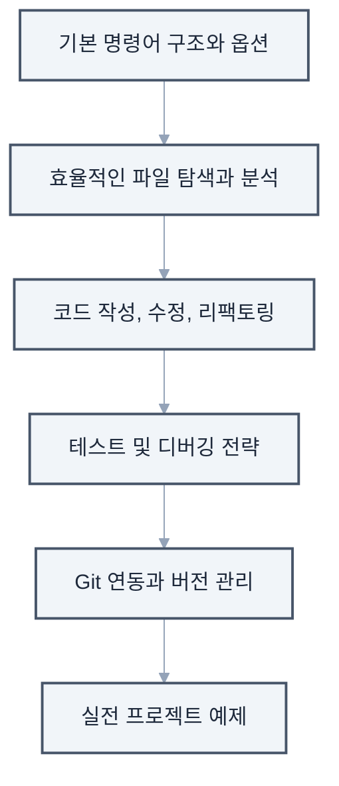
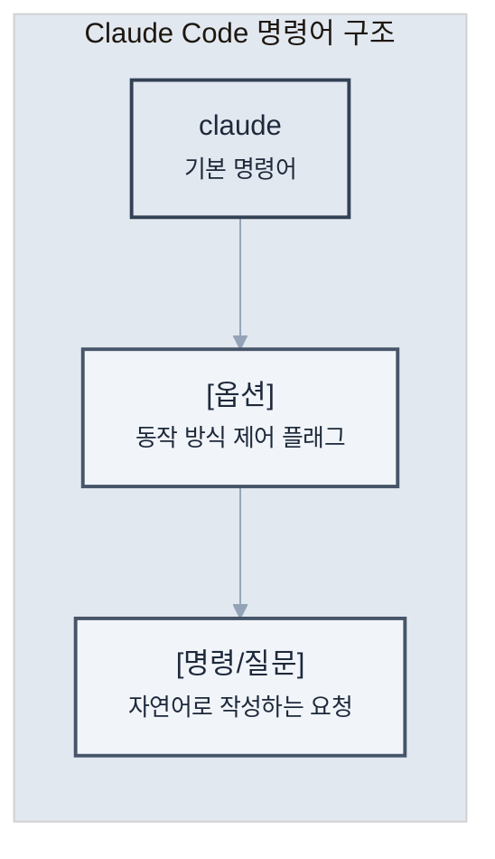
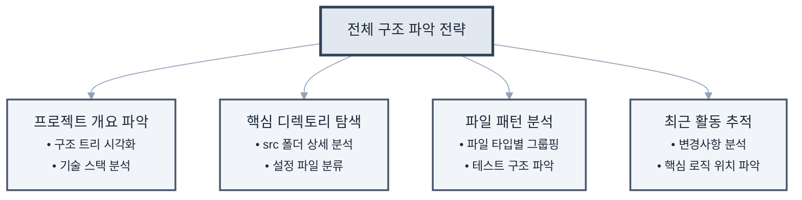
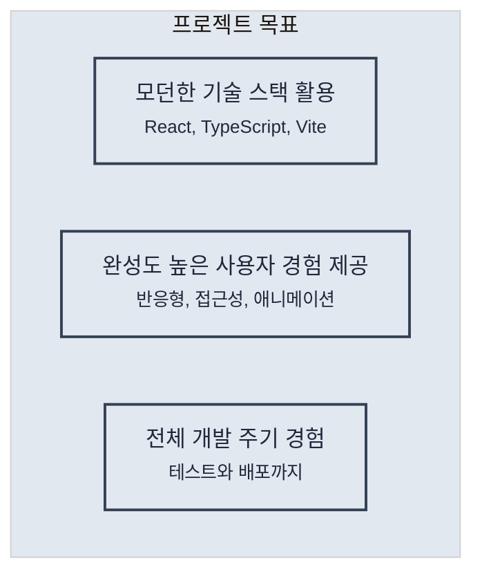
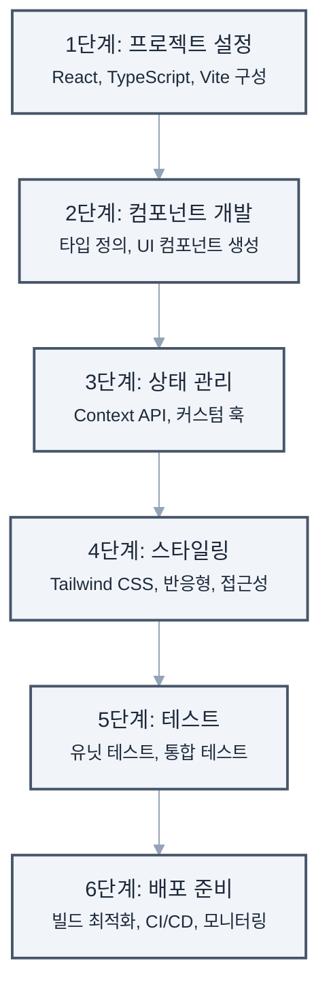

# 제3장: 기본 사용법 마스터

> "천 리 길도 한 걸음부터" - 노자

이 장에서는 Claude Code의 핵심 기능들을 체계적으로 학습하겠습니다. **실습 중심의 예제**를 통해 일상적인 개발 업무에 Claude Code를 효과적으로 적용하는 방법을 익히겠습니다.



이 장에서 다루는 내용:

## 3.1 기본 명령어 구조

### 명령어 해부학



Claude Code 명령어의 구조는 직관적이면서도 강력합니다:

### 주요 옵션들

Claude Code는 다양한 옵션을 통해 동작을 세밀하게 제어할 수 있습니다. 각 옵션의 용도와 활용 시나리오를 이해하면 더 효과적으로 사용할 수 있습니다.

**기본 옵션들:**
```bash
# 도움말 보기 - 사용 가능한 모든 명령어와 옵션 확인
claude --help
claude -h

# 버전 확인 - 현재 설치된 Claude Code 버전 확인
claude --version
claude -v

# 대화 기록 지우기 - 새로운 컨텍스트로 시작하고 싶을 때
claude --clear
claude -c
```

**모델 선택 옵션:**
```bash
# 복잡한 작업을 위한 고성능 모델 사용
claude --model claude-3-opus "복잡한 알고리즘 구현해줘"

# 빠른 응답이 필요한 간단한 작업
claude -m claude-3-haiku "간단한 설명만 해줘"

# 균형잡힌 성능과 속도
claude -m claude-3-sonnet "코드 리뷰해줘"
```

**출력 형식 제어:**
```bash
# JSON 형식으로 구조화된 데이터 받기
claude --json "프로젝트 구조를 JSON으로 출력해줘"

# 마크다운 형식으로 문서 생성
claude --markdown "README 파일 내용을 마크다운으로 보여줘"

# 일반 텍스트 출력 (기본값)
claude --plain "간단한 설명을 텍스트로 보여줘"
```

### 자연어 명령의 힘

Claude Code의 핵심 특징은 복잡한 명령어 문법 대신 자연스러운 언어로 의도를 전달할 수 있다는 점입니다:

```bash
# 기술적인 요청
claude "UserService 클래스에 이메일 검증 메서드를 추가해줘"

# 탐색적인 질문
claude "이 프로젝트에서 인증은 어떻게 처리되고 있어?"

# 창의적인 요청
claude "이 함수를 더 효율적으로 만들 수 있는 방법이 있을까?"

# 복합적인 작업
claude "버그를 찾아서 수정하고, 테스트도 작성한 다음, 커밋 메시지까지 만들어줘"
```

## 3.2 파일 탐색과 읽기

### 프로젝트 구조 파악하기

새로운 프로젝트에 투입되었을 때 빠르게 전체 구조를 파악하는 것은 중요합니다. Claude Code를 활용하면 효율적으로 코드베이스를 탐색할 수 있습니다.



**전체 구조 파악 전략:**

### 효율적인 파일 읽기

단순히 파일을 열어보는 것이 아니라, 목적에 맞는 정보를 효과적으로 추출하는 방법입니다:

```bash
# 단일 파일 읽기
claude "package.json 파일을 읽어줘"

# 여러 파일 동시에 읽기
claude "모든 설정 파일들(config로 시작하는)을 읽고 요약해줘"

# 특정 부분만 읽기
claude "app.js 파일에서 라우터 설정 부분만 보여줘"

# 파일 비교
claude "개발 환경과 프로덕션 환경 설정 파일을 비교해줘"
```

### 코드 분석 요청

기존 코드의 동작 원리를 이해하거나 잠재적 문제를 발견하는 데 유용한 분석 요청들입니다:

```bash
# 함수 분석
claude "calculateTotalPrice 함수가 어떻게 동작하는지 설명해줘"

# 의존성 분석
claude "이 프로젝트가 사용하는 주요 라이브러리들과 용도를 설명해줘"

# 아키텍처 분석
claude "이 프로젝트의 전체적인 아키텍처를 다이어그램으로 설명해줘"

# 보안 취약점 검사
claude "보안상 문제가 될 수 있는 코드가 있는지 검사해줘"
```

## 3.3 코드 작성과 수정

### 새 파일 생성

프로젝트의 컨벤션과 구조에 맞는 새 파일을 자동으로 생성할 수 있습니다:

```bash
# 기본적인 파일 생성
claude "utils 폴더에 날짜 관련 유틸리티 함수들을 만들어줘"

# 템플릿 기반 생성
claude "Express 라우터 템플릿으로 user 라우터를 만들어줘"

# 테스트 파일 자동 생성
claude "UserService에 대한 Jest 테스트 파일을 만들어줘"

# 문서 생성
claude "API 엔드포인트 문서를 Swagger 형식으로 만들어줘"
```

### 코드 수정 패턴

다양한 수정 작업을 체계적으로 수행하는 방법들입니다. 각 패턴별로 실제 사용 시나리오와 베스트 프랙티스를 함께 소개합니다.

**1. 단순 수정 - 코드 현대화**
```bash
# ES5를 ES6+ 문법으로 업그레이드
claude "모든 var를 const나 let으로 바꿔줘. 재할당되는 변수만 let을 사용해"

# 콜백을 async/await로 변환
claude "콜백 기반 코드를 async/await 패턴으로 변경해줘"

# 문자열 연결을 템플릿 리터럴로
claude "문자열 연결 연산자(+)를 템플릿 리터럴로 바꿔줘"
```

**2. 리팩토링 - 코드 구조 개선**
```bash
# 긴 함수 분리
claude "이 함수가 50줄이 넘는데, 논리적 단위로 분리해서 가독성을 높여줘"

# 중복 코드 제거
claude "중복되는 코드를 찾아서 재사용 가능한 함수로 추출해줘"

# 조건문 단순화
claude "복잡한 if-else 체인을 early return 패턴이나 switch문으로 개선해줘"
```

**3. 기능 추가 - 점진적 개선**
```bash
# 에러 처리 추가
claude "이 API 호출 함수에 적절한 에러 처리와 재시도 로직을 추가해줘"

# 로딩 상태 관리
claude "이 컴포넌트에 로딩, 성공, 에러 상태를 관리하는 로직을 추가해줘"

# 유효성 검사 추가
claude "사용자 입력 폼에 실시간 유효성 검사를 추가해줘"
```

**4. 버그 수정 - 안정성 향상**
```bash
# 잠재적 오류 찾기
claude "null/undefined 참조 오류가 발생할 수 있는 부분을 찾아서 옵셔널 체이닝으로 수정해줘"

# 메모리 누수 방지
claude "이벤트 리스너나 타이머가 제대로 정리되지 않는 부분을 찾아서 수정해줘"

# 경쟁 조건 해결
claude "비동기 작업에서 경쟁 조건이 발생할 수 있는 부분을 찾아서 수정해줘"
```

### 코드 스타일 통일

프로젝트 전반에 일관된 코딩 스타일을 적용하는 작업입니다:

```bash
# 포매팅
claude "프로젝트 전체를 Prettier 규칙에 맞게 포매팅해줘"

# 네이밍 컨벤션
claude "camelCase를 snake_case로 변경해줘"

# 주석 추가
claude "복잡한 로직에 설명 주석을 추가해줘"

# 타입 추가
claude "JavaScript 파일에 TypeScript 타입을 추가해줘"
```

## 3.4 테스트 실행과 디버깅

### 테스트 작성

품질 높은 소프트웨어를 위한 체계적인 테스트 작성 방법입니다:

```bash
# 단위 테스트
claude "calculateDiscount 함수에 대한 단위 테스트를 작성해줘"

# 통합 테스트
claude "사용자 등록 API에 대한 통합 테스트를 작성해줘"

# 엣지 케이스
claude "이 함수의 엣지 케이스를 찾아서 테스트를 추가해줘"

# 테스트 커버리지
claude "테스트 커버리지를 확인하고 누락된 부분에 테스트를 추가해줘"
```

### 디버깅 전략

문제 발생 시 효과적으로 원인을 파악하고 해결하는 체계적인 접근법입니다:

**1. 오류 메시지 분석**
```bash
claude "이 오류 메시지가 무엇을 의미하는지 설명하고 해결 방법을 제시해줘:
TypeError: Cannot read property 'name' of undefined"
```

**2. 로그 추가**
```bash
claude "문제가 발생하는 것 같은 부분에 디버그 로그를 추가해줘"
```

**3. 단계별 추적**
```bash
claude "이 함수의 실행 흐름을 단계별로 추적할 수 있도록 코드를 수정해줘"
```

**4. 성능 분석**
```bash
claude "이 코드의 성능 병목 지점을 찾아서 최적화해줘"
```

### 실시간 디버깅 세션

복잡한 문제를 대화형으로 해결하는 과정의 예시입니다. 실제 디버깅 시나리오를 통해 Claude Code와의 효과적인 협업 방법을 알아봅시다.

**시나리오 1: 서버 시작 오류 해결**
```bash
# 대화형 디버깅 시작
claude

> 서버가 시작되지 않아. 포트 3000에서 이미 사용 중이라는 오류가 나와.
< 포트 3000을 사용하는 프로세스를 확인해보겠습니다. 다음 명령을 실행해드릴게요:
  lsof -i :3000

> 확인했더니 이전에 실행한 node 프로세스가 PID 12345로 실행 중이야.
< 해당 프로세스를 안전하게 종료하고, 향후 이런 문제를 방지하는 스크립트를 만들어드리겠습니다.
  1. 프로세스 종료 스크립트 생성
  2. package.json에 재시작 스크립트 추가
  3. graceful shutdown 코드 구현

> 좋아, 진행해줘. 그리고 왜 서버가 제대로 종료되지 않았는지도 알고 싶어.
< 서버 코드를 분석해보니 다음과 같은 문제들을 발견했습니다:
  1. SIGTERM 시그널 핸들러가 없어서 프로세스가 강제 종료됨
  2. 활성 연결이 정리되지 않고 있음
  3. 데이터베이스 연결 풀이 닫히지 않음
  
  이제 이 문제들을 하나씩 해결해드리겠습니다...
```

**시나리오 2: 메모리 누수 추적**
```bash
claude

> 서버가 며칠 동안 실행되면 메모리 사용량이 계속 증가해. 메모리 누수가 있는 것 같아.
< 메모리 누수를 추적하기 위해 다음 단계로 진행하겠습니다:
  1. 현재 코드에서 메모리 누수 가능성이 있는 패턴 검색
  2. 메모리 프로파일링 도구 설정
  3. 의심되는 코드 영역에 모니터링 추가

> 어떤 패턴들이 위험한가?
< 다음과 같은 패턴들을 발견했습니다:
  - 이벤트 리스너가 제거되지 않는 곳 3개
  - 전역 변수에 계속 데이터가 추가되는 캐시
  - 순환 참조가 있는 객체 구조
  각각 수정 방법을 보여드릴까요?
```

## 3.5 Git 연동과 버전 관리

### 기본 Git 작업

일상적인 버전 관리 작업을 Claude Code와 함께 수행하는 방법입니다:

```bash
# 상태 확인
claude "git 상태를 확인하고 변경사항을 요약해줘"

# 스테이징
claude "수정된 파일 중 테스트 관련 파일만 스테이징해줘"

# 커밋
claude "의미 있는 커밋 메시지를 작성해서 커밋해줘"

# 브랜치 관리
claude "새로운 기능을 위한 브랜치를 만들고 체크아웃해줘"
```

### 고급 Git 작업

복잡한 Git 작업도 Claude Code의 도움으로 안전하고 효율적으로 수행할 수 있습니다:

```bash
# 대화형 리베이스
claude "최근 3개 커밋을 정리해서 하나로 합쳐줘"

# 충돌 해결
claude "머지 충돌을 해결해줘. 두 변경사항을 모두 유지하는 방향으로"

# 히스토리 분석
claude "이 버그가 언제 도입됐는지 git bisect로 찾아줘"

# 체리픽
claude "hotfix 브랜치의 버그 수정 커밋만 main으로 체리픽해줘"
```

### Pull Request 작성

팀 협업에서 중요한 Pull Request 관련 작업들입니다:

```bash
# PR 생성
claude "이 기능에 대한 Pull Request를 생성해줘. 
변경사항을 요약하고, 테스트 방법도 포함해줘"

# 코드 리뷰 대응
claude "리뷰어가 지적한 사항들을 수정하고 답변을 작성해줘"

# PR 템플릿 활용
claude "프로젝트의 PR 템플릿에 맞춰서 설명을 작성해줘"
```

## 실전 예제: Todo 앱 만들기

앞서 학습한 기본 사용법들을 종합적으로 활용하여 실제 프로젝트를 구축해보겠습니다. Todo 애플리케이션을 단계별로 개발하면서 Claude Code의 실전 활용법을 익혀봅시다.



**프로젝트 목표:**



### Todo 앱 개발 단계별 가이드
```

**프로젝트 완성 체크리스트:**
- [ ] 모든 CRUD 기능이 정상 작동하는가?
- [ ] 반응형 디자인이 모든 화면 크기에서 잘 동작하는가?
- [ ] 테스트 커버리지가 80% 이상인가?
- [ ] 라이트하우스 점수가 90점 이상인가?
- [ ] 접근성 기준을 충족하는가?

## 프로 팁: 효율성 극대화

### 1. 별칭(Alias) 설정

자주 사용하는 명령어에 단축 별칭을 설정하여 작업 효율성을 높일 수 있습니다:

```bash
# ~/.bashrc 또는 ~/.zshrc에 추가
alias cc="claude"
alias ccc="claude --clear"
alias ccr="claude 'npm run'"
```

### 2. 템플릿 활용

반복적으로 사용하는 명령어 패턴을 템플릿으로 저장하여 재사용성을 높입니다.

**템플릿 디렉토리 구조 만들기:**
```bash
# Claude Code 템플릿 디렉토리 생성
mkdir -p ~/.claude-templates/{components,features,tests,docs}
```

**실용적인 템플릿 예시들:**

1. **React 컴포넌트 템플릿**
```bash
# 컴포넌트 생성 템플릿
cat > ~/.claude-templates/components/react-component.txt << 'EOF'
새로운 React 컴포넌트를 만들어줘:
- 컴포넌트 이름: [COMPONENT_NAME]
- 함수형 컴포넌트로 작성
- TypeScript 사용
- Props 인터페이스 정의
- 기본 스타일 포함
- 스토리북 스토리 파일도 생성
- 유닛 테스트 파일 포함
EOF

# 사용 예시
COMPONENT_NAME="UserProfile" envsubst < ~/.claude-templates/components/react-component.txt | claude
```

2. **API 엔드포인트 템플릿**
```bash
# API 라우트 생성 템플릿
cat > ~/.claude-templates/features/api-endpoint.txt << 'EOF'
새로운 REST API 엔드포인트를 만들어줘:
- 리소스: [RESOURCE_NAME]
- CRUD 작업 모두 포함
- Express.js 라우터 사용
- 입력 검증 미들웨어
- 에러 핸들링
- Swagger 문서 주석
- 통합 테스트 포함
EOF
```

3. **버그 수정 템플릿**
```bash
# 버그 수정 워크플로우 템플릿
cat > ~/.claude-templates/features/bugfix.txt << 'EOF'
다음 버그를 수정해줘:
1. 먼저 관련된 코드를 찾아서 분석해줘
2. 버그의 근본 원인을 설명해줘
3. 수정 방안을 제시하고 구현해줘
4. 재발 방지를 위한 테스트를 추가해줘
5. 수정사항을 커밋 메시지와 함께 정리해줘

버그 설명: [BUG_DESCRIPTION]
EOF
```

### 3. 컨텍스트 유지

복잡하고 긴 작업을 수행할 때는 대화형 모드를 활용하여 문맥을 유지합니다. 효과적인 컨텍스트 관리는 대규모 작업의 성공 열쇠입니다.

**대규모 리팩토링 시나리오:**
```bash
# 대화형 모드로 시작
claude

> 이제부터 레거시 코드를 최신 아키텍처로 마이그레이션할 거야
< 알겠습니다. 먼저 현재 코드베이스를 분석하고 마이그레이션 계획을 수립하겠습니다.

> 1단계: 현재 아키텍처를 분석하고 문제점을 파악해줘
< 분석 결과:
  - 모놀리식 구조로 모듈 간 결합도가 높음
  - 클래스 기반 컴포넌트 사용 (React 16.2)
  - 상태 관리가 prop drilling으로 복잡함
  - 테스트 커버리지 30%
  
  주요 개선 필요 영역을 식별했습니다. 계속 진행할까요?

> 2단계: 마이그레이션 로드맵을 만들어줘
< 단계별 마이그레이션 로드맵:
  Phase 1: 인프라 현대화 (1-2주)
  - 빌드 도구를 Webpack에서 Vite로 마이그레이션
  - TypeScript 도입
  
  Phase 2: 컴포넌트 현대화 (3-4주)
  - 클래스 컴포넌트를 함수형으로 전환
  - Custom Hooks로 로직 추출
  
  Phase 3: 상태 관리 개선 (1주)
  - Context API 또는 Zustand 도입
  
  Phase 4: 테스트 강화 (1주)
  - 테스트 커버리지 80% 목표

> 좋아, Phase 1부터 시작하자. 먼저 Vite 마이그레이션을 진행해줘
< Phase 1 시작: Vite 마이그레이션을 단계별로 진행하겠습니다...
```

**컨텍스트 유지 팁:**
1. **체크포인트 생성**: 각 단계 완료 시 진행 상황 요약 요청
2. **명확한 단계 구분**: 번호나 라벨로 작업 단계 명시
3. **정기적인 검증**: 중간중간 결과 확인 및 방향 조정
4. **컨텍스트 저장**: 중요한 결정사항은 별도 문서로 저장

## 마치며

이 장에서는 Claude Code의 핵심 기능들을 체계적으로 학습했습니다.

**주요 학습 내용:**
- **자연어 기반 명령**: 복잡한 문법 없이 의도를 명확히 전달
- **프로젝트 탐색**: 코드베이스를 빠르게 이해하고 분석
- **코드 관리**: 작성, 수정, 리팩토링의 효율적인 방법
- **품질 관리**: 테스트와 디버깅을 통한 안정성 확보
- **버전 관리**: Git 연동을 통한 체계적인 개발 워크플로우

**실무 적용 포인트:**
- 반복 작업은 Claude Code에 위임하여 창의적 업무에 집중
- 대화형 모드를 활용한 복잡한 문제 해결
- 프로젝트 컨텍스트를 활용한 정확한 작업 수행

다음 장에서는 CLAUDE.md 파일을 통해 프로젝트별로 Claude Code를 맞춤 설정하는 방법을 알아보겠습니다. 각 프로젝트의 특성에 맞는 최적화 전략을 학습해봅시다.