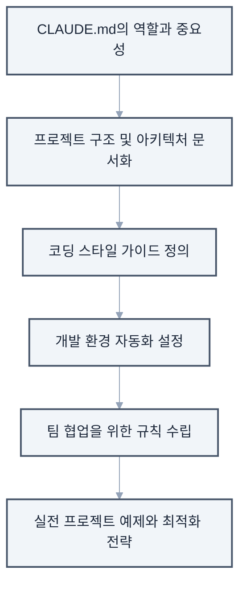
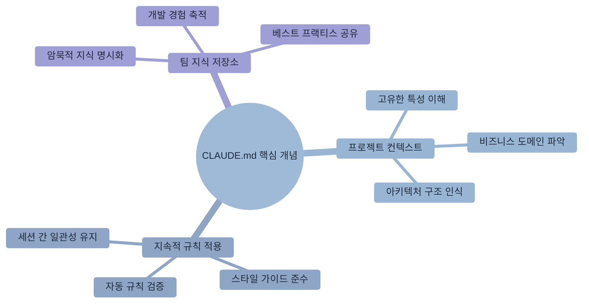
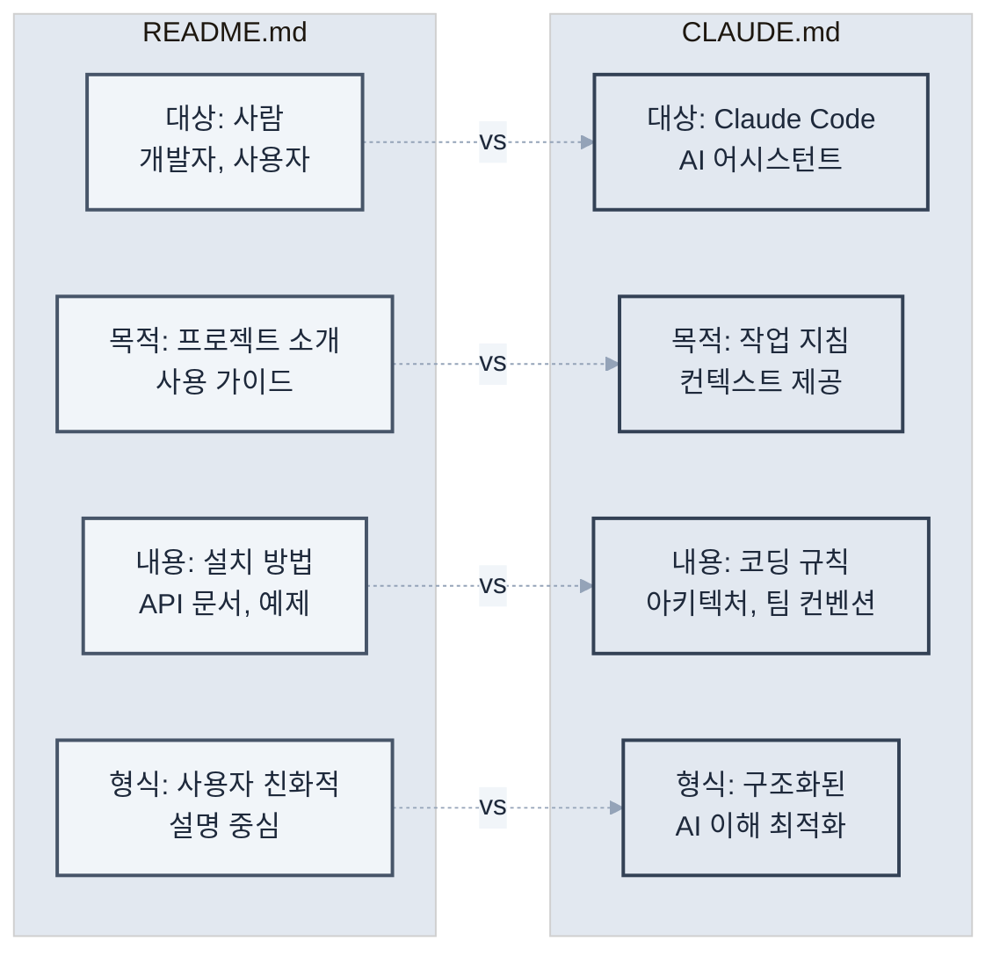

# 제4장: CLAUDE.md로 프로젝트 맞춤 설정

> "좋은 도구는 사용자에게 맞춰진다" - 도널드 노먼

이 장에서는 **CLAUDE.md 파일을 통한 프로젝트 맞춤 설정**에 대해 알아보겠습니다. 각 프로젝트의 고유한 특성과 요구사항에 맞춰 Claude Code를 최적화하는 방법을 체계적으로 학습하겠습니다.

CLAUDE.md는 Claude Code가 프로젝트의 컨텍스트를 이해하고, 팀의 코딩 규칙을 준수하며, 일관된 품질의 코드를 생성하도록 돕는 핵심 도구입니다.



**이 장에서 다룰 내용**

## 4.1 CLAUDE.md의 역할과 중요성

### CLAUDE.md란?

CLAUDE.md는 프로젝트 루트 디렉토리에 위치하는 특별한 마크다운 파일입니다. 이 파일은 Claude Code에게 프로젝트별 지침과 규칙을 제공하여, 보다 정확하고 일관된 결과를 도출할 수 있게 합니다.



**CLAUDE.md의 핵심 개념**

프로젝트 구조 예시

```
프로젝트 루트/
├── CLAUDE.md          # Claude Code 설정 파일
├── README.md          # 일반 프로젝트 문서
├── package.json
└── src/
```

### 왜 중요한가?

CLAUDE.md를 통해 얻을 수 있는 주요 이점들을 구체적인 예시와 함께 살펴보겠습니다.

**1. 일관성 보장**

CLAUDE.md가 없을 때와 있을 때의 차이를 비교해보겠습니다.
```markdown
# CLAUDE.md
## 코드 스타일

- 모든 함수는 화살표 함수로 작성
- 세미콜론 항상 사용
- 들여쓰기는 2칸
```

**2. 팀 규칙 자동 적용**

팀의 Git 커밋 규칙을 CLAUDE.md에 정의하면, Claude Code가 자동으로 규칙에 맞는 커밋 메시지를 생성합니다.

```markdown
## Git 커밋 규칙
- feat: 새로운 기능 추가
- fix: 버그 수정
- docs: 문서 수정
- style: 코드 포매팅 (기능 변경 없음)
- refactor: 코드 리팩토링 (기능 변경 없음)
- test: 테스트 추가 또는 수정
- chore: 빌드 프로세스 또는 보조 도구 변경

## 커밋 메시지 형식
<type>(<scope>): <subject>

예시
feat(auth): 소셜 로그인 기능 추가
fix(api): 사용자 조회 시 null 참조 오류 수정
```

이렇게 정의하면 Claude Code가 자동으로 올바른 형식의 커밋 메시지를 생성합니다.

**3. 프로젝트 특화 지식**

프로젝트의 도메인 지식을 명시하면 Claude Code가 비즈니스 맥락을 이해하고 더 정확한 코드를 생성합니다.

```markdown
## 도메인 용어
- SKU (Stock Keeping Unit): 재고 관리 단위
  - 예: "SHOE-NIKE-AF1-WHT-42" (나이키 에어포스1 흰색 42사이즈)
- PDP (Product Detail Page): 상품 상세 페이지
  - 주요 컴포넌트: 이미지 갤러리, 가격 정보, 재고 상태, 리뷰
- CAC (Customer Acquisition Cost): 고객 획득 비용
  - 계산식: 총 마케팅 비용 / 신규 고객 수

## 비즈니스 규칙
- 재고가 5개 이하일 때 "품절 임박" 표시
- 신규 회원은 첫 구매 시 10% 할인 자동 적용
- 50,000원 이상 구매 시 무료 배송
```

### CLAUDE.md vs README.md



두 파일의 차이점과 각각의 역할을 명확히 이해하는 것이 중요합니다.

**실제 활용 예시**

```markdown
# README.md (사람을 위한 문서)
## 프로젝트 소개
이 프로젝트는 전자상거래 플랫폼입니다.

## 설치 방법

1. 저장소를 클론합니다.
2. `npm install` 실행
3. `npm start`로 서버 시작

---

# CLAUDE.md (Claude Code를 위한 문서)
## 프로젝트 아키텍처
- 패턴: MVC + Repository Pattern
- 프론트엔드: React 18 + TypeScript
- 백엔드: Node.js + Express
- 데이터베이스: PostgreSQL + Redis

## 코드 생성 규칙
- 모든 API 응답은 ResponseDto로 래핑
- 에러는 CustomError 클래스 사용
- 비동기 함수는 반드시 try-catch 포함
```

## 4.2 프로젝트 구조 문서화

### 기본 구조 설명

프로젝트의 디렉토리 구조와 각 파일의 역할을 명확히 정의하면 Claude Code가 더 정확한 작업을 수행할 수 있습니다. 단순한 구조 나열을 넘어서 각 디렉토리의 책임과 파일 명명 규칙까지 포함해야 합니다.

````markdown
# CLAUDE.md

## 프로젝트 구조

### 디렉토리 구조
```
src/
├── components/      # React 컴포넌트
│   ├── common/     # 공통 컴포넌트
│   ├── features/   # 기능별 컴포넌트
│   └── layouts/    # 레이아웃 컴포넌트
├── hooks/          # 커스텀 React 훅
├── services/       # API 통신 로직
├── store/          # Redux 스토어
├── utils/          # 유틸리티 함수
└── types/          # TypeScript 타입 정의
```

### 주요 파일 위치
- 환경 설정: `.env`, `.env.example`
- API 엔드포인트: `src/services/api.ts`
- 라우팅 설정: `src/routes/index.tsx`
- 전역 스타일: `src/styles/global.css`

### 파일 명명 규칙
- 컴포넌트: PascalCase (예: UserProfile.tsx)
- 유틸리티: camelCase (예: formatDate.ts)
- 상수: UPPER_SNAKE_CASE (예: API_ENDPOINTS.ts)
- 스타일: kebab-case (예: user-profile.module.css)
````

### 아키텍처 패턴 명시

프로젝트에서 사용하는 주요 아키텍처 패턴과 디자인 원칙을 명시하면 일관성 있는 코드를 생성할 수 있습니다.

````markdown
## 아키텍처 패턴

### 상태 관리
- Redux Toolkit 사용
- 각 기능별로 slice 파일 생성
- RTK Query로 API 상태 관리

### 컴포넌트 구조
```typescript
// 모든 컴포넌트는 다음 구조를 따름
interface ComponentProps {
  // props 정의
}

export const ComponentName: React.FC<ComponentProps> = (props) => {
  // 훅은 최상단에
  // 로직
  // JSX 반환
}
```

### 데이터 흐름

1. 사용자 액션 → 2. Action dispatch → 3. Reducer 처리 → 4. State 업데이트 → 5. UI 리렌더링
````

## 4.3 코딩 스타일 가이드 정의

### 언어별 스타일 가이드

프로젝트에서 사용하는 프로그래밍 언어별로 일관된 코딩 스타일을 정의해야 합니다. 이는 단순한 포매팅 규칙을 넘어서 코드의 가독성과 유지보수성을 높이는 핵심 요소입니다.

````markdown
## 코딩 스타일

### TypeScript/JavaScript
- 함수명: camelCase
- 컴포넌트명: PascalCase  
- 상수: UPPER_SNAKE_CASE
- 파일명: kebab-case.ts

### 명명 규칙 예시
```typescript
// 좋은 예
const getUserData = async (userId: string) => { }
const MAX_RETRY_COUNT = 3;
export const UserProfile: React.FC = () => { }

// 피해야 할 예
const get_user_data = async (userid) => { }
const maxretrycount = 3;
export const userprofile = () => { }
```

### Import 순서
1. React 관련 (예: React, useState, useEffect)
2. 외부 라이브러리 (예: axios, lodash, moment)
3. 내부 모듈 (예: @/constants, @/services)
4. 상대 경로 import (예: ../components, ./utils)
5. 스타일 파일 (예: CSS, SCSS 파일)

```typescript
import React, { useState, useEffect } from 'react';
import { useSelector } from 'react-redux';
import axios from 'axios';

import { API_ENDPOINTS } from '@/constants';
import { UserService } from '@/services';

import { Button } from '../components';
import './styles.css';
```
````

### 코드 품질 기준

높은 품질의 코드를 유지하기 위한 구체적인 기준과 규칙을 설정합니다. 이러한 기준은 코드 리뷰 시 체크리스트로도 활용됩니다.

````markdown
## 코드 품질 기준

### 함수 작성 규칙
- 한 가지 일만 수행 (Single Responsibility)
- 함수 길이 50줄 이하 (가독성 향상)
- 매개변수 3개 이하 (복잡성 감소)
- 복잡도 10 이하 (Cyclomatic Complexity)

### 에러 처리
```typescript
// 모든 비동기 함수는 try-catch 사용
try {
  const data = await fetchData();
  return { success: true, data };
} catch (error) {
  console.error('Error fetching data:', error);
  return { success: false, error: error.message };
}
```

### 주석 작성
- 코드가 '무엇을' 하는지가 아닌 '왜' 하는지 설명
- JSDoc 형식으로 함수 문서화
- TODO 주석은 이슈 번호와 함께

```typescript
/**
 * 사용자 인증 토큰을 검증합니다.
 * @param token - JWT 토큰
 * @returns 토큰이 유효한지 여부
 */
const validateToken = (token: string): boolean => {
  // TODO(#123): 토큰 만료 시간 검증 로직 추가
  return jwt.verify(token, SECRET_KEY);
}
```
````

## 4.4 개발 환경 자동화

### 개발 환경 설정

일관된 개발 환경을 위한 필수 도구와 설정을 명시합니다. 새로운 팀원이 빠르게 개발 환경을 구축할 수 있도록 단계별 가이드를 제공합니다.

````markdown
## 개발 환경

### 필수 도구
- Node.js 18.0 이상
- pnpm 8.0 이상 (npm 대신 사용)
- VS Code + 추천 확장 프로그램

### 초기 설정 스크립트
```bash
# 의존성 설치
pnpm install

# 환경 변수 설정
cp .env.example .env

# 데이터베이스 마이그레이션
pnpm db:migrate

# 개발 서버 시작
pnpm dev
```

### VS Code 설정
`.vscode/settings.json` 파일이 자동으로 적용됩니다.
- 자동 포매팅 (저장 시)
- ESLint 자동 수정
- 추천 확장 프로그램 설치 알림

### 코드 생성 템플릿
`pnpm generate:component` 실행 시

1. 컴포넌트 이름 입력
2. 컴포넌트 타입 선택 (일반/페이지/레이아웃)
3. 자동으로 파일 생성
   - ComponentName.tsx
   - ComponentName.test.tsx
   - ComponentName.stories.tsx
   - index.ts

### Git Hooks

- pre-commit: 린트 및 포매팅 검사
- commit-msg: 커밋 메시지 형식 검증
- pre-push: 테스트 실행
````

## 4.5 팀 협업을 위한 규칙 설정

### 코드 리뷰 가이드라인

효과적인 코드 리뷰를 위한 체계적인 가이드라인을 수립합니다. 단순한 체크리스트를 넘어서 리뷰어와 작성자 모두를 위한 실질적인 가이드를 제공합니다.

```markdown
## 코드 리뷰 가이드라인

### PR 작성 규칙
1. 제목: `[타입] 간단한 설명`
2. 본문 필수 포함 사항
   - 변경 사항 요약
   - 관련 이슈 번호
   - 테스트 방법
   - 스크린샷 (UI 변경 시)

### 리뷰 체크리스트
- [ ] 코드가 프로젝트 컨벤션을 따르는가?
- [ ] 테스트가 충분히 작성되었는가?
- [ ] 성능 영향은 고려되었는가?
- [ ] 보안 취약점은 없는가?
- [ ] 문서는 업데이트되었는가?

### 머지 기준
- 최소 1명의 승인 필요
- 모든 CI 체크 통과
- 충돌 해결 완료
```

### 브랜치 전략

체계적인 Git 브랜치 관리를 위한 전략과 규칙을 정의합니다. Git Flow를 기반으로 한 실용적인 브랜치 전략을 소개합니다.

```markdown
## Git 브랜치 전략

### 브랜치 명명 규칙
- feature/기능명: 새 기능 개발
- fix/이슈번호: 버그 수정
- hotfix/설명: 긴급 수정
- refactor/대상: 리팩토링

### 브랜치 플로우
main
  ├── develop
  │     ├── feature/user-auth
  │     ├── feature/payment
  │     └── fix/123
  └── hotfix/critical-bug

### 머지 전략
- feature → develop: Squash merge
- develop → main: Merge commit
- hotfix → main: Cherry-pick

## 팀 커뮤니케이션

### 이슈 템플릿
버그 리포트

- 재현 단계
- 예상 동작
- 실제 동작
- 환경 정보

기능 요청

- 사용자 스토리
- 수락 기준
- 기술적 고려사항

### 일일 스탠드업
매일 오전 10시, 다음 내용 공유

1. 어제 한 일
2. 오늘 할 일
3. 블로커

### 기술 결정 기록
`docs/adr/` 디렉토리에 Architecture Decision Records 작성

- 배경
- 고려한 옵션들
- 결정 사항
- 결과
```

## 실전 예제: 대규모 전자상거래 프로젝트

실제 프로덕션 환경에서 사용할 수 있는 체계적이고 포괄적인 CLAUDE.md 예시를 살펴보겠습니다.

````markdown
# E-Commerce Project Guidelines for Claude Code

## 프로젝트 개요
대규모 전자상거래 플랫폼 (일 100만 MAU)

## 핵심 기술 스택
- Frontend: Next.js 14, TypeScript, Tailwind CSS
- State: Zustand + React Query
- Backend: Node.js, Express, PostgreSQL
- Infrastructure: AWS, Docker, K8s

## 도메인 지식

### 비즈니스 용어
- SKU: Stock Keeping Unit (재고 관리 코드)
- GMV: Gross Merchandise Volume (총 거래액)
- AOV: Average Order Value (평균 주문 금액)
- Cart Abandonment: 장바구니 이탈

### 핵심 도메인 모델
```typescript
interface Product {
  id: string;
  sku: string;
  name: string;
  price: Money;
  inventory: Inventory;
  category: Category;
}

interface Order {
  id: string;
  userId: string;
  items: OrderItem[];
  status: OrderStatus;
  payment: Payment;
  shipping: Shipping;
}
```

## 성능 요구사항
- 페이지 로드: 3초 이내
- API 응답: 200ms 이내
- 99.9% 가용성

## 보안 규칙
- 모든 사용자 입력 검증
- SQL Injection 방지
- XSS 방지
- 민감 정보 암호화

## 테스트 전략
- 단위 테스트: 80% 커버리지
- 통합 테스트: 핵심 플로우
- E2E 테스트: 구매 플로우

## 배포 프로세스
1. feature 브랜치에서 개발
2. PR 생성 및 리뷰
3. develop 브랜치 머지
4. 스테이징 자동 배포
5. QA 검증
6. 프로덕션 배포 (승인 필요)

## Claude Code 특별 지침
- 성능을 항상 고려하여 코드 작성
- 확장 가능한 아키텍처 유지
- 마이크로서비스 경계 준수
- 비동기 처리 우선
- 에러 로깅 필수
````

## 프로 팁: CLAUDE.md 최적화

### 1. 섹션별 우선순위

중요도에 따라 CLAUDE.md의 내용을 구조화하면 Claude Code가 더 효과적으로 규칙을 인식할 수 있습니다.

```markdown
# CLAUDE.md

## 🚨 중요 규칙 (항상 준수)
- 절대 main 브랜치에 직접 푸시 금지
- 모든 API 키는 환경 변수로
- 테스트 없는 코드 커밋 금지

## 📋 일반 가이드라인
- 가능하면 함수형 프로그래밍
- 주석은 최소화, 코드로 설명

## 💡 권장사항
- 새로운 라이브러리 도입 전 팀 논의
- 성능 최적화는 측정 후 진행 
```

### 2. 동적 업데이트

CLAUDE.md를 업데이트했을 때 Claude Code가 새로운 규칙을 인식하도록 할 수 있습니다.

```bash
# CLAUDE.md 업데이트 시 Claude Code에게 알리기
claude "CLAUDE.md 파일이 업데이트되었어. 
새로운 규칙들을 확인하고 요약해줘"
```

### 3. 환경별 설정 관리

다양한 개발 환경에 따른 다른 설정을 체계적으로 관리할 수 있습니다.

```markdown
## 환경별 설정

### 개발 환경
- 로그 레벨: DEBUG
- 더미 데이터 사용 가능
- 에러 상세 정보 표시

### 프로덕션 환경
- 로그 레벨: ERROR
- 실제 데이터만 사용
- 에러 메시지 일반화
```

### 4. 지속적 개선과 버전 관리

CLAUDE.md 자체도 소프트웨어처럼 버전 관리하고 지속적으로 개선해야 합니다.

```markdown
## CLAUDE.md 버전 관리

### v2.1.0 (2024-03-15)
#### 추가
- 새로운 보안 규칙 (SQL Injection 방지)
- React 18 훅 사용 가이드라인

#### 변경
- TypeScript 설정을 strict 모드로 업그레이드
- API 응답 시간 기준을 200ms로 강화

#### 제거
- 구형 Internet Explorer 지원 중단

### v2.0.0 (2024-02-01)
#### 주요 변경
- 마이크로서비스 아키텍처로 전환
- 새로운 브랜치 전략 (Git Flow → GitHub Flow)
```

**개선 사이클 예시**
```bash
# 월간 CLAUDE.md 리뷰
claude "지난 한 달간 우리 팀의 개발 패턴을 분석해서
CLAUDE.md에서 개선이 필요한 부분을 찾아줘"

# 규칙 효과성 분석
claude "현재 CLAUDE.md 규칙들이 실제로 잘 지켜지고 있는지
코드베이스를 분석해서 준수율을 보고해줘"

# 새로운 규칙 제안
claude "최근 발생한 버그들을 분석해서
예방할 수 있는 새로운 규칙을 제안해줘"
```

## 마치며

이 장에서는 CLAUDE.md를 통한 프로젝트 맞춤 설정 방법을 체계적으로 학습했습니다.

### 핵심 학습 내용

**1. 전략적 설정 구성**
- **우선순위 기반 규칙 구조**: 중요도에 따른 단계적 규칙 적용
- **컨텍스트 인식**: 프로젝트 특성과 팀 문화를 반영한 맞춤 설정
- **환경별 최적화**: 개발/스테이징/프로덕션 환경에 맞는 차별화된 접근

**2. 실용적 운영 방법**
- **동적 업데이트**: 규칙 변경 시 영향도 분석과 점진적 적용
- **지속적 개선**: 데이터 기반의 규칙 효과성 측정과 개선
- **팀 협업 강화**: 명확한 가이드라인을 통한 일관된 코드 품질 유지

### 실무 적용 로드맵

**1단계: 기본 CLAUDE.md 작성 (1주)**

- 프로젝트 구조와 기본 코딩 스타일 정의
- 필수 보안 규칙과 품질 기준 설정
- 팀 커밋 메시지 규칙 통일

**2단계: 환경별 설정 분리 (2주)**

- 개발/스테이징/프로덕션 환경별 규칙 세분화
- 자동화 스크립트와 CI/CD 설정 통합
- 코드 리뷰 프로세스 표준화

**3단계: 고도화와 최적화 (지속적)**

- 팀 피드백을 바탕으로 한 규칙 개선
- 성능 메트릭 기반의 품질 기준 조정
- 새로운 기술 도입 시 가이드라인 업데이트

### CLAUDE.md의 전략적 가치

1. **일관성 보장**: 모든 팀원이 동일한 품질 기준으로 코드 생성
2. **학습 가속화**: 새로운 팀원의 빠른 온보딩과 생산성 향상
3. **지식 체계화**: 팀의 암묵적 지식을 명시적 규칙으로 전환
4. **품질 자동화**: 수동 검토 없이도 일정 품질 이상 보장
5. **문화 전파**: 팀의 개발 철학과 가치관을 코드에 반영

**중요한 것은 CLAUDE.md가 단순한 규칙 문서가 아니라, 팀의 개발 문화와 철학을 담은 살아있는 가이드북이라는 점입니다.** 정기적인 업데이트와 지속적인 개선을 통해 팀의 성장과 함께 진화하는 도구로 활용해야 합니다.

다음 장에서는 이러한 설정을 바탕으로 다양한 프레임워크별로 Claude Code를 효과적으로 활용하는 구체적인 전략과 베스트 프랙티스를 알아보겠습니다.