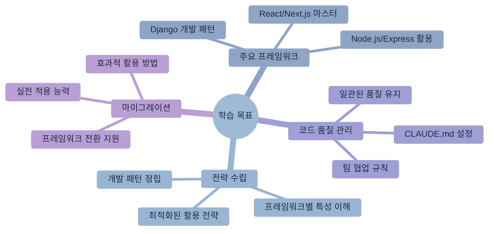
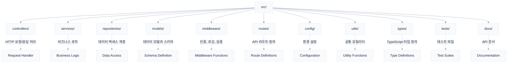
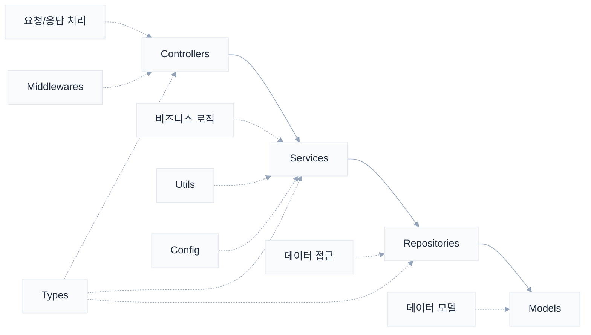
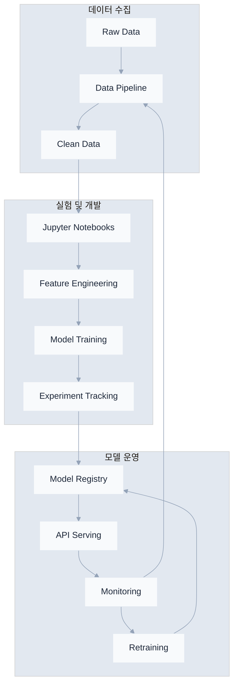
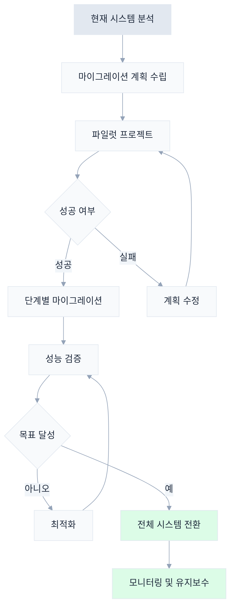
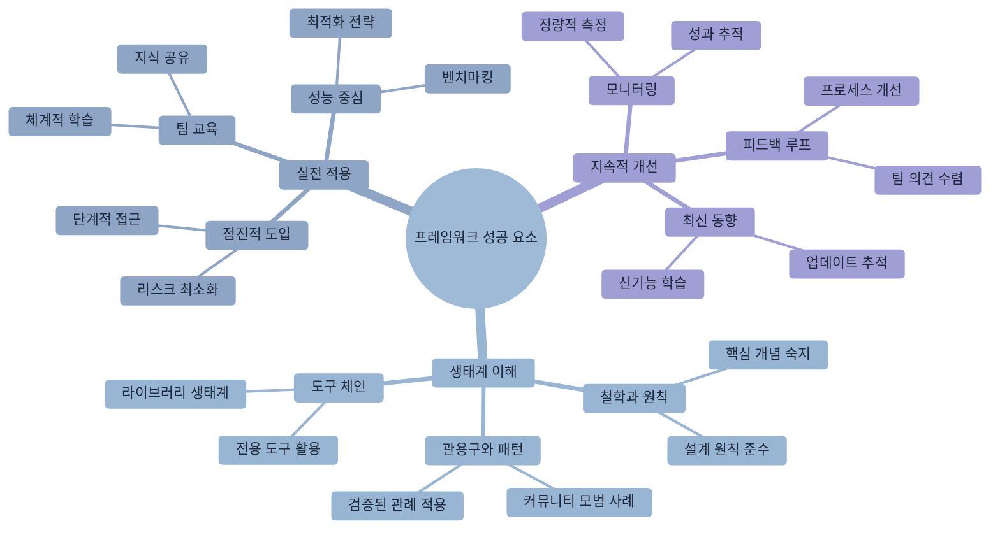

# 제5장: 프레임워크별 베스트 프랙티스

> "올바른 도구를 올바른 작업에 사용하라" - 프로그래밍 격언



## 학습 목표

## 개요

현대 소프트웨어 개발에서 프레임워크는 개발 효율성과 코드 품질을 결정하는 핵심 요소입니다. 각 프레임워크는 고유한 철학, 설계 패턴, 그리고 모범 사례를 가지고 있어, 동일한 기능이라도 프레임워크에 따라 전혀 다른 접근 방식이 요구됩니다.

Claude Code는 이러한 프레임워크별 특성을 깊이 이해하고, 각 프레임워크의 관용구와 모범 사례를 준수하는 코드를 생성할 수 있습니다. 이 장에서는 주요 프레임워크별로 Claude Code를 최적화하는 전략과 실전 활용법을 체계적으로 살펴보겠습니다.

## 5.1 React/Next.js 프로젝트

React와 Next.js는 현대 프론트엔드 개발의 핵심 기술로, 컴포넌트 기반 아키텍처와 선언적 프로그래밍을 통해 복잡한 사용자 인터페이스를 효율적으로 구축할 수 있게 해줍니다. Claude Code는 React의 함수형 컴포넌트 패턴, Next.js의 App Router 구조, 그리고 현대적인 상태 관리 라이브러리들과의 통합을 완벽히 지원합니다.

### React 프로젝트 초기 설정

React 프로젝트를 시작할 때는 프로젝트의 규모와 요구사항에 맞는 도구 선택이 중요합니다. Claude Code는 업계 표준 도구들을 조합하여 확장 가능하고 유지보수하기 쉬운 프로젝트 구조를 생성할 수 있습니다.

```bash
# Vite를 사용한 React 프로젝트 생성
claude "Vite로 새로운 React TypeScript 프로젝트를 만들어줘. 
Tailwind CSS, React Router, React Query를 포함하고,
폴더 구조도 모범 사례에 따라 설정해줘"
```

Claude Code는 다음과 같은 구조를 생성합니다.

```
src/
├── components/
│   ├── common/        # Button, Input 등 공통 컴포넌트
│   ├── features/      # 기능별 컴포넌트
│   └── layouts/       # Header, Footer 등
├── hooks/            # 커스텀 훅
├── pages/            # 라우트별 페이지 컴포넌트
├── services/         # API 통신
├── store/            # 전역 상태 관리
├── utils/            # 유틸리티 함수
└── types/            # TypeScript 타입 정의
```

### React 컴포넌트 개발 패턴

React 컴포넌트는 재사용 가능하고 테스트 가능한 단위로 설계되어야 합니다. Claude Code는 컴포넌트의 역할과 책임을 명확히 분리하고, 적절한 추상화 수준을 유지하는 컴포넌트를 생성할 수 있습니다.

**1. 컴포넌트 생성 요청 - 실전 예시**

효과적인 컴포넌트 개발을 위해서는 명확한 요구사항 정의와 함께 테스트와 문서화를 포함한 완성도 높은 요청이 필요합니다. 다음은 실제 프로젝트에서 자주 사용되는 패턴들입니다.

```bash
# 기본 컴포넌트 생성
claude "UserProfile 컴포넌트를 만들어줘. 
프로필 이미지, 이름, 소개를 표시하고,
편집 모드를 지원해야 해. 
Storybook 스토리와 테스트 코드도 함께 작성해줘"

# 고급 데이터 테이블 컴포넌트
claude "DataTable 컴포넌트를 만들어줘.
- 정렬, 필터링, 페이지네이션 지원
- 선택 가능한 행과 대량 작업
- 가상 스크롤링으로 성능 최적화
- TypeScript 제네릭으로 타입 안전성 보장
- 접근성(a11y) 준수"

# 복잡한 폼 컴포넌트
claude "MultiStepForm 컴포넌트를 만들어줘.
- React Hook Form과 Zod 검증 통합
- 단계별 진행 표시와 네비게이션
- 자동 저장과 임시 저장 기능
- 오류 상태 처리와 사용자 피드백
- 각 단계별 조건부 필드 표시"
```

**2. 상태 관리 패턴**

```bash
# 인증 상태 관리
claude "사용자 인증 상태를 전역으로 관리하는 
Context와 커스텀 훅을 만들어줘.
로그인, 로그아웃, 토큰 갱신 기능이 필요해"

# 복잡한 비즈니스 로직 상태 관리
claude "전자상거래 장바구니 상태 관리를 구현해줘.
- Zustand로 상태 저장소 구성
- 상품 추가/제거/수량 변경 로직
- 할인 쿠폰 적용과 가격 계산
- 로컬스토리지 동기화
- 비관적/낙관적 업데이트 처리"

# 서버 상태와 캐싱
claude "React Query를 활용한 서버 상태 관리를 설정해줘.
- API 응답 캐싱 전략
- 백그라운드 리페칭과 스테일 타임 설정
- 무한 스크롤 데이터 페칭
- 에러 재시도 로직과 오프라인 지원"
```

**3. 성능 최적화 전략**

```bash
# 리렌더링 최적화
claude "이 컴포넌트의 불필요한 리렌더링을 방지하도록 
React.memo, useMemo, useCallback을 적용해줘"

# 코드 스플리팅과 지연 로딩
claude "이 애플리케이션에 코드 스플리팅을 적용해줘.
- 라우트 레벨 지연 로딩
- 무거운 컴포넌트의 동적 임포트
- 라이브러리 번들 분리
- 로딩 스피너와 에러 바운더리 추가"

# 대용량 리스트 최적화
claude "10,000개 아이템을 효율적으로 렌더링하는 
가상 스크롤 컴포넌트를 구현해줘.
- react-window 라이브러리 활용
- 동적 아이템 높이 지원
- 무한 스크롤과 페이지네이션 통합"

# 이미지 최적화
claude "이미지 갤러리의 성능을 최적화해줘.
- 지연 로딩과 프리로딩 전략
- WebP 포맷 지원과 폴백
- 이미지 압축과 리사이징
- Progressive loading 구현"
```

### Next.js 특화 기능 - 실전 활용

**1. App Router 고급 패턴**

```bash
# 종합적인 블로그 시스템
claude "Next.js 14 App Router로 블로그를 만들어줘.
동적 라우팅, 메타데이터 최적화, 
그리고 ISR(Incremental Static Regeneration)을 활용해줘"

# 다국어 지원과 국제화
claude "Next.js에서 다국어 지원을 구현해줘.
- i18n 라우팅 설정
- 서버 컴포넌트에서 번역 처리
- 동적 번역 로딩과 폴백
- SEO 최적화를 위한 hreflang 태그"

# 복잡한 인증 시스템
claude "NextAuth.js로 다중 인증 제공자를 지원하는 시스템을 구현해줘.
- OAuth (Google, GitHub), 이메일, 자격증명 로그인
- 역할 기반 접근 제어 (RBAC)
- 세션 관리와 보안 강화
- API 라우트 보호 미들웨어"
```

**2. Server Components 패턴**

```bash
claude "이 페이지를 Server Component로 리팩토링해줘.
데이터 페칭은 서버에서, 인터랙션은 Client Component로 분리해줘"
```

**3. API Routes 설계**

```bash
claude "RESTful API를 Next.js API routes로 구현해줘.
미들웨어로 인증을 처리하고, Zod로 요청 검증을 추가해줘"
```

### React/Next.js CLAUDE.md 예시

```markdown
# React/Next.js Project Guidelines

## 컴포넌트 규칙
- 함수형 컴포넌트만 사용
- Props는 인터페이스로 정의
- 컴포넌트당 하나의 파일

## 상태 관리
- 로컬 상태: useState
- 서버 상태: React Query (TanStack Query)
- 전역 상태: Zustand

## 폴더 구조
```
components/
├── Button/
│   ├── Button.tsx
│   ├── Button.test.tsx
│   ├── Button.stories.tsx
│   └── index.ts
```

## 성능 최적화
- 이미지는 next/image 사용
- 동적 import로 코드 스플리팅
- Lighthouse 점수 90+ 유지
```

## 5.2 Node.js/Express 백엔드

Node.js와 Express는 JavaScript 생태계에서 가장 널리 사용되는 백엔드 기술 스택입니다. 이벤트 기반 비동기 아키텍처의 장점을 활용하여 높은 성능과 확장성을 제공하며, Claude Code는 견고하고 유지보수 가능한 서버 애플리케이션 구축을 지원합니다.

### Express 서버 구조화 - 엔터프라이즈 패턴

확장 가능한 Express 애플리케이션을 위해서는 계층화된 아키텍처와 관심사의 분리가 핵심입니다. Claude Code는 업계 표준 아키텍처 패턴을 따르는 서버 구조를 생성할 수 있습니다.

```bash
# 기본 REST API 서버
claude "Express.js로 확장 가능한 REST API 서버를 만들어줘.
계층화된 아키텍처(Controller-Service-Repository)를 사용하고,
TypeScript, JWT 인증, 에러 핸들링, 로깅을 포함해줘"

# 마이크로서비스 패턴
claude "Express로 마이크로서비스 아키텍처를 구현해줘.
- 서비스 간 통신 (HTTP/gRPC)
- API Gateway 패턴
- 서비스 디스커버리와 로드 밸런싱
- 분산 로깅과 트레이싱
- Circuit Breaker 패턴"

# 고성능 API 서버
claude "대용량 트래픽을 처리하는 Express API를 만들어줘.
- 클러스터링과 워커 프로세스 관리
- Redis를 활용한 세션과 캐싱
- 요청 제한과 DDoS 방어
- 데이터베이스 커넥션 풀링
- APM 모니터링 통합"

# GraphQL API 서버
claude "Express에 GraphQL을 통합한 API 서버를 만들어줘.
- Apollo Server 설정
- 스키마 stitching과 federation
- DataLoader를 활용한 N+1 쿼리 방지
- 인증과 권한 부여
- 쿼리 복잡도 제한"
```

**엔터프라이즈급 프로젝트 구조**



**계층별 책임 분리**



### 백엔드 개발 패턴

**1. RESTful API 설계**

```bash
claude "사용자 관리를 위한 RESTful API를 설계해줘.
CRUD 작업, 페이지네이션, 필터링, 정렬을 지원하고,
OpenAPI(Swagger) 문서도 자동 생성되도록 해줘"
```

**2. 데이터베이스 통합**

```bash
claude "Prisma ORM을 사용해서 User, Post, Comment 모델을 만들어줘.
관계 설정, 마이그레이션, 시드 데이터도 포함해줘"
```

**3. 인증/인가 구현**

```bash
claude "JWT 기반 인증 시스템을 구현해줘.
액세스 토큰과 리프레시 토큰을 사용하고,
역할 기반 접근 제어(RBAC)도 추가해줘"
```

### 마이크로서비스 아키텍처

```bash
claude "이 모놀리식 앱을 마이크로서비스로 분해해줘.
User Service, Product Service, Order Service로 나누고,
API Gateway와 서비스 간 통신 방법도 설계해줘"
```

### Node.js/Express CLAUDE.md 예시

```markdown
# Node.js/Express API Guidelines

## API 설계 원칙
- RESTful 원칙 준수
- 일관된 응답 형식
- 적절한 HTTP 상태 코드 사용

## 응답 형식
```json
{
  "success": true,
  "data": {},
  "message": "Success",
  "timestamp": "2024-01-01T00:00:00Z"
}
```

## 에러 처리
- 모든 에러는 중앙 에러 핸들러로
- 에러 로깅 필수
- 클라이언트에게는 일반화된 메시지

## 보안
- 모든 엔드포인트 rate limiting
- SQL Injection 방지
- 입력 검증 필수
```

## 5.3 Python/Django 애플리케이션

Django는 "battery included" 철학을 기반으로 하는 Python 웹 프레임워크로, 강력한 ORM, 관리자 인터페이스, 그리고 보안 기능을 내장하고 있습니다. Django REST Framework와 함께 사용하면 견고한 API 서버를 빠르게 구축할 수 있으며, Claude Code는 Django의 모범 사례를 준수하는 확장 가능한 애플리케이션 개발을 지원합니다.

### Django 프로젝트 설정

Django 프로젝트의 성공은 초기 설정과 아키텍처 설계에서 결정됩니다. Claude Code는 Django의 앱 기반 모듈화와 설정 관리 모범 사례를 따르는 프로젝트 구조를 생성할 수 있습니다.

```bash
claude "Django REST Framework로 블로그 API를 만들어줘.
사용자 인증, 포스트 CRUD, 댓글, 태그 기능을 포함하고,
테스트 코드와 API 문서화도 설정해줘"
```

### Django 개발 패턴

**1. 모델 설계**

```bash
claude "전자상거래를 위한 Django 모델을 설계해줘.
Product, Category, Order, User 모델과 관계를 정의하고,
Admin 인터페이스도 커스터마이징해줘"
```

**2. ViewSet과 Serializer**

```bash
claude "Product 모델에 대한 ViewSet과 Serializer를 만들어줘.
필터링, 검색, 정렬을 지원하고,
중첩된 관계도 효율적으로 처리해줘"
```

**3. 비동기 태스크**

```bash
claude "Celery를 사용해서 이메일 발송과 
이미지 처리를 비동기로 처리하도록 설정해줘"
```

### Python/Django CLAUDE.md 예시

```markdown
# Django Project Guidelines

## 앱 구조
- 기능별로 앱 분리
- 앱당 최대 10개 모델
- 순환 의존성 금지

## 모델 설계
- 모든 모델에 created_at, updated_at
- soft delete 사용 (is_deleted 필드)
- 관계는 명시적으로 정의

## API 설계
- ViewSet 사용 권장
- 커스텀 액션은 @action 데코레이터
- 페이지네이션 기본 20개

## 테스트
- 모델, 뷰, 시리얼라이저 각각 테스트
- Factory Boy로 테스트 데이터 생성
- 커버리지 80% 이상
```

## 5.4 모바일 앱 개발 (React Native/Flutter)

모바일 앱 개발 영역에서 크로스 플랫폼 솔루션은 개발 효율성과 유지보수성을 크게 향상시킵니다. React Native는 JavaScript와 React 지식을 활용한 네이티브 앱 개발을, Flutter는 Dart 언어를 통한 고성능 UI 구현을 가능하게 합니다. Claude Code는 각 플랫폼의 특성을 이해하고 플랫폼별 최적화된 코드를 생성할 수 있습니다.

### React Native 프로젝트

React Native는 React의 컴포넌트 모델을 모바일 환경에 적용한 프레임워크로, 웹 개발 경험을 활용하여 네이티브 모바일 앱을 개발할 수 있게 해줍니다.

```bash
claude "Expo로 크로스 플랫폼 모바일 앱을 만들어줘.
네비게이션, 상태 관리, 네이티브 기능 접근을 설정하고,
iOS와 Android 스타일 차이도 처리해줘"
```

### React Native 개발 패턴

**1. 네비게이션 구조**

```bash
claude "React Navigation으로 복잡한 네비게이션을 구현해줘.
Tab Navigator, Stack Navigator, Drawer를 조합하고,
딥링킹도 설정해줘"
```

**2. 네이티브 모듈 통합**

```bash
claude "카메라와 위치 정보에 접근하는 기능을 구현해줘.
권한 요청 처리와 에러 핸들링도 포함해줘"
```

### Flutter 프로젝트

```bash
claude "Flutter로 Material Design 앱을 만들어줘.
다국어 지원, 다크 모드, 반응형 레이아웃을 포함하고,
Clean Architecture 패턴을 적용해줘"
```

### 모바일 앱 CLAUDE.md 예시

```markdown
# Mobile App Guidelines

## 아키텍처
- MVVM 패턴 사용
- 비즈니스 로직은 ViewModel에
- View는 상태만 표시

## 성능
- 리스트는 가상화 필수
- 이미지 최적화 및 캐싱
- 애니메이션 60fps 유지

## 플랫폼별 처리
```javascript
Platform.select({
  ios: { /* iOS 스타일 */ },
  android: { /* Android 스타일 */ }
})
```

## 테스트
- 컴포넌트 테스트: Jest
- E2E 테스트: Detox
- 플랫폼별 테스트 필수
```

## 5.5 데이터 과학 프로젝트 - MLOps 통합

데이터 과학과 머신러닝 분야는 탐색적 분석에서 프로덕션 배포까지 다양한 단계를 거치는 복잡한 워크플로우를 가지고 있습니다. Claude Code는 데이터 과학자들이 사용하는 주요 도구들과 현대적인 MLOps 파이프라인을 이해하여, 실험부터 배포까지 전체 프로세스를 지원할 수 있습니다.

### 현대적 데이터 과학 스택

데이터 과학 프로젝트의 성공을 위해서는 단순한 분석 도구를 넘어서 재현 가능하고 확장 가능한 MLOps 파이프라인이 필요합니다.



### Jupyter Notebook 환경

Jupyter Notebook은 데이터 과학 프로젝트의 핵심 도구로, 코드, 시각화, 문서를 하나의 환경에서 통합적으로 관리할 수 있게 해줍니다. Claude Code는 재현 가능하고 체계적인 분석 환경 구축을 지원합니다.

```bash
claude "머신러닝 프로젝트를 위한 Jupyter 환경을 설정해줘.
데이터 분석, 시각화, 모델 학습 파이프라인을 구축하고,
실험 추적도 설정해줘"
```

### 데이터 분석 워크플로우 - 산업 표준 접근

**1. 데이터 전처리 파이프라인**

```bash
# 기본 데이터 전처리
claude "이 CSV 데이터를 분석하고 전처리해줘.
결측치 처리, 이상치 탐지, 특성 엔지니어링을 수행하고,
각 단계를 시각화해줘"

# 고급 특성 엔지니어링
claude "시계열 데이터의 특성 엔지니어링을 구현해줘.
- 시간 기반 특성 생성 (lag, rolling window)
- 계절성과 트렌드 분해
- Fourier 변환을 통한 주기 특성
- 스케일링과 정규화 파이프라인
- 범주형 변수 인코딩 전략"

# 대용량 데이터 처리
claude "Dask를 활용한 대용량 데이터 전처리 파이프라인을 만들어줘.
- 청크 단위 병렬 처리
- 메모리 효율적인 데이터 로딩
- 분산 컴퓨팅 환경 설정
- 진행 상황 모니터링"
```

**2. 모델 개발과 실험 관리**

```bash
# AutoML과 모델 비교
claude "여러 머신러닝 모델을 비교 평가해줘.
교차 검증, 하이퍼파라미터 튜닝을 수행하고,
결과를 표로 정리해줘"

# 딥러닝 모델 개발
claude "PyTorch로 이미지 분류 모델을 구현해줘.
- 전이학습 (Transfer Learning) 활용
- 데이터 증강과 정규화
- 학습률 스케줄링과 조기 종료
- 모델 체크포인트와 재개 기능
- TensorBoard 시각화"

# MLflow 실험 추적
claude "MLflow를 활용한 실험 추적 시스템을 구축해줘.
- 모델 메트릭과 파라미터 로깅
- 아티팩트 버전 관리
- 모델 레지스트리 설정
- A/B 테스트 프레임워크
- 실험 비교 대시보드"
```

**3. 모델 배포와 운영**

```bash
# API 서빙
claude "학습된 모델을 FastAPI로 서빙하는 API를 만들어줘.
입력 검증, 예측, 모니터링 기능을 포함해줘"

# 실시간 예측 시스템
claude "Kafka와 Redis를 활용한 실시간 ML 파이프라인을 구축해줘.
- 스트리밍 데이터 전처리
- 실시간 특성 저장소
- 배치와 온라인 예측 통합
- 모델 성능 모니터링
- 자동 재학습 트리거"

# 컨테이너 배포
claude "Docker와 Kubernetes로 ML 모델을 배포해줘.
- 멀티 스테이지 Docker 빌드
- GPU 지원 컨테이너
- 오토스케일링 설정
- 헬스체크와 로그 수집
- CI/CD 파이프라인 통합"

# 모델 모니터링
claude "프로덕션 ML 모델 모니터링 시스템을 구축해줘.
- 데이터 드리프트 탐지
- 모델 성능 저하 알림
- 편향성 모니터링
- 설명 가능한 AI 대시보드
- 사고 대응 플레이북"
```

### 데이터 과학 CLAUDE.md 예시

현대적인 데이터 과학 프로젝트를 위한 포괄적인 가이드라인

```markdown
# Data Science Project Guidelines

## 프로젝트 구조
```
project/
├── data/           # 원본 데이터
├── notebooks/      # 실험 노트북
├── src/           # 재사용 가능한 코드
├── models/        # 학습된 모델
└── reports/       # 분석 결과
```

## 코딩 규칙
- 노트북은 실험용, 프로덕션 코드는 .py로
- 모든 실험은 추적 가능하게
- 재현 가능성 보장 (시드 고정)

## 데이터 처리
- 원본 데이터는 수정하지 않음
- 전처리 파이프라인 문서화
- 데이터 버전 관리

## 모델 관리
- MLflow로 실험 추적
- 모델 버전 관리
- A/B 테스트 지원
```

## 프레임워크 독립적인 베스트 프랙티스

프레임워크별 특화된 접근 방식 외에도, 모든 프레임워크에 공통적으로 적용할 수 있는 핵심 원칙들이 있습니다. 이러한 원칙들을 이해하고 적용하면 어떤 프레임워크를 사용하든 일관된 품질의 결과를 얻을 수 있습니다.

### 1. 초기 탐색 전략

새로운 프로젝트나 기존 프로젝트에 참여할 때는 체계적인 탐색과 이해가 성공의 핵심입니다. Claude Code는 프로젝트의 전체적인 구조와 맥락을 파악하는 데 도움을 줄 수 있습니다.

```bash
# 새 프로젝트 시작 시
claude "이 프로젝트의 구조와 사용된 기술 스택을 분석해줘.
주요 파일들의 역할과 데이터 흐름을 설명해줘"
```

### 2. 점진적 개선

```bash
# 기존 코드 개선
claude "이 코드를 리팩토링해줘. 
먼저 테스트를 작성해서 동작을 보장한 후,
단계별로 개선해줘"
```

### 3. 문서화 자동화

```bash
# 문서 생성
claude "프로젝트의 README.md를 업데이트해줘.
설치 방법, 사용법, API 문서, 기여 가이드를 포함해줘"
```

### 4. 성능 프로파일링

```bash
# 성능 분석
claude "이 애플리케이션의 성능을 프로파일링하고,
병목 지점을 찾아서 최적화 방안을 제시해줘"
```

## 실전 팁: 프레임워크 전환과 현대화

프레임워크 마이그레이션은 기술 부채 해결과 성능 개선을 위한 중요한 프로젝트입니다. Claude Code는 체계적이고 위험을 최소화하는 마이그레이션 전략을 수립하고 실행하는 데 도움을 줄 수 있습니다.

### 레거시 시스템 현대화 전략

기존 시스템을 현대적인 아키텍처로 전환하는 것은 단순한 코드 변환을 넘어서 전체적인 시스템 재설계를 의미합니다.

### 마이그레이션 전략 수립 - 실전 사례

기존 프로젝트를 다른 프레임워크로 마이그레이션할 때는 단계적이고 점진적인 접근이 필요합니다.



```bash
# 1. 의존성 및 아키텍처 분석
claude "이 Express 앱의 핵심 기능과 구조를 분석해줘.
- 의존성 트리와 순환 참조 확인
- 비즈니스 크리티컬 모듈 식별
- 테스트 커버리지 평가
- 성능 병목 지점 파악"

# 2. 상세한 마이그레이션 로드맵
claude "이 앱을 Fastify로 마이그레이션하는 계획을 세워줘.
- Strangler Fig 패턴 적용
- 단계별 롤백 계획
- 성능 벤치마크 설정
- 팀 교육 일정 포함
- 리스크 평가와 완화 전략"

# 3. 점진적 마이그레이션 실행
claude "인증 모듈부터 Fastify로 마이그레이션해줘.
- 트래픽 스플리팅 구현
- 모니터링과 알림 설정
- 데이터 일관성 보장
- 자동화된 테스트 스위트
- 성능 회귀 감지"

# 4. 복잡한 프론트엔드 마이그레이션
claude "React 클래스 컴포넌트를 함수형으로 마이그레이션해줘.
- 생명주기를 훅으로 변환
- 상태 관리 현대화
- 코드 분할과 지연 로딩 적용
- TypeScript 타입 안전성 강화
- 성능 최적화 기회 식별"

# 5. 데이터베이스 마이그레이션
claude "MySQL에서 PostgreSQL로 마이그레이션 계획을 세워줘.
- 스키마 변환과 데이터 타입 매핑
- 무중단 데이터 이전 전략
- 쿼리 최적화와 성능 튜닝
- 백업과 복구 절차
- 검증과 테스트 계획"
```

### 프레임워크별 성공 지표

각 프레임워크 전환 프로젝트의 성공을 측정하기 위한 구체적인 KPI를 설정하는 것이 중요합니다.

```bash
# 성능 지표 모니터링
claude "마이그레이션 전후 성능 비교 대시보드를 만들어줘.
- 응답 시간과 처리량 비교
- 메모리 사용량과 CPU 효율성
- 번들 크기와 로딩 시간
- 사용자 경험 메트릭 (LCP, FID, CLS)
- 개발자 생산성 지표"

# 품질 지표 추적
claude "코드 품질 개선 사항을 추적하는 시스템을 구축해줘.
- 테스트 커버리지 변화
- 코드 복잡도 감소
- 보안 취약점 해결
- 기술 부채 감소
- 팀 만족도 조사"
```

## 마치며

프레임워크별 베스트 프랙티스를 숙지하는 것은 Claude Code를 효과적으로 활용하는 핵심입니다. 각 프레임워크는 고유한 철학과 설계 원칙을 가지고 있으며, 이를 이해하고 적용하는 것이 성공적인 개발의 기반이 됩니다.

### 핵심 성공 요소



### 실무 체크리스트

**프로젝트 시작**

- [ ] 프레임워크별 CLAUDE.md 파일 작성
- [ ] 팀 코딩 컨벤션과 스타일 가이드 수립
- [ ] 개발 환경과 도구 체인 표준화
- [ ] 성능 벤치마크와 품질 기준 설정

**개발 과정**

- [ ] 프레임워크 모범 사례 준수 여부 코드 리뷰
- [ ] 정기적인 성능 프로파일링과 최적화
- [ ] 자동화된 테스트와 CI/CD 파이프라인 운영
- [ ] 기술 부채 관리와 리팩토링 계획

**마이그레이션 프로젝트**

- [ ] 상세한 마이그레이션 로드맵과 리스크 평가
- [ ] 점진적 전환을 위한 브리징 전략
- [ ] 성능과 안정성 회귀 방지 체계
- [ ] 팀 교육과 지식 전수 프로그램

**Claude Code의 진정한 가치는 단순히 코드를 생성하는 것이 아니라, 각 프레임워크의 철학과 모범 사례를 팀 전체가 일관되게 적용할 수 있도록 돕는 데 있습니다.** 이를 통해 개발 품질의 표준화와 팀 생산성의 극대화를 동시에 달성할 수 있습니다.

다음 장에서는 프로그래밍 언어별로 Claude Code를 최적화하는 전략을 살펴보겠습니다. 언어의 고유한 특성과 생태계를 이해하여 더욱 효과적인 개발 환경을 구축하는 방법을 탐구해봅시다.