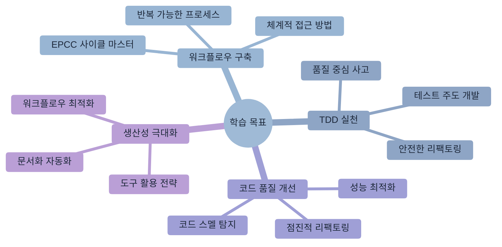
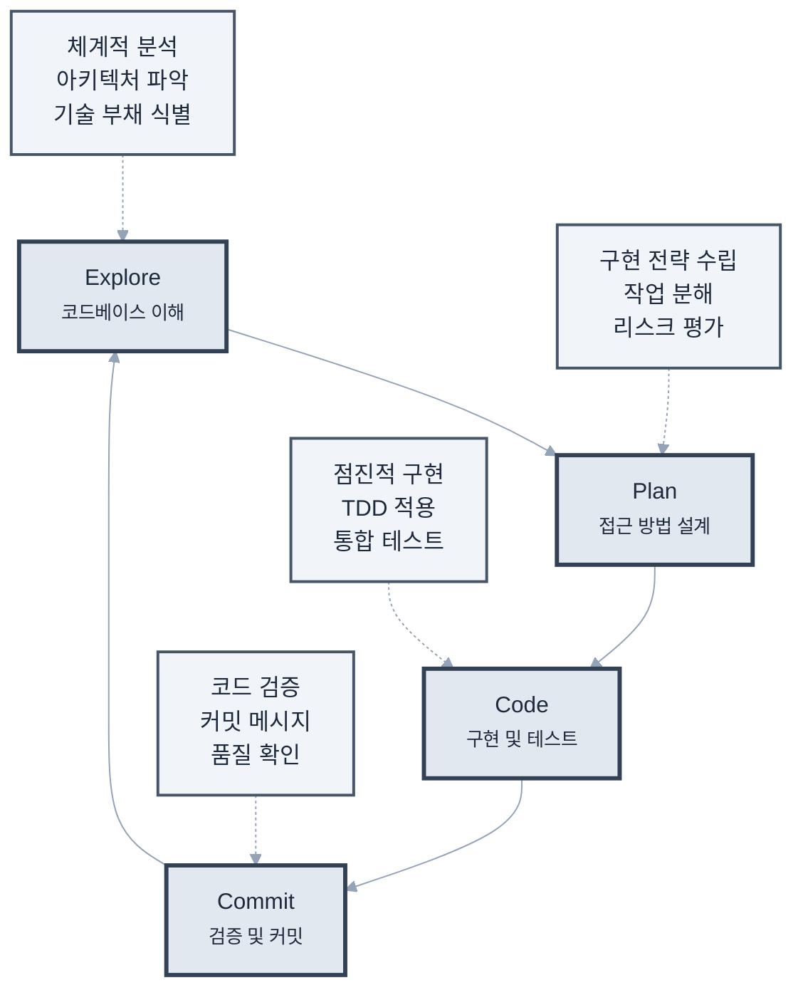
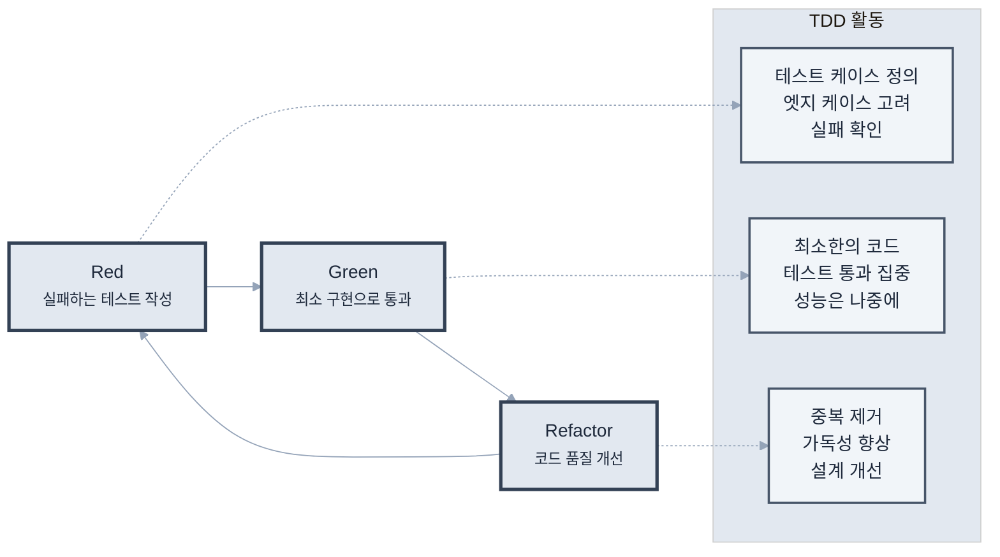
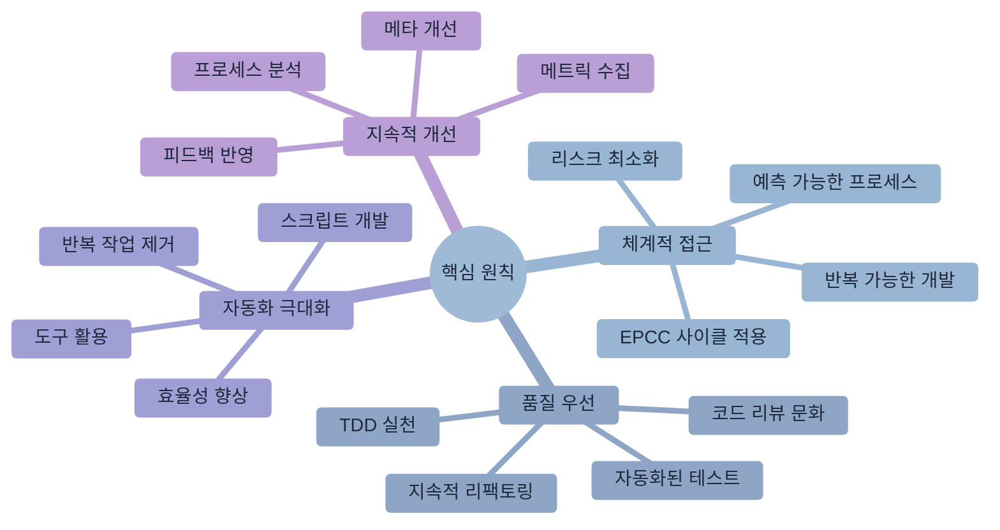

# 제7장: 효율적인 개발 워크플로우

> "완벽한 계획보다 지속적인 개선이 낫다" - 애자일 원칙



## 학습 목표

이 장을 완료하면 다음을 할 수 있습니다:
- EPCC(Explore-Plan-Code-Commit) 워크플로우를 구축하고 실행할 수 있습니다
- TDD(Test-Driven Development)를 Claude Code와 함께 효과적으로 실천할 수 있습니다
- 체계적인 리팩토링과 코드 품질 개선 프로세스를 수립할 수 있습니다
- 문서화 자동화와 워크플로우 최적화를 통해 개발 생산성을 극대화할 수 있습니다

## 개요

효율적인 개발 워크플로우는 단순히 빠르게 코딩하는 것이 아닙니다. 체계적인 접근 방식, 적절한 자동화, 그리고 지속적인 개선을 통해 높은 품질의 소프트웨어를 일관되게 제공하는 것이 핵심입니다.

현대 소프트웨어 개발에서 워크플로우는 개발자의 생산성과 코드 품질을 직접적으로 좌우하는 중요한 요소입니다. Claude Code는 이러한 워크플로우의 각 단계에서 지능적인 지원을 제공하여, 개발자가 창조적인 작업에 더 집중할 수 있도록 도와줍니다.

## 7.1 탐색-계획-코딩-커밋 사이클

EPCC(Explore-Plan-Code-Commit) 워크플로우는 체계적이고 반복 가능한 개발 프로세스를 제공합니다. 이 워크플로우는 무작정 코딩을 시작하는 대신, 충분한 이해와 계획을 바탕으로 한 신중한 개발을 가능하게 합니다.

### EPCC (Explore-Plan-Code-Commit) 워크플로우

각 단계는 고유한 목적과 산출물을 가지며, 순환적으로 반복되어 지속적인 품질 향상을 달성합니다.



### 1단계: Explore (탐색) - 체계적 코드베이스 이해

탐색 단계는 성공적인 개발을 위한 기반을 마련하는 중요한 과정입니다. 충분한 이해 없이 코딩을 시작하는 것은 잘못된 설계와 기술 부채로 이어질 수 있습니다. Claude Code는 복잡한 코드베이스를 체계적으로 분석하여 개발자가 빠르게 전체 구조를 파악할 수 있도록 지원합니다.

**프로젝트 아키텍처 분석**

```bash
# 고수준 아키텍처 이해
claude "이 프로젝트의 전체 아키텍처를 분석해줘.
- 마이크로서비스 vs 모놀리식 구조
- 주요 도메인과 경계
- 데이터 흐름과 의존성 방향
- 외부 시스템과의 통합 지점
- 보안 경계와 인증 방식"

# 기술 스택 심층 분석
claude "사용된 기술 스택을 종합적으로 분석해줘.
- 프론트엔드: 프레임워크, 상태 관리, 빌드 도구
- 백엔드: 언어, 프레임워크, ORM, 미들웨어
- 데이터베이스: 타입, 버전, 스키마 설계 패턴
- 인프라: 컨테이너화, 오케스트레이션, 모니터링
- 각 기술 선택의 이유와 장단점 분석"

# 코드 품질과 컨벤션 평가
claude "프로젝트의 코드 품질과 개발 관행을 평가해줘.
- 네이밍 규칙과 일관성 확인
- 파일/폴더 구조 패턴
- 테스트 커버리지와 전략
- 문서화 수준과 품질
- CI/CD 파이프라인 구성
- 코드 리뷰 프로세스 흔적"
```

**기능별 심층 추적과 분석**

```bash
# 비즈니스 크리티컬 기능 분석
claude "사용자 인증 및 권한 관리 시스템을 종합 분석해줘.
- 인증 플로우 (로그인, 토큰 관리, 세션)
- 권한 부여 메커니즘 (RBAC, ABAC)
- 보안 고려사항 (암호화, 검증)
- 프론트엔드-백엔드 연동 방식
- 에러 처리와 사용자 경험
- 확장 가능성과 개선점"

# 데이터 흐름과 상태 관리
claude "애플리케이션의 데이터 흐름을 추적하고 분석해줘.
- 사용자 입력부터 데이터 저장까지의 전체 경로
- 클라이언트 사이드 상태 관리 패턴
- 서버 사이드 데이터 처리 로직
- 캐싱 전략과 성능 최적화
- 데이터 일관성과 동시성 처리"

# 성능과 확장성 분석
claude "시스템의 성능 특성과 확장성을 분석해줘.
- 현재 성능 병목 지점 식별
- 트래픽 처리 능력과 한계
- 데이터베이스 쿼리 패턴과 최적화 기회
- 메모리 사용 패턴과 가비지 컬렉션
- 확장 전략 (수평적 vs 수직적)"
```

**기술적 부채와 개선 기회 식별**

효과적인 탐색은 단순히 현재 상태를 이해하는 것을 넘어서 잠재적 문제와 개선 기회를 사전에 식별하는 것입니다:

```bash
# 기술 부채 평가
claude "코드베이스의 기술 부채를 종합 평가해줘.
- 구식 라이브러리와 보안 취약점
- 중복 코드와 리팩토링 필요 영역
- 복잡도가 높은 모듈과 함수
- 테스트가 부족한 크리티컬 영역
- 문서화 부족으로 인한 유지보수 어려움
- 우선순위별 개선 로드맵 제안"

# 아키텍처 진화 가능성
claude "현재 아키텍처의 발전 방향을 제안해줘.
- 마이크로서비스 분해 가능성
- 새로운 기술 스택 도입 기회
- 성능 개선을 위한 아키텍처 변경
- 확장성 향상 방안
- 비용 최적화 기회"

### 2단계: Plan (계획)

**구현 전략 수립**

```bash
claude "장바구니 기능을 추가하려고 해. 
현재 아키텍처를 고려해서 구현 계획을 세워줘.
필요한 컴포넌트, API 엔드포인트, 데이터 모델을 포함해줘"
```

**작업 분해**

```bash
claude "이 기능을 구현하기 위한 작업을 단계별로 나눠줘.
각 단계는 독립적으로 테스트 가능해야 하고,
예상 소요 시간도 추정해줘"
```

**리스크 평가**

```bash
claude "이 변경사항이 기존 코드에 미칠 영향을 분석해줘.
잠재적인 문제점과 해결 방안을 제시해줘"
```

### 3단계: Code (코딩)

**점진적 구현**

```bash
# 스켈레톤 코드 생성
claude "계획에 따라 기본 구조를 먼저 만들어줘.
인터페이스와 빈 메서드로 시작해서 단계적으로 구현할 수 있도록"

# 핵심 로직 구현
claude "이제 핵심 비즈니스 로직을 구현해줘.
단위 테스트도 함께 작성해서 동작을 검증해줘"

# 통합 및 연결
claude "구현한 기능을 기존 시스템과 통합해줘.
필요한 어댑터나 미들웨어도 작성해줘"
```

### 4단계: Commit (커밋)

**코드 검증**

```bash
# 자동 검증
claude "커밋하기 전에 다음을 확인해줘:
- 모든 테스트 통과
- 린팅 규칙 준수
- 타입 체크 통과
- 코드 커버리지 확인"

# 커밋 메시지 작성
claude "변경사항을 분석해서 의미 있는 커밋 메시지를 작성해줘.
conventional commits 형식을 따르고,
변경 이유와 영향을 명확히 설명해줘"
```

## 7.2 테스트 주도 개발(TDD) 실천

테스트 주도 개발(TDD)은 높은 품질의 코드를 작성하기 위한 검증된 방법론입니다. Claude Code는 TDD의 각 단계에서 적절한 테스트 케이스 생성, 최소 구현, 그리고 리팩토링을 지원하여 개발자가 TDD 원칙을 효과적으로 실천할 수 있도록 도와줍니다.

### TDD 사이클

TDD의 Red-Green-Refactor 사이클은 코드 품질과 설계의 점진적 개선을 통해 견고한 소프트웨어를 구축하는 기반이 됩니다.



### TDD with Claude Code

**1. Red Phase - 실패하는 테스트 작성**

```bash
claude "calculateDiscount 함수를 위한 테스트를 먼저 작성해줘.
다음 시나리오를 포함해야 해:
- 일반 할인 (10%)
- VIP 할인 (20%)
- 최대 할인 한도
- 엣지 케이스 (음수, 0, null)"
```

**2. Green Phase - 최소 구현**

```bash
claude "작성한 테스트를 통과하는 최소한의 코드를 구현해줘.
아직 최적화는 하지 말고, 테스트 통과에만 집중해줘"
```

**3. Refactor Phase - 개선**

```bash
claude "이제 테스트는 유지하면서 코드를 개선해줘.
중복 제거, 가독성 향상, 성능 최적화를 진행해줘"
```

### TDD 실전 예제

```bash
# 사용자 스토리
claude "사용자 스토리: '사용자는 비밀번호를 변경할 수 있다'
이를 위한 TDD 사이클을 시작해줘"

# Claude의 응답 과정:
# 1. 테스트 케이스 정의
# 2. API 엔드포인트 테스트 작성
# 3. 서비스 레이어 테스트 작성
# 4. 실제 구현
# 5. 리팩토링
```

## 7.3 비주얼 디자인 구현 워크플로우

비주얼 디자인을 정확하고 효율적으로 코드로 구현하는 것은 현대 프론트엔드 개발의 핵심 역량입니다. Claude Code는 디자인 의도를 정확히 파악하고, 반응형 레이아웃과 인터랙션까지 고려한 완성도 높은 구현을 지원합니다.

### 디자인을 코드로

체계적인 디자인 구현 워크플로우는 디자이너와 개발자 간의 협업을 원활하게 하고, 일관된 사용자 경험을 보장합니다.

**1. 스크린샷 기반 개발**

```bash
# 디자인 파일 제공
claude "이 Figma 디자인 스크린샷을 보고 
React 컴포넌트로 구현해줘. 
반응형 디자인과 다크 모드도 지원해야 해"
```

**2. 반복적 개선**

```bash
# 초기 구현
claude "기본 레이아웃과 스타일을 먼저 구현해줘"

# 세부 조정
claude "패딩을 조금 늘리고, 폰트 크기를 조정해줘.
호버 효과와 트랜지션도 추가해줘"

# 인터랙션 추가
claude "클릭 시 애니메이션과 로딩 상태를 추가해줘"
```

### 컴포넌트 라이브러리 구축

```bash
claude "디자인 시스템을 기반으로 컴포넌트 라이브러리를 만들어줘.
Button, Card, Modal 등 기본 컴포넌트를 포함하고,
Storybook으로 문서화해줘"
```

## 7.4 리팩토링과 코드 품질 개선

리팩토링은 코드의 외부 동작을 변경하지 않으면서 내부 구조를 개선하는 중요한 활동입니다. Claude Code는 코드 스멜을 자동으로 탐지하고, 안전한 리팩토링 전략을 제시하며, 지속적인 코드 품질 향상을 지원합니다.

### 체계적인 리팩토링

효과적인 리팩토링은 단순한 코드 정리를 넘어서, 시스템의 유지보수성과 확장성을 크게 향상시키는 전략적 활동입니다.

**1. 코드 스멜 탐지**

```bash
claude "이 코드베이스에서 리팩토링이 필요한 부분을 찾아줘.
다음을 중점적으로 확인해줘:
- 중복 코드
- 긴 함수
- 복잡한 조건문
- 부적절한 이름"
```

**2. 단계별 리팩토링**

```bash
# 1단계: 테스트 확보
claude "리팩토링 전에 현재 동작을 보장하는 테스트를 작성해줘"

# 2단계: 작은 단위로 개선
claude "한 번에 하나씩 리팩토링을 진행해줘.
각 단계마다 테스트가 통과하는지 확인해줘"

# 3단계: 성능 검증
claude "리팩토링 전후의 성능을 비교해줘.
벤치마크를 실행하고 결과를 분석해줘"
```

### 코드 품질 메트릭

```bash
claude "코드 품질을 측정하고 개선 방안을 제시해줘:
- 순환 복잡도
- 코드 커버리지
- 기술 부채
- 의존성 복잡도"
```

## 7.5 문서화 자동화

문서화는 코드의 지속적인 유지보수와 팀 협업에 필수적인 요소입니다. Claude Code는 코드에서 자동으로 문서를 생성하고, 시각적 다이어그램을 작성하여 복잡한 시스템을 이해하기 쉽게 만드는 문서화 자동화를 지원합니다.

### 코드에서 문서로

효과적인 문서화는 코드와 함께 진화하며, 개발자의 수작업을 최소화하면서도 항상 최신 상태를 유지해야 합니다.

**1. API 문서 자동 생성**

```bash
claude "코드를 분석해서 API 문서를 자동으로 생성해줘.
OpenAPI(Swagger) 스펙으로 만들고,
예제 요청/응답도 포함해줘"
```

**2. 코드 주석에서 문서로**

```bash
claude "JSDoc/TSDoc 주석을 파싱해서 
개발자 문서를 생성해줘.
함수 설명, 파라미터, 반환값, 예제를 포함해줘"
```

### 다이어그램 생성

```bash
claude "시스템 아키텍처를 Mermaid 다이어그램으로 그려줘.
컴포넌트 간 관계와 데이터 흐름을 표시해줘"
```

## 실전 워크플로우: 기능 추가 시나리오

실제 개발 환경에서 EPCC 워크플로우가 어떻게 적용되는지 구체적인 예시를 통해 살펴보겠습니다. 새로운 결제 기능을 추가하는 3일간의 전체 워크플로우를 통해 각 단계별 Claude Code 활용법을 확인할 수 있습니다.

### 프로젝트 개요: 새로운 결제 기능 추가

복잡한 기능 개발 시 체계적인 접근 방식이 어떻게 위험을 줄이고 품질을 향상시키는지 확인해보겠습니다.

```mermaid
%%{init: {"theme": "base", "themeVariables": {"primaryColor": "#f8fafc", "primaryTextColor": "#1e293b", "primaryBorderColor": "#e2e8f0", "lineColor": "#94a3b8", "secondaryColor": "#f1f5f9", "tertiaryColor": "#e2e8f0"}}}%%
gantt
    title 3일간 결제 기능 추가 워크플로우
    dateFormat  X
    axisFormat %d
    
    section Day 1: 탐색과 계획
    기존 시스템 분석     :active, d1-morning, 0, 1
    결제 기능 설계      :d1-afternoon, after d1-morning, 1
    아키텍처 문서화     :d1-doc, after d1-afternoon, 1
    
    section Day 2: 구현
    백엔드 API 개발     :d2-backend, 1, 1
    프론트엔드 UI      :d2-frontend, after d2-backend, 1
    단위 테스트 작성    :d2-test, after d2-frontend, 1
    
    section Day 3: 통합과 배포
    통합 테스트        :d3-integration, 2, 1
    E2E 테스트        :d3-e2e, after d3-integration, 1
    문서화 및 배포 준비  :d3-deploy, after d3-e2e, 1
```



### Day 1: 탐색과 계획

```bash
# 오전: 기존 시스템 이해
claude "현재 주문 시스템이 어떻게 구현되어 있는지 분석해줘"

# 오후: 결제 기능 설계
claude "Stripe를 사용한 결제 기능을 설계해줘.
보안, 에러 처리, 재시도 로직을 고려해줘"
```

### Day 2: 구현

```bash
# 오전: 백엔드 구현
claude "결제 API 엔드포인트를 TDD로 구현해줘"

# 오후: 프론트엔드 구현
claude "결제 UI를 구현해줘. 
카드 정보 입력, 검증, 로딩 상태를 포함해줘"
```

### Day 3: 통합과 테스트

```bash
# 오전: 통합 테스트
claude "결제 플로우 전체를 테스트하는 E2E 테스트를 작성해줘"

# 오후: 문서화와 배포
claude "결제 기능 사용 가이드를 작성하고,
배포 체크리스트를 만들어줘"
```

## 워크플로우 최적화 팁

### 1. 컨텍스트 관리

```bash
# 긴 작업 시 컨텍스트 저장
claude "지금까지의 작업을 요약하고,
다음에 해야 할 일을 정리해줘"

# 컨텍스트 복원
claude "이전에 작업하던 결제 기능 구현을 계속해줘.
마지막으로 작업한 부분부터 시작해줘"
```

### 2. 병렬 작업

```bash
# 독립적인 작업 식별
claude "이 기능들 중 동시에 진행할 수 있는 작업을 찾아줘"

# 멀티 인스턴스 활용
# Terminal 1: 백엔드 개발
# Terminal 2: 프론트엔드 개발
# Terminal 3: 테스트 작성
```

### 3. 자동화 스크립트

```bash
claude "반복적인 작업을 자동화하는 스크립트를 만들어줘:
- 새 컴포넌트 생성
- 테스트 파일 생성
- 배포 전 체크
- 성능 측정"
```

## 워크플로우 CLAUDE.md 예시

```markdown
# Development Workflow

## 기능 개발 프로세스
1. 이슈 생성 및 브랜치 생성
2. 탐색: 관련 코드 분석 (30분)
3. 계획: 구현 전략 수립 (30분)
4. 구현: TDD로 개발 (2-4시간)
5. 리뷰: 자체 코드 리뷰 (30분)
6. PR 생성 및 리뷰 요청

## 일일 루틴
- 09:00: 이슈 확인 및 우선순위 정리
- 09:30: 집중 코딩 (포모도로 기법)
- 14:00: 코드 리뷰
- 16:00: 문서 업데이트
- 17:00: 다음 날 계획

## 품질 체크리스트
- [ ] 테스트 커버리지 80% 이상
- [ ] 모든 함수에 JSDoc
- [ ] 성능 프로파일링 완료
- [ ] 접근성 검사 통과
- [ ] 보안 스캔 통과
```

## 마치며

효율적인 개발 워크플로우는 개발자와 팀의 생산성을 결정하는 핵심 요소입니다. Claude Code는 이러한 워크플로우의 각 단계에서 지능적인 지원을 제공하여, 개발자가 더 높은 수준의 문제 해결에 집중할 수 있도록 도와줍니다.

### 핵심 원칙 요약



1. **체계적 접근**: EPCC(탐색-계획-코딩-커밋) 사이클을 통한 예측 가능하고 반복 가능한 개발 프로세스
2. **품질 우선**: TDD와 지속적인 리팩토링을 통한 코드 품질의 지속적 향상
3. **자동화 극대화**: 반복적인 작업의 자동화를 통한 개발자 시간의 효율적 활용
4. **지속적 개선**: 워크플로우 자체도 지속적으로 측정하고 개선하는 메타 프로세스

### 실무 적용 전략

- **개인 개발자**: 일관된 개발 리듬 구축과 품질 기준 수립
- **팀 리더**: 팀 전체의 워크플로우 표준화와 모범 사례 공유
- **조직**: 워크플로우 메트릭 수집과 지속적인 프로세스 개선
- **프로젝트 관리**: 예측 가능한 개발 속도와 품질 보장

다음 장에서는 여러 Claude Code 인스턴스를 활용한 멀티태스킹과 병렬 처리 전략을 살펴보겠습니다. 복잡한 프로젝트에서 개발 속도를 극대화하는 고급 활용법을 탐구해봅시다.