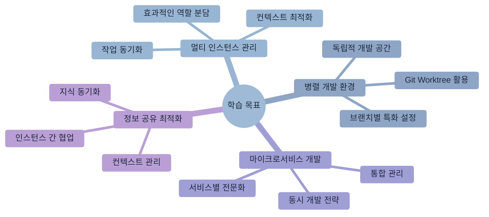
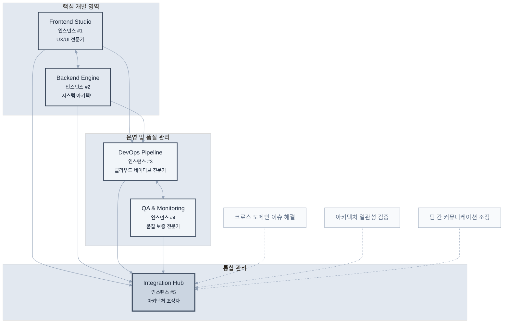
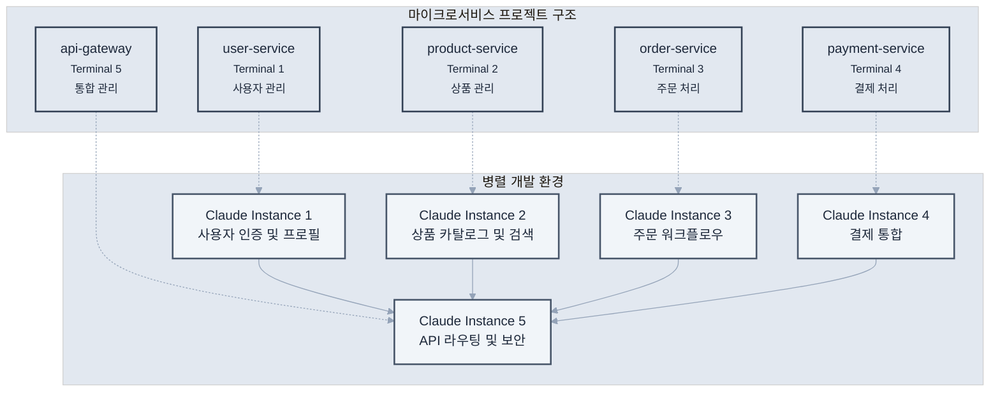
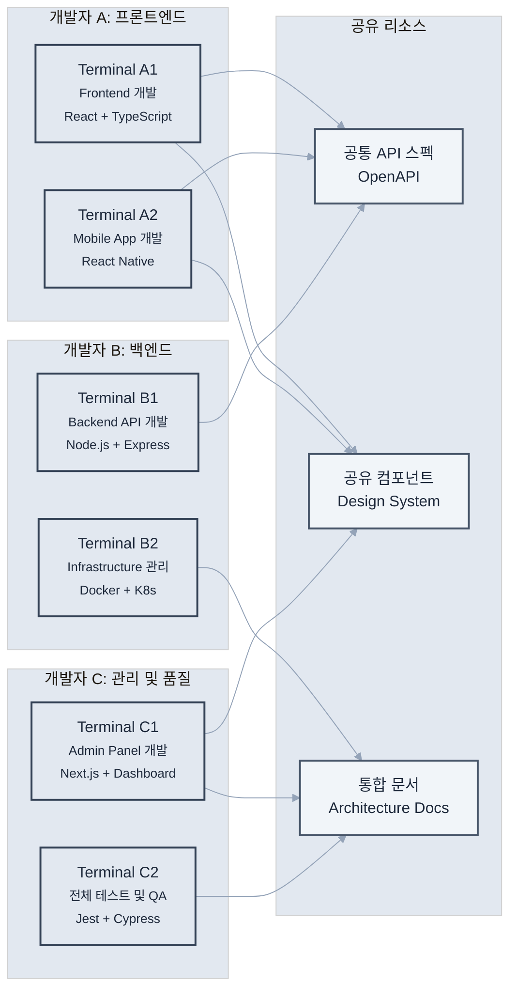

# 제8장: 멀티태스킹과 병렬 처리

> "병렬로 일하되, 동시에 생각하라" - 소프트웨어 아키텍처 원칙



## 학습 목표

이 장을 완료하면 다음을 할 수 있습니다:
- 여러 Claude Code 인스턴스를 효과적으로 관리하고 활용할 수 있습니다
- Git Worktree와 연동한 병렬 개발 환경을 구축할 수 있습니다
- 마이크로서비스 환경에서 동시 개발을 수행할 수 있습니다
- 컨텍스트 관리와 인스턴스 간 정보 공유를 최적화할 수 있습니다

## 개요

현대 소프트웨어 개발은 복잡한 시스템을 빠르게 구축해야 하는 요구사항으로 인해 필연적으로 멀티태스킹이 필요한 환경이 되었습니다. Claude Code의 멀티 인스턴스 활용은 단순히 여러 작업을 동시에 하는 것을 넘어서, 각 인스턴스가 특화된 역할을 수행하며 시너지를 창출하는 고급 개발 전략입니다.

이 장에서는 여러 Claude Code 인스턴스를 체계적으로 관리하고, 각각의 특성에 맞는 역할을 부여하여 개발 효율성을 극대화하는 방법을 다룹니다.

## 8.1 여러 Claude 인스턴스 활용

멀티 인스턴스 전략은 각 인스턴스가 특정 도메인에 특화되어 일관성 있는 결과를 생성하도록 하는 것이 핵심입니다. 이를 통해 컨텍스트 스위칭 비용을 줄이고 각 영역별 전문성을 확보할 수 있습니다.

현대 소프트웨어 개발에서 멀티 인스턴스 활용은 단순한 병렬 작업을 넘어서 전략적 아키텍처 관점에서 접근해야 합니다. 각 인스턴스는 마치 전문 팀원처럼 고유한 역할과 책임을 가지며, 서로 다른 기술적 맥락과 비즈니스 도메인에 최적화되어 운영됩니다.

### 엔터프라이즈급 멀티 인스턴스 아키텍처

효과적인 멀티 인스턴스 전략은 단순한 작업 분할을 넘어서 각 인스턴스의 전문성과 상호 보완성을 고려한 체계적 설계가 필요합니다:



### 인스턴스별 역할 분담

**Frontend Studio (인스턴스 #1) - 사용자 경험 전문가**

프론트엔드 전용 인스턴스는 단순한 UI 개발을 넘어서 사용자 경험의 모든 측면을 담당하는 전문가 역할을 수행합니다:

```bash
# Terminal 1 (Frontend Studio)
cd frontend/
claude "당신은 프론트엔드 UX 전문가입니다. 
다음 역할에 집중해주세요:
- React/Vue/Angular 컴포넌트 아키텍처 설계
- 반응형 디자인과 접근성 최적화
- 성능 중심의 상태 관리 구현
- 브라우저 호환성과 Progressive Web App 기능
- 사용자 인터랙션 패턴과 애니메이션 최적화

현재 프로젝트: [프로젝트명]
기술 스택: React 18 + TypeScript + Vite
품질 기준: Lighthouse 95+ 점수 유지"
```

**고급 프론트엔드 패턴 예시:**

```bash
# 컴포넌트 아키텍처 설계
claude "엔터프라이즈급 디자인 시스템을 구축해줘:
- Atomic Design 방법론 적용
- 타입 안전한 테마 시스템
- 자동화된 스토리북 문서화
- 컴포넌트 성능 벤치마킹
- 시각적 회귀 테스트 통합"

# 상태 관리 최적화
claude "복잡한 애플리케이션 상태를 효율적으로 관리해줘:
- 서버 상태와 클라이언트 상태 분리
- 옵티미스틱 업데이트 패턴
- 백그라운드 동기화 전략
- 오프라인 모드 지원
- 실시간 데이터 바인딩"
```

**Backend Engine (인스턴스 #2) - 시스템 아키텍처 마스터**

백엔드 인스턴스는 확장 가능하고 안전한 서버 시스템을 구축하는 전문가로서 운영됩니다:

```bash
# Terminal 2 (Backend Engine)
cd backend/
claude "당신은 백엔드 시스템 아키텍트입니다.
다음 영역에 전문성을 발휘해주세요:
- 마이크로서비스 아키텍처와 도메인 주도 설계
- RESTful/GraphQL API 설계와 버전 관리
- 데이터베이스 최적화와 캐싱 전략
- 보안, 인증, 권한 관리 시스템
- 비동기 처리와 메시지 큐 아키텍처
- 모니터링, 로깅, 알림 시스템

현재 환경: Node.js/Python + PostgreSQL + Redis
성능 목표: 99.9% 가용성, 200ms 이하 응답시간
보안 기준: OWASP Top 10 완전 준수"
```

**엔터프라이즈 백엔드 패턴:**

```bash
# 마이크로서비스 설계
claude "확장 가능한 마이크로서비스 아키텍처를 설계해줘:
- 서비스 경계와 데이터 소유권 정의
- API Gateway와 서비스 메시 구성
- 분산 트랜잭션과 사가 패턴
- 서킷 브레이커와 벌크헤드 패턴
- 이벤트 소싱과 CQRS 적용"

# 고성능 데이터 처리
claude "대용량 데이터 처리 파이프라인을 구축해줘:
- 스트리밍 데이터 처리 (Kafka/RabbitMQ)
- 배치 처리 최적화와 병렬화
- 데이터베이스 샤딩과 레플리케이션
- 캐시 계층화 전략 (L1/L2/L3)
- 실시간 분석과 메트릭 수집"
```

**DevOps Pipeline (인스턴스 #3) - 클라우드 네이티브 전문가**

인프라 인스턴스는 현대적인 클라우드 네이티브 환경의 구축과 운영을 전담합니다:

```bash
# Terminal 3 (DevOps Pipeline)
cd infrastructure/
claude "당신은 DevOps와 클라우드 아키텍처 전문가입니다.
다음 영역을 담당해주세요:
- Infrastructure as Code (Terraform/Pulumi)
- 컨테이너 오케스트레이션 (Kubernetes/Docker Swarm)
- CI/CD 파이프라인 자동화 (GitLab CI/GitHub Actions)
- 클라우드 플랫폼 최적화 (AWS/GCP/Azure)
- 보안 강화와 컴플라이언스 관리
- 성능 모니터링과 자동 스케일링
- 재해 복구와 백업 전략

목표 환경: Production-Ready Kubernetes Cluster
가용성 목표: 99.99% uptime
보안 기준: SOC 2 Type II 준수"
```

**고급 DevOps 패턴:**

```bash
# GitOps 파이프라인 구축
claude "완전 자동화된 GitOps 파이프라인을 구현해줘:
- 멀티 환경 배포 전략 (dev/staging/prod)
- 블루-그린 배포와 카나리 릴리스
- 자동 롤백과 헬스체크 시스템
- 시크릿 관리와 암호화 (Vault/Sealed Secrets)
- 코드 품질 게이트와 보안 스캔
- 성능 테스트 자동화"

# 관찰 가능성 플랫폼
claude "종합적인 관찰 가능성 플랫폼을 구축해줘:
- 메트릭 수집과 시각화 (Prometheus/Grafana)
- 분산 추적 (Jaeger/Zipkin)
- 구조화된 로깅 (ELK/Fluentd)
- 알림과 인시던트 관리 (PagerDuty/Slack)
- SLI/SLO 정의와 에러 버짓 관리"
```

**QA & Monitoring (인스턴스 #4) - 품질 보증 전문가**

QA 인스턴스는 소프트웨어 품질의 모든 측면을 책임지는 전문가입니다:

```bash
# Terminal 4 (QA & Monitoring)
claude "당신은 품질 보증과 테스트 자동화 전문가입니다.
다음 품질 영역을 담당해주세요:
- 테스트 피라미드 전략 (Unit/Integration/E2E)
- 성능 테스트와 부하 테스트 (JMeter/k6)
- 보안 테스트와 취약점 스캔 (OWASP ZAP)
- 접근성 테스트와 사용성 평가
- 브라우저 호환성과 크로스 플랫폼 테스트
- 테스트 데이터 관리와 환경 구성
- 품질 메트릭 수집과 리포팅

품질 목표: 테스트 커버리지 90%+
성능 기준: 응답시간 200ms 이하
보안 수준: Zero known vulnerabilities"
```

**고급 QA 자동화 패턴:**

```bash
# 지능형 테스트 자동화
claude "AI 기반 테스트 자동화 시스템을 구축해줘:
- 시각적 회귀 테스트 (Applitools/Percy)
- 자동 테스트 케이스 생성과 유지보수
- 플레이키 테스트 탐지와 해결
- 테스트 실행 최적화와 병렬화
- 실패 분석과 자동 버그 리포팅"

# 프로덕션 모니터링
claude "실시간 품질 모니터링 시스템을 구현해줘:
- 실사용자 모니터링 (RUM)
- 합성 트랜잭션 모니터링
- 에러 추적과 크래시 리포팅
- A/B 테스트 플랫폼
- 사용자 피드백 수집과 분석"
```

### 컨텍스트 특화

각 인스턴스에 특화된 CLAUDE.md 설정:

**frontend/CLAUDE.md**
```markdown
# Frontend Development Context

## 주요 기술 스택
- React 18 + TypeScript
- Tailwind CSS
- React Query + Zustand

## 컴포넌트 규칙
- 함수형 컴포넌트만 사용
- Props는 인터페이스로 정의
- Storybook 스토리 필수

## 성능 최적화
- React.memo 적극 활용
- 번들 크기 최적화
- 이미지 최적화
```

**backend/CLAUDE.md**
```markdown
# Backend Development Context

## 주요 기술 스택
- Node.js + Express + TypeScript
- PostgreSQL + Prisma
- Redis for caching

## API 설계 원칙
- RESTful 설계
- 일관된 에러 응답
- Rate limiting 적용

## 보안 요구사항
- JWT 토큰 인증
- 입력 검증 필수
- SQL Injection 방지
```

**Integration Hub (인스턴스 #5) - 아키텍처 조정자**

통합 허브는 모든 인스턴스 간의 일관성과 협업을 보장하는 중앙 조정 역할을 수행합니다:

```bash
# Terminal 5 (Integration Hub)
claude "당신은 시스템 통합과 아키텍처 조정 전문가입니다.
다음 통합 영역을 담당해주세요:
- 크로스 도메인 이슈 해결과 의사결정
- 아키텍처 일관성 검증과 가이드라인 적용
- 팀 간 커뮤니케이션과 지식 공유
- 기술 부채 관리와 리팩토링 계획
- 성능 병목 지점 분석과 최적화 방향
- 프로젝트 로드맵과 우선순위 조정

책임 범위: 전체 시스템 아키텍처
목표: 일관된 사용자 경험과 개발자 경험
원칙: 단순성, 확장성, 유지보수성"
```

## 8.2 Git Worktree와의 고급 통합 전략

### 엔터프라이즈급 Worktree 아키텍처

Git Worktree를 활용한 병렬 개발은 단순한 브랜치 분리를 넘어서 각 작업 영역의 독립성과 안전성을 보장하는 전략적 접근이 필요합니다:

```bash
# 엔터프라이즈급 워크트리 아키텍처 구성
# 1. 기능별 격리된 개발 환경
git worktree add ../project-auth-service feature/auth-microservice
git worktree add ../project-payment-gateway feature/payment-integration
git worktree add ../project-user-dashboard feature/dashboard-redesign
git worktree add ../project-mobile-api feature/mobile-optimization
git worktree add ../project-security-audit hotfix/security-vulnerabilities

# 2. 각 워크트리에 특화된 Claude 설정
cd ../project-auth-service
echo "# Authentication Service Context" > CLAUDE.md
echo "Focus: OAuth2/JWT implementation, security best practices" >> CLAUDE.md
echo "Tech Stack: Node.js + Express + Passport" >> CLAUDE.md
echo "Security Level: CRITICAL - all inputs must be validated" >> CLAUDE.md
claude "당신은 보안 인증 시스템 전문가입니다. 
OAuth2와 JWT를 활용한 엔터프라이즈급 인증 시스템을 구축해주세요.
보안 모범 사례와 OWASP 가이드라인을 엄격히 준수해주세요."

cd ../project-payment-gateway
echo "# Payment Gateway Context" > CLAUDE.md
echo "Focus: PCI DSS compliance, payment processing" >> CLAUDE.md
echo "Tech Stack: Python + FastAPI + Stripe/PayPal" >> CLAUDE.md
echo "Compliance: PCI DSS Level 1, SOX compliance required" >> CLAUDE.md
claude "당신은 결제 시스템 전문가입니다.
PCI DSS 준수와 금융 보안 요구사항을 충족하는
안전하고 확장 가능한 결제 게이트웨이를 구현해주세요."

cd ../project-user-dashboard
echo "# User Dashboard Context" > CLAUDE.md
echo "Focus: React performance, user experience" >> CLAUDE.md
echo "Tech Stack: React 18 + TypeScript + Tailwind" >> CLAUDE.md
echo "Performance: Lighthouse 95+, Core Web Vitals optimized" >> CLAUDE.md
claude "당신은 프론트엔드 UX 전문가입니다.
사용자 중심의 대시보드를 설계하고 구현해주세요.
성능 최적화와 접근성을 최우선으로 고려해주세요."
```

### 지능형 Worktree 관리 시스템

Worktree 관리를 자동화하여 개발자의 인지 부담을 줄이고 일관된 개발 환경을 보장합니다:

```bash
# 고급 워크트리 관리 자동화
claude "엔터프라이즈급 Git Worktree 관리 시스템을 구축해줘:

주요 기능:
1. 기능별 템플릿 기반 워크트리 생성
2. 환경별 CLAUDE.md 자동 설정
3. 의존성 충돌 탐지와 해결
4. 작업 진행률 추적과 리포팅
5. 자동 정리와 아카이빙
6. 팀 협업을 위한 워크트리 공유

기술 요구사항:
- Shell scripting with error handling
- JSON/YAML 설정 파일 지원
- 크로스 플랫폼 호환성 (Linux/macOS/Windows)
- 로깅과 감사 추적
- 백업과 복구 메커니즘"
```

생성되는 스크립트 예시:

```bash
#!/bin/bash
# new-feature.sh

FEATURE_NAME=$1
WORKTREE_PATH="../project-$FEATURE_NAME"

# 브랜치 생성
git checkout -b "feature/$FEATURE_NAME"

# Worktree 추가
git worktree add "$WORKTREE_PATH" "feature/$FEATURE_NAME"

# 새 터미널에서 Claude 시작
cd "$WORKTREE_PATH"
osascript -e "tell app \"Terminal\" to do script \"cd $WORKTREE_PATH && claude\""

echo "Feature branch 'feature/$FEATURE_NAME' created in $WORKTREE_PATH"
```

## 8.3 마이크로서비스 동시 개발

### 서비스별 개발 환경 분리



### 서비스 간 통신 관리

**API 게이트웨이 개발**

```bash
# Terminal 1 (API Gateway)
claude "API Gateway를 구현해줘.
라우팅, 인증, 로드 밸런싱, 모니터링을 포함해줘"
```

**개별 서비스 개발**

```bash
# Terminal 2 (User Service)
claude "사용자 관리 마이크로서비스를 개발해줘.
회원가입, 로그인, 프로필 관리 기능을 포함해줘"

# Terminal 3 (Product Service)  
claude "상품 관리 마이크로서비스를 개발해줘.
상품 CRUD, 재고 관리, 검색 기능을 포함해줘"
```

### 서비스 간 계약 관리

```bash
# OpenAPI 스펙 동기화
claude "각 서비스의 OpenAPI 스펙을 생성하고,
API Gateway에서 통합 문서를 만들어줘"
```

## 8.4 프론트엔드-백엔드 병렬 작업

### API 우선 개발

**1단계: API 스펙 정의**

```bash
# 공통 작업
claude "사용자 관리 API의 OpenAPI 스펙을 정의해줘.
엔드포인트, 요청/응답 스키마, 에러 코드를 포함해줘"
```

**2단계: 병렬 개발**

```bash
# Terminal 1 (Backend)
claude "정의된 API 스펙에 따라 백엔드를 구현해줘.
Mock 데이터로 먼저 동작하게 만들어줘"

# Terminal 2 (Frontend)  
claude "API 스펙을 기반으로 프론트엔드를 구현해줘.
MSW를 사용해서 API를 모킹해줘"
```

### 타입 공유 전략

```bash
# 공통 타입 정의
claude "백엔드와 프론트엔드에서 공유할 타입 정의를 만들어줘.
Zod 스키마에서 TypeScript 타입을 자동 생성하도록 해줘"
```

### 실시간 동기화

```bash
# API 변경 시 자동 업데이트
claude "백엔드 API가 변경되면 프론트엔드 타입도 
자동으로 업데이트하는 시스템을 구축해줘"
```

## 8.5 효율적인 컨텍스트 관리

### 컨텍스트 스위칭 최적화

**작업 컨텍스트 저장**

```bash
# Terminal 1에서 작업 중단 시
claude "현재 작업 상황을 요약해줘.
다음에 다시 시작할 때 필요한 정보를 포함해줘"
```

**컨텍스트 복원**

```bash
# 다시 작업 시작 시
claude "이전에 작업하던 사용자 인증 기능을 계속해줘.
마지막 상태부터 이어서 진행해줘"
```

### 브랜치별 컨텍스트 관리

```bash
# 브랜치 전환 시 컨텍스트 자동 로드
claude "현재 브랜치(feature/user-auth)의 컨텍스트를 로드해줘.
관련 파일들과 작업 기록을 확인해줘"
```

### 인스턴스 간 정보 공유

**공통 문서 활용**

```markdown
# shared/context.md
## 현재 진행 상황
- Frontend: 로그인 컴포넌트 50% 완료
- Backend: 인증 API 80% 완료  
- Database: 스키마 완료, 마이그레이션 필요
- Testing: 단위 테스트 작성 중

## 공통 결정사항
- JWT 토큰 만료 시간: 1시간
- API 응답 형식: { success, data, message }
- 에러 코드 체계: HTTP 상태 코드 + 커스텀 코드
```

## 8.6 병렬 처리 실전 예제

### 시나리오: 전자상거래 플랫폼 구축

**프로젝트 구조**

```
ecommerce/
├── frontend/          # React 앱
├── backend/           # Node.js API  
├── admin-panel/       # 관리자 페이지
├── mobile-app/        # React Native
└── infrastructure/    # Docker, K8s
```

**팀 구성과 인스턴스 배치**



### 1주차: 프로젝트 설정

**Day 1-2: 기반 구조**

```bash
# Terminal A1 (Frontend)
claude "React + TypeScript + Vite 프로젝트를 설정해줘.
상태 관리, 라우팅, UI 라이브러리를 포함해줘"

# Terminal B1 (Backend)
claude "Express + TypeScript + Prisma 프로젝트를 설정해줘.
인증, 로깅, 에러 핸들링을 포함해줘"

# Terminal B2 (Infrastructure)
claude "Docker Compose로 개발 환경을 구성해줘.
PostgreSQL, Redis, Nginx를 포함해줘"
```

**Day 3-5: 핵심 기능**

```bash
# 병렬 개발 시작
# Terminal A1: 제품 목록 컴포넌트
# Terminal A2: 모바일 네비게이션
# Terminal B1: 제품 API
# Terminal B2: 인증 시스템
# Terminal C1: 관리자 대시보드
```

### 2주차: 통합과 테스트

```bash
# Terminal A1: 프론트엔드 통합 테스트
claude "React Testing Library로 핵심 플로우를 테스트해줘"

# Terminal B1: API 통합 테스트  
claude "Jest + Supertest로 API 엔드포인트를 테스트해줘"

# Terminal C2: E2E 테스트
claude "Playwright로 전체 사용자 플로우를 테스트해줘"
```

## 멀티태스킹 최적화 팁

### 1. 작업 우선순위 관리

```bash
# 우선순위 매트릭스
claude "현재 진행 중인 작업들의 우선순위를 정리해줘.
긴급도와 중요도를 기준으로 매트릭스를 만들어줘"
```

### 2. 종속성 관리

```bash
# 의존성 그래프 생성
claude "작업 간 의존성을 분석해서 최적의 순서를 제안해줘.
병렬 처리 가능한 작업도 식별해줘"
```

### 3. 리소스 모니터링

```bash
# 시스템 리소스 확인
claude "현재 실행 중인 Claude 인스턴스들이 
시스템 리소스를 얼마나 사용하는지 확인해줘"
```

### 4. 동기화 포인트 설정

```bash
# 정기적인 동기화
claude "팀 작업 진행 상황을 정리하고,
다음 마일스톤까지의 계획을 세워줘"
```

## 멀티태스킹 CLAUDE.md 예시

```markdown
# Multi-Instance Development

## 인스턴스 역할 분담
- Terminal 1: Frontend (React/Next.js)
- Terminal 2: Backend (Node.js/Python)  
- Terminal 3: Mobile (React Native/Flutter)
- Terminal 4: DevOps (Docker/K8s)
- Terminal 5: Testing (Jest/Cypress)

## 컨텍스트 스위칭 규칙
- 작업 중단 시 상태 저장 필수
- 30분마다 진행 상황 공유
- 중요한 결정은 모든 인스턴스에 전파

## 동기화 포인트
- 매일 오전 9시: 일일 계획 공유
- 매일 오후 5시: 진행 상황 정리
- 주 2회: 아키텍처 리뷰

## 충돌 해결 절차
1. Git 충돌 시 우선순위 규칙 적용
2. API 변경 시 관련 팀 즉시 알림
3. 공통 파일 수정 시 락 메커니즘 사용
```

## 마치며

멀티태스킹과 병렬 처리는 현대 개발의 필수 역량이며, Claude Code의 다중 인스턴스 활용은 개발 생산성을 혁신적으로 향상시킬 수 있는 강력한 전략입니다.

### 핵심 원칙 요약

1. **효율성 극대화**: 여러 작업의 동시 진행을 통한 개발 속도 향상
2. **컨텍스트 분리**: 각 작업에 특화된 환경 구성으로 품질 일관성 확보
3. **유연한 협업**: 팀원 간 효율적인 분업과 동기화 체계 구축
4. **빠른 반복**: 신속한 개발 사이클과 즉각적인 피드백 시스템

### 실무 적용 가이드

- **프로젝트 시작**: 작업 분해와 인스턴스별 역할 정의
- **개발 중**: 정기적인 동기화와 진행 상황 공유
- **통합 단계**: 체계적인 머지 전략과 충돌 해결
- **최적화**: 리소스 모니터링과 워크플로우 개선

다음 장에서는 이러한 병렬 처리 환경을 자동화하고 CI/CD 파이프라인에 통합하여 지속적인 개발 프로세스를 구축하는 방법을 살펴보겠습니다.