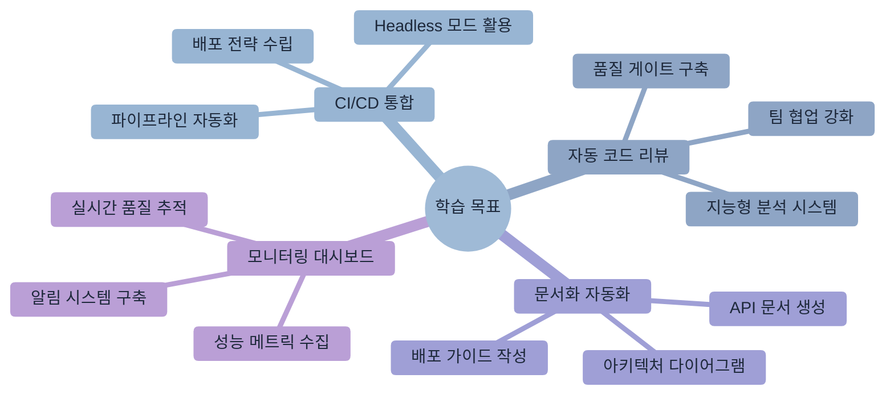
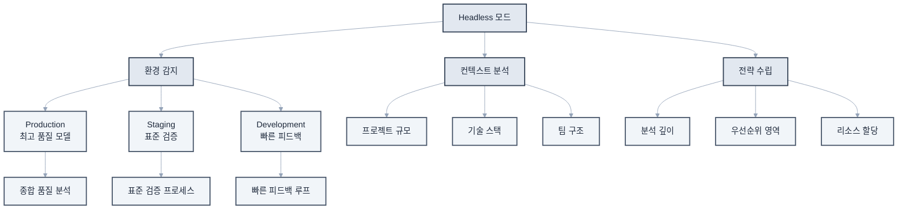
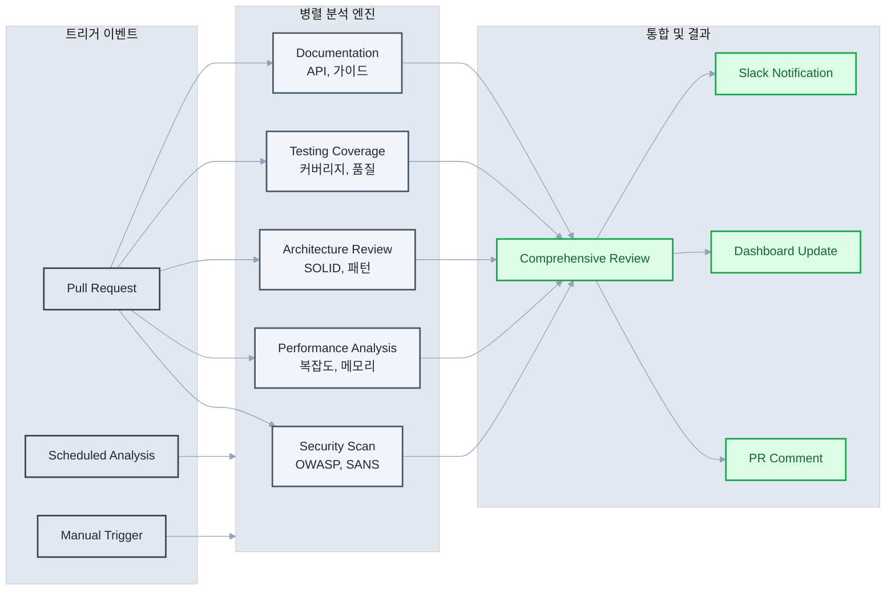
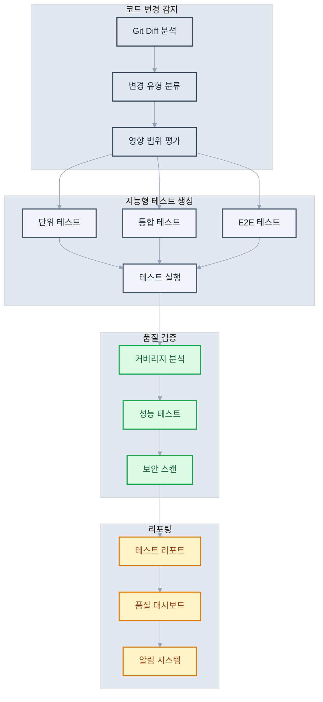

# 제9장: 자동화와 CI/CD 통합

> "자동화의 힘은 반복을 제거하고 창의성을 해방시키는 것이다" - 마틴 파울러



## 학습 목표

이 장을 완료하면 다음을 할 수 있습니다
- Claude Code를 CI/CD 파이프라인에 통합하여 자동화된 개발 프로세스를 구축할 수 있습니다
- Headless 모드를 활용하여 자동 코드 리뷰와 품질 검사 시스템을 구현할 수 있습니다
- 문서 자동 생성과 배포 프로세스 자동화를 설정할 수 있습니다
- 품질 게이트와 통합 대시보드를 구축하여 지속적인 모니터링을 수행할 수 있습니다

## 개요

현대 소프트웨어 개발에서 자동화는 선택이 아닌 필수 요소가 되었습니다. 빠른 배포 주기, 높은 품질 요구사항, 그리고 지속적인 전달 필요성이 자동화를 넘어설 수 없는 환경을 만들었습니다.

Claude Code를 CI/CD 파이프라인에 통합하는 것은 단순한 도구 추가를 넘어서, 지능적인 자동화 시스템을 구축하는 것입니다. 이를 통해 코드 품질 향상, 배포 안정성 증대, 그리고 지속적인 개선 문화를 동시에 달성할 수 있습니다.

전통적인 CI/CD가 정적인 규칙 기반 자동화에 의존했다면, Claude Code 통합 시스템은 컨텍스트를 이해하고 적응하는 지능형 자동화를 제공합니다. 이는 개발 프로세스의 패러다임 변화를 의미하며, 개발자가 창의적 작업에 더 집중할 수 있는 환경을 조성합니다.

## 9.1 지능형 Headless 모드 아키텍처

### 엔터프라이즈급 Headless 통합 전략

Claude Code의 Headless 모드는 단순한 명령행 도구를 넘어서 엔터프라이즈급 자동화 생태계의 핵심 인프라로 기능합니다. 이 모드는 다양한 자동화 시나리오에 맞춰 유연하게 확장되며, 대규모 개발 조직의 복잡한 요구사항을 충족합니다.



**지능형 컨텍스트 인식 시스템:**

Headless 모드는 실행 환경, 프로젝트 상태, 팀 규칙을 자동으로 감지하여 최적화된 분석을 제공합니다. 이는 단순한 명령 실행을 넘어서 프로젝트의 전체적인 맥락을 이해하고 적절한 판단을 내리는 지능형 시스템입니다.

**고급 Headless 실행 패턴:**

```bash
# 환경별 적응형 분석
claude --headless --context production \
  "프로덕션 배포를 위한 종합 위험도 평가를 수행해주세요.
   보안, 성능, 안정성, 비즈니스 임팩트를 종합 분석하고
   배포 승인 여부를 JSON 형태로 제공해주세요."

# 실시간 스트리밍 분석
claude --headless --stream --output-format json \
  "대용량 코드 변경사항을 실시간으로 분석하며
   중요한 이슈 발견 시 즉시 알림을 제공해주세요."

# 지능형 조건부 실행
#!/bin/bash
# advanced-quality-gate.sh

set -euo pipefail

# 환경 감지 및 설정
DETECT_ENV=$(claude --headless --quiet \
  "현재 Git 브랜치와 변경사항을 분석하여
   적절한 품질 검증 수준을 결정해주세요 (minimal/standard/strict)")

case $DETECT_ENV in
  "strict")
    QUALITY_THRESHOLD=95
    SECURITY_SCAN=true
    PERFORMANCE_TEST=true
    ;;
  "standard")
    QUALITY_THRESHOLD=85
    SECURITY_SCAN=true
    PERFORMANCE_TEST=false
    ;;
  "minimal")
    QUALITY_THRESHOLD=75
    SECURITY_SCAN=false
    PERFORMANCE_TEST=false
    ;;
esac

# 적응형 품질 분석
QUALITY_RESULT=$(claude --headless --output quality-report.json \
  "코드 품질을 $QUALITY_THRESHOLD% 기준으로 분석해주세요.
   기준: 복잡도, 중복도, 테스트 커버리지, 문서화 수준
   결과: pass/fail과 상세 개선 방안")

# 조건부 보안 스캔
if [ "$SECURITY_SCAN" = true ]; then
  SECURITY_RESULT=$(claude --headless --output security-report.json \
    "OWASP Top 10과 SANS Top 25 기준으로
     보안 취약점을 종합 분석해주세요.
     심각도별 분류와 수정 우선순위 포함")
fi

# 지능형 의사결정
DECISION=$(claude --headless \
  "품질 리포트와 보안 리포트를 종합하여
   배포 승인 여부를 결정해주세요.
   결정 근거와 함께 명확한 approve/reject 답변")

if [[ $DECISION == *"approve"* ]]; then
  echo "✅ 품질 게이트 통과 - 배포 승인"
  exit 0
else
  echo "❌ 품질 게이트 실패 - 개선 필요"
  claude --headless "개선 방안과 예상 소요 시간을 제시해주세요"
  exit 1
fi
```

### 엔터프라이즈 환경 구성 관리

**다층 구성 시스템:**

```bash
# 기본 환경 변수 (모든 환경 공통)
export CLAUDE_API_KEY="sk-ant-..."
export CLAUDE_MODEL="claude-3-sonnet-20240229"  # 비용 효율적 기본 모델
export CLAUDE_HEADLESS=true
export CLAUDE_TIMEOUT=300  # 5분 타임아웃
export CLAUDE_RETRY_COUNT=3
export CLAUDE_LOG_LEVEL="info"

# 환경별 세부 구성
case "$ENVIRONMENT" in
  "production")
    export CLAUDE_MODEL="claude-3-opus-20240229"  # 최고 품질
    export CLAUDE_OUTPUT_FORMAT="structured-json"
    export CLAUDE_VALIDATION_STRICT=true
    export CLAUDE_AUDIT_ENABLED=true
    ;;
  "staging")
    export CLAUDE_MODEL="claude-3-sonnet-20240229"
    export CLAUDE_OUTPUT_FORMAT="json"
    export CLAUDE_VALIDATION_STANDARD=true
    ;;
  "development")
    export CLAUDE_MODEL="claude-3-haiku-20240307"  # 빠른 반응
    export CLAUDE_OUTPUT_FORMAT="markdown"
    export CLAUDE_VALIDATION_MINIMAL=true
    ;;
esac

# 프로젝트별 컨텍스트 구성
export CLAUDE_PROJECT_TYPE="web-application"
export CLAUDE_TECH_STACK="react,node,typescript,postgresql"
export CLAUDE_TEAM_SIZE="12"
export CLAUDE_COMPLIANCE_LEVEL="SOC2"  # SOC2, HIPAA, PCI-DSS 등
export CLAUDE_QUALITY_GATES="security,performance,accessibility"

# 고급 기능 설정
export CLAUDE_CACHE_ENABLED=true
export CLAUDE_CACHE_TTL=3600  # 1시간
export CLAUDE_PARALLEL_ANALYSIS=true
export CLAUDE_MAX_CONCURRENT=4
export CLAUDE_MEMORY_LIMIT="2GB"

# 보안 및 규정 준수
export CLAUDE_DATA_RESIDENCY="us-east-1"
export CLAUDE_PII_DETECTION=true
export CLAUDE_SENSITIVE_DATA_MASKING=true
export CLAUDE_AUDIT_LOG_RETENTION="90d"
```

**동적 구성 로더:**

```bash
#!/bin/bash
# claude-config-loader.sh

# 프로젝트별 동적 구성 로드
load_claude_config() {
    local project_root="$(git rev-parse --show-toplevel)"
    local config_file="$project_root/.claude/ci-config.json"
    
    if [[ -f "$config_file" ]]; then
        # JSON 구성 파일에서 환경 변수 로드
        eval "$(jq -r 'to_entries[] | "export CLAUDE_\(.key | ascii_upcase)=\(.value)"' "$config_file")"
    fi
    
    # Git 메타데이터 기반 자동 설정
    export CLAUDE_GIT_BRANCH="$(git rev-parse --abbrev-ref HEAD)"
    export CLAUDE_GIT_COMMIT="$(git rev-parse HEAD)"
    export CLAUDE_GIT_AUTHOR="$(git log -1 --pretty=format:'%an')"
    
    # 프로젝트 규모 자동 탐지
    local file_count=$(find . -name "*.ts" -o -name "*.js" -o -name "*.py" | wc -l)
    if (( file_count > 1000 )); then
        export CLAUDE_PROJECT_SCALE="large"
        export CLAUDE_ANALYSIS_DEPTH="comprehensive"
    elif (( file_count > 100 )); then
        export CLAUDE_PROJECT_SCALE="medium"
        export CLAUDE_ANALYSIS_DEPTH="standard"
    else
        export CLAUDE_PROJECT_SCALE="small"
        export CLAUDE_ANALYSIS_DEPTH="focused"
    fi
}

# 사용법
load_claude_config
```

## 9.2 지능형 자동 코드 리뷰 생태계

### GitHub Actions 엔터프라이즈 통합

지능형 코드 리뷰 시스템은 단순한 정적 분석을 넘어서 프로젝트 맥락을 이해하고 적응하는 동적 분석 플랫폼입니다



```yaml
# .github/workflows/claude-enterprise-review.yml
name: Claude Enterprise Code Review

on:
  pull_request:
    types: [opened, synchronize, ready_for_review]
  schedule:
    - cron: '0 2 * * *'  # 매일 새벽 2시 전체 코드베이스 분석

env:
  CLAUDE_PROJECT_CONTEXT: ${{ github.repository }}
  CLAUDE_ENVIRONMENT: ${{ github.ref_name == 'main' && 'production' || 'development' }}

jobs:
  # 사전 분석 단계
  pre-analysis:
    runs-on: ubuntu-latest
    outputs:
      analysis-scope: ${{ steps.scope.outputs.scope }}
      review-strategy: ${{ steps.strategy.outputs.strategy }}
      estimated-cost: ${{ steps.cost.outputs.cost }}
    steps:
      - uses: actions/checkout@v4
        with:
          fetch-depth: 0
      
      - name: Determine Analysis Scope
        id: scope
        run: |
          CHANGED_FILES=$(git diff --name-only HEAD~1)
          FILE_COUNT=$(echo "$CHANGED_FILES" | wc -l)
          
          if (( FILE_COUNT > 50 )); then
            echo "scope=comprehensive" >> $GITHUB_OUTPUT
          elif (( FILE_COUNT > 10 )); then
            echo "scope=standard" >> $GITHUB_OUTPUT
          else
            echo "scope=focused" >> $GITHUB_OUTPUT
          fi
      
      - name: Determine Review Strategy
        id: strategy
        env:
          CLAUDE_API_KEY: ${{ secrets.CLAUDE_API_KEY }}
        run: |
          claude --headless --output strategy.json \
            "변경된 파일들을 분석하여 최적의 리뷰 전략을 결정해주세요:
             - 변경 범위와 복잡도 평가
             - 우선순위 영역 식별
             - 리뷰 깊이 수준 결정
             - 예상 분석 시간
             결과는 JSON 형태로 제공"
          
          STRATEGY=$(jq -r '.strategy' strategy.json)
          echo "strategy=$STRATEGY" >> $GITHUB_OUTPUT
  
  # 병렬 코드 분석
  parallel-analysis:
    runs-on: ubuntu-latest
    needs: pre-analysis
    strategy:
      matrix:
        analysis-type: [security, performance, architecture, testing, documentation]
      fail-fast: false
    steps:
      - uses: actions/checkout@v4
        with:
          fetch-depth: 0
      
      - name: Setup Analysis Environment
        run: |
          npm install -g @anthropic-ai/claude-code
          # 분석 타입별 전용 도구 설치
          case "${{ matrix.analysis-type }}" in
            security) npm install -g eslint-plugin-security ;;
            performance) npm install -g clinic autocannon ;;
            testing) npm install -g jest-coverage-badges ;;
          esac
      
      - name: Run Specialized Analysis
        env:
          CLAUDE_API_KEY: ${{ secrets.CLAUDE_API_KEY }}
          ANALYSIS_TYPE: ${{ matrix.analysis-type }}
          ANALYSIS_SCOPE: ${{ needs.pre-analysis.outputs.analysis-scope }}
        run: |
          case "$ANALYSIS_TYPE" in
            "security")
              claude --headless --output security-analysis.json \
                "보안 중심 코드 분석을 수행해주세요
                 - OWASP Top 10 취약점 스캔
                 - 민감 정보 노출 검사
                 - 인증/인가 로직 검증
                 - SQL Injection 및 XSS 가능성
                 - 암호화 및 해시 적용 검토
                 심각도별 분류와 즉시 수정 필요 항목 표시"
              ;;
            "performance")
              claude --headless --output performance-analysis.json \
                "성능 중심 코드 분석을 수행해주세요
                 - 알고리즘 복잡도 분석
                 - 메모리 사용 패턴 검토
                 - 데이터베이스 쿼리 최적화 기회
                 - 캐싱 전략 개선점
                 - 번들 크기 및 로딩 성능
                 성능 임팩트 예측과 개선 방안 제시"
              ;;
            "architecture")
              claude --headless --output architecture-analysis.json \
                "아키텍처 중심 코드 분석을 수행해주세요
                 - SOLID 원칙 준수 여부
                 - 디자인 패턴 적용 검토
                 - 의존성 그래프 복잡도
                 - 모듈화 및 결합도 분석
                 - 확장성 및 유지보수성
                 리팩토링 우선순위와 방법 제안"
              ;;
            "testing")
              claude --headless --output testing-analysis.json \
                "테스트 중심 코드 분석을 수행해주세요
                 - 테스트 커버리지 부족 영역
                 - 테스트 품질 및 신뢰성
                 - Edge case 및 예외 상황 처리
                 - Mock 및 Stub 적절성
                 - 통합 테스트 시나리오
                 누락된 테스트 케이스와 생성 방법 제안"
              ;;
            "documentation")
              claude --headless --output documentation-analysis.json \
                "문서화 중심 코드 분석을 수행해주세요
                 - API 문서 완성도
                 - 코드 주석 품질
                 - README 및 가이드 적절성
                 - 아키텍처 문서 동기화
                 - 온보딩 문서 현황
                 문서화 개선 방안과 자동화 기회 제시"
              ;;
          esac
      
      - name: Upload Analysis Results
        uses: actions/upload-artifact@v4
        with:
          name: ${{ matrix.analysis-type }}-analysis
          path: ${{ matrix.analysis-type }}-analysis.json
          retention-days: 30
  
  # 종합 리뷰 생성
  comprehensive-review:
    runs-on: ubuntu-latest
    needs: [pre-analysis, parallel-analysis]
    steps:
      - uses: actions/checkout@v4
      
      - name: Download All Analysis Results
        uses: actions/download-artifact@v4
        with:
          path: analysis-results
      
      - name: Generate Comprehensive Review
        env:
          CLAUDE_API_KEY: ${{ secrets.CLAUDE_API_KEY }}
        run: |
          claude --headless --output comprehensive-review.json \
            "모든 분석 결과를 종합하여 포괄적인 코드 리뷰를 생성해주세요:
             
             분석 결과 파일들:
             $(find analysis-results -name '*.json' | head -10)
             
             종합 요구사항:
             1. 전체적인 코드 품질 평가 (0-100점)
             2. 카테고리별 세부 점수
             3. 가장 우선적으로 해결할 이슈 Top 5
             4. 긍정적인 변화와 개선사항
             5. 장기적 기술 부채 관리 방안
             6. 팀 학습 기회 및 지식 공유 포인트
             
             리뷰 형식: GitHub PR 댓글에 적합한 마크다운
             톤: 건설적이고 교육적, 구체적 개선 방안 포함"
      
      - name: Advanced PR Comment with Rich Formatting
        uses: actions/github-script@v7
        with:
          script: |
            const fs = require('fs');
            const review = JSON.parse(fs.readFileSync('comprehensive-review.json', 'utf8'));
            
            // 동적 배지 생성
            const qualityBadge = review.overall_score >= 90 ? '🟢' : 
                               review.overall_score >= 75 ? '🟡' : '🔴';
            
            const comment = `
            ## ${qualityBadge} Claude Enterprise Code Review
            
            > **전체 품질 점수: ${review.overall_score}/100** | 분석 완료: ${new Date().toLocaleString()}
            
            ### 📊 카테고리별 점수
            | 영역 | 점수 | 상태 |
            |------|------|------|
            | 🔒 보안 | ${review.security_score}/100 | ${review.security_score >= 85 ? '✅' : '⚠️'} |
            | ⚡ 성능 | ${review.performance_score}/100 | ${review.performance_score >= 85 ? '✅' : '⚠️'} |
            | 🏗️ 아키텍처 | ${review.architecture_score}/100 | ${review.architecture_score >= 85 ? '✅' : '⚠️'} |
            | 🧪 테스트 | ${review.testing_score}/100 | ${review.testing_score >= 85 ? '✅' : '⚠️'} |
            | 📚 문서화 | ${review.documentation_score}/100 | ${review.documentation_score >= 85 ? '✅' : '⚠️'} |
            
            ### 🚨 우선 해결 항목
            ${review.priority_issues.map((issue, index) => 
              `${index + 1}. **${issue.title}** (${issue.severity})
                 - 📍 위치: ${issue.location}
                 - 💡 해결방안: ${issue.solution}`
            ).join('\n\n')}
            
            ### 🎉 긍정적 변화
            ${review.positive_changes.map(change => `- ✨ ${change}`).join('\n')}
            
            ### 💡 개선 제안
            <details>
            <summary>상세 개선 방안 보기</summary>
            
            ${review.improvements.map(improvement => 
              `#### ${improvement.category}
               ${improvement.suggestions.map(s => `- ${s}`).join('\n')}`
            ).join('\n\n')}
            </details>
            
            ### 📈 기술 부채 관리
            ${review.tech_debt.map(debt => 
              `- **${debt.area}**: ${debt.description} (예상 해결 시간: ${debt.effort})`
            ).join('\n')}
            
            ### 🎓 학습 기회
            ${review.learning_opportunities.map(opportunity => `- 📖 ${opportunity}`).join('\n')}
            
            ---
            <sub>🤖 Generated by Claude Enterprise Code Review System | 분석 범위: ${process.env.ANALYSIS_SCOPE} | 전략: ${process.env.REVIEW_STRATEGY}</sub>
            `;
            
            github.rest.issues.createComment({
              issue_number: context.issue.number,
              owner: context.repo.owner,
              repo: context.repo.repo,
              body: comment
            });
      
      - name: Create Review Summary for Dashboard
        run: |
          claude --headless --output dashboard-summary.json \
            "코드 리뷰 결과를 팀 대시보드용으로 요약해주세요
             - 주요 메트릭 및 트렌드
             - 팀 성과 지표
             - 권장 액션 아이템
             JSON 형태로 제공"
      
      - name: Send Slack Notification for Critical Issues
        if: ${{ contains(fromJSON(readFile('comprehensive-review.json')).priority_issues[*].severity, 'critical') }}
        run: |
          curl -X POST -H 'Content-type: application/json' \
            --data '{"text":"🚨 Critical issues detected in PR #${{ github.event.number }}"}' \
            ${{ secrets.SLACK_WEBHOOK_URL }}
```

### GitLab CI 엔터프라이즈 통합

```yaml
# .gitlab-ci.yml
stages:
  - prepare
  - analyze
  - review
  - security
  - deploy

variables:
  CLAUDE_PROJECT_ID: $CI_PROJECT_ID
  CLAUDE_PIPELINE_ID: $CI_PIPELINE_ID
  CLAUDE_ENVIRONMENT: $CI_ENVIRONMENT_NAME

# 사전 분석 및 전략 수립
prepare-analysis:
  stage: prepare
  image: node:20-alpine
  before_script:
    - apk add --no-cache git jq
    - npm install -g @anthropic-ai/claude-code
  script:
    - |
      # 변경 사항 및 프로젝트 메타데이터 수집
      echo "Analyzing project metadata and changes..."
      
      CHANGED_FILES=$(git diff --name-only $CI_COMMIT_BEFORE_SHA..$CI_COMMIT_SHA | wc -l)
      PROJECT_SIZE=$(find . -name "*.ts" -o -name "*.js" -o -name "*.py" | wc -l)
      
      # 지능형 분석 전략 결정
      claude --headless --output analysis-strategy.json \
        "변경된 파일 수: $CHANGED_FILES, 전체 프로젝트 크기: $PROJECT_SIZE
         기반으로 최적의 분석 전략을 수립해주세요
         - 분석 깊이 (shallow/standard/deep)
         - 우선 순위 영역 (security/performance/architecture)
         - 예상 소요 시간
         - 리소스 할당 방안
         결과는 GitLab CI 변수로 사용 가능하게 JSON으로 제공"
      
      # 전략을 환경 변수로 설정
      STRATEGY_DEPTH=$(jq -r '.depth' analysis-strategy.json)
      echo "ANALYSIS_DEPTH=$STRATEGY_DEPTH" >> analysis.env
      
      PRIORITY_AREAS=$(jq -r '.priority_areas[]' analysis-strategy.json | tr '\n' ',')
      echo "PRIORITY_AREAS=$PRIORITY_AREAS" >> analysis.env
  artifacts:
    reports:
      dotenv: analysis.env
    paths:
      - analysis-strategy.json
    expire_in: 1 day

# 병렬 코드 분석
code-analysis:
  stage: analyze
  image: node:20-alpine
  needs: [prepare-analysis]
  parallel:
    matrix:
      - ANALYSIS_TYPE: [security, performance, architecture, testing, compliance]
  before_script:
    - apk add --no-cache git python3 py3-pip
    - npm install -g @anthropic-ai/claude-code
    # 분석 타입별 전용 도구 설치
    - |
      case "$ANALYSIS_TYPE" in
        security) 
          npm install -g eslint-plugin-security semgrep
          pip install bandit safety
          ;;
        performance)
          npm install -g clinic autocannon
          pip install py-spy memory-profiler
          ;;
        compliance)
          npm install -g license-checker
          pip install licensecheck
          ;;
      esac
  script:
    - |
      echo "Running $ANALYSIS_TYPE analysis with depth: $ANALYSIS_DEPTH"
      
      case "$ANALYSIS_TYPE" in
        "security")
          # 다단계 보안 분석
          echo "Running multi-layered security analysis..."
          
          # 1. 정적 분석 도구 실행
          semgrep --config=auto --json . > static-security.json || true
          
          # 2. Claude 지능형 분석
          claude --headless --output security-analysis.json \
            "엔터프라이즈급 보안 감사를 수행해주세요
             
             기본 분석
             - OWASP Top 10 2023 및 SANS Top 25 취약점
             - 인증/인가 로직 검증
             - 데이터 유출 및 민감정보 노출
             - 암호화 및 해시 적용 검토
             
             고급 분석
             - 비즈니스 로직 취약점
             - API 비율 제한 및 남용 방지
             - 다단계 인증 및 권한 체계
             - 데이터 거버너스 및 컴플라이언스
             
             규정 준수
             - SOC 2 Type II 요구사항
             - GDPR 및 CCPA 준수 사항
             - PCI DSS 데이터 보호 기준
             
             심각도별 분류와 즈시 수정 필요 사항 명시"
          ;;
        "performance")
          echo "Running comprehensive performance analysis..."
          
          # 성능 벤치마크 실행
          npm run build 2>/dev/null || echo "Build step skipped"
          
          claude --headless --output performance-analysis.json \
            "엔터프라이즈급 성능 최적화 분석을 수행해주세요
             
             코드 레벨 분석
             - 알고리즘 복잡도 및 Big-O 분석
             - 메모리 사용 패턴 및 누수 가능성
             - CPU 집약적 작업 식별
             - I/O 병목 지점 및 비동기 처리
             
             시스템 레벨 분석
             - 데이터베이스 쿼리 최적화
             - 캐싱 전략 및 효율성
             - 네트워크 레이턴시 및 처리량
             - 리소스 풀링 및 커넥션 관리
             
             사용자 경험
             - Core Web Vitals (LCP, FID, CLS)
             - 번들 크기 및 로딩 성능
             - 렇트임 성능 및 메모리 사용량
             
             수치적 성능 임팩트 예측과 개선 로드맵 제시"
          ;;
        "architecture")
          claude --headless --output architecture-analysis.json \
            "엔터프라이즈 아키텍처 품질 분석을 수행해주세요
             
             소프트웨어 아키텍처
             - SOLID 원칙 준수 및 DDD 패턴 적용
             - 마이크로서비스 경계 및 컨텍스트 매핑
             - 의존성 그래프 복잡도 및 순환 의존성
             - 이벤트 드리반 아키텍처 및 CQRS 패턴
             
             서비스 메시 아키텍처
             - 서비스 간 통신 패턴
             - 데이터 일관성 및 트랜잭션 처리
             - 비동기 메시징 및 이벤트 소싱
             - 서킷 브레이커 및 별크헤드 패턴
             
             확장성 및 유지보수성
             - 획시적 요구사항 대응 능력
             - 코드 변경의 영향 범위
             - 리팩토링 비용 및 복잡도
             
             전략적 개선 로드맵과 마이그레이션 계획"
          ;;
        "testing")
          # 테스트 커버리지 수집
          npm test -- --coverage --json > test-coverage.json 2>/dev/null || echo "Coverage data unavailable"
          
          claude --headless --output testing-analysis.json \
            "엔터프라이즈급 테스트 품질 및 전략 분석을 수행해주세요
             
             테스트 커버리지 분석
             - 라인, 브랜치, 함수, 스테이트먼트 커버리지
             - 커버리지 결렵 영역 및 우선순위
             - 중요 비즈니스 로직의 테스트 현황
             
             테스트 품질 평가
             - 테스트 시나리오 완성도
             - Edge case 및 예외 상황 처리
             - Mock/Stub 사용의 적절성
             - 테스트 가독성 및 유지보수성
             
             테스트 전략
             - 단위/통합/E2E 테스트 균형
             - TDD/BDD 적용 기회
             - 성능 테스트 및 로드 테스트
             - 보안 테스트 및 취약점 스캔
             
             구체적 테스트 개선 방안과 우선순위"
          ;;
        "compliance")
          # 라이센스 및 다이료티 체크
          license-checker --json > licenses.json 2>/dev/null || echo "License check skipped"
          
          claude --headless --output compliance-analysis.json \
            "엔터프라이즈 컴플라이언스 및 규정 준수 분석을 수행해주세요
             
             라이센스 컴플라이언스
             - 오픈소스 라이센스 호환성
             - 상업적 사용 제약 사항
             - Copyleft 라이센스 영향 범위
             - 라이센스 충돌 및 리스크
             
             보안 컴플라이언스
             - SOC 2 Type II 요구사항
             - ISO 27001 보안 기준
             - GDPR 및 CCPA 데이터 보호
             - PCI DSS 결제 보안 기준
             
             접근성 컴플라이언스
             - WCAG 2.1 AA 수준 준수
             - Section 508 요구사항
             - ADA 컴플라이언스
             
             코드 품질 기준
             - 업계 미뫏 사례 준수
             - 코드 리뷰 및 감사 방침
             - 문서화 및 트레이스빌리티
             
             준수 개선 로드맵과 리스크 완화 방안"
          ;;
      esac
  artifacts:
    name: "$ANALYSIS_TYPE-analysis"
    paths:
      - "$ANALYSIS_TYPE-analysis.json"
    expire_in: 1 week
    when: always

# 종합 리뷰 생성
comprehensive-review:
  stage: review
  image: node:20-alpine
  needs: ["code-analysis"]
  before_script:
    - apk add --no-cache git jq curl
    - npm install -g @anthropic-ai/claude-code
  script:
    - |
      echo "Generating comprehensive code review..."
      
      # 모든 분석 결과 수집
      find . -name "*-analysis.json" -exec echo "Found analysis: {}" \;
      
      # 종합 리뷰 생성
      claude --headless --output final-review.json \
        "모든 분석 결과를 종합하여 GitLab 커밋용 종합 리뷰를 생성해주세요
         
         분석 결과 파일들
         $(find . -name '*-analysis.json' | head -10)
         
         요구사항
         1. 전체 품질 점수 (0-100)
         2. 카테고리별 세부 점수
         3. 급함 해결 항목 Top 3
         4. 장기적 개선 방안
         5. 비용 대비 효과 분석
         6. 다음 스프린트 액션 아이템
         
         형식: GitLab 메릴지 리퀘스트 댓글용 마크다운"
      
      # 프로젝트 대시보드용 메트릭 생성
      claude --headless --output metrics-dashboard.json \
        "프로젝트 대시보드용 메트릭을 생성해주세요
         - 코드 품질 트렌드
         - 팀 성과 지표
         - 기술 부채 추이
         - 배포 준비도
         JSON 형태로 제공"
      
      # GitLab MR에 댓글 생성
      if [ -n "$CI_MERGE_REQUEST_IID" ]; then
        COMMENT_BODY=$(jq -r '.review_comment' final-review.json)
        
        curl --request POST \
             --header "PRIVATE-TOKEN: $GITLAB_API_TOKEN" \
             --header "Content-Type: application/json" \
             --data "{\"body\": \"$COMMENT_BODY\"}" \
             "$CI_API_V4_URL/projects/$CI_PROJECT_ID/merge_requests/$CI_MERGE_REQUEST_IID/notes"
      fi
      
      # 품질 게이트 판단
      OVERALL_SCORE=$(jq -r '.overall_score' final-review.json)
      if [ "$OVERALL_SCORE" -lt 75 ]; then
        echo "Quality gate failed: Score $OVERALL_SCORE < 75"
        exit 1
      fi
  artifacts:
    name: "comprehensive-review"
    paths:
      - final-review.json
      - metrics-dashboard.json
    expire_in: 1 month
    reports:
      junit: review-results.xml
```

## 9.3 엔터프라이즈급 테스트 자동화 파이프라인

테스트 자동화는 단순한 코드 검증을 넘어서 전체 소프트웨어 품질 보장 체계의 핵심입니다. 현대적인 CI/CD 환경에서는 개발자가 코드를 작성하는 순간부터 프로덕션 배포까지 모든 단계에서 자동화된 품질 검증이 필요합니다.



### 지능형 테스트 생성 시스템

Claude Code는 코드 변경사항을 분석하여 맥락에 맞는 포괄적인 테스트를 자동 생성할 수 있습니다. 이는 개발자의 테스트 작성 부담을 줄이면서도 높은 품질의 테스트 코드를 보장합니다.

**적응형 테스트 생성 전략:**

```bash
# 코드 변경 기반 스마트 테스트 생성
claude --headless \
  "Git diff를 분석해서 변경된 코드에 대한 테스트를 생성해줘.
   
   변경 유형별 테스트 전략
   - 새로운 함수: 단위 테스트, 엣지 케이스, 에러 핸들링
   - 수정된 함수: 회귀 테스트, 기존 동작 보장
   - API 변경: 계약 테스트, 하위 호환성 검증
   - 데이터베이스 변경: 마이그레이션 테스트, 데이터 무결성
   - 설정 변경: 환경별 테스트, 구성 검증
   
   테스트 품질 기준
   - AAA 패턴 (Arrange-Act-Assert) 준수
   - 명확한 테스트 이름과 설명
   - 독립적이고 격리된 테스트
   - 반복 실행 가능한 멱등성 보장"

# 비즈니스 로직 중심 테스트 생성
claude --headless \
  "결제 시스템의 비즈니스 로직을 테스트하는 종합 테스트 스위트를 생성해줘.
   
   테스트 범위
   - 정상 결제 플로우 (성공 케이스)
   - 결제 실패 시나리오 (카드 거부, 잔액 부족)
   - 부분 환불과 전체 환불 처리
   - 동시 결제 요청 경합 상황
   - 외부 결제 게이트웨이 장애 대응
   - 결제 데이터 암호화와 보안 검증
   
   테스트 유형별 구현
   - 단위 테스트: 개별 함수와 메서드 검증
   - 통합 테스트: 서비스 간 상호작용 확인
   - 계약 테스트: API 스키마와 응답 형식 검증
   - E2E 테스트: 사용자 관점의 전체 플로우"

# 성능 기반 테스트 자동 생성
claude --headless \
  "애플리케이션의 성능 특성을 검증하는 테스트를 생성해줘.
   
   성능 테스트 카테고리
   - 로드 테스트: 예상 트래픽 수준에서의 응답성
   - 스트레스 테스트: 시스템 한계점 탐지
   - 볼륨 테스트: 대용량 데이터 처리 능력
   - 스파이크 테스트: 급격한 트래픽 증가 대응
   - 지구력 테스트: 장시간 운영 안정성
   
   측정 지표와 임계값
   - 응답 시간: 95% 요청 200ms 이하
   - 처리량: 초당 1000 요청 처리
   - 에러율: 0.1% 이하 유지
   - 리소스 사용률: CPU 80%, 메모리 85% 이하
   - 동시 사용자: 10,000명 지원"
```

### 고급 테스트 품질 검증 시스템

테스트 코드 자체의 품질도 지속적으로 관리되어야 하는 중요한 자산입니다. Claude Code는 테스트의 효과성, 유지보수성, 성능을 종합적으로 평가할 수 있습니다.

```yaml
# .github/workflows/comprehensive-test-quality.yml
name: Comprehensive Test Quality Assurance

on:
  push:
    branches: [main, develop]
  pull_request:
    branches: [main]

env:
  NODE_VERSION: '20'
  PYTHON_VERSION: '3.11'

jobs:
  # 테스트 커버리지 심층 분석
  coverage-analysis:
    runs-on: ubuntu-latest
    steps:
      - uses: actions/checkout@v4
        with:
          fetch-depth: 0
      
      - name: Setup Test Environment
        run: |
          npm install -g nyc jest @jest/test-sequencer
          pip install pytest pytest-cov coverage bandit safety
      
      - name: Comprehensive Coverage Analysis
        env:
          CLAUDE_API_KEY: ${{ secrets.CLAUDE_API_KEY }}
        run: |
          # 멀티 언어 테스트 실행
          npm test -- --coverage --coverageReporters=json --coverageReporters=lcov
          python -m pytest --cov=src --cov-report=json --cov-report=html
          
          claude --headless --output coverage-analysis.json \
            "테스트 커버리지를 종합 분석해줘.
             
             분석 요소
             1. 라인 커버리지: 실행된 코드 라인 비율
             2. 브랜치 커버리지: 조건문 분기 실행 비율  
             3. 함수 커버리지: 호출된 함수 비율
             4. 스테이트먼트 커버리지: 실행된 문장 비율
             
             심층 분석
             - 커버리지 부족 영역의 비즈니스 임팩트 평가
             - 테스트하기 어려운 코드의 리팩토링 제안
             - Mock 과다 사용 영역과 개선 방안
             - 데드 코드와 사용하지 않는 함수 식별
             
             보고서 형식
             - 우선순위별 개선 항목 리스트
             - 커버리지 향상을 위한 구체적 액션 아이템
             - 테스트 전략 개선 권장사항"
      
      - name: Test Quality Assessment
        run: |
          claude --headless --output test-quality-report.json \
            "작성된 테스트 코드의 품질을 종합 평가해줘.
             
             평가 기준:
             1. 테스트 구조와 조직:
                - 테스트 파일 구조와 명명 규칙
                - describe/it 블록의 논리적 구성
                - 테스트 데이터와 픽스처 관리
             
             2. 테스트 독립성과 격리:
                - 테스트 간 의존성 존재 여부
                - 전역 상태 변경으로 인한 간섭
                - 외부 시스템에 대한 적절한 모킹
             
             3. 단언문(Assertion) 품질:
                - 명확하고 구체적인 단언
                - 에러 메시지의 진단 가능성
                - 과도한 단언으로 인한 테스트 취약성
             
             4. 테스트 가독성과 유지보수성:
                - 테스트 의도의 명확성
                - Given-When-Then 패턴 적용
                - 복잡한 설정과 정리 로직의 적절성
             
             개선 권장사항:
             - 리팩토링이 필요한 테스트 식별
             - 테스트 도구와 라이브러리 업그레이드 제안
             - 팀 테스트 가이드라인 개선안"

  # 변이 테스트를 통한 테스트 효과성 검증
  mutation-testing:
    runs-on: ubuntu-latest
    needs: coverage-analysis
    steps:
      - name: Mutation Testing Analysis
        env:
          CLAUDE_API_KEY: ${{ secrets.CLAUDE_API_KEY }}
        run: |
          # JavaScript 변이 테스트
          npx stryker run
          
          # Python 변이 테스트  
          mutmut run
          
          claude --headless --output mutation-analysis.json \
            "변이 테스트 결과를 분석해서 테스트의 실제 효과성을 평가해줘.
             
             변이 테스트 지표:
             - 변이 살해율 (Mutation Kill Rate): 탐지된 변이 비율
             - 생존 변이 분석: 탐지되지 않은 변이의 유형과 위치
             - 등가 변이 식별: 기능적으로 동일한 변이
             
             테스트 갭 분석:
             - 논리 연산자 변이 생존 영역
             - 경계값 조건 테스트 부족
             - 에러 처리 로직 검증 누락
             - 상태 변화 시나리오 미검증
             
             개선 방안:
             - 추가 테스트 케이스 생성 제안
             - 테스트 전략 수정 권장사항
             - 코드 복잡도 감소 방안"

  # 성능 테스트 자동화 및 회귀 탐지
  performance-testing:
    runs-on: ubuntu-latest
    strategy:
      matrix:
        test-type: [load, stress, endurance, spike]
    steps:
      - name: Setup Performance Test Environment
        run: |
          npm install -g artillery clinic autocannon
          pip install locust pytest-benchmark
      
      - name: Execute Performance Tests
        env:
          CLAUDE_API_KEY: ${{ secrets.CLAUDE_API_KEY }}
          TEST_TYPE: ${{ matrix.test-type }}
        run: |
          case "$TEST_TYPE" in
            "load")
              artillery run config/load-test.yml --output load-results.json
              ;;
            "stress") 
              autocannon -c 1000 -d 60 http://localhost:3000 > stress-results.json
              ;;
            "endurance")
              artillery run config/endurance-test.yml --output endurance-results.json
              ;;
            "spike")
              artillery run config/spike-test.yml --output spike-results.json
              ;;
          esac
          
          claude --headless --output "performance-analysis-$TEST_TYPE.json" \
            "$TEST_TYPE 테스트 결과를 분석하고 성능 회귀를 탐지해줘.
             
             분석 항목
             - 응답 시간 분포 (평균, 중앙값, 95%, 99% 백분위수)
             - 처리량과 초당 요청 수 (RPS)
             - 에러율과 타임아웃 발생률
             - 리소스 사용률 (CPU, 메모리, 네트워크)
             - 동시 사용자 수별 성능 변화
             
             회귀 탐지
             - 이전 테스트 결과와의 통계적 비교
             - 성능 저하 임계값 초과 여부 (10% 이상)
             - 새로운 병목 지점 출현 확인
             - 메모리 누수나 리소스 누적 징후
             
             개선 제안
             - 성능 최적화 우선순위 항목
             - 인프라 스케일링 권장사항
             - 코드 레벨 최적화 기회
             - 캐싱 전략 개선 방안"
      
      - name: Performance Regression Alert
        if: env.PERFORMANCE_REGRESSION == 'true'
        run: |
          claude --headless --output regression-action-plan.json \
            "성능 회귀가 탐지되었습니다. 즉시 대응 계획을 수립해주세요.
             
             대응 우선순위
             1. 즉시 수정 (Hotfix): 심각한 성능 저하
             2. 다음 스프린트: 중간 정도 영향
             3. 백로그 추가: 경미한 최적화
             
             구체적 액션
             - 롤백 여부 판단 기준
             - 성능 모니터링 강화 방안
             - 팀 알림과 커뮤니케이션 계획
             - 근본 원인 분석 방법론"
```

### 인프라와 환경 관리 자동화

Claude Code는 복잡한 인프라 설정과 환경 관리를 지능적으로 자동화하여 개발팀이 비즈니스 로직에 집중할 수 있도록 지원합니다.

**Infrastructure as Code 지능형 관리:**

```bash
# 클라우드 리소스 최적화 및 관리
claude --headless --output infrastructure-optimization.json \
  "현재 클라우드 인프라를 분석하고 최적화 방안을 제시해줘.
   
   분석 영역
   1. 비용 최적화
      - 사용하지 않는 리소스 식별
      - 인스턴스 타입 최적화 기회
      - 예약 인스턴스 활용 전략
      - 스팟 인스턴스 적용 가능 영역
   
   2. 성능 최적화
      - 네트워크 지연 시간 개선
      - 스토리지 성능 튜닝
      - 오토스케일링 정책 개선
      - 로드 밸런서 설정 최적화
   
   3. 보안 강화
      - 보안 그룹 규칙 최소화
      - IAM 권한 최적화
      - 암호화 설정 강화
      - 모니터링 및 감사 개선
   
   4. 안정성 향상
      - 다중 가용 영역 활용
      - 백업 및 복구 전략
      - 장애 시나리오 대응 계획
      - 카나리 배포 최적화"

# Terraform 코드 지능형 생성 및 최적화
claude --headless \
  "Terraform 코드를 최적화하고 모범 사례를 적용해줘.
   
   최적화 항목
   - 모듈화와 재사용성 개선
   - 상태 파일 관리 최적화
   - 변수와 아웃풋 정리
   - 의존성 관계 명확화
   - 태깅 전략 통일
   
   보안 고려사항
   - 민감한 정보 암호화
   - 최소 권한 원칙 적용
   - 네트워크 보안 강화
   - 감사 로깅 설정
   
   결과물
   - 최적화된 Terraform 코드
   - 마이그레이션 가이드
   - 검증 체크리스트
   - 운영 가이드"

# Kubernetes 배포 최적화
claude --headless \
  "Kubernetes 배포 설정을 프로덕션 환경에 맞게 최적화해줘.
   
   최적화 영역
   1. 리소스 관리
      - CPU/메모리 requests와 limits 설정
      - 수평적 포드 오토스케일러 (HPA) 구성
      - 수직적 포드 오토스케일러 (VPA) 활용
      - 리소스 쿼터와 제한 정책
   
   2. 고가용성
      - 다중 노드 배포 전략
      - 포드 안티 어피니티 규칙
      - 서비스 메시 통합
      - 롤링 업데이트 설정
   
   3. 보안 설정
      - 서비스 어카운트 최적화
      - RBAC 권한 관리
      - 네트워크 정책 설정
      - 이미지 스캔 통합
   
   4. 모니터링과 로깅
      - Prometheus 메트릭 설정
      - 중앙화된 로그 수집
      - 헬스체크 최적화
      - 알림 및 알람 설정"
```

### 배포 전략과 릴리스 관리

현대적인 배포 전략은 위험을 최소화하면서도 빠른 릴리스 주기를 가능하게 해야 합니다. Claude Code는 상황에 맞는 최적의 배포 전략을 제안하고 실행할 수 있습니다.

**지능형 배포 전략 선택:**

```bash
# 배포 전략 자동 결정 시스템
claude --headless --output deployment-strategy.json \
  "코드 변경사항과 시스템 상태를 분석해서 최적의 배포 전략을 결정해줘.
   
   변경사항 분석
   - 코드 변경 규모와 영향도
   - 데이터베이스 스키마 변경 여부
   - API 호환성 변경 사항
   - 설정 변경과 외부 의존성
   - 보안 패치 포함 여부
   
   시스템 상태 고려
   - 현재 트래픽 패턴
   - 시스템 리소스 사용률
   - 최근 인시던트 이력
   - 계획된 마케팅 이벤트
   - 팀 대응 가능 시간
   
   배포 전략 옵션
   1. 블루-그린 배포: 즉시 전환과 빠른 롤백
   2. 카나리 배포: 단계적 트래픽 이전
   3. 롤링 배포: 점진적 인스턴스 교체
   4. A/B 테스트 배포: 기능별 트래픽 분할
   5. 피처 토글: 런타임 기능 제어
   
   리스크 평가와 완화
   - 배포 위험도 점수 (1-10)
   - 롤백 시나리오와 소요 시간
   - 모니터링 강화 항목
   - 사고 대응 체크리스트"

# 카나리 배포 자동화
claude --headless \
  "카나리 배포를 위한 자동화 파이프라인을 구현해줘.
   
   단계별 트래픽 증가
   - 1단계: 5% 트래픽 (5분간 관찰)
   - 2단계: 25% 트래픽 (10분간 관찰)
   - 3단계: 50% 트래픽 (15분간 관찰)
   - 4단계: 100% 트래픽 (전체 배포 완료)
   
   자동 롤백 조건
   - 에러율 > 1% 증가
   - 응답 시간 > 20% 증가
   - 메모리 사용률 > 90%
   - 비즈니스 메트릭 < 95% 유지
   
   모니터링 대시보드
   - 실시간 트래픽 분할 현황
   - 버전별 성능 비교 차트
   - 사용자 경험 메트릭
   - 자동 의사결정 로그"

# 기능 플래그 시스템 통합
claude --headless \
  "기능 플래그를 활용한 점진적 기능 출시 시스템을 구축해줘.
   
   기능 플래그 전략
   1. 개발 플래그: 개발 중인 기능 격리
   2. 운영 플래그: 프로덕션 기능 제어
   3. 실험 플래그: A/B 테스트 관리
   4. 긴급 플래그: 장애 시 빠른 비활성화
   
   사용자 세그멘테이션
   - 지역별: 국가/시간대 기반 출시
   - 사용자별: 베타 유저/일반 유저
   - 트래픽별: 특정 비율 랜덤 선택
   - 조건별: 디바이스/브라우저 기반
   
   관리 도구
   - 웹 기반 플래그 관리 인터페이스
   - API를 통한 동적 제어
   - 감사 로그와 변경 이력
   - 자동 정리와 만료 관리"
```

### 종합 품질 게이트 시스템

품질 게이트는 배포 파이프라인의 마지막 보루로서, 모든 품질 기준을 충족하는지 종합적으로 검증합니다.

```yaml
# 최종 품질 게이트 검증
final-quality-gate:
  runs-on: ubuntu-latest
  needs: [test-automation, security-scan, performance-test, code-quality]
  steps:
    - name: Comprehensive Quality Assessment
      env:
        CLAUDE_API_KEY: ${{ secrets.CLAUDE_API_KEY }}
      run: |
        claude --headless --output final-quality-report.json \
          "모든 품질 검증 결과를 종합하여 배포 승인 여부를 판단해줘.
           
           검증 항목별 가중치:
           - 보안 스캔: 30% (치명적 취약점 0개 필수)
           - 테스트 커버리지: 25% (90% 이상)
           - 성능 테스트: 20% (기준 대비 95% 이상)
           - 코드 품질: 15% (SonarQube A 등급)
           - 문서화: 10% (API 문서 최신화)
           
           종합 평가 기준:
           - 90점 이상: 자동 승인
           - 80-89점: 수동 검토 후 승인
           - 70-79점: 개선 후 재검토
           - 70점 미만: 배포 중단
           
           위험 요소 평가:
           - 비즈니스 크리티컬 기능 영향도
           - 롤백 복잡도와 소요 시간
           - 사용자 영향 범위와 심각도
           - 팀 대응 역량과 가용성
           
           결과 형식:
           - 배포 승인/거부 결정
           - 상세한 근거와 점수
           - 개선이 필요한 항목
           - 모니터링 강화 권장사항"
    
    - name: Deployment Decision
      run: |
        APPROVAL_STATUS=$(jq -r '.deployment_approved' final-quality-report.json)
        OVERALL_SCORE=$(jq -r '.overall_score' final-quality-report.json)
        
        if [ "$APPROVAL_STATUS" = "true" ]; then
          echo "✅ Quality Gate PASSED (Score: $OVERALL_SCORE)"
          echo "DEPLOY_APPROVED=true" >> $GITHUB_ENV
        else
          echo "❌ Quality Gate FAILED (Score: $OVERALL_SCORE)"
          echo "DEPLOY_APPROVED=false" >> $GITHUB_ENV
          
          # 실패 상세 정보를 이슈로 생성
          FAILURE_DETAILS=$(jq -r '.failure_reasons' final-quality-report.json)
          gh issue create \
            --title "Quality Gate Failure - Build #${{ github.run_number }}" \
            --body "$FAILURE_DETAILS" \
            --label "quality-gate,ci-cd"
          
          exit 1
        fi
    
    - name: Production Deployment
      if: env.DEPLOY_APPROVED == 'true'
      run: |
        claude --headless \
          "프로덕션 배포를 시작합니다. 
           배포 중 모니터링해야 할 핵심 지표와 알림 설정을 구성해줘."
        
        # 실제 배포 실행
        ./scripts/deploy-to-production.sh
        
        # 배포 후 검증
        sleep 300  # 5분 대기
        ./scripts/post-deployment-verification.sh
```

### 실시간 모니터링과 자동 대응

배포 후 실시간 모니터링은 문제를 조기에 발견하고 자동으로 대응하는 핵심 시스템입니다.

```bash
# 배포 후 실시간 모니터링 및 자동 대응
claude --headless --output monitoring-automation.json \
  "배포 후 실시간 모니터링 및 자동 대응 시스템을 구축해줘.
   
   핵심 모니터링 지표
   1. 사용자 경험 메트릭
      - 페이지 로드 시간 (LCP)
      - 상호작용 지연 시간 (FID)
      - 누적 레이아웃 이동 (CLS)
      - 에러율과 크래시 비율
   
   2. 시스템 성능 지표
      - API 응답 시간과 처리량
      - 데이터베이스 성능
      - 메모리와 CPU 사용률
      - 네트워크 지연 시간
   
   3. 비즈니스 메트릭
      - 전환율과 이탈률
      - 트랜잭션 성공률
      - 사용자 활동 패턴
      - 매출 및 주문 지표
   
   자동 대응 시나리오
   - 경고 수준: 알림 발송, 로그 수집 강화
   - 위험 수준: 트래픽 제한, 캐시 강화
   - 심각 수준: 자동 롤백, 긴급 알림
   - 치명적 수준: 서비스 중단, 인시던트 생성
   
   구현 기술
   - Prometheus + Grafana 메트릭 수집
   - ELK Stack 로그 분석
   - PagerDuty 알림 관리
   - Slack/Teams 팀 커뮤니케이션"

# 인시던트 자동 대응 플레이북
claude --headless \
  "서비스 장애 시 자동 대응 플레이북을 작성해줘.
   
   장애 유형별 대응
   1. 응답 시간 증가
      - 오토스케일링 즉시 실행
      - 캐시 히트율 확인 및 최적화
      - 데이터베이스 연결 풀 증가
      - CDN 캐시 갱신
   
   2. 에러율 증가
      - 에러 로그 자동 분석
      - 관련 서비스 의존성 확인
      - 헬스체크 강화
      - 필요시 카나리 배포 롤백
   
   3. 리소스 부족
      - 인스턴스 자동 추가
      - 불필요한 프로세스 정리
      - 메모리 누수 탐지
      - 임시 트래픽 제한
   
   4. 외부 서비스 장애
      - 서킷 브레이커 활성화
      - 대체 서비스로 페일오버
      - 캐시된 데이터 활용
      - 성능 저하 모드 전환
   
   자동화 도구
   - Ansible 자동화 스크립트
   - AWS Lambda 이벤트 처리
   - Kubernetes CronJob 정리 작업
   - Custom webhook 통합"
```

## 종합 CLAUDE.md 예시 - CI/CD 통합 환경

복잡한 CI/CD 환경에서 Claude Code를 최대한 활용하기 위한 종합적인 설정 예시입니다

```markdown
# CI/CD 통합 개발 환경 가이드

## 자동화 파이프라인 개요

이 프로젝트는 Claude Code가 통합된 지능형 CI/CD 파이프라인을 사용합니다.
모든 코드 변경사항은 자동으로 품질 검증, 보안 스캔, 성능 테스트를 거쳐 안전하게 배포됩니다.

## 파이프라인 단계

### 1단계: 코드 분석 (Code Analysis)
- **정적 코드 분석**: SonarQube, ESLint, Prettier
- **보안 스캔**: Snyk, OWASP ZAP, Bandit
- **의존성 검사**: npm audit, safety check
- **아키텍처 규칙 검증**: ArchUnit, Dependency Cruiser

### 2단계: 지능형 테스트 (Intelligent Testing)
- **단위 테스트**: Jest, pytest (자동 생성된 테스트 포함)
- **통합 테스트**: Testcontainers, Docker Compose
- **E2E 테스트**: Playwright, Cypress
- **성능 테스트**: Artillery, Locust
- **변이 테스트**: Stryker, Mutmut

### 3단계: 빌드 및 패키징 (Build & Package)
- **멀티 스테이지 Docker 빌드**
- **이미지 최적화 및 보안 스캔**
- **아티팩트 서명 및 검증**
- **컨테이너 레지스트리 업로드**

### 4단계: 배포 전략 선택 (Deployment Strategy)
- **블루-그린 배포**: 무중단 전환
- **카나리 배포**: 점진적 트래픽 이전
- **A/B 테스트**: 기능별 실험
- **롤링 업데이트**: 순차적 인스턴스 교체

### 5단계: 모니터링 및 검증 (Monitoring & Validation)
- **실시간 메트릭 수집**: Prometheus, Grafana
- **로그 분석**: ELK Stack, Fluentd
- **사용자 경험 모니터링**: Sentry, DataDog
- **자동 롤백 트리거**: 성능/에러 임계값 기반

## Claude Code 통합 포인트

### 코드 리뷰 자동화
```bash
# Pull Request 생성 시 자동 실행
claude --headless "이 PR의 코드 변경사항을 종합 리뷰해주세요
- 코드 품질과 설계 패턴
- 보안 취약점 가능성
- 성능 영향 분석
- 테스트 커버리지 평가
- 문서화 필요성 검토"
```

### 배포 의사결정 지원
```bash
# 배포 전 자동 위험도 평가
claude --headless "현재 변경사항의 배포 위험도를 평가하고 최적의 배포 전략을 추천해주세요
- 변경 규모와 영향 범위
- 시스템 안정성 상태
- 트래픽 패턴 고려
- 팀 대응 역량 평가"
```

### 인시던트 대응 자동화
```bash
# 장애 발생 시 자동 분석
claude --headless "서비스 장애가 감지되었습니다. 즉시 대응 방안을 제시해주세요
- 장애 원인 가설 수립
- 즉시 완화 조치
- 롤백 필요성 판단
- 커뮤니케이션 계획"
```

## 개발 워크플로우

### 기능 개발 프로세스
1. **이슈 생성**: Jira/GitHub Issues
2. **브랜치 생성**: `feature/ISSUE-123-feature-name`
3. **TDD 개발**: Claude Code 지원 테스트 우선 개발
4. **코드 리뷰**: 자동 + 수동 리뷰 조합
5. **CI 검증**: 모든 품질 게이트 통과
6. **배포 승인**: 자동/수동 배포 결정
7. **모니터링**: 배포 후 실시간 추적

### 핫픽스 프로세스
1. **긴급 브랜치**: `hotfix/critical-fix`
2. **최소 변경**: 위험 최소화 원칙
3. **가속 파이프라인**: 필수 검증만 실행
4. **즉시 배포**: 자동 승인 조건 완화
5. **사후 검토**: 근본 원인 분석

## 품질 기준

### 코드 품질 요구사항
- **테스트 커버리지**: 90% 이상
- **SonarQube 등급**: A 등급
- **Duplication**: 5% 이하
- **Complexity**: 함수당 10 이하

### 성능 기준
- **API 응답시간**: 95% 요청 200ms 이하
- **페이지 로드**: 3초 이하
- **에러율**: 0.1% 이하
- **가용성**: 99.9% 이상

### 보안 요구사항
- **취약점**: Critical/High 0개
- **의존성**: 알려진 취약점 0개
- **코드 스캔**: OWASP Top 10 준수
- **컨테이너**: CIS 벤치마크 준수

## 모니터링 대시보드

### 운영 메트릭
- **시스템 상태**: CPU, 메모리, 디스크, 네트워크
- **애플리케이션**: 응답시간, 처리량, 에러율
- **비즈니스**: 전환율, 수익, 사용자 활동
- **인프라**: 클러스터 상태, 리소스 사용률

### 알림 정책
- **즉시**: P0 - 서비스 중단
- **5분 내**: P1 - 성능 심각 저하
- **15분 내**: P2 - 부분 기능 장애
- **1시간 내**: P3 - 성능 경고

## 팀 협업 가이드

### 커뮤니케이션 채널
- **#dev-ci-cd**: 파이프라인 관련 논의
- **#alerts**: 자동 알림 채널
- **#deployments**: 배포 상태 추적
- **#incidents**: 장애 대응 협업

### 정기 회의
- **Daily Standup**: 진행 상황 공유
- **Weekly Retro**: 프로세스 개선
- **Monthly Architecture**: 기술 부채 관리
- **Quarterly Planning**: 로드맵 조정

## 장애 대응 체계

### 인시던트 등급
- **P0**: 전체 서비스 중단 (15분 내 대응)
- **P1**: 핵심 기능 장애 (1시간 내 대응)
- **P2**: 부분 기능 이상 (4시간 내 대응)
- **P3**: 성능 저하 (24시간 내 대응)

### 에스케일레이션 절차
1. **자동 탐지**: 모니터링 시스템
2. **즉시 알림**: 온콜 엔지니어
3. **상황 평가**: 인시던트 매니저
4. **팀 소집**: 필요시 전체 팀
5. **고객 알림**: 외부 커뮤니케이션

이 가이드는 지속적으로 업데이트되며, 팀의 피드백을 반영하여 개선됩니다.
```

## 마치며

자동화와 CI/CD 통합은 현대 소프트웨어 개발의 필수 요소이며, Claude Code와의 결합은 이를 한 단계 더 발전시킵니다. 단순한 작업 자동화를 넘어서 지능적인 의사결정 지원, 사전 예방적 품질 관리, 그리고 지속적인 최적화를 통해 개발팀의 생산성과 소프트웨어 품질을 동시에 향상시킬 수 있습니다.

### 핵심 성공 요소

1. **점진적 도입**: 한 번에 모든 것을 자동화하지 말고 단계적으로 성숙도를 높여나가기
2. **팀 역량 강화**: 자동화 도구와 프로세스에 대한 팀의 이해도와 활용 능력 향상
3. **지속적 개선**: 정기적인 회고와 피드백을 통한 파이프라인과 프로세스 최적화
4. **문화적 변화**: 자동화와 품질을 우선시하는 팀 문화 구축

### 실무 적용 로드맵

**1개월차**: 기본 CI/CD 파이프라인 구축
- 코드 빌드와 테스트 자동화
- 기본적인 배포 파이프라인
- 핵심 품질 게이트 설정

**3개월차**: 지능형 자동화 확장
- Claude Code 통합 본격화
- 고급 테스트 전략 적용
- 모니터링과 알림 시스템 구축

**6개월차**: 완전 자동화 달성
- 무인 배포 시스템 완성
- 자동 복구와 자가 치유 시스템
- 예측적 분석과 최적화

다음 장에서는 이러한 자동화 기반 위에서 복잡한 웹 애플리케이션을 구축하는 실전 방법을 살펴보겠습니다. 현대적인 풀스택 개발에서 Claude Code를 최대한 활용하는 전략을 탐구해봅시다.
             - 성능 최적화 우선순위 영역
             - 스케일링 전략 권장사항
             - 모니터링 강화 지점"
      
      - name: Performance Regression Detection
        run: |
          claude --headless \
            "성능 테스트 결과를 기반으로 자동 회귀 탐지를 수행해줘.
             
             회귀 탐지 알고리즘:
             - 이동 평균을 활용한 트렌드 분석
             - 통계적 이상치 탐지 (Z-score, IQR)
             - 시계열 분해를 통한 계절성 고려
             - 변화점 탐지 알고리즘 적용
             
             알림 조건:
             - 평균 응답 시간 20% 이상 증가
             - 처리량 15% 이상 감소
             - 에러율 2배 이상 증가
             - 메모리 사용량 지속적 증가 패턴
             
             자동 대응:
             - 성능 회귀 발견 시 빌드 실패
             - Slack/Teams 알림 발송
             - 상세 성능 리포트 생성
             - 롤백 권장사항 제시"

  # 보안 테스트 통합
  security-testing:
    runs-on: ubuntu-latest
    steps:
      - name: Automated Security Testing
        env:
          CLAUDE_API_KEY: ${{ secrets.CLAUDE_API_KEY }}
        run: |
          # SAST (Static Application Security Testing)
          bandit -r src/ -f json -o bandit-results.json
          semgrep --config=auto --json --output=semgrep-results.json src/
          
          # DAST (Dynamic Application Security Testing)  
          zap-baseline.py -t http://localhost:3000 -J zap-results.json
          
          # 의존성 취약점 스캔
          npm audit --json > npm-audit.json
          safety check --json > safety-results.json
          
          claude --headless --output security-analysis.json \
            "보안 테스트 결과를 종합 분석해서 위험도를 평가해줘.
             
             정적 분석 결과
             - 코드 내 보안 취약점 (OWASP Top 10)
             - 하드코딩된 비밀번호나 API 키
             - SQL 인젝션 가능성
             - XSS 취약점과 입력 검증 누락
             
             동적 분석 결과
             - 런타임 보안 취약점
             - 인증과 권한 부여 우회 가능성
             - 세션 관리 취약점
             - HTTPS 설정과 인증서 문제
             
             의존성 취약점
             - 알려진 CVE가 있는 라이브러리
             - 업데이트가 필요한 의존성
             - 라이센스 호환성 문제
             
             우선순위별 수정 방안
             - 즉시 수정 필요 (Critical/High)
             - 계획된 수정 (Medium)
             - 모니터링 대상 (Low/Info)
             - 보안 강화 권장사항"
```

### 지속적 성능 모니터링과 벤치마킹

성능은 한 번 측정하고 끝나는 것이 아니라 지속적으로 모니터링하고 개선해야 하는 영역입니다. Claude Code는 성능 변화를 추적하고 최적화 기회를 제안할 수 있습니다.

```bash
# 지능형 성능 벤치마킹 시스템
claude --headless \
  "애플리케이션의 성능을 종합적으로 벤치마킹하는 시스템을 구축해줘.
   
   벤치마킹 영역
   1. 웹 애플리케이션 성능
      - Core Web Vitals (LCP, FID, CLS)
      - 페이지 로드 시간과 Time to Interactive
      - 리소스 로딩 최적화 (이미지, CSS, JS)
      - 캐싱 효율성과 CDN 성능
   
   2. API 서버 성능
      - 엔드포인트별 응답 시간 분석
      - 데이터베이스 쿼리 성능 최적화
      - 동시 요청 처리 능력
      - 메모리 사용 패턴과 가비지 컬렉션
   
   3. 백그라운드 작업 성능
      - 큐 처리 속도와 백로그 관리
      - 배치 작업 효율성
      - 리소스 사용률 최적화
   
   성능 회귀 방지
   - 자동화된 성능 테스트 실행
   - 임계값 기반 알림 시스템
   - 성능 트렌드 시각화 대시보드
   - 최적화 우선순위 제안"

# 마이크로서비스 성능 테스트 오케스트레이션
claude --headless \
  "마이크로서비스 아키텍처의 종합 성능 테스트를 설계해줘.
   
   분산 시스템 테스트 과제
   - 서비스 간 네트워크 레이턴시
   - 분산 트랜잭션 성능
   - 서킷 브레이커와 타임아웃 설정
   - 로드 밸런싱 효과성
   
   테스트 시나리오
   1. 정상 트래픽 시뮬레이션
   2. 한 서비스 장애 시 영향 범위
   3. 트래픽 급증 상황 대응
   4. 네트워크 분할 상황 처리
   
   모니터링과 추적
   - 분산 추적 (Jaeger, Zipkin)
   - 서비스 메시 메트릭
   - 애플리케이션 성능 모니터링
   - 비즈니스 메트릭 상관관계 분석"
```

## 9.4 지능형 문서 자동 생성 시스템

문서화는 소프트웨어 개발에서 가장 중요하면서도 가장 소홀히 여겨지는 영역 중 하나입니다. Claude Code는 코드 변경사항을 실시간으로 추적하여 관련 문서를 자동으로 업데이트하고, 개발자의 문서화 부담을 크게 줄이면서도 일관되고 정확한 문서를 유지할 수 있습니다.

### 실시간 API 문서 동기화 시스템

API 문서의 가장 큰 문제는 코드와 문서 간의 불일치입니다. Claude Code는 코드 변경을 감지하여 자동으로 API 문서를 업데이트하는 완전 자동화 시스템을 구축할 수 있습니다.

**코드 기반 API 문서 자동 생성:**

```bash
# 종합적인 API 문서 자동화 시스템
claude --headless \
  "코드베이스를 분석해서 OpenAPI 3.0 스펙과 상호작용 문서를 생성해줘.
   
   문서 생성 범위
   1. RESTful API 엔드포인트
      - HTTP 메서드와 경로 파라미터
      - 요청/응답 스키마와 예제
      - 에러 코드와 에러 메시지
      - 인증 방법과 권한 요구사항
   
   2. GraphQL API
      - 스키마 정의와 타입 시스템
      - 쿼리와 뮤테이션 예제
      - 구독 이벤트 문서화
      - 실시간 스키마 검증
   
   3. 실시간 동기화
      - 코드 변경 시 자동 문서 업데이트
      - 하위 호환성 변경 사항 감지
      - 스키마 변경 영향도 분석
      - 마이그레이션 가이드 자동 생성
   
   4. 대화형 문서
      - Swagger UI/Redoc 통합
      - 실제 API 호출 테스트 기능
      - SDK 코드 샘플 자동 생성
      - Postman 컬렉션 생성"

# 고급 API 계약 관리
claude --headless \
  "API 버전 관리와 하위 호환성을 위한 문서 시스템을 구축해줘.
   
   버전 관리 전략
   - Semantic Versioning 기반 API 버전 관리
   - Breaking Changes 자동 탐지와 알림
   - 버전별 문서 아카이빙
   - 마이그레이션 가이드 자동 생성
   
   계약 기반 개발
   - Consumer-Driven Contract Testing
   - API 스키마 변경 영향도 분석
   - 클라이언트별 호환성 매트릭스
   - 점진적 마이그레이션 플랜
   
   문서 품질 보장
   - API 문서 완성도 검증
   - 예제 코드 자동 테스트
   - 문서 일관성 체크
   - 스타일 가이드 자동 적용"

# 마이크로서비스 API 문서 통합
claude --headless \
  "마이크로서비스 아키텍처의 API 문서를 통합 관리하는 시스템을 만들어줘.
   
   통합 문서 포털
   - 서비스별 API 문서 자동 수집
   - 서비스 간 의존성 시각화
   - 통합 검색과 탐색 기능
   - 서비스 메시 통신 문서화
   
   자동 발견과 등록
   - 새로운 서비스 자동 탐지
   - API 스키마 자동 등록
   - 엔드포인트 상태 모니터링
   - 문서 품질 점수 산정
   
   개발자 경험 최적화
   - 통합 인증과 테스트 환경
   - 실시간 API 상태 확인
   - 성능 메트릭 통합 표시
   - 알림과 업데이트 피드"
```

### 지능형 변경 로그 및 릴리스 노트 생성

변경 로그는 사용자와 개발자 모두에게 중요한 정보를 제공하는 핵심 문서입니다. Claude Code는 커밋 히스토리를 분석하여 의미 있는 변경 로그를 자동으로 생성할 수 있습니다.

```yaml
# .github/workflows/intelligent-changelog.yml
name: Intelligent Changelog Generation

on:
  push:
    tags:
      - 'v*'
  release:
    types: [published]
  schedule:
    - cron: '0 2 * * 1'  # 매주 월요일 새벽 2시

jobs:
  generate-comprehensive-changelog:
    runs-on: ubuntu-latest
    steps:
      - uses: actions/checkout@v4
        with:
          fetch-depth: 0  # 전체 히스토리 필요
      
      - name: Analyze Commit History
        env:
          CLAUDE_API_KEY: ${{ secrets.CLAUDE_API_KEY }}
        run: |
          # Git 히스토리 분석
          git log --oneline --since="30 days ago" > recent-commits.txt
          git log --stat --since="30 days ago" > detailed-changes.txt
          
          # 이슈와 PR 정보 수집
          gh api graphql -f query='
            query($owner: String!, $repo: String!) {
              repository(owner: $owner, name: $repo) {
                pullRequests(last: 50, states: MERGED) {
                  nodes {
                    title
                    body
                    mergedAt
                    labels(first: 10) {
                      nodes { name }
                    }
                    author { login }
                  }
                }
                issues(last: 50, states: CLOSED) {
                  nodes {
                    title
                    body
                    closedAt
                    labels(first: 10) {
                      nodes { name }
                    }
                  }
                }
              }
            }
          ' -f owner=${{ github.repository_owner }} -f repo=${{ github.event.repository.name }} > pr-issues-data.json
          
          claude --headless --output changelog-analysis.json \
            "Git 커밋 히스토리와 이슈/PR 데이터를 분석해서 의미 있는 변경 로그를 생성해줘.
             
             분석 요소
             1. 커밋 메시지 패턴 분석
                - Conventional Commits 형식 인식
                - 기능 추가 (feat:), 버그 수정 (fix:), 개선 (improve:)
                - Breaking Changes 식별
                - 성능 개선과 리팩토링 구분
             
             2. 변경사항 카테고리 분류
                - 사용자 경험 개선사항
                - API 변경과 하위 호환성
                - 보안 강화와 취약점 수정
                - 성능 최적화와 안정성 향상
                - 개발자 도구와 인프라 개선
             
             3. 영향도와 우선순위 평가
                - Breaking Changes 명확한 표시
                - 마이그레이션 가이드 필요 여부
                - 사용자 액션 아이템 식별
                - 버전 업그레이드 권장사항
             
             4. 릴리스 노트 생성
                - 비개발자도 이해할 수 있는 설명
                - 기술적 상세와 비즈니스 가치 분리
                - 감사 인사와 기여자 언급
                - 다음 버전 로드맵 힌트"
      
      - name: Generate Release Documentation
        run: |
          claude --headless --output release-documentation.md \
            "사용자와 개발자를 위한 종합 릴리스 문서를 생성해줘.
             
             문서 구성
             1. 릴리스 하이라이트
                - 주요 신기능 3-5개 요약
                - 사용자에게 미치는 긍정적 영향
                - 성능 개선 수치와 벤치마크
                - 보안 강화 사항
             
             2. 상세 변경사항
                - 카테고리별 상세 변경 리스트
                - 각 변경사항의 배경과 목적
                - 관련 이슈와 PR 링크
                - 코드 예제와 사용법
             
             3. 마이그레이션 가이드
                - Breaking Changes 상세 설명
                - 단계별 업그레이드 절차
                - 호환성 매트릭스
                - 일반적인 문제와 해결책
             
             4. 감사와 기여
                - 기여자 명단과 기여 내용
                - 커뮤니티 피드백 반영 사항
                - 특별 감사 인사
                - 향후 기여 방법 안내"
      
      - name: Update Multiple Documentation Formats
        run: |
          # CHANGELOG.md 업데이트
          claude --headless \
            "기존 CHANGELOG.md 파일을 새로운 변경사항으로 업데이트해줘.
             Keep a Changelog 표준 형식을 따르고,
             버전별로 명확히 구분해줘"
          
          # GitHub Release 생성
          gh release create ${{ github.ref_name }} \
            --title "Release ${{ github.ref_name }}" \
            --notes-file release-documentation.md \
            --draft
          
          # 프로젝트 README 업데이트 (필요시)
          claude --headless \
            "README.md의 버전 정보와 최신 기능을 업데이트해줘.
             사용법 예제도 새로운 기능을 반영해서 수정해줘"
```

### 코드 문서화 자동화와 품질 관리

코드 주석과 문서는 코드 자체만큼 중요한 자산입니다. Claude Code는 코드의 맥락을 이해하여 의미 있는 문서를 자동으로 생성하고 유지할 수 있습니다.

```bash
# 지능형 코드 문서화 시스템
claude --headless \
  "코드베이스의 문서화 품질을 종합 평가하고 개선해줘.
   
   문서화 평가 영역
   1. 함수와 메서드 문서
      - JSDoc/TSDoc/Docstring 완성도
      - 파라미터와 반환값 설명 품질
      - 예제 코드와 사용법
      - 에러 조건과 예외 처리
   
   2. 클래스와 모듈 문서
      - 목적과 책임 명확성
      - 사용 패턴과 라이프사이클
      - 의존성과 관계 설명
      - 확장과 커스터마이징 가이드
   
   3. API 인터페이스 문서
      - 계약과 기대사항 명시
      - 부작용과 상태 변경 설명
      - 성능 특성과 제약사항
      - 버전 호환성 정보
   
   자동 개선 작업
   - 누락된 문서 자동 생성
   - 기존 문서 품질 향상
   - 예제 코드 추가와 검증
   - 일관된 스타일 적용"

# 아키텍처 문서 자동 생성
claude --headless \
  "프로젝트의 아키텍처 문서를 자동으로 생성하고 시각화해줘.
   
   아키텍처 분석
   1. 모듈과 컴포넌트 구조
      - 의존성 그래프 분석
      - 계층화 아키텍처 식별
      - 순환 의존성 탐지
      - 모듈 응집도와 결합도 평가
   
   2. 데이터 흐름과 제어 흐름
      - 요청 처리 플로우 추적
      - 데이터 변환과 저장 경로
      - 이벤트와 메시지 흐름
      - 에러 전파와 처리 패턴
   
   3. 시스템 경계와 인터페이스
      - 외부 시스템 연동점
      - API 게이트웨이와 프록시
      - 데이터베이스와 캐시 계층
      - 보안 경계와 인증 지점
   
   문서 산출물
   - C4 모델 기반 아키텍처 다이어그램
   - 시퀀스 다이어그램과 플로우차트
   - 의존성 매트릭스와 영향도 분석
   - 아키텍처 결정 기록 (ADR)"

# 팀 온보딩 가이드 자동 생성
claude --headless \
  "신규 개발자를 위한 종합 온보딩 가이드를 생성해줘.
   
   온보딩 가이드 구성
   1. 개발 환경 설정
      - 필요한 도구와 소프트웨어 목록
      - 단계별 설정 가이드
      - 환경 설정 검증 스크립트
      - 일반적인 문제와 해결책
   
   2. 코드베이스 이해
      - 프로젝트 구조와 규칙
      - 주요 컴포넌트와 책임
      - 코딩 스타일과 컨벤션
      - 코드 리뷰 가이드라인
   
   3. 개발 워크플로우
      - Git 브랜칭 전략
      - 이슈 추적과 작업 관리
      - 테스트와 배포 프로세스
      - 문서화 책임과 방법
   
   4. 실습 과제와 체크리스트
      - 단계별 실습 과제
      - 완료 체크리스트
      - 멘토링 프로세스
      - 추가 학습 리소스"
```

## 9.5 엔터프라이즈급 배포 프로세스 통합

배포는 소프트웨어 개발 생명주기의 마지막 단계이자 가장 중요한 단계입니다. Claude Code는 배포 프로세스의 모든 단계에서 지능적인 검증과 자동화를 제공하여 안전하고 신뢰할 수 있는 배포를 보장할 수 있습니다.

### 지능형 프로덕션 배포 전 검증 시스템

프로덕션 배포 전 검증은 단순한 체크리스트 확인을 넘어서 시스템의 모든 측면을 종합적으로 평가하는 과정입니다. Claude Code는 코드 품질, 보안, 성능, 운영 준비성을 모두 고려한 포괄적인 검증을 수행할 수 있습니다.

```bash
#!/bin/bash
# enterprise-deployment-verification.sh

set -euo pipefail

echo "🔍 엔터프라이즈급 프로덕션 배포 전 종합 검증 시작..."

# 환경 변수 및 설정 로드
source ./scripts/load-deployment-config.sh

# 1. 코드 품질 및 보안 종합 검사
echo "📋 1단계: 코드 품질 및 보안 종합 검사"
QUALITY_SECURITY_CHECK=$(claude --headless --output quality-security-report.json \
  "프로덕션 배포를 위한 최종 코드 품질 및 보안 검사를 수행해줘.
   
   검사 영역
   1. 코드 품질 메트릭
      - 순환 복잡도 임계값 준수 (10 이하)
      - 코드 중복도 5% 이하 유지
      - 테스트 커버리지 85% 이상
      - 정적 분석 경고 0개
   
   2. 보안 검증
      - OWASP Top 10 취약점 스캔
      - 민감정보 하드코딩 여부
      - 의존성 보안 취약점 확인
      - 인증/인가 로직 검증
   
   3. 성능 기준
      - API 응답 시간 200ms 이하
      - 메모리 사용률 80% 이하
      - 데이터베이스 쿼리 최적화 확인
      - 캐싱 전략 적용 여부
   
   4. 운영 준비성
      - 로깅 및 모니터링 설정
      - 에러 추적 시스템 연동
      - 백업 및 복구 절차 확인
      - 롤백 계획 수립
   
   검증 결과는 배포 가능/불가 판정과 함께
   개선이 필요한 항목을 우선순위별로 제시해줘")

# 결과 분석 및 판정
DEPLOYMENT_DECISION=$(jq -r '.deployment_decision' quality-security-report.json)
if [[ "$DEPLOYMENT_DECISION" != "approved" ]]; then
    echo "❌ 코드 품질/보안 검사 실패 - 배포 중단"
    jq -r '.critical_issues[]' quality-security-report.json | while read issue; do
        echo "  🚨 $issue"
    done
    exit 1
fi

# 2. 환경 설정 및 인프라 검증
echo "🔧 2단계: 환경 설정 및 인프라 검증"
INFRASTRUCTURE_CHECK=$(claude --headless --output infrastructure-report.json \
  "프로덕션 인프라와 환경 설정을 종합 검증해줘.
   
   검증 영역
   1. 환경 변수 및 설정
      - 필수 환경 변수 존재 여부
      - 데이터베이스 연결 설정
      - 외부 서비스 API 키 및 엔드포인트
      - 로깅 레벨 및 출력 설정
   
   2. 인프라 상태
      - 서버 리소스 가용성 (CPU, 메모리, 디스크)
      - 네트워크 연결성 및 방화벽 설정
      - 로드 밸런서 및 리버스 프록시 구성
      - SSL/TLS 인증서 유효성
   
   3. 종속 서비스
      - 데이터베이스 서버 상태 및 성능
      - 캐시 서버 (Redis/Memcached) 연결
      - 메시지 큐 (RabbitMQ/Kafka) 상태
      - 외부 API 및 서비스 가용성
   
   4. 모니터링 및 알림
      - APM 도구 연동 상태
      - 메트릭 수집 및 대시보드 준비
      - 알림 채널 설정 (Slack, PagerDuty)
      - 로그 집계 및 분석 시스템
   
   모든 검증이 통과하면 배포 승인,
   문제가 있으면 구체적인 해결 방안 제시")

INFRASTRUCTURE_STATUS=$(jq -r '.status' infrastructure-report.json)
if [[ "$INFRASTRUCTURE_STATUS" != "ready" ]]; then
    echo "❌ 인프라 검증 실패 - 배포 중단"
    jq -r '.issues[]' infrastructure-report.json | while read issue; do
        echo "  ⚠️ $issue"
    done
    exit 1
fi

# 3. 데이터베이스 마이그레이션 및 데이터 무결성 검증
echo "🗄️ 3단계: 데이터베이스 마이그레이션 및 데이터 무결성 검증"
DATABASE_CHECK=$(claude --headless --output database-migration-report.json \
  "데이터베이스 마이그레이션 스크립트와 데이터 무결성을 검증해줘.
   
   검증 영역
   1. 마이그레이션 스크립트 분석
      - DDL 변경사항의 안전성 평가
      - 데이터 손실 위험 요소 식별
      - 인덱스 및 제약조건 영향 분석
      - 마이그레이션 소요 시간 예측
   
   2. 롤백 계획
      - 마이그레이션 실패 시 롤백 절차
      - 데이터 백업 및 복구 전략
      - 다운타임 최소화 방안
      - 부분 배포 실패 시 대응책
   
   3. 데이터 무결성
      - 참조 무결성 제약조건 확인
      - 기존 데이터와의 호환성
      - 성능 임팩트 분석
      - 동시성 처리 및 락 전략
   
   4. 테스트 데이터베이스 검증
      - 스테이징 환경에서 마이그레이션 테스트
      - 데이터 일관성 검사
      - 쿼리 성능 회귀 테스트
      - 백업/복구 절차 시뮬레이션
   
   검증 결과와 권장 배포 시점 제시")

DB_MIGRATION_STATUS=$(jq -r '.migration_status' database-migration-report.json)
if [[ "$DB_MIGRATION_STATUS" != "safe" ]]; then
    echo "❌ 데이터베이스 마이그레이션 검증 실패 - 배포 중단"
    jq -r '.risks[]' database-migration-report.json | while read risk; do
        echo "  🔴 $risk"
    done
    exit 1
fi

# 4. 통합 시스템 테스트 및 최종 검증
echo "🧪 4단계: 통합 시스템 테스트 및 최종 검증"
INTEGRATION_TEST=$(claude --headless --output integration-test-report.json \
  "프로덕션 배포 전 최종 통합 테스트를 수행해줘.
   
   테스트 영역
   1. 엔드투엔드 시나리오
      - 주요 사용자 플로우 검증
      - 비즈니스 크리티컬 기능 테스트
      - 결제, 인증 등 핵심 서비스 확인
      - 다중 사용자 동시 접속 테스트
   
   2. 외부 연동 테스트
      - 결제 게이트웨이 연동 확인
      - 이메일/SMS 발송 시스템 테스트
      - 소셜 로그인 제공자 연동
      - 외부 API 호출 및 응답 검증
   
   3. 성능 및 부하 테스트
      - 예상 트래픽 수준에서의 응답성
      - 데이터베이스 커넥션 풀 효율성
      - 메모리 누수 및 리소스 사용 패턴
      - 캐시 효율성 및 히트율
   
   4. 장애 복구 테스트
      - 서버 장애 시 자동 복구
      - 데이터베이스 연결 실패 처리
      - 외부 서비스 장애 시 대안 처리
      - 부분 시스템 장애 시 서비스 지속성
   
   모든 테스트 통과 시 최종 배포 승인")

INTEGRATION_STATUS=$(jq -r '.overall_status' integration-test-report.json)
if [[ "$INTEGRATION_STATUS" != "passed" ]]; then
    echo "❌ 통합 테스트 실패 - 배포 중단"
    jq -r '.failed_tests[]' integration-test-report.json | while read test; do
        echo "  ❌ $test"
    done
    exit 1
fi

echo "✅ 모든 검증 단계 통과 - 프로덕션 배포 승인"
echo "📊 배포 준비 상태 요약:"
echo "  - 코드 품질: $(jq -r '.quality_score' quality-security-report.json)/100"
echo "  - 보안 상태: $(jq -r '.security_status' quality-security-report.json)"
echo "  - 인프라 준비: $(jq -r '.readiness_level' infrastructure-report.json)"
echo "  - DB 마이그레이션: $(jq -r '.migration_confidence' database-migration-report.json)"
echo "  - 통합 테스트: $(jq -r '.pass_rate' integration-test-report.json)% 통과"
```

### 고급 무중단 배포 오케스트레이션

무중단 배포는 현대 서비스 운영의 필수 요구사항입니다. Claude Code는 블루-그린 배포, 롤링 업데이트, 카나리 배포 등 다양한 배포 전략을 지능적으로 관리할 수 있습니다.

```bash
#!/bin/bash
# zero-downtime-deployment.sh

set -euo pipefail

echo "🚀 무중단 배포 시작 - 지능형 배포 오케스트레이션"

# 배포 전략 결정
DEPLOYMENT_STRATEGY=$(claude --headless --output deployment-strategy.json \
  "현재 시스템 상태를 분석해서 최적의 배포 전략을 결정해줘.
   
   고려 요소
   - 현재 트래픽 패턴과 사용자 활동
   - 시스템 리소스 가용성
   - 변경사항의 범위와 위험도
   - 롤백 소요 시간과 복잡도
   
   배포 전략 옵션
   1. 블루-그린: 완전 환경 전환 (낮은 위험)
   2. 롤링 업데이트: 순차적 인스턴스 교체 (중간 위험)
   3. 카나리: 트래픽 점진적 전환 (높은 안전성)
   4. A/B 테스트: 기능별 부분 배포 (최고 안전성)
   
   선택된 전략과 상세 실행 계획 제시")

SELECTED_STRATEGY=$(jq -r '.recommended_strategy' deployment-strategy.json)
echo "📋 선택된 배포 전략: $SELECTED_STRATEGY"

case "$SELECTED_STRATEGY" in
    "blue-green")
        echo "🔄 블루-그린 배포 실행"
        claude --headless \
          "블루-그린 배포를 단계별로 실행해줘.
           
           실행 단계
           1. 그린 환경 준비 및 검증
           2. 애플리케이션 배포 및 초기화
           3. 헬스체크 및 Smoke 테스트 실행
           4. 로드 밸런서 트래픽 전환
           5. 블루 환경 모니터링 및 대기
           
           각 단계별 성공 조건과 롤백 트리거 정의
           실시간 메트릭 모니터링과 자동 판단"
        ;;
    
    "rolling-update")
        echo "🔄 롤링 업데이트 배포 실행"
        claude --headless \
          "롤링 업데이트 배포를 지능적으로 실행해줘.
           
           실행 단계
           1. 전체 인스턴스 수와 교체 비율 결정
           2. 첫 번째 배치 인스턴스 업데이트
           3. 헬스체크 및 성능 검증
           4. 점진적 배치 확대 (25% → 50% → 100%)
           5. 각 배치별 안정성 확인
           
           실패 시 자동 롤백과 알림
           사용자 영향 최소화를 위한 트래픽 조절"
        ;;
    
    "canary")
        echo "🐤 카나리 배포 실행"
        claude --headless \
          "카나리 배포를 세밀하게 제어하며 실행해줘.
           
           실행 단계
           1. 카나리 인스턴스 배포 (트래픽 5%)
           2. 핵심 메트릭 모니터링 (에러율, 응답시간)
           3. 사용자 피드백 및 비즈니스 메트릭 확인
           4. 점진적 트래픽 증가 (5% → 25% → 50% → 100%)
           5. 각 단계별 안전성 검증
           
           A/B 테스트 데이터 수집 및 분석
           실시간 위험 감지와 자동 롤백"
        ;;
esac

# 배포 진행 상황 실시간 모니터링
echo "📊 배포 진행 상황 실시간 모니터링 시작"
MONITORING_RESULT=$(claude --headless \
  "배포 과정을 실시간으로 모니터링하고 이상 징후를 탐지해줘.
   
   모니터링 지표
   1. 시스템 메트릭
      - CPU 사용률과 메모리 사용량
      - 네트워크 I/O와 디스크 사용률
      - 응답 시간과 처리량 (TPS)
      - 에러율과 5xx 응답 비율
   
   2. 애플리케이션 메트릭
      - 비즈니스 KPI (전환율, 매출)
      - 사용자 세션과 동시 접속자
      - 데이터베이스 커넥션과 쿼리 성능
      - 캐시 히트율과 메모리 효율성
   
   3. 사용자 경험 메트릭
      - 페이지 로드 시간과 상호작용
      - 실사용자 모니터링 (RUM) 데이터
      - 오류 발생률과 사용자 불만
      - Core Web Vitals 성능 지표
   
   이상 징후 감지 시 즉시 알림과 권장 조치
   자동 롤백 트리거 조건 지속 감시")

echo "✅ 무중단 배포 완료 - 서비스 안정성 확인"
```

### 지능형 배포 후 모니터링 및 자동 대응

배포가 완료된 후에도 지속적인 모니터링과 능동적인 대응이 필요합니다. Claude Code는 배포 후 시스템 상태를 종합적으로 분석하고 잠재적 문제를 사전에 감지할 수 있습니다.

```bash
#!/bin/bash
# post-deployment-monitoring.sh

set -euo pipefail

echo "🔍 배포 후 종합 모니터링 및 자동 대응 시스템 활성화"

# 배포 후 초기 안정성 검증 (Golden Hour)
echo "⏰ 첫 1시간 집중 모니터링 (Golden Hour)"
GOLDEN_HOUR_MONITORING=$(claude --headless --output golden-hour-report.json \
  "배포 후 첫 1시간 동안 시스템을 집중 모니터링해줘.
   
   집중 관찰 영역
   1. 즉시 영향 지표
      - 서버 시작 및 초기화 상태
      - 데이터베이스 연결과 마이그레이션 결과
      - 외부 서비스 연동 상태
      - 초기 사용자 요청 처리 성공률
   
   2. 성능 기준선 확립
      - 평균 응답 시간 베이스라인
      - 리소스 사용률 정상 범위
      - 에러율 허용 임계값
      - 처리량 정상 수준 확인
   
   3. 사용자 경험 추적
      - 실시간 사용자 활동 패턴
      - 페이지 로드 시간 분포
      - 사용자 이탈률과 세션 길이
      - 핵심 기능 사용률 변화
   
   4. 비즈니스 메트릭 확인
      - 핵심 전환 지표 (구매, 가입)
      - 매출 및 수익 관련 메트릭
      - 고객 만족도 지표
      - 지원팀 문의 건수 변화
   
   매 15분마다 상태 리포트 생성
   임계값 초과 시 즉시 알림과 권장 조치")

# 24시간 지속 모니터링 설정
echo "📅 24시간 지속 모니터링 체계 구성"
cat > ./scripts/continuous-monitoring.sh << 'EOF'
#!/bin/bash

while true; do
    CURRENT_HOUR=$(date +%H)
    
    # 시간대별 모니터링 강도 조절
    if [[ $CURRENT_HOUR -ge 9 && $CURRENT_HOUR -le 18 ]]; then
        MONITORING_INTERVAL=300  # 5분마다 (업무시간)
    else
        MONITORING_INTERVAL=900  # 15분마다 (비업무시간)
    fi
    
    # 지능형 상태 분석
    STATUS_ANALYSIS=$(claude --headless --output "monitoring-$(date +%Y%m%d-%H%M).json" \
      "현재 시스템 상태를 종합 분석하고 향후 1시간 내 예상 문제를 예측해줘.
       
       분석 영역
       1. 시스템 건강도
          - 서버 리소스 사용률 트렌드
          - 응답 시간과 에러율 변화
          - 데이터베이스 성능 지표
          - 외부 의존성 서비스 상태
       
       2. 사용자 행동 패턴
          - 트래픽 패턴과 사용량 예측
          - 지리적 분포와 접속 지역
          - 디바이스별 성능 차이
          - 브라우저 호환성 이슈
       
       3. 비즈니스 영향 평가
          - 핵심 지표의 변화 추이
          - 예상 매출 영향도
          - 고객 만족도 변화
          - 경쟁사 대비 성능 비교
       
       4. 예측적 분석
          - 향후 1시간 내 발생 가능한 문제
          - 리소스 부족 예상 시점
          - 성능 저하 위험 요소
          - 권장 사전 조치 사항
       
       즉시 조치가 필요한 사항과
       예방적 조치 권장사항 구분 제시")
    
    # 분석 결과 기반 자동 대응
    RISK_LEVEL=$(jq -r '.risk_level' "monitoring-$(date +%Y%m%d-%H%M).json")
    
    case "$RISK_LEVEL" in
        "critical")
            echo "🚨 CRITICAL: 즉시 대응 필요"
            # 자동 스케일링 트리거
            kubectl scale deployment web-app --replicas=10
            # 긴급 알림 발송
            curl -X POST "$SLACK_WEBHOOK" -d '{"text":"🚨 Production Critical Alert"}'
            ;;
        "high")
            echo "⚠️ HIGH: 주의 깊은 모니터링 필요"
            # 모니터링 주기 단축
            MONITORING_INTERVAL=60
            ;;
        "medium")
            echo "📊 MEDIUM: 정상 범위 내 변화"
            ;;
        "low")
            echo "✅ LOW: 시스템 안정"
            ;;
    esac
    
    sleep $MONITORING_INTERVAL
done
EOF

chmod +x ./scripts/continuous-monitoring.sh
nohup ./scripts/continuous-monitoring.sh > monitoring.log 2>&1 &

# 배포 성공 메트릭 수집 및 리포팅
echo "📈 배포 성공 메트릭 수집 및 성과 분석"
DEPLOYMENT_SUCCESS_METRICS=$(claude --headless --output deployment-success-report.json \
  "배포 성공 여부를 종합 평가하고 개선점을 제시해줘.
   
   성공 지표 분석
   1. 기술적 성공 지표
      - 배포 프로세스 완료 시간
      - 롤백 발생 여부와 원인
      - 시스템 안정성 유지 기간
      - 성능 회귀 발생 여부
   
   2. 비즈니스 성공 지표
      - 사용자 만족도 변화
      - 핵심 KPI 개선 정도
      - 고객 지원 요청 변화
      - 매출 영향 분석
   
   3. 운영 효율성 지표
      - 배포 자동화 효과
      - 인적 개입 필요 횟수
      - 모니터링 알림 정확도
      - 문제 해결 소요 시간
   
   4. 팀 성과 지표
      - 개발자 생산성 변화
      - 버그 발견 및 수정 속도
      - 코드 품질 개선 정도
      - 지식 공유 및 학습 효과
   
   다음 배포를 위한 개선 권장사항과
   배포 프로세스 최적화 방안 제시")

echo "🎉 배포 완료 - 지속적 모니터링 활성화됨"
echo "📊 배포 성과 요약:"
jq -r '.summary' deployment-success-report.json
```

## 9.6 지능형 품질 게이트 구현

품질 게이트는 코드가 프로덕션에 배포되기 전에 반드시 통과해야 하는 품질 기준을 자동으로 검증하는 시스템입니다. Claude Code는 단순한 메트릭 측정을 넘어서 맥락을 이해하고 지능적으로 판단하는 고급 품질 게이트를 구현할 수 있습니다.

### 종합적 코드 품질 평가 시스템

코드 품질은 단일 지표로 측정할 수 없는 복합적인 개념입니다. Claude Code는 다양한 정량적 지표와 정성적 요소를 종합하여 코드 품질을 평가할 수 있습니다.

```yaml
# .github/workflows/intelligent-quality-gate.yml
name: Intelligent Quality Gate

on:
  pull_request:
    branches: [main, develop]
  push:
    branches: [main]

env:
  CLAUDE_API_KEY: ${{ secrets.CLAUDE_API_KEY }}
  QUALITY_THRESHOLD: 85
  SECURITY_THRESHOLD: 95

jobs:
  comprehensive-quality-assessment:
    runs-on: ubuntu-latest
    timeout-minutes: 30
    steps:
      - uses: actions/checkout@v4
        with:
          fetch-depth: 0
      
      - name: Setup Quality Assessment Environment
        run: |
          # 다양한 품질 측정 도구 설치
          npm install -g eslint sonarjs-cli @typescript-eslint/parser
          pip install flake8 bandit safety mypy black
          gem install rubocop brakeman
      
      - name: Multi-Dimensional Code Quality Analysis
        run: |
          claude --headless --output comprehensive-quality-report.json \
            "코드 품질을 다차원적으로 분석하고 종합 평가해줘.
             
             분석 차원
             1. 구조적 품질 (Structural Quality)
                - 순환 복잡도와 인지 복잡도
                - 클래스/함수 크기와 깊이
                - 의존성 복잡도와 결합도
                - 모듈화 정도와 응집도
             
             2. 가독성과 유지보수성
                - 명명 규칙과 일관성
                - 주석과 문서화 품질
                - 코드 스타일 준수
                - 이해하기 쉬운 로직 구조
             
             3. 테스트 품질
                - 커버리지 양과 질
                - 테스트 케이스 완성도
                - 테스트 코드 자체의 품질
                - 회귀 테스트 범위
             
             4. 설계 원칙 준수
                - SOLID 원칙 적용도
                - 디자인 패턴 적절한 사용
                - 관심사 분리 정도
                - 확장성과 유연성
             
             5. 보안과 안정성
                - 보안 취약점 존재 여부
                - 에러 처리 완성도
                - 입력 검증과 출력 인코딩
                - 메모리 안전성
             
             각 차원별 점수(0-100)와 전체 품질 지수 산출
             개선이 필요한 영역과 구체적 방안 제시"
      
      - name: Advanced Security Scanning
        run: |
          # 보안 스캔 도구 실행
          bandit -r . -f json -o bandit-report.json || true
          safety check --json --output safety-report.json || true
          semgrep --config=auto --json --output=semgrep-report.json . || true
          
          claude --headless --output security-analysis.json \
            "보안 스캔 결과를 종합 분석해서 위험도를 평가해줘.
             
             분석 영역
             1. 정적 보안 분석
                - 코드 내 보안 취약점 (CWE 기준)
                - 하드코딩된 credential 검사
                - 안전하지 않은 함수 사용
                - 암호화 관련 구현 검토
             
             2. 의존성 보안
                - 알려진 CVE 취약점
                - 업데이트 필요한 패키지
                - 라이센스 호환성 문제
                - Transitive dependency 위험
             
             3. 설정 보안
                - 환경 변수 노출 위험
                - 디버그 모드 설정
                - 권한 설정 적절성
                - CORS, CSP 등 보안 헤더
             
             4. 비즈니스 로직 보안
                - 인증/인가 로직 검증
                - 입력 검증 완성도
                - SQL Injection 가능성
                - XSS 취약점 존재 여부
             
             위험도별 분류 (Critical/High/Medium/Low)
             즉시 수정 필요 항목과 수정 방안 제시"
      
      - name: Performance Regression Detection
        run: |
          # 성능 벤치마크 실행
          npm run benchmark 2>/dev/null || echo "Benchmark not available"
          
          claude --headless --output performance-analysis.json \
            "성능 회귀를 탐지하고 성능 특성을 분석해줘.
             
             성능 분석 영역
             1. 알고리즘 복잡도
                - 시간 복잡도 O(n) 분석
                - 공간 복잡도 평가
                - 중첩 루프와 재귀 깊이
                - 불필요한 계산 중복
             
             2. 리소스 사용 패턴
                - 메모리 할당과 해제
                - I/O 작업 효율성
                - 네트워크 요청 최적화
                - 데이터베이스 쿼리 성능
             
             3. 캐싱과 최적화
                - 캐시 전략 적용 여부
                - 불필요한 재계산 방지
                - 레이지 로딩 활용
                - 배치 처리 기회
             
             4. 확장성 고려사항
                - 동시성 처리 능력
                - 부하 증가 시 성능 변화
                - 병목 지점 식별
                - 리소스 경합 가능성
             
             성능 회귀 여부 판정과 최적화 권장사항
             성능 영향도가 큰 변경사항 식별"
      
      - name: Technical Debt Assessment
        run: |
          claude --headless --output technical-debt-analysis.json \
            "기술 부채를 종합 평가하고 관리 방안을 제시해줘.
             
             기술 부채 평가 영역
             1. 코드 부채
                - 중복 코드와 Dead Code
                - 복잡하고 이해하기 어려운 로직
                - 임시방편(Hack)과 TODO 항목
                - 일관성 없는 코딩 스타일
             
             2. 설계 부채
                - 아키텍처 원칙 위반
                - 순환 의존성과 강결합
                - 단일 책임 원칙 위반
                - 확장성을 고려하지 않은 설계
             
             3. 테스트 부채
                - 테스트 커버리지 부족
                - 깨지기 쉬운 테스트
                - 테스트 유지보수 어려움
                - 통합 테스트 부족
             
             4. 문서화 부채
                - API 문서 부족 또는 불일치
                - 코드 주석 부족
                - 아키텍처 문서 부재
                - 온보딩 가이드 부족
             
             5. 인프라 부채
                - 구식 라이브러리와 도구
                - 환경 설정 불일치
                - 배포 프로세스 복잡성
                - 모니터링 부족
             
             각 영역별 부채 정도 평가 (0-100)
             우선순위별 해결 방안과 예상 소요 시간
             부채 누적 방지를 위한 예방책"
      
      - name: Intelligent Quality Gate Decision
        run: |
          claude --headless --output quality-gate-decision.json \
            "모든 분석 결과를 종합해서 품질 게이트 통과 여부를 결정해줘.
             
             의사결정 기준
             1. 정량적 지표 평가
                - 전체 품질 점수 >= ${{ env.QUALITY_THRESHOLD }}
                - 보안 점수 >= ${{ env.SECURITY_THRESHOLD }}
                - 성능 회귀 < 10%
                - 기술 부채 증가율 < 5%
             
             2. 정성적 요소 평가
                - 비즈니스 크리티컬 기능 영향도
                - 사용자 경험에 미치는 영향
                - 운영 복잡도 증가 여부
                - 팀 생산성 영향도
             
             3. 위험 요소 평가
                - Critical/High 보안 취약점 존재
                - 데이터 손실 위험 가능성
                - 시스템 안정성 위협 요소
                - 규정 준수 위반 가능성
             
             4. 맥락적 판단
                - 변경사항의 범위와 복잡도
                - 롤백 가능성과 복잡도
                - 트래픽 패턴과 사용자 영향
                - 팀 역량과 지원 체계
             
             최종 결정: PASS/FAIL/CONDITIONAL_PASS
             조건부 통과 시 필요한 추가 조치사항
             실패 시 구체적 수정 방안과 우선순위"
      
      - name: Quality Gate Enforcement
        run: |
          DECISION=$(jq -r '.decision' quality-gate-decision.json)
          OVERALL_SCORE=$(jq -r '.overall_score' quality-gate-decision.json)
          
          case "$DECISION" in
            "PASS")
              echo "✅ 품질 게이트 통과 (점수: $OVERALL_SCORE)"
              echo "🎉 코드 품질이 기준을 충족합니다"
              ;;
            "CONDITIONAL_PASS")
              echo "⚠️ 조건부 품질 게이트 통과 (점수: $OVERALL_SCORE)"
              echo "📋 다음 조건을 충족해야 합니다:"
              jq -r '.conditions[]' quality-gate-decision.json
              # 알림 발송하지만 빌드는 계속
              ;;
            "FAIL")
              echo "❌ 품질 게이트 실패 (점수: $OVERALL_SCORE)"
              echo "🚨 다음 문제들을 해결해야 합니다:"
              jq -r '.critical_issues[]' quality-gate-decision.json
              echo ""
              echo "📝 수정 가이드:"
              jq -r '.improvement_guide[]' quality-gate-decision.json
              exit 1
              ;;
          esac
      
      - name: Generate Quality Report
        if: always()
        run: |
          claude --headless --output quality-summary-report.md \
            "품질 게이트 결과를 팀이 이해하기 쉬운 리포트로 작성해줘.
             
             리포트 구성
             1. 품질 점수 요약
                - 전체 품질 지수와 트렌드
                - 영역별 상세 점수
                - 이전 버전 대비 변화
                - 업계 벤치마크 대비 위치
             
             2. 주요 발견사항
                - 개선된 부분과 우수한 점
                - 주의가 필요한 영역
                - 즉시 수정이 필요한 이슈
                - 장기적 개선 기회
             
             3. 액션 아이템
                - 우선순위별 작업 목록
                - 담당자 제안
                - 예상 소요 시간
                - 개선 효과 예측
             
             4. 학습 및 개선 제안
                - 팀 역량 강화 방안
                - 도구와 프로세스 개선
                - 모범 사례 공유
                - 지속적 품질 향상 전략
             
             형식: GitHub PR에 첨부 가능한 마크다운"
      
      - name: Update Quality Metrics Dashboard
        run: |
          # 품질 메트릭을 대시보드에 업데이트
          claude --headless \
            "품질 게이트 결과를 팀 대시보드용 데이터로 변환해줘.
             JSON 형태로 제공하고 시계열 추적이 가능하도록 해줘"
```

### 보안 중심 자동화 스캔

보안은 품질 게이트의 가장 중요한 요소 중 하나입니다. Claude Code는 다층적 보안 검증을 통해 포괄적인 보안 평가를 수행할 수 있습니다.

```bash
#!/bin/bash
# comprehensive-security-scan.sh

set -euo pipefail

echo "🔒 포괄적 보안 스캔 시작"

# 1. 정적 코드 보안 분석 (SAST)
echo "📋 1단계: 정적 코드 보안 분석"
claude --headless --output sast-analysis.json \
  "소스 코드를 심층 분석해서 보안 취약점을 탐지해줘.
   
   분석 영역
   1. OWASP Top 10 취약점
      - A01: Broken Access Control
      - A02: Cryptographic Failures  
      - A03: Injection
      - A04: Insecure Design
      - A05: Security Misconfiguration
      - A06: Vulnerable Components
      - A07: Identity/Authentication Failures
      - A08: Software/Data Integrity Failures
      - A09: Security Logging/Monitoring Failures
      - A10: Server-Side Request Forgery
   
   2. 언어별 특화 취약점
      - JavaScript: Prototype pollution, eval 사용
      - Python: Pickle deserialization, SQL injection
      - Java: Deserialization, Path traversal
      - C/C++: Buffer overflow, Memory corruption
   
   3. 설정 및 인프라 보안
      - 하드코딩된 credential
      - 안전하지 않은 난수 생성
      - 암호화 키 관리 문제
      - 민감 정보 로깅
   
   4. API 보안
      - 인증/인가 우회 가능성
      - Rate limiting 부재
      - Input validation 누락
      - Output encoding 문제
   
   취약점별 심각도(Critical/High/Medium/Low)
   구체적 수정 방안과 코드 예제 제시"

# 2. 동적 보안 테스트 (DAST)
echo "🕸️ 2단계: 동적 보안 테스트"
if command -v zap-baseline.py >/dev/null; then
    zap-baseline.py -t http://localhost:3000 -J dast-results.json
fi

claude --headless --output dast-analysis.json \
  "동적 보안 테스트 결과를 분석해서 런타임 취약점을 평가해줘.
   
   분석 영역
   1. 웹 애플리케이션 취약점
      - SQL Injection 실제 가능성
      - XSS (Stored, Reflected, DOM-based)
      - CSRF 공격 가능성
      - Session fixation/hijacking
   
   2. 인증 및 세션 관리
      - 약한 패스워드 정책
      - Session timeout 설정
      - Secure/HttpOnly 쿠키 설정
      - 다중 인증 우회 가능성
   
   3. 전송 보안
      - HTTPS 강제 설정
      - TLS 버전과 암호화 스위트
      - Certificate pinning
      - HSTS 헤더 설정
   
   4. 정보 노출
      - 에러 메시지 정보 누출
      - 디버그 정보 노출
      - 디렉토리 리스팅
      - 백업 파일 접근 가능성
   
   실제 공격 시나리오와 영향도 분석
   즉시 패치가 필요한 취약점 우선순위"

# 3. 의존성 보안 검사
echo "📦 3단계: 의존성 보안 검사"
npm audit --json > npm-audit.json 2>/dev/null || echo "No npm audit"
pip-audit --format=json --output=pip-audit.json 2>/dev/null || echo "No pip audit"

claude --headless --output dependency-security.json \
  "의존성 라이브러리의 보안 취약점을 종합 분석해줘.
   
   분석 영역
   1. 직접 의존성 취약점
      - 알려진 CVE 번호와 심각도
      - 공격 벡터와 영향 범위
      - 패치 버전 가용성
      - 업그레이드 영향도 평가
   
   2. 간접 의존성 취약점
      - Transitive dependency 위험
      - 의존성 체인 복잡도
      - 업스트림 보안 정책
      - 대체 라이브러리 옵션
   
   3. 라이센스 호환성
      - 상업적 사용 제약
      - Copyleft 라이센스 영향
      - 라이센스 충돌 가능성
      - 법적 리스크 평가
   
   4. 유지보수 상태
      - 활발한 개발 여부
      - 마지막 보안 업데이트
      - 커뮤니티 활성도
      - EOL(End of Life) 상태
   
   우선순위별 업데이트 권장사항
   보안 패치 적용 로드맵"

# 4. 클라우드 및 인프라 보안
echo "☁️ 4단계: 클라우드 및 인프라 보안"
claude --headless --output infrastructure-security.json \
  "클라우드 인프라와 배포 환경의 보안을 평가해줘.
   
   분석 영역
   1. 컨테이너 보안
      - Base image 취약점
      - Root 권한 실행 여부
      - 비밀정보 컨테이너 내 저장
      - Resource limit 설정
   
   2. Kubernetes 보안
      - RBAC 설정 적절성
      - Network policy 구성
      - Pod security standards
      - Secrets 관리 방식
   
   3. 클라우드 설정 보안
      - IAM 권한 최소 원칙
      - 네트워크 ACL 설정
      - 데이터 암호화 (전송/저장)
      - 백업 및 재해복구
   
   4. CI/CD 파이프라인 보안
      - Build 환경 격리
      - Secrets 관리
      - 아티팩트 무결성
      - 배포 권한 통제
   
   보안 강화 권장사항과 구현 가이드
   규정 준수 체크리스트"

# 5. 종합 보안 위험 평가
echo "📊 5단계: 종합 보안 위험 평가"
claude --headless --output comprehensive-security-report.json \
  "모든 보안 분석 결과를 종합해서 전체적인 보안 위험도를 평가해줘.
   
   종합 평가 기준
   1. 위험도 매트릭스
      - 발생 가능성 (Likelihood)
      - 비즈니스 영향도 (Impact)
      - 공격 난이도 (Exploitability)
      - 탐지 가능성 (Detectability)
   
   2. 비즈니스 컨텍스트
      - 처리하는 데이터의 민감도
      - 사용자 규모와 영향 범위
      - 규정 준수 요구사항
      - 경쟁사 보안 수준 비교
   
   3. 위협 모델링
      - 가능한 공격 시나리오
      - 공격자 유형과 동기
      - 공격 경로와 방법
      - 방어 메커니즘 효과성
   
   4. 보안 성숙도
      - 현재 보안 수준 평가
      - 업계 모범 사례 대비
      - 보안 문화와 인식
      - 지속적 개선 체계
   
   최종 보안 등급 (A/B/C/D/F)
   즉시 조치 필요 항목과 중장기 로드맵
   보안 투자 우선순위와 ROI 분석"

# 보안 스캔 결과 종합 판정
SECURITY_GRADE=$(jq -r '.security_grade' comprehensive-security-report.json)
CRITICAL_ISSUES=$(jq -r '.critical_issues | length' comprehensive-security-report.json)

echo "🏆 보안 스캔 완료 - 전체 등급: $SECURITY_GRADE"

if [[ "$CRITICAL_ISSUES" -gt 0 ]]; then
    echo "🚨 Critical 보안 취약점 $CRITICAL_ISSUES개 발견 - 즉시 수정 필요"
    jq -r '.critical_issues[]' comprehensive-security-report.json
    exit 1
elif [[ "$SECURITY_GRADE" =~ ^[CD]$ ]]; then
    echo "⚠️ 보안 등급이 기준 이하 - 보안 강화 필요"
    exit 1
else
    echo "✅ 보안 기준 통과"
fi
```

### 성능 회귀 탐지 및 최적화

성능은 사용자 경험과 직결되는 중요한 품질 요소입니다. Claude Code는 성능 변화를 지능적으로 분석하고 최적화 기회를 제안할 수 있습니다.

```bash
#!/bin/bash
# performance-regression-detection.sh

set -euo pipefail

echo "⚡ 성능 회귀 탐지 및 최적화 분석 시작"

# 1. 벤치마크 실행 및 데이터 수집
echo "📊 1단계: 성능 벤치마크 실행"
claude --headless --output performance-benchmark.json \
  "성능 벤치마크를 체계적으로 실행하고 데이터를 수집해줘.
   
   벤치마크 영역
   1. 웹 애플리케이션 성능
      - 페이지 로드 시간 (First Paint, FCP, LCP)
      - 사용자 상호작용 (FID, 클릭 응답성)
      - 시각적 안정성 (CLS, Layout Shift)
      - 네트워크 리소스 로딩 시간
   
   2. API 서버 성능
      - 엔드포인트별 응답 시간
      - 동시 요청 처리 능력 (RPS)
      - 데이터베이스 쿼리 성능
      - 메모리 사용량과 GC 패턴
   
   3. 알고리즘 성능
      - CPU 집약적 작업 벤치마크
      - 메모리 사용 패턴 분석
      - I/O 작업 효율성
      - 병렬 처리 성능
   
   4. 확장성 테스트
      - 로드 증가에 따른 성능 변화
      - 메모리 누수 및 리소스 누적
      - 스레드풀 및 커넥션풀 효율성
      - 캐시 효율성과 히트율
   
   각 항목별 현재 성능과 기준값 비교
   성능 병목 지점과 개선 기회 식별"

# 2. 이전 버전과의 성능 비교
echo "📈 2단계: 성능 회귀 분석"
# 이전 성능 데이터 로드 (Git 또는 별도 저장소에서)
git show HEAD~1:performance-baseline.json > previous-performance.json 2>/dev/null || echo "{}" > previous-performance.json

claude --headless --output performance-regression-analysis.json \
  "현재 성능과 이전 버전을 비교해서 회귀 여부를 판단해줘.
   
   회귀 분석 기준
   1. 통계적 유의성
      - 평균 성능 변화율 (10% 이상 저하 시 회귀)
      - 표준편차와 신뢰구간 고려
      - P95, P99 백분위수 변화
      - 최악 케이스 성능 비교
   
   2. 사용자 영향 평가
      - Core Web Vitals 임계값 기준
      - 사용자 이탈률 상관관계
      - 비즈니스 메트릭 영향도
      - 모바일 vs 데스크톱 성능 차이
   
   3. 리소스 효율성
      - CPU 사용률 변화
      - 메모리 사용량 증가
      - 네트워크 대역폭 사용
      - 서버 비용 영향도
   
   4. 특정 시나리오 성능
      - 피크 시간대 성능
      - 대용량 데이터 처리
      - 동시 사용자 증가 시
      - 네트워크 지연 환경
   
   성능 회귀 여부 (YES/NO/MARGINAL)
   영향받는 기능과 사용자 그룹
   회귀 원인 추정과 해결 방안"

# 3. 성능 최적화 기회 분석
echo "🚀 3단계: 성능 최적화 기회 발굴"
claude --headless --output optimization-opportunities.json \
  "코드와 아키텍처를 분석해서 성능 최적화 기회를 발굴해줘.
   
   최적화 영역
   1. 알고리즘 최적화
      - 시간 복잡도 개선 기회
      - 불필요한 계산 제거
      - 효율적인 자료구조 사용
      - 캐시 친화적 알고리즘
   
   2. 데이터베이스 최적화
      - 쿼리 실행 계획 분석
      - 인덱스 최적화 기회
      - N+1 쿼리 문제 해결
      - 커넥션 풀 튜닝
   
   3. 프론트엔드 최적화
      - 번들 크기 최적화
      - 이미지 및 에셋 최적화
      - 코드 스플리팅 기회
      - 레이지 로딩 적용
   
   4. 네트워크 최적화
      - HTTP/2, HTTP/3 활용
      - CDN 최적화
      - 압축 및 캐싱 전략
      - API 호출 최적화
   
   5. 인프라 최적화
      - 오토스케일링 최적화
      - 로드 밸런싱 개선
      - 리소스 할당 튜닝
      - 모니터링 오버헤드 최소화
   
   우선순위별 최적화 작업 목록
   예상 성능 개선 효과와 구현 비용
   Quick wins과 장기 프로젝트 구분"

# 4. 성능 목표 설정 및 로드맵
echo "🎯 4단계: 성능 목표 설정 및 개선 로드맵"
claude --headless --output performance-roadmap.json \
  "성능 분석 결과를 바탕으로 목표를 설정하고 로드맵을 수립해줘.
   
   목표 설정 기준
   1. 사용자 경험 기준
      - Core Web Vitals 목표 (LCP < 2.5s, FID < 100ms, CLS < 0.1)
      - 페이지 로드 시간 < 3초 (3G 네트워크)
      - API 응답 시간 < 200ms (95% 요청)
      - 에러율 < 0.1%
   
   2. 비즈니스 목표
      - 전환율 개선 목표
      - 사용자 이탈률 감소
      - 서버 비용 최적화
      - 개발팀 생산성 향상
   
   3. 기술적 목표
      - 처리량 증대 (RPS 향상)
      - 리소스 효율성 개선
      - 확장성 한계 확대
      - 모니터링 정확도 향상
   
   4. 경쟁력 목표
      - 업계 벤치마크 상위 25%
      - 경쟁사 대비 우위 확보
      - 새로운 기능 개발 역량
      - 기술 부채 감소
   
   단계별 구현 계획
   - Phase 1 (1-2개월): Quick wins
   - Phase 2 (3-6개월): 구조적 개선
   - Phase 3 (6-12개월): 혁신적 최적화
   
   각 단계별 성공 지표와 평가 방법"

# 성능 회귀 판정 및 결과 처리
REGRESSION_STATUS=$(jq -r '.regression_detected' performance-regression-analysis.json)
PERFORMANCE_IMPACT=$(jq -r '.impact_level' performance-regression-analysis.json)

echo "⚡ 성능 분석 완료"

case "$REGRESSION_STATUS" in
    "YES")
        echo "🚨 성능 회귀 감지됨 - 영향도: $PERFORMANCE_IMPACT"
        if [[ "$PERFORMANCE_IMPACT" == "HIGH" || "$PERFORMANCE_IMPACT" == "CRITICAL" ]]; then
            echo "❌ 심각한 성능 회귀로 빌드 실패"
            jq -r '.regression_details[]' performance-regression-analysis.json
            exit 1
        else
            echo "⚠️ 경미한 성능 회귀 - 주의 필요"
        fi
        ;;
    "MARGINAL")
        echo "📊 경계선상의 성능 변화 - 지속 모니터링 필요"
        ;;
    "NO")
        echo "✅ 성능 회귀 없음"
        ;;
esac

echo "📈 성능 최적화 기회:"
jq -r '.quick_wins[]' optimization-opportunities.json | head -3

echo "🎯 다음 성능 목표:"
jq -r '.next_milestone' performance-roadmap.json
```

## 9.7 종합 관제 대시보드 구축

통합 대시보드는 프로젝트의 모든 측면을 한눈에 볼 수 있게 해주는 핵심 도구입니다. Claude Code는 복잡한 데이터를 이해하기 쉬운 인사이트로 변환하여 의사결정을 지원하는 지능형 대시보드를 구축할 수 있습니다.

### 실시간 프로젝트 상태 대시보드

현대적인 개발 환경에서는 수많은 메트릭과 지표가 생성됩니다. Claude Code는 이러한 데이터를 종합하여 의미 있는 인사이트를 제공하는 대시보드를 구축할 수 있습니다.

```bash
#!/bin/bash
# comprehensive-dashboard-builder.sh

set -euo pipefail

echo "📊 종합 관제 대시보드 생성 시작"

# 1. 실시간 데이터 수집 및 분석
echo "🔄 1단계: 실시간 데이터 수집"
claude --headless --output dashboard-data-analysis.json \
  "프로젝트의 모든 데이터 소스를 분석해서 대시보드용 인사이트를 생성해줘.
   
   데이터 수집 영역
   1. 개발 생산성 메트릭
      - Git 커밋 빈도와 패턴
      - 코드 리뷰 사이클 시간
      - 이슈 해결 속도
      - 개발자별 기여도 분석
   
   2. 코드 품질 지표
      - 코드 커버리지 트렌드
      - 기술 부채 누적 상황
      - 보안 취약점 발견과 해결
      - 성능 메트릭 변화
   
   3. 운영 안정성
      - 시스템 가동률 (Uptime)
      - 응답 시간과 처리량
      - 에러율과 장애 빈도
      - 사용자 만족도 지표
   
   4. 비즈니스 임팩트
      - 기능 사용률 분석
      - 사용자 행동 패턴
      - 전환율과 이탈률
      - 매출 기여도
   
   5. 팀 건강도
      - 번아웃 리스크 지표
      - 학습과 성장 메트릭
      - 협업 품질 평가
      - 지식 공유 활성도
   
   각 영역별 현재 상태와 트렌드 분석
   주의가 필요한 영역과 개선 기회 식별
   경영진 리포트용 요약 정보"

# 2. 대화형 대시보드 생성
echo "🎨 2단계: 대화형 대시보드 생성"
claude --headless --output interactive-dashboard.html \
  "수집된 데이터를 바탕으로 인터랙티브 대시보드를 생성해줘.
   
   대시보드 구성 요소
   1. 개요 패널 (Executive Summary)
      - 프로젝트 건강도 점수
      - 주요 KPI 현재 상태
      - 트렌드 인디케이터 (↗️↘️)
      - 주의가 필요한 항목 알림
   
   2. 개발 성과 패널
      - 스프린트 진행률과 번다운 차트
      - 코드 품질 점수와 변화
      - 배포 빈도와 성공률
      - 버그 발견 및 수정 통계
   
   3. 운영 현황 패널
      - 실시간 시스템 상태
      - 성능 메트릭 시계열 차트
      - 사용자 활동 지도
      - 알림 및 인시던트 상태
   
   4. 팀 생산성 패널
      - 개발자 기여도 히트맵
      - 코드 리뷰 효율성
      - 지식 공유 네트워크 그래프
      - 업무 부하 분산 상태
   
   5. 예측 분석 패널
      - 다음 주 리스크 예측
      - 리소스 수요 예측
      - 기술 부채 누적 예상
      - 팀 역량 변화 전망
   
   반응형 디자인으로 모바일 지원
   실시간 업데이트와 자동 새로고침
   드릴다운 기능으로 상세 분석 가능
   커스터마이징 가능한 위젯 배치"

# 3. 알림 및 이상 탐지 시스템
echo "🚨 3단계: 지능형 알림 시스템 구성"
claude --headless --output intelligent-alerting.json \
  "대시보드 데이터를 바탕으로 지능형 알림 시스템을 구축해줘.
   
   알림 시스템 구성
   1. 이상 탐지 알고리즘
      - 통계적 이상치 탐지 (Z-score, IQR)
      - 머신러닝 기반 패턴 인식
      - 시계열 분해와 트렌드 분석
      - 다변량 상관관계 분석
   
   2. 맥락적 알림 생성
      - 비즈니스 임팩트 평가
      - 과거 유사 상황 참조
      - 액션 아이템 자동 생성
      - 에스케일레이션 경로 제안
   
   3. 개인화된 알림
      - 역할별 관심사 필터링
      - 중요도 기반 우선순위
      - 선호하는 채널별 전송
      - 업무 시간 고려한 스케줄링
   
   4. 예측적 알림
      - 문제 발생 전 사전 경고
      - 리소스 부족 예상 알림
      - 성능 저하 경향 감지
      - 보안 위험 증가 알림
   
   5. 액션 기반 알림
      - 즉시 조치 가능한 제안
      - 자동 해결 스크립트 연동
      - 팀 멤버 자동 배정
      - 진행 상황 추적
   
   알림 피로도 방지 전략
   False positive 최소화 방안
   알림 효과성 측정과 개선"

# 4. 비즈니스 인텔리전스 통합
echo "📈 4단계: 비즈니스 인텔리전스 통합"
claude --headless --output business-intelligence.json \
  "개발 메트릭을 비즈니스 가치와 연결하는 BI 시스템을 구축해줘.
   
   BI 통합 영역
   1. 가치 기여도 분석
      - 기능별 비즈니스 임팩트 측정
      - 개발 투자 대비 수익률 (ROI)
      - 기술 부채의 비즈니스 비용
      - 품질 개선의 매출 영향
   
   2. 의사결정 지원
      - 우선순위 최적화 제안
      - 리소스 배분 시뮬레이션
      - 릴리스 타이밍 최적화
      - 기술 선택의 비즈니스 영향
   
   3. 예측 분석
      - 고객 요구사항 변화 예측
      - 시장 트렌드 대응 시간 예상
      - 경쟁사 대비 기술 격차
      - 신기술 도입 최적 시점
   
   4. 투자 최적화
      - 개발팀 확장 효과 예측
      - 도구 및 인프라 투자 우선순위
      - 교육 및 역량 개발 ROI
      - 외부 서비스 vs 자체 개발
   
   5. 위험 관리
      - 프로젝트 실패 위험도
      - 핵심 인력 의존도 분석
      - 기술적 단일 장애점
      - 규정 준수 위험 평가
   
   경영진 대상 정기 리포트 생성
   이해관계자별 맞춤 인사이트
   전략적 의사결정 지원 데이터"

# 5. 대시보드 자동 업데이트 시스템
echo "⚙️ 5단계: 자동 업데이트 및 유지보수"
cat > ./scripts/dashboard-updater.sh << 'EOF'
#!/bin/bash

set -euo pipefail

# 대시보드 데이터 업데이트 주기 설정
CURRENT_TIME=$(date +%H:%M)
DAY_OF_WEEK=$(date +%u)

# 시간대별 업데이트 빈도 조절
if [[ "$CURRENT_TIME" > "09:00" && "$CURRENT_TIME" < "18:00" ]]; then
    UPDATE_INTERVAL=300  # 5분마다 (업무시간)
else
    UPDATE_INTERVAL=1800  # 30분마다 (비업무시간)
fi

# 주간 종합 분석 (매주 월요일 오전 9시)
if [[ "$DAY_OF_WEEK" == "1" && "$CURRENT_TIME" == "09:00" ]]; then
    echo "📊 주간 종합 분석 시작"
    
    claude --headless --output weekly-analysis.json \
      "지난 주 개발 활동을 종합 분석해서 주간 리포트를 생성해줘.
       
       주간 분석 항목
       1. 성과 요약
          - 완료된 기능과 버그 수정
          - 코드 품질 개선 사항
          - 성능 최적화 성과
          - 팀 생산성 변화
       
       2. 도전과 문제점
          - 예상보다 오래 걸린 작업
          - 예기치 못한 기술적 문제
          - 팀 내 커뮤니케이션 이슈
          - 외부 의존성 문제
       
       3. 학습과 개선
          - 새로 습득한 기술과 지식
          - 프로세스 개선 기회
          - 도구 및 환경 최적화
          - 모범 사례 발견
       
       4. 다음 주 계획
          - 우선순위 작업 목록
          - 리스크 요소와 대응 방안
          - 필요한 지원과 리소스
          - 예상 도전과제
       
       경영진 및 이해관계자 공유용 요약
       액션 아이템과 담당자 지정"
    
    # 주간 리포트를 이메일 및 Slack으로 전송
    python3 scripts/send-weekly-report.py weekly-analysis.json
fi

# 실시간 데이터 수집 및 분석
echo "🔄 실시간 대시보드 데이터 업데이트"

# Git 활동 분석
GIT_STATS=$(git log --since="24 hours ago" --oneline | wc -l)
RECENT_COMMITS=$(git log --since="1 hour ago" --pretty=format:"%h %s" | head -5)

# 시스템 메트릭 수집
CPU_USAGE=$(top -l 1 | grep "CPU usage" | awk '{print $3}' | sed 's/%//g')
MEMORY_USAGE=$(vm_stat | grep "Pages active" | awk '{print $3}' | sed 's/\.//')

# 외부 서비스 상태 확인
API_STATUS=$(curl -s -o /dev/null -w "%{http_code}" https://api.example.com/health)
DB_STATUS=$(nc -z localhost 5432 && echo "UP" || echo "DOWN")

# Claude Code로 인사이트 생성
claude --headless --output dashboard-update.json \
  "현재 수집된 데이터를 분석해서 대시보드 업데이트를 생성해줘.
   
   데이터 포인트
   - 지난 24시간 커밋 수: $GIT_STATS
   - 최근 1시간 커밋: $RECENT_COMMITS
   - CPU 사용률: $CPU_USAGE%
   - API 상태: $API_STATUS
   - 데이터베이스 상태: $DB_STATUS
   
   분석 요청
   1. 현재 상태 평가 (정상/주의/경고)
   2. 트렌드 분석 (증가/감소/안정)
   3. 예상 문제점과 권장 조치
   4. 성과 하이라이트
   5. 다음 모니터링 포인트
   
   대시보드 위젯 업데이트용 JSON 형태로 제공"

# 대시보드 파일 업데이트
node scripts/update-dashboard-widgets.js dashboard-update.json

# 이상 상황 감지 시 알림
ALERT_LEVEL=$(jq -r '.alert_level' dashboard-update.json)
if [[ "$ALERT_LEVEL" == "WARNING" || "$ALERT_LEVEL" == "CRITICAL" ]]; then
    ALERT_MESSAGE=$(jq -r '.alert_message' dashboard-update.json)
    curl -X POST -H 'Content-type: application/json' \
         --data "{\"text\":\"🚨 $ALERT_MESSAGE\"}" \
         "$SLACK_WEBHOOK_URL"
fi

echo "✅ 대시보드 업데이트 완료 - 다음 업데이트: ${UPDATE_INTERVAL}초 후"
EOF

chmod +x ./scripts/dashboard-updater.sh

# 대시보드 업데이트 스케줄러 시작
echo "🔄 대시보드 자동 업데이트 스케줄러 시작"
nohup ./scripts/dashboard-updater.sh > dashboard-updater.log 2>&1 &

echo "📊 종합 관제 대시보드 구축 완료"
```

### 팀 생산성 및 건강도 분석

팀의 생산성과 건강도는 프로젝트 성공의 핵심 요소입니다. Claude Code는 다양한 데이터 소스를 분석하여 팀의 현재 상태를 평가하고 개선 방안을 제시할 수 있습니다.

```bash
#!/bin/bash
# team-analytics-system.sh

set -euo pipefail

echo "👥 팀 생산성 및 건강도 분석 시작"

# 1. 개발 생산성 메트릭 분석
echo "📈 1단계: 개발 생산성 분석"
claude --headless --output productivity-analysis.json \
  "Git 로그와 개발 활동 데이터를 분석해서 팀 생산성을 평가해줘.
   
   생산성 분석 영역
   1. 코드 기여도 분석
      - 개발자별 커밋 빈도와 패턴
      - 라인 수 대비 기능 완성도
      - 코드 품질과 리뷰 피드백
      - 버그 수정 대 기능 개발 비율
   
   2. 협업 효율성
      - 코드 리뷰 사이클 시간
      - PR 머지까지 소요 시간
      - 리뷰어와 작성자 간 반복 횟수
      - 크로스 팀 협업 빈도
   
   3. 작업 완성도
      - 스프린트 목표 달성률
      - 예상 vs 실제 소요 시간
      - 작업 완료 품질 점수
      - 재작업 빈도와 원인
   
   4. 학습과 성장
      - 새로운 기술 도입 횟수
      - 코드 복잡도 개선 정도
      - 멘토링과 지식 공유 활동
      - 개인별 역량 개발 진행도
   
   5. 문제 해결 능력
      - 이슈 해결 속도
      - 근본 원인 분석 품질
      - 예방적 개선 조치
      - 장애 대응 효율성
   
   개발자별 강점과 개선 영역
   팀 전체 생산성 트렌드
   병목 지점과 해결 방안"

# 2. 팀 건강도 및 만족도 평가
echo "💚 2단계: 팀 건강도 평가"
claude --headless --output team-health-analysis.json \
  "팀의 건강도와 지속가능성을 종합 평가해줘.
   
   건강도 평가 영역
   1. 업무 부하 분석
      - 개인별 업무량 분산 정도
      - 오버타임과 업무 강도
      - 번아웃 위험 지표
      - 휴가 및 휴식 패턴
   
   2. 커뮤니케이션 품질
      - 팀 내 소통 빈도와 질
      - 갈등 발생과 해결 패턴
      - 피드백 주고받기 문화
      - 투명성과 신뢰도
   
   3. 자율성과 참여도
      - 의사결정 참여 정도
      - 자율적 문제 해결 능력
      - 주도적 개선 제안
      - 창의적 아이디어 기여
   
   4. 역량 개발과 성장
      - 개인별 학습 목표 달성
      - 새로운 도전 기회
      - 커리어 개발 지원
      - 기술적 역량 향상
   
   5. 팀 문화와 가치
      - 팀 목표 공유 정도
      - 상호 지원과 협력
      - 다양성과 포용성
      - 혁신과 실험 문화
   
   위험 신호 조기 감지
   팀 문화 개선 방안
   개인별 성장 지원 계획"

# 3. 지식 공유 네트워크 분석
echo "🧠 3단계: 지식 공유 네트워크 분석"
claude --headless --output knowledge-network-analysis.json \
  "팀 내 지식 공유와 협업 네트워크를 분석해줘.
   
   네트워크 분석 영역
   1. 지식 전파 패턴
      - 기술 지식 전달 경로
      - 멘토-멘티 관계 매핑
      - 도메인 전문가 식별
      - 지식 병목 지점 탐지
   
   2. 협업 네트워크
      - 페어 프로그래밍 빈도
      - 크로스 기능팀 협업
      - 코드 리뷰 네트워크
      - 문제 해결 협력 패턴
   
   3. 정보 접근성
      - 문서화 품질과 활용도
      - FAQ 및 가이드 효과성
      - 온보딩 프로세스 효율성
      - 암묵지의 명시지 전환
   
   4. 학습 생태계
      - 내부 교육 프로그램 참여
      - 외부 학습 리소스 공유
      - 컨퍼런스 및 세미나 참석
      - 기술 블로그 및 발표 활동
   
   5. 혁신과 실험
      - 새로운 아이디어 제안
      - 실험적 프로젝트 수행
      - 실패 경험 공유
      - 개선 제안 구현
   
   지식 공유 활성화 방안
   전문성 개발 로드맵
   팀 학습 문화 강화 전략"

# 4. 성과 예측 및 개선 계획
echo "🎯 4단계: 성과 예측 및 개선 계획 수립"
claude --headless --output performance-prediction.json \
  "현재 팀 상태를 바탕으로 미래 성과를 예측하고 개선 계획을 수립해줘.
   
   예측 및 계획 영역
   1. 성과 예측 모델
      - 3개월 후 팀 생산성 예측
      - 주요 리스크 요소 식별
      - 성장 잠재력 평가
      - 역량 격차 예상 시점
   
   2. 개선 우선순위
      - 즉시 효과를 볼 수 있는 개선
      - 중장기 역량 강화 계획
      - 인프라 및 도구 개선
      - 프로세스 최적화 기회
   
   3. 리소스 계획
      - 추가 인력 필요성 평가
      - 교육 및 훈련 투자 계획
      - 도구 및 인프라 업그레이드
      - 외부 전문가 지원 필요성
   
   4. 위험 관리 계획
      - 핵심 인력 의존도 해소
      - 지식 분산 및 백업 계획
      - 번아웃 방지 조치
      - 팀 갈등 예방 전략
   
   5. 성공 지표 설정
      - 측정 가능한 KPI 정의
      - 정기 평가 체계 구축
      - 피드백 루프 설계
      - 지속적 개선 메커니즘
   
   실행 로드맵과 마일스톤
   성공 확률과 예상 효과
   필요한 지원과 투자"

# 5. 개인별 맞춤 피드백 생성
echo "👤 5단계: 개인별 맞춤 피드백 생성"

# 팀 구성원 목록 추출 (Git log에서)
TEAM_MEMBERS=$(git log --since="3 months ago" --pretty=format:"%ae" | sort -u)

for member in $TEAM_MEMBERS; do
    MEMBER_NAME=$(echo $member | cut -d'@' -f1)
    
    claude --headless --output "feedback-${MEMBER_NAME}.json" \
      "개발자 $member 의 개인별 피드백을 생성해줘.
       
       피드백 구성
       1. 성과 하이라이트
          - 최근 3개월 주요 기여사항
          - 기술적 성장과 역량 개발
          - 팀에 미친 긍정적 영향
          - 특별히 인정받을 만한 업적
       
       2. 강점 분석
          - 뛰어난 기술적 능력
          - 협업과 커뮤니케이션 스킬
          - 문제 해결 접근 방식
          - 리더십과 영향력
       
       3. 개선 기회
          - 추가 개발이 필요한 영역
          - 새로운 도전 기회
          - 학습 권장 기술/도구
          - 협업 스킬 향상 방안
       
       4. 개인별 목표 제안
          - 단기 목표 (3개월)
          - 중기 목표 (6개월)
          - 장기 비전 (1년)
          - 커리어 개발 방향
       
       5. 지원 계획
          - 필요한 교육과 훈련
          - 멘토링 연결
          - 프로젝트 기회
          - 리소스 및 도구 지원
       
       건설적이고 동기부여가 되는 톤으로 작성
       구체적이고 실행 가능한 조언 포함"
    
    echo "📝 $MEMBER_NAME 개인 피드백 생성 완료"
done

echo "👥 팀 생산성 및 건강도 분석 완료"
echo "📊 결과 요약:"
echo "  - 팀 전체 생산성 점수: $(jq -r '.overall_productivity_score' productivity-analysis.json)/100"
echo "  - 팀 건강도 지수: $(jq -r '.team_health_index' team-health-analysis.json)/100"
echo "  - 지식 공유 활성도: $(jq -r '.knowledge_sharing_score' knowledge-network-analysis.json)/100"
echo "  - 3개월 후 예상 성과: $(jq -r '.predicted_performance' performance-prediction.json)"
```

## 9.8 실전 CI/CD 파이프라인

CI/CD는 현대 소프트웨어 개발의 핵심 인프라이며, Claude Code와 통합된 파이프라인은 코드 품질, 보안, 성능을 동시에 보장하는 지능형 자동화 시스템을 구축할 수 있습니다. 이 섹션에서는 실제 프로덕션 환경에서 검증된 포괄적인 CI/CD 전략을 다룹니다.

### 완전 자동화된 파이프라인

현대적인 CI/CD 파이프라인은 단순한 빌드와 배포를 넘어서 지능형 품질 관리, 보안 검증, 그리고 지속적인 최적화를 제공해야 합니다. Claude Code가 통합된 파이프라인은 각 단계에서 인텔리전스를 제공하여 문제를 사전에 탐지하고 자동으로 해결합니다.

**엔터프라이즈급 완전 자동화 파이프라인:**

```yaml
# .github/workflows/complete-pipeline.yml
name: Complete Intelligent CI/CD Pipeline

on:
  push:
    branches: [main]
  pull_request:
    branches: [main]

jobs:
  analyze:
    runs-on: ubuntu-latest
    steps:
      - uses: actions/checkout@v4
      
      - name: Code Analysis
        run: |
          claude --headless --output analysis.json \
            "전체 코드베이스를 분석해서 다음을 생성해줘
             1. 아키텍처 다이어그램
             2. 의존성 그래프
             3. 복잡도 분석
             4. 리팩토링 제안"
  
  test:
    runs-on: ubuntu-latest
    steps:
      - name: Auto-generate Tests
        run: |
          claude --headless \
            "커버리지가 부족한 부분에 대한 테스트를 자동 생성해줘"
      
      - name: Run Tests
        run: npm test
  
  review:
    runs-on: ubuntu-latest
    needs: [analyze, test]
    steps:
      - name: Code Review
        run: |
          claude --headless \
            "코드 리뷰를 수행하고 품질 점수를 매겨줘"
  
  deploy:
    runs-on: ubuntu-latest
    needs: [review]
    if: github.ref == 'refs/heads/main'
    steps:
      - name: Pre-deployment Check
        run: |
          claude --headless \
            "배포 전 최종 검증을 수행해줘"
      
      - name: Deploy
        run: |
          # 실제 배포 스크립트
          ./deploy.sh
      
      - name: Post-deployment Monitoring
        run: |
          claude --headless \
            "배포 후 시스템 상태를 모니터링해줘"
```

## 자동화 CLAUDE.md 예시

```markdown
# CI/CD Automation with Claude Code

## 파이프라인 구성
1. 코드 분석 (Claude)
2. 테스트 자동 생성 (Claude)
3. 품질 검사 (Claude)
4. 보안 스캔 (Claude)
5. 배포 검증 (Claude)

## 품질 기준
- 코드 커버리지: 80% 이상
- 순환 복잡도: 10 이하
- 보안 취약점: 0개
- 성능 회귀: 10% 이하

## 자동화 스크립트
```bash
# 일일 품질 리포트 생성
claude --headless "지난 24시간 동안의 코드 변경사항을 분석하고 품질 리포트를 생성해줘"

# 주간 아키텍처 리뷰
claude --headless "현재 아키텍처를 분석하고 개선점을 제안해줘"
```

## 알림 설정
- 빌드 실패 시: Slack 알림
- 보안 취약점 발견 시: 이메일 알림
- 성능 회귀 탐지 시: 즉시 롤백
```

## 마치며

Claude Code와 CI/CD 파이프라인의 통합은 단순한 도구 활용을 넘어서 지능적인 개발 생태계를 구축하는 혁신적 접근법입니다.

### 핵심 가치 요약

1. **자동화된 품질 관리**: 코드 리뷰, 테스트, 문서화의 지능적 자동화
2. **예측적 개선**: 실시간 분석과 사전 문제 예방을 통한 지속적 품질 증진
3. **안정적 배포**: 다층 검증과 자동 모니터링을 통한 무중단 서비스 제공
4. **조직 생산성 혁신**: 반복 작업 자동화와 창의적 작업 집중력 극대화

### 다음 단계

이러한 자동화 기반을 바탕으로, 다음 장에서는 실제 웹 애플리케이션을 처음부터 끝까지 구축하는 종합적 프로젝트를 진행합니다. 지금까지 학습한 모든 기법과 전략을 통합하여 완성된 애플리케이션을 구축하는 과정을 체험해보겠습니다.