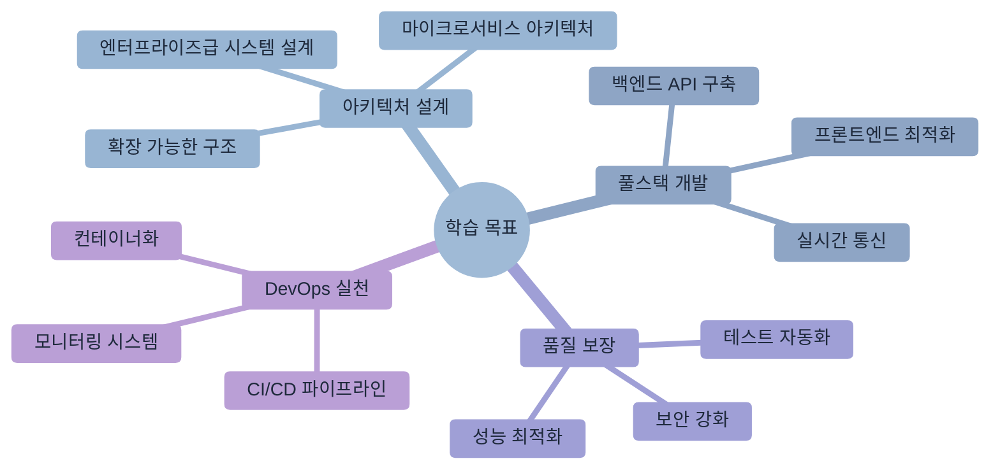
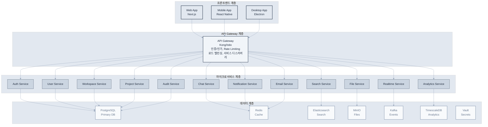

# 제10장: 웹 애플리케이션 구축

> "실습은 이론을 현실로 만든다" - 벤자민 프랭클린



## 학습 목표

이 장을 완료하면 다음을 할 수 있습니다:
- 전체적인 웹 애플리케이션 아키텍처를 설계하고 구현할 수 있습니다
- Claude Code를 활용하여 백엔드와 프론트엔드를 체계적으로 개발할 수 있습니다
- 실시간 기능과 대화형 UI를 구현하고 최적화할 수 있습니다
- 테스트, 배포, 모니터링을 포함한 전체 개발 라이프사이클을 관리할 수 있습니다

## 개요

이 장에서는 지금까지 학습한 모든 이론과 기법을 실제 프로젝트에 적용하는 종합적 실습을 진행합니다. Claude Code를 활용해 실시간 채팅이 있는 협업 도구 ‘CollabSpace’를 처음부터 끝까지 구축하면서, 전문적인 웹 애플리케이션 개발의 전 과정을 경험해보겠습니다.

이 프로젝트를 통해 아키텍처 설계부터 배포와 모니터링까지, 전체적인 개발 라이프사이클을 경험하고 실무에서 직접 활용할 수 있는 실전 역량을 배양하겠습니다.

## 10.1 엔터프라이즈 프로젝트 설계와 아키텍처

성공적인 웹 애플리케이션 구축은 체계적인 설계와 명확한 아키텍처에서 시작됩니다. 특히 실시간 협업 플랫폼과 같은 복잡한 시스템에서는 초기 설계 결정이 전체 프로젝트의 성패를 좌우합니다. Claude Code는 이러한 초기 설계 단계에서부터 강력한 지원을 제공하여, 더 나은 의사결정과 효율적인 기술 선택을 가능하게 합니다.

### 프로젝트 개요: "CollabSpace" - 엔터프라이즈급 협업 플랫폼

CollabSpace는 현대적인 원격 협업 환경의 모든 요구사항을 충족하는 포괄적인 협업 플랫폼입니다. Slack과 Notion의 장점을 결합하면서도 개발팀을 위한 전문적인 기능들을 추가로 제공합니다.

**핵심 기능 및 비즈니스 가치:**

**1. 실시간 협업 엔진**
- WebSocket 기반 실시간 통신 (1000+ 동시 사용자 지원)
- 동시 편집과 충돌 해결 알고리즘
- 실시간 커서 추적과 사용자 인식
- 오프라인 동기화와 충돌 해결

**2. 지능형 워크스페이스 관리**
- 계층적 조직 구조 (Organization > Team > Project)
- 역할 기반 접근 제어 (RBAC) 시스템
- 동적 권한 위임과 임시 액세스
- 감사 로그와 활동 추적

**3. 통합 커뮤니케이션 허브**
- 멀티미디어 지원 실시간 채팅
- 스레드 기반 대화 구조
- 지능형 알림 시스템
- 통합 검색과 콘텐츠 발견

**4. 프로젝트 관리 도구**
- 사용자 정의 가능한 칸반 보드
- 간트 차트와 타임라인 뷰
- 자동화된 워크플로우
- 진행률 추적과 리포팅

**5. 파일과 지식 관리**
- 버전 관리가 있는 파일 시스템
- 실시간 문서 협업 편집기
- 위키 시스템과 지식베이스
- 통합 코드 리뷰 도구

### 엔터프라이즈급 아키텍처 설계

복잡한 협업 플랫폼의 아키텍처 설계는 기능적 요구사항뿐만 아니라 비기능적 요구사항(성능, 확장성, 가용성, 보안)을 모두 고려해야 합니다. Claude Code를 활용하여 체계적이고 검증된 아키텍처를 설계해보겠습니다.

**시스템 요구사항 정의:**

```bash
claude "CollabSpace 엔터프라이즈 협업 플랫폼의 아키텍처를 설계해줘.

비기능적 요구사항:
- 성능: 1000+ 동시 사용자, 100ms 이하 API 응답
- 확장성: 수평적 확장 가능한 마이크로서비스 구조
- 가용성: 99.9% 업타임, 다중 가용 영역 배포
- 보안: 제로 트러스트 아키텍처, 종단간 암호화
- 데이터 일관성: 이벤트 소싱과 CQRS 패턴 적용

기능적 요구사항:
- 실시간 협업: WebSocket 기반 실시간 통신
- 멀티 테넌시: 조직별 데이터 격리
- 파일 시스템: 대용량 파일 처리와 CDN 연동
- 검색 엔진: 전문 검색과 자동 완성
- 분석 시스템: 사용 패턴 분석과 인사이트

기술 제약사항:
- 클라우드 네이티브 (Kubernetes 기반)
- 컨테이너 우선 아키텍처
- API 우선 설계 (API-First)
- 이벤트 기반 아키텍처
- 관찰 가능성 내장 (모니터링, 로깅, 추적)"
```

**Claude Code가 제안하는 아키텍처 개요:**



**상세 아키텍처 설계 요청:**

```bash
# 마이크로서비스 경계 정의
claude "CollabSpace의 마이크로서비스 경계를 DDD 원칙에 따라 정의해줘.

도메인 컨텍스트 분석:
- 각 바운디드 컨텍스트의 책임과 경계
- 서비스 간 통신 패턴 (동기 vs 비동기)
- 데이터 소유권과 일관성 전략
- 이벤트 스토밍 결과 반영

서비스별 상세 설계:
1. 인증 서비스: OAuth2/OIDC, JWT, 다중 ID 제공자
2. 사용자 관리: 프로필, 설정, 팀 멤버십
3. 워크스페이스: 조직 구조, 권한 관리
4. 실시간 통신: WebSocket 연결 관리, 메시지 라우팅
5. 파일 서비스: 업로드, 저장, CDN 연동
6. 검색 서비스: 인덱싱, 전문 검색, 자동 완성
7. 알림 서비스: 실시간 알림, 이메일, 푸시

각 서비스는:
- 독립적 배포 가능
- 자체 데이터베이스 소유
- API 버전 관리 지원
- 헬스체크와 모니터링 내장"

# 실시간 통신 아키텍처
claude "대규모 실시간 협업을 위한 WebSocket 아키텍처를 설계해줘.

요구사항:
- 1000+ 동시 연결 지원
- 메시지 보장과 순서 유지
- 연결 복구와 재동기화
- 수평적 확장 가능성

설계 요소:
1. WebSocket 클러스터 관리
2. 메시지 브로커 (Redis Streams/Kafka)
3. 세션 관리와 로드 밸런싱
4. 백프레셔와 플로우 제어
5. 연결 상태 모니터링

성능 최적화:
- 연결 풀링과 재사용
- 메시지 배칭과 압축
- 네임스페이스별 격리
- 지리적 분산 배포"

# 데이터 아키텍처 설계
claude "멀티 테넌트 데이터 아키텍처를 설계해줘.

격리 전략:
- 행 수준 보안 (Row-Level Security)
- 스키마 분리 vs 데이터베이스 분리
- 암호화와 접근 제어

일관성 모델:
- ACID vs BASE 트레이드오프
- 이벤트 소싱 적용 영역
- CQRS 패턴 구현
- 분산 트랜잭션 관리

성능 최적화:
- 샤딩 전략
- 읽기 복제본 활용
- 캐싱 계층 설계
- 인덱스 최적화"
```

### 전략적 기술 스택 선정

기술 스택 선정은 단순한 기술적 선호도를 넘어서 비즈니스 목표, 팀 역량, 장기적 유지보수성을 모두 고려해야 하는 전략적 의사결정입니다. Claude Code를 활용하여 각 계층별로 최적의 기술을 체계적으로 선택해보겠습니다.

**종합적 기술 스택 평가 요청:**

```bash
claude "CollabSpace 엔터프라이즈 플랫폼을 위한 최적의 기술 스택을 추천해줘.

평가 기준:
1. 성능과 확장성: 1000+ 동시 사용자 처리 능력
2. 개발 생산성: 팀 러닝 커브와 개발 속도
3. 생태계 성숙도: 라이브러리, 도구, 커뮤니티 지원
4. 운영 안정성: 프로덕션 검증과 장기 지원
5. 비용 효율성: 라이선스, 인프라, 인력 비용
6. 보안: 보안 패치와 취약점 대응
7. 인재 확보: 시장에서 개발자 확보 용이성

기술 영역별 후보:
- 프론트엔드: React/Next.js vs Vue/Nuxt vs Angular vs Svelte
- 백엔드 언어: Node.js vs Python vs Java vs Go vs Rust
- 웹 프레임워크: Express vs FastAPI vs Spring Boot vs Gin
- 데이터베이스: PostgreSQL vs MySQL vs MongoDB vs Cassandra
- 캐시: Redis vs Memcached vs Hazelcast
- 메시지 큐: Kafka vs RabbitMQ vs Redis Streams vs NATS
- 검색 엔진: Elasticsearch vs Solr vs Algolia vs Typesense
- 컨테이너: Docker vs Podman vs containerd
- 오케스트레이션: Kubernetes vs Docker Swarm vs Nomad
- 클라우드: AWS vs GCP vs Azure vs 멀티 클라우드

각 선택에 대한 상세한 근거와 트레이드오프 분석을 포함해줘."
```

**Claude Code가 추천하는 최종 기술 스택:**

```yaml
# 프론트엔드 스택
frontend:
  framework: "Next.js 14"
  language: "TypeScript"
  styling: "Tailwind CSS + HeadlessUI"
  state_management: "Zustand + TanStack Query"
  ui_components: "Radix UI + shadcn/ui"
  animation: "Framer Motion"
  testing: "Vitest + Testing Library + Playwright"
  bundler: "Turbopack (Next.js built-in)"
  
  선택_근거:
    - "Next.js 14: App Router의 서버 컴포넌트로 성능 최적화"
    - "TypeScript: 대규모 팀 개발에서 타입 안전성 보장"
    - "Tailwind CSS: 일관된 디자인 시스템과 빠른 프로토타이핑"
    - "Zustand: 간단하지만 강력한 상태 관리, Redux 대비 보일러플레이트 최소화"
    - "Radix UI: 접근성 기본 제공, 기업 환경 필수 요구사항"

# 백엔드 스택
backend:
  runtime: "Node.js 20 LTS"
  framework: "Fastify 4.x"
  language: "TypeScript"
  validation: "Zod"
  orm: "Prisma"
  authentication: "Passport.js + Auth0"
  websockets: "Socket.io 4.x"
  api_documentation: "OpenAPI 3.0 + Swagger"
  testing: "Jest + Supertest"
  
  선택_근거:
    - "Node.js: 프론트엔드와 동일 언어로 팀 효율성 극대화"
    - "Fastify: Express 대비 2배 성능, 플러그인 생태계 우수"
    - "Prisma: 타입 안전한 데이터베이스 액세스, 마이그레이션 관리 우수"
    - "Socket.io: 실시간 통신의 산업 표준, 폴백 메커니즘 내장"

# 데이터베이스 스택
database:
  primary: "PostgreSQL 15"
  cache: "Redis 7.x"
  search: "Elasticsearch 8.x"
  analytics: "TimescaleDB"
  message_queue: "Redis Streams"
  object_storage: "MinIO (S3 compatible)"
  
  선택_근거:
    - "PostgreSQL: ACID 보장, JSON 지원, 확장성 우수"
    - "Redis: 고성능 캐싱, pub/sub, 스트림 처리 모두 지원"
    - "Elasticsearch: 전문 검색, 실시간 분석, 자동 완성 최적화"
    - "TimescaleDB: 시계열 데이터 처리에 특화된 PostgreSQL 확장"

# 인프라 스택
infrastructure:
  containerization: "Docker + Docker Compose"
  orchestration: "Kubernetes 1.28+"
  ingress: "Istio Service Mesh"
  api_gateway: "Kong Gateway"
  monitoring: "Prometheus + Grafana + Jaeger"
  logging: "Fluentd + Elasticsearch + Kibana"
  secrets: "HashiCorp Vault"
  ci_cd: "GitLab CI + ArgoCD"
  cloud: "AWS (multi-AZ deployment)"
  
  선택_근거:
    - "Kubernetes: 컨테이너 오케스트레이션 표준, 멀티 클라우드 지원"
    - "Istio: 서비스 메시로 보안, 관찰성, 트래픽 관리 통합"
    - "Kong: 엔터프라이즈급 API 게이트웨이, 플러그인 생태계"
    - "Prometheus: 클라우드 네이티브 모니터링 표준"

# 개발 도구
development:
  package_manager: "pnpm"
  monorepo: "Turborepo"
  code_quality: "ESLint + Prettier + Husky"
  type_checking: "TypeScript strict mode"
  testing: "Jest + Playwright + k6"
  documentation: "Storybook + Docusaurus"
  
  선택_근거:
    - "pnpm: npm 대비 3배 빠른 설치 속도, 디스크 공간 절약"
    - "Turborepo: 모노레포 빌드 최적화, 캐싱으로 CI 시간 단축"

# 보안 스택
security:
  authentication: "OAuth 2.0 + OpenID Connect"
  authorization: "RBAC + ABAC hybrid"
  secrets_management: "HashiCorp Vault"
  encryption: "TLS 1.3 + AES-256"
  vulnerability_scanning: "Snyk + OWASP ZAP"
  compliance: "SOC 2 Type II ready"
```

**기술 스택 의사결정 매트릭스:**

```bash
claude "선정된 기술 스택의 의사결정 과정을 투명하게 문서화해줘.

비교 매트릭스 생성:
- 각 기술 선택지에 대한 점수화 (1-10점)
- 가중치 적용 (성능 30%, 개발 생산성 25%, 운영 안정성 20%, 비용 15%, 학습 곡선 10%)
- 총점과 순위
- 선택하지 않은 기술의 배제 이유

리스크 분석:
- 기술별 주요 리스크와 완화 전략
- 업그레이드 경로와 마이그레이션 계획
- 벤더 종속성과 대안 기술
- 팀 교육 계획과 일정

성능 벤치마크:
- 예상 성능 지표
- 병목 지점 예측
- 확장성 시나리오
- 모니터링 포인트"
```

**프로토타입 검증:**

```bash
claude "기술 스택 검증을 위한 프로토타입을 만들어줘.

검증 목표:
1. 성능 벤치마크: 동시 사용자 수, 응답 시간, 처리량
2. 개발 생산성: 기능 개발 속도, 디버깅 용이성
3. 운영 복잡성: 배포, 모니터링, 문제 해결
4. 통합성: 서비스 간 연동, 데이터 일관성

프로토타입 범위:
- 사용자 인증과 세션 관리
- 실시간 채팅 (100명 동시 연결)
- 파일 업로드와 다운로드
- 검색 기능
- 기본적인 모니터링과 로깅

성공 기준:
- API 응답 시간 < 100ms (95%)
- WebSocket 메시지 지연 < 50ms
- 파일 업로드 처리량 > 10MB/s
- 검색 응답 시간 < 200ms
- 시스템 리소스 사용률 < 70%"
```

## 10.2 엔터프라이즈급 프로젝트 초기 설정

프로젝트 초기 설정은 전체 개발 라이프사이클의 효율성을 결정하는 중요한 단계입니다. 잘 구조화된 모노레포와 자동화된 개발 환경은 팀 생산성을 크게 향상시키고 코드 품질을 보장합니다.

### 고급 모노레포 아키텍처

```bash
claude "CollabSpace를 위한 엔터프라이즈급 모노레포를 구성해줘.

요구사항:
- Turborepo 기반 고성능 빌드 시스템
- 서비스별 독립적 배포 가능
- 공통 라이브러리 효율적 공유
- 타입 안전성 전체 프로젝트 보장
- 개발 도구 통합 (린팅, 테스팅, 포매팅)
- Docker 기반 컨테이너화 준비

프로젝트 구조:

```mermaid
%%{init: {"theme": "base", "themeVariables": {"primaryColor": "#f8fafc", "primaryTextColor": "#1e293b", "primaryBorderColor": "#e2e8f0", "lineColor": "#94a3b8", "secondaryColor": "#f1f5f9", "tertiaryColor": "#e2e8f0"}}}%%
graph TD
    A[collab-space/] --> B[apps/<br/>애플리케이션]
    A --> C[packages/<br/>공유 라이브러리]
    A --> D[tools/<br/>개발 도구]
    A --> E[infrastructure/<br/>인프라 코드]
    A --> F[docs/<br/>문서]
    A --> G[.github/<br/>GitHub 설정]
    
    B --> B1[web/<br/>Next.js 14]
    B --> B2[mobile/<br/>React Native]
    B --> B3[api-gateway/<br/>Fastify]
    B --> B4[auth-service/<br/>인증]
    B --> B5[chat-service/<br/>채팅]
    B --> B6[file-service/<br/>파일 관리]
    
    C --> C1[ui/<br/>공통 UI 컴포넌트]
    C --> C2[types/<br/>TypeScript 타입]
    C --> C3[config/<br/>설정 관리]
    C --> C4[utils/<br/>공통 유틸리티]
    C --> C5[database/<br/>DB 관련]
    C --> C6[monitoring/<br/>모니터링]
    
    D --> D1[build/<br/>빌드 스크립트]
    D --> D2[scripts/<br/>자동화]
    D --> D3[generators/<br/>코드 생성]
    D --> D4[testing/<br/>테스트 유틸]
    
    E --> E1[docker/<br/>컨테이너 설정]
    E --> E2[kubernetes/<br/>K8s 매니페스트]
    E --> E3[terraform/<br/>인프라 프로비저닝]
    E --> E4[monitoring/<br/>모니터링 설정]
    
    F --> F1[architecture/<br/>아키텍처]
    F --> F2[api/<br/>API 문서]
    F --> F3[deployment/<br/>배포 가이드]
    F --> F4[development/<br/>개발 가이드]
    
    classDef rootStyle fill:#e2e8f0,stroke:#334155,stroke-width:3px,color:#1e293b
    classDef categoryStyle fill:#f1f5f9,stroke:#475569,stroke-width:2px,color:#1e293b
    classDef itemStyle fill:#f8fafc,stroke:#94a3b8,stroke-width:1px,color:#64748b
    
    class A rootStyle
    class B,C,D,E,F,G categoryStyle
    class B1,B2,B3,B4,B5,B6,C1,C2,C3,C4,C5,C6,D1,D2,D3,D4,E1,E2,E3,E4,F1,F2,F3,F4 itemStyle
```



추가 설정 요구사항:
- 각 서비스는 독립적인 Dockerfile과 CI/CD 파이프라인
- 공통 패키지 변경 시 영향받는 앱만 재빌드
- 타입 체크, 린팅, 테스트 병렬 실행
- 의존성 그래프 최적화로 빌드 시간 최소화
- 개발 환경 Hot Reload 지원
- 프로덕션 빌드 최적화 (트리 쉐이킹, 코드 분할)"
```

**Turborepo 고급 설정:**

```json
{
  "name": "collabspace",
  "version": "0.1.0",
  "private": true,
  "workspaces": [
    "apps/*",
    "packages/*",
    "tools/*"
  ],
  "scripts": {
    "build": "turbo run build",
    "dev": "turbo run dev --parallel",
    "test": "turbo run test",
    "test:e2e": "turbo run test:e2e",
    "lint": "turbo run lint",
    "type-check": "turbo run type-check",
    "clean": "turbo run clean && rm -rf node_modules",
    "format": "prettier --write .",
    "docker:dev": "docker-compose -f docker-compose.dev.yml up",
    "docker:prod": "docker-compose -f docker-compose.prod.yml up",
    "k8s:deploy": "kubectl apply -k infrastructure/kubernetes/overlays/dev",
    "seed": "turbo run seed",
    "migrate": "turbo run migrate",
    "generate": "turbo run generate"
  },
  "devDependencies": {
    "@turbo/gen": "^1.10.0",
    "turbo": "^1.10.0",
    "prettier": "^3.0.0",
    "husky": "^8.0.3",
    "lint-staged": "^14.0.0"
  },
  "engines": {
    "node": ">=20.0.0",
    "pnpm": ">=8.0.0"
  },
  "packageManager": "pnpm@8.10.0"
}
```

**turbo.json 엔터프라이즈 설정:**

```json
{
  "$schema": "https://turbo.build/schema.json",
  "globalDependencies": ["**/.env.*local"],
  "pipeline": {
    "build": {
      "dependsOn": ["^build"],
      "outputs": [".next/**", "!.next/cache/**", "dist/**"],
      "env": ["NODE_ENV", "API_URL", "DATABASE_URL"]
    },
    "test": {
      "dependsOn": ["^build"],
      "outputs": ["coverage/**"],
      "inputs": ["src/**/*.tsx", "src/**/*.ts", "test/**/*.ts", "**/*.test.*"]
    },
    "test:e2e": {
      "dependsOn": ["build"],
      "cache": false
    },
    "lint": {
      "outputs": []
    },
    "type-check": {
      "dependsOn": ["^build"],
      "outputs": []
    },
    "dev": {
      "cache": false,
      "persistent": true
    },
    "clean": {
      "cache": false
    },
    "migrate": {
      "cache": false
    },
    "seed": {
      "dependsOn": ["migrate"],
      "cache": false
    },
    "generate": {
      "outputs": ["generated/**"]
    }
  },
  "remoteCache": {
    "signature": true
  }
}
```

### 개발 환경 자동화

```bash
claude "개발자 온보딩을 위한 완전 자동화된 개발 환경을 구성해줘.

자동화 범위:
1. 환경 요구사항 자동 확인 및 설치
   - Node.js 20+ LTS
   - pnpm 8+
   - Docker & Docker Compose
   - VS Code 확장 프로그램

2. 프로젝트 초기 설정
   - 의존성 설치 (pnpm install)
   - 환경 변수 설정 (.env 파일 생성)
   - 데이터베이스 초기화 (Docker Compose)
   - 시드 데이터 삽입

3. 개발 도구 설정
   - Git 훅 설정 (Husky)
   - VS Code 설정 동기화
   - 디버깅 설정 구성
   - 테스트 데이터베이스 준비

4. 검증 프로세스
   - 모든 서비스 빌드 테스트
   - 기본 E2E 테스트 실행
   - 코드 품질 검사
   - 성능 벤치마크 기준 확인

스크립트 구현:
- setup.sh (Linux/macOS)
- setup.ps1 (Windows PowerShell)
- Makefile (크로스 플랫폼 명령)
- GitHub Codespaces 설정
- Docker 개발 컨테이너"
```

**자동화 설정 스크립트:**

```bash
#!/bin/bash
# setup.sh - 개발 환경 자동 설정

set -e

echo "🚀 CollabSpace 개발 환경 설정 시작..."

# 1. 시스템 요구사항 확인
echo "📋 시스템 요구사항 확인 중..."

check_command() {
    if ! command -v $1 &> /dev/null; then
        echo "❌ $1이 설치되지 않았습니다. 설치 가이드: $2"
        exit 1
    else
        echo "✅ $1 확인됨"
    fi
}

check_command "node" "https://nodejs.org/"
check_command "pnpm" "npm install -g pnpm"
check_command "docker" "https://docs.docker.com/get-docker/"
check_command "docker-compose" "https://docs.docker.com/compose/install/"

# Node.js 버전 확인
NODE_VERSION=$(node --version | cut -d'v' -f2 | cut -d'.' -f1)
if [ "$NODE_VERSION" -lt 20 ]; then
    echo "❌ Node.js 20+ 필요. 현재 버전: $(node --version)"
    exit 1
fi

# 2. 의존성 설치
echo "📦 의존성 설치 중..."
pnpm install

# 3. 환경 변수 설정
echo "⚙️ 환경 변수 설정 중..."
if [ ! -f .env.local ]; then
    cp .env.example .env.local
    echo "📝 .env.local 파일이 생성되었습니다. 필요한 값들을 설정해주세요."
fi

# 4. 데이터베이스 초기화
echo "🗄️ 개발 데이터베이스 초기화 중..."
docker-compose -f docker-compose.dev.yml up -d db redis elasticsearch

# 데이터베이스 준비 대기
echo "⏳ 데이터베이스 준비 대기 중..."
sleep 30

# 5. Prisma 마이그레이션 및 시드
echo "🔄 데이터베이스 마이그레이션 실행 중..."
pnpm run migrate:dev
pnpm run seed

# 6. Git 훅 설정
echo "🔧 Git 훅 설정 중..."
pnpm run prepare

# 7. VS Code 설정
echo "💻 VS Code 설정 동기화 중..."
if command -v code &> /dev/null; then
    # 추천 확장 프로그램 설치
    code --install-extension bradlc.vscode-tailwindcss
    code --install-extension prisma.prisma
    code --install-extension ms-vscode.vscode-typescript-next
    code --install-extension esbenp.prettier-vscode
    code --install-extension ms-vscode.vscode-eslint
    echo "✅ VS Code 확장 프로그램 설치 완료"
fi

# 8. 개발 서버 시작 가능 여부 확인
echo "🧪 설정 검증 중..."
pnpm run build

# 9. 개발 서버 시작
echo "🎉 설정 완료! 개발 서버를 시작합니다..."
echo ""
echo "다음 명령어로 개발을 시작할 수 있습니다:"
echo "  pnpm dev          - 모든 서비스 개발 모드 시작"
echo "  pnpm test         - 테스트 실행"
echo "  pnpm lint         - 코드 품질 검사"
echo "  pnpm type-check   - TypeScript 타입 검사"
echo ""
echo "📚 문서: http://localhost:3001/docs"
echo "🔍 API: http://localhost:3000/api"
echo "💻 웹 앱: http://localhost:3000"
echo ""

# 선택적으로 개발 서버 시작
read -p "지금 개발 서버를 시작하시겠습니까? (y/N): " -n 1 -r
echo
if [[ $REPLY =~ ^[Yy]$ ]]; then
    pnpm dev
fi
```

### 포괄적인 CLAUDE.md 작성

프로젝트의 CLAUDE.md는 Claude Code가 프로젝트의 맥락을 완전히 이해하고 일관된 품질의 코드를 생성할 수 있도록 하는 핵심 문서입니다. 엔터프라이즈급 프로젝트에서는 특히 상세하고 체계적인 가이드라인이 필요합니다.

```bash
claude "CollabSpace 프로젝트를 위한 포괄적인 CLAUDE.md를 작성해줘.

포함 내용:
1. 프로젝트 개요와 비즈니스 목표
2. 기술 아키텍처 요약
3. 코딩 표준과 컨벤션
4. 서비스별 특화 가이드라인
5. 보안 및 성능 요구사항
6. 테스트 전략
7. 배포 프로세스
8. 트러블슈팅 가이드

각 섹션은 구체적인 예시와 함께 실무에서 바로 적용 가능한 수준으로 작성해줘."
```

**생성된 포괄적인 CLAUDE.md:**

```markdown
# CollabSpace 엔터프라이즈 협업 플랫폼 개발 가이드

## 프로젝트 개요

CollabSpace는 1000+ 동시 사용자를 지원하는 엔터프라이즈급 실시간 협업 플랫폼입니다.
Slack의 실시간 커뮤니케이션과 Notion의 구조화된 정보 관리를 결합한 차세대 협업 도구입니다.

### 핵심 가치 제안
- **실시간 협업**: WebSocket 기반 즉각적인 커뮤니케이션
- **통합 워크플로우**: 채팅, 프로젝트 관리, 파일 공유를 하나의 플랫폼에서
- **엔터프라이즈 보안**: 제로 트러스트, 종단간 암호화, SOC 2 준수
- **무한 확장성**: 마이크로서비스 아키텍처로 수평적 확장 가능

### 타겟 사용자
- 중대형 기업의 개발팀 (50-5000명)
- 원격 우선 조직
- 애자일/DevOps 문화를 가진 팀

## 기술 아키텍처

### 시스템 아키텍처

```mermaid
%%{init: {"theme": "base", "themeVariables": {"primaryColor": "#f8fafc", "primaryTextColor": "#1e293b", "primaryBorderColor": "#e2e8f0", "lineColor": "#94a3b8", "secondaryColor": "#f1f5f9", "tertiaryColor": "#e2e8f0"}}}%%
graph TB
    subgraph clients [클라이언트 계층]
        A[Web<br/>Next.js]
        B[Mobile<br/>React Native]  
        C[Desktop<br/>Electron]
    end
    
    subgraph gateway [API Gateway 계층]
        D[API Gateway<br/>Kong/Istio<br/>인증 | 라우팅 | 로드밸런싱 | 모니터링]
    end
    
    subgraph services [마이크로서비스 계층]
        E[Auth]
        F[User]
        G[Workspace]
        H[Chat]
        I[File]
        J[Notification]
    end
    
    subgraph data [데이터 계층]
        K[PostgreSQL]
        L[Redis]
        M[Elasticsearch]
        N[MinIO]
        O[Kafka]
    end
    
    A --> D
    B --> D
    C --> D
    
    D --> E
    D --> F
    D --> G
    D --> H
    D --> I
    D --> J
    
    E --> K
    F --> K
    G --> K
    H --> L
    I --> N
    J --> O
    
    classDef clientStyle fill:#e2e8f0,stroke:#334155,stroke-width:2px,color:#1e293b
    classDef gatewayStyle fill:#f1f5f9,stroke:#475569,stroke-width:2px,color:#1e293b
    classDef serviceStyle fill:#cbd5e1,stroke:#475569,stroke-width:1px,color:#1e293b
    classDef dataStyle fill:#f8fafc,stroke:#94a3b8,stroke-width:2px,color:#64748b
    
    class A,B,C clientStyle
    class D gatewayStyle
    class E,F,G,H,I,J serviceStyle
    class K,L,M,N,O dataStyle
```

### 기술 스택
- **Frontend**: Next.js 14, TypeScript, Tailwind CSS, Zustand
- **Backend**: Node.js 20, Fastify, Prisma, Socket.io
- **Database**: PostgreSQL 15, Redis 7, Elasticsearch 8
- **Infrastructure**: Docker, Kubernetes, AWS
- **Monitoring**: Prometheus, Grafana, Jaeger

## 코딩 표준과 컨벤션

### TypeScript 규칙
```typescript
// ✅ 좋은 예: 명시적 타입, 인터페이스 우선
interface UserCreateInput {
  email: string;
  name: string;
  role: UserRole;
}

async function createUser(input: UserCreateInput): Promise<User> {
  // 구현
}

// ❌ 나쁜 예: any 타입, 암시적 반환
function createUser(input: any) {
  // 구현
}
```

### 에러 처리 패턴
```typescript
// 커스텀 에러 클래스 사용
export class BusinessError extends Error {
  constructor(
    public code: string,
    message: string,
    public statusCode: number = 400
  ) {
    super(message);
    this.name = 'BusinessError';
  }
}

// Result 타입 패턴
type Result<T, E = Error> = 
  | { ok: true; value: T }
  | { ok: false; error: E };

// 사용 예시
async function updateUser(id: string, data: UpdateUserInput): Promise<Result<User>> {
  try {
    const user = await prisma.user.update({ where: { id }, data });
    return { ok: true, value: user };
  } catch (error) {
    return { ok: false, error: new BusinessError('USER_NOT_FOUND', 'User not found', 404) };
  }
}
```

### 네이밍 컨벤션
- **파일명**: kebab-case (`user-service.ts`, `auth-middleware.ts`)
- **컴포넌트**: PascalCase (`UserProfile.tsx`, `ChatWindow.tsx`)
- **함수/변수**: camelCase (`getUserById`, `isAuthenticated`)
- **상수**: SCREAMING_SNAKE_CASE (`MAX_FILE_SIZE`, `API_TIMEOUT`)
- **타입/인터페이스**: PascalCase (`UserDto`, `AuthPayload`)

### 폴더 구조 규칙
```
src/
├── controllers/    # HTTP 요청 처리 (얇은 계층)
├── services/       # 비즈니스 로직
├── repositories/   # 데이터 액세스
├── models/         # 도메인 모델
├── dto/           # Data Transfer Objects
├── middleware/     # Express/Fastify 미들웨어
├── utils/         # 공통 유틸리티
└── types/         # TypeScript 타입 정의
```

## 서비스별 특화 가이드라인

### 인증 서비스 (auth-service)
```typescript
// JWT 토큰 처리
- Access Token: 15분 만료
- Refresh Token: 7일 만료
- 토큰 로테이션 정책 적용
- Redis에 블랙리스트 관리

// 보안 요구사항
- bcrypt rounds: 12
- 비밀번호 정책: 최소 12자, 대소문자+숫자+특수문자
- 2FA 지원 (TOTP)
- 계정 잠금: 5회 실패 시 15분 잠금
```

### 실시간 통신 서비스 (chat-service)
```typescript
// Socket.io 이벤트 네이밍
- 서버 → 클라이언트: `<entity>:<action>` (예: `message:created`)
- 클라이언트 → 서버: `<action>:<entity>` (예: `create:message`)

// 네임스페이스 구조
/workspace/:workspaceId
  ├── /channel/:channelId
  ├── /direct/:userId
  └── /presence

// 메시지 처리
- 메시지 큐잉: Redis Streams
- 배치 처리: 100ms 디바운싱
- 최대 메시지 크기: 10KB
- 파일 첨부: 별도 업로드 후 참조
```

### 파일 서비스 (file-service)
```typescript
// 업로드 제한
- 최대 파일 크기: 100MB
- 허용 확장자 화이트리스트
- 바이러스 스캔 필수
- 이미지 자동 리사이징

// 저장 전략
- 원본: MinIO/S3
- 썸네일: CDN 캐시
- 메타데이터: PostgreSQL
- 임시 파일: 24시간 후 자동 삭제
```

## 보안 요구사항

### 인증/인가
- OAuth 2.0 + OpenID Connect
- Role-Based Access Control (RBAC)
- Attribute-Based Access Control (ABAC)
- API Key 관리 (해싱, 만료, 회전)

### 데이터 보호
- 전송 중 암호화: TLS 1.3
- 저장 시 암호화: AES-256-GCM
- PII 필드 마스킹
- 감사 로그 (불변성 보장)

### 보안 헤더
```typescript
// 필수 보안 헤더
app.use(helmet({
  contentSecurityPolicy: {
    directives: {
      defaultSrc: ["'self'"],
      styleSrc: ["'self'", "'unsafe-inline'"],
      scriptSrc: ["'self'"],
      imgSrc: ["'self'", "data:", "https:"],
    },
  },
  hsts: {
    maxAge: 31536000,
    includeSubDomains: true,
    preload: true,
  },
}));
```

## 성능 요구사항

### API 응답 시간
- P50: < 50ms
- P95: < 200ms
- P99: < 500ms

### 처리량
- 일반 API: 10,000 RPS
- 검색 API: 1,000 RPS
- WebSocket: 100,000 동시 연결

### 캐싱 전략
```typescript
// Redis 캐싱 계층
- 사용자 세션: 15분
- 권한 정보: 5분
- 자주 조회되는 데이터: 1시간
- 검색 결과: 10분

// 캐시 무효화
- Write-through 패턴
- 이벤트 기반 무효화
- TTL 기반 만료
```

## 테스트 전략

### 테스트 피라미드
```
         E2E (10%)
      통합 테스트 (30%)
   단위 테스트 (60%)
```

### 테스트 커버리지 목표
- 전체: 80% 이상
- 핵심 비즈니스 로직: 95% 이상
- 유틸리티 함수: 100%

### 테스트 작성 규칙
```typescript
// 테스트 구조: AAA 패턴
describe('UserService', () => {
  describe('createUser', () => {
    it('should create a new user with valid input', async () => {
      // Arrange
      const input = { email: 'test@example.com', name: 'Test User' };
      
      // Act
      const result = await userService.createUser(input);
      
      // Assert
      expect(result.ok).toBe(true);
      expect(result.value.email).toBe(input.email);
    });
    
    it('should return error for duplicate email', async () => {
      // 구현
    });
  });
});
```

## 모니터링과 로깅

### 구조화된 로깅
```typescript
// 로그 레벨과 컨텍스트
logger.info('User created', {
  userId: user.id,
  email: user.email,
  timestamp: new Date().toISOString(),
  traceId: context.traceId,
});

// 에러 로깅
logger.error('Failed to create user', {
  error: error.message,
  stack: error.stack,
  input: sanitizeInput(input),
  traceId: context.traceId,
});
```

### 메트릭 수집
```typescript
// Prometheus 메트릭
- API 응답 시간 히스토그램
- 동시 사용자 수 게이지
- 에러율 카운터
- 비즈니스 메트릭 (가입, 활성 사용자 등)
```

## 배포 프로세스

### 환경별 설정
- **개발**: 자동 배포, 디버깅 활성화
- **스테이징**: 프로덕션 미러링, 성능 테스트
- **프로덕션**: 블루-그린 배포, 자동 롤백

### 배포 체크리스트
1. [ ] 모든 테스트 통과
2. [ ] 보안 스캔 완료
3. [ ] 성능 벤치마크 기준 충족
4. [ ] 문서 업데이트
5. [ ] 데이터베이스 마이그레이션 검증
6. [ ] 롤백 계획 수립

## 트러블슈팅 가이드

### 일반적인 문제 해결
1. **메모리 누수**: 힙 덤프 분석, 이벤트 리스너 확인
2. **느린 쿼리**: EXPLAIN ANALYZE, 인덱스 최적화
3. **WebSocket 연결 끊김**: 하트비트 확인, 네트워크 정책
4. **높은 CPU 사용률**: 프로파일링, 동기 작업 확인

### 디버깅 도구
- **로컬**: Chrome DevTools, VS Code 디버거
- **원격**: Node.js Inspector, 원격 디버깅
- **프로덕션**: APM 도구, 분산 추적

## 팀 협업 규칙

### 코드 리뷰
- PR은 200줄 이하로 유지
- 최소 2명의 승인 필요
- 24시간 내 리뷰 완료
- 건설적이고 구체적인 피드백

### 커밋 메시지
```
<type>(<scope>): <subject>

<body>

<footer>

예시:
feat(auth): implement JWT refresh token rotation

- Add refresh token rotation logic
- Update token validation middleware
- Add tests for edge cases

Closes #123
```

### 브랜치 전략
- `main`: 프로덕션 배포
- `develop`: 개발 통합
- `feature/*`: 기능 개발
- `hotfix/*`: 긴급 수정
- `release/*`: 릴리스 준비

이 가이드는 지속적으로 업데이트되며, 모든 개발자는 이를 숙지하고 준수해야 합니다.
최신 버전은 항상 프로젝트 루트의 CLAUDE.md 파일을 참조하세요.
```

## 10.3 백엔드 개발

### 인증 시스템 구현

```bash
claude "JWT 기반 인증 시스템을 구현해줘.
회원가입, 로그인, 토큰 갱신, 권한 미들웨어를 포함하고
보안 베스트 프랙티스를 적용해줘"
```

### 데이터베이스 설계

```bash
claude "Prisma를 사용해서 데이터베이스 스키마를 설계해줘.
User, Workspace, Project, Message, Task 엔티티와
관계를 정의해줘"
```

생성된 스키마:
```prisma
// schema.prisma
model User {
  id        String   @id @default(cuid())
  email     String   @unique
  name      String
  avatar    String?
  createdAt DateTime @default(now())
  updatedAt DateTime @updatedAt

  memberships WorkspaceMember[]
  messages    Message[]
  tasks       Task[]
}

model Workspace {
  id          String   @id @default(cuid())
  name        String
  description String?
  createdAt   DateTime @default(now())
  updatedAt   DateTime @updatedAt

  members  WorkspaceMember[]
  projects Project[]
  channels Channel[]
}

model WorkspaceMember {
  id          String    @id @default(cuid())
  role        Role      @default(MEMBER)
  joinedAt    DateTime  @default(now())
  
  user        User      @relation(fields: [userId], references: [id])
  userId      String
  workspace   Workspace @relation(fields: [workspaceId], references: [id])
  workspaceId String

  @@unique([userId, workspaceId])
}

enum Role {
  OWNER
  ADMIN
  MEMBER
}
```

### 실시간 통신 구현

```bash
claude "Socket.io를 사용해서 실시간 채팅을 구현해줘.
네임스페이스별 방 관리, 메시지 저장, 온라인 사용자 표시,
타이핑 인디케이터를 포함해줘"
```

### API 엔드포인트 개발

```bash
claude "RESTful API를 체계적으로 구현해줘.
라우터 구조, 미들웨어, 에러 처리, 입력 검증을 포함하고
OpenAPI 스펙도 자동 생성되도록 해줘"
```

## 10.4 프론트엔드 개발

### 프로젝트 설정

```bash
claude "Next.js 14 프로젝트를 설정해줘.
App Router, TypeScript, Tailwind CSS, 
상태 관리 (Zustand), UI 라이브러리 (shadcn/ui)를 포함해줘"
```

### 인증 구현

```bash
claude "NextAuth.js를 사용해서 프론트엔드 인증을 구현해줘.
소셜 로그인 (Google, GitHub), 세션 관리,
보호된 라우트를 포함해줘"
```

### 실시간 기능 구현

```bash
claude "Socket.io 클라이언트를 구현해줘.
연결 관리, 이벤트 리스너, 재연결 로직,
React 컴포넌트와의 통합을 포함해줘"
```

### UI 컴포넌트 개발

```bash
claude "채팅 인터페이스를 구현해줘.
메시지 목록, 입력창, 파일 업로드, 이모지 선택기,
반응형 디자인을 포함해줘"
```

### 상태 관리

```bash
claude "Zustand를 사용해서 전역 상태를 관리해줘.
사용자 정보, 워크스페이스, 채팅 메시지, 
실시간 연결 상태를 포함해줘"
```

## 10.5 실시간 기능 추가

### 채팅 시스템

```bash
claude "실시간 채팅 시스템을 완성해줘.
메시지 전송/수신, 읽음 확인, 메시지 편집/삭제,
파일 첨부, 멘션 기능을 포함해줘"
```

### 협업 기능

```bash
claude "실시간 협업 기능을 추가해줘.
동시 편집 표시, 커서 위치 공유, 
실시간 알림, 활동 피드를 구현해줘"
```

### 칸반 보드

```bash
claude "드래그 앤 드롭이 가능한 칸반 보드를 구현해줘.
실시간 동기화, 카드 이동, 상태 변경,
다중 사용자 편집을 지원해줘"
```

## 10.6 테스트 구현

### 백엔드 테스트

```bash
claude "백엔드 API에 대한 종합적인 테스트를 작성해줘.
단위 테스트, 통합 테스트, Socket.io 테스트를 포함하고
테스트 데이터베이스 설정도 해줘"
```

### 프론트엔드 테스트

```bash
claude "React 컴포넌트 테스트를 작성해줘.
React Testing Library, Jest를 사용하고
사용자 상호작용, 실시간 기능, 상태 변경을 테스트해줘"
```

### E2E 테스트

```bash
claude "Playwright를 사용해서 E2E 테스트를 작성해줘.
사용자 시나리오 (회원가입, 로그인, 채팅, 협업)를
전체적으로 테스트해줘"
```

## 10.7 성능 최적화

### 프론트엔드 최적화

```bash
claude "프론트엔드 성능을 최적화해줘.
코드 스플리팅, 이미지 최적화, 메모이제이션,
가상 스크롤링을 적용해줘"
```

### 백엔드 최적화

```bash
claude "백엔드 성능을 최적화해줘.
데이터베이스 쿼리 최적화, 캐싱 (Redis),
Connection pooling, 응답 압축을 적용해줘"
```

### 실시간 통신 최적화

```bash
claude "Socket.io 성능을 최적화해줘.
네임스페이스 관리, 메모리 사용량 최적화,
연결 수 제한, 메시지 큐잉을 구현해줘"
```

## 10.8 보안 강화

### 인증/인가 보안

```bash
claude "보안을 강화해줘.
CSRF 방지, Rate limiting, 
입력 검증, SQL Injection 방지,
XSS 방지를 구현해줘"
```

### 실시간 통신 보안

```bash
claude "Socket.io 보안을 강화해줘.
네임스페이스별 권한 검사, 메시지 검증,
스팸 방지, 악성 사용자 차단을 구현해줘"
```

## 10.9 배포 및 인프라

### Docker 컨테이너화

```bash
claude "애플리케이션을 Docker로 컨테이너화해줘.
멀티 스테이지 빌드, 최적화된 이미지 크기,
개발/프로덕션 환경 분리를 적용해줘"
```

### CI/CD 파이프라인

```bash
claude "GitHub Actions를 사용해서 CI/CD 파이프라인을 구축해줘.
테스트 자동화, 보안 스캔, 
자동 배포, 롤백 절차를 포함해줘"
```

### AWS 배포

```bash
claude "AWS에 배포 가능한 인프라를 구성해줘.
ECS, RDS, ElastiCache, CloudFront,
로드 밸런서, 오토 스케일링을 포함해줘"
```

## 10.10 모니터링과 로깅 - 운영의 눈과 귀

프로덕션 환경에서 애플리케이션의 건강 상태를 실시간으로 파악하고 문제를 조기에 발견하는 것은 서비스 안정성의 핵심입니다. Claude Code는 종합적인 관찰 가능성(Observability) 시스템 구축을 통해 운영팀이 시스템을 완벽하게 이해하고 관리할 수 있도록 지원합니다.

### 애플리케이션 모니터링 - 360도 시야 확보

현대적인 모니터링은 단순한 서버 상태 확인을 넘어서 비즈니스 메트릭과 사용자 경험까지 포괄하는 종합적인 접근이 필요합니다:

```bash
# 기본 모니터링 설정
claude "종합적인 모니터링 시스템을 구축해줘.
성능 메트릭, 에러 추적, 
사용자 행동 분석, 실시간 알림을 포함해줘"

# 고급 모니터링 시스템 구축
claude "CollabSpace를 위한 엔터프라이즈급 모니터링 시스템을 구축해줘.

1. 인프라 모니터링 (Prometheus + Grafana)
   - 서버 리소스 (CPU, 메모리, 디스크, 네트워크)
   - 컨테이너 메트릭 (Docker, Kubernetes)
   - 데이터베이스 성능 (쿼리 시간, 커넥션 풀)
   - 캐시 히트율과 메모리 사용량

2. 애플리케이션 성능 모니터링 (APM)
   - API 응답 시간 분포 (P50, P95, P99)
   - 처리량과 에러율
   - 느린 쿼리와 N+1 문제 탐지
   - 메모리 누수와 CPU 스파이크

3. 비즈니스 메트릭 추적
   - 활성 사용자 수 (DAU, MAU)
   - 기능별 사용률
   - 전환율과 이탈률
   - 수익 관련 지표

4. 사용자 경험 모니터링 (RUM)
   - 페이지 로드 시간
   - Core Web Vitals (LCP, FID, CLS)
   - JavaScript 에러
   - 사용자 세션 재생

5. 알림과 에스컬레이션
   - 임계값 기반 알림
   - 이상 탐지 (Anomaly Detection)
   - 다단계 에스컬레이션
   - 자동 복구 스크립트"
```

**Prometheus와 Grafana 설정:**

```yaml
# prometheus.yml
global:
  scrape_interval: 15s
  evaluation_interval: 15s

alerting:
  alertmanagers:
    - static_configs:
        - targets: ['alertmanager:9093']

rule_files:
  - 'alerts/*.yml'

scrape_configs:
  - job_name: 'collabspace-api'
    static_configs:
      - targets: ['api:3000']
    metrics_path: '/metrics'
    
  - job_name: 'node-exporter'
    static_configs:
      - targets: ['node-exporter:9100']
      
  - job_name: 'postgres'
    static_configs:
      - targets: ['postgres-exporter:9187']
```

**커스텀 메트릭 구현:**

```typescript
// metrics.ts
import { Counter, Histogram, Gauge, register } from 'prom-client';

// HTTP 요청 카운터
export const httpRequestTotal = new Counter({
  name: 'http_requests_total',
  help: 'Total number of HTTP requests',
  labelNames: ['method', 'route', 'status']
});

// 응답 시간 히스토그램
export const httpRequestDuration = new Histogram({
  name: 'http_request_duration_seconds',
  help: 'Duration of HTTP requests in seconds',
  labelNames: ['method', 'route', 'status'],
  buckets: [0.001, 0.005, 0.01, 0.05, 0.1, 0.5, 1, 5]
});

// 활성 사용자 게이지
export const activeUsers = new Gauge({
  name: 'active_users',
  help: 'Number of active users',
  labelNames: ['workspace']
});

// WebSocket 연결 수
export const websocketConnections = new Gauge({
  name: 'websocket_connections',
  help: 'Number of active WebSocket connections',
  labelNames: ['namespace']
});

// 비즈니스 메트릭
export const businessMetrics = {
  messagesSent: new Counter({
    name: 'messages_sent_total',
    help: 'Total number of messages sent',
    labelNames: ['workspace', 'channel']
  }),
  
  filesUploaded: new Counter({
    name: 'files_uploaded_total',
    help: 'Total number of files uploaded',
    labelNames: ['workspace', 'type']
  }),
  
  tasksCompleted: new Counter({
    name: 'tasks_completed_total',
    help: 'Total number of tasks completed',
    labelNames: ['workspace', 'project']
  })
};

// 메트릭 미들웨어
export const metricsMiddleware = () => {
  return (req: Request, res: Response, next: NextFunction) => {
    const start = Date.now();
    
    res.on('finish', () => {
      const duration = (Date.now() - start) / 1000;
      const labels = {
        method: req.method,
        route: req.route?.path || 'unknown',
        status: res.statusCode.toString()
      };
      
      httpRequestTotal.inc(labels);
      httpRequestDuration.observe(labels, duration);
    });
    
    next();
  };
};
```

### 로깅 시스템 - 문제 해결의 열쇠

효과적인 로깅은 단순한 print 문을 넘어서 구조화되고 검색 가능하며 상관관계를 추적할 수 있는 시스템이어야 합니다:

```bash
# 기본 로깅 시스템
claude "구조화된 로깅 시스템을 구현해줘.
로그 레벨, 상관 관계 ID,
중앙 집중식 로그 수집을 포함해줘"

# 엔터프라이즈 로깅 아키텍처
claude "분산 시스템을 위한 중앙 집중식 로깅 시스템을 구축해줘.

1. 로그 수집과 전송
   - Fluentd/Fluent Bit 에이전트 설정
   - 로그 파싱과 필터링
   - 버퍼링과 재시도 메커니즘
   - 다중 대상 전송 (Elasticsearch, S3)

2. 구조화된 로깅
   - JSON 형식 로그
   - 상관관계 ID (Correlation ID)
   - 요청 추적 (Request Tracing)
   - 메타데이터 자동 추가

3. 로그 레벨과 필터링
   - 환경별 로그 레벨 설정
   - 동적 로그 레벨 변경
   - 민감 정보 마스킹
   - 샘플링과 성능 최적화

4. 로그 저장과 검색
   - Elasticsearch 인덱싱 전략
   - 로그 보존 정책
   - Kibana 대시보드
   - 알림과 이상 탐지"
```

**구조화된 로깅 구현:**

```typescript
// logger.ts
import winston from 'winston';
import { v4 as uuidv4 } from 'uuid';

// 로그 포맷 정의
const logFormat = winston.format.combine(
  winston.format.timestamp(),
  winston.format.errors({ stack: true }),
  winston.format.json(),
  winston.format.printf(({ timestamp, level, message, ...meta }) => {
    return JSON.stringify({
      timestamp,
      level,
      message,
      ...meta,
      service: process.env.SERVICE_NAME || 'collabspace',
      environment: process.env.NODE_ENV,
      version: process.env.APP_VERSION
    });
  })
);

// Winston 로거 생성
export const logger = winston.createLogger({
  level: process.env.LOG_LEVEL || 'info',
  format: logFormat,
  defaultMeta: { service: 'collabspace' },
  transports: [
    new winston.transports.Console({
      format: winston.format.combine(
        winston.format.colorize(),
        winston.format.simple()
      )
    }),
    new winston.transports.File({
      filename: 'logs/error.log',
      level: 'error',
      maxsize: 10485760, // 10MB
      maxFiles: 5
    }),
    new winston.transports.File({
      filename: 'logs/combined.log',
      maxsize: 10485760,
      maxFiles: 10
    })
  ]
});

// 요청 컨텍스트 관리
export class RequestContext {
  private static storage = new Map<string, any>();
  
  static create(req: Request): string {
    const correlationId = req.headers['x-correlation-id'] || uuidv4();
    const context = {
      correlationId,
      userId: req.user?.id,
      sessionId: req.session?.id,
      ip: req.ip,
      userAgent: req.headers['user-agent'],
      requestId: uuidv4()
    };
    
    this.storage.set(correlationId, context);
    return correlationId;
  }
  
  static get(correlationId: string): any {
    return this.storage.get(correlationId) || {};
  }
  
  static clear(correlationId: string): void {
    this.storage.delete(correlationId);
  }
}

// 로깅 미들웨어
export const loggingMiddleware = () => {
  return (req: Request, res: Response, next: NextFunction) => {
    const correlationId = RequestContext.create(req);
    const startTime = Date.now();
    
    // 요청 로깅
    logger.info('Incoming request', {
      correlationId,
      method: req.method,
      url: req.url,
      headers: req.headers,
      body: req.body // 민감 정보 마스킹 필요
    });
    
    // 응답 로깅
    const originalSend = res.send;
    res.send = function(data: any) {
      const duration = Date.now() - startTime;
      
      logger.info('Outgoing response', {
        correlationId,
        statusCode: res.statusCode,
        duration,
        responseSize: Buffer.byteLength(data)
      });
      
      RequestContext.clear(correlationId);
      return originalSend.call(this, data);
    };
    
    next();
  };
};

// 비즈니스 로직 로깅
export const auditLog = (action: string, details: any) => {
  logger.info('Audit log', {
    action,
    details,
    timestamp: new Date().toISOString(),
    actor: getCurrentUser()
  });
};
```

**로그 집계와 분석:**

```yaml
# fluentd.conf
<source>
  @type tail
  path /var/log/collabspace/*.log
  pos_file /var/log/td-agent/collabspace.pos
  tag collabspace.*
  <parse>
    @type json
    time_key timestamp
    time_format %Y-%m-%dT%H:%M:%S.%L%z
  </parse>
</source>

# 로그 필터링과 변환
<filter collabspace.**>
  @type record_transformer
  <record>
    hostname ${hostname}
    environment ${ENV["NODE_ENV"]}
  </record>
</filter>

# 민감 정보 마스킹
<filter collabspace.**>
  @type record_modifier
  <replace>
    key password
    expression /./
    replace *
  </replace>
  <replace>
    key credit_card
    expression /\d{4}/
    replace ****
  </replace>
</filter>

# Elasticsearch 전송
<match collabspace.**>
  @type elasticsearch
  host elasticsearch
  port 9200
  logstash_format true
  logstash_prefix collabspace
  <buffer>
    @type file
    path /var/log/td-agent/buffer/elasticsearch
    flush_mode interval
    flush_interval 10s
    chunk_limit_size 5M
    retry_type exponential_backoff
    retry_forever false
    retry_max_times 5
  </buffer>
</match>
```

## 실전 개발 시나리오 - 4주 완성 로드맵

이제 지금까지 학습한 모든 기술과 전략을 실제 프로젝트에 적용해보겠습니다. CollabSpace를 4주 만에 MVP(Minimum Viable Product)로 완성하는 현실적인 개발 계획을 통해 Claude Code와 함께하는 실전 개발을 경험해봅시다.

### 프로젝트 개요와 목표

CollabSpace MVP는 다음과 같은 핵심 기능을 포함해야 합니다:
- 사용자 인증과 워크스페이스 관리
- 실시간 채팅과 파일 공유
- 기본적인 프로젝트 관리 (칸반 보드)
- 모바일 반응형 UI
- 안정적인 배포와 모니터링

### 주차별 개발 계획

**1주차: 기반 구조 - 튼튼한 토대 만들기**

첫 주는 전체 프로젝트의 성패를 좌우하는 중요한 시기입니다. 서두르지 말고 체계적으로 기반을 다져야 합니다:

```bash
# Day 1-2: 프로젝트 설정과 개발 환경
claude "모노레포 구조와 기본 설정을 완료해줘.
다음을 포함해서 설정해줘:
- Turborepo 설정과 워크스페이스 구성
- TypeScript, ESLint, Prettier 설정
- Git hooks와 커밋 규칙
- Docker 개발 환경
- VS Code 설정 공유

개발자가 'git clone' 후 바로 시작할 수 있도록
setup 스크립트도 만들어줘"

# Day 3-4: 인증 시스템 구축
claude "백엔드 인증과 프론트엔드 로그인을 구현해줘.
보안을 최우선으로 고려해서:
- JWT 기반 인증 (Access + Refresh Token)
- OAuth 소셜 로그인 (Google, GitHub)
- 이메일 인증과 비밀번호 재설정
- Rate limiting과 브루트포스 방어
- 프론트엔드 인증 상태 관리

테스트 코드도 함께 작성해서 안정성을 보장해줘"

# Day 5: 데이터베이스 설계와 API 기반
claude "Prisma 스키마와 기본 API를 완성해줘.
확장 가능한 구조로 설계해서:
- User, Workspace, Project, Task 모델
- 다대다 관계와 소프트 삭제
- 타임스탬프와 감사 로그
- 시드 데이터와 마이그레이션
- RESTful API 엔드포인트

주말에 리뷰할 수 있도록 문서도 생성해줘"

# 1주차 체크포인트
claude "1주차 개발 내용을 정리하고 다음 주 계획을 세워줘.
- 완료된 작업 요약
- 발견된 이슈와 해결 방안
- 2주차 상세 계획
- 팀원들과 공유할 데모 준비"
```

**2주차: 핵심 기능 - 실시간 협업의 심장**

두 번째 주는 CollabSpace의 핵심 가치를 구현하는 시기입니다. 실시간 기능의 안정성이 전체 서비스의 신뢰도를 결정합니다:

```bash
# Day 1-3: 실시간 채팅 시스템
claude "Socket.io 기반 채팅 시스템을 구현해줘.
단계별로 구현해서 안정성을 확보해줘:

Day 1: 기본 인프라
- Socket.io 서버 설정과 클러스터링
- Redis 어댑터로 수평 확장 준비
- 연결 관리와 재연결 로직
- 네임스페이스와 룸 구조

Day 2: 메시징 기능
- 실시간 메시지 전송/수신
- 메시지 영구 저장과 히스토리
- 읽음 확인과 타이핑 인디케이터
- 멘션과 알림 시스템

Day 3: 고급 기능
- 파일/이미지 전송
- 메시지 수정/삭제
- 스레드와 답글
- 이모지 반응

성능 테스트도 진행해서 1000명 동시 접속을 검증해줘"

# Day 4-5: 워크스페이스 관리
claude "워크스페이스 CRUD와 멤버 관리를 구현해줘.
기업 환경을 고려해서:
- 워크스페이스 생성과 설정
- 멤버 초대와 권한 관리 (Owner, Admin, Member)
- 팀과 채널 구조
- 게스트 사용자 지원
- 사용 통계와 대시보드

프론트엔드 UI도 직관적으로 만들어줘"

# 2주차 스프린트 리뷰
claude "2주차 스프린트를 마무리하고 데모를 준비해줘.
- 실시간 기능 시연 시나리오
- 성능 메트릭과 부하 테스트 결과
- 사용자 피드백 수집 계획
- 3주차 백로그 우선순위 조정"
```

**3주차: 고급 기능 - 차별화 요소 구현**

세 번째 주는 CollabSpace만의 독특한 가치를 추가하는 시기입니다. 기본 기능을 넘어서 사용자 경험을 한 단계 높입니다:

```bash
# Day 1-3: 칸반 보드 프로젝트 관리
claude "드래그 앤 드롭 칸반 보드를 구현해줘.
생산성 도구로서의 완성도를 높여줘:

Day 1: 기본 칸반 기능
- 보드, 리스트, 카드 CRUD
- 드래그 앤 드롭 (react-beautiful-dnd)
- 실시간 동기화
- 낙관적 업데이트

Day 2: 카드 상세 기능
- 설명, 체크리스트, 첨부파일
- 담당자 할당과 멘션
- 마감일과 알림
- 라벨과 필터링

Day 3: 고급 프로젝트 기능
- 타임라인/간트 차트 뷰
- 번다운 차트
- 템플릿과 자동화
- 작업 히스토리

모바일에서도 사용하기 편하게 터치 최적화해줘"

# Day 4-5: 파일 관리와 검색
claude "파일 업로드와 공유 기능을 구현해줘.
클라우드 스토리지 수준의 기능을 제공해줘:

Day 4: 파일 시스템
- 대용량 파일 업로드 (청크 업로드)
- 미리보기 생성 (이미지, PDF)
- 폴더 구조와 권한 관리
- 버전 관리와 히스토리
- 공유 링크와 만료 설정

Day 5: 검색과 인덱싱
- Elasticsearch 통합
- 전문 검색 (파일 내용 포함)
- 필터와 고급 검색
- 검색 결과 하이라이팅
- 자동 완성과 추천

성능과 보안을 모두 고려해서 구현해줘"

# 3주차 마일스톤 검토
claude "MVP 기능이 완성되었는지 점검해줘.
- 기능 완성도 체크리스트
- 통합 테스트 실행
- 사용자 시나리오 검증
- 4주차 배포 준비 사항 정리"
```

**4주차: 최적화와 배포 - 프로덕션 준비**

마지막 주는 그동안 개발한 기능을 안정적으로 배포하고 운영할 수 있도록 마무리하는 시기입니다:

```bash
# Day 1-2: 성능 최적화와 보안 강화
claude "프론트엔드와 백엔드 성능을 최적화해줘.
프로덕션 레벨의 성능을 달성해줘:

성능 최적화:
- 프론트엔드 번들 크기 최소화
- 이미지 최적화와 CDN 설정
- API 응답 캐싱 전략
- 데이터베이스 쿼리 최적화
- WebSocket 연결 풀링

보안 강화:
- 보안 헤더 설정 (Helmet.js)
- SQL Injection 방어
- XSS/CSRF 보호
- Rate limiting 고도화
- 보안 감사 로그

목표: Lighthouse 90+, 응답시간 200ms 이하"

# Day 3-4: 테스트와 문서화
claude "종합적인 테스트 스위트를 작성해줘.
QA 팀 없이도 품질을 보장할 수 있도록:

테스트 커버리지:
- 단위 테스트 80% 이상
- 통합 테스트 (API, DB)
- E2E 테스트 시나리오
- 부하 테스트 (k6)
- 보안 취약점 스캔

문서화:
- API 문서 자동 생성
- 사용자 가이드
- 개발자 온보딩 문서
- 운영 매뉴얼
- 트러블슈팅 가이드"

# Day 5: 프로덕션 배포
claude "프로덕션 배포를 완료해줘.
무중단 배포와 롤백 계획을 포함해서:

배포 체크리스트:
- 환경 변수와 시크릿 관리
- 데이터베이스 마이그레이션
- Docker 이미지 빌드와 푸시
- Kubernetes 배포 매니페스트
- 헬스체크와 롤백 설정

모니터링 설정:
- Prometheus + Grafana
- 로그 수집 (ELK Stack)
- 에러 추적 (Sentry)
- 업타임 모니터링
- 알림 설정

배포 후 스모크 테스트와 모니터링을 진행해줘"

# 프로젝트 완료 보고서
claude "4주 프로젝트를 마무리하고 회고를 작성해줘.
- 달성한 목표와 주요 성과
- 기술적 도전과 해결 방법
- 개선이 필요한 부분
- 향후 로드맵 제안
- 팀원들의 기여도와 감사 인사

이해관계자들과 공유할 발표 자료도 준비해줘"
```

## 개발 과정에서 배운 교훈 - 실전의 지혜

4주간의 집중적인 개발을 통해 얻은 인사이트는 향후 프로젝트에서 귀중한 자산이 됩니다. 실제 개발 과정에서 마주친 도전과 해결 과정을 통해 얻은 교훈을 공유합니다.

### 1. 점진적 개발의 중요성 - 작은 성공의 누적

처음부터 완벽한 시스템을 만들려는 욕심은 오히려 프로젝트를 위험에 빠뜨립니다. MVP 접근법의 진정한 가치를 이해해봅시다:

```bash
claude "MVP부터 시작해서 점진적으로 기능을 추가하는 방식이
왜 효과적인지 설명해줘"

# 실제 경험을 바탕으로 한 분석
claude "CollabSpace 개발 과정에서 점진적 개발이 어떻게 도움이 되었는지 분석해줘.

1. 빠른 피드백 사이클
   - 1주차 MVP로 핵심 가치 검증
   - 실제 사용자 피드백 기반 우선순위 조정
   - 잘못된 방향으로 가는 것을 조기에 발견

2. 기술적 리스크 관리
   - 복잡한 기능을 작은 단위로 분해
   - 각 단계마다 안정성 확보
   - 롤백 가능한 배포 단위

3. 팀 모티베이션 유지
   - 매주 가시적인 성과 달성
   - 성공 경험의 누적
   - 지속 가능한 개발 속도

4. 비즈니스 가치 조기 실현
   - 4주 만에 사용 가능한 제품 출시
   - 경쟁사 대비 빠른 시장 진입
   - 실제 데이터 기반 의사결정

구체적인 예시와 함께 설명해줘"
```

**점진적 개발의 실제 적용:**

```typescript
// Week 1: 최소 기능 (로그인만)
const mvpAuth = {
  login: async (email: string, password: string) => {
    // 기본 JWT 인증만 구현
    return { token: 'jwt-token' };
  }
};

// Week 2: 소셜 로그인 추가
const enhancedAuth = {
  ...mvpAuth,
  googleLogin: async (googleToken: string) => {
    // OAuth 통합
    return { token: 'jwt-token', provider: 'google' };
  }
};

// Week 3: 2FA 추가
const secureAuth = {
  ...enhancedAuth,
  enableTwoFactor: async (userId: string) => {
    // TOTP 기반 2FA
    return { qrCode: 'base64-qr' };
  }
};

// Week 4: 엔터프라이즈 기능
const enterpriseAuth = {
  ...secureAuth,
  ssoLogin: async (samlResponse: string) => {
    // SAML SSO 지원
    return { token: 'jwt-token', provider: 'saml' };
  }
};
```

### 2. 실시간 기능의 복잡성 - 숨겨진 도전들

실시간 기능은 데모에서는 멋져 보이지만, 프로덕션 환경에서는 수많은 엣지 케이스와 싸워야 합니다:

```bash
claude "실시간 기능 구현 시 주의해야 할 점들과
해결 방법을 정리해줘"

# 실전에서 마주친 문제들
claude "CollabSpace의 실시간 채팅 구현 중 발생한 실제 문제들과 해결책을 정리해줘.

1. 연결 안정성 문제
   - 문제: 모바일 네트워크에서 빈번한 연결 끊김
   - 해결: 지수 백오프 재연결, 오프라인 큐
   - 교훈: 완벽한 네트워크는 없다

2. 메시지 순서 보장
   - 문제: 동시 전송 시 메시지 순서 뒤바뀜
   - 해결: 타임스탬프 + 벡터 클록
   - 교훈: 분산 시스템의 본질적 한계 이해

3. 메모리 누수
   - 문제: 장시간 연결 시 서버 메모리 증가
   - 해결: 이벤트 리스너 정리, 주기적 가비지 컬렉션
   - 교훈: 리소스 관리의 중요성

4. 스케일링 이슈
   - 문제: 사용자 증가 시 단일 서버 한계
   - 해결: Redis Pub/Sub, 스티키 세션
   - 교훈: 처음부터 수평 확장 고려

각 문제에 대한 구체적인 코드 예시도 보여줘"
```

**실시간 기능 베스트 프랙티스:**

```typescript
// 연결 복원력 패턴
class ResilientSocketConnection {
  private socket: Socket;
  private reconnectAttempts = 0;
  private maxReconnectAttempts = 5;
  private messageQueue: Message[] = [];
  
  constructor(private url: string) {
    this.connect();
  }
  
  private connect() {
    this.socket = io(this.url, {
      transports: ['websocket'],
      reconnection: false // 수동 제어
    });
    
    this.socket.on('connect', () => {
      console.log('Connected, flushing message queue');
      this.reconnectAttempts = 0;
      this.flushMessageQueue();
    });
    
    this.socket.on('disconnect', (reason) => {
      console.log(`Disconnected: ${reason}`);
      if (reason === 'io server disconnect') {
        // 서버가 의도적으로 연결을 끊음
        this.socket.connect();
      } else {
        // 네트워크 문제 등
        this.attemptReconnect();
      }
    });
  }
  
  private attemptReconnect() {
    if (this.reconnectAttempts >= this.maxReconnectAttempts) {
      console.error('Max reconnection attempts reached');
      this.emit('connection_failed');
      return;
    }
    
    const delay = Math.min(1000 * Math.pow(2, this.reconnectAttempts), 30000);
    this.reconnectAttempts++;
    
    setTimeout(() => {
      console.log(`Reconnection attempt ${this.reconnectAttempts}`);
      this.socket.connect();
    }, delay);
  }
  
  send(message: Message) {
    if (this.socket.connected) {
      this.socket.emit('message', message);
    } else {
      // 오프라인 큐에 저장
      this.messageQueue.push(message);
    }
  }
  
  private flushMessageQueue() {
    while (this.messageQueue.length > 0) {
      const message = this.messageQueue.shift()!;
      this.socket.emit('message', message);
    }
  }
}
```

### 3. 확장 가능한 아키텍처 - 미래를 위한 투자

초기 설계의 품질이 프로젝트의 장기적 성공을 결정합니다:

```bash
claude "처음부터 확장성을 고려한 설계가
어떤 이점을 가져다주는지 분석해줘"

# 아키텍처 결정의 장기적 영향
claude "CollabSpace의 초기 아키텍처 결정이 어떻게 도움이 되었는지 구체적으로 분석해줘.

1. 마이크로서비스 준비
   - 초기: 모듈식 모놀리스로 시작
   - 현재: 필요한 부분만 분리 가능
   - 이점: 복잡도 관리와 점진적 전환

2. 이벤트 기반 아키텍처
   - 초기: 간단한 이벤트 에미터
   - 현재: Kafka로 쉽게 전환 가능
   - 이점: 느슨한 결합과 확장성

3. 데이터베이스 추상화
   - 초기: Repository 패턴 적용
   - 현재: DB 변경 시 영향 최소화
   - 이점: 기술 선택의 유연성

4. API 우선 설계
   - 초기: OpenAPI 스펙 작성
   - 현재: 다양한 클라이언트 지원
   - 이점: 플랫폼 독립성

실제 확장 시나리오와 비용 절감 효과도 포함해줘"
```

**확장 가능한 설계의 실제 효과:**

```mermaid
%%{init: {"theme": "base", "themeVariables": {"primaryColor": "#f8fafc", "primaryTextColor": "#1e293b", "primaryBorderColor": "#e2e8f0", "lineColor": "#94a3b8", "secondaryColor": "#f1f5f9", "tertiaryColor": "#e2e8f0"}}}%%
graph LR
    subgraph phase1 [초기 설계<br/>1-1000 사용자<br/>$500/month]
        A1[Modular Monolith]
        A2[Web Server x2]
        A3[DB Primary + Replica]
        A4[Redis x1]
    end
    
    subgraph phase2 [성장 단계<br/>1000-10000 사용자<br/>$2000/month]
        B1[Service-Oriented]
        B2[API Gateway x3]
        B3[Auth Service x2]
        B4[Chat Service x5]
        B5[File Service x3]
        B6[DB Primary + 2 Replicas]
        B7[Redis Cluster x3]
    end
    
    subgraph phase3 [엔터프라이즈<br/>10000+ 사용자<br/>$10000/month]
        C1[Microservices]
        C2[15 Different Services]
        C3[Kubernetes 3 Clusters]
        C4[Sharded DB Regions]
        C5[Global Redis]
        C6[Multi-region CDN]
    end
    
    phase1 --> phase2
    phase2 --> phase3
    
    classDef phaseStyle fill:#e2e8f0,stroke:#334155,stroke-width:2px,color:#1e293b
    classDef componentStyle fill:#f1f5f9,stroke:#475569,stroke-width:1px,color:#1e293b
    
    class A1,A2,A3,A4,B1,B2,B3,B4,B5,B6,B7,C1,C2,C3,C4,C5,C6 componentStyle
```



핵심 포인트: 각 단계 전환 시 코드 변경 최소화

### 4. 팀 협업과 지식 공유 - 함께 성장하기

혼자서는 한계가 있습니다. Claude Code와 함께하는 개발에서도 팀워크는 필수입니다:

```bash
claude "4주 프로젝트 동안 효과적인 팀 협업을 위해 어떤 프로세스와 도구를 사용했는지 정리해줘.

1. 일일 스탠드업과 진행 상황 공유
2. 코드 리뷰와 페어 프로그래밍
3. 문서화와 지식 베이스 구축
4. 자동화된 테스트와 CI/CD
5. 회고와 지속적 개선

각 항목에 대한 구체적인 실천 방법과 효과를 설명해줘"
```

## 마치며 - 실전에서 얻은 통찰

4주간의 집중적인 개발 여정을 통해 Claude Code를 활용한 전체적인 웹 애플리케이션 개발 과정을 경험했습니다. 이는 단순한 코딩 연습을 넘어서 실무에 직접 적용 가능한 종합적 역량을 배양하는 과정이었습니다.

### 핵심 교훈 요약 - 프로젝트의 지혜

#### 1. 체계적 접근의 가치
**설계 → 구현 → 테스트 → 최적화 → 배포**의 순차적 진행은 단순한 프로세스가 아닌 리스크를 최소화하는 전략입니다:
- **초기 설계 투자**: 1주일의 설계가 4주의 재작업을 방지
- **점진적 복잡도 증가**: 간단한 것부터 시작하여 자신감 구축
- **지속적 검증**: 매 단계마다 가정을 검증하고 방향 조정

#### 2. Claude Code와의 효과적인 협업
AI 페어 프로그래밍의 진정한 가치는 코드 생성이 아닌 **사고의 확장**에 있습니다:
- **명확한 요구사항 전달**: 구체적일수록 더 나은 결과
- **반복적 개선**: 한 번에 완벽을 기대하지 말고 점진적 개선
- **컨텍스트 관리**: 큰 그림을 잃지 않으면서 세부사항 처리

#### 3. 품질과 속도의 균형
빠른 개발과 높은 품질은 상충하지 않습니다:
- **자동화 투자**: 초기 자동화 설정이 후반부 속도 향상
- **기술 부채 관리**: 의도적인 부채와 즉시 해결할 부분 구분
- **지속 가능한 페이스**: 마라톤이지 스프린트가 아님

#### 4. 실패에서 배우기
모든 버그와 장애는 학습의 기회입니다:
- **포스트모템 문화**: 비난 없는 원인 분석
- **실패 자동화**: 같은 실수를 반복하지 않는 시스템
- **지식 공유**: 개인의 경험을 팀의 자산으로

### 실무 적용 가이드 - 당신의 프로젝트에서

#### 프로젝트 시작 전
```bash
# 체크리스트
claude "새 프로젝트를 시작하기 전 준비사항 체크리스트를 만들어줘.
- [ ] 비즈니스 요구사항 명확화
- [ ] 기술 스택 선정과 검증
- [ ] 팀 역량과 학습 계획
- [ ] 리스크 평가와 대응 계획
- [ ] 성공 지표 정의"
```

#### 개발 진행 중
```bash
# 일일 루틴
claude "효과적인 일일 개발 루틴을 수립해줘.
- 오전: 집중 개발 시간 (Deep Work)
- 점심 후: 코드 리뷰와 협업
- 오후: 테스트와 문서화
- 퇴근 전: 내일 계획과 정리"
```

#### 프로젝트 완료 후
```bash
# 회고와 개선
claude "프로젝트 회고를 진행하고 개선사항을 도출해줘.
- 잘한 점 (Keep)
- 개선할 점 (Improve)
- 시도할 점 (Try)
- 교훈과 인사이트"
```

### CollabSpace를 넘어서 - 더 큰 도전

CollabSpace 프로젝트는 끝이 아닌 시작입니다. 이제 여러분은:

1. **더 복잡한 시스템 구축 능력**: 마이크로서비스, 분산 시스템, 글로벌 서비스
2. **기술적 리더십**: 아키텍처 결정, 기술 선택, 팀 가이드
3. **비즈니스 이해**: 기술과 비즈니스 가치의 연결
4. **지속적 학습 mindset**: 새로운 기술과 패러다임 수용

### 마지막 조언 - 개발자로서의 성장

> "훌륭한 개발자는 코드를 작성하는 사람이 아니라, 문제를 해결하는 사람입니다."

Claude Code는 강력한 도구이지만, 결국 도구일 뿐입니다. 진정한 가치는 여러분이 이 도구를 활용하여 **사용자에게 가치를 전달**하는 데 있습니다.

**기억하세요:**
- 기술은 수단이지 목적이 아닙니다
- 완벽한 코드보다 작동하는 제품이 중요합니다
- 혼자 가면 빨리 가지만, 함께 가면 멀리 갑니다
- 매일 조금씩 나아지는 것이 혁명보다 가치 있습니다

### 다음 단계로

이제 여러분은 Claude Code를 활용하여 실제 제품을 구축할 수 있는 모든 지식과 경험을 갖추었습니다. 하지만 개인의 역량만으로는 한계가 있습니다.

다음 장에서는 이러한 개인적 역량을 **팀 환경에서 효과적으로 활용하고 확산**하는 방법을 살펴보겠습니다. 함께 일하는 즐거움과 시너지를 만드는 방법을 탐구해봅시다.

**당신의 다음 프로젝트는 무엇인가요?** 🚀