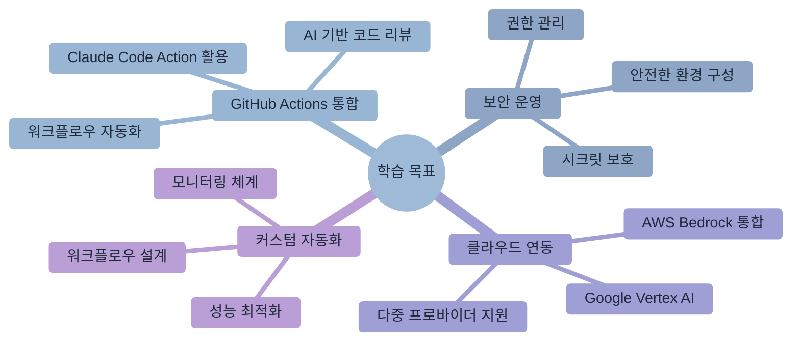
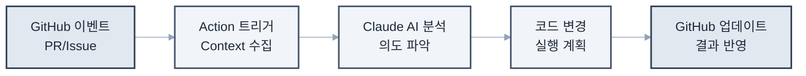
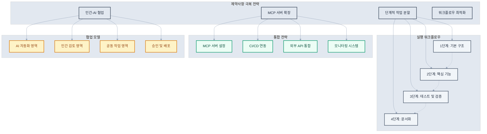
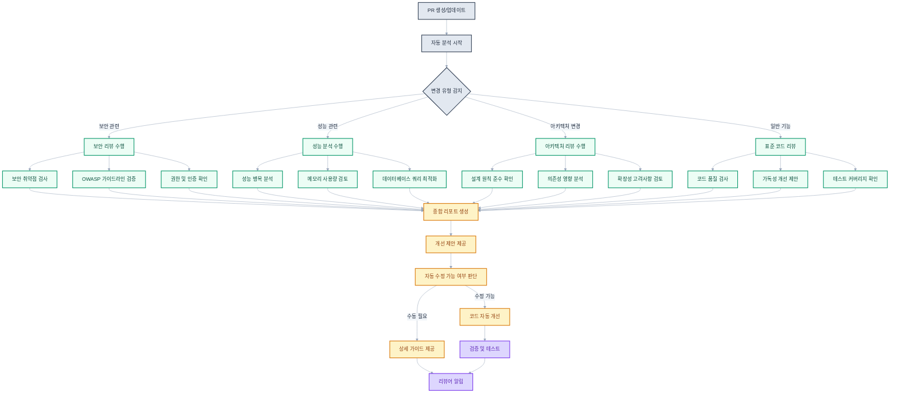
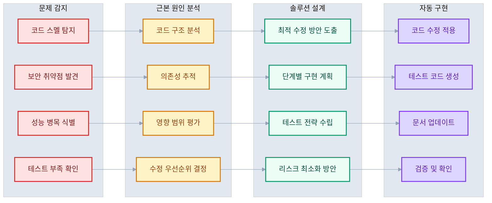
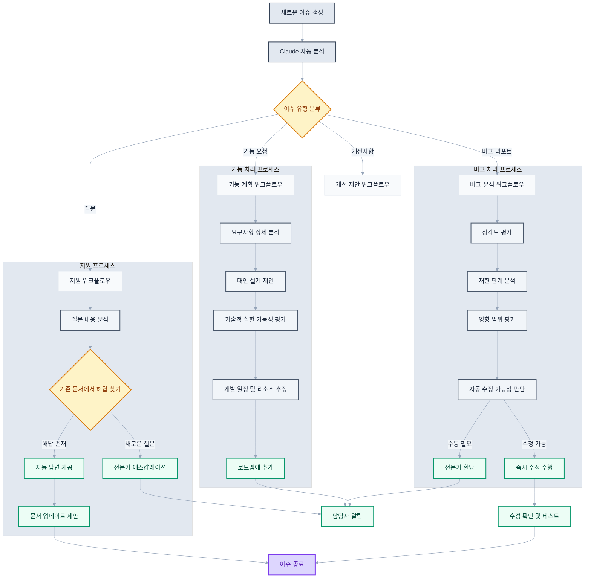
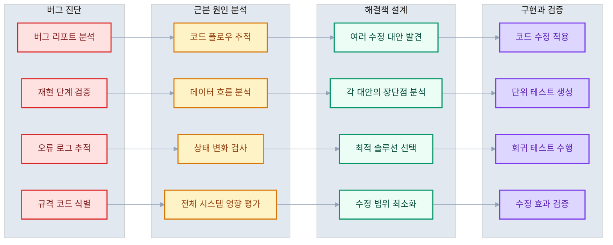

# 제11장: GitHub Actions와 Claude Code Action

> "자동화는 개발자를 반복 작업에서 해방시켜 창의적 문제 해결에 집중할 수 있게 한다" - 데브옵스 철학



## 학습 목표

이 장을 완료하면 다음을 할 수 있습니다.

- Claude Code Action을 활용한 GitHub 워크플로우 자동화를 구축할 수 있습니다.
- 풀 리퀘스트와 이슈에서 AI 기반 코드 리뷰와 개선을 자동화할 수 있습니다.
- 보안을 고려한 GitHub Actions 환경에서 Claude Code를 안전하게 운영할 수 있습니다.
- 다양한 클라우드 프로바이더(AWS Bedrock, Google Vertex AI)와 연동할 수 있습니다.
- 커스텀 자동화 워크플로우를 설계하고 최적화할 수 있습니다.

## 개요

소프트웨어 개발에서 지속적 통합과 배포(CI/CD)는 필수가 되었고, GitHub Actions는 이러한 자동화의 중심에 있습니다. Claude Code Action은 이 생태계에 AI의 지능을 통합하여, 코드 리뷰부터 자동 수정, 문서화까지 개발 프로세스 전반을 혁신적으로 개선합니다.

Claude Code Action은 단순한 자동화 도구를 넘어서 개발팀의 지능형 협업 파트너입니다. Pull Request에서 `@claude`를 멘션하면 즉시 코드를 분석하고, 개선 사항을 제안하며, 필요한 경우 직접 코드를 수정하고 커밋까지 생성합니다. 이는 개발자가 더 높은 수준의 아키텍처 설계와 비즈니스 로직에 집중할 수 있게 해줍니다.

## 11.1 Claude Code Action 개요와 아키텍처

Claude Code Action은 GitHub의 이벤트 기반 시스템과 Claude AI를 연결하는 고도화된 자동화 플랫폼입니다. 단순한 코드 생성을 넘어서 상황을 이해하고, 맥락에 맞는 해결책을 제시하며, 팀의 개발 워크플로우에 자연스럽게 통합됩니다.

### 핵심 아키텍처와 동작 원리

Claude Code Action은 GitHub의 웹훅 시스템과 Claude AI의 추론 능력을 결합한 지능형 자동화 시스템입니다.



**시스템 구성 요소**

```bash
# 시스템 아키텍처 분석
claude "Claude Code Action의 전체 아키텍처를 설명해줘.
GitHub 이벤트 처리부터 AI 분석, 코드 변경, 결과 반영까지
전체 파이프라인의 각 단계별 역할과 상호작용을 포함해줘."
```

### 지능형 이벤트 처리 시스템

**다양한 GitHub 이벤트와 트리거 패턴**

```yaml
# 종합적인 이벤트 처리 설정
name: Claude AI Assistant - Enterprise
on:
  # Pull Request 이벤트
  pull_request:
    types: [opened, synchronize, reopened]
    paths:
      - 'src/**'
      - 'docs/**'
      - '*.md'
  
  # 코멘트 기반 상호작용
  issue_comment:
    types: [created, edited]
  
  pull_request_review_comment:
    types: [created, edited]
  
  # 리뷰 프로세스 통합
  pull_request_review:
    types: [submitted, edited]
  
  # 이슈 관리 자동화
  issues:
    types: [opened, assigned, labeled]
  
  # 스케줄링된 작업 (예: 주간 코드 감사)
  schedule:
    - cron: '0 9 * * 1'  # 매주 월요일 오전 9시
  
  # 수동 실행 지원
  workflow_dispatch:
    inputs:
      action_type:
        description: 'Action type to perform'
        required: true
        default: 'code_review'
        type: choice
        options:
        - code_review
        - documentation_update
        - security_audit
        - performance_analysis
```

### 상황 인식 AI 상호작용

Claude Code Action은 단순한 키워드 매칭을 넘어서 맥락을 이해하고 적절한 행동을 결정합니다.

```bash
# 다양한 상호작용 패턴
claude "Pull Request에서 다음과 같은 다양한 요청을 처리하는 방법을 설명해줘

상황별 요청 예시
1. '@claude 이 PR을 리뷰해줘' - 전체 코드 리뷰
2. '@claude 이 함수의 성능을 개선해줘' - 특정 코드 최적화  
3. '@claude 테스트 커버리지를 높여줘' - 테스트 코드 생성
4. '@claude 보안 취약점을 찾아줘' - 보안 분석
5. '@claude 문서를 업데이트해줘' - 자동 문서화
6. '@claude 이 버그를 수정해줘 [스크린샷]' - 이미지 기반 문제 해결

각 상황에서 Claude가 어떻게 맥락을 파악하고 적절한 행동을 결정하는지 설명해줘."
```

## 11.2 Claude Code Action의 능력과 한계

Claude Code Action을 효과적으로 활용하기 위해서는 무엇을 할 수 있고 무엇을 할 수 없는지 명확히 이해하는 것이 중요합니다. 이러한 이해를 바탕으로 적절한 기대치를 설정하고 워크플로우를 최적화할 수 있습니다.

### Claude가 할 수 있는 일

Claude Code Action은 다양한 개발 작업을 자동화하고 지원할 수 있습니다.

```mermaid
%%{init: {"theme": "base", "themeVariables": {"primaryColor": "#f8fafc", "primaryTextColor": "#1e293b", "primaryBorderColor": "#e2e8f0", "lineColor": "#94a3b8", "secondaryColor": "#f1f5f9", "tertiaryColor": "#e2e8f0"}}}%%
graph TD
    A[Claude Code Action 능력] --> B[코드 분석]
    A --> C[코드 구현]
    A --> D[브랜치 관리]
    A --> E[코드 리뷰]
    A --> F[진행 추적]
    
    B --> B1[시간 복잡도 분석]
    B --> B2[보안 취약점 확인]
    B --> B3[스키마 정규화 평가]
    
    C --> C1[버그 수정]
    C --> C2[기능 구현]
    C --> C3[코드 리팩토링]
    C --> C4[테스트 작성]
    C --> C5[문서화]
    
    D --> D1[이슈 → 새 브랜치]
    D --> D2[열린 PR → 직접 푸시]
    D --> D3[닫힌 PR → 새 브랜치]
    
    E --> E1[성능 분석]
    E --> E2[보안 검토]
    E --> E3[가독성 평가]
    E --> E4[영향도 분석]
    
    F --> F1[실시간 업데이트]
    F --> F2[체크박스 진행상황]
    F --> F3[최종 결과 요약]
    
    classDef mainStyle fill:#e2e8f0,stroke:#334155,stroke-width:3px,color:#1e293b
    classDef categoryStyle fill:#f1f5f9,stroke:#475569,stroke-width:2px,color:#1e293b
    classDef itemStyle fill:#f8fafc,stroke:#94a3b8,stroke-width:1px,color:#64748b
    
    class A mainStyle
    class B,C,D,E,F categoryStyle
    class B1,B2,B3,C1,C2,C3,C4,C5,D1,D2,D3,E1,E2,E3,E4,F1,F2,F3 itemStyle
```



**1. 코드 분석과 질문 응답**
```bash
# 코드 분석 요청 예시
"@claude 이 함수의 시간 복잡도를 분석하고 최적화 방안을 제시해줘"
"@claude 이 API 엔드포인트의 보안 취약점을 확인해줘"
"@claude 이 데이터베이스 스키마의 정규화 수준을 평가해줘"
```

**2. 코드 변경과 구현**

- 간단한 버그 수정부터 중간 규모의 기능 구현
- 리팩토링과 코드 개선
- 테스트 코드 작성
- 문서화와 주석 추가

```bash
# 구현 요청 예시
"@claude 이 함수에 에러 핸들링을 추가해줘"
"@claude 이 컴포넌트를 TypeScript로 마이그레이션해줘"
"@claude 이 API에 대한 단위 테스트를 작성해줘"
```

**3. 스마트한 브랜치 관리**

- **이슈에서 트리거**: 항상 새 브랜치 생성
- **열린 PR에서 트리거**: 기존 PR 브랜치에 직접 푸시
- **닫힌 PR에서 트리거**: 새 브랜치 생성 (원본이 더 이상 활성화되지 않음)

**4. 포괄적인 코드 리뷰**
```bash
# 리뷰 요청 예시
"@claude 이 PR을 종합적으로 리뷰해줘. 성능, 보안, 가독성을 모두 확인해줘"
"@claude 이 변경사항이 기존 코드에 미치는 영향을 분석해줘"
```

**5. 단일 댓글 업데이트**

- 모든 작업 진행상황을 하나의 댓글에서 실시간 업데이트
- 체크박스로 진행상황 시각화
- 최종 결과와 요약 제공

### Claude가 할 수 없는 일

보안과 시스템 안정성을 위해 Claude Code Action에는 다음과 같은 제약사항이 있습니다.

```mermaid
%%{init: {"theme": "base", "themeVariables": {"primaryColor": "#f8fafc", "primaryTextColor": "#1e293b", "primaryBorderColor": "#e2e8f0", "lineColor": "#94a3b8", "secondaryColor": "#f1f5f9", "tertiaryColor": "#e2e8f0"}}}%%
graph TD
    A[Claude Code Action 제약사항] --> B[GitHub 시스템 제한]
    A --> C[보안 경계]
    A --> D[실행 권한 제한]
    A --> E[컨텍스트 범위 제한]
    
    B --> B1[PR 승인 불가<br/>보안상 승인 권한 없음]
    B --> B2[공식 리뷰 제출 불가<br/>GitHub 리뷰 시스템 제한]
    B --> B3[복수 댓글 작성 불가<br/>단일 댓글 업데이트만 가능]
    
    C --> C1[다른 저장소 접근 불가<br/>트리거된 저장소만 접근]
    C --> C2[조직 정보 접근 불가<br/>조직 전체 권한 제한]
    C --> C3[외부 시스템 연동 제한<br/>MCP 서버 설정 필요]
    
    D --> D1[임의 명령어 실행 불가<br/>allowed_tools 명시 필요]
    D --> D2[시스템 수준 변경 차단<br/>민감한 작업 제한]
    D --> D3[강제 푸시 불가<br/>Git 히스토리 보호]
    
    E --> E1[CI/CD 로그 접근 불가<br/>별도 통합 설정 필요]
    E --> E2[빌드 상태 확인 제한<br/>MCP를 통한 우회 필요]
    E --> E3[실시간 모니터링 불가<br/>스냅샷 기반 작업]
    
    classDef limitStyle fill:#fee2e2,stroke:#dc2626,stroke-width:2px,color:#7f1d1d
    classDef categoryStyle fill:#f1f5f9,stroke:#475569,stroke-width:2px,color:#1e293b
    classDef mainStyle fill:#e2e8f0,stroke:#334155,stroke-width:3px,color:#1e293b
    
    class B1,B2,B3,C1,C2,C3,D1,D2,D3,E1,E2,E3 limitStyle
    class B,C,D,E categoryStyle
    class A mainStyle
```



**1. GitHub PR 리뷰 시스템 제한**

- 공식적인 GitHub PR 리뷰 제출 불가
- PR 승인 권한 없음 (보안상 이유)
- 여러 개의 별도 댓글 작성 불가

```yaml
# 이런 작업은 불가능
- name: "Claude PR 승인"  # ❌ 불가능
- name: "Claude 리뷰 제출"  # ❌ 불가능
```

**2. 컨텍스트 범위 제한**

- 트리거된 저장소와 PR/이슈 컨텍스트로만 작업 범위 한정
- 다른 저장소나 외부 시스템 접근 불가
- 조직 전체 정보 접근 불가

**3. 명령어 실행 제한**

- 기본적으로 임의의 Bash 명령어 실행 불가
- `allowed_tools` 설정을 통해 명시적으로 허용해야 함
- 시스템 수준 변경이나 민감한 작업 차단

```yaml
# 명령어 실행을 위한 명시적 허용 필요
- uses: anthropics/claude-code-action@beta
  with:
    allowed_tools: "Bash(npm install),Bash(npm test),Edit,Replace"
    disallowed_tools: "Bash(rm),Bash(sudo)"
```

**4. CI/CD 시스템 통합 제한**

- 빌드 로그나 테스트 결과에 직접 접근 불가
- CI 시스템 상태 확인 불가
- 별도 MCP 서버 설정 없이는 외부 시스템 연동 제한

**5. 고급 Git 작업 제한**

- 브랜치 병합, 리베이스 등 복잡한 Git 작업 불가
- 커밋 푸시를 넘어서는 브랜치 조작 불가
- Git 히스토리 수정이나 강제 푸시 불가

### 제약사항 극복 전략

이러한 제약사항들은 창의적인 워크플로우 설계로 극복할 수 있습니다.



**1. 단계적 작업 분할**
```bash
# 큰 작업을 작은 단위로 분할
"@claude 1단계: 기본 구조만 먼저 구현해줘"
# 첫 번째 작업 완료 후
"@claude 2단계: 에러 핸들링을 추가해줘"
# 두 번째 작업 완료 후  
"@claude 3단계: 테스트 코드를 작성해줘"
```

**2. MCP 서버를 통한 기능 확장**
```yaml
# CI/CD 통합을 위한 MCP 서버 설정
mcp_config: |
  {
    "mcpServers": {
      "ci-integration": {
        "command": "node",
        "args": ["./scripts/ci-mcp-server.js"],
        "env": {
          "CI_API_TOKEN": "${{ secrets.CI_API_TOKEN }}"
        }
      }
    }
  }
allowed_tools: "mcp__ci-integration__get-build-status,mcp__ci-integration__trigger-deployment"
```

**3. 인간과 AI의 협업 워크플로우**
```bash
# AI가 준비하고 인간이 마무리하는 패턴
"@claude PR 준비까지 해줘. 최종 리뷰는 내가 할게"
"@claude 코드 변경은 해주고, 배포는 수동으로 할게"
```

### 효과적인 활용 가이드라인

**1. 명확한 요청 작성**
```bash
# ✅ 좋은 예: 구체적이고 명확한 요청
"@claude user authentication API에 rate limiting을 추가해줘. 
분당 5회 로그인 시도로 제한하고, Redis를 사용해서 구현해줘"

# ❌ 나쁜 예: 모호하고 범위가 넓은 요청  
"@claude 보안을 개선해줘"
```

**2. 점진적 개선 접근**
```bash
# 1차: 기본 기능 구현
"@claude 기본적인 로그인 기능을 구현해줘"

# 2차: 보안 강화
"@claude 방금 구현한 로그인에 2FA를 추가해줘"

# 3차: 사용자 경험 개선
"@claude 로그인 실패 시 사용자 친화적인 에러 메시지를 추가해줘"
```

**3. 컨텍스트 정보 제공**
```bash
# 프로젝트 맥락 포함
"@claude 이 프로젝트는 React + TypeScript + Next.js를 사용해.
사용자 프로필 편집 기능을 추가해줘. 기존 UserService를 활용해서"
```

이러한 능력과 한계를 이해하고 적절히 활용하면 Claude Code Action을 통해 개발 생산성을 크게 향상시킬 수 있습니다.

## 11.3 설치와 초기 설정

Claude Code Action의 성공적인 도입을 위해서는 체계적인 설정과 보안 고려사항이 중요합니다. 조직의 보안 정책과 개발 워크플로우에 맞는 맞춤형 설정을 통해 최적의 성능과 안전성을 확보할 수 있습니다.

### 빠른 시작: Claude CLI를 통한 자동 설정

가장 효율적인 설정 방법은 Claude CLI의 자동 설치 기능을 활용하는 것입니다.

```bash
# Claude CLI를 통한 원클릭 설정
claude "/install-github-app"

# 이 명령은 다음을 자동으로 수행합니다.
# 1. GitHub App 권한 설정
# 2. Repository secrets 생성
# 3. Workflow 파일 생성
# 4. 초기 테스트 실행
```

**자동 설정이 완료하는 작업들**

```bash
# 자동 설정 과정 상세 분석
claude "Claude CLI의 /install-github-app 명령이 수행하는 작업을 단계별로 설명해줘.
- GitHub App 권한 요청과 승인 과정
- Repository secrets 자동 생성
- Workflow 파일 템플릿 선택과 커스터마이징
- 초기 테스트와 검증 절차
- 문제 발생 시 롤백과 재설정 방법"
```

### 수동 설정: 엔터프라이즈 환경을 위한 세밀한 제어

보안 요구사항이 높은 조직이나 특별한 설정이 필요한 경우 수동 설정을 통해 더 세밀한 제어가 가능합니다.

**1단계: GitHub App 설치와 권한 설정**

```bash
# GitHub App 권한 분석과 최적화
claude "Claude Code GitHub App의 권한을 분석하고 최소 권한 원칙에 따른 설정을 제안해줘.
필수 권한
- Pull requests: read & write
- Issues: read & write  
- Contents: read & write
- Metadata: read

보안 고려사항
- 민감한 파일 접근 제한
- 특정 브랜치 보호 설정
- 조직 차원의 정책 적용
- 감사 로그 설정"
```

**2단계: Repository Secrets 보안 설정**

```bash
# 고급 시크릿 관리 전략
claude "엔터프라이즈 환경에서 Claude Code Action을 위한 시크릿 관리 전략을 수립해줘.
다음 사항을 포함해줘

시크릿 계층화
- ANTHROPIC_API_KEY: Claude API 접근
- CUSTOM_API_KEYS: 추가 서비스 연동
- ENVIRONMENT_VARS: 환경별 설정

보안 모범 사례
- 시크릿 로테이션 정책
- 접근 권한 최소화
- 감사 추적 설정
- 백업과 복구 절차
- 규정 준수 요구사항"
```

**3단계: 워크플로우 파일 엔터프라이즈 템플릿**

```yaml
# .github/workflows/claude-enterprise.yml
name: Claude AI Assistant - Enterprise Edition
on:
  issue_comment:
    types: [created]
  pull_request_review_comment:
    types: [created]
  issues:
    types: [opened, assigned]
  pull_request:
    types: [opened, synchronize]
    paths-ignore:
      - '**.md'
      - 'docs/**'
  schedule:
    - cron: '0 2 * * 1'  # 매주 월요일 새벽 2시 정기 점검

permissions:
  contents: write
  pull-requests: write
  issues: write
  id-token: write  # OIDC를 위한 권한

jobs:
  security-check:
    runs-on: ubuntu-latest
    outputs:
      approved: ${{ steps.security.outputs.approved }}
    steps:
      - name: Security validation
        id: security
        run: |
          # 보안 정책 확인
          if [[ "${{ github.actor }}" == "dependabot[bot]" ]]; then
            echo "approved=false" >> $GITHUB_OUTPUT
            exit 0
          fi
          
          # 허용된 사용자/팀 확인
          echo "approved=true" >> $GITHUB_OUTPUT

  claude-assistant:
    needs: security-check
    if: needs.security-check.outputs.approved == 'true'
    runs-on: ubuntu-latest
    environment: production  # Environment protection rules 적용
    
    steps:
      - name: Rate limiting check
        id: rate-limit
        run: |
          # API 사용량 모니터링
          echo "Checking API usage limits..."
          
      - name: Claude Code Action
        uses: anthropics/claude-code-action@beta
        with:
          anthropic_api_key: ${{ secrets.ANTHROPIC_API_KEY }}
          
          # 엔터프라이즈 설정
          timeout_minutes: 45
          model: "claude-3-5-sonnet-20241022"
          
          # 보안 강화 설정
          allowed_tools: "Edit,Replace,GitLog,GitDiff"
          disallowed_tools: "Bash,WebFetch,FileDelete"
          
          # 커스텀 지침
          custom_instructions: |
            당신은 우리 조직의 엔터프라이즈 개발 표준을 준수해야 합니다.
            - 모든 변경사항은 단위 테스트를 포함해야 합니다.
            - 보안 모범 사례를 적용해야 합니다.
            - 성능 영향을 고려해야 합니다.
            - 코드 리뷰 가이드라인을 따라야 합니다.
            
          # 환경 변수
          claude_env: |
            NODE_ENV: production
            CI: true
            SECURITY_SCAN: enabled
            
      - name: Post-action validation
        if: always()
        run: |
          echo "Validating action results..."
          # 결과 검증 로직
```

### 다중 환경 설정과 배포 전략

**개발/스테이징/프로덕션 환경별 설정**

```bash
# 환경별 설정 전략
claude "Claude Code Action을 다중 환경(dev/staging/prod)에서 운영하는 전략을 수립해줘.
각 환경별 특성

개발 환경
- 빠른 피드백과 실험 허용
- 관대한 권한과 도구 접근
- 상세한 로깅과 디버깅 정보

스테이징 환경
- 프로덕션과 유사한 제약사항
- 성능과 보안 테스트
- 사용자 수용 테스트 지원

프로덕션 환경
- 최고 수준의 보안과 안정성
- 최소 권한과 엄격한 검증
- 포괄적인 모니터링과 알림

환경 간 설정 관리와 동기화 방법도 포함해줘."
```

## 11.4 Pull Request 자동화

Pull Request는 코드 품질과 팀 협업의 핵심 지점입니다. Claude Code Action을 통한 PR 자동화는 단순한 코드 리뷰를 넘어서 지능형 개발 어시스턴트 역할을 수행하여, 개발 효율성과 코드 품질을 동시에 향상시킵니다.

### 지능형 코드 리뷰 시스템

Claude Code Action은 컨텍스트를 이해하고 의미 있는 피드백을 제공하는 고급 코드 리뷰어입니다.



**종합적 코드 분석과 리뷰**

```bash
# 다차원 코드 리뷰 요청
"@claude 이 PR을 종합적으로 리뷰해줘. 다음 관점을 모두 고려해줘
- 코드 품질과 가독성
- 성능과 메모리 효율성  
- 보안 취약점과 위험요소
- 아키텍처 일관성과 설계 원칙
- 테스트 커버리지와 품질
- 문서화 완성도
- 팀 코딩 표준 준수

각 영역별로 구체적인 개선 방안과 우선순위를 제시해줘."
```

**특화된 리뷰 요청 패턴**

```bash
# 성능 중심 리뷰
"@claude 이 PR의 성능 영향을 분석해줘. 
특히 데이터베이스 쿼리, 메모리 사용량, 
그리고 사용자 경험에 미치는 영향을 중점적으로 봐줘."

# 보안 중심 리뷰  
"@claude 보안 관점에서 이 PR을 검토해줘.
OWASP Top 10, 입력 검증, 권한 부여, 
데이터 노출 위험을 확인해줘."

# 아키텍처 리뷰
"@claude 이 변경사항이 전체 시스템 아키텍처에 미치는 영향을 분석해줢.
의존성 변화, 결합도, 확장성을 고려해줘."
```

### 자동 코드 개선과 수정

Claude는 문제를 발견하는 것을 넘어서 직접 해결책을 구현할 수 있습니다.



**즉시 적용 가능한 수정 요청**

```bash
# 에러 핸들링 개선
"@claude 이 함수에 포괄적인 에러 핸들링을 추가해줘.
try-catch 블록, 의미 있는 에러 메시지, 
그리고 적절한 로깅을 포함해줘."

# 성능 최적화
"@claude 이 데이터 처리 로직을 최적화해줘.
메모리 사용량을 줄이고 처리 속도를 향상시켜줘."

# 테스트 코드 생성
"@claude 이 새로운 기능에 대한 단위 테스트와 통합 테스트를 작성해줘.
엣지 케이스와 에러 시나리오도 포함해줘."

# 문서화 자동 생성
"@claude 이 API 엔드포인트들에 대한 OpenAPI 문서를 생성하고
README를 업데이트해줘."
```

### 고급 자동화 워크플로우

**조건부 실행과 스마트 트리거**

```yaml
# 고도화된 PR 자동화 워크플로우
name: Intelligent PR Processing
on:
  pull_request:
    types: [opened, synchronize]

jobs:
  smart-analysis:
    runs-on: ubuntu-latest
    outputs:
      requires_security_review: ${{ steps.analysis.outputs.security }}
      requires_performance_review: ${{ steps.analysis.outputs.performance }}
      complexity_score: ${{ steps.analysis.outputs.complexity }}
      
    steps:
      - uses: actions/checkout@v4
        with:
          fetch-depth: 0
          
      - name: Analyze PR complexity
        id: analysis
        run: |
          # 변경된 파일 분석
          FILES_CHANGED=$(git diff --name-only HEAD^ HEAD | wc -l)
          LINES_CHANGED=$(git diff --stat HEAD^ HEAD | tail -1 | awk '{print $4+$6}')
          
          # 보안 관련 파일 변경 감지
          SECURITY_FILES=$(git diff --name-only HEAD^ HEAD | grep -E "(auth|security|login|password)" | wc -l)
          
          # 성능 크리티컬 파일 변경 감지
          PERFORMANCE_FILES=$(git diff --name-only HEAD^ HEAD | grep -E "(query|database|cache|index)" | wc -l)
          
          echo "security=$([[ $SECURITY_FILES -gt 0 ]] && echo true || echo false)" >> $GITHUB_OUTPUT
          echo "performance=$([[ $PERFORMANCE_FILES -gt 0 ]] && echo true || echo false)" >> $GITHUB_OUTPUT
          echo "complexity=$(( FILES_CHANGED * 10 + LINES_CHANGED / 10 ))" >> $GITHUB_OUTPUT

  security-review:
    needs: smart-analysis
    if: needs.smart-analysis.outputs.requires_security_review == 'true'
    runs-on: ubuntu-latest
    steps:
      - uses: anthropics/claude-code-action@beta
        with:
          anthropic_api_key: ${{ secrets.ANTHROPIC_API_KEY }}
          direct_prompt: |
            이 PR에서 보안 관련 변경사항을 발견했습니다. 
            포괄적인 보안 리뷰를 수행해주세요
            
            1. 인증과 권한 부여 로직 검증
            2. 입력 검증과 SQL 인젝션 방지 확인
            3. 데이터 노출과 정보 유출 위험 평가
            4. 암호화와 해싱 적절성 검토
            5. 보안 모범 사례 준수 여부 확인
            
            발견된 문제는 즉시 수정해주세요.

  performance-review:
    needs: smart-analysis  
    if: needs.smart-analysis.outputs.requires_performance_review == 'true'
    runs-on: ubuntu-latest
    steps:
      - uses: anthropics/claude-code-action@beta
        with:
          anthropic_api_key: ${{ secrets.ANTHROPIC_API_KEY }}
          direct_prompt: |
            이 PR에서 성능에 영향을 줄 수 있는 변경사항을 발견했습니다.
            성능 분석과 최적화를 수행해주세요:
            
            1. 데이터베이스 쿼리 효율성 분석
            2. 알고리즘 복잡도 평가
            3. 메모리 사용 패턴 검토
            4. 캐싱 전략 개선 제안
            5. 병목 지점 식별과 해결
            
            성능 벤치마크와 함께 최적화된 코드를 제공해주세요.

  comprehensive-review:
    needs: smart-analysis
    if: needs.smart-analysis.outputs.complexity_score > 100
    runs-on: ubuntu-latest
    steps:
      - uses: anthropics/claude-code-action@beta
        with:
          anthropic_api_key: ${{ secrets.ANTHROPIC_API_KEY }}
          custom_instructions: |
            이것은 복잡한 PR입니다 (복잡도: ${{ needs.smart-analysis.outputs.complexity_score }}).
            특별히 주의 깊은 리뷰가 필요합니다.
          direct_prompt: |
            복잡한 변경사항을 포함한 이 PR을 종합적으로 리뷰해주세요.
            
            우선순위 분석
            1. 아키텍처 변경이 시스템에 미치는 영향
            2. 기존 기능에 대한 호환성 유지
            3. 테스트 커버리지의 적절성
            4. 문서화 업데이트 필요성
            5. 단계적 배포 전략 제안
            
            위험도가 높은 변경사항은 별도 지적하고 
            완화 방안을 제시해주세요.
```

### 팀 협업 향상을 위한 자동화

**멘션 기반 전문가 리뷰 요청**

```bash
# 전문 영역별 리뷰어 자동 멘션
"@claude 이 데이터베이스 스키마 변경을 리뷰하고
@database-team을 자동으로 멘션해줘."

# 크로스 팀 영향 분석
"@claude 이 API 변경이 다른 팀에 미치는 영향을 분석하고
영향받는 팀들에게 알림을 보내줘."

# 문서화 협업
"@claude 이 기능 변경에 따른 문서 업데이트가 필요한 부분을 찾고
@docs-team에게 업데이트 요청을 보내줘."
```

## 11.5 이슈 관리 자동화

GitHub 이슈는 프로젝트 관리와 버그 추적의 중심입니다. Claude Code Action을 통한 이슈 자동화는 문제 해결 과정을 가속화하고, 일관된 품질의 해결책을 제공하며, 팀의 생산성을 크게 향상시킵니다.

### 지능형 이슈 분류와 라우팅

Claude는 이슈의 내용을 분석하여 자동으로 분류하고 적절한 담당자에게 할당할 수 있습니다.



**자동 이슈 분석과 분류**

```yaml
# 이슈 자동 처리 워크플로우
name: Intelligent Issue Management
on:
  issues:
    types: [opened, edited]

jobs:
  issue-analysis:
    runs-on: ubuntu-latest
    steps:
      - uses: anthropics/claude-code-action@beta
        with:
          anthropic_api_key: ${{ secrets.ANTHROPIC_API_KEY }}
          assignee_trigger: "claude-assistant"
          direct_prompt: |
            새로운 이슈를 분석하고 다음 작업을 수행해주세요:
            
            1. 이슈 분류 (버그, 기능 요청, 개선사항, 질문)
            2. 심각도 평가 (Critical, High, Medium, Low)
            3. 예상 소요 시간 추정
            4. 관련 기술 스택과 컴포넌트 식별
            5. 적절한 라벨 추가
            6. 담당팀 또는 개발자 추천
            
            분석 결과를 이슈에 코멘트로 추가하고,
            적절한 라벨과 마일스톤을 설정해주세요.
```

**버그 리포트 자동 향상**

```bash
# 불완전한 버그 리포트 개선
"@claude 이 버그 리포트를 분석하고 부족한 정보를 찾아줘.
재현 단계, 예상 동작, 실제 동작, 환경 정보 등을 
체계적으로 정리해서 템플릿을 완성해줘."

# 스크린샷 기반 버그 분석
"@claude 첨부된 스크린샷을 보고 발생 가능한 원인을 분석해줘.
관련 코드 파일을 찾아서 수정 방안을 제시해줘."
```

### 자동 버그 수정과 해결

Claude는 이슈를 단순히 분석하는 것을 넘어서 직접 해결책을 구현할 수 있습니다.



**즉시 수정 가능한 버그 처리**

```bash
# 구체적인 버그 수정 요청
"@claude 사용자가 로그인할 때 가끔 세션이 만료되는 버그를 수정해줘.
관련 코드를 찾아서 문제를 진단하고 패치를 생성해줘."

# 성능 이슈 해결
"@claude 메인 페이지 로딩이 느린 문제를 해결해줘.
병목 지점을 찾아서 최적화하고 성능 테스트 결과도 포함해줘."

# 호환성 문제 해결
"@claude 새 버전 React에서 deprecated 경고가 발생하는 문제를 해결해줘.
모든 컴포넌트를 최신 API로 마이그레이션해줘."
```

### 기능 요청 처리 자동화

**요구사항 분석과 구현 계획**

```bash
# 기능 요청 분석
"@claude 이 기능 요청을 분석해서 다음을 제공해줘
1. 요구사항 명세서 작성
2. 기술적 구현 방안 검토
3. 예상 개발 시간과 리소스
4. 시스템 영향도 분석
5. 단계별 구현 계획"

# 프로토타입 생성
"@claude 요청된 기능의 프로토타입을 만들어줘.
기본적인 구조와 핵심 로직을 구현하고
추가 개발이 필요한 부분을 명시해줘."
```

### 이슈 템플릿 자동화

**동적 이슈 템플릿 생성**

```yaml
# 컨텍스트 인식 이슈 템플릿
name: Smart Issue Templates
on:
  issues:
    types: [opened]

jobs:
  template-enhancement:
    if: contains(github.event.issue.body, 'bug') || contains(github.event.issue.title, 'bug')
    runs-on: ubuntu-latest
    steps:
      - uses: anthropics/claude-code-action@beta
        with:
          anthropic_api_key: ${{ secrets.ANTHROPIC_API_KEY }}
          direct_prompt: |
            이 이슈가 버그 리포트로 보입니다. 
            표준 버그 리포트 템플릿에 맞게 정보를 보완해주세요:
            
            ## 버그 설명
            [간단하고 명확한 설명]
            
            ## 재현 단계
            1. ...
            2. ...
            3. ...
            
            ## 예상 동작
            [무엇이 일어나야 하는지 설명]
            
            ## 실제 동작  
            [실제로 무엇이 일어나는지 설명]
            
            ## 환경 정보
            - OS: 
            - 브라우저:
            - 버전:
            
            ## 추가 컨텍스트
            [스크린샷, 로그, 기타 유용한 정보]
            
            기존 내용을 분석해서 빠진 부분을 자동으로 채워주세요.
```

## 11.6 보안과 권한 관리

Claude Code Action을 안전하게 운영하기 위해서는 철저한 보안 설계와 권한 관리가 필수입니다. 특히 엔터프라이즈 환경에서는 민감한 데이터 보호, 접근 제어, 감사 추적이 중요한 요구사항입니다.

### API 키 보안과 시크릿 관리

**계층화된 시크릿 관리 전략**

```bash
# 엔터프라이즈 시크릿 관리 전략
claude "Claude Code Action을 위한 포괄적인 시크릿 관리 전략을 설계해줘.
다음 요소를 포함해줘

시크릿 계층 구조
- Organization level secrets (전사 공통)
- Repository level secrets (프로젝트별)  
- Environment level secrets (환경별)

보안 모범 사례
- 시크릿 로테이션 정책 (30-90일)
- 접근 권한 최소화 원칙
- 암호화와 전송 보안
- 감사 로그와 모니터링
- 사고 대응 절차

규정 준수
- SOC 2 Type II 요구사항
- GDPR 개인정보 보호
- HIPAA 보건의료 규정
- 업계별 특수 요구사항"
```

**API 키 보안 강화**

```yaml
# 고급 시크릿 보안 설정
name: Secure Claude Action
on:
  issue_comment:
    types: [created]

jobs:
  security-validation:
    runs-on: ubuntu-latest
    environment: production
    steps:
      - name: API Key Validation
        env:
          ANTHROPIC_API_KEY: ${{ secrets.ANTHROPIC_API_KEY }}
        run: |
          # API 키 형식 검증
          if [[ ! "$ANTHROPIC_API_KEY" =~ ^sk-ant-api03- ]]; then
            echo "Invalid API key format"
            exit 1
          fi
          
          # API 키 활성화 상태 확인
          response=$(curl -s -H "x-api-key: $ANTHROPIC_API_KEY" \
                     https://api.anthropic.com/v1/models)
          if [[ $? -ne 0 ]]; then
            echo "API key validation failed"
            exit 1
          fi
          
      - name: Rate Limiting Check
        run: |
          # API 사용량 모니터링
          echo "Checking current API usage..."
          # 사용량이 임계값을 초과하면 중단
          
      - name: Security Context Validation
        run: |
          # 요청자 권한 확인
          if [[ "${{ github.actor }}" == "dependabot[bot]" ]]; then
            echo "Bot users not allowed"
            exit 1
          fi
          
          # 민감한 파일 변경 감지
          if git diff --name-only | grep -E "(secrets|keys|config)" > /dev/null; then
            echo "Sensitive files detected - additional approval required"
            # 추가 승인 프로세스 트리거
          fi

      - uses: anthropics/claude-code-action@beta
        with:
          anthropic_api_key: ${{ secrets.ANTHROPIC_API_KEY }}
          timeout_minutes: 30  # 실행 시간 제한
          disallowed_tools: "WebFetch,FileDelete,Bash(rm),Bash(curl)"
```

### 접근 제어와 권한 최소화

**세밀한 권한 제어 시스템**

```bash
# 역할 기반 접근 제어 (RBAC) 설계
claude "Claude Code Action을 위한 RBAC 시스템을 설계해줘.
다음 역할과 권한을 정의해줘

역할 정의
- Admin: 전체 설정과 시크릿 관리
- Senior Developer: 모든 코드 변경 권한
- Developer: 제한된 코드 변경 권한  
- Reviewer: 읽기 전용 리뷰 권한
- External Contributor: 최소한의 상호작용

권한 매트릭스
- 파일 읽기/쓰기 권한
- 브랜치별 접근 제어
- 민감한 디렉토리 보호
- 시스템 명령어 실행 권한
- 외부 API 호출 권한

구현 방법
- GitHub Team 기반 권한 매핑
- 동적 권한 검증 로직
- 감사 로그 자동 생성
- 권한 에스컬레이션 프로세스"
```

**민감한 파일과 데이터 보호**

```yaml
# 민감한 데이터 보호 설정
- uses: anthropics/claude-code-action@beta
  with:
    anthropic_api_key: ${{ secrets.ANTHROPIC_API_KEY }}
    
    # 접근 금지 파일 패턴
    disallowed_paths: |
      - "**/.env*"
      - "**/secrets/**"
      - "**/keys/**"
      - "**/*password*"
      - "**/*secret*"
      - "**/config/production.yaml"
      
    # 허용된 도구만 사용
    allowed_tools: "Edit,Replace,GitLog,GitDiff"
    disallowed_tools: "Bash,WebFetch,FileDelete,NetworkAccess"
    
    # 커스텀 보안 지침
    custom_instructions: |
      보안 지침
      1. 절대로 시크릿이나 패스워드를 코드에 하드코딩하지 마세요
      2. 모든 외부 입력은 검증해야 합니다.
      3. 민감한 정보는 로그에 남기지 마세요
      4. 보안 관련 변경사항은 별도 승인이 필요합니다.
      5. 데이터베이스 연결 정보는 환경 변수로만 관리하세요
```

### 감사와 모니터링

**포괄적인 감사 추적 시스템**

```bash
# 감사 로그 시스템 설계
claude "Claude Code Action의 모든 활동을 추적하는 감사 시스템을 설계해줘.
다음 요소를 포함해줘

로그 수집 대상
- 모든 API 호출과 응답
- 파일 변경과 커밋 내역
- 권한 요청과 승인/거부
- 에러와 예외 상황
- 성능과 리소스 사용량

로그 형식과 구조
- 구조화된 JSON 로그
- 타임스탬프와 상관관계 ID
- 사용자와 액션 컨텍스트
- 비즈니스 영향도 분류
- 보안 이벤트 마킹

저장과 분석
- 중앙화된 로그 수집 (ELK Stack)
- 실시간 알림과 대시보드
- 이상 패턴 자동 감지
- 규정 준수 리포팅
- 장기 보존 정책"
```

**실시간 보안 모니터링**

```yaml
# 보안 모니터링 워크플로우
name: Security Monitoring
on:
  workflow_run:
    workflows: ["Claude AI Assistant"]
    types: [completed]

jobs:
  security-audit:
    runs-on: ubuntu-latest
    steps:
      - name: Audit Log Collection
        run: |
          # Claude Action 실행 로그 수집
          echo "Collecting audit logs..."
          
          # 보안 이벤트 감지
          if grep -i "security\|password\|secret" $GITHUB_EVENT_PATH; then
            echo "Security-related activity detected"
            # 알림 발송
          fi
          
      - name: Anomaly Detection
        run: |
          # 비정상적인 패턴 감지
          # - 비정상적으로 많은 파일 변경
          # - 민감한 파일에 대한 접근 시도
          # - 평소와 다른 시간대의 활동
          
      - name: Compliance Reporting
        run: |
          # 규정 준수 리포트 생성
          echo "Generating compliance report..."
```

## 11.7 다중 클라우드 환경 설정

현대적인 엔터프라이즈 환경에서는 다양한 클라우드 프로바이더를 활용한 유연한 인프라 구성이 중요합니다. Claude Code Action은 직접 Anthropic API뿐만 아니라 AWS Bedrock과 Google Vertex AI를 통한 접근도 지원하여, 조직의 클라우드 전략에 맞는 최적의 배포가 가능합니다.

### AWS Bedrock 통합

AWS Bedrock을 통한 Claude 접근은 AWS의 보안 및 규정 준수 기능을 활용할 수 있게 해줍니다.

**OIDC 기반 Bedrock 설정**

```yaml
# AWS Bedrock을 통한 Claude Code Action
name: Claude via AWS Bedrock
on:
  issue_comment:
    types: [created]
  pull_request_review_comment:
    types: [created]

permissions:
  id-token: write  # OIDC 토큰 생성을 위해 필요
  contents: write
  pull-requests: write
  issues: write

jobs:
  claude-bedrock:
    runs-on: ubuntu-latest
    environment: production
    
    steps:
      - name: Configure AWS Credentials (OIDC)
        uses: aws-actions/configure-aws-credentials@v4
        with:
          role-to-assume: ${{ secrets.AWS_ROLE_TO_ASSUME }}
          role-session-name: claude-code-action
          aws-region: us-west-2
          
      - name: Validate AWS Permissions
        run: |
          # Bedrock 접근 권한 확인
          aws bedrock list-foundation-models --region us-west-2
          
          # Cross-region inference 권한 확인
          aws bedrock list-inference-profiles --region us-west-2
          
      - name: Generate GitHub App Token
        id: app-token
        uses: actions/create-github-app-token@v2
        with:
          app-id: ${{ secrets.APP_ID }}
          private-key: ${{ secrets.APP_PRIVATE_KEY }}
          
      - uses: anthropics/claude-code-action@beta
        with:
          github_token: ${{ steps.app-token.outputs.token }}
          model: "anthropic.claude-3-7-sonnet-20250219-beta:0"  # Cross-region inference
          use_bedrock: "true"
          timeout_minutes: 45
          
          custom_instructions: |
            AWS Bedrock 환경에서 실행 중입니다.
            다음 AWS 특화 고려사항을 적용해주세요
            - AWS 보안 모범 사례 준수
            - CloudTrail 로깅 고려
            - VPC 네트워크 정책 인식
            - AWS 리소스 태깅 표준 적용
```

**AWS IAM 역할과 정책 설정**

```bash
# AWS IAM 설정 최적화
claude "Claude Code Action을 위한 AWS IAM 설정을 최적화해줘.
다음을 포함해줘

IAM 역할 정의
- GitHub Actions용 OIDC 신뢰 관계
- Bedrock 모델 접근 권한
- CloudWatch 로깅 권한
- 최소 권한 원칙 적용

보안 강화 설정
- 조건부 접근 제어
- 리소스 기반 정책
- 시간 기반 접근 제한
- IP 주소 화이트리스트

Cross-region inference 설정
- 다중 리전 모델 접근
- 지연 시간 최적화
- 가용성 향상 전략
- 비용 최적화 고려사항"
```

### Google Vertex AI 통합

Google Cloud의 AI/ML 플랫폼인 Vertex AI를 통한 Claude 접근 설정

**Vertex AI OIDC 설정**

```yaml
# Google Vertex AI를 통한 Claude Code Action
name: Claude via Google Vertex AI  
on:
  issue_comment:
    types: [created]
  pull_request_review_comment:
    types: [created]

permissions:
  id-token: write  # OIDC 토큰 생성을 위해 필요
  contents: write
  pull-requests: write
  issues: write

jobs:
  claude-vertex:
    runs-on: ubuntu-latest
    environment: production
    
    steps:
      - name: Authenticate to Google Cloud
        uses: google-github-actions/auth@v2
        with:
          workload_identity_provider: ${{ secrets.GCP_WORKLOAD_IDENTITY_PROVIDER }}
          service_account: ${{ secrets.GCP_SERVICE_ACCOUNT }}
          
      - name: Set up Cloud SDK
        uses: google-github-actions/setup-gcloud@v2
        
      - name: Validate GCP Permissions
        run: |
          # Vertex AI 접근 권한 확인
          gcloud ai models list --region=us-central1
          
          # 프로젝트 설정 확인
          gcloud config list project
          
      - name: Generate GitHub App Token
        id: app-token
        uses: actions/create-github-app-token@v2
        with:
          app-id: ${{ secrets.APP_ID }}
          private-key: ${{ secrets.APP_PRIVATE_KEY }}
          
      - uses: anthropics/claude-code-action@beta
        with:
          github_token: ${{ steps.app-token.outputs.token }}
          model: "claude-3-7-sonnet@20250219"
          use_vertex: "true"
          timeout_minutes: 45
          
          custom_instructions: |
            Google Vertex AI 환경에서 실행 중입니다.
            다음 GCP 특화 고려사항을 적용해주세요
            - Google Cloud 보안 모범 사례 준수
            - Cloud Audit Logs 인식
            - VPC 및 방화벽 정책 고려
            - Google Cloud 리소스 라벨링 표준 적용
```

### 멀티 클라우드 전략과 페일오버

**지능형 클라우드 선택과 장애 조치**

```bash
# 멀티 클라우드 아키텍처 설계
claude "Claude Code Action을 위한 멀티 클라우드 전략을 설계해줘.
다음 요소를 포함해줘

클라우드 선택 기준
- 지역별 가용성과 지연 시간
- 비용 효율성과 예산 관리
- 규정 준수 요구사항
- 성능과 처리량 특성
- 장애 복구 능력

페일오버 시나리오
- Primary: Direct Anthropic API
- Secondary: AWS Bedrock (if primary fails)
- Tertiary: Google Vertex AI (if both fail)

자동 전환 로직
- 상태 모니터링과 헬스체크
- 지능형 라우팅 알고리즘
- 성능 기반 동적 선택
- 비용 최적화 고려
- 사용자 경험 우선순위"
```

**동적 클라우드 선택 워크플로우**

```yaml
# 지능형 클라우드 선택 시스템
name: Smart Cloud Selection
on:
  issue_comment:
    types: [created]

jobs:
  cloud-selection:
    runs-on: ubuntu-latest
    outputs:
      selected_cloud: ${{ steps.selector.outputs.cloud }}
      
    steps:
      - name: Cloud Status Check
        id: selector
        run: |
          # 각 클라우드 서비스 상태 확인
          ANTHROPIC_STATUS=$(curl -s https://status.anthropic.com/api/v2/status.json | jq -r '.status.indicator')
          AWS_STATUS=$(curl -s https://status.aws.amazon.com/rss/bedrock-us-west-2.rss | grep -c "operational" || echo 0)
          GCP_STATUS=$(curl -s https://status.cloud.google.com/incidents.json | jq -r '.incidents | length')
          
          # 지역별 지연 시간 측정
          ANTHROPIC_LATENCY=$(curl -w "%{time_total}" -s -o /dev/null https://api.anthropic.com/v1/models || echo 999)
          
          # 비용 고려사항 (시간대별 요금 차이)
          HOUR=$(date +%H)
          if [[ $HOUR -ge 9 && $HOUR -le 17 ]]; then
            COST_FACTOR="peak"
          else
            COST_FACTOR="off-peak"
          fi
          
          # 지능형 선택 로직
          if [[ "$ANTHROPIC_STATUS" == "none" && $ANTHROPIC_LATENCY -lt 2 ]]; then
            echo "cloud=anthropic" >> $GITHUB_OUTPUT
          elif [[ $AWS_STATUS -gt 0 ]]; then
            echo "cloud=bedrock" >> $GITHUB_OUTPUT
          elif [[ $GCP_STATUS -eq 0 ]]; then
            echo "cloud=vertex" >> $GITHUB_OUTPUT
          else
            echo "cloud=anthropic" >> $GITHUB_OUTPUT  # fallback
          fi

  claude-anthropic:
    needs: cloud-selection
    if: needs.cloud-selection.outputs.selected_cloud == 'anthropic'
    runs-on: ubuntu-latest
    steps:
      - uses: anthropics/claude-code-action@beta
        with:
          anthropic_api_key: ${{ secrets.ANTHROPIC_API_KEY }}

  claude-bedrock:
    needs: cloud-selection
    if: needs.cloud-selection.outputs.selected_cloud == 'bedrock'
    runs-on: ubuntu-latest
    steps:
      - name: Configure AWS Credentials
        uses: aws-actions/configure-aws-credentials@v4
        with:
          role-to-assume: ${{ secrets.AWS_ROLE_TO_ASSUME }}
          aws-region: us-west-2
          
      - uses: anthropics/claude-code-action@beta
        with:
          model: "anthropic.claude-3-7-sonnet-20250219-beta:0"
          use_bedrock: "true"

  claude-vertex:
    needs: cloud-selection
    if: needs.cloud-selection.outputs.selected_cloud == 'vertex'
    runs-on: ubuntu-latest
    steps:
      - name: Authenticate to Google Cloud
        uses: google-github-actions/auth@v2
        with:
          workload_identity_provider: ${{ secrets.GCP_WORKLOAD_IDENTITY_PROVIDER }}
          service_account: ${{ secrets.GCP_SERVICE_ACCOUNT }}
          
      - uses: anthropics/claude-code-action@beta
        with:
          model: "claude-3-7-sonnet@20250219"
          use_vertex: "true"
```

## 11.8 고급 커스터마이제이션

Claude Code Action의 진정한 가치는 조직의 특수한 요구사항에 맞게 깊이 있는 커스터마이제이션을 통해 실현됩니다. MCP(Model Context Protocol) 서버 통합, 커스텀 도구 개발, 그리고 조직별 워크플로우 최적화를 통해 Claude를 팀의 전용 AI 어시스턴트로 발전시킬 수 있습니다.

### MCP 서버 통합과 확장

MCP(Model Context Protocol)는 Claude의 기능을 확장하는 표준화된 방법입니다. 조직의 내부 시스템, 데이터베이스, API와의 통합을 통해 Claude가 더 풍부한 컨텍스트로 작업할 수 있게 합니다.

**기본 MCP 서버 통합**

```yaml
# Sequential Thinking MCP 서버 통합
- uses: anthropics/claude-code-action@beta
  with:
    anthropic_api_key: ${{ secrets.ANTHROPIC_API_KEY }}
    mcp_config: |
      {
        "mcpServers": {
          "sequential-thinking": {
            "command": "npx",
            "args": [
              "-y",
              "@modelcontextprotocol/server-sequential-thinking"
            ]
          }
        }
      }
    allowed_tools: "mcp__sequential-thinking__sequentialthinking"
```

**고급 MCP 서버 설정 - 내부 시스템 통합**

```bash
# 조직 특화 MCP 서버 설계
claude "우리 조직을 위한 커스텀 MCP 서버들을 설계해줘.
다음 시스템과의 통합이 필요해

내부 시스템 연동
- JIRA API: 이슈 트래킹과 프로젝트 관리
- Confluence: 문서와 지식 베이스 접근
- Slack API: 팀 커뮤니케이션과 알림
- Jenkins: CI/CD 파이프라인 상태
- DataDog: 모니터링과 성능 메트릭

외부 서비스 통합
- AWS API: 인프라 상태와 리소스 관리
- Kubernetes API: 컨테이너 오케스트레이션
- Database connections: 스키마 정보와 쿼리 실행
- Security scanners: 취약점 검사 결과

각 MCP 서버의 구현 방법과 보안 설정을 포함해줘."
```

**엔터프라이즈 MCP 서버 구성 예시**

```yaml
# 종합적인 MCP 서버 설정
- uses: anthropics/claude-code-action@beta
  with:
    anthropic_api_key: ${{ secrets.ANTHROPIC_API_KEY }}
    mcp_config: |
      {
        "mcpServers": {
          "jira-integration": {
            "command": "node",
            "args": ["./scripts/mcp-jira-server.js"],
            "env": {
              "JIRA_URL": "${{ secrets.JIRA_URL }}",
              "JIRA_TOKEN": "${{ secrets.JIRA_TOKEN }}",
              "JIRA_PROJECT_KEY": "${{ vars.JIRA_PROJECT_KEY }}"
            }
          },
          "database-inspector": {
            "command": "python",
            "args": ["./scripts/mcp-db-server.py"],
            "env": {
              "DB_CONNECTION_STRING": "${{ secrets.DB_READ_ONLY_CONNECTION }}",
              "DB_TYPE": "postgresql"
            }
          },
          "security-scanner": {
            "command": "npx",
            "args": ["-y", "@company/security-mcp-server"],
            "env": {
              "SCANNER_API_KEY": "${{ secrets.SECURITY_SCANNER_API_KEY }}",
              "SCAN_LEVEL": "comprehensive"
            }
          },
          "monitoring-integration": {
            "command": "node",
            "args": ["./scripts/mcp-monitoring-server.js"],
            "env": {
              "DATADOG_API_KEY": "${{ secrets.DATADOG_API_KEY }}",
              "GRAFANA_URL": "${{ secrets.GRAFANA_URL }}",
              "GRAFANA_TOKEN": "${{ secrets.GRAFANA_TOKEN }}"
            }
          }
        }
      }
    allowed_tools: |
      mcp__jira-integration__create-issue,
      mcp__jira-integration__update-issue,
      mcp__jira-integration__search-issues,
      mcp__database-inspector__query-schema,
      mcp__database-inspector__explain-query,
      mcp__security-scanner__scan-code,
      mcp__security-scanner__check-vulnerabilities,
      mcp__monitoring-integration__get-metrics,
      mcp__monitoring-integration__create-alert
```

### 조직별 커스텀 도구 개발

**코드 품질 검사 도구**

```bash
# 조직 특화 코드 품질 도구
claude "우리 팀의 코딩 표준을 자동으로 검사하는 커스텀 도구를 만들어줘.
다음 검사 항목을 포함해줘

코딩 표준 검사
- 함수 네이밍 규칙 (camelCase, 동사로 시작)
- 파일 구조 규칙 (feature/component 기반)
- 코멘트 작성 규칙 (JSDoc, docstring)
- 에러 처리 패턴 일관성
- 로깅 형식 표준화

성능 검사
- 메모리 누수 패턴 감지
- 비효율적인 루프와 쿼리
- 불필요한 렌더링 감지
- 번들 크기 최적화 기회

보안 검사
- 하드코딩된 시크릿 탐지
- SQL 인젝션 취약점
- XSS 공격 벡터
- 권한 부여 누락"
```

**자동 문서화 도구**

```yaml
# 커스텀 문서화 자동화
- uses: anthropics/claude-code-action@beta
  with:
    anthropic_api_key: ${{ secrets.ANTHROPIC_API_KEY }}
    custom_instructions: |
      당신은 우리 조직의 문서화 전문가입니다.
      다음 문서화 표준을 준수해주세요
      
      API 문서화
      - OpenAPI 3.0 스펙 준수
      - 요청/응답 예시 포함
      - 에러 코드와 메시지 설명
      - 버전 관리 정보
      
      코드 문서화
      - 함수별 JSDoc/docstring
      - 복잡한 로직 인라인 주석
      - README 업데이트
      - 아키텍처 다이어그램
      
      사용자 문서화
      - 설치와 설정 가이드
      - 사용 예시와 튜토리얼
      - 문제 해결 가이드
      - FAQ 섹션
    allowed_tools: |
      Edit,Replace,GitLog,GitDiff,
      mcp__docs-generator__create-api-docs,
      mcp__docs-generator__update-readme,
      mcp__docs-generator__generate-diagrams
```

### 워크플로우 최적화와 자동화

**지능형 워크플로우 라우팅**

```bash
# 컨텍스트 기반 워크플로우 자동화
claude "PR 내용을 분석해서 자동으로 적절한 워크플로우를 선택하는 시스템을 만들어줘.
다음 분류 기준을 사용해줘

변경 유형 분석
- 기능 추가 (feature): 새로운 기능 구현
- 버그 수정 (bugfix): 기존 기능 오류 수정
- 리팩토링 (refactor): 코드 구조 개선
- 문서화 (docs): 문서 업데이트
- 설정 (config): 설정 파일 변경
- 테스트 (test): 테스트 코드 관련

영향도 분석
- Critical: 핵심 비즈니스 로직 변경
- High: 사용자 경험에 직접 영향
- Medium: 내부 로직 개선
- Low: 문서나 주석 업데이트

각 분류에 따른 자동화 워크플로우
- 필요한 리뷰어 자동 할당
- 적절한 테스트 전략 선택
- 배포 승인 프로세스 결정
- 모니터링 수준 설정"
```

**동적 품질 게이트**

```yaml
# 지능형 품질 게이트 시스템
name: Adaptive Quality Gates
on:
  pull_request:
    types: [opened, synchronize]

jobs:
  analyze-changes:
    runs-on: ubuntu-latest
    outputs:
      risk_level: ${{ steps.analysis.outputs.risk_level }}
      test_strategy: ${{ steps.analysis.outputs.test_strategy }}
      review_requirements: ${{ steps.analysis.outputs.review_requirements }}
      
    steps:
      - uses: actions/checkout@v4
        with:
          fetch-depth: 0
          
      - uses: anthropics/claude-code-action@beta
        id: analysis
        with:
          anthropic_api_key: ${{ secrets.ANTHROPIC_API_KEY }}
          direct_prompt: |
            이 PR의 변경사항을 분석하고 다음을 결정해주세요
            
            1. 위험도 평가 (low/medium/high/critical)
            2. 필요한 테스트 전략 (unit/integration/e2e/performance)
            3. 리뷰 요구사항 (standard/senior/architect/security)
            
            분석 기준
            - 변경된 파일의 수와 중요도
            - 비즈니스 로직 변경 여부
            - 보안 관련 코드 수정
            - 데이터베이스 스키마 변경
            - API 인터페이스 변경
            - 성능에 영향을 줄 수 있는 변경
            
            결과를 다음 형식으로 GitHub Actions output에 설정해주세요
            echo "risk_level=medium" >> $GITHUB_OUTPUT
            echo "test_strategy=integration,e2e" >> $GITHUB_OUTPUT  
            echo "review_requirements=senior,security" >> $GITHUB_OUTPUT

  quality-gate-low:
    needs: analyze-changes
    if: needs.analyze-changes.outputs.risk_level == 'low'
    runs-on: ubuntu-latest
    steps:
      - name: Fast Track Review
        run: echo "Low risk changes - fast track approved"

  quality-gate-high:
    needs: analyze-changes
    if: contains(fromJson('["high", "critical"]'), needs.analyze-changes.outputs.risk_level)
    runs-on: ubuntu-latest
    steps:
      - uses: anthropics/claude-code-action@beta
        with:
          anthropic_api_key: ${{ secrets.ANTHROPIC_API_KEY }}
          direct_prompt: |
            이는 높은 위험도의 변경사항입니다.
            다음 강화된 검토를 수행해주세요
            
            1. 세부적인 코드 리뷰
            2. 보안 취약점 전체 검사
            3. 성능 영향 분석
            4. 롤백 계획 수립
            5. 모니터링 계획 제안
            
            추가로 다음 팀들을 리뷰에 포함시켜주세요
            @security-team @architecture-team @senior-engineers
```

## 11.9 모니터링과 성능 최적화

Claude Code Action의 안정적인 운영을 위해서는 포괄적인 모니터링과 지속적인 성능 최적화가 필수입니다. 시스템의 건강성을 실시간으로 추적하고, 병목 지점을 사전에 식별하며, 사용자 경험을 지속적으로 개선하는 체계적인 접근이 필요합니다.

### 종합적인 모니터링 시스템

**다층적 모니터링 아키텍처**

```bash
# 엔터프라이즈 모니터링 전략
claude "Claude Code Action을 위한 종합적인 모니터링 시스템을 설계해줘.
다음 계층별 모니터링을 포함해줘

인프라 계층
- GitHub Actions 러너 리소스 사용량
- API 응답 시간과 처리량
- 네트워크 지연 시간과 패킷 손실
- 저장소 I/O 성능
- 메모리와 CPU 사용 패턴

애플리케이션 계층
- Claude API 호출 성공률과 지연 시간
- 워크플로우 실행 시간과 성공률
- 오류 발생 빈도와 패턴
- 사용자 요청 처리 상태
- 캐시 히트율과 효율성

비즈니스 계층
- 사용자 만족도와 피드백
- 코드 품질 개선 지표
- 개발 생산성 향상 측정
- 비용 효율성과 ROI
- 팀 협업 효과성

모니터링 도구 통합
- Prometheus + Grafana 대시보드
- DataDog APM과 로그 분석
- AWS CloudWatch (Bedrock 사용 시)
- Google Cloud Monitoring (Vertex 사용 시)
- 커스텀 메트릭 수집과 알림"
```

**실시간 대시보드와 알림 시스템**

```yaml
# 모니터링 워크플로우
name: Claude Action Monitoring
on:
  schedule:
    - cron: '*/5 * * * *'  # 5분마다 실행
  workflow_run:
    workflows: ["Claude AI Assistant"]
    types: [completed, requested, in_progress]

jobs:
  health-check:
    runs-on: ubuntu-latest
    steps:
      - name: API Health Check
        id: health
        run: |
          # Anthropic API 상태 확인
          ANTHROPIC_STATUS=$(curl -s -w "%{http_code}" -H "x-api-key: ${{ secrets.ANTHROPIC_API_KEY }}" \
                            https://api.anthropic.com/v1/models -o /dev/null)
          
          # API 응답 시간 측정
          RESPONSE_TIME=$(curl -w "%{time_total}" -s -o /dev/null \
                         -H "x-api-key: ${{ secrets.ANTHROPIC_API_KEY }}" \
                         https://api.anthropic.com/v1/models)
          
          echo "api_status=$ANTHROPIC_STATUS" >> $GITHUB_OUTPUT
          echo "response_time=$RESPONSE_TIME" >> $GITHUB_OUTPUT
          
      - name: Usage Metrics Collection
        run: |
          # API 사용량 수집
          echo "Collecting usage metrics..."
          
          # GitHub Actions 사용량 확인
          gh api /repos/${{ github.repository }}/actions/workflows \
            --jq '.workflows[] | select(.name == "Claude AI Assistant") | .id' > workflow_id.txt
          
          # 최근 실행 통계 수집
          WORKFLOW_ID=$(cat workflow_id.txt)
          gh api "/repos/${{ github.repository }}/actions/workflows/$WORKFLOW_ID/runs?per_page=100" \
            --jq '.workflow_runs | group_by(.conclusion) | map({conclusion: .[0].conclusion, count: length})'
            
      - name: Performance Analysis
        run: |
          # 성능 지표 분석
          echo "Analyzing performance metrics..."
          
          # 평균 실행 시간 계산
          # 성공률 계산
          # 에러 패턴 분석
          
      - name: Alert on Issues
        if: steps.health.outputs.api_status != '200' || steps.health.outputs.response_time > '2.0'
        run: |
          # Slack 알림 발송
          curl -X POST -H 'Content-type: application/json' \
            --data '{"text":"🚨 Claude Code Action Alert: API issues detected"}' \
            ${{ secrets.SLACK_WEBHOOK_URL }}
```

### 성능 최적화 전략

**지능형 캐싱과 요청 최적화**

```bash
# 성능 최적화 방안
claude "Claude Code Action의 성능을 최적화하는 전략을 수립해줘.
다음 영역별 최적화를 포함해줘

API 호출 최적화
- 요청 배칭과 병렬 처리
- 결과 캐싱 전략 (Redis, Memcached)
- 지능형 재시도 로직
- 부분 응답과 스트리밍
- 컨텍스트 압축과 최적화

워크플로우 최적화
- 조건부 실행과 스킵 로직
- 의존성 최적화와 병렬화
- 아티팩트 캐싱과 재사용
- 환경 준비 시간 단축
- 리소스 효율적 할당

코드 분석 최적화
- 증분 분석 (변경된 부분만)
- 지능형 필터링 (관련 파일만)
- 사전 컴파일된 분석 결과 활용
- 백그라운드 전처리
- 예측적 프리페칭

모델 활용 최적화
- 적절한 모델 선택 (작업별)
- 프롬프트 최적화와 압축
- 컨텍스트 윈도우 관리
- 토큰 사용량 최적화
- 응답 품질 vs 속도 균형"
```

**스마트 리소스 관리**

```yaml
# 적응적 리소스 관리
name: Adaptive Resource Management
on:
  schedule:
    - cron: '0 */6 * * *'  # 6시간마다.

jobs:
  resource-optimization:
    runs-on: ubuntu-latest
    steps:
      - name: Analyze Usage Patterns
        id: analysis
        run: |
          # 사용 패턴 분석
          PEAK_HOURS=$(gh api "/repos/${{ github.repository }}/actions/workflows" \
                      --jq '.workflows[] | select(.name == "Claude AI Assistant") | .id' | \
                      xargs -I {} gh api "/repos/${{ github.repository }}/actions/workflows/{}/runs" \
                      --jq '.workflow_runs[0:50] | group_by(.created_at[11:13]) | 
                            map({hour: .[0].created_at[11:13], count: length}) | 
                            sort_by(.count) | reverse | .[0:3] | map(.hour) | join(",")')
          
          echo "peak_hours=$PEAK_HOURS" >> $GITHUB_OUTPUT
          
      - name: Optimize Configuration
        run: |
          # 사용 패턴에 따른 설정 최적화
          echo "Peak hours: ${{ steps.analysis.outputs.peak_hours }}"
          
          # 러너 타입 조정
          # 타임아웃 설정 최적화
          # 모델 선택 전략 업데이트
          
      - name: Update Scaling Policy
        run: |
          # 자동 스케일링 정책 업데이트
          echo "Updating scaling policies based on usage patterns..."
```

### 비용 모니터링과 최적화

**지능형 비용 관리**

```bash
# 비용 최적화 전략
claude "Claude Code Action의 운영 비용을 모니터링하고 최적화하는 시스템을 만들어줘.
다음 요소를 포함해줘

비용 추적
- API 호출 비용 (토큰 사용량 기반)
- GitHub Actions 런타임 비용
- 클라우드 인프라 비용 (Bedrock/Vertex)
- 스토리지와 네트워크 비용
- 모니터링 도구 비용

비용 최적화
- 토큰 효율적인 프롬프트 설계
- 캐싱을 통한 중복 호출 방지
- 스마트 모델 선택 (비용 vs 성능)
- 예약 인스턴스와 할인 활용
- 자동 스케일링과 리소스 해제

예산 관리
- 팀별/프로젝트별 비용 할당
- 예산 임계값과 알림 설정
- 월별 비용 예측과 계획
- 비용 대비 효과 측정
- 예산 초과 방지 메커니즘

리포팅과 분석
- 실시간 비용 대시보드
- 사용 패턴별 비용 분석
- ROI 계산과 비즈니스 가치
- 비용 트렌드와 예측
- 최적화 기회 식별"
```

## 11.10 문제 해결과 디버깅

Claude Code Action을 운영하면서 발생할 수 있는 다양한 문제들을 체계적으로 진단하고 해결하는 능력은 안정적인 서비스 운영의 핵심입니다. 사전 예방적 모니터링부터 실시간 문제 해결까지 포괄적인 접근 방식이 필요합니다.

### 일반적인 문제 유형과 해결 방법

**API 연결과 인증 문제**

```bash
# API 인증 문제 진단과 해결
claude "Claude Code Action에서 발생하는 API 인증 관련 문제들을 체계적으로 진단하고 해결하는 가이드를 만들어줘.
다음 시나리오를 포함해줘

일반적인 인증 오류
- Invalid API key (401 Unauthorized)
- Rate limit exceeded (429 Too Many Requests)
- API key expired or revoked
- Insufficient permissions
- Network connectivity issues

진단 체크리스트
1. API 키 형식과 유효성 확인
2. GitHub Secrets 설정 검증
3. 네트워크 연결성 테스트
4. Rate limiting 상태 확인
5. 권한과 스코프 검증

해결 방안
- API 키 재생성과 업데이트 절차
- Rate limiting 회피 전략
- 백업 인증 방법 활용
- 네트워크 문제 우회
- 권한 에스컬레이션 프로세스

예방 조치
- 사전 경고 시스템 구축
- 자동 키 로테이션
- 모니터링과 알림 설정
- 장애 조치 자동화
- 문서화와 팀 교육"
```

**워크플로우 실행 오류**

```yaml
# 디버깅 강화 워크플로우
name: Claude Action with Enhanced Debugging
on:
  issue_comment:
    types: [created]

jobs:
  debug-environment:
    runs-on: ubuntu-latest
    steps:
      - name: Environment Diagnosis
        run: |
          echo "=== Environment Information ==="
          echo "Runner: $(uname -a)"
          echo "GitHub Context: ${{ toJSON(github) }}"
          echo "Secrets Available: ${{ secrets.ANTHROPIC_API_KEY != '' }}"
          echo "Event: ${{ github.event_name }}"
          echo "Actor: ${{ github.actor }}"
          
      - name: API Connectivity Test
        run: |
          echo "=== API Connectivity Test ==="
          # API 엔드포인트 테스트
          if curl -s -f -H "x-api-key: ${{ secrets.ANTHROPIC_API_KEY }}" \
             https://api.anthropic.com/v1/models > /dev/null; then
            echo "✅ API connection successful"
          else
            echo "❌ API connection failed"
            exit 1
          fi
          
      - name: Rate Limit Check
        run: |
          echo "=== Rate Limit Status ==="
          # Rate limit 헤더 확인
          curl -s -I -H "x-api-key: ${{ secrets.ANTHROPIC_API_KEY }}" \
               https://api.anthropic.com/v1/models | grep -i "x-ratelimit"
               
      - uses: anthropics/claude-code-action@beta
        id: claude
        continue-on-error: true
        with:
          anthropic_api_key: ${{ secrets.ANTHROPIC_API_KEY }}
          timeout_minutes: 45
          
      - name: Failure Analysis
        if: failure()
        run: |
          echo "=== Failure Analysis ==="
          echo "Step outcome: ${{ steps.claude.outcome }}"
          echo "Step conclusion: ${{ steps.claude.conclusion }}"
          
          # 로그 수집과 분석
          echo "Collecting diagnostic information..."
          
          # GitHub API 제한 확인
          gh api rate_limit
          
          # 네트워크 진단
          ping -c 3 api.anthropic.com
          
      - name: Send Alert
        if: failure()
        run: |
          # 실패 시 알림 발송
          curl -X POST -H 'Content-type: application/json' \
            --data "{\"text\":\"🚨 Claude Code Action failed in ${{ github.repository }}\"}" \
            ${{ secrets.SLACK_WEBHOOK_URL }}
```

### 고급 디버깅 기법

**로그 분석과 문제 추적**

```bash
# 포괄적인 로그 분석 시스템
claude "Claude Code Action의 문제를 진단하기 위한 고급 로깅과 분석 시스템을 설계해줘.
다음 요소를 포함해줘

구조화된 로깅
- JSON 형식의 구조화된 로그
- 상관관계 ID와 추적 토큰
- 타임스탬프와 실행 컨텍스트
- 에러 분류와 심각도
- 성능 메트릭과 리소스 사용량

로그 수집과 저장
- 중앙화된 로그 수집 (ELK Stack)
- 실시간 로그 스트리밍
- 장기 보존과 아카이빙
- 검색과 인덱싱 최적화
- 개인정보 마스킹과 보안

분석과 인사이트
- 패턴 인식과 이상 탐지
- 근본 원인 분석 (RCA)
- 성능 병목 식별
- 사용자 행동 분석
- 예측적 문제 감지

대시보드와 알림
- 실시간 모니터링 대시보드
- 인텔리전트 알림 시스템
- 에스컬레이션 절차
- SLA 추적과 리포팅
- 트렌드 분석과 예측"
```

**성능 프로파일링과 최적화**

```yaml
# 성능 프로파일링 워크플로우
name: Performance Profiling
on:
  schedule:
    - cron: '0 2 * * 1'  # 매주 월요일 새벽 2시
  workflow_dispatch:
    inputs:
      profile_depth:
        description: 'Profiling depth'
        required: true
        default: 'basic'
        type: choice
        options:
          - basic
          - detailed
          - comprehensive

jobs:
  performance-analysis:
    runs-on: ubuntu-latest
    steps:
      - name: Setup Profiling
        run: |
          # 프로파일링 도구 설치
          npm install -g clinic
          pip install py-spy
          
      - name: Baseline Performance Test
        run: |
          echo "=== Baseline Performance Test ==="
          # API 응답 시간 측정
          for i in {1..10}; do
            time curl -s -H "x-api-key: ${{ secrets.ANTHROPIC_API_KEY }}" \
                 https://api.anthropic.com/v1/models > /dev/null
          done
          
      - name: Memory Usage Analysis
        run: |
          echo "=== Memory Usage Analysis ==="
          # 메모리 사용 패턴 분석
          free -h
          df -h
          
      - uses: anthropics/claude-code-action@beta
        with:
          anthropic_api_key: ${{ secrets.ANTHROPIC_API_KEY }}
          direct_prompt: |
            성능 분석을 위한 테스트를 실행해주세요.
            다음 작업을 수행해주세요
            1. 간단한 코드 리뷰 (응답 시간 측정)
            2. 복잡한 코드 생성 (리소스 사용량 측정)
            3. 문서 업데이트 (I/O 성능 측정)
            
            각 작업의 실행 시간과 리소스 사용량을 리포트해주세요.
            
      - name: Performance Report
        run: |
          echo "=== Performance Report ==="
          # 성능 리포트 생성
          echo "Performance analysis completed at $(date)"
          
          # 메트릭 수집과 비교
          # 성능 회귀 감지
          # 최적화 기회 식별
```

### 사용자 지원과 FAQ

**자주 발생하는 문제와 해결책**

```bash
# 사용자 지원 가이드
claude "Claude Code Action 사용자들이 자주 겪는 문제들과 해결책을 정리한 포괄적인 FAQ를 만들어줘.
다음 카테고리로 분류해줘

설치와 설정
Q: GitHub App 설치 시 권한 오류가 발생해요
A: Repository admin 권한이 필요합니다. 권한을 확인하고...

Q: Workflow 파일을 추가했는데 동작하지 않아요
A: 다음을 확인해주세요: 1) 파일 경로가 올바른지...

사용법과 기능
Q: @claude를 멘션했는데 응답이 없어요
A: 트리거 조건을 확인해주세요: 1) 댓글 형식...

Q: 코드 수정이 PR에 반영되지 않아요
A: Claude는 새 브랜치를 생성합니다...

오류 해결
Q: API rate limit 오류가 발생해요
A: 사용량을 확인하고 다음을 시도해보세요...

Q: 권한 관련 오류가 발생해요
A: GitHub token 권한을 확인해주세요...

성능과 최적화
Q: 응답이 너무 느려요
A: 다음 최적화 방법을 시도해보세요...

Q: 토큰 사용량이 너무 많아요
A: 프롬프트 최적화 방법...

각 답변에는 구체적인 해결 단계와 예시 코드를 포함해줘."
```

## 마치며

GitHub Actions와 Claude Code Action의 통합은 현대 소프트웨어 개발 워크플로우에 혁명적인 변화를 가져왔습니다. 단순한 자동화를 넘어서 지능형 협업 파트너로서 Claude가 개발 과정의 모든 단계에서 가치를 제공하는 새로운 패러다임을 제시합니다.

### 핵심 성공 요소

**1. 전략적 도입과 점진적 확장**
- **파일럿 프로젝트**: 소규모 팀에서 시작하여 성공 사례 구축
- **단계적 확산**: 검증된 패턴을 조직 전체로 확산
- **지속적 개선**: 피드백을 바탕으로 한 지속적인 워크플로우 최적화

**2. 보안과 거버넌스 우선**
- **계층화된 보안**: API 키 관리부터 접근 제어까지 다층적 보안 체계
- **권한 최소화**: 필요한 최소한의 권한만 부여하는 제로 트러스트 접근
- **감사와 추적**: 모든 활동에 대한 포괄적인 로깅과 모니터링

**3. 맞춤형 워크플로우 설계**
- **조직 특화**: 각 조직의 개발 문화와 프로세스에 맞는 커스터마이제이션
- **자동화 밸런스**: 자동화의 편의성과 인간의 통제력 간의 적절한 균형
- **확장성 고려**: 팀 성장과 프로젝트 확장을 고려한 아키텍처 설계

### 미래 전망과 발전 방향

**Claude Code Action은 단순한 도구가 아니라 개발 문화의 변화를 이끄는 촉매제입니다.** 

**기술적 진화**
- **더 정교한 컨텍스트 이해**: 프로젝트 히스토리와 팀 문화를 학습하는 AI
- **예측적 개발 지원**: 문제를 사전에 예측하고 해결책을 제시하는 능력
- **멀티모달 통합**: 코드, 문서, 이미지, 음성을 통합한 포괄적 지원

**조직적 변화**
- **AI 네이티브 개발 문화**: AI와의 협업을 기본으로 하는 새로운 개발 패러다임
- **역할의 진화**: 개발자가 더 높은 수준의 설계와 창조적 문제 해결에 집중
- **지속적 학습**: AI와 함께 성장하는 개인과 조직의 학습 능력

### 실무 적용 가이드라인

**시작하는 조직을 위한 권장 단계**

1. **기초 설정** (1-2주)
   - Claude CLI를 통한 빠른 설치
   - 기본 워크플로우 테스트와 검증
   - 팀 내 초기 사용자 교육

2. **점진적 확장** (1-2개월)
   - 더 많은 레포지토리로 확산
   - 조직별 커스터마이제이션 적용
   - 사용 패턴 분석과 최적화

3. **고도화** (3-6개월)
   - MCP 서버 통합과 내부 시스템 연동
   - 고급 자동화 워크플로우 구축
   - 성능 모니터링과 비용 최적화

4. **최적화** (지속적)
   - 사용 데이터 기반 워크플로우 개선
   - 새로운 기능과 기술 통합
   - 팀 역량 강화와 문화 발전

**성공적인 도입을 위한 핵심 팁**

- **작게 시작하되 크게 생각하기**: 간단한 사용 사례부터 시작하여 점진적으로 확장
- **보안을 타협하지 않기**: 편의성을 위해 보안을 희생하지 않는 원칙 유지
- **팀과 함께 성장하기**: 도구 도입이 아닌 팀 문화 변화로 접근
- **지속적인 학습과 적응**: 빠르게 변화하는 AI 기술에 대한 열린 마음

Claude Code Action을 통한 GitHub 워크플로우 혁신은 이제 시작에 불과합니다. AI와 인간이 협력하는 새로운 개발 패러다임에서 귀하의 팀이 선도적 역할을 할 수 있기를 기대합니다.

**다음 장에서는 팀 환경에서 Claude Code를 효과적으로 활용하는 전략을 살펴보겠습니다.** 개인의 생산성 향상을 넘어서 팀 전체의 시너지를 극대화하는 방법을 탐구해봅시다.
