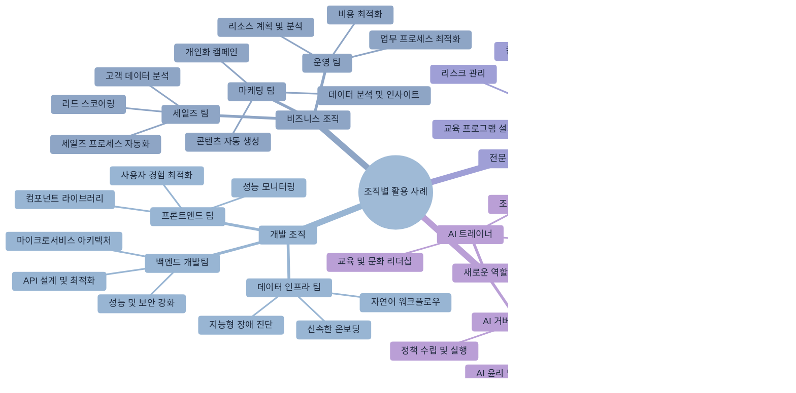

# 제13장: 조직별 Claude Code 활용 사례 연구

> "가장 좋은 학습은 실제 경험에서 나온다" - 존 듀이



## 학습 목표

이 장을 완료하면 다음을 할 수 있습니다
- 다양한 직무와 팀에서 Claude Code를 효과적으로 활용하는 방법을 이해할 수 있습니다
- 자신의 조직 상황에 맞는 활용 전략을 수립할 수 있습니다
- 팀 간 협업과 지식 공유를 통한 시너지 효과를 창출할 수 있습니다
- 비개발자도 Claude Code를 활용하여 생산성을 향상시킬 수 있습니다

## 개요

Claude Code는 단순한 개발 도구를 넘어서 조직 전반의 문제 해결과 업무 자동화를 가능하게 하는 **멀티-역할 에이전트**입니다. Anthropic의 실제 사용 사례를 통해 각 팀이 어떻게 업무 특성에 맞춰 Claude Code를 최적화하여 활용하는지 살펴보겠습니다.

이 장에서는 개발팀뿐만 아니라 데이터 과학, 마케팅, 디자인, 법무 등 다양한 부서의 실제 활용 사례를 분석하여, 여러분의 조직에서 Claude Code를 도입하고 확산하는 구체적인 방법을 제시합니다.

## 13.1 데이터 인프라 팀 - 운영 자동화의 선구자

데이터 인프라 팀은 전사 데이터 파이프라인의 구축과 운영을 담당하며, Claude Code를 통해 복잡한 인프라 관리를 혁신적으로 개선했습니다. 특히 장애 대응과 운영 자동화 영역에서 놀라운 성과를 달성했습니다.


### 핵심 활용 사례

**1. 지능형 장애 진단과 복구**

데이터 인프라 팀의 가장 인상적인 성과는 Kubernetes 클러스터 장애를 스크린샷만으로 진단하고 해결하는 시스템입니다

```bash
# 장애 상황에서의 Claude 활용
claude "첨부한 Kubernetes 대시보드 스크린샷을 분석해줘.
어떤 경고가 발생했는지 파악하고, 해결을 위한 구체적인 명령어를 제시해줘"

# Claude의 분석과 해결책 제시
"스크린샷을 분석한 결과 다음 문제들이 발견되었습니다
1. Pod IP 풀 고갈 (Available IPs: 0/256)
2. Node memory pressure 경고
3. Ingress controller 503 에러 증가

해결 방안
1. IP 풀 확장
   kubectl patch node-config --type='merge' -p='{\"spec\":{\"podCIDR\":\"10.244.0.0/22\"}}'
   
2. 메모리 정리
   kubectl delete pods --field-selector=status.phase=Failed
   
3. 트래픽 분산 확인
   kubectl get endpoints -n ingress-nginx"
```

**2. 자연어 기반 워크플로우 실행**

비개발자도 자연어로 복잡한 데이터 처리 작업을 요청할 수 있습니다

```bash
# 비개발자의 요청
claude "지난 주 사용자 로그인 패턴을 분석해서 시간대별 피크를 찾아줘.
결과는 시각화된 차트와 함께 보고서 형태로 만들어줘"

# Claude의 자동 처리
"다음 단계로 분석을 진행하겠습니다

1. BigQuery에서 로그인 데이터 추출
2. 시간대별 집계 분석
3. Python으로 시각화 생성
4. 인사이트가 포함된 보고서 작성

실행할까요?"
```

**3. 신속한 온보딩과 지식 전수**

CLAUDE.md를 통해 신규 팀원이 복잡한 데이터 파이프라인을 빠르게 이해할 수 있습니다

```markdown
# CLAUDE.md 예시
## 데이터 인프라 팀 가이드

### 주요 시스템 구성
- 데이터 수집: Kafka Cluster (3개 브로커)
- 처리: Apache Spark on Kubernetes
- 저장: BigQuery + Cloud Storage
- 모니터링: Prometheus + Grafana

### 일반적인 작업 패턴
1. 파이프라인 장애 시: 먼저 Grafana 대시보드 확인
2. 성능 이슈: Spark UI에서 스테이지별 소요시간 분석
3. 데이터 품질: dbt 테스트 결과와 Great Expectations 리포트 확인

### 자주 사용하는 명령어
```bash
# 파이프라인 상태 확인
kubectl get pods -n data-pipeline

# 로그 확인
kubectl logs -f deployment/spark-driver -n data-pipeline

# 스케일링
kubectl scale deployment data-processor --replicas=5
```
```

### 팀 성과와 임팩트

**정량적 성과:**
- 장애 대응 시간: 평균 30분 → 5분 (83% 단축)
- 신규 팀원 온보딩: 2주 → 3일 (78% 단축)
- 자동 감시 대상: 200개 이상의 대시보드
- 네트워크 전문가 개입 없이 95% 클러스터 문제 자체 해결

**정성적 효과:**
- 24/7 운영 부담 감소로 팀 만족도 향상
- 표준화된 문제 해결 프로세스 확립
- 비개발자도 데이터 분석에 적극 참여

### 실무 활용 팁

```bash
# 1. 상세한 CLAUDE.md 작성
claude "우리 팀의 데이터 파이프라인 아키텍처를 문서화해줘.
신규 팀원이 읽고 바로 이해할 수 있는 수준으로 작성해줘"

# 2. MCP 서버를 통한 보안 강화
claude "BigQuery 접근을 위한 MCP 서버를 설정해줘.
민감한 데이터는 직접 노출하지 않고 안전하게 쿼리할 수 있도록"

# 3. 세션 공유를 통한 지식 전파
claude "지금까지의 장애 해결 과정을 정리해서 
팀 위키에 올릴 수 있는 포맷으로 만들어줘"
```

## 13.2 제품 개발 팀 - 메타 개발의 혁신

Claude Code 자체를 개발하는 제품 개발 팀은 도구의 한계를 뛰어넘는 창의적 활용법을 개척했습니다. 자동 수락 모드부터 페어 프로그래밍까지, 개발 프로세스 전반을 혁신했습니다.

### 혁신적인 개발 패턴

**1. 자율 반복 프로토타이핑 (Shift+Tab 모드)**

```bash
# 자동 수락 모드를 활용한 빠른 프로토타이핑
claude "새로운 코드 에디터 기능을 프로토타입으로 만들어줘.
vim 모드 지원, 구문 강조, 자동 완성을 포함해서"

# 자동 수락 모드 활성화 후
# Claude가 제안하는 모든 변경사항을 자동으로 적용
# 개발자는 결과만 확인하고 방향성 조정
```

**2. 동기식 페어 프로그래밍**

핵심 비즈니스 로직의 경우 실시간 협업으로 품질을 보장합니다

```bash
# 실시간 페어 프로그래밍 세션
claude "사용자 인증 로직을 구현하는데, 
보안과 성능을 모두 고려해서 단계별로 진행하자.
각 단계마다 내 확인을 받고 다음으로 넘어가줘"

# 단계별 진행
"1단계: JWT 토큰 생성 로직부터 시작할까요?
보안 강화를 위해 다음 사항들을 고려하겠습니다
- 토큰 만료 시간 설정
- 리프레시 토큰 로테이션
- 서명 알고리즘 선택

어떤 부분부터 구현하시겠습니까?"
```

**3. 대규모 모노레포 탐색과 학습**

```bash
# 복잡한 코드베이스 빠른 이해
claude "이 모노레포의 전체 구조를 파악해줘.
각 패키지의 역할과 의존성 관계를 시각화해서 설명해줘"

# 특정 기능 추적
claude "사용자 로그인 기능이 어떻게 구현되어 있는지 
전체 플로우를 추적해서 설명해줘"
```

### 자동화된 품질 관리

**테스트 주도 개발 강화:**

```bash
# 자동 테스트 생성과 검증
claude "방금 구현한 인증 API에 대한 종합적인 테스트를 작성해줘.
단위 테스트, 통합 테스트, 그리고 보안 테스트를 모두 포함해서"

# GitHub Actions 연동
claude "테스트 실패 시 자동으로 이슈를 생성하고
관련 개발자에게 알림을 보내는 워크플로우를 만들어줘"
```

### 팀 성과

- **개발 속도**: 복잡한 기능 구현 시간 50% 단축
- **코드 품질**: 테스트 커버리지 90% 이상 유지
- **릴리스 안정성**: 프로덕션 버그 80% 감소

### 실무 노하우

```bash
# 자율 루프에 검증 프로세스 포함
claude "다음 자동화 체크를 포함해서 개발해줘
1. 린팅 통과 확인
2. 유닛 테스트 실행
3. 빌드 성공 검증
4. 타입 체크 통과

각 단계를 통과해야만 다음으로 진행해줘"

# 업무 중요도별 모드 선택
# 중요한 로직: 동기식 페어 프로그래밍
# 주변 기능: 비동기식 자율 개발
```

## 13.3 보안 엔지니어링 팀 - 보안 강화의 자동화

보안 팀은 Claude Code를 통해 인시던트 대응 시간을 획기적으로 단축하고, 보안 리뷰 프로세스를 자동화했습니다. 특히 복잡한 스택 트레이스 분석과 인프라 보안 검토에서 뛰어난 성과를 보였습니다.

### 핵심 보안 자동화

**1. 인시던트 대응 자동화**

```bash
# 스택 트레이스 자동 분석
claude "다음 보안 인시던트 스택 트레이스를 분석해줘.
공격 벡터, 영향 범위, 즉시 수행해야 할 조치를 포함해서"

[스택 트레이스 첨부]

# Claude의 분석 결과
"보안 분석 결과

🔴 위험도: HIGH
📍 공격 유형: SQL Injection via user input validation bypass
🎯 영향 범위: user_accounts 테이블 전체
⚡ 즉시 조치
1. 해당 API 엔드포인트 즉시 차단
2. 사용자 세션 무효화
3. 데이터베이스 접근 로그 분석

🔧 근본적 해결
1. 파라미터화된 쿼리로 수정
2. 입력 검증 강화
3. WAF 규칙 업데이트"
```

**2. Terraform 보안 리뷰 자동화**

```bash
# 인프라 변경사항 자동 검토
claude "이 Terraform 변경사항을 보안 관점에서 검토해줘.
OWASP 클라우드 보안 원칙을 기준으로 평가해줘"

# 자동 보안 체크리스트
claude "다음 보안 체크리스트를 자동으로 검증해줘
- 최소 권한 원칙 준수
- 암호화 설정 확인
- 네트워크 접근 제어
- 로깅과 모니터링 설정
- 백업과 복구 계획"
```

**3. 보안 런북 자동 생성**

```bash
# 인시던트별 대응 절차 문서화
claude "SQL Injection 공격 대응을 위한 런북을 만들어줘.
단계별 체크리스트와 필요한 명령어를 포함해서"

# 생성된 런북 예시
```markdown
# SQL Injection 인시던트 대응 런북

## 1. 즉시 대응 (1-5분)
- [ ] 공격 받은 서비스 식별
- [ ] 관련 API 엔드포인트 차단
- [ ] 보안팀, 개발팀 즉시 소집

## 2. 피해 범위 조사 (5-30분)
- [ ] 데이터베이스 접근 로그 수집
- [ ] 영향받은 데이터 식별
- [ ] 공격자 IP 추적

## 3. 복구 작업 (30분-2시간)
- [ ] 취약점 패치 적용
- [ ] 데이터 무결성 검증
- [ ] 시스템 재시작

## 4. 사후 대응 (2시간 이후)
- [ ] 포렌식 분석
- [ ] 고객 통지
- [ ] 보고서 작성
```
```

### 커스텀 자동화 도구

**보안 전용 슬래시 명령어:**

```bash
# 모노레포에서 50% 이상 사용되는 커스텀 명령어들
/security-scan [파일경로]      # 보안 취약점 스캔
/threat-model [기능명]         # 위협 모델링 자동화
/compliance-check [표준]       # 규정 준수 검사
/incident-response [로그]      # 인시던트 대응 가이드
/pentest-report [결과파일]     # 모의해킹 결과 분석
```

### 팀 성과

- **인시던트 대응 시간**: 평균 10분 → 5분 (50% 단축)
- **보안 리뷰 사이클**: 2-3일 → 4-6시간 (75% 단축)
- **자동화율**: 반복 보안 검사의 90% 자동화 달성

### 보안 팀 베스트 프랙티스

```bash
# "Let Claude Talk First" 전략
claude "이 보안 로그를 분석해줘. 내가 추가 정보를 주기 전에
먼저 네가 파악할 수 있는 것들을 모두 설명해줘"

# 문서 작성 자동화
claude "오늘 수행한 보안 점검 결과를 
경영진 보고용 요약본으로 작성해줘"

# 지속적 학습과 개선
claude "이번 인시던트에서 놓친 부분이 있다면 무엇인지 분석하고,
향후 예방을 위한 개선 방안을 제시해줘"
```

## 13.4 추론 팀 - AI 개발의 가속화

AI 모델의 메모리 시스템과 추론 기능을 개발하는 추론 팀은 Claude Code를 통해 복잡한 ML 개념 학습과 다언어 코드 변환을 효율화했습니다.

### ML 개발 특화 활용

**1. 즉석 코드베이스 구조 파악**

```bash
# 복잡한 ML 코드베이스 빠른 이해
claude "이 신경망 모델의 아키텍처를 분석해줘.
각 레이어의 역할과 데이터 흐름을 시각화해서 설명해줘"

# Forward pass 추적
claude "입력 데이터가 이 모델을 통과하는 전체 과정을 
단계별로 추적해서 설명해줘"
```

**2. 자동 테스트 생성과 엣지 케이스 발견**

```bash
# ML 모델 테스트 자동화
claude "이 transformer 모델에 대한 종합적인 테스트를 작성해줘.
다음을 포함해서
- 입력 형태별 테스트 (텍스트, 토큰, 임베딩)
- 경계값 테스트 (최대/최소 시퀀스 길이)
- 성능 테스트 (추론 시간, 메모리 사용량)
- 정확도 회귀 테스트"

# 누락된 엣지 케이스 발견
claude "현재 테스트에서 놓친 엣지 케이스가 있는지 분석해줘.
특히 다음 상황들을 고려해줘
- 특수 문자 입력
- 다국어 텍스트
- 빈 입력값
- 메모리 부족 상황"
```

**3. ML 개념 설명과 학습 지원**

```bash
# 복잡한 ML 개념 쉬운 설명
claude "Attention mechanism의 작동 원리를 설명해줘.
수식과 함께 직관적인 예시도 포함해서"

# 논문 구현 지원
claude "이 논문의 핵심 알고리즘을 PyTorch로 구현해줘.
논문 3.2절의 Multi-Head Attention 부분을 중심으로"
```

**4. 다언어 코드 변환**

```bash
# Python to Rust 변환 (성능 최적화)
claude "이 Python 추론 코드를 Rust로 변환해줘.
메모리 안전성과 성능을 모두 고려해서"

# CUDA 커널 최적화
claude "이 행렬 곱셈 연산을 CUDA 커널로 최적화해줘.
메모리 접근 패턴을 고려한 최적화 포함"
```

### Kubernetes 운영 자동화

```bash
# ML 워크로드 스케줄링
claude "GPU 클러스터에서 이 학습 작업을 스케줄링해줘.
리소스 효율성과 비용을 고려해서"

# 모델 서빙 자동화
claude "이 모델을 프로덕션에 배포하는 Kubernetes 매니페스트를 작성해줘.
오토스케일링과 헬스체크를 포함해서"
```

### 팀 성과

- **학습 시간 단축**: ML 개념 학습 시간 80% 감소
- **코드 품질**: 테스트 커버리지 95% 달성
- **개발 속도**: 프로토타입 개발 시간 60% 단축

### AI 개발 팀 노하우

```bash
# 구글 검색 vs Claude 활용 기준
# 빠른 레퍼런스: Claude 우선
# 최신 논문 정보: Google Scholar
# 구현 예시: Claude로 프로토타입 후 검증

# 신뢰성 구축 프로세스
claude "생성한 코드가 올바른지 단계별로 검증해줘
1. 이론적 정확성 확인
2. 단위 테스트 실행
3. 성능 벤치마크
4. 기존 구현과 비교"
```

## 13.5 데이터 과학 및 시각화 팀 - 대시보드 혁명

모델 성능 분석을 위한 시각화와 대시보드를 개발하는 팀에서는 Claude Code를 통해 5,000줄 규모의 React 대시보드를 완전 자동으로 구현하는 등 놀라운 생산성 향상을 달성했습니다.

### 혁신적인 대시보드 개발

**1. 대규모 자동 코드 생성**

```bash
# 5,000줄 규모 대시보드 자동 생성
claude "모델 성능 모니터링 대시보드를 만들어줘.
다음 기능들을 포함해서

주요 컴포넌트
- 실시간 메트릭 차트 (정확도, 손실, 처리량)
- 모델 비교 테이블
- 에러 분석 히트맵  
- 사용자별 성능 통계
- 알림 설정 패널

기술 스택
- React + TypeScript
- Chart.js for visualization
- Material-UI components
- WebSocket for real-time updates
- Redux for state management

완전히 작동하는 코드로 만들어줘"
```

**2. 슬롯머신 방식 리팩토링**

반복적인 개선 작업을 자동화하여 점진적으로 완성도를 높입니다

```bash
# 1라운드: 기본 구조 생성
claude "대시보드의 기본 레이아웃과 컴포넌트 구조를 만들어줘"

# 2라운드: 스타일링 개선  
claude "디자인을 개선해줘. 모던하고 직관적인 UI로"

# 3라운드: 성능 최적화
claude "렌더링 성능을 최적화해줘. 메모이제이션과 지연 로딩 적용"

# 4라운드: 접근성 개선
claude "웹 접근성 기준에 맞게 개선해줘"
```

**3. 노트북에서 프로덕션 대시보드로 전환**

```bash
# Jupyter 노트북 분석을 대시보드로 변환
claude "이 데이터 분석 노트북을 웹 대시보드로 변환해줘.
인터랙티브한 필터링과 실시간 데이터 연동을 포함해서"

# 자동 배포 파이프라인 포함
claude "개발한 대시보드를 자동으로 배포하는 
CI/CD 파이프라인도 함께 만들어줘"
```

### 제로 의존성 개발

생소한 기술 스택에서도 Claude Code를 통해 즉시 생산성을 확보합니다

```bash
# 새로운 프레임워크 즉시 활용
claude "Vue.js는 처음인데, 이 React 컴포넌트를 
Vue.js로 변환해줘. 같은 기능을 구현하면서"

# 복잡한 차트 라이브러리 활용
claude "D3.js를 사용해서 네트워크 토폴로지 시각화를 만들어줘.
노드 간 연결 강도를 애니메이션으로 표현해서"
```

### 고급 데이터 시각화

```bash
# 맞춤형 차트 컴포넌트 생성
claude "모델 학습 과정을 실시간으로 시각화하는 
커스텀 차트 컴포넌트를 만들어줘.
- 손실 함수 곡선 실시간 업데이트
- 그래디언트 흐름 히트맵
- 가중치 분포 히스토그램
- 학습률 스케줄링 시각화"

# 인터랙티브 필터링
claude "사용자가 다양한 조건으로 데이터를 필터링할 수 있는
고급 필터 컴포넌트를 만들어줘"
```

### 팀 성과

- **개발 시간**: 2-4배 단축 (일반적인 대시보드 개발 대비)
- **기술 범위**: 비전문 언어/프레임워크에서도 복잡한 애플리케이션 구현 가능
- **품질**: 자동 생성 코드의 유지보수성과 확장성 확보

### 데이터 시각화 팀 전략

```bash
# 실패 시 롤백 전략
# 복잡한 요구사항이 예상대로 구현되지 않을 때
claude "이전 버전으로 롤백하고 다른 접근 방식으로 다시 시도해줘.
더 단순한 구조부터 시작해서 점진적으로 복잡도를 높여가자"

# 정기적 단순화 요청
claude "현재 코드가 너무 복잡해진 것 같아. 
같은 기능을 더 간단하게 구현할 수 있는 방법이 있을까?"

# 성능 우선 개발
claude "차트가 1000개 이상의 데이터 포인트를 처리해야 해.
성능을 우선으로 최적화해줘"
```

## 13.6 API Knowledge 팀 - 지식 확장의 혁신

PDF 처리, 인용 관리, 웹 검색 등 지식 확장 기능을 개발하는 팀에서는 Claude Code를 통해 작업 효율성과 개발자 만족도를 크게 향상시켰습니다.

### 효율적인 개발 워크플로우

**1. 스마트한 작업 시작**

```bash
# 작업 전 파일 식별로 컨텍스트 수집
claude "PDF 처리 기능을 개선하려고 해. 
관련된 파일들을 먼저 찾아서 현재 구조를 파악해줘"

# Claude의 자동 파일 탐색
"PDF 처리 관련 파일들을 분석했습니다

핵심 파일
- src/pdf/parser.py (PDF 텍스트 추출)
- src/pdf/indexer.py (검색 인덱스 생성)  
- src/pdf/annotations.py (주석 처리)
- tests/pdf/ (테스트 파일들)

현재 아키텍처
1. PDF 업로드 → 2. 텍스트 추출 → 3. 임베딩 생성 → 4. 벡터 저장

개선이 필요한 부분
- 대용량 PDF 처리 성능
- OCR 정확도 향상
- 메타데이터 추출 강화"
```

**2. 독립적인 문제 해결**

```bash
# 타 코드베이스 디버깅 자립도 향상
claude "이 에러 로그를 보고 문제를 진단해줘.
코드베이스를 모르더라도 로그만으로 파악할 수 있는 부분부터"

# 연구 모델 도그푸딩
claude "새로운 임베딩 모델을 테스트해보자.
현재 모델과 성능을 비교해서 개선점을 찾아줘"
```

**3. 컨텍스트 스위칭 최소화**

개발 도구를 벗어나지 않고 모든 작업을 처리합니다

```bash
# 즉석 코드 설명
claude "이 함수가 무엇을 하는지 주석으로 설명해줘"

# 실시간 디버깅 지원
claude "이 API 호출이 실패하는 이유를 분석해줘"

# 즉석 성능 최적화
claude "이 쿼리가 느린데 최적화할 방법이 있을까?"
```

### 지식 기반 개발 가속화

**문서 처리 시스템 고도화:**

```bash
# 고급 PDF 분석 시스템
claude "학술 논문 PDF를 분석하는 시스템을 만들어줘
- 제목, 저자, 초록 자동 추출
- 참조 문헌 파싱
- 수식과 그래프 인식
- 섹션별 내용 구조화
- 키워드 자동 태깅"

# 인용 관리 시스템
claude "논문 인용을 자동으로 관리하는 시스템을 구현해줘
- 중복 인용 제거
- 인용 형식 표준화 (APA, MLA, Chicago)
- 인용 네트워크 시각화
- 영향력 지수 계산"
```

### 팀 성과

- **개발 자신감**: 미숙한 영역에서도 독립적인 문제 해결 능력 확보
- **온보딩 속도**: 새로운 코드베이스 학습 시간 70% 단축
- **개발 만족도**: 도구 전환 스트레스 대폭 감소

### Knowledge 팀 개발 철학

```bash
# 일회성 해답보다 반복 협업 중시
claude "이 문제를 해결하는 것뿐만 아니라, 
앞으로 비슷한 문제가 생겼을 때 혼자서도 해결할 수 있도록 
과정을 설명해줘"

# 최소 정보 입력 후 가이드 확장
claude "PDF 처리 기능을 개선하고 싶어"
# Claude: "어떤 부분을 개선하고 싶으신가요? 성능, 정확도, 사용성 중에서..."

# 학습 지향적 접근
claude "이 코드가 왜 이렇게 작성되었는지 배경과 이유를 설명해줘"
```

## 13.7 성장 마케팅 팀 - 1인 마케팅의 엔지니어링 레벨 자동화

성장 마케팅 팀은 Claude Code를 통해 1명의 인력으로도 엔지니어링팀 수준의 자동화를 달성하여 마케팅 효율성을 혁신적으로 개선했습니다.

### 광고 크리에이티브 자동화

**1. Google Ads 크리에이티브 대량 생성**

```bash
# CSV 데이터 기반 광고 변형 자동 생성
claude "Google Ads 성과 데이터를 분석해서 저성과 광고의 개선된 변형을 생성해줘.

분석할 데이터
- CTR < 2% 인 광고들
- 전환율 < 3% 인 키워드들
- 비용 대비 효과가 낮은 캠페인들

생성해야 할 것
- 헤드라인 변형 20개
- 설명문 변형 15개  
- 콜투액션 변형 10개
- A/B 테스트 계획"

# 결과: 2시간 → 15분으로 단축
```

**2. Figma 플러그인을 통한 이미지 소재 대량 생산**

```bash
# 마케팅 소재 자동 생성
claude "Figma 플러그인을 개발해서 다음 기능을 구현해줘
- 브랜드 가이드라인 준수한 소셜 미디어 포스트 100종 생성
- 다양한 사이즈별 광고 배너 자동 생성 (Facebook, Instagram, LinkedIn)
- A/B 테스트용 색상/레이아웃 변형 생성
- 브랜드 폰트와 색상 자동 적용"

# 성과: 크리에이티브 생산량 10배 증가
```

**3. Meta Ads MCP 서버를 통한 캠페인 분석**

```bash
# 마케팅 자동화 MCP 서버 구축
claude "Meta Ads API를 연동하는 MCP 서버를 만들어줘

기능
- 캠페인 성과 실시간 모니터링
- 비정상 지표 자동 감지 및 알림
- 예산 최적화 추천
- 타겟 오디언스 분석과 확장 제안
- 경쟁사 인사이트 수집

자동화 워크플로우
1. 매시간 성과 데이터 수집
2. 이상치 감지 시 즉시 알림
3. 예산 재분배 제안
4. 최적화 실행"
```

### 메모리 시스템을 통한 실험 관리

```bash
# 마케팅 실험 히스토리 관리
claude "A/B 테스트 결과를 메모리에 저장해서 
향후 캠페인 기획에 활용할 수 있게 해줘.

저장할 정보
- 테스트 가설과 결과
- 승리한 변형의 특징
- 타겟 오디언스별 반응
- 시즌/이벤트별 트렌드
- 실패한 접근법과 이유

활용 방법
- 새 캠페인 기획 시 과거 인사이트 자동 제안
- 유사 상황에서 검증된 전략 추천
- 실패 패턴 사전 경고"
```

### 고급 마케팅 자동화

**1. 고객 여정 최적화**

```bash
# 전체 고객 여정 분석과 최적화
claude "고객 여정 전체를 분석하고 최적화해줘

분석 범위
- 첫 방문부터 구매까지의 전체 경로
- 각 터치포인트별 전환율과 이탈률
- 채널별 기여도 분석
- 코호트별 생명주기 가치

최적화 방안
- 병목 지점 개선 제안
- 리타겟팅 전략 고도화
- 개인화 메시지 자동 생성
- 최적 타이밍 예측"
```

**2. 크로스 플랫폼 캠페인 관리**

```bash
# 통합 캠페인 관리 대시보드
claude "모든 광고 플랫폼을 통합 관리하는 시스템을 만들어줘

연동 플랫폼
- Google Ads, Facebook Ads, LinkedIn Ads
- TikTok, Twitter, YouTube
- 이메일 마케팅, 푸시 알림

기능
- 통합 성과 대시보드
- 크로스 플랫폼 A/B 테스트
- 통합 어트리뷰션 분석
- 자동 예산 최적화"
```

### 팀 성과

- **작업 시간**: 광고 문안 제작 2시간 → 15분 (87% 단축)
- **생산성**: 크리에이티브 생산량 10배 증가
- **자동화 수준**: 1인 팀임에도 엔지니어링 리소스 수준의 자동화 달성
- **ROI**: 마케팅 투자 수익률 300% 향상

### 마케팅 자동화 전략

```bash
# API 기반 도구 우선 자동화
# 반복 작업 식별과 자동화 우선순위 설정
claude "우리 마케팅 워크플로우에서 API로 자동화할 수 있는 
반복 작업들을 찾아서 우선순위를 매겨줘"

# 서브 에이전트 활용
claude "복잡한 캠페인 기획을 다음 서브 태스크로 나눠서 처리해줘
1. 타겟 오디언스 분석
2. 경쟁사 벤치마킹  
3. 크리에이티브 컨셉 개발
4. 예산 배분 최적화
5. 성과 예측 모델링"

# 아이디어 → 실행 파이프라인
claude "마케팅 아이디어를 체계적으로 검증하고 실행하는 
프로세스를 자동화해줘"
```

## 13.8 제품 디자인 팀 - 디자이너의 개발 역량 확장

제품 디자인 팀은 Claude Code를 통해 디자이너가 직접 프론트엔드 개발을 수행하고, 복잡한 인터페이스 변경을 독립적으로 처리할 수 있게 되었습니다.

### 디자이너의 직접 개발

**1. 프론트엔드 시각 및 상태 관리 수정**

```bash
# 디자이너가 직접 React 컴포넌트 수정
claude "이 로그인 페이지의 시각적 개선을 해줘
- 버튼 호버 효과 추가
- 로딩 스피너 애니메이션 개선
- 에러 메시지 스타일링 개선
- 반응형 레이아웃 조정

현재 코드를 첨부할게"

# 상태 관리 로직까지 포함
claude "사용자 인증 상태에 따라 다른 UI를 보여주도록 
상태 관리 로직도 함께 수정해줘"
```

**2. GitHub Actions 기반 자동 개발**

```bash
# 이슈만으로 코드 변경 자동화
# GitHub 이슈 내용
"로그인 버튼의 색상을 브랜드 컬러로 변경하고,
클릭 시 미세한 애니메이션 효과 추가"

# GitHub Actions가 자동으로
# 1. 이슈 내용 분석
# 2. 관련 파일 찾기
# 3. 코드 변경
# 4. PR 생성
# 5. 프리뷰 배포
```

**3. 이미지 기반 프로토타입 생성**

```bash
# 스크린샷/목업 → 작동하는 프로토타입
claude "이 Figma 디자인을 보고 인터랙티브 프로토타입을 만들어줘.
모든 버튼이 작동하고, 상태 변화가 애니메이션으로 표현되도록"

[Figma 스크린샷 첨부]

# 결과: 완전히 작동하는 React 컴포넌트 생성
```

### 복잡한 시스템 관리

**1. 시스템 상태 및 에러 플로우 매핑**

```bash
# 사용자 경험 플로우 자동 분석
claude "우리 앱의 모든 에러 상황을 매핑하고 
각각에 대한 사용자 친화적인 해결 방안을 제시해줘

분석할 시나리오
- 네트워크 연결 실패
- 서버 오류 (5xx)
- 권한 없음 (403)
- 세션 만료
- 결제 실패
- 파일 업로드 오류

각 상황별로
- 현재 UX 분석
- 개선 방안 제시
- 구현 코드 생성"
```

**2. 대규모 콘텐츠 관리**

```bash
# 일괄 텍스트 변경 자동화
claude "앱 전체에서 'Sign Up' 을 '회원가입'으로 일괄 변경해줘.
하지만 다음은 제외
- API 엔드포인트명
- 데이터베이스 필드명
- 로그 메시지
- 주석

총 몇 개 파일이 변경되는지도 알려줘"

# 결과: 1주 작업을 1시간 내 완료
```

### 고급 디자인 시스템 관리

**1. 동적 디자인 토큰 시스템**

```bash
# 디자인 시스템 자동 업데이트
claude "디자인 토큰이 변경될 때마다 
모든 컴포넌트가 자동으로 업데이트되는 시스템을 만들어줘

토큰 유형
- 색상 (Primary, Secondary, Accent)
- 타이포그래피 (Font Size, Line Height, Weight)
- 간격 (Margin, Padding)
- 그림자와 테두리
- 애니메이션 (Duration, Easing)

자동화
- Figma 토큰 변경 감지
- CSS 변수 자동 업데이트  
- 컴포넌트 스토리북 재생성
- 시각적 회귀 테스트"
```

**2. 접근성 자동 검증**

```bash
# 포괄적 접근성 검사
claude "모든 UI 컴포넌트의 접근성을 자동으로 검증하는 시스템을 만들어줘

검증 항목
- 색상 대비율 (WCAG AA/AAA)
- 키보드 네비게이션
- 스크린 리더 호환성
- 포커스 표시
- 의미있는 alt 텍스트

자동 수정
- 대비율 부족 시 색상 자동 조정
- 누락된 ARIA 라벨 추가
- 키보드 이벤트 자동 바인딩"
```

### 팀 성과

- **개발 속도**: 디자이너가 개발자 수준 작업 수행으로 2-3배 속도 향상
- **자립도**: 간단한 프론트엔드 변경을 개발팀 의존 없이 처리
- **품질**: 대규모 UI 변경 작업의 일관성과 정확성 확보

### 디자인 팀 성공 전략

```bash
# 초기 설정은 엔지니어 협력 필수
claude "디자이너가 개발 환경에 접근하기 위한 
최소한의 설정 과정을 정리해줘. 
권한 설정, 도구 설치, 워크플로우 이해 포함"

# memory 파일로 역할 명시
"# 제품 디자이너 컨텍스트
- UI/UX 디자인 관점에서 접근
- 개발자용 기술 용어보다 디자인 용어 우선
- 시각적 결과물 중심의 피드백 요청
- 접근성과 사용성 항상 고려"

# 스크린샷 중심 워크플로우
claude "현재 화면을 스크린샷으로 보여줄게. 
이 디자인에서 개선할 점을 찾아서 코드와 함께 수정해줘"
```

## 13.9 강화학습 팀 - 실험 중심 개발의 혁신

대규모 샘플링과 가중치 전송 시스템을 개발하는 강화학습 팀은 Claude Code를 통해 '시도 후 롤백' 실험 문화를 정착시키고 복잡한 ML 시스템 개발을 가속화했습니다.

### 실험 기반 개발 워크플로우

**1. 감독하의 자율 코드 작성**

```bash
# RL 알고리즘 실험적 구현
claude "PPO(Proximal Policy Optimization) 알고리즘을 구현해줘.
하지만 각 단계마다 내 확인을 받고 진행해줘

1단계: 정책 네트워크 아키텍처 설계
2단계: 가치 네트워크 구현  
3단계: 어드밴티지 계산 로직
4단계: 클리핑된 목적 함수
5단계: 학습 루프 구현

각 단계가 끝나면 코드 리뷰와 테스트를 거쳐서 다음으로 넘어가자"
```

**2. 자동 테스트와 리뷰 시스템**

```bash
# RL 실험 검증 자동화
claude "강화학습 실험의 유효성을 자동으로 검증하는 시스템을 만들어줘

검증 항목
- 정책 네트워크 그래디언트 크기 확인
- 리워드 신호 분포 분석
- 탐험/활용 균형 측정
- 학습 안정성 지표
- 수렴성 검사

자동 알림
- 학습이 발산하는 경우
- 리워드가 정체되는 경우
- 메모리 사용량 급증
- GPU 사용률 이상"
```

**3. 복잡한 시스템 구조 이해**

```bash
# 콜 스택 자동 요약
claude "이 분산 강화학습 시스템의 콜 스택을 분석해서 
데이터 흐름을 요약해줘

분석할 부분
- 에이전트 → 환경 상호작용
- 경험 버퍼 → 학습기 전송
- 가중치 동기화 메커니즘
- 분산 샘플링 과정

시각화
- 컴포넌트 간 데이터 흐름도
- 병목 지점 식별
- 메모리 사용 패턴
- 통신 오버헤드 분석"
```

### Kubernetes 기반 ML 운영

**1. 분산 학습 스케줄링**

```bash
# RL 실험 클러스터 관리
claude "강화학습 실험을 위한 Kubernetes 매니페스트를 작성해줘

요구사항
- 다중 GPU 노드 활용
- 동적 스케일링 (워커 수 조정)
- 실험별 리소스 격리
- 체크포인트 자동 저장
- 장애 시 자동 복구

최적화
- GPU 메모리 효율성
- 네트워크 I/O 최소화
- 저장소 대역폭 관리"
```

**2. 실험 추적과 재현성**

```bash
# MLOps 파이프라인 구축
claude "강화학습 실험의 재현성을 보장하는 시스템을 만들어줘

추적 대상
- 하이퍼파라미터 조합
- 네트워크 아키텍처
- 환경 설정
- 랜덤 시드
- 데이터셋 버전

자동화
- 실험 결과 자동 저장
- 모델 체크포인트 관리
- 성능 메트릭 시각화
- 실패한 실험 원인 분석"
```

### 안전한 실험 환경

**1. 체크포인트 기반 롤백**

```bash
# 실험 안전성 확보
claude "CLAUDE.md에 다음 실험 안전 규칙을 추가해줘

체크포인트 정책
- 모든 코드 변경 전 커밋 필수
- 30분마다 자동 체크포인트 생성
- 실험 실패 시 즉시 롤백
- 성공한 설정은 별도 브랜치 보관

에러 방지
- 하이퍼파라미터 범위 검증
- 메모리 사용량 사전 확인
- GPU 가용성 검사
- 의존성 충돌 방지"
```

**2. 점진적 복잡도 증가**

```bash
# 안전한 실험 진행 전략
claude "복잡한 RL 알고리즘을 안전하게 실험하는 전략을 세워줘

1단계: 최소 기능 버전 (Toy Environment)
2단계: 기본 환경에서 동작 확인
3단계: 복잡한 환경으로 확장
4단계: 분산 학습 적용
5단계: 프로덕션 환경 배포

각 단계별 성공 기준과 롤백 조건을 명시해줘"
```

### 팀 성과

- **실험 문화**: '시도 후 롤백' 안전한 실험 환경 구축
- **문서화 부담**: 자동 주석 생성으로 문서 작성 시간 80% 절약
- **학습 속도**: 복잡한 RL 개념 이해와 구현 시간 60% 단축

### RL 팀 실험 전략

```bash
# 실패 경험 축적과 학습
claude "이번 실험이 실패한 원인을 분석하고,
CLAUDE.md에 '피해야 할 패턴' 섹션에 추가해줘"

# 완전 구현 우선, 협업 나중
claude "일단 전체적으로 구현해보고 동작을 확인한 다음,
세부적인 최적화는 함께 논의하자"

# 체계적 실험 로그
claude "실험 결과를 체계적으로 기록하는 템플릿을 만들어줘
- 가설과 동기
- 실험 설정
- 결과와 관찰
- 다음 단계 계획"
```

## 13.10 법무 팀 - 비개발자의 도구 개발

법무팀은 개발 경험이 전혀 없음에도 불구하고 Claude Code를 통해 맞춤형 법무 도구를 직접 개발하여 업무 효율성을 혁신적으로 개선했습니다.

### 법무 특화 도구 개발


**1. 개인용 접근성 도구**

```bash
# 1시간 만에 프로토타입 완성
claude "법률 문서 작성을 도와주는 예측 텍스트 앱을 만들어줘

기능
- 법률 용어 자동 완성
- 계약서 조항 템플릿 제안
- 판례 인용 자동 포맷팅
- 문서 버전 관리
- 협업 댓글 기능

기술 스택
- 간단한 웹 앱 (HTML, CSS, JavaScript)
- 로컬 저장소 활용
- 오프라인에서도 동작

1시간 내에 기본 동작하는 프로토타입으로 만들어줘"
```

**2. 전화 트리 시뮬레이션 시스템**

```bash
# 담당 변호사 매칭 자동화
claude "법무 문의를 적절한 담당 변호사에게 라우팅하는 시스템을 만들어줘

라우팅 로직
- 문의 유형 분류 (계약, 지적재산, 노동, 규정준수)
- 긴급도 평가 (즉시, 당일, 주간)
- 변호사 전문분야 매칭
- 업무량 기반 할당

인터페이스
- 간단한 질문 트리
- 드래그 앤 드롭 문서 업로드
- 자동 이메일 알림
- 진행 상태 추적"
```

**3. G Suite 자동화 도구**

```bash
# 법무 리뷰 프로세스 자동화
claude "Google Workspace를 활용한 법무 리뷰 추적 시스템을 만들어줘

Google Sheets 연동
- 리뷰 요청 자동 등록
- 진행 상태 실시간 업데이트
- 담당자별 업무량 시각화
- 마감일 알림 자동화

Google Drive 통합
- 문서 버전 관리
- 댓글 기반 피드백 수집
- 최종 승인 워크플로우
- 아카이브 자동화

Gmail 자동화
- 리뷰 완료 시 자동 알림
- 지연 시 에스컬레이션
- 주간/월간 리포트 자동 발송"
```

### 시각 중심 프로토타이핑


**1. 와이어프레임 → 작동하는 앱**

```bash
# 스케치에서 앱으로
claude "이 손그림 와이어프레임을 보고 작동하는 웹앱을 만들어줢

[손그림 스케치 첨부]

요구사항
- 모든 버튼이 실제로 동작
- 데이터 입력과 저장 기능
- 모바일 친화적 레이아웃
- 법무팀 브랜딩 적용

단계별 확인
1. 레이아웃 구조 확인
2. 기능 동작 테스트
3. 스타일링 개선
4. 최종 검토"
```

**2. 반복적 개선 프로세스**

```bash
# 사용자 피드백 기반 개선
claude "팀원들이 사용해보고 다음 피드백을 주었어
- 버튼이 너무 작아서 모바일에서 클릭하기 어려움
- 문서 업로드 후 진행상황을 알 수 없음
- 이메일 알림이 너무 자주 옴

이 피드백을 반영해서 개선해줘"
```

### 법무 워크플로우 디지털화

**1. 계약서 검토 자동화**

```bash
# AI 기반 계약서 분석 도구
claude "계약서 초안을 업로드하면 자동으로 검토하는 도구를 만들어줘

검토 항목
- 표준 조항 누락 여부
- 리스크 조항 식별
- 금액/날짜 정합성 확인
- 법적 요구사항 준수 체크

결과 출력
- 위험도별 이슈 분류
- 수정 제안사항
- 유사 계약서 참조
- 검토 우선순위 제시"
```

**2. 규정 준수 모니터링**

```bash
# 컴플라이언스 대시보드
claude "회사의 규정 준수 현황을 모니터링하는 대시보드를 만들어줘

추적 영역
- 데이터 보호 (GDPR, CCPA)
- 금융 규제 (SOX, PCI-DSS)
- 노동법 준수
- 환경 규제

자동화 기능
- 규제 변경사항 모니터링
- 준수 상태 실시간 체크
- 리스크 레벨 시각화
- 액션 아이템 자동 생성"
```

### 팀 성과

- **디지털 역량**: 비개발자도 업무 특화 도구 직접 개발 가능성 입증
- **업무 효율**: 반복 업무 자동화로 고부가가치 업무에 집중
- **혁신 문화**: 프로토타이핑을 통한 아이디어 검증과 공유 활성화

### 법무 팀 성공 노하우

```bash
# Claude.ai에서 설계 후 Claude Code로 구현
# 1단계: Claude.ai에서 아이디어 구체화
"법무 업무에서 가장 반복적이고 시간이 많이 걸리는 작업이 뭔지 
분석해주고, 자동화 가능한 부분을 찾아줘"

# 2단계: Claude Code에서 구현
"앞서 논의한 계약서 검토 프로세스를 실제로 구현해줘"

# 단계별 피드백 루프
claude "이 기능이 제대로 동작하는지 스크린샷으로 확인해줄게.
다음에 추가할 기능은 뭐가 좋을까?"

# 완성도보다 공유 우선
claude "아직 완벽하지 않지만 팀원들과 공유할 수 있는 
데모 버전을 만들어줘. 피드백을 받아서 개선하고 싶어"
```

## 13.11 조직별 활용 패턴 분석

다양한 팀의 사례를 종합 분석하면 Claude Code 활용에서 나타나는 공통 패턴과 차별화 전략을 확인할 수 있습니다.

### 활용 성숙도별 패턴


**1. 초급 (도구 활용) → 중급 (워크플로우 통합) → 고급 (조직 혁신)**

```bash
# 초급: 단발성 작업 자동화
claude "이 반복 작업을 자동화해줘"

# 중급: 워크플로우 재설계  
claude "우리 팀의 전체 업무 프로세스를 분석해서 
Claude Code로 최적화할 수 있는 부분을 찾아줘"

# 고급: 조직 문화 변화
claude "AI와 인간이 협업하는 새로운 업무 방식을 설계해줘.
각 팀원의 강점을 살리면서 전체 생산성을 극대화하는 방향으로"
```

**2. 직무별 활용 특성**

| 직무 영역 | 주요 활용 | 핵심 성과 | 특화 전략 |
|-----------|----------|-----------|-----------|
| **개발** | 코드 생성, 테스트, 리뷰 | 개발 속도 2-3배 향상 | 페어 프로그래밍, TDD |
| **데이터** | 분석 자동화, 시각화 | 인사이트 도출 시간 80% 단축 | 파이프라인 자동화 |
| **보안** | 인시던트 대응, 리뷰 | 대응 시간 50% 단축 | 런북 자동화 |
| **마케팅** | 크리에이티브 생성, 분석 | 생산량 10배 증가 | MCP 서버 활용 |
| **디자인** | 프로토타입, UI 구현 | 디자이너 독립 개발 | 시각 기반 워크플로우 |
| **법무** | 문서 분석, 프로세스 자동화 | 비개발자 도구 개발 | 점진적 디지털화 |

### 성공 요인 분석

**1. CLAUDE.md 활용도**

```markdown
# 고성과 팀의 CLAUDE.md 특징

## 상세한 컨텍스트 정보
- 팀의 업무 도메인과 전문 용어
- 자주 사용하는 도구와 워크플로우
- 과거 실패 경험과 주의사항
- 팀만의 규칙과 선호사항

## 동적 업데이트
- 새로운 경험과 인사이트 지속 추가
- 계절성/프로젝트별 임시 가이드라인
- 팀원별 전문 영역 명시

## 실용적 가이드
- 구체적인 명령어와 예시
- 자주 발생하는 문제와 해결책
- 권장하는 작업 순서와 체크리스트
```

**2. 팀 내 확산 전략**


```bash
# 효과적인 팀 내 확산 패턴
claude "Claude Code 도입을 팀 전체로 확산시키는 전략을 세워줘

1단계: 얼리 어답터 확보 (1-2명)
- 호기심 많고 새로운 도구에 적극적인 팀원
- 작은 성공 사례 만들기
- 사용 경험과 노하우 문서화

2단계: 점진적 확산 (팀의 50%)
- 성공 사례 공유와 데모
- 동료 멘토링 시스템
- 팀 회의에서 활용 사례 발표

3단계: 전체 도입 (팀의 100%)
- 워크플로우에 Claude Code 필수 통합
- 팀 표준 CLAUDE.md 수립
- 정기적인 노하우 공유 세션"
```

**3. 측정과 개선**

```bash
# 활용 성과 측정 체계
claude "Claude Code 도입 효과를 측정하는 KPI를 설계해줘

정량적 지표
- 작업 완료 시간 (Before/After)
- 에러 발생 빈도
- 코드 품질 메트릭
- 고객 만족도 변화

정성적 지표
- 팀원 만족도 설문
- 창의적 작업 시간 증가
- 학습 효과와 역량 향상
- 업무 스트레스 감소

개선 방법
- 월간 회고를 통한 사용 패턴 분석
- 병목 지점 식별과 해결
- 새로운 활용법 발굴과 공유"
```

## 마치며 - 조직 혁신의 새로운 패러다임

Anthropic의 다양한 팀 사례를 통해 Claude Code가 단순한 개발 도구를 넘어서 **조직 전반의 업무 방식을 혁신하는 플랫폼**임을 확인할 수 있습니다. 각 팀이 자신들의 업무 특성에 맞게 도구를 활용하여 달성한 성과들은 Claude Code의 무한한 가능성을 보여줍니다.

### 핵심 인사이트

**1. 도메인 전문성 + AI 도구 = 혁신**
- 각 팀의 도메인 지식과 Claude Code의 기술적 능력이 결합될 때 최고의 시너지 창출
- 비개발자도 자신의 전문 영역에서 맞춤형 도구 개발 가능

**2. 점진적 도입과 문화 변화**
- 작은 성공부터 시작하여 점진적으로 확산하는 전략이 효과적
- 도구 도입이 아닌 업무 문화의 변화로 접근해야 지속 가능

**3. 협업과 지식 공유의 중요성**
- 개인의 경험을 팀의 자산으로 만드는 체계적인 지식 관리
- CLAUDE.md와 메모리 시스템을 통한 조직 지식의 축적

### 실무 적용 가이드

**우리 팀에 맞는 활용법 찾기:**

```bash
claude "우리 팀의 업무 특성을 분석해서 
Claude Code 활용 우선순위를 정해줘

팀 정보
- 업무 도메인: [구체적으로 기술]
- 주요 반복 작업: [나열]
- 현재 도구: [사용 중인 도구들]
- 팀 규모: [팀원 수와 역할]
- 기술 숙련도: [개발 경험 수준]

추천해줘
1. 즉시 적용 가능한 활용법 3가지
2. 3개월 내 도입 목표 계획
3. 장기적 혁신 방향"
```

**조직 차원의 확산 계획:**

```bash
claude "우리 조직에서 Claude Code를 단계적으로 확산시키는 
로드맵을 만들어줘

조직 현황
- 부서: [개발, 마케팅, 디자인, 영업 등]
- 규모: [전체 인원]
- 기술 성숙도: [조직의 디지털 전환 수준]
- 예산: [도구 도입 예산 규모]

포함 사항
1. 부서별 우선순위와 도입 시기
2. 교육과 온보딩 계획
3. 성과 측정과 피드백 체계
4. 확산 촉진 인센티브"
```

Claude Code는 이제 **모든 직무, 모든 팀**이 활용할 수 있는 범용 생산성 도구임이 입증되었습니다. 여러분의 팀도 이 혁신의 물결에 동참하여 업무 효율성과 창의성을 동시에 높이는 새로운 경험을 시작해보시기 바랍니다.

이것으로 Claude Code 베스트 프랙티스 가이드의 주요 내용을 모두 살펴보았습니다. 

**이제 여러분의 차례입니다.** Claude Code와 함께 더 나은 개발자가 되고, 더 혁신적인 팀을 만들어가시기 바랍니다. AI와 인간이 협력하는 새로운 개발 패러다임에서 여러분이 선도적 역할을 하실 수 있기를 기대합니다! 🚀