\newpage

# Claude Code 마스터하기
## AI 페어 프로그래밍의 혁명

**저자**: 황민호 (robin.hwang@kakaocorp.com)  
**출판일**: 2025년 6월  
**버전**: 1.0  

**© 2025 황민호 (robin.hwang@kakaocorp.com). All rights reserved.**  
**무단 배포 금지 - 개인 학습 및 연구 목적으로만 사용 가능**

---

\newpage


\newpage

# 서문

**© 2025 황민호 (robin.hwang@kakaocorp.com). All rights reserved.**  
**무단 배포 금지 - 개인 학습 및 연구 목적으로만 사용 가능**

---

## AI 시대의 개발 패러다임 변화

2025년, 우리는 소프트웨어 개발 역사상 가장 극적인 변화의 한가운데 서 있습니다. 

30년 전, 통합 개발 환경(IDE)의 등장이 개발자들의 생산성을 혁명적으로 향상시켰듯이, 오늘날 AI 페어 프로그래밍 도구들은 우리가 코드를 작성하고 문제를 해결하는 방식을 근본적으로 바꾸고 있습니다.

그중에서도 Claude Code는 단순한 코드 자동완성을 넘어, 진정한 의미의 'AI 동료'로서 개발자와 협업하는 새로운 패러다임을 제시합니다. 마치 경험 많은 시니어 개발자와 함께 일하는 것처럼, Claude Code는 여러분의 의도를 이해하고, 최적의 솔루션을 제안하며, 복잡한 작업을 함께 수행합니다.

## 이 책을 읽어야 할 사람

이 책은 다음과 같은 분들을 위해 쓰였습니다.

**초급 개발자라면**

- AI 도구를 활용해 빠르게 성장하고 싶은 분
- 복잡한 코드베이스를 효과적으로 탐색하는 방법을 배우고 싶은 분
- 시니어 개발자의 사고 과정을 학습하고 싶은 분

**중급 개발자라면**

- 반복적인 작업에서 벗어나 창의적인 문제 해결에 집중하고 싶은 분
- 개발 생산성을 획기적으로 높이고 싶은 분
- 새로운 기술 스택을 빠르게 습득하고 싶은 분

**시니어 개발자와 팀 리더라면**

- 팀의 개발 프로세스를 혁신하고 싶은 분
- 주니어 개발자들의 온보딩을 효과적으로 지원하고 싶은 분
- 복잡한 아키텍처 결정을 AI와 함께 검증하고 싶은 분

**기술 리더와 CTO라면**

- AI 시대의 개발 문화를 조직에 정착시키고 싶은 분
- 개발팀의 생산성과 코드 품질을 동시에 향상시키고 싶은 분
- 미래의 개발 환경을 준비하고 싶은 분

## 책의 구성과 활용법

이 책은 총 13개의 장으로 구성되어 있으며, 기초부터 고급 활용까지 단계적으로 학습할 수 있도록 설계되었습니다.

**기초 편 (1-3장)**

- 제1장: Claude Code란 무엇인가? - AI 페어 프로그래밍의 새로운 패러다임
- 제2장: 설치와 기본 설정 - 5분 만에 시작하기
- 제3장: 기본 사용법 마스터 - 프롬프트 엔지니어링의 기술

**프로젝트 최적화 (4-6장)**

- 제4장: CLAUDE.md로 프로젝트 맞춤 설정 - AI가 당신의 프로젝트를 이해하게 만들기
- 제5장: 프레임워크별 베스트 프랙티스 - React, Vue, Django, Spring 완벽 활용
- 제6장: 언어별 활용 전략 - TypeScript, Python, Java, Go, Rust 마스터하기

**고급 워크플로우 (7-9장)**

- 제7장: 효율적인 개발 워크플로우 - 생산성 10배 높이기
- 제8장: 멀티태스킹과 병렬 처리 - 여러 작업을 동시에 처리하는 기술
- 제9장: 자동화와 CI/CD 통합 - 반복 작업 제로 만들기

**실전 프로젝트 (10장)**

- 제10장: 웹 애플리케이션 구축 - 처음부터 배포까지 함께하기

**팀 협업과 조직 혁신 (11-13장)**

- 제11장: GitHub Actions와 Claude Code Action - PR 자동화의 마법
- 제12장: 팀에서 Claude Code 활용하기 - 함께 성장하는 개발 문화
- 제13장: 조직별 Claude Code 활용 사례 연구 - Anthropic 팀들의 실제 경험

### 이 책을 최대한 활용하는 방법

1. **실습 중심 학습**: 각 장의 예제를 직접 따라하며 학습하세요. Claude Code는 실제로 사용해봐야 그 가치를 알 수 있습니다.

2. **점진적 적용**: 현재 진행 중인 프로젝트에 하나씩 적용해보세요. 작은 성공 경험이 큰 변화로 이어집니다.

3. **커스터마이징**: 책의 내용을 그대로 따르기보다는, 여러분의 환경과 필요에 맞게 조정하세요.

4. **공유와 토론**: 팀원들과 경험을 공유하고, 더 나은 방법을 함께 찾아가세요.

## 함께 떠나는 여정

이 책은 단순한 도구 사용법을 넘어, AI와 함께 일하는 새로운 개발 문화를 만들어가는 여정입니다. 

Claude Code는 여러분의 코드를 대신 작성하는 도구가 아닙니다. 오히려 여러분이 더 나은 개발자가 되도록 돕는 동료입니다. 복잡한 문제를 함께 고민하고, 다양한 해결책을 제시하며, 때로는 여러분이 놓친 부분을 짚어주는 믿음직한 파트너입니다.

이제 AI와 함께하는 개발의 세계로 첫발을 내딛어 봅시다. 이 책이 여러분의 개발 인생에 새로운 장을 여는 계기가 되기를 바랍니다.

2025년 6월  
황민호

\newpage

# 제1장: Claude Code란 무엇인가?

> "The best way to predict the future is to invent it." - Alan Kay

이 장에서는 Claude Code가 무엇인지, 왜 중요한지 알아보겠습니다.

프로그래밍의 역사는 끊임없는 **추상화와 도구 발전**의 역사입니다. 기계어에서 어셈블리로, 고급 언어에서 프레임워크로, 그리고 이제 AI와 자연어로 대화하며 코드를 작성하는 새로운 시대에 도달했습니다.

Claude Code는 이런 발전의 연장선상에 있는 혁신적인 도구입니다. 기존 개발 방식의 한계를 극복하고, 더 효율적이고 생산적인 개발 환경을 제공합니다.

## 1.1 전통적인 개발 도구의 한계

### 현재 개발 환경의 도전 과제

먼저 Claude Code가 왜 필요한지 이해하기 위해, 현재 개발자들이 직면한 주요 어려움들을 살펴보겠습니다.

**1. 폭발적으로 증가하는 복잡성**

현대의 소프트웨어는 정말 복잡해졌습니다. 예를 들어
- 평범한 웹 애플리케이션도 100개 이상의 라이브러리에 의존합니다.
- 마이크로서비스 환경에서는 수십 개의 독립적인 서비스를 관리해야 합니다.
- 한 명의 개발자가 프론트엔드, 백엔드, 데이터베이스, DevOps까지 모두 알아야 하는 풀스택 시대입니다.

이런 복잡성 때문에 새로운 프로젝트를 시작할 때마다 어디서부터 시작해야 할지 막막함을 느끼는 개발자들이 많습니다.

**2. 끊임없이 변화하는 기술 스택**

기술 변화의 속도도 정말 빠릅니다.
- JavaScript 생태계에서는 매년 새로운 프레임워크가 등장합니다.
- AWS만 해도 200개가 넘는 서비스를 제공하고 있습니다.
- 각 프로그래밍 언어마다 고유한 철학과 생태계를 가지고 있어서 학습 부담이 큽니다.

빠르게 변화하는 기술 환경에서 지속적인 학습과 적응이 필요한 상황입니다.

**3. 반복적이고 지루한 작업들**

개발을 하다 보면 창의적인 부분보다는 반복적인 작업에 시간을 많이 쓰게 됩니다.
- 매번 똑같은 형태의 보일러플레이트 코드 작성
- 비슷비슷한 CRUD 기능들의 반복 구현
- 귀찮지만 꼭 필요한 문서화와 주석 작성
- 중요하지만 지루한 테스트 코드 작성

이런 작업들은 필요하지만, 개발자의 창의적인 에너지를 소모시키는 요인이 되고 있습니다.

### IDE의 진화와 한계

통합 개발 환경(IDE)은 지난 수십 년간 꾸준히 발전해왔습니다.

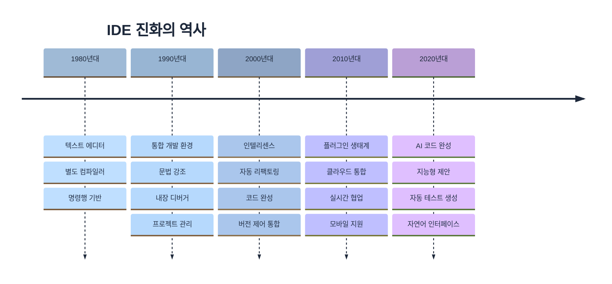

하지만 여전히 한계가 존재합니다.

1. **컨텍스트 이해 부족**: IDE는 코드의 문법은 이해하지만, 비즈니스 로직이나 의도는 파악하지 못합니다.

2. **수동적인 도구**: 개발자가 명시적으로 요청해야만 도움을 제공합니다.

3. **단편적인 지원**: 코드 작성, 테스트, 문서화, 배포 등이 분리되어 있습니다.

## 1.2 AI 페어 프로그래밍의 등장

### 페어 프로그래밍의 재정의

전통적인 페어 프로그래밍
- 두 명의 개발자가 하나의 컴퓨터 앞에 앉아 작업
- 한 명은 코드를 작성(Driver), 다른 한 명은 검토(Navigator)
- 지식 공유와 코드 품질 향상이 목적

AI 페어 프로그래밍
- 개발자와 AI가 대화하며 협업
- AI는 24시간 사용 가능한 시니어 개발자 역할
- 즉각적인 피드백과 다양한 관점 제공

### AI 개발 도구의 스펙트럼

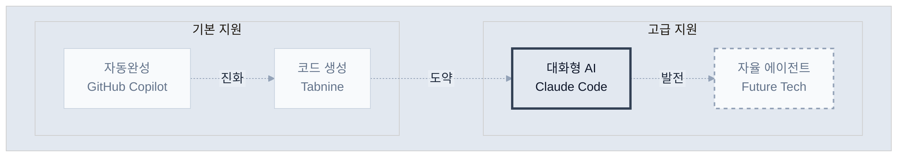

Claude Code는 '대화형 어시스턴트' 영역에서 가장 진보된 형태를 보여줍니다.

## 1.3 Claude Code의 핵심 철학

### 1. 유연성 (Flexibility)

Claude Code는 특정 워크플로우를 강제하지 않습니다.

```bash
# 다양한 접근 방식 모두 가능
claude "버그를 찾아서 수정해줘"
claude "TDD 방식으로 새 기능을 구현해줘"
claude "이 코드를 함수형 스타일로 리팩토링해줘"
claude "아키텍처를 분석하고 개선점을 제안해줘"
```

### 2. 투명성 (Transparency)

모든 작업 과정이 투명하게 공개됩니다.

```bash
# Claude Code의 작업 과정을 실시간으로 확인
> 파일 탐색 중: src/components/
> 코드 분석 중: UserProfile.jsx
> 수정 사항 적용 중...
> 테스트 실행 중...
```

### 3. 협업 (Collaboration)

AI는 도구가 아닌 동료입니다.

- 제안과 대안 제시
- 잠재적 문제 사전 경고
- 더 나은 해결책 토론
- 학습과 성장 지원

### 4. 맥락 이해 (Context Awareness)

전체 프로젝트 맥락을 이해합니다.

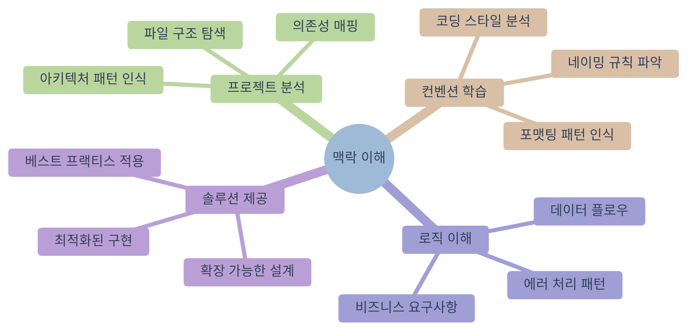

## 1.4 다른 AI 코딩 도구와의 차별점

### GitHub Copilot과의 비교

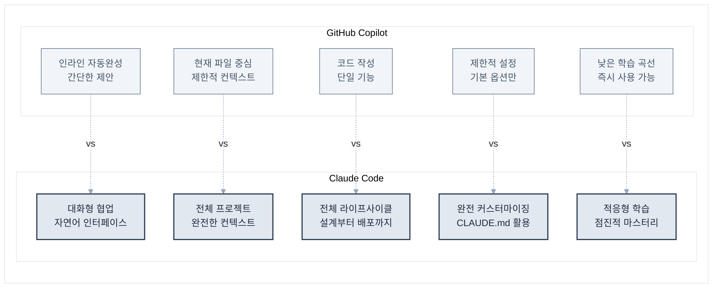

| 특징 | GitHub Copilot | Claude Code |
|------|----------------|-------------|
| 작동 방식 | 인라인 자동완성 | 대화형 상호작용 |
| 컨텍스트 | 현재 파일 중심 | 전체 프로젝트 |
| 작업 범위 | 코드 작성 | 설계, 구현, 테스트, 배포 |
| 커스터마이징 | 제한적 | 완전 커스터마이징 가능 |
| 학습 곡선 | 낮음 | 중간 |

### ChatGPT와의 비교

| 특징 | ChatGPT | Claude Code |
|------|---------|-------------|
| 파일 시스템 접근 | 불가능 | 완전한 접근 |
| 코드 실행 | 제한적 | 직접 실행 가능 |
| 지속성 | 대화별 리셋 | 프로젝트 컨텍스트 유지 |
| 도구 통합 | 없음 | Git, 테스트, 빌드 도구 등 |

### Claude Code만의 독특한 기능

**1. CLAUDE.md를 통한 프로젝트 맞춤화**
```markdown
# 우리 프로젝트의 규칙
- 모든 컴포넌트는 함수형으로 작성
- 테스트 커버리지 80% 이상 유지
- 커밋 메시지는 conventional commits 따르기
```

**2. 멀티모달 입력 지원**
- 디자인 스크린샷을 보고 UI 구현
- 다이어그램을 코드로 변환
- 에러 스크린샷으로 디버깅

**3. 진정한 풀스택 지원**
```bash
# 프론트엔드부터 배포까지 한 번에
claude "사용자 인증 기능을 만들어줘. React 프론트엔드, Node.js 백엔드, PostgreSQL 데이터베이스, Docker 컨테이너화까지"
```

## 실제 사례: 30분 만에 만든 실시간 채팅 앱

한 스타트업 개발자의 경험담

> "새로운 프로젝트를 시작해야 했는데, 실시간 채팅 기능이 핵심이었습니다. 
> 보통이라면 아키텍처 설계부터 시작해서 일주일은 걸렸을 텐데, 
> Claude Code와 함께 30분 만에 작동하는 프로토타입을 만들었습니다.
> 
> 더 놀라운 건, 코드 품질이 제가 직접 작성한 것보다 나았다는 점입니다.
> 에러 핸들링, 보안, 확장성까지 고려되어 있었죠."

이것이 가능했던 이유

1. Claude Code가 실시간 통신의 베스트 프랙티스를 알고 있음
2. 프로젝트 구조를 자동으로 파악하고 적절히 통합
3. 테스트 코드까지 함께 생성
4. 잠재적 문제점을 사전에 지적하고 해결

## 마치며

Claude Code는 단순한 도구가 아닙니다. 이는 개발 방식의 패러다임 전환입니다.

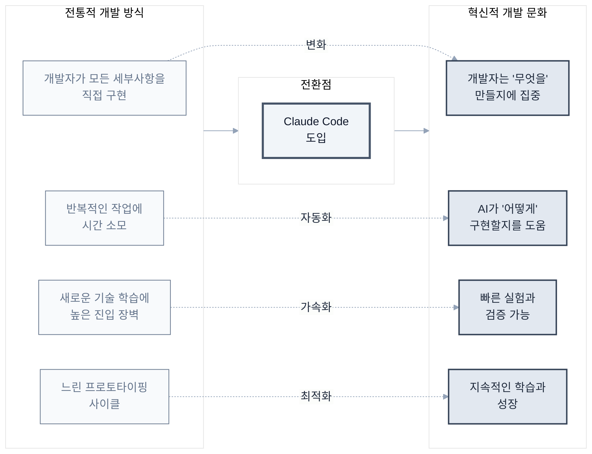

다음 장에서는 Claude Code를 실제로 설치하고 첫 번째 명령을 실행해보겠습니다. AI와 함께하는 개발의 새로운 여정을 시작해보겠습니다.

\newpage

# 제2장: 설치와 초기 설정

> "시작이 반이다" - 한국 속담

이제 Claude Code를 설치해보겠습니다. 이 장에서는 **각 운영체제별로 단계별 설치 가이드**를 제공하며, 설치 과정에서 발생할 수 있는 문제들과 해결 방법도 함께 다룹니다.

## 2.1 시스템 요구사항

### 최소 요구사항

먼저 시스템이 Claude Code를 실행할 수 있는지 확인해보겠습니다. 최소 요구사항은 일반적인 개발 환경과 유사하며, 대부분의 현대적인 시스템에서 실행 가능합니다.

| 구성 요소 | 최소 요구사항 | 권장 사항 |
|----------|-------------|----------|
| 운영체제 | macOS 12+, Windows 10+, Ubuntu 20.04+ | 최신 버전 |
| RAM | 8GB | 16GB 이상 |
| 저장공간 | 2GB 여유 공간 | 10GB 이상 |
| 인터넷 | 안정적인 연결 필요 | 고속 인터넷 |
| Node.js | 18.0 이상 | 20.0 이상 |

### 사전 준비사항

설치 전 시스템 환경을 확인하겠습니다. 터미널을 열고 다음 명령어들을 실행하여 필요한 도구들이 설치되어 있는지 확인하세요.

**터미널 실행 방법**

- **Mac**: `Cmd + Space` → "터미널" 검색
- **Windows**: `Win + R` → "cmd" 입력
- **Linux**: `Ctrl + Alt + T`

```bash
# Node.js 버전 확인
node --version

# npm 버전 확인
npm --version

# Git 설치 확인 (선택사항이지만 권장)
git --version
```

**Node.js가 설치되어 있지 않거나 버전이 낮다면**

1. [Node.js 공식 사이트](https://nodejs.org)에서 LTS 버전을 다운로드하세요
2. 또는 패키지 매니저를 사용하세요
   - **Mac**: `brew install node` (Homebrew 필요)
   - **Windows**: `choco install nodejs` (Chocolatey 필요)
   - **Linux**: `sudo apt install nodejs npm` (Ubuntu/Debian)

> **권장사항**: LTS(Long Term Support) 버전을 사용하면 안정성과 호환성을 보장받을 수 있습니다.

## 2.2 설치 가이드 (OS별)

이제 운영체제별로 Claude Code를 설치하겠습니다. 각 OS에 최적화된 설치 방법을 제공합니다.

### macOS에서 설치하기

macOS에서는 두 가지 설치 방법을 제공합니다.

**방법 1: npm을 통한 설치 (권장)**

가장 간단하고 안정적인 방법입니다.

```bash
# Claude Code 설치
npm install -g @anthropic-ai/claude-code

# 설치 확인
claude --version
```

**방법 2: Homebrew를 통한 설치**

```bash
# Homebrew tap 추가
brew tap anthropic-ai/claude-code

# Claude Code 설치
brew install claude-code

# 설치 확인
claude --version
```

**macOS 특화 설정**

```bash
# 터미널 권한 설정 (필요한 경우)
# 시스템 환경설정 > 보안 및 개인정보 > 개인정보 > 전체 디스크 접근 권한
# Terminal.app 또는 사용 중인 터미널 앱 추가

# Spotlight 검색 제외 (선택사항)
# .claude-code 디렉토리를 Spotlight 검색에서 제외하여 성능 향상
```

### Windows에서 설치하기

Windows에서도 간단하게 설치할 수 있습니다.

**방법 1: npm을 통한 설치 (권장)**

> **중요**: Windows에서는 PowerShell을 **관리자 권한**으로 실행해야 합니다.
> - `Win + X`를 누르고 "Windows PowerShell(관리자)" 선택
> - 또는 시작 메뉴에서 PowerShell을 우클릭 → "관리자 권한으로 실행"

```powershell
# Claude Code 설치
npm install -g @anthropic-ai/claude-code

# 설치 확인 (버전이 출력되면 성공!)
claude --version
```

**방법 2: Windows 설치 프로그램 사용**

1. Claude Code 공식 사이트에서 Windows 설치 프로그램(.exe) 다운로드
2. 다운로드한 파일 실행
3. 설치 마법사 지시에 따라 진행
4. 시스템 PATH에 자동으로 추가됨

**Windows 특화 설정**

```powershell
# Windows Defender 예외 추가 (성능 향상)
Add-MpPreference -ExclusionPath "$env:APPDATA\claude-code"

# 긴 경로 지원 활성화
git config --system core.longpaths true
```

### Linux (Ubuntu/Debian)에서 설치하기

```bash
# 시스템 패키지 업데이트
sudo apt update && sudo apt upgrade

# Node.js 설치 (아직 없는 경우)
curl -fsSL https://deb.nodesource.com/setup_20.x | sudo -E bash -
sudo apt install nodejs

# Claude Code 설치
sudo npm install -g @anthropic-ai/claude-code

# 설치 확인
claude --version

# 권한 설정 (필요한 경우)
sudo chmod +x /usr/local/bin/claude
```

## 2.3 첫 번째 명령어 실행하기

설치가 완료되었습니다. 이제 Claude Code의 기본 설정을 진행하겠습니다.

### API 키 설정

Claude Code를 사용하려면 API 키 설정이 필요합니다. 무료 사용량으로 시작할 수 있습니다.

**1단계: API 키 발급받기**

1. [Anthropic Console](https://console.anthropic.com)에 접속하세요
2. 계정을 만들거나 로그인하세요
3. "API Keys" 섹션에서 새 키를 생성하세요

**2단계: API 키 설정하기**
```bash
# API 키 설정 명령어 실행
claude login

# 프롬프트가 나타나면 복사한 API 키를 붙여넣기
# (키를 입력할 때는 화면에 표시되지 않는 것이 정상입니다)
```

> **보안 주의사항**: API 키는 개인 계정과 연결되므로 타인과 공유하지 않도록 주의하세요.

### 첫 번째 대화

이제 Claude Code와 첫 대화를 시작해보겠습니다.

```bash
# 첫 인사 (Claude가 답변하면 성공!)
claude "안녕하세요, Claude! 처음 뵙겠습니다."

# 간단한 작업 요청해보기
claude "현재 시스템 정보를 알려주세요"

# 디렉토리 탐색해보기
claude "현재 폴더에 어떤 파일들이 있는지 보여주세요"
```

**응답이 정상적으로 출력되면 설치와 기본 설정이 완료된 것입니다.** Claude Code 사용 준비가 완료되었습니다.

### 대화형 모드 vs 명령 모드

**명령 모드 (일회성 작업)**
```bash
claude "package.json 파일을 읽고 요약해줘"
```

**대화형 모드 (지속적인 작업)**

명령 모드는 단발성 작업에 적합하지만, 복잡한 프로젝트나 여러 단계를 거쳐야 하는 작업에는 대화형 모드가 더 효율적입니다.

```bash
# 대화형 모드 시작
claude

# 이제 지속적으로 대화 가능
> 새로운 React 프로젝트를 시작하고 싶어
> TypeScript를 사용하고, 테스트 환경도 설정해줘
> Material-UI도 추가해줘
```

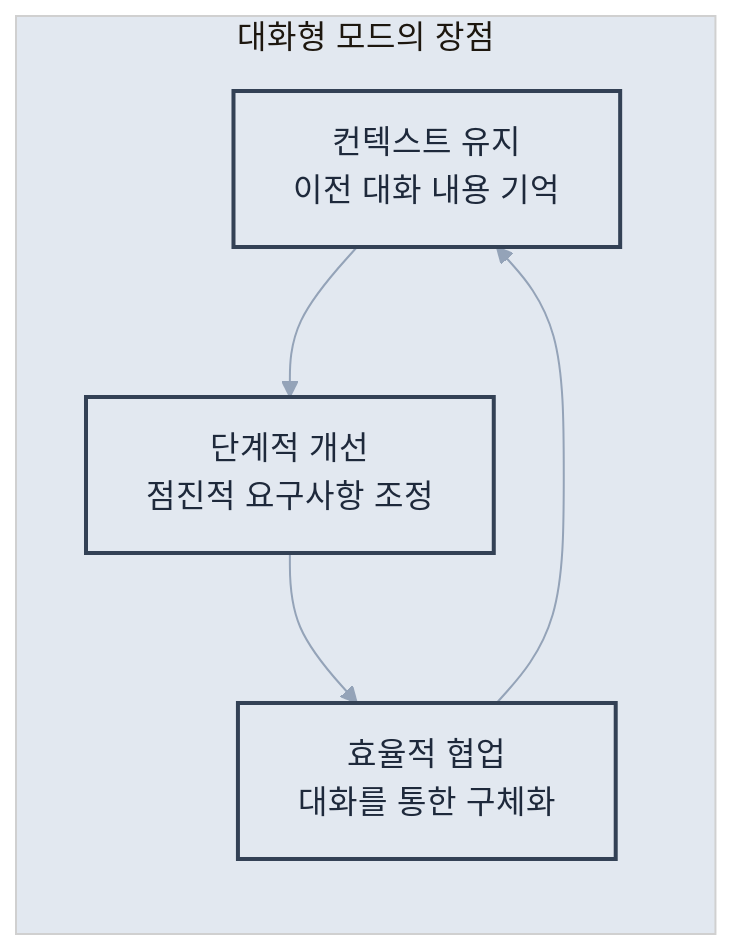

대화형 모드의 장점

## 2.4 기본 설정 최적화

Claude Code를 더 효율적으로 사용하기 위해서는 개인의 작업 환경과 선호도에 맞게 설정을 조정하는 것이 중요합니다. 이 섹션에서는 주요 설정 옵션들과 최적화 방법을 알아보겠습니다.

### 전역 설정 파일

Claude Code의 모든 설정은 홈 디렉토리의 설정 파일에서 관리됩니다. 이 파일을 통해 개인화된 작업 환경을 구성할 수 있습니다.

**설정 파일 위치**: `~/.claude-code/config.json`

```json
{
  "api_key": "sk-ant-...",              // API 인증 키
  "default_model": "claude-3-opus-20240229", // 기본 사용 모델
  "theme": "dark",                       // 인터페이스 테마 (dark/light)
  "editor": "vscode",                    // 선호 에디터
  "auto_commit": false,                  // 자동 커밋 여부
  "language": "ko",                      // 기본 언어 설정
  "permissions": {
    "file_write": true,                  // 파일 쓰기 권한
    "file_read": true,                   // 파일 읽기 권한
    "command_execution": true            // 명령 실행 권한
  }
}
```

**주요 설정 옵션 설명**

- `default_model`: 작업 유형에 따라 적절한 모델 선택 (opus: 복잡한 작업, sonnet: 일반 작업, haiku: 빠른 응답)
- `auto_commit`: 코드 변경 시 자동으로 Git 커밋할지 결정
- `permissions`: 보안을 위해 필요한 권한만 활성화하는 것을 권장

### 권한 설정

Claude Code는 강력한 도구이므로 적절한 권한 관리가 중요합니다. 작업 환경과 보안 요구사항에 따라 권한을 조정할 수 있습니다.

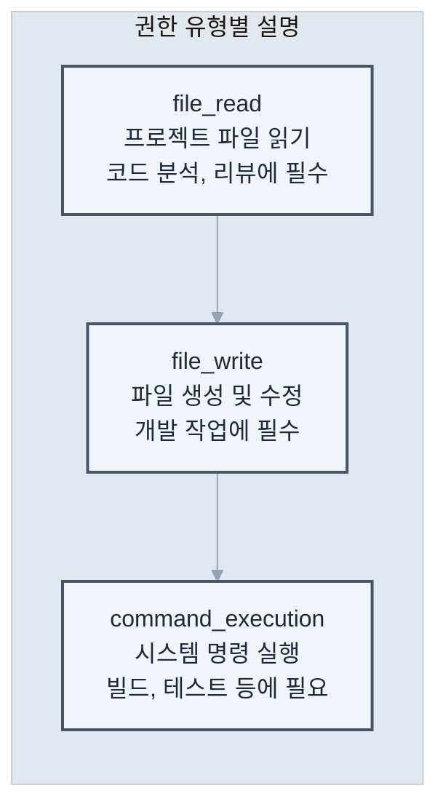

**권한 유형별 설명**

보안과 편의성의 균형을 위한 권한 설정 전략

```bash
# 모든 권한 부여 (개발 환경)
claude --allow-all

# 읽기 전용 모드 (코드 리뷰용)
claude --read-only

# 특정 권한만 부여
claude --allow-read --allow-write --deny-execute
```

### 에디터 통합

개발 효율성을 높이기 위해 Claude Code를 기존 에디터와 통합할 수 있습니다. 에디터 통합을 통해 코드 편집과 AI 지원을 원활하게 연결할 수 있습니다.

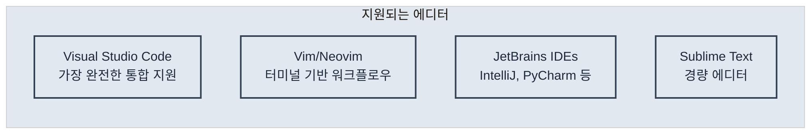

**지원되는 에디터**

선호하는 에디터와 통합 설정

```bash
# VSCode 통합
claude config set editor vscode

# Vim 통합
claude config set editor vim

# 에디터에서 직접 Claude Code 호출
# VSCode: Cmd+Shift+P > "Claude: Ask"
```

### 프록시 설정 (기업 환경)

많은 기업에서는 보안상의 이유로 프록시 서버를 통해 외부 인터넷에 접속합니다. Claude Code도 이런 환경에서 사용할 수 있도록 프록시 설정을 지원합니다.

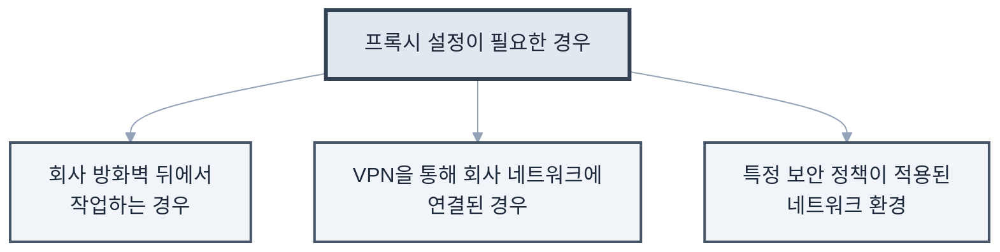

**프록시 설정이 필요한 경우**

기업 환경에서 프록시를 사용하는 경우의 설정 방법

```bash
# HTTP 프록시 설정
export HTTP_PROXY=http://proxy.company.com:8080
export HTTPS_PROXY=http://proxy.company.com:8080

# Claude Code 전용 프록시 설정
claude config set proxy http://proxy.company.com:8080
```

## 2.5 문제 해결 가이드

Claude Code 설치 및 초기 사용 과정에서 발생할 수 있는 일반적인 문제들과 해결 방법을 정리했습니다. 문제 상황별로 단계적인 해결 방안을 제시하므로, 차근차근 따라하면 대부분의 문제를 해결할 수 있습니다.

### 자주 발생하는 문제와 해결 방법

다음은 Claude Code 사용자들이 가장 자주 경험하는 문제들과 검증된 해결 방법들입니다.

**1. "command not found: claude"**

이 오류는 Claude Code가 설치되었지만 시스템 PATH에 등록되지 않았을 때 발생합니다.

**원인 분석**

- npm 전역 설치 경로가 PATH에 포함되지 않음
- 잘못된 설치 경로
- Shell 환경 변수 설정 문제

**해결 방법**
```bash
# 1단계: npm 전역 경로 확인
npm config get prefix

# 2단계: PATH에 추가 (bash/zsh)
echo 'export PATH="$PATH:$(npm config get prefix)/bin"' >> ~/.bashrc
source ~/.bashrc

# 3단계: 설치 확인
claude --version
```

**추가 해결책**

- macOS에서 `.zshrc` 파일 수정 필요할 수 있음
- Windows에서는 시스템 환경 변수에서 PATH 수정

**2. "EACCES: permission denied"**

이 오류는 npm 전역 설치 시 권한 문제로 발생합니다. 특히 Linux나 macOS에서 자주 나타납니다.

**원인 분석**

- npm 전역 디렉토리에 대한 쓰기 권한 부족
- sudo로 설치했을 때 소유권 문제
- 시스템 보호된 디렉토리에 설치 시도

**해결 방법**
```bash
# 방법 1: 권한 수정 (권장)
sudo chown -R $(whoami) $(npm config get prefix)/{lib/node_modules,bin,share}

# 방법 2: npx를 통한 실행 (임시 해결)
npx @anthropic-ai/claude-code

# 방법 3: npm 전역 디렉토리 변경
mkdir ~/.npm-global
npm config set prefix '~/.npm-global'
echo 'export PATH=~/.npm-global/bin:$PATH' >> ~/.bashrc
source ~/.bashrc
```

**3. "API rate limit exceeded"**

API 사용량 제한에 도달했을 때 발생하는 오류입니다. Anthropic의 API 정책에 따라 시간당 요청 횟수가 제한됩니다.

**원인 분석**
- 단시간 내 너무 많은 요청
- API 플랜의 사용량 한계 도달
- 네트워크 문제로 인한 중복 요청

**해결 방법**
```bash
# 1단계: 현재 상태 확인
claude status

# 2단계: 자동 재시도 간격 설정 (밀리초)
claude config set retry_delay 5000

# 3단계: 최대 재시도 횟수 설정
claude config set max_retries 3
```

**예방 방법**

- 대용량 작업 시 작은 단위로 분할하여 실행
- `--rate-limit` 옵션 사용하여 요청 속도 조절
- API 사용량 모니터링으로 제한 사전 파악

**4. "SSL certificate problem"**

기업 환경에서 자체 인증서를 사용하거나 네트워크 보안 정책으로 인해 SSL 인증서 검증에 실패할 때 발생합니다.

**원인 분석**

- 회사 방화벽의 SSL 검사
- 자체 서명된 인증서 사용
- 오래된 시스템의 인증서 저장소 문제

**해결 방법**
```bash
# ⚠️ 임시 해결책 (보안 위험 있음)
export NODE_TLS_REJECT_UNAUTHORIZED=0

# ✅ 권장 해결책: 회사 인증서 설치
# 1단계: IT 부서에서 인증서 파일 받기
# 2단계: npm에 인증서 등록
npm config set cafile /path/to/company-cert.pem

# 3단계: Claude Code 전용 설정
claude config set tls_verify true
claude config set ca_bundle /path/to/company-cert.pem
```

**보안 고려사항**

- `NODE_TLS_REJECT_UNAUTHORIZED=0`은 보안 위험이 있으므로 임시로만 사용
- 가능하면 IT 부서와 협력하여 적절한 인증서 설정

### 성능 최적화 팁

Claude Code의 응답 속도와 효율성을 향상시키기 위한 설정들입니다. 프로젝트 규모와 작업 패턴에 따라 적절히 조정하여 사용하세요.

**1. 캐시 활성화**

반복적인 요청에 대한 응답을 캐시하여 속도를 향상시킵니다.

```bash
# 응답 캐싱 활성화
claude config set cache_enabled true

# 캐시 유지 시간 설정 (초 단위, 기본: 3600초 = 1시간)
claude config set cache_ttl 3600

# 캐시 크기 제한 설정 (MB 단위)
claude config set cache_max_size 100
```

**캐시 활용 팁**

- 동일한 코드를 반복 분석할 때 유용
- 큰 프로젝트에서 점진적 작업 시 효과적
- 캐시 무효화: `claude cache clear`

**2. 컨텍스트 크기 조정**

프로젝트 규모에 따라 Claude Code가 한 번에 처리할 수 있는 컨텍스트 크기를 조정합니다.

```bash
# 큰 프로젝트의 경우 컨텍스트 확대
claude config set max_context_length 100000

# 작은 프로젝트나 빠른 응답이 필요한 경우
claude config set max_context_length 50000

# 현재 설정 확인
claude config get max_context_length
```

**설정 가이드라인**
- **소규모 프로젝트 (< 50개 파일)**: 50,000
- **중간 규모 프로젝트 (50-200개 파일)**: 100,000
- **대규모 프로젝트 (200개+ 파일)**: 200,000

**주의사항**: 컨텍스트가 클수록 응답 시간이 길어지고 API 비용이 증가할 수 있습니다.

**3. 로컬 모델 사용 (베타)**

개발 중인 기능으로, 로컬에서 모델을 실행하여 인터넷 연결 없이도 Claude Code를 사용할 수 있습니다.

```bash
# 로컬 모드 활성화
claude config set local_mode true

# 로컬 모델 다운로드 (용량 주의: 수 GB)
claude download-model claude-instant

# 다운로드된 모델 확인
claude list-models --local

# 특정 모델로 실행
claude --model local:claude-instant "코드를 분석해줘"
```

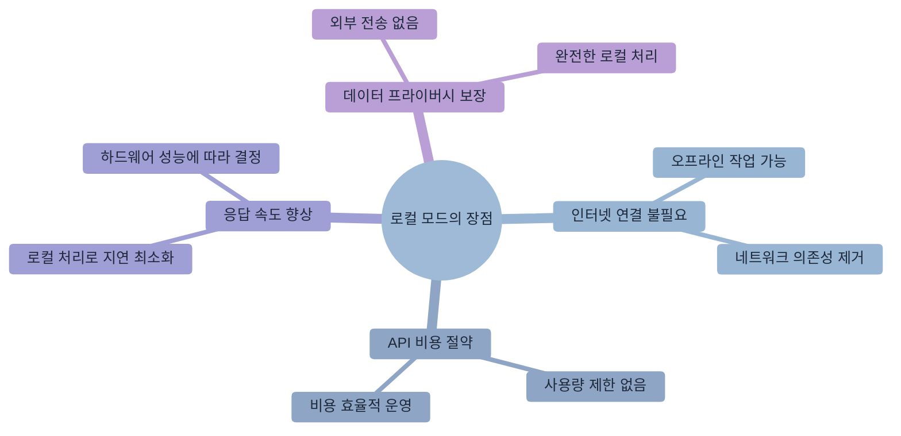

**로컬 모드의 장점**

**요구사항**
- 충분한 저장공간 (모델당 2-8GB)
- 강력한 하드웨어 (GPU 권장)
- 베타 기능으로 일부 제한사항 존재

## 실습: Hello World 프로젝트

이론적인 설정을 마쳤으니, 이제 실제로 Claude Code를 사용해보겠습니다. 간단한 웹 서버 프로젝트를 통해 Claude Code의 기본 사용법을 체험해보겠습니다.

**학습 목표**
- Claude Code의 자연어 명령 사용법 익히기
- 프로젝트 생성부터 실행까지의 전체 과정 체험
- 생성된 코드의 품질과 구조 이해

**실습 과정**

```bash
# 1단계: 프로젝트 디렉토리 생성
mkdir hello-claude && cd hello-claude

# 2단계: Claude Code로 프로젝트 초기화
claude "Node.js로 간단한 Hello World 웹 서버를 만들어줘. 
포트 3000에서 실행되고, '/' 경로로 접속하면 'Hello from Claude Code!'를 
표시하도록 해줘. package.json과 README.md도 함께 만들어줘."

# 3단계: 생성된 파일 구조 확인
ls -la
# 예상 결과
# package.json  - 프로젝트 설정 파일
# server.js     - 웹 서버 메인 파일
# README.md     - 프로젝트 설명 문서

# 4단계: 의존성 설치
npm install

# 5단계: 서버 실행
npm start

# 6단계: 브라우저에서 테스트
# http://localhost:3000 접속하여 "Hello from Claude Code!" 메시지 확인
```

**실습 포인트**
- 자연어로 복잡한 요구사항을 한 번에 전달
- Claude Code가 생성하는 코드의 품질과 구조 관찰
- 생성된 README.md에서 추가 사용법 확인

**실습 완료 체크리스트**
- [ ] 프로젝트가 성공적으로 생성되었는가?
- [ ] 서버가 정상적으로 시작되는가?
- [ ] 브라우저에서 올바른 메시지가 표시되는가?
- [ ] 생성된 코드가 이해 가능한 구조인가?

Claude Code와 함께 첫 번째 프로젝트를 성공적으로 만들었습니다!

## 설치 완료 및 다음 단계

이제 Claude Code의 설치와 기본 설정이 완료되었습니다. 첫 번째 실습을 통해 Claude Code의 강력함을 경험했을 것입니다.

**이 장에서 배운 내용**
- 운영체제별 설치 방법과 환경 설정
- API 키 설정과 첫 번째 대화
- 문제 해결 방법과 성능 최적화
- 실제 프로젝트 생성 경험

**다음 장 미리보기**
제3장에서는 Claude Code의 핵심 기능들을 체계적으로 학습합니다.
- **파일 시스템 탐색**: 프로젝트 구조 파악과 효율적인 코드 분석
- **코드 작성과 수정**: 자연어를 통한 정교한 코드 생성과 리팩토링
- **테스트와 디버깅**: 품질 높은 코드를 위한 검증과 문제 해결
- **Git 통합**: 버전 관리와 협업을 위한 워크플로우

**유용한 참고 명령어**
```bash
# 도움말 확인
claude help

# 대화형 튜토리얼 시작
claude tutorial

# 현재 설정 확인
claude config list

# 버전 정보 확인
claude --version
```

**문제 해결 리소스**
- 공식 문서: https://docs.anthropic.com/claude-code
- 커뮤니티 포럼: https://community.anthropic.com
- GitHub 이슈: https://github.com/anthropic/claude-code/issues

\newpage

# 제3장: 기본 사용법 마스터

> "천 리 길도 한 걸음부터" - 노자

이 장에서는 Claude Code의 핵심 기능들을 체계적으로 학습하겠습니다. **실습 중심의 예제**를 통해 일상적인 개발 업무에 Claude Code를 효과적으로 적용하는 방법을 익히겠습니다.

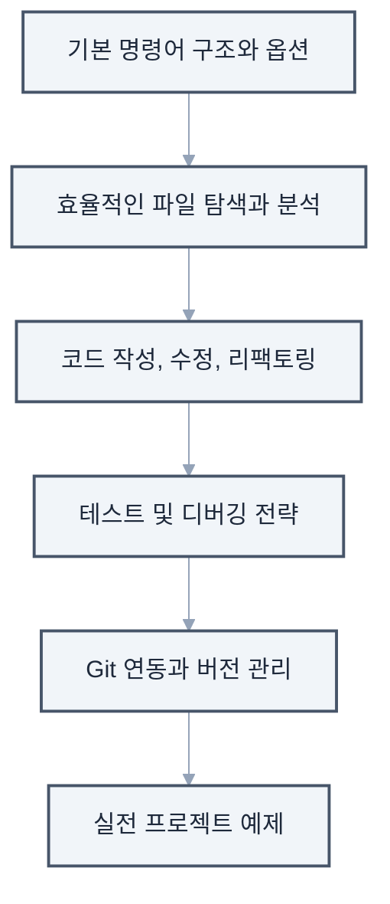

이 장에서 다루는 내용

## 3.1 기본 명령어 구조

### 명령어 해부학

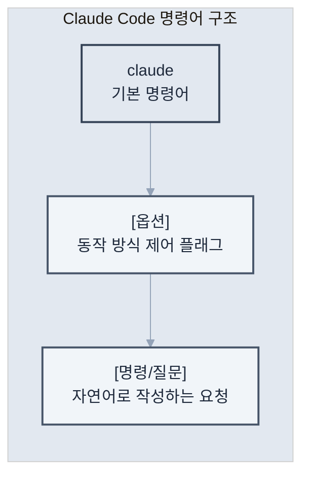

Claude Code 명령어의 구조는 직관적이면서도 강력합니다.

### 주요 옵션들

Claude Code는 다양한 옵션을 통해 동작을 세밀하게 제어할 수 있습니다. 각 옵션의 용도와 활용 시나리오를 이해하면 더 효과적으로 사용할 수 있습니다.

**기본 옵션들**
```bash
# 도움말 보기 - 사용 가능한 모든 명령어와 옵션 확인
claude --help
claude -h

# 버전 확인 - 현재 설치된 Claude Code 버전 확인
claude --version
claude -v

# 대화 기록 지우기 - 새로운 컨텍스트로 시작하고 싶을 때
claude --clear
claude -c
```

**모델 선택 옵션**
```bash
# 복잡한 작업을 위한 고성능 모델 사용
claude --model claude-3-opus "복잡한 알고리즘 구현해줘"

# 빠른 응답이 필요한 간단한 작업
claude -m claude-3-haiku "간단한 설명만 해줘"

# 균형잡힌 성능과 속도
claude -m claude-3-sonnet "코드 리뷰해줘"
```

**출력 형식 제어**
```bash
# JSON 형식으로 구조화된 데이터 받기
claude --json "프로젝트 구조를 JSON으로 출력해줘"

# 마크다운 형식으로 문서 생성
claude --markdown "README 파일 내용을 마크다운으로 보여줘"

# 일반 텍스트 출력 (기본값)
claude --plain "간단한 설명을 텍스트로 보여줘"
```

### 자연어 명령의 힘

Claude Code의 핵심 특징은 복잡한 명령어 문법 대신 자연스러운 언어로 의도를 전달할 수 있다는 점입니다.

```bash
# 기술적인 요청
claude "UserService 클래스에 이메일 검증 메서드를 추가해줘"

# 탐색적인 질문
claude "이 프로젝트에서 인증은 어떻게 처리되고 있어?"

# 창의적인 요청
claude "이 함수를 더 효율적으로 만들 수 있는 방법이 있을까?"

# 복합적인 작업
claude "버그를 찾아서 수정하고, 테스트도 작성한 다음, 커밋 메시지까지 만들어줘"
```

## 3.2 파일 탐색과 읽기

### 프로젝트 구조 파악하기

새로운 프로젝트에 투입되었을 때 빠르게 전체 구조를 파악하는 것은 중요합니다. Claude Code를 활용하면 효율적으로 코드베이스를 탐색할 수 있습니다.

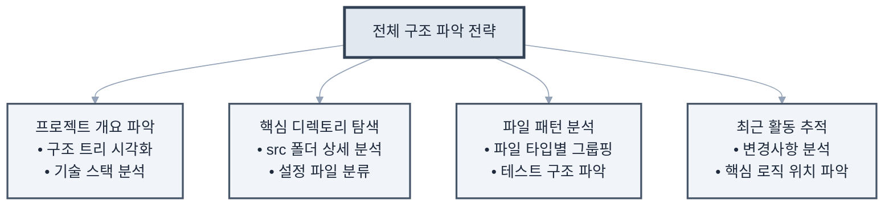

**전체 구조 파악 전략**

### 효율적인 파일 읽기

단순히 파일을 열어보는 것이 아니라, 목적에 맞는 정보를 효과적으로 추출하는 방법입니다.

```bash
# 단일 파일 읽기
claude "package.json 파일을 읽어줘"

# 여러 파일 동시에 읽기
claude "모든 설정 파일들(config로 시작하는)을 읽고 요약해줘"

# 특정 부분만 읽기
claude "app.js 파일에서 라우터 설정 부분만 보여줘"

# 파일 비교
claude "개발 환경과 프로덕션 환경 설정 파일을 비교해줘"
```

### 코드 분석 요청

기존 코드의 동작 원리를 이해하거나 잠재적 문제를 발견하는 데 유용한 분석 요청들입니다.

```bash
# 함수 분석
claude "calculateTotalPrice 함수가 어떻게 동작하는지 설명해줘"

# 의존성 분석
claude "이 프로젝트가 사용하는 주요 라이브러리들과 용도를 설명해줘"

# 아키텍처 분석
claude "이 프로젝트의 전체적인 아키텍처를 다이어그램으로 설명해줘"

# 보안 취약점 검사
claude "보안상 문제가 될 수 있는 코드가 있는지 검사해줘"
```

## 3.3 코드 작성과 수정

### 새 파일 생성

프로젝트의 컨벤션과 구조에 맞는 새 파일을 자동으로 생성할 수 있습니다.

```bash
# 기본적인 파일 생성
claude "utils 폴더에 날짜 관련 유틸리티 함수들을 만들어줘"

# 템플릿 기반 생성
claude "Express 라우터 템플릿으로 user 라우터를 만들어줘"

# 테스트 파일 자동 생성
claude "UserService에 대한 Jest 테스트 파일을 만들어줘"

# 문서 생성
claude "API 엔드포인트 문서를 Swagger 형식으로 만들어줘"
```

### 코드 수정 패턴

다양한 수정 작업을 체계적으로 수행하는 방법들입니다. 각 패턴별로 실제 사용 시나리오와 베스트 프랙티스를 함께 소개합니다.

**1. 단순 수정 - 코드 현대화**
```bash
# ES5를 ES6+ 문법으로 업그레이드
claude "모든 var를 const나 let으로 바꿔줘. 재할당되는 변수만 let을 사용해"

# 콜백을 async/await로 변환
claude "콜백 기반 코드를 async/await 패턴으로 변경해줘"

# 문자열 연결을 템플릿 리터럴로
claude "문자열 연결 연산자(+)를 템플릿 리터럴로 바꿔줘"
```

**2. 리팩토링 - 코드 구조 개선**
```bash
# 긴 함수 분리
claude "이 함수가 50줄이 넘는데, 논리적 단위로 분리해서 가독성을 높여줘"

# 중복 코드 제거
claude "중복되는 코드를 찾아서 재사용 가능한 함수로 추출해줘"

# 조건문 단순화
claude "복잡한 if-else 체인을 early return 패턴이나 switch문으로 개선해줘"
```

**3. 기능 추가 - 점진적 개선**
```bash
# 에러 처리 추가
claude "이 API 호출 함수에 적절한 에러 처리와 재시도 로직을 추가해줘"

# 로딩 상태 관리
claude "이 컴포넌트에 로딩, 성공, 에러 상태를 관리하는 로직을 추가해줘"

# 유효성 검사 추가
claude "사용자 입력 폼에 실시간 유효성 검사를 추가해줘"
```

**4. 버그 수정 - 안정성 향상**
```bash
# 잠재적 오류 찾기
claude "null/undefined 참조 오류가 발생할 수 있는 부분을 찾아서 옵셔널 체이닝으로 수정해줘"

# 메모리 누수 방지
claude "이벤트 리스너나 타이머가 제대로 정리되지 않는 부분을 찾아서 수정해줘"

# 경쟁 조건 해결
claude "비동기 작업에서 경쟁 조건이 발생할 수 있는 부분을 찾아서 수정해줘"
```

### 코드 스타일 통일

프로젝트 전반에 일관된 코딩 스타일을 적용하는 작업입니다.

```bash
# 포매팅
claude "프로젝트 전체를 Prettier 규칙에 맞게 포매팅해줘"

# 네이밍 컨벤션
claude "camelCase를 snake_case로 변경해줘"

# 주석 추가
claude "복잡한 로직에 설명 주석을 추가해줘"

# 타입 추가
claude "JavaScript 파일에 TypeScript 타입을 추가해줘"
```

## 3.4 테스트 실행과 디버깅

### 테스트 작성

품질 높은 소프트웨어를 위한 체계적인 테스트 작성 방법입니다.

```bash
# 단위 테스트
claude "calculateDiscount 함수에 대한 단위 테스트를 작성해줘"

# 통합 테스트
claude "사용자 등록 API에 대한 통합 테스트를 작성해줘"

# 엣지 케이스
claude "이 함수의 엣지 케이스를 찾아서 테스트를 추가해줘"

# 테스트 커버리지
claude "테스트 커버리지를 확인하고 누락된 부분에 테스트를 추가해줘"
```

### 디버깅 전략

문제 발생 시 효과적으로 원인을 파악하고 해결하는 체계적인 접근법입니다.

**1. 오류 메시지 분석**
```bash
claude "이 오류 메시지가 무엇을 의미하는지 설명하고 해결 방법을 제시해줘
TypeError: Cannot read property 'name' of undefined"
```

**2. 로그 추가**
```bash
claude "문제가 발생하는 것 같은 부분에 디버그 로그를 추가해줘"
```

**3. 단계별 추적**
```bash
claude "이 함수의 실행 흐름을 단계별로 추적할 수 있도록 코드를 수정해줘"
```

**4. 성능 분석**
```bash
claude "이 코드의 성능 병목 지점을 찾아서 최적화해줘"
```

### 실시간 디버깅 세션

복잡한 문제를 대화형으로 해결하는 과정의 예시입니다. 실제 디버깅 시나리오를 통해 Claude Code와의 효과적인 협업 방법을 알아봅시다.

**시나리오 1: 서버 시작 오류 해결**
```bash
# 대화형 디버깅 시작
claude

> 서버가 시작되지 않아. 포트 3000에서 이미 사용 중이라는 오류가 나와.
< 포트 3000을 사용하는 프로세스를 확인해보겠습니다. 다음 명령을 실행해드릴게요
  lsof -i :3000

> 확인했더니 이전에 실행한 node 프로세스가 PID 12345로 실행 중이야.
< 해당 프로세스를 안전하게 종료하고, 향후 이런 문제를 방지하는 스크립트를 만들어드리겠습니다.
  1. 프로세스 종료 스크립트 생성
  2. package.json에 재시작 스크립트 추가
  3. graceful shutdown 코드 구현

> 좋아, 진행해줘. 그리고 왜 서버가 제대로 종료되지 않았는지도 알고 싶어.
< 서버 코드를 분석해보니 다음과 같은 문제들을 발견했습니다.
  1. SIGTERM 시그널 핸들러가 없어서 프로세스가 강제 종료됨
  2. 활성 연결이 정리되지 않고 있음
  3. 데이터베이스 연결 풀이 닫히지 않음
  
  이제 이 문제들을 하나씩 해결해드리겠습니다...
```

**시나리오 2: 메모리 누수 추적**
```bash
claude

> 서버가 며칠 동안 실행되면 메모리 사용량이 계속 증가해. 메모리 누수가 있는 것 같아.
< 메모리 누수를 추적하기 위해 다음 단계로 진행하겠습니다.
  1. 현재 코드에서 메모리 누수 가능성이 있는 패턴 검색
  2. 메모리 프로파일링 도구 설정
  3. 의심되는 코드 영역에 모니터링 추가

> 어떤 패턴들이 위험한가?
< 다음과 같은 패턴들을 발견했습니다.
  - 이벤트 리스너가 제거되지 않는 곳 3개
  - 전역 변수에 계속 데이터가 추가되는 캐시
  - 순환 참조가 있는 객체 구조
  각각 수정 방법을 보여드릴까요?
```

## 3.5 Git 연동과 버전 관리

### 기본 Git 작업

일상적인 버전 관리 작업을 Claude Code와 함께 수행하는 방법입니다.

```bash
# 상태 확인
claude "git 상태를 확인하고 변경사항을 요약해줘"

# 스테이징
claude "수정된 파일 중 테스트 관련 파일만 스테이징해줘"

# 커밋
claude "의미 있는 커밋 메시지를 작성해서 커밋해줘"

# 브랜치 관리
claude "새로운 기능을 위한 브랜치를 만들고 체크아웃해줘"
```

### 고급 Git 작업

복잡한 Git 작업도 Claude Code의 도움으로 안전하고 효율적으로 수행할 수 있습니다.

```bash
# 대화형 리베이스
claude "최근 3개 커밋을 정리해서 하나로 합쳐줘"

# 충돌 해결
claude "머지 충돌을 해결해줘. 두 변경사항을 모두 유지하는 방향으로"

# 히스토리 분석
claude "이 버그가 언제 도입됐는지 git bisect로 찾아줘"

# 체리픽
claude "hotfix 브랜치의 버그 수정 커밋만 main으로 체리픽해줘"
```

### Pull Request 작성

팀 협업에서 중요한 Pull Request 관련 작업들입니다.

```bash
# PR 생성
claude "이 기능에 대한 Pull Request를 생성해줘. 
변경사항을 요약하고, 테스트 방법도 포함해줘"

# 코드 리뷰 대응
claude "리뷰어가 지적한 사항들을 수정하고 답변을 작성해줘"

# PR 템플릿 활용
claude "프로젝트의 PR 템플릿에 맞춰서 설명을 작성해줘"
```

## 실전 예제: Todo 앱 만들기

앞서 학습한 기본 사용법들을 종합적으로 활용하여 실제 프로젝트를 구축해보겠습니다. Todo 애플리케이션을 단계별로 개발하면서 Claude Code의 실전 활용법을 익혀봅시다.

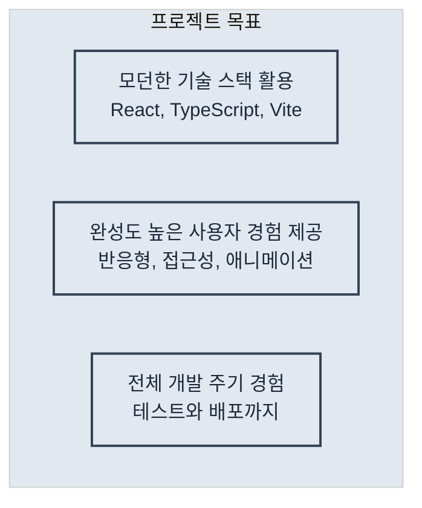

**프로젝트 목표**

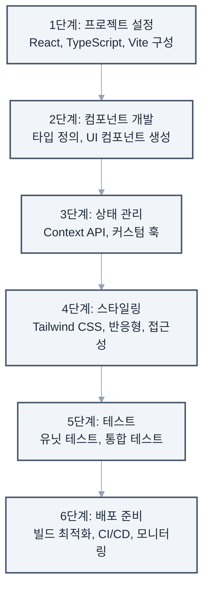

### Todo 앱 개발 단계별 가이드
```

**프로젝트 완성 체크리스트**
- [ ] 모든 CRUD 기능이 정상 작동하는가?
- [ ] 반응형 디자인이 모든 화면 크기에서 잘 동작하는가?
- [ ] 테스트 커버리지가 80% 이상인가?
- [ ] 라이트하우스 점수가 90점 이상인가?
- [ ] 접근성 기준을 충족하는가?

## 프로 팁: 효율성 극대화

### 1. 별칭(Alias) 설정

자주 사용하는 명령어에 단축 별칭을 설정하여 작업 효율성을 높일 수 있습니다.

```bash
# ~/.bashrc 또는 ~/.zshrc에 추가
alias cc="claude"
alias ccc="claude --clear"
alias ccr="claude 'npm run'"
```

### 2. 템플릿 활용

반복적으로 사용하는 명령어 패턴을 템플릿으로 저장하여 재사용성을 높입니다.

**템플릿 디렉토리 구조 만들기**
```bash
# Claude Code 템플릿 디렉토리 생성
mkdir -p ~/.claude-templates/{components,features,tests,docs}
```

**실용적인 템플릿 예시들**

1. **React 컴포넌트 템플릿**
```bash
# 컴포넌트 생성 템플릿
cat > ~/.claude-templates/components/react-component.txt << 'EOF'
새로운 React 컴포넌트를 만들어줘
- 컴포넌트 이름: [COMPONENT_NAME]
- 함수형 컴포넌트로 작성
- TypeScript 사용
- Props 인터페이스 정의
- 기본 스타일 포함
- 스토리북 스토리 파일도 생성
- 유닛 테스트 파일 포함
EOF

# 사용 예시
COMPONENT_NAME="UserProfile" envsubst < ~/.claude-templates/components/react-component.txt | claude
```

2. **API 엔드포인트 템플릿**
```bash
# API 라우트 생성 템플릿
cat > ~/.claude-templates/features/api-endpoint.txt << 'EOF'
새로운 REST API 엔드포인트를 만들어줘
- 리소스: [RESOURCE_NAME]
- CRUD 작업 모두 포함
- Express.js 라우터 사용
- 입력 검증 미들웨어
- 에러 핸들링
- Swagger 문서 주석
- 통합 테스트 포함
EOF
```

3. **버그 수정 템플릿**
```bash
# 버그 수정 워크플로우 템플릿
cat > ~/.claude-templates/features/bugfix.txt << 'EOF'
다음 버그를 수정해줘
1. 먼저 관련된 코드를 찾아서 분석해줘
2. 버그의 근본 원인을 설명해줘
3. 수정 방안을 제시하고 구현해줘
4. 재발 방지를 위한 테스트를 추가해줘
5. 수정사항을 커밋 메시지와 함께 정리해줘

버그 설명: [BUG_DESCRIPTION]
EOF
```

### 3. 컨텍스트 유지

복잡하고 긴 작업을 수행할 때는 대화형 모드를 활용하여 문맥을 유지합니다. 효과적인 컨텍스트 관리는 대규모 작업의 성공 열쇠입니다.

**대규모 리팩토링 시나리오**
```bash
# 대화형 모드로 시작
claude

> 이제부터 레거시 코드를 최신 아키텍처로 마이그레이션할 거야
< 알겠습니다. 먼저 현재 코드베이스를 분석하고 마이그레이션 계획을 수립하겠습니다.

> 1단계: 현재 아키텍처를 분석하고 문제점을 파악해줘
< 분석 결과
  - 모놀리식 구조로 모듈 간 결합도가 높음
  - 클래스 기반 컴포넌트 사용 (React 16.2)
  - 상태 관리가 prop drilling으로 복잡함
  - 테스트 커버리지 30%
  
  주요 개선 필요 영역을 식별했습니다. 계속 진행할까요?

> 2단계: 마이그레이션 로드맵을 만들어줘
< 단계별 마이그레이션 로드맵
  Phase 1: 인프라 현대화 (1-2주)
  - 빌드 도구를 Webpack에서 Vite로 마이그레이션
  - TypeScript 도입
  
  Phase 2: 컴포넌트 현대화 (3-4주)
  - 클래스 컴포넌트를 함수형으로 전환
  - Custom Hooks로 로직 추출
  
  Phase 3: 상태 관리 개선 (1주)
  - Context API 또는 Zustand 도입
  
  Phase 4: 테스트 강화 (1주)
  - 테스트 커버리지 80% 목표

> 좋아, Phase 1부터 시작하자. 먼저 Vite 마이그레이션을 진행해줘
< Phase 1 시작: Vite 마이그레이션을 단계별로 진행하겠습니다...
```

**컨텍스트 유지 팁**

1. **체크포인트 생성**: 각 단계 완료 시 진행 상황 요약 요청
2. **명확한 단계 구분**: 번호나 라벨로 작업 단계 명시
3. **정기적인 검증**: 중간중간 결과 확인 및 방향 조정
4. **컨텍스트 저장**: 중요한 결정사항은 별도 문서로 저장

## 마치며

이 장에서는 Claude Code의 핵심 기능들을 체계적으로 학습했습니다.

**주요 학습 내용**
- **자연어 기반 명령**: 복잡한 문법 없이 의도를 명확히 전달
- **프로젝트 탐색**: 코드베이스를 빠르게 이해하고 분석
- **코드 관리**: 작성, 수정, 리팩토링의 효율적인 방법
- **품질 관리**: 테스트와 디버깅을 통한 안정성 확보
- **버전 관리**: Git 연동을 통한 체계적인 개발 워크플로우

**실무 적용 포인트**
- 반복 작업은 Claude Code에 위임하여 창의적 업무에 집중
- 대화형 모드를 활용한 복잡한 문제 해결
- 프로젝트 컨텍스트를 활용한 정확한 작업 수행

다음 장에서는 CLAUDE.md 파일을 통해 프로젝트별로 Claude Code를 맞춤 설정하는 방법을 알아보겠습니다. 각 프로젝트의 특성에 맞는 최적화 전략을 학습해봅시다.

\newpage

# 제4장: CLAUDE.md로 프로젝트 맞춤 설정

> "좋은 도구는 사용자에게 맞춰진다" - 도널드 노먼

이 장에서는 **CLAUDE.md 파일을 통한 프로젝트 맞춤 설정**에 대해 알아보겠습니다. 각 프로젝트의 고유한 특성과 요구사항에 맞춰 Claude Code를 최적화하는 방법을 체계적으로 학습하겠습니다.

CLAUDE.md는 Claude Code가 프로젝트의 컨텍스트를 이해하고, 팀의 코딩 규칙을 준수하며, 일관된 품질의 코드를 생성하도록 돕는 핵심 도구입니다.

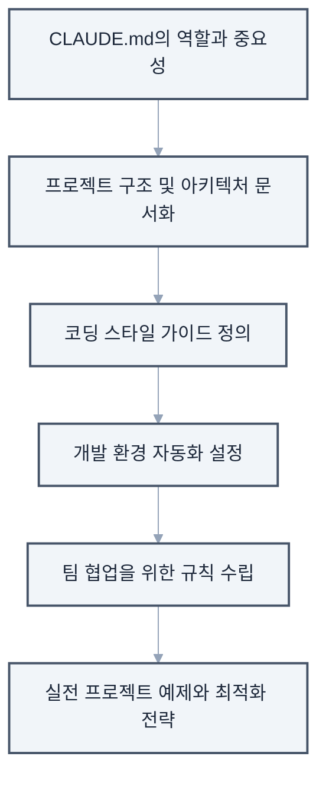

**이 장에서 다룰 내용**

## 4.1 CLAUDE.md의 역할과 중요성

### CLAUDE.md란?

CLAUDE.md는 프로젝트 루트 디렉토리에 위치하는 특별한 마크다운 파일입니다. 이 파일은 Claude Code에게 프로젝트별 지침과 규칙을 제공하여, 보다 정확하고 일관된 결과를 도출할 수 있게 합니다.

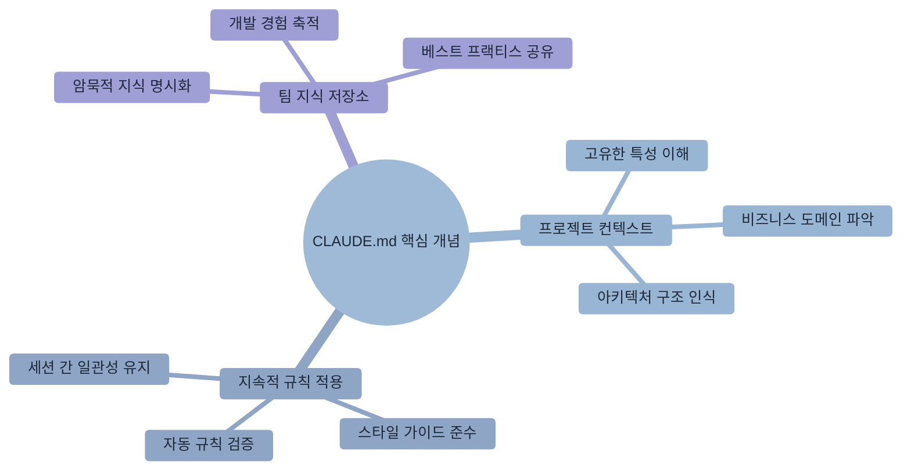

**CLAUDE.md의 핵심 개념**

프로젝트 구조 예시

```
프로젝트 루트/
├── CLAUDE.md          # Claude Code 설정 파일
├── README.md          # 일반 프로젝트 문서
├── package.json
└── src/
```

### 왜 중요한가?

CLAUDE.md를 통해 얻을 수 있는 주요 이점들을 구체적인 예시와 함께 살펴보겠습니다.

**1. 일관성 보장**

CLAUDE.md가 없을 때와 있을 때의 차이를 비교해보겠습니다.
```markdown
# CLAUDE.md
## 코드 스타일

- 모든 함수는 화살표 함수로 작성
- 세미콜론 항상 사용
- 들여쓰기는 2칸
```

**2. 팀 규칙 자동 적용**

팀의 Git 커밋 규칙을 CLAUDE.md에 정의하면, Claude Code가 자동으로 규칙에 맞는 커밋 메시지를 생성합니다.

```markdown
## Git 커밋 규칙
- feat: 새로운 기능 추가
- fix: 버그 수정
- docs: 문서 수정
- style: 코드 포매팅 (기능 변경 없음)
- refactor: 코드 리팩토링 (기능 변경 없음)
- test: 테스트 추가 또는 수정
- chore: 빌드 프로세스 또는 보조 도구 변경

## 커밋 메시지 형식
<type>(<scope>): <subject>

예시
feat(auth): 소셜 로그인 기능 추가
fix(api): 사용자 조회 시 null 참조 오류 수정
```

이렇게 정의하면 Claude Code가 자동으로 올바른 형식의 커밋 메시지를 생성합니다.

**3. 프로젝트 특화 지식**

프로젝트의 도메인 지식을 명시하면 Claude Code가 비즈니스 맥락을 이해하고 더 정확한 코드를 생성합니다.

```markdown
## 도메인 용어
- SKU (Stock Keeping Unit): 재고 관리 단위
  - 예: "SHOE-NIKE-AF1-WHT-42" (나이키 에어포스1 흰색 42사이즈)
- PDP (Product Detail Page): 상품 상세 페이지
  - 주요 컴포넌트: 이미지 갤러리, 가격 정보, 재고 상태, 리뷰
- CAC (Customer Acquisition Cost): 고객 획득 비용
  - 계산식: 총 마케팅 비용 / 신규 고객 수

## 비즈니스 규칙
- 재고가 5개 이하일 때 "품절 임박" 표시
- 신규 회원은 첫 구매 시 10% 할인 자동 적용
- 50,000원 이상 구매 시 무료 배송
```

### CLAUDE.md vs README.md

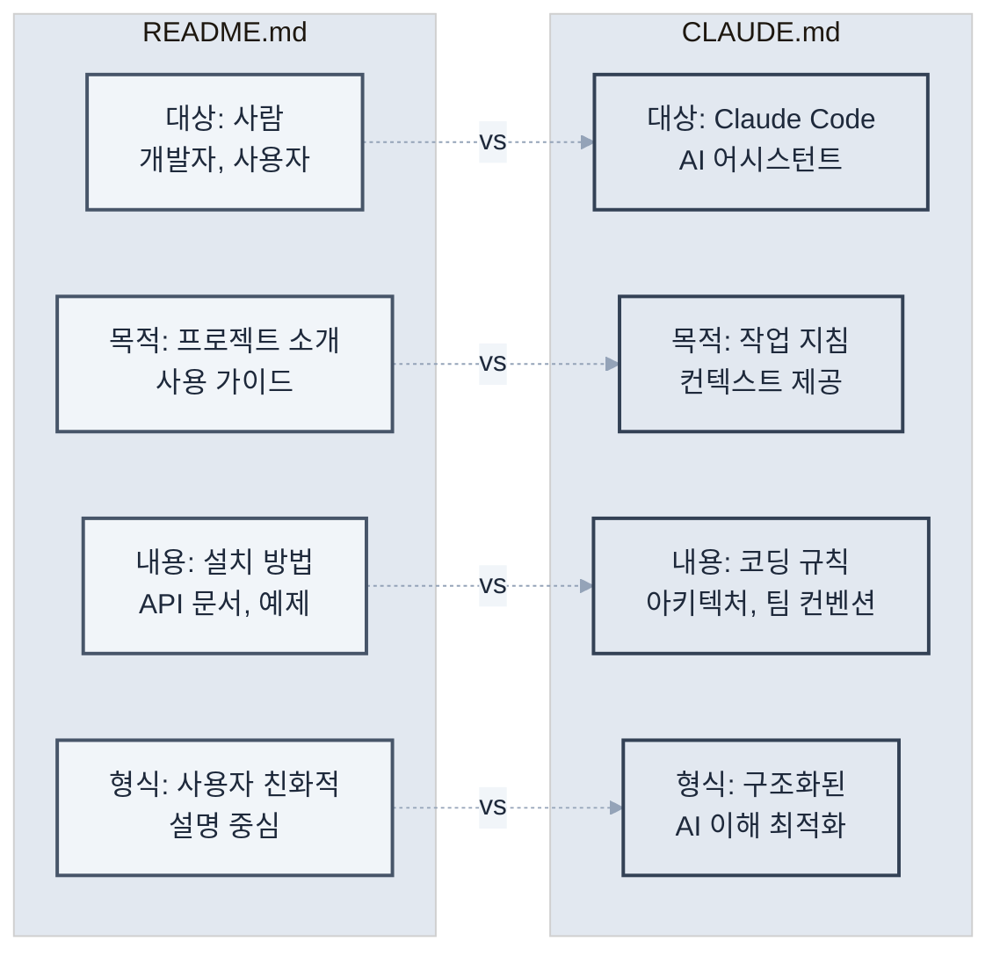

두 파일의 차이점과 각각의 역할을 명확히 이해하는 것이 중요합니다.

**실제 활용 예시**

```markdown
# README.md (사람을 위한 문서)
## 프로젝트 소개
이 프로젝트는 전자상거래 플랫폼입니다.

## 설치 방법

1. 저장소를 클론합니다.
2. `npm install` 실행
3. `npm start`로 서버 시작

---

# CLAUDE.md (Claude Code를 위한 문서)
## 프로젝트 아키텍처
- 패턴: MVC + Repository Pattern
- 프론트엔드: React 18 + TypeScript
- 백엔드: Node.js + Express
- 데이터베이스: PostgreSQL + Redis

## 코드 생성 규칙
- 모든 API 응답은 ResponseDto로 래핑
- 에러는 CustomError 클래스 사용
- 비동기 함수는 반드시 try-catch 포함
```

## 4.2 프로젝트 구조 문서화

### 기본 구조 설명

프로젝트의 디렉토리 구조와 각 파일의 역할을 명확히 정의하면 Claude Code가 더 정확한 작업을 수행할 수 있습니다. 단순한 구조 나열을 넘어서 각 디렉토리의 책임과 파일 명명 규칙까지 포함해야 합니다.

```markdown
# CLAUDE.md

## 프로젝트 구조

### 디렉토리 구조
```
src/
├── components/      # React 컴포넌트
│   ├── common/     # 공통 컴포넌트
│   ├── features/   # 기능별 컴포넌트
│   └── layouts/    # 레이아웃 컴포넌트
├── hooks/          # 커스텀 React 훅
├── services/       # API 통신 로직
├── store/          # Redux 스토어
├── utils/          # 유틸리티 함수
└── types/          # TypeScript 타입 정의
```

### 주요 파일 위치
- 환경 설정: `.env`, `.env.example`
- API 엔드포인트: `src/services/api.ts`
- 라우팅 설정: `src/routes/index.tsx`
- 전역 스타일: `src/styles/global.css`

### 파일 명명 규칙
- 컴포넌트: PascalCase (예: UserProfile.tsx)
- 유틸리티: camelCase (예: formatDate.ts)
- 상수: UPPER_SNAKE_CASE (예: API_ENDPOINTS.ts)
- 스타일: kebab-case (예: user-profile.module.css)
```

### 아키텍처 패턴 명시

프로젝트에서 사용하는 주요 아키텍처 패턴과 디자인 원칙을 명시하면 일관성 있는 코드를 생성할 수 있습니다.

```markdown
## 아키텍처 패턴

### 상태 관리
- Redux Toolkit 사용
- 각 기능별로 slice 파일 생성
- RTK Query로 API 상태 관리

### 컴포넌트 구조
```typescript
// 모든 컴포넌트는 다음 구조를 따름
interface ComponentProps {
  // props 정의
}

export const ComponentName: React.FC<ComponentProps> = (props) => {
  // 훅은 최상단에
  // 로직
  // JSX 반환
}
```

### 데이터 흐름

1. 사용자 액션 → 2. Action dispatch → 3. Reducer 처리 → 4. State 업데이트 → 5. UI 리렌더링


## 4.3 코딩 스타일 가이드 정의

### 언어별 스타일 가이드

프로젝트에서 사용하는 프로그래밍 언어별로 일관된 코딩 스타일을 정의해야 합니다. 이는 단순한 포매팅 규칙을 넘어서 코드의 가독성과 유지보수성을 높이는 핵심 요소입니다.

```markdown
## 코딩 스타일

### TypeScript/JavaScript
- 함수명: camelCase
- 컴포넌트명: PascalCase  
- 상수: UPPER_SNAKE_CASE
- 파일명: kebab-case.ts

### 명명 규칙 예시
```typescript
// 좋은 예
const getUserData = async (userId: string) => { }
const MAX_RETRY_COUNT = 3;
export const UserProfile: React.FC = () => { }

// 피해야 할 예
const get_user_data = async (userid) => { }
const maxretrycount = 3;
export const userprofile = () => { }
```

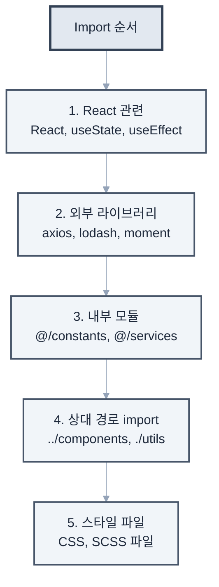

### Import 순서

```typescript
import React, { useState, useEffect } from 'react';
import { useSelector } from 'react-redux';
import axios from 'axios';

import { API_ENDPOINTS } from '@/constants';
import { UserService } from '@/services';

import { Button } from '../components';
import './styles.css';
```
```

### 코드 품질 기준

높은 품질의 코드를 유지하기 위한 구체적인 기준과 규칙을 설정합니다. 이러한 기준은 코드 리뷰 시 체크리스트로도 활용됩니다.

```markdown
## 코드 품질 기준

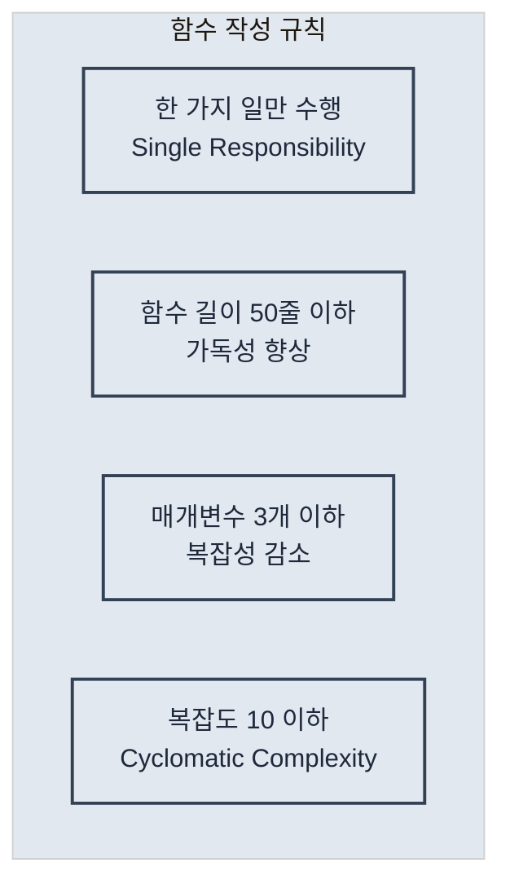

### 함수 작성 규칙

### 에러 처리
```typescript
// 모든 비동기 함수는 try-catch 사용
try {
  const data = await fetchData();
  return { success: true, data };
} catch (error) {
  console.error('Error fetching data:', error);
  return { success: false, error: error.message };
}
```

### 주석 작성
- 코드가 '무엇을' 하는지가 아닌 '왜' 하는지 설명
- JSDoc 형식으로 함수 문서화
- TODO 주석은 이슈 번호와 함께

```typescript
/**
 * 사용자 인증 토큰을 검증합니다.
 * @param token - JWT 토큰
 * @returns 토큰이 유효한지 여부
 */
const validateToken = (token: string): boolean => {
  // TODO(#123): 토큰 만료 시간 검증 로직 추가
  return jwt.verify(token, SECRET_KEY);
}
```
```

## 4.4 개발 환경 자동화

### 개발 환경 설정

일관된 개발 환경을 위한 필수 도구와 설정을 명시합니다. 새로운 팀원이 빠르게 개발 환경을 구축할 수 있도록 단계별 가이드를 제공합니다.

```markdown
## 개발 환경

### 필수 도구
- Node.js 18.0 이상
- pnpm 8.0 이상 (npm 대신 사용)
- VS Code + 추천 확장 프로그램

### 초기 설정 스크립트
```bash
# 의존성 설치
pnpm install

# 환경 변수 설정
cp .env.example .env

# 데이터베이스 마이그레이션
pnpm db:migrate

# 개발 서버 시작
pnpm dev
```

### VS Code 설정
`.vscode/settings.json` 파일이 자동으로 적용됩니다.
- 자동 포매팅 (저장 시)
- ESLint 자동 수정
- 추천 확장 프로그램 설치 알림
```

### 자동화 스크립트

반복적인 작업을 자동화하여 개발 효율성을 높이는 스크립트들을 정의합니다. 각 스크립트의 용도와 사용 시나리오를 명확히 설명합니다.

```markdown
## 자동화 스크립트

### 자주 사용하는 명령어
```json
{
  "scripts": {
    "dev": "next dev",
    "build": "next build",
    "test": "jest --watch",
    "test:ci": "jest --ci --coverage",
    "lint": "eslint . --fix",
    "type-check": "tsc --noEmit",
    "pre-commit": "lint-staged",
    "generate:component": "plop component",
    "analyze": "ANALYZE=true next build"
  }
}
```

### 코드 생성 템플릿
`pnpm generate:component` 실행 시
1. 컴포넌트 이름 입력
2. 컴포넌트 타입 선택 (일반/페이지/레이아웃)
3. 자동으로 파일 생성
   - ComponentName.tsx
   - ComponentName.test.tsx
   - ComponentName.stories.tsx
   - index.ts

### Git Hooks
- pre-commit: 린트 및 포매팅 검사
- commit-msg: 커밋 메시지 형식 검증
- pre-push: 테스트 실행

## 4.5 팀 협업을 위한 규칙 설정

### 코드 리뷰 가이드라인

효과적인 코드 리뷰를 위한 체계적인 가이드라인을 수립합니다. 단순한 체크리스트를 넘어서 리뷰어와 작성자 모두를 위한 실질적인 가이드를 제공합니다.

```markdown
## 코드 리뷰 가이드라인

### PR 작성 규칙
1. 제목: `[타입] 간단한 설명`
2. 본문 필수 포함 사항
   - 변경 사항 요약
   - 관련 이슈 번호
   - 테스트 방법
   - 스크린샷 (UI 변경 시)

### 리뷰 체크리스트
- [ ] 코드가 프로젝트 컨벤션을 따르는가?
- [ ] 테스트가 충분히 작성되었는가?
- [ ] 성능 영향은 고려되었는가?
- [ ] 보안 취약점은 없는가?
- [ ] 문서는 업데이트되었는가?

### 머지 기준
- 최소 1명의 승인 필요
- 모든 CI 체크 통과
- 충돌 해결 완료
```

### 브랜치 전략

체계적인 Git 브랜치 관리를 위한 전략과 규칙을 정의합니다. Git Flow를 기반으로 한 실용적인 브랜치 전략을 소개합니다.

```markdown
## Git 브랜치 전략

### 브랜치 명명 규칙
- feature/기능명: 새 기능 개발
- fix/이슈번호: 버그 수정
- hotfix/설명: 긴급 수정
- refactor/대상: 리팩토링

### 브랜치 플로우
```
main
  ├── develop
  │     ├── feature/user-auth
  │     ├── feature/payment
  │     └── fix/123
  └── hotfix/critical-bug
```

### 머지 전략
- feature → develop: Squash merge
- develop → main: Merge commit
- hotfix → main: Cherry-pick
```

### 팀 커뮤니케이션

효율적인 팀 협업을 위한 커뮤니케이션 및 문서화 규칙을 수립합니다. 비동기 커뮤니케이션과 문서화를 통한 지식 공유를 강조합니다.

```markdown
## 팀 커뮤니케이션

### 이슈 템플릿
버그 리포트
- 재현 단계
- 예상 동작
- 실제 동작
- 환경 정보

기능 요청
- 사용자 스토리
- 수락 기준
- 기술적 고려사항

### 일일 스탠드업
매일 오전 10시, 다음 내용 공유
1. 어제 한 일
2. 오늘 할 일
3. 블로커

### 기술 결정 기록
`docs/adr/` 디렉토리에 Architecture Decision Records 작성
- 배경
- 고려한 옵션들
- 결정 사항
- 결과
```

## 실전 예제: 대규모 전자상거래 프로젝트

실제 프로덕션 환경에서 사용할 수 있는 체계적이고 포괄적인 CLAUDE.md 예시를 살펴보겠습니다.

```markdown
# E-Commerce Project Guidelines for Claude Code

## 프로젝트 개요
대규모 전자상거래 플랫폼 (일 100만 MAU)

## 핵심 기술 스택
- Frontend: Next.js 14, TypeScript, Tailwind CSS
- State: Zustand + React Query
- Backend: Node.js, Express, PostgreSQL
- Infrastructure: AWS, Docker, K8s

## 도메인 지식

### 비즈니스 용어
- SKU: Stock Keeping Unit (재고 관리 코드)
- GMV: Gross Merchandise Volume (총 거래액)
- AOV: Average Order Value (평균 주문 금액)
- Cart Abandonment: 장바구니 이탈

### 핵심 도메인 모델
```typescript
interface Product {
  id: string;
  sku: string;
  name: string;
  price: Money;
  inventory: Inventory;
  category: Category;
}

interface Order {
  id: string;
  userId: string;
  items: OrderItem[];
  status: OrderStatus;
  payment: Payment;
  shipping: Shipping;
}
```

## 성능 요구사항
- 페이지 로드: 3초 이내
- API 응답: 200ms 이내
- 99.9% 가용성

## 보안 규칙
- 모든 사용자 입력 검증
- SQL Injection 방지
- XSS 방지
- 민감 정보 암호화

## 테스트 전략
- 단위 테스트: 80% 커버리지
- 통합 테스트: 핵심 플로우
- E2E 테스트: 구매 플로우

## 배포 프로세스
1. feature 브랜치에서 개발
2. PR 생성 및 리뷰
3. develop 브랜치 머지
4. 스테이징 자동 배포
5. QA 검증
6. 프로덕션 배포 (승인 필요)

## Claude Code 특별 지침
- 성능을 항상 고려하여 코드 작성
- 확장 가능한 아키텍처 유지
- 마이크로서비스 경계 준수
- 비동기 처리 우선
- 에러 로깅 필수
```

## 프로 팁: CLAUDE.md 최적화

### 1. 섹션별 우선순위

중요도에 따라 CLAUDE.md의 내용을 구조화하면 Claude Code가 더 효과적으로 규칙을 인식할 수 있습니다.

```markdown
# CLAUDE.md

## 🚨 중요 규칙 (항상 준수)
- 절대 main 브랜치에 직접 푸시 금지
- 모든 API 키는 환경 변수로
- 테스트 없는 코드 커밋 금지

## 📋 일반 가이드라인
- 가능하면 함수형 프로그래밍
- 주석은 최소화, 코드로 설명

## 💡 권장사항
- 새로운 라이브러리 도입 전 팀 논의
- 성능 최적화는 측정 후 진행
```

### 2. 동적 업데이트

CLAUDE.md를 업데이트했을 때 Claude Code가 새로운 규칙을 인식하도록 할 수 있습니다.

```bash
# CLAUDE.md 업데이트 시 Claude Code에게 알리기
claude "CLAUDE.md 파일이 업데이트되었어. 
새로운 규칙들을 확인하고 요약해줘"
```

### 3. 환경별 설정 관리

다양한 개발 환경에 따른 다른 설정을 체계적으로 관리할 수 있습니다.

```markdown
## 환경별 설정

### 개발 환경
- 로그 레벨: DEBUG
- 더미 데이터 사용 가능
- 에러 상세 정보 표시

### 프로덕션 환경
- 로그 레벨: ERROR
- 실제 데이터만 사용
- 에러 메시지 일반화
```

### 4. 지속적 개선과 버전 관리

CLAUDE.md 자체도 소프트웨어처럼 버전 관리하고 지속적으로 개선해야 합니다.

```markdown
## CLAUDE.md 버전 관리

### v2.1.0 (2024-03-15)
#### 추가
- 새로운 보안 규칙 (SQL Injection 방지)
- React 18 훅 사용 가이드라인

#### 변경
- TypeScript 설정을 strict 모드로 업그레이드
- API 응답 시간 기준을 200ms로 강화

#### 제거
- 구형 Internet Explorer 지원 중단

### v2.0.0 (2024-02-01)
#### 주요 변경
- 마이크로서비스 아키텍처로 전환
- 새로운 브랜치 전략 (Git Flow → GitHub Flow)
```

**개선 사이클 예시**
```bash
# 월간 CLAUDE.md 리뷰
claude "지난 한 달간 우리 팀의 개발 패턴을 분석해서
CLAUDE.md에서 개선이 필요한 부분을 찾아줘"

# 규칙 효과성 분석
claude "현재 CLAUDE.md 규칙들이 실제로 잘 지켜지고 있는지
코드베이스를 분석해서 준수율을 보고해줘"

# 새로운 규칙 제안
claude "최근 발생한 버그들을 분석해서
예방할 수 있는 새로운 규칙을 제안해줘"
```

## 마치며

이 장에서는 CLAUDE.md를 통한 프로젝트 맞춤 설정 방법을 체계적으로 학습했습니다.

### 핵심 학습 내용

**1. 전략적 설정 구성**
- **우선순위 기반 규칙 구조**: 중요도에 따른 단계적 규칙 적용
- **컨텍스트 인식**: 프로젝트 특성과 팀 문화를 반영한 맞춤 설정
- **환경별 최적화**: 개발/스테이징/프로덕션 환경에 맞는 차별화된 접근

**2. 실용적 운영 방법**
- **동적 업데이트**: 규칙 변경 시 영향도 분석과 점진적 적용
- **지속적 개선**: 데이터 기반의 규칙 효과성 측정과 개선
- **팀 협업 강화**: 명확한 가이드라인을 통한 일관된 코드 품질 유지

### 실무 적용 로드맵

**1단계: 기본 CLAUDE.md 작성 (1주)**
- 프로젝트 구조와 기본 코딩 스타일 정의
- 필수 보안 규칙과 품질 기준 설정
- 팀 커밋 메시지 규칙 통일

**2단계: 환경별 설정 분리 (2주)**
- 개발/스테이징/프로덕션 환경별 규칙 세분화
- 자동화 스크립트와 CI/CD 설정 통합
- 코드 리뷰 프로세스 표준화

**3단계: 고도화와 최적화 (지속적)**
- 팀 피드백을 바탕으로 한 규칙 개선
- 성능 메트릭 기반의 품질 기준 조정
- 새로운 기술 도입 시 가이드라인 업데이트

### CLAUDE.md의 전략적 가치

1. **일관성 보장**: 모든 팀원이 동일한 품질 기준으로 코드 생성
2. **학습 가속화**: 새로운 팀원의 빠른 온보딩과 생산성 향상
3. **지식 체계화**: 팀의 암묵적 지식을 명시적 규칙으로 전환
4. **품질 자동화**: 수동 검토 없이도 일정 품질 이상 보장
5. **문화 전파**: 팀의 개발 철학과 가치관을 코드에 반영

**중요한 것은 CLAUDE.md가 단순한 규칙 문서가 아니라, 팀의 개발 문화와 철학을 담은 살아있는 가이드북이라는 점입니다.** 정기적인 업데이트와 지속적인 개선을 통해 팀의 성장과 함께 진화하는 도구로 활용해야 합니다.

다음 장에서는 이러한 설정을 바탕으로 다양한 프레임워크별로 Claude Code를 효과적으로 활용하는 구체적인 전략과 베스트 프랙티스를 알아보겠습니다.

\newpage

# 제5장: 프레임워크별 베스트 프랙티스

> "올바른 도구를 올바른 작업에 사용하라" - 프로그래밍 격언

```mermaid
%%{init: {"theme": "base", "themeVariables": {"primaryColor": "#f8fafc", "primaryTextColor": "#1e293b", "primaryBorderColor": "#e2e8f0", "lineColor": "#94a3b8", "secondaryColor": "#f1f5f9", "tertiaryColor": "#e2e8f0"}}}%%
mindmap
  root((학습 목표))
    전략 수립
      프레임워크별 특성 이해
      최적화된 활용 전략
      개발 패턴 정립
    주요 프레임워크
      React/Next.js 마스터
      Node.js/Express 활용
      Django 개발 패턴
    코드 품질 관리
      CLAUDE.md 설정
      일관된 품질 유지
      팀 협업 규칙
    마이그레이션
      프레임워크 전환 지원
      효과적 활용 방법
      실전 적용 능력
```

## 학습 목표

## 개요

현대 소프트웨어 개발에서 프레임워크는 개발 효율성과 코드 품질을 결정하는 핵심 요소입니다. 각 프레임워크는 고유한 철학, 설계 패턴, 그리고 모범 사례를 가지고 있어, 동일한 기능이라도 프레임워크에 따라 전혀 다른 접근 방식이 요구됩니다.

Claude Code는 이러한 프레임워크별 특성을 깊이 이해하고, 각 프레임워크의 관용구와 모범 사례를 준수하는 코드를 생성할 수 있습니다. 이 장에서는 주요 프레임워크별로 Claude Code를 최적화하는 전략과 실전 활용법을 체계적으로 살펴보겠습니다.

## 5.1 React/Next.js 프로젝트

React와 Next.js는 현대 프론트엔드 개발의 핵심 기술로, 컴포넌트 기반 아키텍처와 선언적 프로그래밍을 통해 복잡한 사용자 인터페이스를 효율적으로 구축할 수 있게 해줍니다. Claude Code는 React의 함수형 컴포넌트 패턴, Next.js의 App Router 구조, 그리고 현대적인 상태 관리 라이브러리들과의 통합을 완벽히 지원합니다.

### React 프로젝트 초기 설정

React 프로젝트를 시작할 때는 프로젝트의 규모와 요구사항에 맞는 도구 선택이 중요합니다. Claude Code는 업계 표준 도구들을 조합하여 확장 가능하고 유지보수하기 쉬운 프로젝트 구조를 생성할 수 있습니다.

```bash
# Vite를 사용한 React 프로젝트 생성
claude "Vite로 새로운 React TypeScript 프로젝트를 만들어줘. 
Tailwind CSS, React Router, React Query를 포함하고,
폴더 구조도 모범 사례에 따라 설정해줘"
```

Claude Code는 다음과 같은 구조를 생성합니다.

```
src/
├── components/
│   ├── common/        # Button, Input 등 공통 컴포넌트
│   ├── features/      # 기능별 컴포넌트
│   └── layouts/       # Header, Footer 등
├── hooks/            # 커스텀 훅
├── pages/            # 라우트별 페이지 컴포넌트
├── services/         # API 통신
├── store/            # 전역 상태 관리
├── utils/            # 유틸리티 함수
└── types/            # TypeScript 타입 정의
```

### React 컴포넌트 개발 패턴

React 컴포넌트는 재사용 가능하고 테스트 가능한 단위로 설계되어야 합니다. Claude Code는 컴포넌트의 역할과 책임을 명확히 분리하고, 적절한 추상화 수준을 유지하는 컴포넌트를 생성할 수 있습니다.

**1. 컴포넌트 생성 요청 - 실전 예시**

효과적인 컴포넌트 개발을 위해서는 명확한 요구사항 정의와 함께 테스트와 문서화를 포함한 완성도 높은 요청이 필요합니다. 다음은 실제 프로젝트에서 자주 사용되는 패턴들입니다.

```bash
# 기본 컴포넌트 생성
claude "UserProfile 컴포넌트를 만들어줘. 
프로필 이미지, 이름, 소개를 표시하고,
편집 모드를 지원해야 해. 
Storybook 스토리와 테스트 코드도 함께 작성해줘"

# 고급 데이터 테이블 컴포넌트
claude "DataTable 컴포넌트를 만들어줘.
- 정렬, 필터링, 페이지네이션 지원
- 선택 가능한 행과 대량 작업
- 가상 스크롤링으로 성능 최적화
- TypeScript 제네릭으로 타입 안전성 보장
- 접근성(a11y) 준수"

# 복잡한 폼 컴포넌트
claude "MultiStepForm 컴포넌트를 만들어줘.
- React Hook Form과 Zod 검증 통합
- 단계별 진행 표시와 네비게이션
- 자동 저장과 임시 저장 기능
- 오류 상태 처리와 사용자 피드백
- 각 단계별 조건부 필드 표시"
```

**2. 상태 관리 패턴**

```bash
# 인증 상태 관리
claude "사용자 인증 상태를 전역으로 관리하는 
Context와 커스텀 훅을 만들어줘.
로그인, 로그아웃, 토큰 갱신 기능이 필요해"

# 복잡한 비즈니스 로직 상태 관리
claude "전자상거래 장바구니 상태 관리를 구현해줘.
- Zustand로 상태 저장소 구성
- 상품 추가/제거/수량 변경 로직
- 할인 쿠폰 적용과 가격 계산
- 로컬스토리지 동기화
- 비관적/낙관적 업데이트 처리"

# 서버 상태와 캐싱
claude "React Query를 활용한 서버 상태 관리를 설정해줘.
- API 응답 캐싱 전략
- 백그라운드 리페칭과 스테일 타임 설정
- 무한 스크롤 데이터 페칭
- 에러 재시도 로직과 오프라인 지원"
```

**3. 성능 최적화 전략**

```bash
# 리렌더링 최적화
claude "이 컴포넌트의 불필요한 리렌더링을 방지하도록 
React.memo, useMemo, useCallback을 적용해줘"

# 코드 스플리팅과 지연 로딩
claude "이 애플리케이션에 코드 스플리팅을 적용해줘.
- 라우트 레벨 지연 로딩
- 무거운 컴포넌트의 동적 임포트
- 라이브러리 번들 분리
- 로딩 스피너와 에러 바운더리 추가"

# 대용량 리스트 최적화
claude "10,000개 아이템을 효율적으로 렌더링하는 
가상 스크롤 컴포넌트를 구현해줘.
- react-window 라이브러리 활용
- 동적 아이템 높이 지원
- 무한 스크롤과 페이지네이션 통합"

# 이미지 최적화
claude "이미지 갤러리의 성능을 최적화해줘.
- 지연 로딩과 프리로딩 전략
- WebP 포맷 지원과 폴백
- 이미지 압축과 리사이징
- Progressive loading 구현"
```

### Next.js 특화 기능 - 실전 활용

**1. App Router 고급 패턴**

```bash
# 종합적인 블로그 시스템
claude "Next.js 14 App Router로 블로그를 만들어줘.
동적 라우팅, 메타데이터 최적화, 
그리고 ISR(Incremental Static Regeneration)을 활용해줘"

# 다국어 지원과 국제화
claude "Next.js에서 다국어 지원을 구현해줘.
- i18n 라우팅 설정
- 서버 컴포넌트에서 번역 처리
- 동적 번역 로딩과 폴백
- SEO 최적화를 위한 hreflang 태그"

# 복잡한 인증 시스템
claude "NextAuth.js로 다중 인증 제공자를 지원하는 시스템을 구현해줘.
- OAuth (Google, GitHub), 이메일, 자격증명 로그인
- 역할 기반 접근 제어 (RBAC)
- 세션 관리와 보안 강화
- API 라우트 보호 미들웨어"
```

**2. Server Components 패턴**

```bash
claude "이 페이지를 Server Component로 리팩토링해줘.
데이터 페칭은 서버에서, 인터랙션은 Client Component로 분리해줘"
```

**3. API Routes 설계**

```bash
claude "RESTful API를 Next.js API routes로 구현해줘.
미들웨어로 인증을 처리하고, Zod로 요청 검증을 추가해줘"
```

### React/Next.js CLAUDE.md 예시

```markdown
# React/Next.js Project Guidelines

## 컴포넌트 규칙
- 함수형 컴포넌트만 사용
- Props는 인터페이스로 정의
- 컴포넌트당 하나의 파일

## 상태 관리
- 로컬 상태: useState
- 서버 상태: React Query (TanStack Query)
- 전역 상태: Zustand

## 폴더 구조
```
components/
├── Button/
│   ├── Button.tsx
│   ├── Button.test.tsx
│   ├── Button.stories.tsx
│   └── index.ts
```

## 성능 최적화
- 이미지는 next/image 사용
- 동적 import로 코드 스플리팅
- Lighthouse 점수 90+ 유지
```

## 5.2 Node.js/Express 백엔드

Node.js와 Express는 JavaScript 생태계에서 가장 널리 사용되는 백엔드 기술 스택입니다. 이벤트 기반 비동기 아키텍처의 장점을 활용하여 높은 성능과 확장성을 제공하며, Claude Code는 견고하고 유지보수 가능한 서버 애플리케이션 구축을 지원합니다.

### Express 서버 구조화 - 엔터프라이즈 패턴

확장 가능한 Express 애플리케이션을 위해서는 계층화된 아키텍처와 관심사의 분리가 핵심입니다. Claude Code는 업계 표준 아키텍처 패턴을 따르는 서버 구조를 생성할 수 있습니다.

```bash
# 기본 REST API 서버
claude "Express.js로 확장 가능한 REST API 서버를 만들어줘.
계층화된 아키텍처(Controller-Service-Repository)를 사용하고,
TypeScript, JWT 인증, 에러 핸들링, 로깅을 포함해줘"

# 마이크로서비스 패턴
claude "Express로 마이크로서비스 아키텍처를 구현해줘.
- 서비스 간 통신 (HTTP/gRPC)
- API Gateway 패턴
- 서비스 디스커버리와 로드 밸런싱
- 분산 로깅과 트레이싱
- Circuit Breaker 패턴"

# 고성능 API 서버
claude "대용량 트래픽을 처리하는 Express API를 만들어줘.
- 클러스터링과 워커 프로세스 관리
- Redis를 활용한 세션과 캐싱
- 요청 제한과 DDoS 방어
- 데이터베이스 커넥션 풀링
- APM 모니터링 통합"

# GraphQL API 서버
claude "Express에 GraphQL을 통합한 API 서버를 만들어줘.
- Apollo Server 설정
- 스키마 stitching과 federation
- DataLoader를 활용한 N+1 쿼리 방지
- 인증과 권한 부여
- 쿼리 복잡도 제한"
```

**엔터프라이즈급 프로젝트 구조**

```mermaid
%%{init: {"theme": "base", "themeVariables": {"primaryColor": "#f8fafc", "primaryTextColor": "#1e293b", "primaryBorderColor": "#e2e8f0", "lineColor": "#94a3b8", "secondaryColor": "#f1f5f9", "tertiaryColor": "#e2e8f0"}}}%%
graph TD
    A[src/] --> B[controllers/]
    A --> C[services/]
    A --> D[repositories/]
    A --> E[models/]
    A --> F[middleware/]
    A --> G[routes/]
    A --> H[config/]
    A --> I[utils/]
    A --> J[types/]
    A --> K[tests/]
    A --> L[docs/]
    
    B -.-> |HTTP 요청/응답 처리| B1[Request Handler]
    C -.-> |비즈니스 로직| C1[Business Logic]
    D -.-> |데이터 액세스 계층| D1[Data Access]
    E -.-> |데이터 모델과 스키마| E1[Schema Definition]
    F -.-> |인증, 로깅, 검증| F1[Middleware Functions]
    G -.-> |API 라우트 정의| G1[Route Definitions]
    H -.-> |환경 설정| H1[Configuration]
    I -.-> |공통 유틸리티| I1[Utility Functions]
    J -.-> |TypeScript 타입 정의| J1[Type Definitions]
    K -.-> |테스트 파일| K1[Test Suites]
    L -.-> |API 문서| L1[Documentation]
```

**계층별 책임 분리**

```mermaid
%%{init: {"theme": "base", "themeVariables": {"primaryColor": "#f8fafc", "primaryTextColor": "#1e293b", "primaryBorderColor": "#e2e8f0", "lineColor": "#94a3b8", "secondaryColor": "#f1f5f9", "tertiaryColor": "#e2e8f0"}}}%%
graph LR
    A[Controllers] --> B[Services]
    B --> C[Repositories]
    C --> D[Models]
    
    A1[요청/응답 처리] -.-> A
    B1[비즈니스 로직] -.-> B
    C1[데이터 접근] -.-> C
    D1[데이터 모델] -.-> D
    
    E[Middlewares] -.-> A
    F[Utils] -.-> B
    G[Config] -.-> B
    H[Types] -.-> A
    H -.-> B
    H -.-> C
```

### 백엔드 개발 패턴

**1. RESTful API 설계**

```bash
claude "사용자 관리를 위한 RESTful API를 설계해줘.
CRUD 작업, 페이지네이션, 필터링, 정렬을 지원하고,
OpenAPI(Swagger) 문서도 자동 생성되도록 해줘"
```

**2. 데이터베이스 통합**

```bash
claude "Prisma ORM을 사용해서 User, Post, Comment 모델을 만들어줘.
관계 설정, 마이그레이션, 시드 데이터도 포함해줘"
```

**3. 인증/인가 구현**

```bash
claude "JWT 기반 인증 시스템을 구현해줘.
액세스 토큰과 리프레시 토큰을 사용하고,
역할 기반 접근 제어(RBAC)도 추가해줘"
```

### 마이크로서비스 아키텍처

```bash
claude "이 모놀리식 앱을 마이크로서비스로 분해해줘.
User Service, Product Service, Order Service로 나누고,
API Gateway와 서비스 간 통신 방법도 설계해줘"
```

### Node.js/Express CLAUDE.md 예시

```markdown
# Node.js/Express API Guidelines

## API 설계 원칙
- RESTful 원칙 준수
- 일관된 응답 형식
- 적절한 HTTP 상태 코드 사용

## 응답 형식
```json
{
  "success": true,
  "data": {},
  "message": "Success",
  "timestamp": "2024-01-01T00:00:00Z"
}
```

## 에러 처리
- 모든 에러는 중앙 에러 핸들러로
- 에러 로깅 필수
- 클라이언트에게는 일반화된 메시지

## 보안
- 모든 엔드포인트 rate limiting
- SQL Injection 방지
- 입력 검증 필수
```

## 5.3 Python/Django 애플리케이션

Django는 "battery included" 철학을 기반으로 하는 Python 웹 프레임워크로, 강력한 ORM, 관리자 인터페이스, 그리고 보안 기능을 내장하고 있습니다. Django REST Framework와 함께 사용하면 견고한 API 서버를 빠르게 구축할 수 있으며, Claude Code는 Django의 모범 사례를 준수하는 확장 가능한 애플리케이션 개발을 지원합니다.

### Django 프로젝트 설정

Django 프로젝트의 성공은 초기 설정과 아키텍처 설계에서 결정됩니다. Claude Code는 Django의 앱 기반 모듈화와 설정 관리 모범 사례를 따르는 프로젝트 구조를 생성할 수 있습니다.

```bash
claude "Django REST Framework로 블로그 API를 만들어줘.
사용자 인증, 포스트 CRUD, 댓글, 태그 기능을 포함하고,
테스트 코드와 API 문서화도 설정해줘"
```

### Django 개발 패턴

**1. 모델 설계**

```bash
claude "전자상거래를 위한 Django 모델을 설계해줘.
Product, Category, Order, User 모델과 관계를 정의하고,
Admin 인터페이스도 커스터마이징해줘"
```

**2. ViewSet과 Serializer**

```bash
claude "Product 모델에 대한 ViewSet과 Serializer를 만들어줘.
필터링, 검색, 정렬을 지원하고,
중첩된 관계도 효율적으로 처리해줘"
```

**3. 비동기 태스크**

```bash
claude "Celery를 사용해서 이메일 발송과 
이미지 처리를 비동기로 처리하도록 설정해줘"
```

### Python/Django CLAUDE.md 예시

```markdown
# Django Project Guidelines

## 앱 구조
- 기능별로 앱 분리
- 앱당 최대 10개 모델
- 순환 의존성 금지

## 모델 설계
- 모든 모델에 created_at, updated_at
- soft delete 사용 (is_deleted 필드)
- 관계는 명시적으로 정의

## API 설계
- ViewSet 사용 권장
- 커스텀 액션은 @action 데코레이터
- 페이지네이션 기본 20개

## 테스트
- 모델, 뷰, 시리얼라이저 각각 테스트
- Factory Boy로 테스트 데이터 생성
- 커버리지 80% 이상
```

## 5.4 모바일 앱 개발 (React Native/Flutter)

모바일 앱 개발 영역에서 크로스 플랫폼 솔루션은 개발 효율성과 유지보수성을 크게 향상시킵니다. React Native는 JavaScript와 React 지식을 활용한 네이티브 앱 개발을, Flutter는 Dart 언어를 통한 고성능 UI 구현을 가능하게 합니다. Claude Code는 각 플랫폼의 특성을 이해하고 플랫폼별 최적화된 코드를 생성할 수 있습니다.

### React Native 프로젝트

React Native는 React의 컴포넌트 모델을 모바일 환경에 적용한 프레임워크로, 웹 개발 경험을 활용하여 네이티브 모바일 앱을 개발할 수 있게 해줍니다.

```bash
claude "Expo로 크로스 플랫폼 모바일 앱을 만들어줘.
네비게이션, 상태 관리, 네이티브 기능 접근을 설정하고,
iOS와 Android 스타일 차이도 처리해줘"
```

### React Native 개발 패턴

**1. 네비게이션 구조**

```bash
claude "React Navigation으로 복잡한 네비게이션을 구현해줘.
Tab Navigator, Stack Navigator, Drawer를 조합하고,
딥링킹도 설정해줘"
```

**2. 네이티브 모듈 통합**

```bash
claude "카메라와 위치 정보에 접근하는 기능을 구현해줘.
권한 요청 처리와 에러 핸들링도 포함해줘"
```

### Flutter 프로젝트

```bash
claude "Flutter로 Material Design 앱을 만들어줘.
다국어 지원, 다크 모드, 반응형 레이아웃을 포함하고,
Clean Architecture 패턴을 적용해줘"
```

### 모바일 앱 CLAUDE.md 예시

```markdown
# Mobile App Guidelines

## 아키텍처
- MVVM 패턴 사용
- 비즈니스 로직은 ViewModel에
- View는 상태만 표시

## 성능
- 리스트는 가상화 필수
- 이미지 최적화 및 캐싱
- 애니메이션 60fps 유지

## 플랫폼별 처리
```javascript
Platform.select({
  ios: { /* iOS 스타일 */ },
  android: { /* Android 스타일 */ }
})
```

## 테스트
- 컴포넌트 테스트: Jest
- E2E 테스트: Detox
- 플랫폼별 테스트 필수
```

## 5.5 데이터 과학 프로젝트 - MLOps 통합

데이터 과학과 머신러닝 분야는 탐색적 분석에서 프로덕션 배포까지 다양한 단계를 거치는 복잡한 워크플로우를 가지고 있습니다. Claude Code는 데이터 과학자들이 사용하는 주요 도구들과 현대적인 MLOps 파이프라인을 이해하여, 실험부터 배포까지 전체 프로세스를 지원할 수 있습니다.

### 현대적 데이터 과학 스택

데이터 과학 프로젝트의 성공을 위해서는 단순한 분석 도구를 넘어서 재현 가능하고 확장 가능한 MLOps 파이프라인이 필요합니다.

```mermaid
%%{init: {"theme": "base", "themeVariables": {"primaryColor": "#f8fafc", "primaryTextColor": "#1e293b", "primaryBorderColor": "#e2e8f0", "lineColor": "#94a3b8", "secondaryColor": "#f1f5f9", "tertiaryColor": "#e2e8f0"}}}%%
graph TB
    subgraph "데이터 수집"
        A1[Raw Data] --> A2[Data Pipeline]
        A2 --> A3[Clean Data]
    end
    
    subgraph "실험 및 개발"
        B1[Jupyter Notebooks] --> B2[Feature Engineering]
        B2 --> B3[Model Training]
        B3 --> B4[Experiment Tracking]
    end
    
    subgraph "모델 운영"
        C1[Model Registry] --> C2[API Serving]
        C2 --> C3[Monitoring]
        C3 --> C4[Retraining]
        C4 --> C1
    end
    
    A3 --> B1
    B4 --> C1
    C3 --> A2
```

### Jupyter Notebook 환경

Jupyter Notebook은 데이터 과학 프로젝트의 핵심 도구로, 코드, 시각화, 문서를 하나의 환경에서 통합적으로 관리할 수 있게 해줍니다. Claude Code는 재현 가능하고 체계적인 분석 환경 구축을 지원합니다.

```bash
claude "머신러닝 프로젝트를 위한 Jupyter 환경을 설정해줘.
데이터 분석, 시각화, 모델 학습 파이프라인을 구축하고,
실험 추적도 설정해줘"
```

### 데이터 분석 워크플로우 - 산업 표준 접근

**1. 데이터 전처리 파이프라인**

```bash
# 기본 데이터 전처리
claude "이 CSV 데이터를 분석하고 전처리해줘.
결측치 처리, 이상치 탐지, 특성 엔지니어링을 수행하고,
각 단계를 시각화해줘"

# 고급 특성 엔지니어링
claude "시계열 데이터의 특성 엔지니어링을 구현해줘.
- 시간 기반 특성 생성 (lag, rolling window)
- 계절성과 트렌드 분해
- Fourier 변환을 통한 주기 특성
- 스케일링과 정규화 파이프라인
- 범주형 변수 인코딩 전략"

# 대용량 데이터 처리
claude "Dask를 활용한 대용량 데이터 전처리 파이프라인을 만들어줘.
- 청크 단위 병렬 처리
- 메모리 효율적인 데이터 로딩
- 분산 컴퓨팅 환경 설정
- 진행 상황 모니터링"
```

**2. 모델 개발과 실험 관리**

```bash
# AutoML과 모델 비교
claude "여러 머신러닝 모델을 비교 평가해줘.
교차 검증, 하이퍼파라미터 튜닝을 수행하고,
결과를 표로 정리해줘"

# 딥러닝 모델 개발
claude "PyTorch로 이미지 분류 모델을 구현해줘.
- 전이학습 (Transfer Learning) 활용
- 데이터 증강과 정규화
- 학습률 스케줄링과 조기 종료
- 모델 체크포인트와 재개 기능
- TensorBoard 시각화"

# MLflow 실험 추적
claude "MLflow를 활용한 실험 추적 시스템을 구축해줘.
- 모델 메트릭과 파라미터 로깅
- 아티팩트 버전 관리
- 모델 레지스트리 설정
- A/B 테스트 프레임워크
- 실험 비교 대시보드"
```

**3. 모델 배포와 운영**

```bash
# API 서빙
claude "학습된 모델을 FastAPI로 서빙하는 API를 만들어줘.
입력 검증, 예측, 모니터링 기능을 포함해줘"

# 실시간 예측 시스템
claude "Kafka와 Redis를 활용한 실시간 ML 파이프라인을 구축해줘.
- 스트리밍 데이터 전처리
- 실시간 특성 저장소
- 배치와 온라인 예측 통합
- 모델 성능 모니터링
- 자동 재학습 트리거"

# 컨테이너 배포
claude "Docker와 Kubernetes로 ML 모델을 배포해줘.
- 멀티 스테이지 Docker 빌드
- GPU 지원 컨테이너
- 오토스케일링 설정
- 헬스체크와 로그 수집
- CI/CD 파이프라인 통합"

# 모델 모니터링
claude "프로덕션 ML 모델 모니터링 시스템을 구축해줘.
- 데이터 드리프트 탐지
- 모델 성능 저하 알림
- 편향성 모니터링
- 설명 가능한 AI 대시보드
- 사고 대응 플레이북"
```

### 데이터 과학 CLAUDE.md 예시

현대적인 데이터 과학 프로젝트를 위한 포괄적인 가이드라인

```markdown
# Data Science Project Guidelines

## 프로젝트 구조
```
project/
├── data/           # 원본 데이터
├── notebooks/      # 실험 노트북
├── src/           # 재사용 가능한 코드
├── models/        # 학습된 모델
└── reports/       # 분석 결과
```

## 코딩 규칙
- 노트북은 실험용, 프로덕션 코드는 .py로
- 모든 실험은 추적 가능하게
- 재현 가능성 보장 (시드 고정)

## 데이터 처리
- 원본 데이터는 수정하지 않음
- 전처리 파이프라인 문서화
- 데이터 버전 관리

## 모델 관리
- MLflow로 실험 추적
- 모델 버전 관리
- A/B 테스트 지원
```

## 프레임워크 독립적인 베스트 프랙티스

프레임워크별 특화된 접근 방식 외에도, 모든 프레임워크에 공통적으로 적용할 수 있는 핵심 원칙들이 있습니다. 이러한 원칙들을 이해하고 적용하면 어떤 프레임워크를 사용하든 일관된 품질의 결과를 얻을 수 있습니다.

### 1. 초기 탐색 전략

새로운 프로젝트나 기존 프로젝트에 참여할 때는 체계적인 탐색과 이해가 성공의 핵심입니다. Claude Code는 프로젝트의 전체적인 구조와 맥락을 파악하는 데 도움을 줄 수 있습니다.

```bash
# 새 프로젝트 시작 시
claude "이 프로젝트의 구조와 사용된 기술 스택을 분석해줘.
주요 파일들의 역할과 데이터 흐름을 설명해줘"
```

### 2. 점진적 개선

```bash
# 기존 코드 개선
claude "이 코드를 리팩토링해줘. 
먼저 테스트를 작성해서 동작을 보장한 후,
단계별로 개선해줘"
```

### 3. 문서화 자동화

```bash
# 문서 생성
claude "프로젝트의 README.md를 업데이트해줘.
설치 방법, 사용법, API 문서, 기여 가이드를 포함해줘"
```

### 4. 성능 프로파일링

```bash
# 성능 분석
claude "이 애플리케이션의 성능을 프로파일링하고,
병목 지점을 찾아서 최적화 방안을 제시해줘"
```

## 실전 팁: 프레임워크 전환과 현대화

프레임워크 마이그레이션은 기술 부채 해결과 성능 개선을 위한 중요한 프로젝트입니다. Claude Code는 체계적이고 위험을 최소화하는 마이그레이션 전략을 수립하고 실행하는 데 도움을 줄 수 있습니다.

### 레거시 시스템 현대화 전략

기존 시스템을 현대적인 아키텍처로 전환하는 것은 단순한 코드 변환을 넘어서 전체적인 시스템 재설계를 의미합니다.

### 마이그레이션 전략 수립 - 실전 사례

기존 프로젝트를 다른 프레임워크로 마이그레이션할 때는 단계적이고 점진적인 접근이 필요합니다.

```mermaid
%%{init: {"theme": "base", "themeVariables": {"primaryColor": "#f8fafc", "primaryTextColor": "#1e293b", "primaryBorderColor": "#e2e8f0", "lineColor": "#94a3b8", "secondaryColor": "#f1f5f9", "tertiaryColor": "#e2e8f0"}}}%%
graph TD
    A[현재 시스템 분석] --> B[마이그레이션 계획 수립]
    B --> C[파일럿 프로젝트]
    C --> D{성공 여부}
    D -->|성공| E[단계별 마이그레이션]
    D -->|실패| F[계획 수정]
    F --> C
    E --> G[성능 검증]
    G --> H{목표 달성}
    H -->|아니오| I[최적화]
    I --> G
    H -->|예| J[전체 시스템 전환]
    J --> K[모니터링 및 유지보수]
    
    style A fill:#e2e8f0
    style J fill:#dcfce7
    style K fill:#dcfce7
```

```bash
# 1. 의존성 및 아키텍처 분석
claude "이 Express 앱의 핵심 기능과 구조를 분석해줘.
- 의존성 트리와 순환 참조 확인
- 비즈니스 크리티컬 모듈 식별
- 테스트 커버리지 평가
- 성능 병목 지점 파악"

# 2. 상세한 마이그레이션 로드맵
claude "이 앱을 Fastify로 마이그레이션하는 계획을 세워줘.
- Strangler Fig 패턴 적용
- 단계별 롤백 계획
- 성능 벤치마크 설정
- 팀 교육 일정 포함
- 리스크 평가와 완화 전략"

# 3. 점진적 마이그레이션 실행
claude "인증 모듈부터 Fastify로 마이그레이션해줘.
- 트래픽 스플리팅 구현
- 모니터링과 알림 설정
- 데이터 일관성 보장
- 자동화된 테스트 스위트
- 성능 회귀 감지"

# 4. 복잡한 프론트엔드 마이그레이션
claude "React 클래스 컴포넌트를 함수형으로 마이그레이션해줘.
- 생명주기를 훅으로 변환
- 상태 관리 현대화
- 코드 분할과 지연 로딩 적용
- TypeScript 타입 안전성 강화
- 성능 최적화 기회 식별"

# 5. 데이터베이스 마이그레이션
claude "MySQL에서 PostgreSQL로 마이그레이션 계획을 세워줘.
- 스키마 변환과 데이터 타입 매핑
- 무중단 데이터 이전 전략
- 쿼리 최적화와 성능 튜닝
- 백업과 복구 절차
- 검증과 테스트 계획"
```

### 프레임워크별 성공 지표

각 프레임워크 전환 프로젝트의 성공을 측정하기 위한 구체적인 KPI를 설정하는 것이 중요합니다.

```bash
# 성능 지표 모니터링
claude "마이그레이션 전후 성능 비교 대시보드를 만들어줘.
- 응답 시간과 처리량 비교
- 메모리 사용량과 CPU 효율성
- 번들 크기와 로딩 시간
- 사용자 경험 메트릭 (LCP, FID, CLS)
- 개발자 생산성 지표"

# 품질 지표 추적
claude "코드 품질 개선 사항을 추적하는 시스템을 구축해줘.
- 테스트 커버리지 변화
- 코드 복잡도 감소
- 보안 취약점 해결
- 기술 부채 감소
- 팀 만족도 조사"
```

## 마치며

프레임워크별 베스트 프랙티스를 숙지하는 것은 Claude Code를 효과적으로 활용하는 핵심입니다. 각 프레임워크는 고유한 철학과 설계 원칙을 가지고 있으며, 이를 이해하고 적용하는 것이 성공적인 개발의 기반이 됩니다.

### 핵심 성공 요소

```mermaid
%%{init: {"theme": "base", "themeVariables": {"primaryColor": "#f8fafc", "primaryTextColor": "#1e293b", "primaryBorderColor": "#e2e8f0", "lineColor": "#94a3b8", "secondaryColor": "#f1f5f9", "tertiaryColor": "#e2e8f0"}}}%%
mindmap
  root((프레임워크 성공 요소))
    생태계 이해
      철학과 원칙
        핵심 개념 숙지
        설계 원칙 준수
      관용구와 패턴
        커뮤니티 모범 사례
        검증된 관례 적용
      도구 체인
        전용 도구 활용
        라이브러리 생태계
    실전 적용
      점진적 도입
        단계적 접근
        리스크 최소화
      성능 중심
        최적화 전략
        벤치마킹
      팀 교육
        체계적 학습
        지식 공유
    지속적 개선
      모니터링
        정량적 측정
        성과 추적
      피드백 루프
        프로세스 개선
        팀 의견 수렴
      최신 동향
        업데이트 추적
        신기능 학습
```

### 실무 체크리스트

**프로젝트 시작**

- [ ] 프레임워크별 CLAUDE.md 파일 작성
- [ ] 팀 코딩 컨벤션과 스타일 가이드 수립
- [ ] 개발 환경과 도구 체인 표준화
- [ ] 성능 벤치마크와 품질 기준 설정

**개발 과정**

- [ ] 프레임워크 모범 사례 준수 여부 코드 리뷰
- [ ] 정기적인 성능 프로파일링과 최적화
- [ ] 자동화된 테스트와 CI/CD 파이프라인 운영
- [ ] 기술 부채 관리와 리팩토링 계획

**마이그레이션 프로젝트**

- [ ] 상세한 마이그레이션 로드맵과 리스크 평가
- [ ] 점진적 전환을 위한 브리징 전략
- [ ] 성능과 안정성 회귀 방지 체계
- [ ] 팀 교육과 지식 전수 프로그램

**Claude Code의 진정한 가치는 단순히 코드를 생성하는 것이 아니라, 각 프레임워크의 철학과 모범 사례를 팀 전체가 일관되게 적용할 수 있도록 돕는 데 있습니다.** 이를 통해 개발 품질의 표준화와 팀 생산성의 극대화를 동시에 달성할 수 있습니다.

다음 장에서는 프로그래밍 언어별로 Claude Code를 최적화하는 전략을 살펴보겠습니다. 언어의 고유한 특성과 생태계를 이해하여 더욱 효과적인 개발 환경을 구축하는 방법을 탐구해봅시다.

\newpage

# 제6장: 언어별 활용 전략

> "언어는 사고를 형성한다" - 벤자민 리 워프

```mermaid
%%{init: {"theme": "base", "themeVariables": {"primaryColor": "#f8fafc", "primaryTextColor": "#1e293b", "primaryBorderColor": "#e2e8f0", "lineColor": "#94a3b8", "secondaryColor": "#f1f5f9", "tertiaryColor": "#e2e8f0"}, "flowchart": {"htmlLabels": false, "useMaxWidth": false}}}%%
mindmap
  root((학습 목표))
    전략 수립
      언어별 최적화 전략
      개발 환경 구성
      도구 체인 선택
    타입 시스템 활용
      타입 안전성 보장
      정적 분석 도구
      런타임 검증
    멀티 언어 프로젝트
      언어 간 상호 운용성
      API 인터페이스 설계
      타입 공유 전략
    언어 선택 가이드
      요구사항 분석
      성능 vs 생산성
      팀 역량 고려
```

## 학습 목표

이 장을 완료하면 다음을 할 수 있습니다.

- 주요 프로그래밍 언어별 Claude Code 최적화 전략을 수립할 수 있습니다.
- 언어별 타입 시스템과 안전성 기능을 효과적으로 활용할 수 있습니다.
- 언어 간 상호 운용성을 고려한 멀티 언어 프로젝트를 설계할 수 있습니다.
- 프로젝트 요구사항에 따라 최적의 프로그래밍 언어를 선택할 수 있습니다.

## 개요

프로그래밍 언어는 단순한 도구를 넘어서 개발자의 사고 방식과 문제 해결 접근법을 형성하는 중요한 요소입니다. 각 언어는 고유한 철학, 문법, 그리고 생태계를 가지고 있으며, 이러한 특성을 깊이 이해하고 활용하는 것이 성공적인 개발의 핵심입니다.

Claude Code는 다양한 프로그래밍 언어의 특성과 모범 사례를 이해하고 있어, 각 언어의 장점을 최대한 활용하는 코드를 생성할 수 있습니다. 이 장에서는 주요 프로그래밍 언어별로 Claude Code를 최적화하는 전략과 실전 활용법을 체계적으로 살펴보겠습니다.

## 6.1 TypeScript/JavaScript

TypeScript와 JavaScript는 현대 웹 개발 생태계의 중심이며, 동적 타이핑의 유연성과 정적 타이핑의 안전성을 모두 제공합니다. Claude Code는 TypeScript의 강력한 타입 시스템을 활용하여 안전하고 유지보수 가능한 코드를 생성하며, JavaScript의 함수형 프로그래밍 패러다임과 비동기 처리 특성을 최적화할 수 있습니다.

### TypeScript 엔터프라이즈 프로젝트 설정

견고한 TypeScript 프로젝트는 엄격한 타입 체크와 현대적인 개발 도구의 통합에서 시작됩니다. Claude Code는 프로젝트의 규모와 요구사항에 맞는 최적의 설정을 제안할 수 있습니다.

```bash
# 기본 TypeScript 프로젝트 설정
claude "엄격한 타입 체크를 사용하는 TypeScript 프로젝트를 설정해줘.
tsconfig.json을 최적화하고, ESLint와 Prettier도 TypeScript에 맞게 구성해줘"

# 대규모 모노레포 설정
claude "대규모 TypeScript 모노레포를 설정해줘.
- Nx 워크스페이스 구성
- 프로젝트 간 의존성 관리
- 공유 라이브러리 빌드 시스템
- 컨시스턴트 코드 스타일 적용
- 사이클릭 의존성 감지"

# 마이크로프론트엔드 아키텍처
claude "TypeScript 마이크로프론트엔드 아키텍처를 구성해줘.
- Module Federation 설정
- 런타임 타입 안전성 보장
- 사이드카 로딩과 버전 관리
- 공유 상태 및 이벤트 처리
- 테스트 전략과 목 설정"
```

**엔터프라이즈급 tsconfig.json 설정**

```json
{
  "compilerOptions": {
    // 최신 자바스크립트 표준 지원
    "target": "ES2022",
    "module": "ESNext",
    "lib": ["ES2022", "DOM", "DOM.Iterable"],
    
    // 최대 타입 안전성
    "strict": true,
    "noUncheckedIndexedAccess": true,
    "noImplicitOverride": true,
    "exactOptionalPropertyTypes": true,
    "noImplicitReturns": true,
    "noFallthroughCasesInSwitch": true,
    "noUncheckedSideEffectImports": true,
    
    // 추가 엄격성 옵션
    "allowUnusedLabels": false,
    "allowUnreachableCode": false,
    "forceConsistentCasingInFileNames": true,
    "skipLibCheck": true,
    
    // 모든 타입 및 내보내기
    "moduleResolution": "bundler",
    "allowImportingTsExtensions": true,
    "noEmit": true,
    "isolatedModules": true,
    
    // 성능 최적화
    "incremental": true,
    "tsBuildInfoFile": ".tsbuildinfo",
    
    // 경로 매핑
    "baseUrl": ".",
    "paths": {
      "@/*": ["./src/*"],
      "@/components/*": ["./src/components/*"],
      "@/utils/*": ["./src/utils/*"],
      "@/types/*": ["./src/types/*"]
    }
  },
  "include": [
    "src/**/*",
    "types/**/*",
    "tests/**/*"
  ],
  "exclude": [
    "node_modules",
    "dist",
    "build",
    "coverage"
  ]
}
```

### 고급 TypeScript 타입 패턴

TypeScript의 진정한 장점은 단순한 타입 체크를 넘어서 복잡한 비즈니스 로직을 타입 레벨에서 강제할 수 있다는 점입니다.

```bash
# Branded Types로 비즈니스 규칙 적용
claude "Branded Types를 사용해서 비즈니스 로직 안전성을 보장해줘.
- UserId, Email, PhoneNumber 등 도메인 타입 정의
- 런타임 검증 함수와 연동
- API 응답 타입 안전성 보장
- 데이터베이스 스키마와 동기화"

# Conditional Types로 API 타입 자동 생성
claude "Conditional Types를 활용해서 OpenAPI 스키마에서 
TypeScript 타입을 자동 생성하는 시스템을 만들어줘.
- Path Parameter와 Query Parameter 타입 추론
- Response 타입 자동 매핑
- HTTP Status Code별 타입 구분
- 에러 타입 유니온 생성"

# Template Literal Types로 DSL 구현
claude "Template Literal Types를 사용해서 타입 안전한 DSL을 만들어줘.
- CSS-in-JS 타입 체크
- SQL 쿼리 빌더 타입 안전성
- Event Name 자동 완성
- i18n 키 유효성 검사"
```

### 성능 최적화된 TypeScript 패턴

대규모 TypeScript 애플리케이션에서는 컴파일 시간과 런타임 성능 모두를 고려해야 합니다.

```bash
# 점진적 타입 로딩
claude "대규모 프로젝트의 TypeScript 컴파일 성능을 최적화해줘.
- Project References로 점진적 빌드
- Type-only imports 활용
- 사용하지 않는 타입 제거
- 동적 import로 타입 로딩 최적화
- Watch mode 성능 튜닝"

# 런타임 타입 검증 최적화
claude "런타임 타입 검증을 성능에 영향 없이 구현해줘.
- Zod로 런타임 스키마 검증
- Type Guards 최적화
- 비동기 검증 배칭
- 캐시 전략과 메모이제이션
- 에러 바운더리와 로깅"

### 타입 안전성 극대화

**1. 고급 타입 활용**

```bash
claude "이 JavaScript 코드를 TypeScript로 마이그레이션해줘.
유니온 타입, 제네릭, 조건부 타입을 활용해서
타입 안전성을 최대한 확보해줘"
```

**2. 타입 추론 개선**

```bash
claude "이 함수의 반환 타입이 너무 넓게 추론되고 있어.
타입 가드와 const assertion을 사용해서 더 정확한 타입을 추론하도록 해줘"
```

**3. Zod를 활용한 런타임 검증**

```bash
claude "API 응답을 Zod 스키마로 검증하는 시스템을 만들어줘.
타입스크립트 타입도 자동으로 생성되도록 해줘"
```

### JavaScript 모던 패턴

**1. 함수형 프로그래밍**

```bash
claude "이 명령형 코드를 함수형 스타일로 리팩토링해줘.
불변성을 유지하고, 순수 함수를 사용하며,
함수 조합으로 로직을 구성해줘"
```

**2. 비동기 처리 최적화**

```bash
claude "여러 API 호출을 효율적으로 처리하도록 최적화해줘.
Promise.all, Promise.allSettled를 적절히 사용하고,
에러 처리와 재시도 로직도 추가해줘"
```

### TypeScript/JavaScript CLAUDE.md 예시

```markdown
# TypeScript/JavaScript Guidelines

## 타입 정의 규칙
- 인터페이스 > 타입 별칭 (확장 가능한 경우)
- any 사용 금지 (unknown 사용)
- 명시적 반환 타입 선호

## 비동기 처리
```typescript
// 좋은 예
const fetchData = async (): Promise<Result<Data, Error>> => {
  try {
    const data = await api.get('/data');
    return { ok: true, value: data };
  } catch (error) {
    return { ok: false, error };
  }
};
```

## 불변성
- Object.freeze() 활용
- Spread 연산자로 복사
- Immer 라이브러리 사용 고려

## 에러 처리
- Error 클래스 상속하여 커스텀 에러 생성
- 에러 바운더리 활용
- 타입 안전한 에러 처리
```

### TypeScript 실전 디버깅과 모니터링

```bash
# 고급 디버깅 설정
claude "TypeScript 프로젝트에 고급 디버깅 환경을 설정해줘.
- Source Map 최적화로 디버깅 성능 향상
- Chrome DevTools 연동
- TypeScript 컴파일러 에러 추적
- 런타임 성능 프로파일링
- 메모리 누수 탐지 도구"

# 프로덕션 모니터링
claude "TypeScript 애플리케이션의 프로덕션 모니터링을 설정해줘.
- 런타임 타입 에러 수집
- 성능 병목 지점 추적
- 번들 크기 모니터링
- TypeScript 컴파일 시간 추적
- 코드 커버리지 리포트"
```

## 6.2 Python - 엔터프라이즈 파이썬

Python은 "읽기 쉬운 코드"를 철학으로 하는 언어로, 명확하고 간결한 문법을 통해 복잡한 문제를 우아하게 해결할 수 있게 해줍니다. Claude Code는 Python의 동적 특성과 Duck Typing의 장점을 활용하면서도, 타입 힌트와 정적 분석 도구를 통해 코드의 안정성을 높이는 모던 Python 개발 패턴을 지원합니다.

### Python 엔터프라이즈 프로젝트 구조화

확장 가능한 Python 프로젝트는 명확한 패키지 구조와 의존성 관리에서 시작됩니다. Claude Code는 PEP 표준을 준수하는 프로젝트 구조와 현대적인 개발 도구 설정을 제안할 수 있습니다.

```bash
# 기본 Python 프로젝트 설정
claude "Python 패키지 구조를 모범 사례에 따라 설정해줘.
pyproject.toml, 가상 환경, 타입 힌트, 
그리고 테스트 설정을 포함해줘"

# 대규모 FastAPI 애플리케이션
claude "FastAPI로 엔터프라이즈급 API 서버를 구축해줘.
- 비동기 데이터베이스 연동 (SQLAlchemy 2.0)
- Pydantic v2로 데이터 검증
- OAuth2/JWT 인증 시스템
- 마이크로서비스 아키텍처 대비
- 모니터링과 로깅 시스템"

# 데이터 엔지니어링 파이프라인
claude "Apache Airflow로 대용량 데이터 파이프라인을 구축해줘.
- ETL 워크플로우 자동화
- Pandas/Polars 성능 최적화
- 대용량 데이터 비동기 처리
- 에러 복구와 재시도 로직
- 모니터링과 알림 시스템"

# 머신러닝 프로덕션 시스템
claude "MLOps 파이프라인을 Python으로 구축해줘.
- MLflow로 실험 추적과 모델 버전 관리
- Celery로 비동기 매치 학습
- FastAPI로 모델 서빙 API
- 실시간 모델 모니터링
- A/B 테스트 프레임워크"
```

**엔터프라이즈급 pyproject.toml 설정**

```toml
[build-system]
requires = ["poetry-core>=1.0.0"]
build-backend = "poetry.core.masonry.api"

[tool.poetry]
name = "enterprise-python-app"
version = "0.1.0"
description = "Enterprise-grade Python application"
authors = ["Team <team@company.com>"]
readme = "README.md"
packages = [{include = "app", from = "src"}]

[tool.poetry.dependencies]
python = "^3.11"
fastapi = "^0.104.0"
uvicorn = {extras = ["standard"], version = "^0.24.0"}
sqlalchemy = "^2.0.0"
alembic = "^1.12.0"
pydantic = "^2.5.0"
celery = "^5.3.0"
redis = "^5.0.0"
structlog = "^23.2.0"
prometheus-client = "^0.19.0"

[tool.poetry.group.dev.dependencies]
pytest = "^7.4.0"
pytest-asyncio = "^0.21.0"
pytest-cov = "^4.1.0"
mypy = "^1.7.0"
black = "^23.11.0"
ruff = "^0.1.0"
pre-commit = "^3.5.0"

# 마이크로서비스 도구
locust = "^2.17.0"  # 로드 테스트
opentelemetry-api = "^1.21.0"  # 분산 추적
jinja2 = "^3.1.0"  # 템플릿 엔진

# 코드 품질 도구
[tool.mypy]
python_version = "3.11"
strict = true
warn_return_any = true
warn_unused_configs = true
disallow_untyped_defs = true
disallow_incomplete_defs = true
check_untyped_defs = true
disallow_untyped_decorators = true
no_implicit_optional = true
warn_redundant_casts = true
warn_unused_ignores = true
warn_no_return = true
warn_unreachable = true
strict_equality = true

[tool.black]
line-length = 88
target-version = ['py311']
include = '\.pyi?$'
extend-exclude = '''
^/(
  (
      \.eggs
    | \.git
    | \.mypy_cache
    | \.tox
    | \.venv
    | _build
    | buck-out
    | build
    | dist
  )/
)
'''

[tool.ruff]
select = [
    "E",   # pycodestyle errors
    "W",   # pycodestyle warnings  
    "F",   # pyflakes
    "I",   # isort
    "B",   # flake8-bugbear
    "C4",  # flake8-comprehensions
    "UP",  # pyupgrade
    "N",   # pep8-naming
    "S",   # bandit
]
ignore = [
    "E501",  # line too long
    "B008",  # do not perform function calls in argument defaults
    "S101",  # use of assert
]
line-length = 88
target-version = "py311"

[tool.pytest.ini_options]
minversion = "7.0"
addopts = "-ra -q --cov=src --cov-report=term-missing --cov-report=html"
testpaths = ["tests"]
python_files = ["test_*.py"]
python_classes = ["Test*"]
python_functions = ["test_*"]
asyncio_mode = "auto"
```

### 고급 타입 시스템과 정적 분석

Python의 동적 특성을 유지하면서도 타입 안전성을 확보하는 것이 현대 Python 개발의 핵심입니다.

```bash
# 고급 타입 힌트 패턴
claude "이 Python 코드에 고급 타입 힌트를 추가해줘.
- 제네릭과 프로토콜을 활용한 추상화
- Union과 Literal을 이용한 정확한 타입 정의
- TypeGuard로 런타임 타입 체크
- NewType으로 도메인 타입 생성
- mypy strict 모드 통과 보장"

# Pydantic v2 고급 기능
claude "Pydantic v2로 고급 데이터 검증 시스템을 구축해줘.
- Field validators와 model validators
- 비동기 검증자와 커스텀 시리얼라이저
- Discriminated Unions로 복잡한 데이터 구조
- JSON Schema 자동 생성
- 성능 최적화된 설정"

# 정적 분석 도구 통합
claude "Python 코드 품질을 위한 정적 분석 도구를 설정해줘.
- mypy + Pylance로 최대 타입 체크
- ruff로 빠른 린팅과 포매팅
- bandit으로 보안 취약점 검사
- vulture로 사용하지 않는 코드 탐지
- 전체 CI/CD 파이프라인 통합"
```

**실전 타입 힌트 예시**

```python
from typing import (
    AsyncGenerator, Awaitable, Callable, 
    Generic, Literal, Protocol, TypeGuard, 
    TypeVar, Union, overload
)
from dataclasses import dataclass
from pydantic import BaseModel, Field, field_validator
from datetime import datetime
from decimal import Decimal

# Domain Types with NewType
from typing import NewType
UserId = NewType('UserId', int)
Email = NewType('Email', str)
ProductId = NewType('ProductId', str)

# Protocol for dependency injection
class DatabaseProtocol(Protocol):
    async def execute(self, query: str) -> list[dict[str, any]]: ...
    async def fetch_one(self, query: str) -> dict[str, any] | None: ...

# Generic Repository Pattern
T = TypeVar('T', bound=BaseModel)

class Repository(Generic[T]):
    def __init__(self, db: DatabaseProtocol, model_class: type[T]) -> None:
        self._db = db
        self._model_class = model_class
    
    async def find_by_id(self, id_: int) -> T | None:
        result = await self._db.fetch_one(
            f"SELECT * FROM {self._model_class.__tablename__} WHERE id = {id_}"
        )
        return self._model_class(**result) if result else None

# Advanced Pydantic Models
class UserCreateRequest(BaseModel):
    email: Email = Field(..., pattern=r'^[\w\.-]+@[\w\.-]+\.\w+$')
    name: str = Field(..., min_length=1, max_length=100)
    age: int = Field(..., ge=18, le=120)
    
    @field_validator('email')
    @classmethod
    def validate_email_domain(cls, v: str) -> str:
        allowed_domains = ['company.com', 'partner.com']
        domain = v.split('@')[1]
        if domain not in allowed_domains:
            raise ValueError(f'Email domain must be one of {allowed_domains}')
        return v

# Type Guards for runtime validation
def is_valid_user_id(value: any) -> TypeGuard[UserId]:
    return isinstance(value, int) and value > 0

# Discriminated Union for complex data structures
class SuccessResponse(BaseModel):
    status: Literal['success'] = 'success'
    data: dict[str, any]
    timestamp: datetime = Field(default_factory=datetime.now)

class ErrorResponse(BaseModel):
    status: Literal['error'] = 'error'
    message: str
    error_code: int
    timestamp: datetime = Field(default_factory=datetime.now)

APIResponse = Union[SuccessResponse, ErrorResponse]

# Async Context Manager with proper typing
class AsyncDatabaseTransaction:
    def __init__(self, db: DatabaseProtocol) -> None:
        self._db = db
        self._transaction: any = None
    
    async def __aenter__(self) -> DatabaseProtocol:
        self._transaction = await self._db.begin()
        return self._db
    
    async def __aexit__(self, exc_type: type[Exception] | None, 
                       exc_val: Exception | None, 
                       exc_tb: any) -> None:
        if exc_type is None:
            await self._transaction.commit()
        else:
            await self._transaction.rollback()
```

### Python 성능 최적화 - 엔터프라이즈 수준

대규모 Python 애플리케이션에서는 처리량, 메모리 효율성, 동시성 처리가 모두 중요합니다.

```bash
# 고성능 비동기 시스템
claude "대용량 비동기 처리 시스템을 구축해줘.
- asyncio + aiohttp로 대량 HTTP 요청 처리
- asyncpg로 비동기 데이터베이스 연동
- 비동기 컨텍스트 매니저와 세마포어
- 백프레셔와 서킷 관리
- 에러 전파와 로깅 전략"

# 메모리 최적화 전략
claude "Pandas/Polars로 대용량 데이터 처리를 최적화해줘.
- 청크 단위 스트리밍 처리
- 제너레이터와 이터레이터 최적화
- 메모리 매핑 파일과 파켓 형식
- 병렬 처리와 멀티프로세싱
- 가비지 컴렉션 최적화"

# Celery로 백그라운드 작업 처리
claude "Celery로 엔터프라이즈급 비동기 작업 시스템을 구축해줘.
- Redis Sentinel로 고가용성 브로커
- 동적 워커 스케일링
- 작업 우선순위와 라우팅
- 실패 처리와 재시도 전략
- 모니터링과 메트릭 수집"

# 성능 프로파일링과 병목 분석
claude "Python 애플리케이션의 성능 병목을 찾아서 최적화해줘.
- cProfile과 py-spy로 프로파일링
- 메모리 사용량 분석 (memory_profiler)
- 데이터베이스 쿼리 최적화
- 캐시 전략 및 메모이제이션
- JIT 컴파일러 (Numba) 활용"
```

**고성능 비동기 패턴 예시**

```python
import asyncio
import aiohttp
import asyncpg
from typing import AsyncIterator, AsyncContextManager
from contextlib import asynccontextmanager
import structlog
from dataclasses import dataclass
from datetime import datetime

# 비동기 데이터베이스 커넥션 풀
class AsyncDatabasePool:
    def __init__(self, dsn: str, min_size: int = 10, max_size: int = 100):
        self.dsn = dsn
        self.min_size = min_size
        self.max_size = max_size
        self.pool: asyncpg.Pool | None = None
        self.logger = structlog.get_logger()
    
    async def initialize(self) -> None:
        """È비동기 커넥션 풀 초기화"""
        self.pool = await asyncpg.create_pool(
            self.dsn,
            min_size=self.min_size,
            max_size=self.max_size,
            command_timeout=60
        )
        self.logger.info("Database pool initialized", 
                        min_size=self.min_size, max_size=self.max_size)
    
    @asynccontextmanager
    async def acquire(self) -> AsyncIterator[asyncpg.Connection]:
        """È커넥션 획득 및 자동 반납"""
        if not self.pool:
            raise RuntimeError("Pool not initialized")
        
        async with self.pool.acquire() as conn:
            try:
                yield conn
            except Exception as e:
                self.logger.error("Database operation failed", error=str(e))
                raise
    
    async def close(self) -> None:
        """È커넥션 풀 종료"""
        if self.pool:
            await self.pool.close()
            self.logger.info("Database pool closed")

# 비동기 HTTP 클라이언트 래퍼
class AsyncHTTPClient:
    def __init__(self, timeout: int = 30, max_connections: int = 100):
        self.timeout = aiohttp.ClientTimeout(total=timeout)
        self.connector = aiohttp.TCPConnector(
            limit=max_connections,
            limit_per_host=20,
            keepalive_timeout=30
        )
        self.session: aiohttp.ClientSession | None = None
        self.logger = structlog.get_logger()
    
    async def __aenter__(self) -> 'AsyncHTTPClient':
        self.session = aiohttp.ClientSession(
            timeout=self.timeout,
            connector=self.connector
        )
        return self
    
    async def __aexit__(self, exc_type, exc_val, exc_tb) -> None:
        if self.session:
            await self.session.close()
    
    async def get_multiple(self, urls: list[str], 
                          concurrency: int = 10) -> AsyncIterator[dict]:
        """È여러 URL을 동시에 요청하고 결과를 스트리밍"""
        semaphore = asyncio.Semaphore(concurrency)
        
        async def fetch_one(url: str) -> dict:
            async with semaphore:
                try:
                    async with self.session.get(url) as response:
                        data = await response.json()
                        return {"url": url, "status": response.status, "data": data}
                except Exception as e:
                    self.logger.error("HTTP request failed", url=url, error=str(e))
                    return {"url": url, "status": 500, "error": str(e)}
        
        # 비동기 제너레이터로 결과 스트리밍
        tasks = [fetch_one(url) for url in urls]
        for task in asyncio.as_completed(tasks):
            result = await task
            yield result

# 대용량 데이터 처리를 위한 제너레이터 패턴
async def process_large_dataset_chunks(
    query: str, 
    db_pool: AsyncDatabasePool,
    chunk_size: int = 10000
) -> AsyncIterator[list[dict]]:
    """È대용량 데이터셋을 청크 단위로 처리"""
    offset = 0
    
    while True:
        chunked_query = f"{query} LIMIT {chunk_size} OFFSET {offset}"
        
        async with db_pool.acquire() as conn:
            rows = await conn.fetch(chunked_query)
            
        if not rows:
            break
            
        # dict로 변환하여 리턴
        chunk = [dict(row) for row in rows]
        yield chunk
        
        offset += chunk_size
        
        # 내부 처리를 위한 비동기 지연
        await asyncio.sleep(0.01)

# 무제한 재시도와 지수 백오프
async def retry_with_exponential_backoff(
    func: Callable[[], Awaitable[T]],
    max_retries: int = 3,
    base_delay: float = 1.0,
    max_delay: float = 60.0
) -> T:
    """È지수 백오프와 함께 재시도"""
    logger = structlog.get_logger()
    
    for attempt in range(max_retries + 1):
        try:
            return await func()
        except Exception as e:
            if attempt == max_retries:
                logger.error("Max retries exceeded", error=str(e))
                raise
            
            delay = min(base_delay * (2 ** attempt), max_delay)
            logger.warning(
                "Operation failed, retrying",
                attempt=attempt + 1,
                max_retries=max_retries,
                delay=delay,
                error=str(e)
            )
            await asyncio.sleep(delay)
    
    # 이 지점에 도달할 수 없음
    raise RuntimeError("Unexpected execution path")
```

### Python 엔터프라이즈 CLAUDE.md 예시

대규모 Python 프로젝트를 위한 포괄적인 가이드라인

```markdown
# Enterprise Python Guidelines

## 프로젝트 구조
```
src/
├── app/
│   ├── api/           # FastAPI 라우터와 엔드포인트
│   ├── core/          # 비즈니스 로직과 도메인 모델
│   ├── db/            # 데이터베이스 모델과 마이그레이션
│   ├── services/      # 비즈니스 로직 서비스
│   └── utils/         # 유틸리티 함수
├── tests/
└── scripts/          # 마이그레이션과 운영 스크립트
```

## 코드 품질 기준
- **PEP 8 + ruff**: 모든 코드는 ruff 린터 통과 필수
- **타입 힌트**: mypy strict 모드 100% 커버리지
- **복잡도**: 함수당 맥동 복잡도 10 이하
- **돁스트링**: 고품질 돁스트링 필수 (Google Style)

## 타입 힌트 규칙
```python
from typing import TypeVar, Generic, Protocol, TypeGuard, NewType
from datetime import datetime
from decimal import Decimal

# Domain Types
UserId = NewType('UserId', int)
Email = NewType('Email', str)

# Repository Protocol
T = TypeVar('T')

class Repository(Protocol, Generic[T]):
    async def find_by_id(self, id_: int) -> T | None: ...
    async def save(self, entity: T) -> T: ...
    async def delete(self, id_: int) -> bool: ...

# Type Guards
def is_valid_email(value: str) -> TypeGuard[Email]:
    return '@' in value and '.' in value.split('@')[1]

# Pydantic Models
class UserCreate(BaseModel):
    email: Email = Field(..., description="사용자 이메일")
    name: str = Field(..., min_length=1, max_length=100)
    
    @field_validator('email')
    @classmethod
    def validate_email(cls, v: str) -> str:
        if not is_valid_email(v):
            raise ValueError('유효하지 않은 이메일 형식')
        return v
```

## 비동기 처리 규칙
- **컨텍스트 매니저**: 모든 리소스는 async context manager 사용
- **에러 처리**: 비동기 작업에 대한 체계적 예외 처리
- **리소스 관리**: 커넥션 풀과 세마포어 사용
- **로깅**: structlog로 구조화된 로깅

## 성능 기준
- **API 응답 시간**: 95% 요청 200ms 이하
- **데이터베이스 쿼리**: 모든 쿼리 100ms 이하
- **메모리 사용량**: 프로세스당 512MB 이하
- **동시 사용자**: 10,000명 동시 접속 지원

## 테스트 전략
- **커버리지**: 단위 테스트 90% 이상
- **통합 테스트**: 주요 API 엔드포인트 100% 커버
- **E2E 테스트**: 비즈니스 크리티컬 시나리오
- **성능 테스트**: Locust로 로드 테스트

## 보안 규칙
- **입력 검증**: 모든 사용자 입력에 대한 Pydantic 검증
- **SQL Injection**: SQLAlchemy ORM 사용, 직접 쿼리 금지
- **비밀번호**: bcrypt로 해싱, 최소 12자리
- **API 키**: 환경 변수로만 관리, 코드에 하드코딩 금지

## 로깅과 모니터링
```python
import structlog

logger = structlog.get_logger()

# 비즈니스 로직
logger.info(
    "User created successfully", 
    user_id=user.id,
    email=user.email,
    timestamp=datetime.now().isoformat()
)

# 에러 로깅
logger.error(
    "Database connection failed",
    error=str(e),
    retry_count=retry_count,
    max_retries=max_retries
)
```

## CI/CD 체크리스트
- [ ] ruff linting 통과
- [ ] mypy 타입 체크 통과  
- [ ] pytest 모든 테스트 통과
- [ ] bandit 보안 스캔 통과
- [ ] 코드 커버리지 90% 이상
- [ ] 성능 테스트 기준 통과
```

### Python 실전 디버깅과 모니터링

```bash
# 프로덕션 디버깅 환경
claude "Python 애플리케이션의 프로덕션 디버깅 환경을 설정해줘.
- 원격 디버깅과 로그 수집
- APM 도구 (New Relic, DataDog) 연동
- 성능 병목 지점 실시간 추적
- 예외 및 오류 자동 수집
- 비동기 작업 모니터링"

# 대용량 시스템 모니터링
claude "Python 마이크로서비스의 종합 모니터링을 설정해줘.
- Prometheus + Grafana 메트릭 수집
- 분산 로깅 (ELK Stack)
- 비동기 작업 대시보드
- 자동 알림과 에스케일레이션
- 성능 회귀 감지"
```

## 6.3 Java/Kotlin - 엔터프라이즈 JVM

Java는 엔터프라이즈 애플리케이션 개발의 표준이며, Kotlin은 Java와의 완벽한 호환성을 유지하면서도 현대적이고 간결한 문법을 제공합니다. Claude Code는 Java의 강력한 생태계와 JVM의 성능 최적화 기능을 활용하며, Kotlin의 null 안전성과 함수형 프로그래밍 기능을 통해 더욱 안전하고 표현력 있는 코드를 생성할 수 있습니다.

### Java 엔터프라이즈 프로젝트 현대화

레거시 Java 시스템을 현대적인 아키텍처로 전환하는 것은 단순한 버전 업그레이드를 넘어서 전체적인 개발 패러다임의 변화를 의미합니다. Claude Code는 이러한 복잡한 마이그레이션을 체계적으로 지원할 수 있습니다.

```bash
# 기본 현대화 작업
claude "이 레거시 Java 8 코드를 Java 17+ 기능을 활용해서 현대화해줘.
- Records로 데이터 클래스 변환
- Pattern Matching으로 instanceof 간소화
- Text Blocks로 가독성 향상
- Optional로 null 안전성 강화
- Stream API로 컬렉션 처리 최적화"

# 대규모 시스템 마이그레이션
claude "모놀리식 Spring 애플리케이션을 마이크로서비스로 분해해줘.
- 도메인 경계 식별과 서비스 분리
- Spring Cloud Gateway로 API 게이트웨이 구성
- 분산 트랜잭션과 사가 패턴 적용
- 서비스 메시와 분산 추적 설정
- 데이터베이스 분리 전략"

# 성능 최적화
claude "Java 애플리케이션의 성능을 프로파일링하고 최적화해줘.
- JVM 튜닝과 GC 최적화
- 메모리 누수 탐지와 해결
- 스레드 풀 설정 최적화
- 데이터베이스 커넥션 풀링
- JIT 컴파일러 최적화"
```

```mermaid
%%{init: {"theme": "base", "themeVariables": {"primaryColor": "#f8fafc", "primaryTextColor": "#1e293b", "primaryBorderColor": "#e2e8f0", "lineColor": "#94a3b8", "secondaryColor": "#f1f5f9", "tertiaryColor": "#e2e8f0"}, "flowchart": {"htmlLabels": false, "useMaxWidth": false}}}%%
graph TD
    A[src/main/java/com/company/app/] --> B[config/<br/>Spring 설정 클래스]
    A --> C[domain/<br/>비즈니스 영역]
    A --> D[infrastructure/<br/>외부 시스템 연동]
    A --> E[presentation/<br/>컨트롤러와 DTO]
    A --> F[shared/<br/>공통 유틸리티]
    A --> G[security/<br/>보안 설정]
    
    C --> H[model/<br/>도메인 모델]
    C --> I[service/<br/>비즈니스 서비스]
    C --> J[repository/<br/>데이터 액세스]
    
    K[resources/] --> L[application.yml<br/>환경별 설정]
    K --> M[logback.xml<br/>로깅 설정]
    K --> N[schema.sql<br/>데이터베이스 스키마]
    
    classDef configStyle fill:#e2e8f0,stroke:#334155,stroke-width:2px,color:#1e293b
    classDef domainStyle fill:#f1f5f9,stroke:#475569,stroke-width:2px,color:#1e293b
    
    class B,D,E,F,G,H,I,J,L,M,N domainStyle
    class A,C,K configStyle
```

**엔터프라이즈급 Java 프로젝트 구조**

### Spring Boot 엔터프라이즈 패턴

**1. 고급 의존성 주입과 설정 관리**

```bash
# 복잡한 의존성 그래프 최적화
claude "Spring Boot 애플리케이션의 의존성 주입을 최적화해줘.
- Constructor injection으로 불변성 보장
- 순환 의존성 탐지와 해결
- Configuration Properties로 타입 안전한 설정
- Profile별 Bean 조건부 생성
- 테스트용 Test Configuration 분리"

# 멀티 모듈 프로젝트 설정
claude "대규모 Spring Boot 멀티 모듈 프로젝트를 설정해줘.
- 공통 모듈과 도메인별 모듈 분리
- 모듈 간 의존성 관리
- 통합 테스트와 단위 테스트 전략
- 빌드 최적화와 병렬 컴파일
- 도커 이미지 계층화"
```

**2. 반응형 프로그래밍과 비동기 처리**

```bash
# WebFlux 마이그레이션
claude "기존 Spring MVC REST API를 Spring WebFlux로 마이그레이션해줘.
- Mono와 Flux를 활용한 논블로킹 처리
- R2DBC로 반응형 데이터베이스 연동
- WebClient로 외부 API 호출 최적화
- 백프레셔 처리와 에러 복구
- 성능 벤치마크와 비교 분석"

# 하이브리드 아키텍처
claude "Spring MVC와 WebFlux를 혼합한 하이브리드 시스템을 구축해줘.
- CPU 집약적 작업은 MVC로 처리
- I/O 집약적 작업은 WebFlux로 처리
- 공통 보안 설정과 인증 처리
- 모니터링과 메트릭 통합
- 로드 밸런싱 전략"
```

### Kotlin 엔터프라이즈 개발 패턴

Kotlin은 Java의 표현력 부족을 해결하면서도 기존 Java 생태계와 완벽하게 호환되는 현대적인 언어입니다. 엔터프라이즈 환경에서는 특히 null 안전성과 간결한 문법이 개발 생산성을 크게 향상시킵니다.

```bash
# Java 코드베이스 점진적 Kotlin 전환
claude "기존 Java Spring Boot 프로젝트를 점진적으로 Kotlin으로 전환해줘.
- 새 기능은 Kotlin으로 작성
- data class로 DTO 간소화
- sealed class로 상태 관리
- extension functions로 유틸리티 함수 정리
- coroutines로 비동기 처리 개선"

# Kotlin DSL 활용
claude "Kotlin DSL을 활용해서 설정과 빌드 스크립트를 개선해줘.
- build.gradle.kts로 빌드 스크립트 타입 안전성 확보
- Spring Security DSL로 보안 설정 간소화
- 테스트 DSL로 가독성 높은 테스트 작성
- 도메인 특화 언어 구현"
```

**Kotlin 엔터프라이즈 코드 예시**

```kotlin
// 타입 안전한 설정 관리
@ConfigurationProperties(prefix = "app")
data class AppProperties(
    val database: DatabaseProperties,
    val security: SecurityProperties,
    val features: FeatureFlags
) {
    data class DatabaseProperties(
        val url: String,
        val maxPoolSize: Int = 20,
        val connectionTimeout: Duration = Duration.ofSeconds(30)
    )
    
    data class SecurityProperties(
        val jwtSecret: String,
        val jwtExpiration: Duration = Duration.ofHours(24),
        val corsAllowedOrigins: List<String> = emptyList()
    )
    
    data class FeatureFlags(
        val enableNewPaymentSystem: Boolean = false,
        val enableAdvancedAnalytics: Boolean = false
    )
}

// 결과 타입으로 에러 처리
sealed class Result<out T> {
    data class Success<T>(val value: T) : Result<T>()
    data class Error(val exception: Throwable) : Result<Nothing>()
    
    inline fun <R> map(transform: (T) -> R): Result<R> = when (this) {
        is Success -> Success(transform(value))
        is Error -> this
    }
    
    inline fun <R> flatMap(transform: (T) -> Result<R>): Result<R> = when (this) {
        is Success -> transform(value)
        is Error -> this
    }
}

// 코루틴을 활용한 서비스 계층
@Service
class UserService(
    private val userRepository: UserRepository,
    private val emailService: EmailService,
    private val auditService: AuditService
) {
    suspend fun createUser(request: CreateUserRequest): Result<User> = runCatching {
        // 병렬 검증
        val (emailExists, usernameExists) = coroutineScope {
            val emailCheck = async { userRepository.existsByEmail(request.email) }
            val usernameCheck = async { userRepository.existsByUsername(request.username) }
            emailCheck.await() to usernameCheck.await()
        }
        
        when {
            emailExists -> throw UserAlreadyExistsException("Email already exists")
            usernameExists -> throw UserAlreadyExistsException("Username already exists")
        }
        
        val user = User(
            email = request.email,
            username = request.username,
            hashedPassword = hashPassword(request.password)
        )
        
        // 병렬 처리
        coroutineScope {
            val saveUser = async { userRepository.save(user) }
            val sendEmail = async { emailService.sendWelcomeEmail(user.email) }
            val audit = async { auditService.logUserCreation(user.id) }
            
            saveUser.await().also {
                sendEmail.await()
                audit.await()
            }
        }
    }.fold(
        onSuccess = { Result.Success(it) },
        onFailure = { Result.Error(it) }
    )
}

// Extension functions로 유틸리티 확장
fun String.isValidEmail(): Boolean = 
    matches("""^[A-Za-z0-9+_.-]+@[A-Za-z0-9.-]+\.[A-Za-z]{2,}$""".toRegex())

fun <T> List<T>.chunkedParallel(size: Int, block: suspend (List<T>) -> Unit) = runBlocking {
    chunked(size).map { chunk ->
        async { block(chunk) }
    }.awaitAll()
}

// 타입 안전한 쿼리 빌더
class UserQueryBuilder {
    private val criteria = mutableListOf<String>()
    private val parameters = mutableMapOf<String, Any>()
    
    fun byEmail(email: String) = apply {
        criteria.add("email = :email")
        parameters["email"] = email
    }
    
    fun byAgeRange(min: Int, max: Int) = apply {
        criteria.add("age BETWEEN :minAge AND :maxAge")
        parameters["minAge"] = min
        parameters["maxAge"] = max
    }
    
    fun activeOnly() = apply {
        criteria.add("active = true")
    }
    
    fun build(): Pair<String, Map<String, Any>> {
        val query = "SELECT * FROM users" + 
            if (criteria.isNotEmpty()) " WHERE " + criteria.joinToString(" AND ")
            else ""
        return query to parameters
    }
}
```

### Java/Kotlin 성능 최적화 전략

```bash
# JVM 성능 튜닝
claude "Java/Kotlin 애플리케이션의 JVM 성능을 최적화해줘.
- G1GC vs ZGC vs Parallel GC 비교 분석
- 힙 크기와 메타스페이스 튜닝
- JIT 컴파일러 최적화 옵션
- 스레드 로컬 할당 버퍼(TLAB) 설정
- Flight Recorder로 성능 프로파일링"

# 메모리 최적화
claude "메모리 사용량을 최적화하고 GC 압박을 줄여줘.
- 객체 풀링과 재사용 전략
- 오프힙 캐싱 구현
- WeakReference와 SoftReference 활용
- 메모리 누수 탐지와 해결
- 대용량 데이터 스트리밍 처리"

# 동시성 최적화
claude "Java/Kotlin의 동시성 기능을 최적화해줘.
- Virtual Threads (Project Loom) 활용
- CompletableFuture vs Kotlin Coroutines 비교
- 락프리 자료구조 구현
- Actor 모델과 CSP 패턴
- 백프레셔와 플로우 제어"
```

### Java/Kotlin 엔터프라이즈 CLAUDE.md 예시

대규모 엔터프라이즈 환경에서의 종합적인 개발 가이드라인

```markdown
# Java/Kotlin Enterprise Guidelines

## 언어 선택 기준
- **신규 개발**: Kotlin 우선, 복잡한 비즈니스 로직 표현
- **레거시 통합**: Java 유지, 점진적 Kotlin 도입
- **성능 크리티컬**: 프로파일링 후 결정
- **팀 역량**: 학습 곡선 고려한 단계적 도입

## Java 개발 규칙
- **버전**: Java 17+ LTS 버전 사용
- **기능 활용**: Records, Pattern Matching, Sealed Classes
- **Null 처리**: Optional 적극 활용, null 리턴 금지
- **스트림**: 컬렉션 처리는 Stream API 사용
- **문자열**: Text Blocks로 가독성 향상

## Kotlin 개발 규칙
- **Null Safety**: nullable 타입 명시적 처리
- **불변성**: val 선호, 불변 컬렉션 사용
- **확장 함수**: 기존 클래스 확장, 유틸리티 대체
- **데이터 클래스**: DTO와 Value Object 표현
- **코루틴**: 비동기 처리의 기본 선택

## Spring Boot 패턴
```kotlin
// 컨트롤러 (RESTful API)
@RestController
@RequestMapping("/api/v1/users")
@Validated
class UserController(
    private val userService: UserService
) {
    @GetMapping("/{id}")
    suspend fun getUser(
        @PathVariable @Positive id: Long
    ): ResponseEntity<UserDto> = 
        userService.findById(id)
            .map { ResponseEntity.ok(it) }
            .getOrElse { 
                when (it) {
                    is UserNotFoundException -> ResponseEntity.notFound().build()
                    else -> ResponseEntity.internalServerError().build()
                }
            }
    
    @PostMapping
    suspend fun createUser(
        @Valid @RequestBody request: CreateUserRequest
    ): ResponseEntity<UserDto> = 
        userService.createUser(request)
            .map { ResponseEntity.status(201).body(it) }
            .getOrElse { ResponseEntity.badRequest().build() }
}

// 서비스 계층 (비즈니스 로직)
@Service
@Transactional
class UserService(
    private val userRepository: UserRepository,
    private val passwordEncoder: PasswordEncoder,
    private val eventPublisher: ApplicationEventPublisher
) {
    suspend fun createUser(request: CreateUserRequest): Result<UserDto> = 
        runCatching {
            validateUniqueConstraints(request)
            
            val user = User(
                email = request.email,
                username = request.username,
                password = passwordEncoder.encode(request.password)
            )
            
            userRepository.save(user).also {
                eventPublisher.publishEvent(UserCreatedEvent(it.id))
            }
        }.mapCatching { it.toDto() }
}
```

## 테스트 전략
- **프레임워크**: JUnit 5 + AssertJ + MockK(Kotlin) / Mockito(Java)
- **통합 테스트**: @SpringBootTest 최소화, TestContainers 활용
- **슬라이스 테스트**: @WebMvcTest, @DataJpaTest 등 적극 활용
- **픽스처**: 객체 생성 빌더 패턴, 테스트 데이터 빌더

```kotlin
// 테스트 예시
@ExtendWith(MockKExtension::class)
class UserServiceTest {
    @MockK
    private lateinit var userRepository: UserRepository
    
    @MockK
    private lateinit var passwordEncoder: PasswordEncoder
    
    @InjectMockKs
    private lateinit var userService: UserService
    
    @Test
    fun `should create user successfully`() = runTest {
        // Given
        val request = CreateUserRequestBuilder()
            .withEmail("test@example.com")
            .withUsername("testuser")
            .build()
            
        every { passwordEncoder.encode(any()) } returns "encoded_password"
        coEvery { userRepository.save(any()) } returns UserBuilder().build()
        
        // When
        val result = userService.createUser(request)
        
        // Then
        result.isSuccess shouldBe true
        coVerify { userRepository.save(any()) }
    }
}
```

## 성능 기준
- **응답 시간**: REST API 95% 요청 200ms 이하
- **처리량**: 초당 1000 요청 처리 가능
- **메모리**: 힙 사용률 80% 이하 유지
- **GC**: Full GC 1분 이하, Stop-the-world 10ms 이하

## 모니터링과 관찰 가능성
- **메트릭**: Micrometer + Prometheus
- **로깅**: Logback + Structured Logging
- **트레이싱**: Spring Cloud Sleuth + Zipkin
- **프로파일링**: Java Flight Recorder

## 배포와 운영
- **컨테이너**: Multi-stage Docker build
- **JVM 설정**: 환경별 최적화된 JVM 옵션
- **헬스체크**: Actuator 엔드포인트 활용
- **그레이스풀 셧다운**: 진행 중인 요청 완료 후 종료


### Java/Kotlin 실전 디버깅과 문제 해결

```bash
# 복잡한 동시성 문제 해결
claude "멀티스레드 환경에서 발생하는 데드락을 탐지하고 해결해줘.
- 스레드 덤프 분석과 해석
- 락 경합 지점 식별
- 락프리 알고리즘 적용
- Virtual Threads 마이그레이션
- 성능 벤치마크와 검증"

# 메모리 누수 진단
claude "Java 애플리케이션의 메모리 누수를 진단하고 해결해줘.
- 힙 덤프 분석과 MAT 도구 활용
- 강한 참조 체인 추적
- 리스너와 콜백 누수 탐지
- 오프힙 메모리 누수 확인
- 메모리 사용 패턴 최적화"

# 프로덕션 이슈 대응
claude "프로덕션 환경의 성능 저하를 실시간으로 진단해줘.
- APM 도구로 병목 지점 식별
- 데이터베이스 쿼리 성능 분석
- GC 로그 분석과 튜닝
- JIT 컴파일러 최적화 확인
- 자동 복구 메커니즘 구현"
```

## 6.4 Go

Go는 단순함과 성능을 동시에 추구하는 언어로, 명시적이고 읽기 쉬운 코드를 통해 확장 가능한 시스템을 구축할 수 있게 해줍니다. 강력한 동시성 모델과 컴파일 속도, 그리고 최소한의 런타임 의존성으로 클라우드 네이티브 애플리케이션과 마이크로서비스 개발에 이상적입니다. Claude Code는 Go의 관용구적 패턴과 동시성 프리미티브를 활용한 효율적인 코드를 생성할 수 있습니다.

### Go 프로젝트 구조

Go 프로젝트의 성공은 명확한 패키지 구조와 의존성 관리에서 시작됩니다. Claude Code는 Go 커뮤니티의 표준 프로젝트 레이아웃과 Clean Architecture 원칙을 적용한 구조를 제안할 수 있습니다.

```mermaid
%%{init: {"theme": "base", "themeVariables": {"primaryColor": "#f8fafc", "primaryTextColor": "#1e293b", "primaryBorderColor": "#e2e8f0", "lineColor": "#94a3b8", "secondaryColor": "#f1f5f9", "tertiaryColor": "#e2e8f0"}, "flowchart": {"htmlLabels": false, "useMaxWidth": false}}}%%
graph TD
    A[Go 프로젝트 구조] --> B[cmd/<br/>메인 애플리케이션<br/>진입점과 실행 파일]
    A --> C[internal/<br/>내부 패키지<br/>외부에서 import 불가]
    A --> D[pkg/<br/>공개 패키지<br/>외부에서 사용 가능]
    A --> E[api/<br/>API 정의<br/>OpenAPI, gRPC 스키마]
    A --> F[web/<br/>웹 애플리케이션<br/>정적 파일, 템플릿]
    A --> G[configs/<br/>설정 파일<br/>환경별 구성]
    
    C --> H[handler/<br/>HTTP 핸들러]
    C --> I[service/<br/>비즈니스 로직]
    C --> J[repository/<br/>데이터 저장소]
    C --> K[domain/<br/>도메인 모델]
    
    classDef publicStyle fill:#f1f5f9,stroke:#475569,stroke-width:2px,color:#1e293b
    classDef internalStyle fill:#e2e8f0,stroke:#334155,stroke-width:2px,color:#1e293b
    
    class B,D,E,F,G publicStyle
    class C,H,I,J,K internalStyle
```

```bash
claude "Go 모듈을 사용하는 프로젝트 구조를 만들어줘.
Clean Architecture를 적용하고, 
의존성 주입과 인터페이스를 활용해서 테스트하기 쉽게 만들어줘"
```

### Go 동시성 패턴

**1. 고루틴과 채널**

```bash
claude "이 순차 처리 코드를 고루틴과 채널을 사용해서 병렬화해줘.
적절한 에러 처리와 컨텍스트 취소도 구현해줘"
```

**2. 동시성 패턴**

```bash
claude "Worker Pool 패턴을 구현해줘.
작업 큐, 워커 고루틴, 결과 수집을 포함하고,
graceful shutdown도 지원해줘"
```

### Go CLAUDE.md 예시

```markdown
# Go Project Guidelines

## 프로젝트 구조
```
cmd/           # 메인 애플리케이션
internal/      # 내부 패키지
pkg/           # 공개 패키지
api/           # API 정의
```

## 코딩 규칙
- 에러는 항상 처리
- 인터페이스는 사용하는 쪽에서 정의
- 고루틴 리크 방지

## 에러 처리
```go
if err != nil {
    return fmt.Errorf("failed to process: %w", err)
}
```

## 테스트
- 테이블 기반 테스트
- 인터페이스로 모킹
- 통합 테스트 포함


## 6.5 Rust

Rust는 메모리 안전성과 성능을 동시에 보장하는 시스템 프로그래밍 언어로, 소유권 시스템과 타입 시스템을 통해 컴파일 타임에 많은 버그를 방지할 수 있습니다. Claude Code는 Rust의 독특한 소유권 모델과 트레이트 시스템을 이해하고, 안전하면서도 성능이 뛰어난 코드를 생성할 수 있습니다.

### Rust 안전성 활용

Rust의 가장 큰 장점은 메모리 안전성을 런타임 비용 없이 보장한다는 점입니다. Claude Code는 소유권, 차용, 생명주기 등 Rust의 핵심 개념을 활용한 안전한 코드를 생성할 수 있습니다.

```bash
claude "이 C++ 코드를 Rust로 재작성해줘.
소유권, 생명주기, 트레이트를 활용해서
메모리 안전성을 보장하면서도 성능을 유지해줘"
```

### Rust 에러 처리

**1. Result 타입 활용**

```bash
claude "이 함수들의 에러 처리를 개선해줘.
Result 타입과 ? 연산자를 사용하고,
커스텀 에러 타입도 정의해줘"
```

**2. 비동기 Rust**

```bash
claude "Tokio를 사용해서 비동기 웹 서버를 만들어줘.
동시 요청 처리, 타임아웃, 그리고 graceful shutdown을 구현해줘"
```

### Rust CLAUDE.md 예시

```markdown
# Rust Project Guidelines

## 안전성 규칙
- unsafe 최소화
- unwrap() 사용 금지
- clippy 경고 모두 해결

## 에러 처리
```rust
use thiserror::Error;

#[derive(Error, Debug)]
pub enum AppError {
    #[error("IO error: {0}")]
    Io(#[from] std::io::Error),
    
    #[error("Parse error: {0}")]
    Parse(String),
}
```

## 성능
- 불필요한 복사 피하기
- 제로 코스트 추상화 활용
- 벤치마크로 검증

## 의존성
- 최소한의 크레이트 사용
- 버전 고정
- 보안 감사 정기 실행
```

## 언어 간 상호 운용성

현대 소프트웨어 개발에서는 여러 프로그래밍 언어를 조합하여 각 언어의 장점을 활용하는 멀티 언어 아키텍처가 일반적입니다. Claude Code는 언어 간 경계를 넘나드는 통합 솔루션을 설계하고, 타입 안전성을 유지하면서 다양한 언어로 구성된 시스템을 구축할 수 있습니다.

### 다국어 프로젝트

서로 다른 언어로 개발된 컴포넌트들을 통합할 때는 API 인터페이스의 일관성과 타입 안전성이 중요합니다. Claude Code는 이러한 통합 과정을 자동화하고 최적화할 수 있습니다.

```bash
claude "Python 백엔드와 TypeScript 프론트엔드를 연결하는
타입 안전한 API 클라이언트를 생성해줘.
OpenAPI 스펙을 기반으로 자동 생성되도록 해줘"
```

### FFI (Foreign Function Interface)

```bash
claude "Rust로 작성된 고성능 라이브러리를 
Python에서 사용할 수 있도록 바인딩을 만들어줘.
PyO3를 사용하고, 타입 변환도 안전하게 처리해줘"
```

## 언어별 최적화 전략

각 프로그래밍 언어는 서로 다른 설계 목표와 트레이드오프를 가지고 있어, 언어별로 최적화 접근 방식이 달라야 합니다. Claude Code는 각 언어의 특성에 맞는 최적화 전략을 적용하여 최상의 결과를 달성할 수 있습니다.

### 1. 성능 중심 언어 (C++, Rust, Go)

성능이 핵심 요구사항인 언어들은 실행 속도, 메모리 사용량, 처리량 최적화에 집중해야 합니다. Claude Code는 벤치마킹과 프로파일링을 통한 데이터 기반 최적화를 지원합니다.

```bash
# 벤치마크 기반 최적화
claude "이 함수의 성능을 프로파일링하고 최적화해줘.
벤치마크를 작성하고, 병목 지점을 찾아서 개선해줘"
```

### 2. 생산성 중심 언어 (Python, Ruby, JavaScript)

```bash
# 개발 속도 최적화
claude "이 프로토타입을 빠르게 구현해줘.
일단 작동하게 만든 후, 필요한 부분만 최적화해줘"
```

### 3. 안전성 중심 언어 (Rust, Haskell, Kotlin)

```bash
# 타입 시스템 활용
claude "이 비즈니스 로직을 타입 시스템으로 보장해줘.
런타임 에러가 발생할 수 없도록 컴파일 타임에 검증해줘"
```

## 실전 팁: 언어 선택 가이드

프로젝트에 적합한 프로그래밍 언어를 선택하는 것은 프로젝트 성공의 핵심 요소입니다. Claude Code는 다양한 요소를 종합적으로 고려하여 최적의 언어 선택을 도와줄 수 있습니다.

### 언어 선택 기준

효과적인 언어 선택을 위해서는 기술적 요구사항뿐만 아니라 팀의 역량, 프로젝트 일정, 장기적 유지보수성 등을 종합적으로 고려해야 합니다.

```bash
# 프로젝트 요구사항 분석
claude "이 프로젝트의 요구사항을 분석하고,
가장 적합한 프로그래밍 언어를 추천해줘.
성능, 개발 속도, 팀 역량, 생태계를 고려해줘"
```

### 언어별 적합한 도메인

```mermaid
%%{init: {"theme": "base", "themeVariables": {"primaryColor": "#f8fafc", "primaryTextColor": "#1e293b", "primaryBorderColor": "#e2e8f0", "lineColor": "#94a3b8", "secondaryColor": "#f1f5f9", "tertiaryColor": "#e2e8f0"}, "flowchart": {"htmlLabels": false, "useMaxWidth": false}}}%%
graph LR
    subgraph languages [언어별 전문 분야]
        A[Python<br/>데이터 과학, AI/ML<br/>스크립팅] 
        B[JavaScript/TS<br/>웹 개발<br/>풀스택]
        C[Go<br/>마이크로서비스<br/>DevOps]
        D[Rust<br/>시스템 프로그래밍<br/>WebAssembly]
        E[Java/Kotlin<br/>엔터프라이즈<br/>Android]
    end
    
    subgraph strengths [핵심 강점]
        F[풍부한 라이브러리<br/>빠른 프로토타이핑]
        G[유니버설 언어<br/>생태계 통합]
        H[단순함과 성능<br/>동시성 모델]
        I[안전성과 성능<br/>메모리 효율성]
        J[성숙한 생태계<br/>플랫폼 안정성]
    end
    
    A -.-> F
    B -.-> G
    C -.-> H
    D -.-> I
    E -.-> J
    
    classDef langStyle fill:#e2e8f0,stroke:#334155,stroke-width:2px,color:#1e293b
    classDef strengthStyle fill:#f1f5f9,stroke:#475569,stroke-width:2px,color:#1e293b
    
    class A,B,C,D,E langStyle
    class F,G,H,I,J strengthStyle
```

## 마치며

언어별 특성을 깊이 이해하고 활용하는 것은 Claude Code를 효과적으로 활용하는 핵심입니다. 각 프로그래밍 언어는 고유한 철학과 강점을 가지고 있으며, 이를 최대한 활용할 때 진정한 가치를 발휘할 수 있습니다.

### 핵심 원칙 요약

```mermaid
%%{init: {"theme": "base", "themeVariables": {"primaryColor": "#f8fafc", "primaryTextColor": "#1e293b", "primaryBorderColor": "#e2e8f0", "lineColor": "#94a3b8", "secondaryColor": "#f1f5f9", "tertiaryColor": "#e2e8f0"}, "flowchart": {"htmlLabels": false, "useMaxWidth": false}}}%%
mindmap
  root((핵심 원칙))
    언어 철학 존중
      가치와 설계 원칙 이해
      언어 고유 특성 반영
      파라다임 일관성 유지
    생태계 활용
      표준 도구 적극 활용
      검증된 라이브러리 사용
      프레임워크 모범 사례
      개발 효율성 극대화
    관용구 따르기
      커뮤니티 검증 패턴
      일관된 코딩 스타일
      팀 협업 향상
      유지보수성 확보
    강점 극대화
      고유 장점 식별
      적합한 아키텍처 적용
      성능 특성 활용
      문제 영역 최적화
```

1. **언어 철학 존중**: 각 언어가 추구하는 가치와 설계 원칙을 깊이 이해하고 코드에 반영
2. **생태계 활용**: 언어별 표준 도구, 라이브러리, 프레임워크를 적극 활용하여 개발 효율성 극대화
3. **관용구 따르기**: 커뮤니티에서 검증된 코딩 스타일과 패턴을 준수하여 일관성 있는 코드 작성
4. **강점 극대화**: 각 언어의 고유한 장점을 살리는 아키텍처와 설계 패턴 적용

### 실무 적용 전략

- **프로젝트 시작 시**: 요구사항에 가장 적합한 언어 선택과 초기 설정 최적화
- **개발 중**: 언어별 모범 사례를 준수하는 코드 작성과 지속적인 코드 품질 관리
- **유지보수**: 언어 생태계의 발전에 맞춘 지속적인 업데이트와 현대화
- **팀 협업**: 언어별 가이드라인 공유와 코드 리뷰 기준 수립

다음 장에서는 이러한 언어별 특성을 활용하여 효율적인 개발 워크플로우를 구축하는 방법을 살펴보겠습니다. 개발 프로세스 전반에 걸쳐 Claude Code를 통합하여 생산성을 극대화하는 전략을 탐구해봅시다.

\newpage

# 제7장: 효율적인 개발 워크플로우

> "완벽한 계획보다 지속적인 개선이 낫다" - 애자일 원칙

```mermaid
%%{init: {"theme": "base", "themeVariables": {"primaryColor": "#f8fafc", "primaryTextColor": "#1e293b", "primaryBorderColor": "#e2e8f0", "lineColor": "#94a3b8", "secondaryColor": "#f1f5f9", "tertiaryColor": "#e2e8f0"}}}%%
mindmap
  root((학습 목표))
    워크플로우 구축
      EPCC 사이클 마스터
      체계적 접근 방법
      반복 가능한 프로세스
    TDD 실천
      테스트 주도 개발
      품질 중심 사고
      안전한 리팩토링
    코드 품질 개선
      코드 스멜 탐지
      점진적 리팩토링
      성능 최적화
    생산성 극대화
      문서화 자동화
      워크플로우 최적화
      도구 활용 전략
```

## 학습 목표

이 장을 완료하면 다음을 할 수 있습니다.

- EPCC(Explore-Plan-Code-Commit) 워크플로우를 구축하고 실행할 수 있습니다.
- TDD(Test-Driven Development)를 Claude Code와 함께 효과적으로 실천할 수 있습니다.
- 체계적인 리팩토링과 코드 품질 개선 프로세스를 수립할 수 있습니다.
- 문서화 자동화와 워크플로우 최적화를 통해 개발 생산성을 극대화할 수 있습니다.

## 개요

효율적인 개발 워크플로우는 단순히 빠르게 코딩하는 것이 아닙니다. 체계적인 접근 방식, 적절한 자동화, 그리고 지속적인 개선을 통해 높은 품질의 소프트웨어를 일관되게 제공하는 것이 핵심입니다.

현대 소프트웨어 개발에서 워크플로우는 개발자의 생산성과 코드 품질을 직접적으로 좌우하는 중요한 요소입니다. Claude Code는 이러한 워크플로우의 각 단계에서 지능적인 지원을 제공하여, 개발자가 창조적인 작업에 더 집중할 수 있도록 도와줍니다.

## 7.1 탐색-계획-코딩-커밋 사이클

EPCC(Explore-Plan-Code-Commit) 워크플로우는 체계적이고 반복 가능한 개발 프로세스를 제공합니다. 이 워크플로우는 무작정 코딩을 시작하는 대신, 충분한 이해와 계획을 바탕으로 한 신중한 개발을 가능하게 합니다.

### EPCC (Explore-Plan-Code-Commit) 워크플로우

각 단계는 고유한 목적과 산출물을 가지며, 순환적으로 반복되어 지속적인 품질 향상을 달성합니다.

```mermaid
%%{init: {"theme": "base", "themeVariables": {"primaryColor": "#f8fafc", "primaryTextColor": "#1e293b", "primaryBorderColor": "#e2e8f0", "lineColor": "#94a3b8", "secondaryColor": "#f1f5f9", "tertiaryColor": "#e2e8f0"}}}%%
flowchart TD
    A[Explore<br/>코드베이스 이해] --> B[Plan<br/>접근 방법 설계]
    B --> C[Code<br/>구현 및 테스트]
    C --> D[Commit<br/>검증 및 커밋]
    D --> A
    
    E[체계적 분석<br/>아키텍처 파악<br/>기술 부채 식별] -.-> A
    F[구현 전략 수립<br/>작업 분해<br/>리스크 평가] -.-> B
    G[점진적 구현<br/>TDD 적용<br/>통합 테스트] -.-> C
    H[코드 검증<br/>커밋 메시지<br/>품질 확인] -.-> D
    
    classDef primaryStyle fill:#e2e8f0,stroke:#334155,stroke-width:3px,color:#1e293b
    classDef detailStyle fill:#f1f5f9,stroke:#475569,stroke-width:2px,color:#1e293b
    
    class A,B,C,D primaryStyle
    class E,F,G,H detailStyle
```

### 1단계: Explore (탐색) - 체계적 코드베이스 이해

탐색 단계는 성공적인 개발을 위한 기반을 마련하는 중요한 과정입니다. 충분한 이해 없이 코딩을 시작하는 것은 잘못된 설계와 기술 부채로 이어질 수 있습니다. Claude Code는 복잡한 코드베이스를 체계적으로 분석하여 개발자가 빠르게 전체 구조를 파악할 수 있도록 지원합니다.

**프로젝트 아키텍처 분석**

```bash
# 고수준 아키텍처 이해
claude "이 프로젝트의 전체 아키텍처를 분석해줘.
- 마이크로서비스 vs 모놀리식 구조
- 주요 도메인과 경계
- 데이터 흐름과 의존성 방향
- 외부 시스템과의 통합 지점
- 보안 경계와 인증 방식"

# 기술 스택 심층 분석
claude "사용된 기술 스택을 종합적으로 분석해줘.
- 프론트엔드: 프레임워크, 상태 관리, 빌드 도구
- 백엔드: 언어, 프레임워크, ORM, 미들웨어
- 데이터베이스: 타입, 버전, 스키마 설계 패턴
- 인프라: 컨테이너화, 오케스트레이션, 모니터링
- 각 기술 선택의 이유와 장단점 분석"

# 코드 품질과 컨벤션 평가
claude "프로젝트의 코드 품질과 개발 관행을 평가해줘.
- 네이밍 규칙과 일관성 확인
- 파일/폴더 구조 패턴
- 테스트 커버리지와 전략
- 문서화 수준과 품질
- CI/CD 파이프라인 구성
- 코드 리뷰 프로세스 흔적"
```

**기능별 심층 추적과 분석**

```bash
# 비즈니스 크리티컬 기능 분석
claude "사용자 인증 및 권한 관리 시스템을 종합 분석해줘.
- 인증 플로우 (로그인, 토큰 관리, 세션)
- 권한 부여 메커니즘 (RBAC, ABAC)
- 보안 고려사항 (암호화, 검증)
- 프론트엔드-백엔드 연동 방식
- 에러 처리와 사용자 경험
- 확장 가능성과 개선점"

# 데이터 흐름과 상태 관리
claude "애플리케이션의 데이터 흐름을 추적하고 분석해줘.
- 사용자 입력부터 데이터 저장까지의 전체 경로
- 클라이언트 사이드 상태 관리 패턴
- 서버 사이드 데이터 처리 로직
- 캐싱 전략과 성능 최적화
- 데이터 일관성과 동시성 처리"

# 성능과 확장성 분석
claude "시스템의 성능 특성과 확장성을 분석해줘.
- 현재 성능 병목 지점 식별
- 트래픽 처리 능력과 한계
- 데이터베이스 쿼리 패턴과 최적화 기회
- 메모리 사용 패턴과 가비지 컬렉션
- 확장 전략 (수평적 vs 수직적)"
```

**기술적 부채와 개선 기회 식별**

효과적인 탐색은 단순히 현재 상태를 이해하는 것을 넘어서 잠재적 문제와 개선 기회를 사전에 식별하는 것입니다.

```bash
# 기술 부채 평가
claude "코드베이스의 기술 부채를 종합 평가해줘.
- 구식 라이브러리와 보안 취약점
- 중복 코드와 리팩토링 필요 영역
- 복잡도가 높은 모듈과 함수
- 테스트가 부족한 크리티컬 영역
- 문서화 부족으로 인한 유지보수 어려움
- 우선순위별 개선 로드맵 제안"

# 아키텍처 진화 가능성
claude "현재 아키텍처의 발전 방향을 제안해줘.
- 마이크로서비스 분해 가능성
- 새로운 기술 스택 도입 기회
- 성능 개선을 위한 아키텍처 변경
- 확장성 향상 방안
- 비용 최적화 기회"

### 2단계: Plan (계획)

**구현 전략 수립**

```bash
claude "장바구니 기능을 추가하려고 해. 
현재 아키텍처를 고려해서 구현 계획을 세워줘.
필요한 컴포넌트, API 엔드포인트, 데이터 모델을 포함해줘"
```

**작업 분해**

```bash
claude "이 기능을 구현하기 위한 작업을 단계별로 나눠줘.
각 단계는 독립적으로 테스트 가능해야 하고,
예상 소요 시간도 추정해줘"
```

**리스크 평가**

```bash
claude "이 변경사항이 기존 코드에 미칠 영향을 분석해줘.
잠재적인 문제점과 해결 방안을 제시해줘"
```

### 3단계: Code (코딩)

**점진적 구현**

```bash
# 스켈레톤 코드 생성
claude "계획에 따라 기본 구조를 먼저 만들어줘.
인터페이스와 빈 메서드로 시작해서 단계적으로 구현할 수 있도록"

# 핵심 로직 구현
claude "이제 핵심 비즈니스 로직을 구현해줘.
단위 테스트도 함께 작성해서 동작을 검증해줘"

# 통합 및 연결
claude "구현한 기능을 기존 시스템과 통합해줘.
필요한 어댑터나 미들웨어도 작성해줘"
```

### 4단계: Commit (커밋)

**코드 검증**

```bash
# 자동 검증
claude "커밋하기 전에 다음을 확인해줘
- 모든 테스트 통과
- 린팅 규칙 준수
- 타입 체크 통과
- 코드 커버리지 확인"

# 커밋 메시지 작성
claude "변경사항을 분석해서 의미 있는 커밋 메시지를 작성해줘.
conventional commits 형식을 따르고,
변경 이유와 영향을 명확히 설명해줘"
```

## 7.2 테스트 주도 개발(TDD) 실천

테스트 주도 개발(TDD)은 높은 품질의 코드를 작성하기 위한 검증된 방법론입니다. Claude Code는 TDD의 각 단계에서 적절한 테스트 케이스 생성, 최소 구현, 그리고 리팩토링을 지원하여 개발자가 TDD 원칙을 효과적으로 실천할 수 있도록 도와줍니다.

### TDD 사이클

TDD의 Red-Green-Refactor 사이클은 코드 품질과 설계의 점진적 개선을 통해 견고한 소프트웨어를 구축하는 기반이 됩니다.

```mermaid
%%{init: {"theme": "base", "themeVariables": {"primaryColor": "#f8fafc", "primaryTextColor": "#1e293b", "primaryBorderColor": "#e2e8f0", "lineColor": "#94a3b8", "secondaryColor": "#f1f5f9", "tertiaryColor": "#e2e8f0"}}}%%
flowchart LR
    A[Red<br/>실패하는 테스트 작성] --> B[Green<br/>최소 구현으로 통과]
    B --> C[Refactor<br/>코드 품질 개선]
    C --> A
    
    subgraph activities [TDD 활동]
        D[테스트 케이스 정의<br/>엣지 케이스 고려<br/>실패 확인]
        E[최소한의 코드<br/>테스트 통과 집중<br/>성능은 나중에]
        F[중복 제거<br/>가독성 향상<br/>설계 개선]
    end
    
    A -.-> D
    B -.-> E
    C -.-> F
    
    classDef cycleStyle fill:#e2e8f0,stroke:#334155,stroke-width:3px,color:#1e293b
    classDef activityStyle fill:#f1f5f9,stroke:#475569,stroke-width:2px,color:#1e293b
    
    class A,B,C cycleStyle
    class D,E,F activityStyle
```

### TDD with Claude Code

**1. Red Phase - 실패하는 테스트 작성**

```bash
claude "calculateDiscount 함수를 위한 테스트를 먼저 작성해줘.
다음 시나리오를 포함해야 해
- 일반 할인 (10%)
- VIP 할인 (20%)
- 최대 할인 한도
- 엣지 케이스 (음수, 0, null)"
```

**2. Green Phase - 최소 구현**

```bash
claude "작성한 테스트를 통과하는 최소한의 코드를 구현해줘.
아직 최적화는 하지 말고, 테스트 통과에만 집중해줘"
```

**3. Refactor Phase - 개선**

```bash
claude "이제 테스트는 유지하면서 코드를 개선해줘.
중복 제거, 가독성 향상, 성능 최적화를 진행해줘"
```

### TDD 실전 예제

```bash
# 사용자 스토리
claude "사용자 스토리: '사용자는 비밀번호를 변경할 수 있다'
이를 위한 TDD 사이클을 시작해줘"

# Claude의 응답 과정
# 1. 테스트 케이스 정의
# 2. API 엔드포인트 테스트 작성
# 3. 서비스 레이어 테스트 작성
# 4. 실제 구현
# 5. 리팩토링
```

## 7.3 비주얼 디자인 구현 워크플로우

비주얼 디자인을 정확하고 효율적으로 코드로 구현하는 것은 현대 프론트엔드 개발의 핵심 역량입니다. Claude Code는 디자인 의도를 정확히 파악하고, 반응형 레이아웃과 인터랙션까지 고려한 완성도 높은 구현을 지원합니다.

### 디자인을 코드로

체계적인 디자인 구현 워크플로우는 디자이너와 개발자 간의 협업을 원활하게 하고, 일관된 사용자 경험을 보장합니다.

**1. 스크린샷 기반 개발**

```bash
# 디자인 파일 제공
claude "이 Figma 디자인 스크린샷을 보고 
React 컴포넌트로 구현해줘. 
반응형 디자인과 다크 모드도 지원해야 해"
```

**2. 반복적 개선**

```bash
# 초기 구현
claude "기본 레이아웃과 스타일을 먼저 구현해줘"

# 세부 조정
claude "패딩을 조금 늘리고, 폰트 크기를 조정해줘.
호버 효과와 트랜지션도 추가해줘"

# 인터랙션 추가
claude "클릭 시 애니메이션과 로딩 상태를 추가해줘"
```

### 컴포넌트 라이브러리 구축

```bash
claude "디자인 시스템을 기반으로 컴포넌트 라이브러리를 만들어줘.
Button, Card, Modal 등 기본 컴포넌트를 포함하고,
Storybook으로 문서화해줘"
```

## 7.4 리팩토링과 코드 품질 개선

리팩토링은 코드의 외부 동작을 변경하지 않으면서 내부 구조를 개선하는 중요한 활동입니다. Claude Code는 코드 스멜을 자동으로 탐지하고, 안전한 리팩토링 전략을 제시하며, 지속적인 코드 품질 향상을 지원합니다.

### 체계적인 리팩토링

효과적인 리팩토링은 단순한 코드 정리를 넘어서, 시스템의 유지보수성과 확장성을 크게 향상시키는 전략적 활동입니다.

**1. 코드 스멜 탐지**

```bash
claude "이 코드베이스에서 리팩토링이 필요한 부분을 찾아줘.
다음을 중점적으로 확인해줘
- 중복 코드
- 긴 함수
- 복잡한 조건문
- 부적절한 이름"
```

**2. 단계별 리팩토링**

```bash
# 1단계: 테스트 확보
claude "리팩토링 전에 현재 동작을 보장하는 테스트를 작성해줘"

# 2단계: 작은 단위로 개선
claude "한 번에 하나씩 리팩토링을 진행해줘.
각 단계마다 테스트가 통과하는지 확인해줘"

# 3단계: 성능 검증
claude "리팩토링 전후의 성능을 비교해줘.
벤치마크를 실행하고 결과를 분석해줘"
```

### 코드 품질 메트릭

```bash
claude "코드 품질을 측정하고 개선 방안을 제시해줘
- 순환 복잡도
- 코드 커버리지
- 기술 부채
- 의존성 복잡도"
```

## 7.5 문서화 자동화

문서화는 코드의 지속적인 유지보수와 팀 협업에 필수적인 요소입니다. Claude Code는 코드에서 자동으로 문서를 생성하고, 시각적 다이어그램을 작성하여 복잡한 시스템을 이해하기 쉽게 만드는 문서화 자동화를 지원합니다.

### 코드에서 문서로

효과적인 문서화는 코드와 함께 진화하며, 개발자의 수작업을 최소화하면서도 항상 최신 상태를 유지해야 합니다.

**1. API 문서 자동 생성**

```bash
claude "코드를 분석해서 API 문서를 자동으로 생성해줘.
OpenAPI(Swagger) 스펙으로 만들고,
예제 요청/응답도 포함해줘"
```

**2. 코드 주석에서 문서로**

```bash
claude "JSDoc/TSDoc 주석을 파싱해서 
개발자 문서를 생성해줘.
함수 설명, 파라미터, 반환값, 예제를 포함해줘"
```

### 다이어그램 생성

```bash
claude "시스템 아키텍처를 Mermaid 다이어그램으로 그려줘.
컴포넌트 간 관계와 데이터 흐름을 표시해줘"
```

## 실전 워크플로우: 기능 추가 시나리오

실제 개발 환경에서 EPCC 워크플로우가 어떻게 적용되는지 구체적인 예시를 통해 살펴보겠습니다. 새로운 결제 기능을 추가하는 3일간의 전체 워크플로우를 통해 각 단계별 Claude Code 활용법을 확인할 수 있습니다.

### 프로젝트 개요: 새로운 결제 기능 추가

복잡한 기능 개발 시 체계적인 접근 방식이 어떻게 위험을 줄이고 품질을 향상시키는지 확인해보겠습니다.

```mermaid
%%{init: {"theme": "base", "themeVariables": {"primaryColor": "#f8fafc", "primaryTextColor": "#1e293b", "primaryBorderColor": "#e2e8f0", "lineColor": "#94a3b8", "secondaryColor": "#f1f5f9", "tertiaryColor": "#e2e8f0"}}}%%
gantt
    title 3일간 결제 기능 추가 워크플로우
    dateFormat  X
    axisFormat %d
    
    section Day 1: 탐색과 계획
    기존 시스템 분석     :active, d1-morning, 0, 1
    결제 기능 설계      :d1-afternoon, after d1-morning, 1
    아키텍처 문서화     :d1-doc, after d1-afternoon, 1
    
    section Day 2: 구현
    백엔드 API 개발     :d2-backend, 1, 1
    프론트엔드 UI      :d2-frontend, after d2-backend, 1
    단위 테스트 작성    :d2-test, after d2-frontend, 1
    
    section Day 3: 통합과 배포
    통합 테스트        :d3-integration, 2, 1
    E2E 테스트        :d3-e2e, after d3-integration, 1
    문서화 및 배포 준비  :d3-deploy, after d3-e2e, 1
```

### Day 1: 탐색과 계획

```bash
# 오전: 기존 시스템 이해
claude "현재 주문 시스템이 어떻게 구현되어 있는지 분석해줘"

# 오후: 결제 기능 설계
claude "Stripe를 사용한 결제 기능을 설계해줘.
보안, 에러 처리, 재시도 로직을 고려해줘"
```

### Day 2: 구현

```bash
# 오전: 백엔드 구현
claude "결제 API 엔드포인트를 TDD로 구현해줘"

# 오후: 프론트엔드 구현
claude "결제 UI를 구현해줘. 
카드 정보 입력, 검증, 로딩 상태를 포함해줘"
```

### Day 3: 통합과 테스트

```bash
# 오전: 통합 테스트
claude "결제 플로우 전체를 테스트하는 E2E 테스트를 작성해줘"

# 오후: 문서화와 배포
claude "결제 기능 사용 가이드를 작성하고,
배포 체크리스트를 만들어줘"
```

## 워크플로우 최적화 팁

### 1. 컨텍스트 관리

```bash
# 긴 작업 시 컨텍스트 저장
claude "지금까지의 작업을 요약하고,
다음에 해야 할 일을 정리해줘"

# 컨텍스트 복원
claude "이전에 작업하던 결제 기능 구현을 계속해줘.
마지막으로 작업한 부분부터 시작해줘"
```

### 2. 병렬 작업

```bash
# 독립적인 작업 식별
claude "이 기능들 중 동시에 진행할 수 있는 작업을 찾아줘"

# 멀티 인스턴스 활용
# Terminal 1: 백엔드 개발
# Terminal 2: 프론트엔드 개발
# Terminal 3: 테스트 작성
```

### 3. 자동화 스크립트

```bash
claude "반복적인 작업을 자동화하는 스크립트를 만들어줘
- 새 컴포넌트 생성
- 테스트 파일 생성
- 배포 전 체크
- 성능 측정"
```

## 워크플로우 CLAUDE.md 예시

```markdown
# Development Workflow

## 기능 개발 프로세스
1. 이슈 생성 및 브랜치 생성
2. 탐색: 관련 코드 분석 (30분)
3. 계획: 구현 전략 수립 (30분)
4. 구현: TDD로 개발 (2-4시간)
5. 리뷰: 자체 코드 리뷰 (30분)
6. PR 생성 및 리뷰 요청

## 일일 루틴
- 09:00: 이슈 확인 및 우선순위 정리
- 09:30: 집중 코딩 (포모도로 기법)
- 14:00: 코드 리뷰
- 16:00: 문서 업데이트
- 17:00: 다음 날 계획

## 품질 체크리스트
- [ ] 테스트 커버리지 80% 이상
- [ ] 모든 함수에 JSDoc
- [ ] 성능 프로파일링 완료
- [ ] 접근성 검사 통과
- [ ] 보안 스캔 통과
```

## 마치며

효율적인 개발 워크플로우는 개발자와 팀의 생산성을 결정하는 핵심 요소입니다. Claude Code는 이러한 워크플로우의 각 단계에서 지능적인 지원을 제공하여, 개발자가 더 높은 수준의 문제 해결에 집중할 수 있도록 도와줍니다.

### 핵심 원칙 요약

```mermaid
%%{init: {"theme": "base", "themeVariables": {"primaryColor": "#f8fafc", "primaryTextColor": "#1e293b", "primaryBorderColor": "#e2e8f0", "lineColor": "#94a3b8", "secondaryColor": "#f1f5f9", "tertiaryColor": "#e2e8f0"}}}%%
mindmap
  root((핵심 원칙))
    체계적 접근
      EPCC 사이클 적용
      예측 가능한 프로세스
      반복 가능한 개발
      리스크 최소화
    품질 우선
      TDD 실천
      지속적 리팩토링
      코드 리뷰 문화
      자동화된 테스트
    자동화 극대화
      반복 작업 제거
      도구 활용
      스크립트 개발
      효율성 향상
    지속적 개선
      메트릭 수집
      프로세스 분석
      피드백 반영
      메타 개선
```

1. **체계적 접근**: EPCC(탐색-계획-코딩-커밋) 사이클을 통한 예측 가능하고 반복 가능한 개발 프로세스
2. **품질 우선**: TDD와 지속적인 리팩토링을 통한 코드 품질의 지속적 향상
3. **자동화 극대화**: 반복적인 작업의 자동화를 통한 개발자 시간의 효율적 활용
4. **지속적 개선**: 워크플로우 자체도 지속적으로 측정하고 개선하는 메타 프로세스

### 실무 적용 전략

- **개인 개발자**: 일관된 개발 리듬 구축과 품질 기준 수립
- **팀 리더**: 팀 전체의 워크플로우 표준화와 모범 사례 공유
- **조직**: 워크플로우 메트릭 수집과 지속적인 프로세스 개선
- **프로젝트 관리**: 예측 가능한 개발 속도와 품질 보장

다음 장에서는 여러 Claude Code 인스턴스를 활용한 멀티태스킹과 병렬 처리 전략을 살펴보겠습니다. 복잡한 프로젝트에서 개발 속도를 극대화하는 고급 활용법을 탐구해봅시다.

\newpage

# 제8장: 멀티태스킹과 병렬 처리

> "병렬로 일하되, 동시에 생각하라" - 소프트웨어 아키텍처 원칙

```mermaid
%%{init: {"theme": "base", "themeVariables": {"primaryColor": "#f8fafc", "primaryTextColor": "#1e293b", "primaryBorderColor": "#e2e8f0", "lineColor": "#94a3b8", "secondaryColor": "#f1f5f9", "tertiaryColor": "#e2e8f0"}, "flowchart": {"htmlLabels": false, "useMaxWidth": false}}}%%
mindmap
  root((학습 목표))
    멀티 인스턴스 관리
      효과적인 역할 분담
      컨텍스트 최적화
      작업 동기화
    병렬 개발 환경
      Git Worktree 활용
      독립적 개발 공간
      브랜치별 특화 설정
    마이크로서비스 개발
      서비스별 전문화
      동시 개발 전략
      통합 관리
    정보 공유 최적화
      컨텍스트 관리
      인스턴스 간 협업
      지식 동기화
```

## 학습 목표

이 장을 완료하면 다음을 할 수 있습니다.

- 여러 Claude Code 인스턴스를 효과적으로 관리하고 활용할 수 있습니다.
- Git Worktree와 연동한 병렬 개발 환경을 구축할 수 있습니다.
- 마이크로서비스 환경에서 동시 개발을 수행할 수 있습니다.
- 컨텍스트 관리와 인스턴스 간 정보 공유를 최적화할 수 있습니다.

## 개요

현대 소프트웨어 개발은 복잡한 시스템을 빠르게 구축해야 하는 요구사항으로 인해 필연적으로 멀티태스킹이 필요한 환경이 되었습니다. Claude Code의 멀티 인스턴스 활용은 단순히 여러 작업을 동시에 하는 것을 넘어서, 각 인스턴스가 특화된 역할을 수행하며 시너지를 창출하는 고급 개발 전략입니다.

이 장에서는 여러 Claude Code 인스턴스를 체계적으로 관리하고, 각각의 특성에 맞는 역할을 부여하여 개발 효율성을 극대화하는 방법을 다룹니다.

## 8.1 여러 Claude 인스턴스 활용

멀티 인스턴스 전략은 각 인스턴스가 특정 도메인에 특화되어 일관성 있는 결과를 생성하도록 하는 것이 핵심입니다. 이를 통해 컨텍스트 스위칭 비용을 줄이고 각 영역별 전문성을 확보할 수 있습니다.

현대 소프트웨어 개발에서 멀티 인스턴스 활용은 단순한 병렬 작업을 넘어서 전략적 아키텍처 관점에서 접근해야 합니다. 각 인스턴스는 마치 전문 팀원처럼 고유한 역할과 책임을 가지며, 서로 다른 기술적 맥락과 비즈니스 도메인에 최적화되어 운영됩니다.

### 엔터프라이즈급 멀티 인스턴스 아키텍처

효과적인 멀티 인스턴스 전략은 단순한 작업 분할을 넘어서 각 인스턴스의 전문성과 상호 보완성을 고려한 체계적 설계가 필요합니다.

```mermaid
%%{init: {"theme": "base", "themeVariables": {"primaryColor": "#f8fafc", "primaryTextColor": "#1e293b", "primaryBorderColor": "#e2e8f0", "lineColor": "#94a3b8", "secondaryColor": "#f1f5f9", "tertiaryColor": "#e2e8f0"}, "flowchart": {"htmlLabels": false, "useMaxWidth": false}}}%%
graph TD
    subgraph core [핵심 개발 영역]
        A[Frontend Studio<br/>인스턴스 #1<br/>UX/UI 전문가] 
        B[Backend Engine<br/>인스턴스 #2<br/>시스템 아키텍트]
    end
    
    subgraph ops [운영 및 품질 관리]
        C[DevOps Pipeline<br/>인스턴스 #3<br/>클라우드 네이티브 전문가]
        D[QA & Monitoring<br/>인스턴스 #4<br/>품질 보증 전문가]
    end
    
    subgraph integration [통합 관리]
        E[Integration Hub<br/>인스턴스 #5<br/>아키텍처 조정자]
    end
    
    A <--> B
    A --> C
    B --> C
    C <--> D
    A --> E
    B --> E
    C --> E
    D --> E
    
    F[크로스 도메인 이슈 해결] -.-> E
    G[아키텍처 일관성 검증] -.-> E
    H[팀 간 커뮤니케이션 조정] -.-> E
    
    classDef coreStyle fill:#e2e8f0,stroke:#334155,stroke-width:2px,color:#1e293b
    classDef opsStyle fill:#f1f5f9,stroke:#475569,stroke-width:2px,color:#1e293b
    classDef hubStyle fill:#cbd5e1,stroke:#475569,stroke-width:3px,color:#1e293b
    classDef activityStyle fill:#f8fafc,stroke:#94a3b8,stroke-width:1px,color:#64748b
    
    class A,B coreStyle
    class C,D opsStyle
    class E hubStyle
    class F,G,H activityStyle
```

### 인스턴스별 역할 분담

**Frontend Studio (인스턴스 #1) - 사용자 경험 전문가**

프론트엔드 전용 인스턴스는 단순한 UI 개발을 넘어서 사용자 경험의 모든 측면을 담당하는 전문가 역할을 수행합니다.

```bash
# Terminal 1 (Frontend Studio)
cd frontend/
claude "당신은 프론트엔드 UX 전문가입니다. 
다음 역할에 집중해주세요
- React/Vue/Angular 컴포넌트 아키텍처 설계
- 반응형 디자인과 접근성 최적화
- 성능 중심의 상태 관리 구현
- 브라우저 호환성과 Progressive Web App 기능
- 사용자 인터랙션 패턴과 애니메이션 최적화

현재 프로젝트: [프로젝트명]
기술 스택: React 18 + TypeScript + Vite
품질 기준: Lighthouse 95+ 점수 유지"
```

**고급 프론트엔드 패턴 예시**

```bash
# 컴포넌트 아키텍처 설계
claude "엔터프라이즈급 디자인 시스템을 구축해줘
- Atomic Design 방법론 적용
- 타입 안전한 테마 시스템
- 자동화된 스토리북 문서화
- 컴포넌트 성능 벤치마킹
- 시각적 회귀 테스트 통합"

# 상태 관리 최적화
claude "복잡한 애플리케이션 상태를 효율적으로 관리해줘
- 서버 상태와 클라이언트 상태 분리
- 옵티미스틱 업데이트 패턴
- 백그라운드 동기화 전략
- 오프라인 모드 지원
- 실시간 데이터 바인딩"
```

**Backend Engine (인스턴스 #2) - 시스템 아키텍처 마스터**

백엔드 인스턴스는 확장 가능하고 안전한 서버 시스템을 구축하는 전문가로서 운영됩니다.

```bash
# Terminal 2 (Backend Engine)
cd backend/
claude "당신은 백엔드 시스템 아키텍트입니다.
다음 영역에 전문성을 발휘해주세요
- 마이크로서비스 아키텍처와 도메인 주도 설계
- RESTful/GraphQL API 설계와 버전 관리
- 데이터베이스 최적화와 캐싱 전략
- 보안, 인증, 권한 관리 시스템
- 비동기 처리와 메시지 큐 아키텍처
- 모니터링, 로깅, 알림 시스템

현재 환경: Node.js/Python + PostgreSQL + Redis
성능 목표: 99.9% 가용성, 200ms 이하 응답시간
보안 기준: OWASP Top 10 완전 준수"
```

**엔터프라이즈 백엔드 패턴**

```bash
# 마이크로서비스 설계
claude "확장 가능한 마이크로서비스 아키텍처를 설계해줘
- 서비스 경계와 데이터 소유권 정의
- API Gateway와 서비스 메시 구성
- 분산 트랜잭션과 사가 패턴
- 서킷 브레이커와 벌크헤드 패턴
- 이벤트 소싱과 CQRS 적용"

# 고성능 데이터 처리
claude "대용량 데이터 처리 파이프라인을 구축해줘
- 스트리밍 데이터 처리 (Kafka/RabbitMQ)
- 배치 처리 최적화와 병렬화
- 데이터베이스 샤딩과 레플리케이션
- 캐시 계층화 전략 (L1/L2/L3)
- 실시간 분석과 메트릭 수집"
```

**DevOps Pipeline (인스턴스 #3) - 클라우드 네이티브 전문가**

인프라 인스턴스는 현대적인 클라우드 네이티브 환경의 구축과 운영을 전담합니다.

```bash
# Terminal 3 (DevOps Pipeline)
cd infrastructure/
claude "당신은 DevOps와 클라우드 아키텍처 전문가입니다.
다음 영역을 담당해주세요
- Infrastructure as Code (Terraform/Pulumi)
- 컨테이너 오케스트레이션 (Kubernetes/Docker Swarm)
- CI/CD 파이프라인 자동화 (GitLab CI/GitHub Actions)
- 클라우드 플랫폼 최적화 (AWS/GCP/Azure)
- 보안 강화와 컴플라이언스 관리
- 성능 모니터링과 자동 스케일링
- 재해 복구와 백업 전략

목표 환경: Production-Ready Kubernetes Cluster
가용성 목표: 99.99% uptime
보안 기준: SOC 2 Type II 준수"
```

**고급 DevOps 패턴**

```bash
# GitOps 파이프라인 구축
claude "완전 자동화된 GitOps 파이프라인을 구현해줘
- 멀티 환경 배포 전략 (dev/staging/prod)
- 블루-그린 배포와 카나리 릴리스
- 자동 롤백과 헬스체크 시스템
- 시크릿 관리와 암호화 (Vault/Sealed Secrets)
- 코드 품질 게이트와 보안 스캔
- 성능 테스트 자동화"

# 관찰 가능성 플랫폼
claude "종합적인 관찰 가능성 플랫폼을 구축해줘
- 메트릭 수집과 시각화 (Prometheus/Grafana)
- 분산 추적 (Jaeger/Zipkin)
- 구조화된 로깅 (ELK/Fluentd)
- 알림과 인시던트 관리 (PagerDuty/Slack)
- SLI/SLO 정의와 에러 버짓 관리"
```

**QA & Monitoring (인스턴스 #4) - 품질 보증 전문가**

QA 인스턴스는 소프트웨어 품질의 모든 측면을 책임지는 전문가입니다.

```bash
# Terminal 4 (QA & Monitoring)
claude "당신은 품질 보증과 테스트 자동화 전문가입니다.
다음 품질 영역을 담당해주세요
- 테스트 피라미드 전략 (Unit/Integration/E2E)
- 성능 테스트와 부하 테스트 (JMeter/k6)
- 보안 테스트와 취약점 스캔 (OWASP ZAP)
- 접근성 테스트와 사용성 평가
- 브라우저 호환성과 크로스 플랫폼 테스트
- 테스트 데이터 관리와 환경 구성
- 품질 메트릭 수집과 리포팅

품질 목표: 테스트 커버리지 90%+
성능 기준: 응답시간 200ms 이하
보안 수준: Zero known vulnerabilities"
```

**고급 QA 자동화 패턴**

```bash
# 지능형 테스트 자동화
claude "AI 기반 테스트 자동화 시스템을 구축해줘
- 시각적 회귀 테스트 (Applitools/Percy)
- 자동 테스트 케이스 생성과 유지보수
- 플레이키 테스트 탐지와 해결
- 테스트 실행 최적화와 병렬화
- 실패 분석과 자동 버그 리포팅"

# 프로덕션 모니터링
claude "실시간 품질 모니터링 시스템을 구현해줘
- 실사용자 모니터링 (RUM)
- 합성 트랜잭션 모니터링
- 에러 추적과 크래시 리포팅
- A/B 테스트 플랫폼
- 사용자 피드백 수집과 분석"
```

### 컨텍스트 특화

각 인스턴스에 특화된 CLAUDE.md 설정

**frontend/CLAUDE.md**
```markdown
# Frontend Development Context

## 주요 기술 스택
- React 18 + TypeScript
- Tailwind CSS
- React Query + Zustand

## 컴포넌트 규칙
- 함수형 컴포넌트만 사용
- Props는 인터페이스로 정의
- Storybook 스토리 필수

## 성능 최적화
- React.memo 적극 활용
- 번들 크기 최적화
- 이미지 최적화
```

**backend/CLAUDE.md**
```markdown
# Backend Development Context

## 주요 기술 스택
- Node.js + Express + TypeScript
- PostgreSQL + Prisma
- Redis for caching

## API 설계 원칙
- RESTful 설계
- 일관된 에러 응답
- Rate limiting 적용

## 보안 요구사항
- JWT 토큰 인증
- 입력 검증 필수
- SQL Injection 방지
```

**Integration Hub (인스턴스 #5) - 아키텍처 조정자**

통합 허브는 모든 인스턴스 간의 일관성과 협업을 보장하는 중앙 조정 역할을 수행합니다.

```bash
# Terminal 5 (Integration Hub)
claude "당신은 시스템 통합과 아키텍처 조정 전문가입니다.
다음 통합 영역을 담당해주세요
- 크로스 도메인 이슈 해결과 의사결정
- 아키텍처 일관성 검증과 가이드라인 적용
- 팀 간 커뮤니케이션과 지식 공유
- 기술 부채 관리와 리팩토링 계획
- 성능 병목 지점 분석과 최적화 방향
- 프로젝트 로드맵과 우선순위 조정

책임 범위: 전체 시스템 아키텍처
목표: 일관된 사용자 경험과 개발자 경험
원칙: 단순성, 확장성, 유지보수성"
```

## 8.2 Git Worktree와의 고급 통합 전략

### 엔터프라이즈급 Worktree 아키텍처

Git Worktree를 활용한 병렬 개발은 단순한 브랜치 분리를 넘어서 각 작업 영역의 독립성과 안전성을 보장하는 전략적 접근이 필요합니다.

```bash
# 엔터프라이즈급 워크트리 아키텍처 구성
# 1. 기능별 격리된 개발 환경
git worktree add ../project-auth-service feature/auth-microservice
git worktree add ../project-payment-gateway feature/payment-integration
git worktree add ../project-user-dashboard feature/dashboard-redesign
git worktree add ../project-mobile-api feature/mobile-optimization
git worktree add ../project-security-audit hotfix/security-vulnerabilities

# 2. 각 워크트리에 특화된 Claude 설정
cd ../project-auth-service
echo "# Authentication Service Context" > CLAUDE.md
echo "Focus: OAuth2/JWT implementation, security best practices" >> CLAUDE.md
echo "Tech Stack: Node.js + Express + Passport" >> CLAUDE.md
echo "Security Level: CRITICAL - all inputs must be validated" >> CLAUDE.md
claude "당신은 보안 인증 시스템 전문가입니다. 
OAuth2와 JWT를 활용한 엔터프라이즈급 인증 시스템을 구축해주세요.
보안 모범 사례와 OWASP 가이드라인을 엄격히 준수해주세요."

cd ../project-payment-gateway
echo "# Payment Gateway Context" > CLAUDE.md
echo "Focus: PCI DSS compliance, payment processing" >> CLAUDE.md
echo "Tech Stack: Python + FastAPI + Stripe/PayPal" >> CLAUDE.md
echo "Compliance: PCI DSS Level 1, SOX compliance required" >> CLAUDE.md
claude "당신은 결제 시스템 전문가입니다.
PCI DSS 준수와 금융 보안 요구사항을 충족하는
안전하고 확장 가능한 결제 게이트웨이를 구현해주세요."

cd ../project-user-dashboard
echo "# User Dashboard Context" > CLAUDE.md
echo "Focus: React performance, user experience" >> CLAUDE.md
echo "Tech Stack: React 18 + TypeScript + Tailwind" >> CLAUDE.md
echo "Performance: Lighthouse 95+, Core Web Vitals optimized" >> CLAUDE.md
claude "당신은 프론트엔드 UX 전문가입니다.
사용자 중심의 대시보드를 설계하고 구현해주세요.
성능 최적화와 접근성을 최우선으로 고려해주세요."
```

### 지능형 Worktree 관리 시스템

Worktree 관리를 자동화하여 개발자의 인지 부담을 줄이고 일관된 개발 환경을 보장합니다.

```bash
# 고급 워크트리 관리 자동화
claude "엔터프라이즈급 Git Worktree 관리 시스템을 구축해줘

주요 기능
1. 기능별 템플릿 기반 워크트리 생성
2. 환경별 CLAUDE.md 자동 설정
3. 의존성 충돌 탐지와 해결
4. 작업 진행률 추적과 리포팅
5. 자동 정리와 아카이빙
6. 팀 협업을 위한 워크트리 공유

기술 요구사항
- Shell scripting with error handling
- JSON/YAML 설정 파일 지원
- 크로스 플랫폼 호환성 (Linux/macOS/Windows)
- 로깅과 감사 추적
- 백업과 복구 메커니즘"
```

생성되는 스크립트 예시

```bash
#!/bin/bash
# new-feature.sh

FEATURE_NAME=$1
WORKTREE_PATH="../project-$FEATURE_NAME"

# 브랜치 생성
git checkout -b "feature/$FEATURE_NAME"

# Worktree 추가
git worktree add "$WORKTREE_PATH" "feature/$FEATURE_NAME"

# 새 터미널에서 Claude 시작
cd "$WORKTREE_PATH"
osascript -e "tell app \"Terminal\" to do script \"cd $WORKTREE_PATH && claude\""

echo "Feature branch 'feature/$FEATURE_NAME' created in $WORKTREE_PATH"
```

## 8.3 마이크로서비스 동시 개발

### 서비스별 개발 환경 분리

```mermaid
%%{init: {"theme": "base", "themeVariables": {"primaryColor": "#f8fafc", "primaryTextColor": "#1e293b", "primaryBorderColor": "#e2e8f0", "lineColor": "#94a3b8", "secondaryColor": "#f1f5f9", "tertiaryColor": "#e2e8f0"}, "flowchart": {"htmlLabels": false, "useMaxWidth": false}}}%%
graph TB
    subgraph project [마이크로서비스 프로젝트 구조]
        A[user-service<br/>Terminal 1<br/>사용자 관리]
        B[product-service<br/>Terminal 2<br/>상품 관리]
        C[order-service<br/>Terminal 3<br/>주문 처리]
        D[payment-service<br/>Terminal 4<br/>결제 처리]
        E[api-gateway<br/>Terminal 5<br/>통합 관리]
    end
    
    subgraph terminals [병렬 개발 환경]
        T1[Claude Instance 1<br/>사용자 인증 및 프로필]
        T2[Claude Instance 2<br/>상품 카탈로그 및 검색]
        T3[Claude Instance 3<br/>주문 워크플로우]
        T4[Claude Instance 4<br/>결제 통합]
        T5[Claude Instance 5<br/>API 라우팅 및 보안]
    end
    
    A -.-> T1
    B -.-> T2
    C -.-> T3
    D -.-> T4
    E -.-> T5
    
    T1 --> T5
    T2 --> T5
    T3 --> T5
    T4 --> T5
    
    classDef serviceStyle fill:#e2e8f0,stroke:#334155,stroke-width:2px,color:#1e293b
    classDef terminalStyle fill:#f1f5f9,stroke:#475569,stroke-width:2px,color:#1e293b
    
    class A,B,C,D,E serviceStyle
    class T1,T2,T3,T4,T5 terminalStyle
```

### 서비스 간 통신 관리

**API 게이트웨이 개발**

```bash
# Terminal 1 (API Gateway)
claude "API Gateway를 구현해줘.
라우팅, 인증, 로드 밸런싱, 모니터링을 포함해줘"
```

**개별 서비스 개발**

```bash
# Terminal 2 (User Service)
claude "사용자 관리 마이크로서비스를 개발해줘.
회원가입, 로그인, 프로필 관리 기능을 포함해줘"

# Terminal 3 (Product Service)  
claude "상품 관리 마이크로서비스를 개발해줘.
상품 CRUD, 재고 관리, 검색 기능을 포함해줘"
```

### 서비스 간 계약 관리

```bash
# OpenAPI 스펙 동기화
claude "각 서비스의 OpenAPI 스펙을 생성하고,
API Gateway에서 통합 문서를 만들어줘"
```

## 8.4 프론트엔드-백엔드 병렬 작업

### API 우선 개발

**1단계: API 스펙 정의**

```bash
# 공통 작업
claude "사용자 관리 API의 OpenAPI 스펙을 정의해줘.
엔드포인트, 요청/응답 스키마, 에러 코드를 포함해줘"
```

**2단계: 병렬 개발**

```bash
# Terminal 1 (Backend)
claude "정의된 API 스펙에 따라 백엔드를 구현해줘.
Mock 데이터로 먼저 동작하게 만들어줘"

# Terminal 2 (Frontend)  
claude "API 스펙을 기반으로 프론트엔드를 구현해줘.
MSW를 사용해서 API를 모킹해줘"
```

### 타입 공유 전략

```bash
# 공통 타입 정의
claude "백엔드와 프론트엔드에서 공유할 타입 정의를 만들어줘.
Zod 스키마에서 TypeScript 타입을 자동 생성하도록 해줘"
```

### 실시간 동기화

```bash
# API 변경 시 자동 업데이트
claude "백엔드 API가 변경되면 프론트엔드 타입도 
자동으로 업데이트하는 시스템을 구축해줘"
```

## 8.5 효율적인 컨텍스트 관리

### 컨텍스트 스위칭 최적화

**작업 컨텍스트 저장**

```bash
# Terminal 1에서 작업 중단 시
claude "현재 작업 상황을 요약해줘.
다음에 다시 시작할 때 필요한 정보를 포함해줘"
```

**컨텍스트 복원**

```bash
# 다시 작업 시작 시
claude "이전에 작업하던 사용자 인증 기능을 계속해줘.
마지막 상태부터 이어서 진행해줘"
```

### 브랜치별 컨텍스트 관리

```bash
# 브랜치 전환 시 컨텍스트 자동 로드
claude "현재 브랜치(feature/user-auth)의 컨텍스트를 로드해줘.
관련 파일들과 작업 기록을 확인해줘"
```

### 인스턴스 간 정보 공유

**공통 문서 활용**

```markdown
# shared/context.md
## 현재 진행 상황
- Frontend: 로그인 컴포넌트 50% 완료
- Backend: 인증 API 80% 완료  
- Database: 스키마 완료, 마이그레이션 필요
- Testing: 단위 테스트 작성 중

## 공통 결정사항
- JWT 토큰 만료 시간: 1시간
- API 응답 형식: { success, data, message }
- 에러 코드 체계: HTTP 상태 코드 + 커스텀 코드
```

## 8.6 병렬 처리 실전 예제

### 시나리오: 전자상거래 플랫폼 구축

**프로젝트 구조**

```
ecommerce/
├── frontend/          # React 앱
├── backend/           # Node.js API  
├── admin-panel/       # 관리자 페이지
├── mobile-app/        # React Native
└── infrastructure/    # Docker, K8s
```

**팀 구성과 인스턴스 배치**

```mermaid
%%{init: {"theme": "base", "themeVariables": {"primaryColor": "#f8fafc", "primaryTextColor": "#1e293b", "primaryBorderColor": "#e2e8f0", "lineColor": "#94a3b8", "secondaryColor": "#f1f5f9", "tertiaryColor": "#e2e8f0"}, "flowchart": {"htmlLabels": false, "useMaxWidth": false}}}%%
graph LR
    subgraph devA [개발자 A: 프론트엔드]
        A1[Terminal A1<br/>Frontend 개발<br/>React + TypeScript]
        A2[Terminal A2<br/>Mobile App 개발<br/>React Native]
    end
    
    subgraph devB [개발자 B: 백엔드]
        B1[Terminal B1<br/>Backend API 개발<br/>Node.js + Express]
        B2[Terminal B2<br/>Infrastructure 관리<br/>Docker + K8s]
    end
    
    subgraph devC [개발자 C: 관리 및 품질]
        C1[Terminal C1<br/>Admin Panel 개발<br/>Next.js + Dashboard]
        C2[Terminal C2<br/>전체 테스트 및 QA<br/>Jest + Cypress]
    end
    
    subgraph shared [공유 리소스]
        S1[공통 API 스펙<br/>OpenAPI]
        S2[공유 컴포넌트<br/>Design System]
        S3[통합 문서<br/>Architecture Docs]
    end
    
    A1 --> S1
    A1 --> S2
    A2 --> S1
    A2 --> S2
    B1 --> S1
    B2 --> S3
    C1 --> S2
    C1 --> S3
    C2 --> S3
    
    classDef devStyle fill:#e2e8f0,stroke:#334155,stroke-width:2px,color:#1e293b
    classDef sharedStyle fill:#f1f5f9,stroke:#475569,stroke-width:2px,color:#1e293b
    
    class A1,A2,B1,B2,C1,C2 devStyle
    class S1,S2,S3 sharedStyle
```

### 1주차: 프로젝트 설정

**Day 1-2: 기반 구조**

```bash
# Terminal A1 (Frontend)
claude "React + TypeScript + Vite 프로젝트를 설정해줘.
상태 관리, 라우팅, UI 라이브러리를 포함해줘"

# Terminal B1 (Backend)
claude "Express + TypeScript + Prisma 프로젝트를 설정해줘.
인증, 로깅, 에러 핸들링을 포함해줘"

# Terminal B2 (Infrastructure)
claude "Docker Compose로 개발 환경을 구성해줘.
PostgreSQL, Redis, Nginx를 포함해줘"
```

**Day 3-5: 핵심 기능**

```bash
# 병렬 개발 시작
# Terminal A1: 제품 목록 컴포넌트
# Terminal A2: 모바일 네비게이션
# Terminal B1: 제품 API
# Terminal B2: 인증 시스템
# Terminal C1: 관리자 대시보드
```

### 2주차: 통합과 테스트

```bash
# Terminal A1: 프론트엔드 통합 테스트
claude "React Testing Library로 핵심 플로우를 테스트해줘"

# Terminal B1: API 통합 테스트  
claude "Jest + Supertest로 API 엔드포인트를 테스트해줘"

# Terminal C2: E2E 테스트
claude "Playwright로 전체 사용자 플로우를 테스트해줘"
```

## 멀티태스킹 최적화 팁

### 1. 작업 우선순위 관리

```bash
# 우선순위 매트릭스
claude "현재 진행 중인 작업들의 우선순위를 정리해줘.
긴급도와 중요도를 기준으로 매트릭스를 만들어줘"
```

### 2. 종속성 관리

```bash
# 의존성 그래프 생성
claude "작업 간 의존성을 분석해서 최적의 순서를 제안해줘.
병렬 처리 가능한 작업도 식별해줘"
```

### 3. 리소스 모니터링

```bash
# 시스템 리소스 확인
claude "현재 실행 중인 Claude 인스턴스들이 
시스템 리소스를 얼마나 사용하는지 확인해줘"
```

### 4. 동기화 포인트 설정

```bash
# 정기적인 동기화
claude "팀 작업 진행 상황을 정리하고,
다음 마일스톤까지의 계획을 세워줘"
```

## 멀티태스킹 CLAUDE.md 예시

```markdown
# Multi-Instance Development

## 인스턴스 역할 분담
- Terminal 1: Frontend (React/Next.js)
- Terminal 2: Backend (Node.js/Python)  
- Terminal 3: Mobile (React Native/Flutter)
- Terminal 4: DevOps (Docker/K8s)
- Terminal 5: Testing (Jest/Cypress)

## 컨텍스트 스위칭 규칙
- 작업 중단 시 상태 저장 필수
- 30분마다 진행 상황 공유
- 중요한 결정은 모든 인스턴스에 전파

## 동기화 포인트
- 매일 오전 9시: 일일 계획 공유
- 매일 오후 5시: 진행 상황 정리
- 주 2회: 아키텍처 리뷰

## 충돌 해결 절차
1. Git 충돌 시 우선순위 규칙 적용
2. API 변경 시 관련 팀 즉시 알림
3. 공통 파일 수정 시 락 메커니즘 사용
```

## 마치며

멀티태스킹과 병렬 처리는 현대 개발의 필수 역량이며, Claude Code의 다중 인스턴스 활용은 개발 생산성을 혁신적으로 향상시킬 수 있는 강력한 전략입니다.

### 핵심 원칙 요약

1. **효율성 극대화**: 여러 작업의 동시 진행을 통한 개발 속도 향상
2. **컨텍스트 분리**: 각 작업에 특화된 환경 구성으로 품질 일관성 확보
3. **유연한 협업**: 팀원 간 효율적인 분업과 동기화 체계 구축
4. **빠른 반복**: 신속한 개발 사이클과 즉각적인 피드백 시스템

### 실무 적용 가이드

- **프로젝트 시작**: 작업 분해와 인스턴스별 역할 정의
- **개발 중**: 정기적인 동기화와 진행 상황 공유
- **통합 단계**: 체계적인 머지 전략과 충돌 해결
- **최적화**: 리소스 모니터링과 워크플로우 개선

다음 장에서는 이러한 병렬 처리 환경을 자동화하고 CI/CD 파이프라인에 통합하여 지속적인 개발 프로세스를 구축하는 방법을 살펴보겠습니다.

\newpage

# 제9장: 자동화와 CI/CD 통합

> "자동화의 힘은 반복을 제거하고 창의성을 해방시키는 것이다" - 마틴 파울러

```mermaid
%%{init: {"theme": "base", "themeVariables": {"primaryColor": "#f8fafc", "primaryTextColor": "#1e293b", "primaryBorderColor": "#e2e8f0", "lineColor": "#94a3b8", "secondaryColor": "#f1f5f9", "tertiaryColor": "#e2e8f0"}}}%%
mindmap
  root((학습 목표))
    CI/CD 통합
      Headless 모드 활용
      파이프라인 자동화
      배포 전략 수립
    자동 코드 리뷰
      품질 게이트 구축
      지능형 분석 시스템
      팀 협업 강화
    문서화 자동화
      API 문서 생성
      아키텍처 다이어그램
      배포 가이드 작성
    모니터링 대시보드
      실시간 품질 추적
      성능 메트릭 수집
      알림 시스템 구축
```

## 학습 목표

이 장을 완료하면 다음을 할 수 있습니다.

- Claude Code를 CI/CD 파이프라인에 통합하여 자동화된 개발 프로세스를 구축할 수 있습니다.
- Headless 모드를 활용하여 자동 코드 리뷰와 품질 검사 시스템을 구현할 수 있습니다.
- 문서 자동 생성과 배포 프로세스 자동화를 설정할 수 있습니다.
- 품질 게이트와 통합 대시보드를 구축하여 지속적인 모니터링을 수행할 수 있습니다.

## 개요

현대 소프트웨어 개발에서 자동화는 선택이 아닌 필수 요소가 되었습니다. 빠른 배포 주기, 높은 품질 요구사항, 그리고 지속적인 전달 필요성이 자동화를 넘어설 수 없는 환경을 만들었습니다.

Claude Code를 CI/CD 파이프라인에 통합하는 것은 단순한 도구 추가를 넘어서, 지능적인 자동화 시스템을 구축하는 것입니다. 이를 통해 코드 품질 향상, 배포 안정성 증대, 그리고 지속적인 개선 문화를 동시에 달성할 수 있습니다.

전통적인 CI/CD가 정적인 규칙 기반 자동화에 의존했다면, Claude Code 통합 시스템은 컨텍스트를 이해하고 적응하는 지능형 자동화를 제공합니다. 이는 개발 프로세스의 패러다임 변화를 의미하며, 개발자가 창의적 작업에 더 집중할 수 있는 환경을 조성합니다.

## 9.1 지능형 Headless 모드 아키텍처

### 엔터프라이즈급 Headless 통합 전략

Claude Code의 Headless 모드는 단순한 명령행 도구를 넘어서 엔터프라이즈급 자동화 생태계의 핵심 인프라로 기능합니다. 이 모드는 다양한 자동화 시나리오에 맞춰 유연하게 확장되며, 대규모 개발 조직의 복잡한 요구사항을 충족합니다.

```mermaid
%%{init: {"theme": "base", "themeVariables": {"primaryColor": "#f8fafc", "primaryTextColor": "#1e293b", "primaryBorderColor": "#e2e8f0", "lineColor": "#94a3b8", "secondaryColor": "#f1f5f9", "tertiaryColor": "#e2e8f0"}}}%%
graph TD
    A[Headless 모드] --> B[환경 감지]
    A --> C[컨텍스트 분석]
    A --> D[전략 수립]
    
    B --> E[Production<br/>최고 품질 모델]
    B --> F[Staging<br/>표준 검증]
    B --> G[Development<br/>빠른 피드백]
    
    C --> H[프로젝트 규모]
    C --> I[기술 스택]
    C --> J[팀 구조]
    
    D --> K[분석 깊이]
    D --> L[우선순위 영역]
    D --> M[리소스 할당]
    
    E --> N[종합 품질 분석]
    F --> O[표준 검증 프로세스]
    G --> P[빠른 피드백 루프]
    
    classDef envStyle fill:#e2e8f0,stroke:#334155,stroke-width:2px,color:#1e293b
    classDef analysisStyle fill:#f1f5f9,stroke:#475569,stroke-width:2px,color:#1e293b
    
    class A,B,C,D envStyle
    class E,F,G,H,I,J,K,L,M,N,O,P analysisStyle
```

**지능형 컨텍스트 인식 시스템**

Headless 모드는 실행 환경, 프로젝트 상태, 팀 규칙을 자동으로 감지하여 최적화된 분석을 제공합니다. 이는 단순한 명령 실행을 넘어서 프로젝트의 전체적인 맥락을 이해하고 적절한 판단을 내리는 지능형 시스템입니다.

**고급 Headless 실행 패턴**

```bash
# 환경별 적응형 분석
claude --headless --context production \
  "프로덕션 배포를 위한 종합 위험도 평가를 수행해주세요.
   보안, 성능, 안정성, 비즈니스 임팩트를 종합 분석하고
   배포 승인 여부를 JSON 형태로 제공해주세요."

# 실시간 스트리밍 분석
claude --headless --stream --output-format json \
  "대용량 코드 변경사항을 실시간으로 분석하며
   중요한 이슈 발견 시 즉시 알림을 제공해주세요."

# 지능형 조건부 실행
#!/bin/bash
# advanced-quality-gate.sh

set -euo pipefail

# 환경 감지 및 설정
DETECT_ENV=$(claude --headless --quiet \
  "현재 Git 브랜치와 변경사항을 분석하여
   적절한 품질 검증 수준을 결정해주세요 (minimal/standard/strict)")

case $DETECT_ENV in
  "strict")
    QUALITY_THRESHOLD=95
    SECURITY_SCAN=true
    PERFORMANCE_TEST=true
    ;;
  "standard")
    QUALITY_THRESHOLD=85
    SECURITY_SCAN=true
    PERFORMANCE_TEST=false
    ;;
  "minimal")
    QUALITY_THRESHOLD=75
    SECURITY_SCAN=false
    PERFORMANCE_TEST=false
    ;;
esac

# 적응형 품질 분석
QUALITY_RESULT=$(claude --headless --output quality-report.json \
  "코드 품질을 $QUALITY_THRESHOLD% 기준으로 분석해주세요.
   기준: 복잡도, 중복도, 테스트 커버리지, 문서화 수준
   결과: pass/fail과 상세 개선 방안")

# 조건부 보안 스캔
if [ "$SECURITY_SCAN" = true ]; then
  SECURITY_RESULT=$(claude --headless --output security-report.json \
    "OWASP Top 10과 SANS Top 25 기준으로
     보안 취약점을 종합 분석해주세요.
     심각도별 분류와 수정 우선순위 포함")
fi

# 지능형 의사결정
DECISION=$(claude --headless \
  "품질 리포트와 보안 리포트를 종합하여
   배포 승인 여부를 결정해주세요.
   결정 근거와 함께 명확한 approve/reject 답변")

if [[ $DECISION == *"approve"* ]]; then
  echo "✅ 품질 게이트 통과 - 배포 승인"
  exit 0
else
  echo "❌ 품질 게이트 실패 - 개선 필요"
  claude --headless "개선 방안과 예상 소요 시간을 제시해주세요"
  exit 1
fi
```

### 엔터프라이즈 환경 구성 관리

**다층 구성 시스템**

```bash
# 기본 환경 변수 (모든 환경 공통)
export CLAUDE_API_KEY="sk-ant-..."
export CLAUDE_MODEL="claude-3-sonnet-20240229"  # 비용 효율적 기본 모델
export CLAUDE_HEADLESS=true
export CLAUDE_TIMEOUT=300  # 5분 타임아웃
export CLAUDE_RETRY_COUNT=3
export CLAUDE_LOG_LEVEL="info"

# 환경별 세부 구성
case "$ENVIRONMENT" in
  "production")
    export CLAUDE_MODEL="claude-3-opus-20240229"  # 최고 품질
    export CLAUDE_OUTPUT_FORMAT="structured-json"
    export CLAUDE_VALIDATION_STRICT=true
    export CLAUDE_AUDIT_ENABLED=true
    ;;
  "staging")
    export CLAUDE_MODEL="claude-3-sonnet-20240229"
    export CLAUDE_OUTPUT_FORMAT="json"
    export CLAUDE_VALIDATION_STANDARD=true
    ;;
  "development")
    export CLAUDE_MODEL="claude-3-haiku-20240307"  # 빠른 반응
    export CLAUDE_OUTPUT_FORMAT="markdown"
    export CLAUDE_VALIDATION_MINIMAL=true
    ;;
esac

# 프로젝트별 컨텍스트 구성
export CLAUDE_PROJECT_TYPE="web-application"
export CLAUDE_TECH_STACK="react,node,typescript,postgresql"
export CLAUDE_TEAM_SIZE="12"
export CLAUDE_COMPLIANCE_LEVEL="SOC2"  # SOC2, HIPAA, PCI-DSS 등
export CLAUDE_QUALITY_GATES="security,performance,accessibility"

# 고급 기능 설정
export CLAUDE_CACHE_ENABLED=true
export CLAUDE_CACHE_TTL=3600  # 1시간
export CLAUDE_PARALLEL_ANALYSIS=true
export CLAUDE_MAX_CONCURRENT=4
export CLAUDE_MEMORY_LIMIT="2GB"

# 보안 및 규정 준수
export CLAUDE_DATA_RESIDENCY="us-east-1"
export CLAUDE_PII_DETECTION=true
export CLAUDE_SENSITIVE_DATA_MASKING=true
export CLAUDE_AUDIT_LOG_RETENTION="90d"
```

**동적 구성 로더**

```bash
#!/bin/bash
# claude-config-loader.sh

# 프로젝트별 동적 구성 로드
load_claude_config() {
    local project_root="$(git rev-parse --show-toplevel)"
    local config_file="$project_root/.claude/ci-config.json"
    
    if [[ -f "$config_file" ]]; then
        # JSON 구성 파일에서 환경 변수 로드
        eval "$(jq -r 'to_entries[] | "export CLAUDE_\(.key | ascii_upcase)=\(.value)"' "$config_file")"
    fi
    
    # Git 메타데이터 기반 자동 설정
    export CLAUDE_GIT_BRANCH="$(git rev-parse --abbrev-ref HEAD)"
    export CLAUDE_GIT_COMMIT="$(git rev-parse HEAD)"
    export CLAUDE_GIT_AUTHOR="$(git log -1 --pretty=format:'%an')"
    
    # 프로젝트 규모 자동 탐지
    local file_count=$(find . -name "*.ts" -o -name "*.js" -o -name "*.py" | wc -l)
    if (( file_count > 1000 )); then
        export CLAUDE_PROJECT_SCALE="large"
        export CLAUDE_ANALYSIS_DEPTH="comprehensive"
    elif (( file_count > 100 )); then
        export CLAUDE_PROJECT_SCALE="medium"
        export CLAUDE_ANALYSIS_DEPTH="standard"
    else
        export CLAUDE_PROJECT_SCALE="small"
        export CLAUDE_ANALYSIS_DEPTH="focused"
    fi
}

# 사용법
load_claude_config
```

## 9.2 지능형 자동 코드 리뷰 생태계

### GitHub Actions 엔터프라이즈 통합

지능형 코드 리뷰 시스템은 단순한 정적 분석을 넘어서 프로젝트 맥락을 이해하고 적응하는 동적 분석 플랫폼입니다.

```mermaid
%%{init: {"theme": "base", "themeVariables": {"primaryColor": "#f8fafc", "primaryTextColor": "#1e293b", "primaryBorderColor": "#e2e8f0", "lineColor": "#94a3b8", "secondaryColor": "#f1f5f9", "tertiaryColor": "#e2e8f0"}}}%%
graph LR
    subgraph trigger [트리거 이벤트]
        A[Pull Request] 
        B[Scheduled Analysis]
        C[Manual Trigger]
    end
    
    subgraph analysis [병렬 분석 엔진]
        D[Security Scan<br/>OWASP, SANS]
        E[Performance Analysis<br/>복잡도, 메모리]
        F[Architecture Review<br/>SOLID, 패턴]
        G[Testing Coverage<br/>커버리지, 품질]
        H[Documentation<br/>API, 가이드]
    end
    
    subgraph integration [통합 및 결과]
        I[Comprehensive Review]
        J[PR Comment]
        K[Dashboard Update]
        L[Slack Notification]
    end
    
    A --> D
    A --> E
    A --> F
    A --> G
    A --> H
    B --> analysis
    C --> analysis
    
    D --> I
    E --> I
    F --> I
    G --> I
    H --> I
    
    I --> J
    I --> K
    I --> L
    
    classDef triggerStyle fill:#e2e8f0,stroke:#334155,stroke-width:2px,color:#1e293b
    classDef analysisStyle fill:#f1f5f9,stroke:#475569,stroke-width:2px,color:#1e293b
    classDef integrationStyle fill:#dcfce7,stroke:#16a34a,stroke-width:2px,color:#166534
    
    class A,B,C triggerStyle
    class D,E,F,G,H analysisStyle
    class I,J,K,L integrationStyle
```

```yaml
# .github/workflows/claude-enterprise-review.yml
name: Claude Enterprise Code Review

on:
  pull_request:
    types: [opened, synchronize, ready_for_review]
  schedule:
    - cron: '0 2 * * *'  # 매일 새벽 2시 전체 코드베이스 분석

env:
  CLAUDE_PROJECT_CONTEXT: ${{ github.repository }}
  CLAUDE_ENVIRONMENT: ${{ github.ref_name == 'main' && 'production' || 'development' }}

jobs:
  # 사전 분석 단계
  pre-analysis:
    runs-on: ubuntu-latest
    outputs:
      analysis-scope: ${{ steps.scope.outputs.scope }}
      review-strategy: ${{ steps.strategy.outputs.strategy }}
      estimated-cost: ${{ steps.cost.outputs.cost }}
    steps:
      - uses: actions/checkout@v4
        with:
          fetch-depth: 0
      
      - name: Determine Analysis Scope
        id: scope
        run: |
          CHANGED_FILES=$(git diff --name-only HEAD~1)
          FILE_COUNT=$(echo "$CHANGED_FILES" | wc -l)
          
          if (( FILE_COUNT > 50 )); then
            echo "scope=comprehensive" >> $GITHUB_OUTPUT
          elif (( FILE_COUNT > 10 )); then
            echo "scope=standard" >> $GITHUB_OUTPUT
          else
            echo "scope=focused" >> $GITHUB_OUTPUT
          fi
      
      - name: Determine Review Strategy
        id: strategy
        env:
          CLAUDE_API_KEY: ${{ secrets.CLAUDE_API_KEY }}
        run: |
          claude --headless --output strategy.json \
            "변경된 파일들을 분석하여 최적의 리뷰 전략을 결정해주세요:
             - 변경 범위와 복잡도 평가
             - 우선순위 영역 식별
             - 리뷰 깊이 수준 결정
             - 예상 분석 시간
             결과는 JSON 형태로 제공"
          
          STRATEGY=$(jq -r '.strategy' strategy.json)
          echo "strategy=$STRATEGY" >> $GITHUB_OUTPUT
  
  # 병렬 코드 분석
  parallel-analysis:
    runs-on: ubuntu-latest
    needs: pre-analysis
    strategy:
      matrix:
        analysis-type: [security, performance, architecture, testing, documentation]
      fail-fast: false
    steps:
      - uses: actions/checkout@v4
        with:
          fetch-depth: 0
      
      - name: Setup Analysis Environment
        run: |
          npm install -g @anthropic-ai/claude-code
          # 분석 타입별 전용 도구 설치
          case "${{ matrix.analysis-type }}" in
            security) npm install -g eslint-plugin-security ;;
            performance) npm install -g clinic autocannon ;;
            testing) npm install -g jest-coverage-badges ;;
          esac
      
      - name: Run Specialized Analysis
        env:
          CLAUDE_API_KEY: ${{ secrets.CLAUDE_API_KEY }}
          ANALYSIS_TYPE: ${{ matrix.analysis-type }}
          ANALYSIS_SCOPE: ${{ needs.pre-analysis.outputs.analysis-scope }}
        run: |
          case "$ANALYSIS_TYPE" in
            "security")
              claude --headless --output security-analysis.json \
                "보안 중심 코드 분석을 수행해주세요
                 - OWASP Top 10 취약점 스캔
                 - 민감 정보 노출 검사
                 - 인증/인가 로직 검증
                 - SQL Injection 및 XSS 가능성
                 - 암호화 및 해시 적용 검토
                 심각도별 분류와 즉시 수정 필요 항목 표시"
              ;;
            "performance")
              claude --headless --output performance-analysis.json \
                "성능 중심 코드 분석을 수행해주세요
                 - 알고리즘 복잡도 분석
                 - 메모리 사용 패턴 검토
                 - 데이터베이스 쿼리 최적화 기회
                 - 캐싱 전략 개선점
                 - 번들 크기 및 로딩 성능
                 성능 임팩트 예측과 개선 방안 제시"
              ;;
            "architecture")
              claude --headless --output architecture-analysis.json \
                "아키텍처 중심 코드 분석을 수행해주세요
                 - SOLID 원칙 준수 여부
                 - 디자인 패턴 적용 검토
                 - 의존성 그래프 복잡도
                 - 모듈화 및 결합도 분석
                 - 확장성 및 유지보수성
                 리팩토링 우선순위와 방법 제안"
              ;;
            "testing")
              claude --headless --output testing-analysis.json \
                "테스트 중심 코드 분석을 수행해주세요
                 - 테스트 커버리지 부족 영역
                 - 테스트 품질 및 신뢰성
                 - Edge case 및 예외 상황 처리
                 - Mock 및 Stub 적절성
                 - 통합 테스트 시나리오
                 누락된 테스트 케이스와 생성 방법 제안"
              ;;
            "documentation")
              claude --headless --output documentation-analysis.json \
                "문서화 중심 코드 분석을 수행해주세요
                 - API 문서 완성도
                 - 코드 주석 품질
                 - README 및 가이드 적절성
                 - 아키텍처 문서 동기화
                 - 온보딩 문서 현황
                 문서화 개선 방안과 자동화 기회 제시"
              ;;
          esac
      
      - name: Upload Analysis Results
        uses: actions/upload-artifact@v4
        with:
          name: ${{ matrix.analysis-type }}-analysis
          path: ${{ matrix.analysis-type }}-analysis.json
          retention-days: 30
  
  # 종합 리뷰 생성
  comprehensive-review:
    runs-on: ubuntu-latest
    needs: [pre-analysis, parallel-analysis]
    steps:
      - uses: actions/checkout@v4
      
      - name: Download All Analysis Results
        uses: actions/download-artifact@v4
        with:
          path: analysis-results
      
      - name: Generate Comprehensive Review
        env:
          CLAUDE_API_KEY: ${{ secrets.CLAUDE_API_KEY }}
        run: |
          claude --headless --output comprehensive-review.json \
            "모든 분석 결과를 종합하여 포괄적인 코드 리뷰를 생성해주세요:
             
             분석 결과 파일들:
             $(find analysis-results -name '*.json' | head -10)
             
             종합 요구사항:
             1. 전체적인 코드 품질 평가 (0-100점)
             2. 카테고리별 세부 점수
             3. 가장 우선적으로 해결할 이슈 Top 5
             4. 긍정적인 변화와 개선사항
             5. 장기적 기술 부채 관리 방안
             6. 팀 학습 기회 및 지식 공유 포인트
             
             리뷰 형식: GitHub PR 댓글에 적합한 마크다운
             톤: 건설적이고 교육적, 구체적 개선 방안 포함"
      
      - name: Advanced PR Comment with Rich Formatting
        uses: actions/github-script@v7
        with:
          script: |
            const fs = require('fs');
            const review = JSON.parse(fs.readFileSync('comprehensive-review.json', 'utf8'));
            
            // 동적 배지 생성
            const qualityBadge = review.overall_score >= 90 ? '🟢' : 
                               review.overall_score >= 75 ? '🟡' : '🔴';
            
            const comment = `
            ## ${qualityBadge} Claude Enterprise Code Review
            
            > **전체 품질 점수: ${review.overall_score}/100** | 분석 완료: ${new Date().toLocaleString()}
            
            ### 📊 카테고리별 점수
            | 영역 | 점수 | 상태 |
            |------|------|------|
            | 🔒 보안 | ${review.security_score}/100 | ${review.security_score >= 85 ? '✅' : '⚠️'} |
            | ⚡ 성능 | ${review.performance_score}/100 | ${review.performance_score >= 85 ? '✅' : '⚠️'} |
            | 🏗️ 아키텍처 | ${review.architecture_score}/100 | ${review.architecture_score >= 85 ? '✅' : '⚠️'} |
            | 🧪 테스트 | ${review.testing_score}/100 | ${review.testing_score >= 85 ? '✅' : '⚠️'} |
            | 📚 문서화 | ${review.documentation_score}/100 | ${review.documentation_score >= 85 ? '✅' : '⚠️'} |
            
            ### 🚨 우선 해결 항목
            ${review.priority_issues.map((issue, index) => 
              `${index + 1}. **${issue.title}** (${issue.severity})
                 - 📍 위치: ${issue.location}
                 - 💡 해결방안: ${issue.solution}`
            ).join('\n\n')}
            
            ### 🎉 긍정적 변화
            ${review.positive_changes.map(change => `- ✨ ${change}`).join('\n')}
            
            ### 💡 개선 제안
            <details>
            <summary>상세 개선 방안 보기</summary>
            
            ${review.improvements.map(improvement => 
              `#### ${improvement.category}
               ${improvement.suggestions.map(s => `- ${s}`).join('\n')}`
            ).join('\n\n')}
            </details>
            
            ### 📈 기술 부채 관리
            ${review.tech_debt.map(debt => 
              `- **${debt.area}**: ${debt.description} (예상 해결 시간: ${debt.effort})`
            ).join('\n')}
            
            ### 🎓 학습 기회
            ${review.learning_opportunities.map(opportunity => `- 📖 ${opportunity}`).join('\n')}
            
            ---
            <sub>🤖 Generated by Claude Enterprise Code Review System | 분석 범위: ${process.env.ANALYSIS_SCOPE} | 전략: ${process.env.REVIEW_STRATEGY}</sub>
            `;
            
            github.rest.issues.createComment({
              issue_number: context.issue.number,
              owner: context.repo.owner,
              repo: context.repo.repo,
              body: comment
            });
      
      - name: Create Review Summary for Dashboard
        run: |
          claude --headless --output dashboard-summary.json \
            "코드 리뷰 결과를 팀 대시보드용으로 요약해주세요
             - 주요 메트릭 및 트렌드
             - 팀 성과 지표
             - 권장 액션 아이템
             JSON 형태로 제공"
      
      - name: Send Slack Notification for Critical Issues
        if: ${{ contains(fromJSON(readFile('comprehensive-review.json')).priority_issues[*].severity, 'critical') }}
        run: |
          curl -X POST -H 'Content-type: application/json' \
            --data '{"text":"🚨 Critical issues detected in PR #${{ github.event.number }}"}' \
            ${{ secrets.SLACK_WEBHOOK_URL }}
```

### GitLab CI 엔터프라이즈 통합

```yaml
# .gitlab-ci.yml
stages:
  - prepare
  - analyze
  - review
  - security
  - deploy

variables:
  CLAUDE_PROJECT_ID: $CI_PROJECT_ID
  CLAUDE_PIPELINE_ID: $CI_PIPELINE_ID
  CLAUDE_ENVIRONMENT: $CI_ENVIRONMENT_NAME

# 사전 분석 및 전략 수립
prepare-analysis:
  stage: prepare
  image: node:20-alpine
  before_script:
    - apk add --no-cache git jq
    - npm install -g @anthropic-ai/claude-code
  script:
    - |
      # 변경 사항 및 프로젝트 메타데이터 수집
      echo "Analyzing project metadata and changes..."
      
      CHANGED_FILES=$(git diff --name-only $CI_COMMIT_BEFORE_SHA..$CI_COMMIT_SHA | wc -l)
      PROJECT_SIZE=$(find . -name "*.ts" -o -name "*.js" -o -name "*.py" | wc -l)
      
      # 지능형 분석 전략 결정
      claude --headless --output analysis-strategy.json \
        "변경된 파일 수: $CHANGED_FILES, 전체 프로젝트 크기: $PROJECT_SIZE
         기반으로 최적의 분석 전략을 수립해주세요
         - 분석 깊이 (shallow/standard/deep)
         - 우선 순위 영역 (security/performance/architecture)
         - 예상 소요 시간
         - 리소스 할당 방안
         결과는 GitLab CI 변수로 사용 가능하게 JSON으로 제공"
      
      # 전략을 환경 변수로 설정
      STRATEGY_DEPTH=$(jq -r '.depth' analysis-strategy.json)
      echo "ANALYSIS_DEPTH=$STRATEGY_DEPTH" >> analysis.env
      
      PRIORITY_AREAS=$(jq -r '.priority_areas[]' analysis-strategy.json | tr '\n' ',')
      echo "PRIORITY_AREAS=$PRIORITY_AREAS" >> analysis.env
  artifacts:
    reports:
      dotenv: analysis.env
    paths:
      - analysis-strategy.json
    expire_in: 1 day

# 병렬 코드 분석
code-analysis:
  stage: analyze
  image: node:20-alpine
  needs: [prepare-analysis]
  parallel:
    matrix:
      - ANALYSIS_TYPE: [security, performance, architecture, testing, compliance]
  before_script:
    - apk add --no-cache git python3 py3-pip
    - npm install -g @anthropic-ai/claude-code
    # 분석 타입별 전용 도구 설치
    - |
      case "$ANALYSIS_TYPE" in
        security) 
          npm install -g eslint-plugin-security semgrep
          pip install bandit safety
          ;;
        performance)
          npm install -g clinic autocannon
          pip install py-spy memory-profiler
          ;;
        compliance)
          npm install -g license-checker
          pip install licensecheck
          ;;
      esac
  script:
    - |
      echo "Running $ANALYSIS_TYPE analysis with depth: $ANALYSIS_DEPTH"
      
      case "$ANALYSIS_TYPE" in
        "security")
          # 다단계 보안 분석
          echo "Running multi-layered security analysis..."
          
          # 1. 정적 분석 도구 실행
          semgrep --config=auto --json . > static-security.json || true
          
          # 2. Claude 지능형 분석
          claude --headless --output security-analysis.json \
            "엔터프라이즈급 보안 감사를 수행해주세요
             
             기본 분석
             - OWASP Top 10 2023 및 SANS Top 25 취약점
             - 인증/인가 로직 검증
             - 데이터 유출 및 민감정보 노출
             - 암호화 및 해시 적용 검토
             
             고급 분석
             - 비즈니스 로직 취약점
             - API 비율 제한 및 남용 방지
             - 다단계 인증 및 권한 체계
             - 데이터 거버너스 및 컴플라이언스
             
             규정 준수
             - SOC 2 Type II 요구사항
             - GDPR 및 CCPA 준수 사항
             - PCI DSS 데이터 보호 기준
             
             심각도별 분류와 즈시 수정 필요 사항 명시"
          ;;
        "performance")
          echo "Running comprehensive performance analysis..."
          
          # 성능 벤치마크 실행
          npm run build 2>/dev/null || echo "Build step skipped"
          
          claude --headless --output performance-analysis.json \
            "엔터프라이즈급 성능 최적화 분석을 수행해주세요
             
             코드 레벨 분석
             - 알고리즘 복잡도 및 Big-O 분석
             - 메모리 사용 패턴 및 누수 가능성
             - CPU 집약적 작업 식별
             - I/O 병목 지점 및 비동기 처리
             
             시스템 레벨 분석
             - 데이터베이스 쿼리 최적화
             - 캐싱 전략 및 효율성
             - 네트워크 레이턴시 및 처리량
             - 리소스 풀링 및 커넥션 관리
             
             사용자 경험
             - Core Web Vitals (LCP, FID, CLS)
             - 번들 크기 및 로딩 성능
             - 렇트임 성능 및 메모리 사용량
             
             수치적 성능 임팩트 예측과 개선 로드맵 제시"
          ;;
        "architecture")
          claude --headless --output architecture-analysis.json \
            "엔터프라이즈 아키텍처 품질 분석을 수행해주세요
             
             소프트웨어 아키텍처
             - SOLID 원칙 준수 및 DDD 패턴 적용
             - 마이크로서비스 경계 및 컨텍스트 매핑
             - 의존성 그래프 복잡도 및 순환 의존성
             - 이벤트 드리반 아키텍처 및 CQRS 패턴
             
             서비스 메시 아키텍처
             - 서비스 간 통신 패턴
             - 데이터 일관성 및 트랜잭션 처리
             - 비동기 메시징 및 이벤트 소싱
             - 서킷 브레이커 및 별크헤드 패턴
             
             확장성 및 유지보수성
             - 획시적 요구사항 대응 능력
             - 코드 변경의 영향 범위
             - 리팩토링 비용 및 복잡도
             
             전략적 개선 로드맵과 마이그레이션 계획"
          ;;
        "testing")
          # 테스트 커버리지 수집
          npm test -- --coverage --json > test-coverage.json 2>/dev/null || echo "Coverage data unavailable"
          
          claude --headless --output testing-analysis.json \
            "엔터프라이즈급 테스트 품질 및 전략 분석을 수행해주세요
             
             테스트 커버리지 분석
             - 라인, 브랜치, 함수, 스테이트먼트 커버리지
             - 커버리지 결렵 영역 및 우선순위
             - 중요 비즈니스 로직의 테스트 현황
             
             테스트 품질 평가
             - 테스트 시나리오 완성도
             - Edge case 및 예외 상황 처리
             - Mock/Stub 사용의 적절성
             - 테스트 가독성 및 유지보수성
             
             테스트 전략
             - 단위/통합/E2E 테스트 균형
             - TDD/BDD 적용 기회
             - 성능 테스트 및 로드 테스트
             - 보안 테스트 및 취약점 스캔
             
             구체적 테스트 개선 방안과 우선순위"
          ;;
        "compliance")
          # 라이센스 및 다이료티 체크
          license-checker --json > licenses.json 2>/dev/null || echo "License check skipped"
          
          claude --headless --output compliance-analysis.json \
            "엔터프라이즈 컴플라이언스 및 규정 준수 분석을 수행해주세요
             
             라이센스 컴플라이언스
             - 오픈소스 라이센스 호환성
             - 상업적 사용 제약 사항
             - Copyleft 라이센스 영향 범위
             - 라이센스 충돌 및 리스크
             
             보안 컴플라이언스
             - SOC 2 Type II 요구사항
             - ISO 27001 보안 기준
             - GDPR 및 CCPA 데이터 보호
             - PCI DSS 결제 보안 기준
             
             접근성 컴플라이언스
             - WCAG 2.1 AA 수준 준수
             - Section 508 요구사항
             - ADA 컴플라이언스
             
             코드 품질 기준
             - 업계 미뫏 사례 준수
             - 코드 리뷰 및 감사 방침
             - 문서화 및 트레이스빌리티
             
             준수 개선 로드맵과 리스크 완화 방안"
          ;;
      esac
  artifacts:
    name: "$ANALYSIS_TYPE-analysis"
    paths:
      - "$ANALYSIS_TYPE-analysis.json"
    expire_in: 1 week
    when: always

# 종합 리뷰 생성
comprehensive-review:
  stage: review
  image: node:20-alpine
  needs: ["code-analysis"]
  before_script:
    - apk add --no-cache git jq curl
    - npm install -g @anthropic-ai/claude-code
  script:
    - |
      echo "Generating comprehensive code review..."
      
      # 모든 분석 결과 수집
      find . -name "*-analysis.json" -exec echo "Found analysis: {}" \;
      
      # 종합 리뷰 생성
      claude --headless --output final-review.json \
        "모든 분석 결과를 종합하여 GitLab 커밋용 종합 리뷰를 생성해주세요
         
         분석 결과 파일들
         $(find . -name '*-analysis.json' | head -10)
         
         요구사항
         1. 전체 품질 점수 (0-100)
         2. 카테고리별 세부 점수
         3. 급함 해결 항목 Top 3
         4. 장기적 개선 방안
         5. 비용 대비 효과 분석
         6. 다음 스프린트 액션 아이템
         
         형식: GitLab 메릴지 리퀘스트 댓글용 마크다운"
      
      # 프로젝트 대시보드용 메트릭 생성
      claude --headless --output metrics-dashboard.json \
        "프로젝트 대시보드용 메트릭을 생성해주세요
         - 코드 품질 트렌드
         - 팀 성과 지표
         - 기술 부채 추이
         - 배포 준비도
         JSON 형태로 제공"
      
      # GitLab MR에 댓글 생성
      if [ -n "$CI_MERGE_REQUEST_IID" ]; then
        COMMENT_BODY=$(jq -r '.review_comment' final-review.json)
        
        curl --request POST \
             --header "PRIVATE-TOKEN: $GITLAB_API_TOKEN" \
             --header "Content-Type: application/json" \
             --data "{\"body\": \"$COMMENT_BODY\"}" \
             "$CI_API_V4_URL/projects/$CI_PROJECT_ID/merge_requests/$CI_MERGE_REQUEST_IID/notes"
      fi
      
      # 품질 게이트 판단
      OVERALL_SCORE=$(jq -r '.overall_score' final-review.json)
      if [ "$OVERALL_SCORE" -lt 75 ]; then
        echo "Quality gate failed: Score $OVERALL_SCORE < 75"
        exit 1
      fi
  artifacts:
    name: "comprehensive-review"
    paths:
      - final-review.json
      - metrics-dashboard.json
    expire_in: 1 month
    reports:
      junit: review-results.xml
```

## 9.3 엔터프라이즈급 테스트 자동화 파이프라인

테스트 자동화는 단순한 코드 검증을 넘어서 전체 소프트웨어 품질 보장 체계의 핵심입니다. 현대적인 CI/CD 환경에서는 개발자가 코드를 작성하는 순간부터 프로덕션 배포까지 모든 단계에서 자동화된 품질 검증이 필요합니다.

```mermaid
%%{init: {"theme": "base", "themeVariables": {"primaryColor": "#f8fafc", "primaryTextColor": "#1e293b", "primaryBorderColor": "#e2e8f0", "lineColor": "#94a3b8", "secondaryColor": "#f1f5f9", "tertiaryColor": "#e2e8f0"}}}%%
graph TD
    subgraph "코드 변경 감지"
        A[Git Diff 분석] --> B[변경 유형 분류]
        B --> C[영향 범위 평가]
    end
    
    subgraph "지능형 테스트 생성"
        D[단위 테스트] --> G[테스트 실행]
        E[통합 테스트] --> G
        F[E2E 테스트] --> G
    end
    
    subgraph "품질 검증"
        G --> H[커버리지 분석]
        H --> I[성능 테스트]
        I --> J[보안 스캔]
    end
    
    subgraph "리포팅"
        J --> K[테스트 리포트]
        K --> L[품질 대시보드]
        L --> M[알림 시스템]
    end
    
    C --> D
    C --> E  
    C --> F
    
    classDef detectStyle fill:#e2e8f0,stroke:#334155,stroke-width:2px,color:#1e293b
    classDef testStyle fill:#f1f5f9,stroke:#475569,stroke-width:2px,color:#1e293b
    classDef qualityStyle fill:#dcfce7,stroke:#16a34a,stroke-width:2px,color:#166534
    classDef reportStyle fill:#fef3c7,stroke:#d97706,stroke-width:2px,color:#92400e
    
    class A,B,C detectStyle
    class D,E,F,G testStyle
    class H,I,J qualityStyle
    class K,L,M reportStyle
```

### 지능형 테스트 생성 시스템

Claude Code는 코드 변경사항을 분석하여 맥락에 맞는 포괄적인 테스트를 자동 생성할 수 있습니다. 이는 개발자의 테스트 작성 부담을 줄이면서도 높은 품질의 테스트 코드를 보장합니다.

**적응형 테스트 생성 전략**

```bash
# 코드 변경 기반 스마트 테스트 생성
claude --headless \
  "Git diff를 분석해서 변경된 코드에 대한 테스트를 생성해줘.
   
   변경 유형별 테스트 전략
   - 새로운 함수: 단위 테스트, 엣지 케이스, 에러 핸들링
   - 수정된 함수: 회귀 테스트, 기존 동작 보장
   - API 변경: 계약 테스트, 하위 호환성 검증
   - 데이터베이스 변경: 마이그레이션 테스트, 데이터 무결성
   - 설정 변경: 환경별 테스트, 구성 검증
   
   테스트 품질 기준
   - AAA 패턴 (Arrange-Act-Assert) 준수
   - 명확한 테스트 이름과 설명
   - 독립적이고 격리된 테스트
   - 반복 실행 가능한 멱등성 보장"

# 비즈니스 로직 중심 테스트 생성
claude --headless \
  "결제 시스템의 비즈니스 로직을 테스트하는 종합 테스트 스위트를 생성해줘.
   
   테스트 범위
   - 정상 결제 플로우 (성공 케이스)
   - 결제 실패 시나리오 (카드 거부, 잔액 부족)
   - 부분 환불과 전체 환불 처리
   - 동시 결제 요청 경합 상황
   - 외부 결제 게이트웨이 장애 대응
   - 결제 데이터 암호화와 보안 검증
   
   테스트 유형별 구현
   - 단위 테스트: 개별 함수와 메서드 검증
   - 통합 테스트: 서비스 간 상호작용 확인
   - 계약 테스트: API 스키마와 응답 형식 검증
   - E2E 테스트: 사용자 관점의 전체 플로우"

# 성능 기반 테스트 자동 생성
claude --headless \
  "애플리케이션의 성능 특성을 검증하는 테스트를 생성해줘.
   
   성능 테스트 카테고리
   - 로드 테스트: 예상 트래픽 수준에서의 응답성
   - 스트레스 테스트: 시스템 한계점 탐지
   - 볼륨 테스트: 대용량 데이터 처리 능력
   - 스파이크 테스트: 급격한 트래픽 증가 대응
   - 지구력 테스트: 장시간 운영 안정성
   
   측정 지표와 임계값
   - 응답 시간: 95% 요청 200ms 이하
   - 처리량: 초당 1000 요청 처리
   - 에러율: 0.1% 이하 유지
   - 리소스 사용률: CPU 80%, 메모리 85% 이하
   - 동시 사용자: 10,000명 지원"
```

### 고급 테스트 품질 검증 시스템

테스트 코드 자체의 품질도 지속적으로 관리되어야 하는 중요한 자산입니다. Claude Code는 테스트의 효과성, 유지보수성, 성능을 종합적으로 평가할 수 있습니다.

```yaml
# .github/workflows/comprehensive-test-quality.yml
name: Comprehensive Test Quality Assurance

on:
  push:
    branches: [main, develop]
  pull_request:
    branches: [main]

env:
  NODE_VERSION: '20'
  PYTHON_VERSION: '3.11'

jobs:
  # 테스트 커버리지 심층 분석
  coverage-analysis:
    runs-on: ubuntu-latest
    steps:
      - uses: actions/checkout@v4
        with:
          fetch-depth: 0
      
      - name: Setup Test Environment
        run: |
          npm install -g nyc jest @jest/test-sequencer
          pip install pytest pytest-cov coverage bandit safety
      
      - name: Comprehensive Coverage Analysis
        env:
          CLAUDE_API_KEY: ${{ secrets.CLAUDE_API_KEY }}
        run: |
          # 멀티 언어 테스트 실행
          npm test -- --coverage --coverageReporters=json --coverageReporters=lcov
          python -m pytest --cov=src --cov-report=json --cov-report=html
          
          claude --headless --output coverage-analysis.json \
            "테스트 커버리지를 종합 분석해줘.
             
             분석 요소
             1. 라인 커버리지: 실행된 코드 라인 비율
             2. 브랜치 커버리지: 조건문 분기 실행 비율  
             3. 함수 커버리지: 호출된 함수 비율
             4. 스테이트먼트 커버리지: 실행된 문장 비율
             
             심층 분석
             - 커버리지 부족 영역의 비즈니스 임팩트 평가
             - 테스트하기 어려운 코드의 리팩토링 제안
             - Mock 과다 사용 영역과 개선 방안
             - 데드 코드와 사용하지 않는 함수 식별
             
             보고서 형식
             - 우선순위별 개선 항목 리스트
             - 커버리지 향상을 위한 구체적 액션 아이템
             - 테스트 전략 개선 권장사항"
      
      - name: Test Quality Assessment
        run: |
          claude --headless --output test-quality-report.json \
            "작성된 테스트 코드의 품질을 종합 평가해줘.
             
             평가 기준:
             1. 테스트 구조와 조직:
                - 테스트 파일 구조와 명명 규칙
                - describe/it 블록의 논리적 구성
                - 테스트 데이터와 픽스처 관리
             
             2. 테스트 독립성과 격리:
                - 테스트 간 의존성 존재 여부
                - 전역 상태 변경으로 인한 간섭
                - 외부 시스템에 대한 적절한 모킹
             
             3. 단언문(Assertion) 품질:
                - 명확하고 구체적인 단언
                - 에러 메시지의 진단 가능성
                - 과도한 단언으로 인한 테스트 취약성
             
             4. 테스트 가독성과 유지보수성:
                - 테스트 의도의 명확성
                - Given-When-Then 패턴 적용
                - 복잡한 설정과 정리 로직의 적절성
             
             개선 권장사항:
             - 리팩토링이 필요한 테스트 식별
             - 테스트 도구와 라이브러리 업그레이드 제안
             - 팀 테스트 가이드라인 개선안"

  # 변이 테스트를 통한 테스트 효과성 검증
  mutation-testing:
    runs-on: ubuntu-latest
    needs: coverage-analysis
    steps:
      - name: Mutation Testing Analysis
        env:
          CLAUDE_API_KEY: ${{ secrets.CLAUDE_API_KEY }}
        run: |
          # JavaScript 변이 테스트
          npx stryker run
          
          # Python 변이 테스트  
          mutmut run
          
          claude --headless --output mutation-analysis.json \
            "변이 테스트 결과를 분석해서 테스트의 실제 효과성을 평가해줘.
             
             변이 테스트 지표:
             - 변이 살해율 (Mutation Kill Rate): 탐지된 변이 비율
             - 생존 변이 분석: 탐지되지 않은 변이의 유형과 위치
             - 등가 변이 식별: 기능적으로 동일한 변이
             
             테스트 갭 분석:
             - 논리 연산자 변이 생존 영역
             - 경계값 조건 테스트 부족
             - 에러 처리 로직 검증 누락
             - 상태 변화 시나리오 미검증
             
             개선 방안:
             - 추가 테스트 케이스 생성 제안
             - 테스트 전략 수정 권장사항
             - 코드 복잡도 감소 방안"

  # 성능 테스트 자동화 및 회귀 탐지
  performance-testing:
    runs-on: ubuntu-latest
    strategy:
      matrix:
        test-type: [load, stress, endurance, spike]
    steps:
      - name: Setup Performance Test Environment
        run: |
          npm install -g artillery clinic autocannon
          pip install locust pytest-benchmark
      
      - name: Execute Performance Tests
        env:
          CLAUDE_API_KEY: ${{ secrets.CLAUDE_API_KEY }}
          TEST_TYPE: ${{ matrix.test-type }}
        run: |
          case "$TEST_TYPE" in
            "load")
              artillery run config/load-test.yml --output load-results.json
              ;;
            "stress") 
              autocannon -c 1000 -d 60 http://localhost:3000 > stress-results.json
              ;;
            "endurance")
              artillery run config/endurance-test.yml --output endurance-results.json
              ;;
            "spike")
              artillery run config/spike-test.yml --output spike-results.json
              ;;
          esac
          
          claude --headless --output "performance-analysis-$TEST_TYPE.json" \
            "$TEST_TYPE 테스트 결과를 분석하고 성능 회귀를 탐지해줘.
             
             분석 항목
             - 응답 시간 분포 (평균, 중앙값, 95%, 99% 백분위수)
             - 처리량과 초당 요청 수 (RPS)
             - 에러율과 타임아웃 발생률
             - 리소스 사용률 (CPU, 메모리, 네트워크)
             - 동시 사용자 수별 성능 변화
             
             회귀 탐지
             - 이전 테스트 결과와의 통계적 비교
             - 성능 저하 임계값 초과 여부 (10% 이상)
             - 새로운 병목 지점 출현 확인
             - 메모리 누수나 리소스 누적 징후
             
             개선 제안
             - 성능 최적화 우선순위 항목
             - 인프라 스케일링 권장사항
             - 코드 레벨 최적화 기회
             - 캐싱 전략 개선 방안"
      
      - name: Performance Regression Alert
        if: env.PERFORMANCE_REGRESSION == 'true'
        run: |
          claude --headless --output regression-action-plan.json \
            "성능 회귀가 탐지되었습니다. 즉시 대응 계획을 수립해주세요.
             
             대응 우선순위
             1. 즉시 수정 (Hotfix): 심각한 성능 저하
             2. 다음 스프린트: 중간 정도 영향
             3. 백로그 추가: 경미한 최적화
             
             구체적 액션
             - 롤백 여부 판단 기준
             - 성능 모니터링 강화 방안
             - 팀 알림과 커뮤니케이션 계획
             - 근본 원인 분석 방법론"
```

### 인프라와 환경 관리 자동화

Claude Code는 복잡한 인프라 설정과 환경 관리를 지능적으로 자동화하여 개발팀이 비즈니스 로직에 집중할 수 있도록 지원합니다.

**Infrastructure as Code 지능형 관리**

```bash
# 클라우드 리소스 최적화 및 관리
claude --headless --output infrastructure-optimization.json \
  "현재 클라우드 인프라를 분석하고 최적화 방안을 제시해줘.
   
   분석 영역
   1. 비용 최적화
      - 사용하지 않는 리소스 식별
      - 인스턴스 타입 최적화 기회
      - 예약 인스턴스 활용 전략
      - 스팟 인스턴스 적용 가능 영역
   
   2. 성능 최적화
      - 네트워크 지연 시간 개선
      - 스토리지 성능 튜닝
      - 오토스케일링 정책 개선
      - 로드 밸런서 설정 최적화
   
   3. 보안 강화
      - 보안 그룹 규칙 최소화
      - IAM 권한 최적화
      - 암호화 설정 강화
      - 모니터링 및 감사 개선
   
   4. 안정성 향상
      - 다중 가용 영역 활용
      - 백업 및 복구 전략
      - 장애 시나리오 대응 계획
      - 카나리 배포 최적화"

# Terraform 코드 지능형 생성 및 최적화
claude --headless \
  "Terraform 코드를 최적화하고 모범 사례를 적용해줘.
   
   최적화 항목
   - 모듈화와 재사용성 개선
   - 상태 파일 관리 최적화
   - 변수와 아웃풋 정리
   - 의존성 관계 명확화
   - 태깅 전략 통일
   
   보안 고려사항
   - 민감한 정보 암호화
   - 최소 권한 원칙 적용
   - 네트워크 보안 강화
   - 감사 로깅 설정
   
   결과물
   - 최적화된 Terraform 코드
   - 마이그레이션 가이드
   - 검증 체크리스트
   - 운영 가이드"

# Kubernetes 배포 최적화
claude --headless \
  "Kubernetes 배포 설정을 프로덕션 환경에 맞게 최적화해줘.
   
   최적화 영역
   1. 리소스 관리
      - CPU/메모리 requests와 limits 설정
      - 수평적 포드 오토스케일러 (HPA) 구성
      - 수직적 포드 오토스케일러 (VPA) 활용
      - 리소스 쿼터와 제한 정책
   
   2. 고가용성
      - 다중 노드 배포 전략
      - 포드 안티 어피니티 규칙
      - 서비스 메시 통합
      - 롤링 업데이트 설정
   
   3. 보안 설정
      - 서비스 어카운트 최적화
      - RBAC 권한 관리
      - 네트워크 정책 설정
      - 이미지 스캔 통합
   
   4. 모니터링과 로깅
      - Prometheus 메트릭 설정
      - 중앙화된 로그 수집
      - 헬스체크 최적화
      - 알림 및 알람 설정"
```

### 배포 전략과 릴리스 관리

현대적인 배포 전략은 위험을 최소화하면서도 빠른 릴리스 주기를 가능하게 해야 합니다. Claude Code는 상황에 맞는 최적의 배포 전략을 제안하고 실행할 수 있습니다.

**지능형 배포 전략 선택**

```bash
# 배포 전략 자동 결정 시스템
claude --headless --output deployment-strategy.json \
  "코드 변경사항과 시스템 상태를 분석해서 최적의 배포 전략을 결정해줘.
   
   변경사항 분석
   - 코드 변경 규모와 영향도
   - 데이터베이스 스키마 변경 여부
   - API 호환성 변경 사항
   - 설정 변경과 외부 의존성
   - 보안 패치 포함 여부
   
   시스템 상태 고려
   - 현재 트래픽 패턴
   - 시스템 리소스 사용률
   - 최근 인시던트 이력
   - 계획된 마케팅 이벤트
   - 팀 대응 가능 시간
   
   배포 전략 옵션
   1. 블루-그린 배포: 즉시 전환과 빠른 롤백
   2. 카나리 배포: 단계적 트래픽 이전
   3. 롤링 배포: 점진적 인스턴스 교체
   4. A/B 테스트 배포: 기능별 트래픽 분할
   5. 피처 토글: 런타임 기능 제어
   
   리스크 평가와 완화
   - 배포 위험도 점수 (1-10)
   - 롤백 시나리오와 소요 시간
   - 모니터링 강화 항목
   - 사고 대응 체크리스트"

# 카나리 배포 자동화
claude --headless \
  "카나리 배포를 위한 자동화 파이프라인을 구현해줘.
   
   단계별 트래픽 증가
   - 1단계: 5% 트래픽 (5분간 관찰)
   - 2단계: 25% 트래픽 (10분간 관찰)
   - 3단계: 50% 트래픽 (15분간 관찰)
   - 4단계: 100% 트래픽 (전체 배포 완료)
   
   자동 롤백 조건
   - 에러율 > 1% 증가
   - 응답 시간 > 20% 증가
   - 메모리 사용률 > 90%
   - 비즈니스 메트릭 < 95% 유지
   
   모니터링 대시보드
   - 실시간 트래픽 분할 현황
   - 버전별 성능 비교 차트
   - 사용자 경험 메트릭
   - 자동 의사결정 로그"

# 기능 플래그 시스템 통합
claude --headless \
  "기능 플래그를 활용한 점진적 기능 출시 시스템을 구축해줘.
   
   기능 플래그 전략
   1. 개발 플래그: 개발 중인 기능 격리
   2. 운영 플래그: 프로덕션 기능 제어
   3. 실험 플래그: A/B 테스트 관리
   4. 긴급 플래그: 장애 시 빠른 비활성화
   
   사용자 세그멘테이션
   - 지역별: 국가/시간대 기반 출시
   - 사용자별: 베타 유저/일반 유저
   - 트래픽별: 특정 비율 랜덤 선택
   - 조건별: 디바이스/브라우저 기반
   
   관리 도구
   - 웹 기반 플래그 관리 인터페이스
   - API를 통한 동적 제어
   - 감사 로그와 변경 이력
   - 자동 정리와 만료 관리"
```

### 종합 품질 게이트 시스템

품질 게이트는 배포 파이프라인의 마지막 보루로서, 모든 품질 기준을 충족하는지 종합적으로 검증합니다.

```yaml
# 최종 품질 게이트 검증
final-quality-gate:
  runs-on: ubuntu-latest
  needs: [test-automation, security-scan, performance-test, code-quality]
  steps:
    - name: Comprehensive Quality Assessment
      env:
        CLAUDE_API_KEY: ${{ secrets.CLAUDE_API_KEY }}
      run: |
        claude --headless --output final-quality-report.json \
          "모든 품질 검증 결과를 종합하여 배포 승인 여부를 판단해줘.
           
           검증 항목별 가중치:
           - 보안 스캔: 30% (치명적 취약점 0개 필수)
           - 테스트 커버리지: 25% (90% 이상)
           - 성능 테스트: 20% (기준 대비 95% 이상)
           - 코드 품질: 15% (SonarQube A 등급)
           - 문서화: 10% (API 문서 최신화)
           
           종합 평가 기준:
           - 90점 이상: 자동 승인
           - 80-89점: 수동 검토 후 승인
           - 70-79점: 개선 후 재검토
           - 70점 미만: 배포 중단
           
           위험 요소 평가:
           - 비즈니스 크리티컬 기능 영향도
           - 롤백 복잡도와 소요 시간
           - 사용자 영향 범위와 심각도
           - 팀 대응 역량과 가용성
           
           결과 형식:
           - 배포 승인/거부 결정
           - 상세한 근거와 점수
           - 개선이 필요한 항목
           - 모니터링 강화 권장사항"
    
    - name: Deployment Decision
      run: |
        APPROVAL_STATUS=$(jq -r '.deployment_approved' final-quality-report.json)
        OVERALL_SCORE=$(jq -r '.overall_score' final-quality-report.json)
        
        if [ "$APPROVAL_STATUS" = "true" ]; then
          echo "✅ Quality Gate PASSED (Score: $OVERALL_SCORE)"
          echo "DEPLOY_APPROVED=true" >> $GITHUB_ENV
        else
          echo "❌ Quality Gate FAILED (Score: $OVERALL_SCORE)"
          echo "DEPLOY_APPROVED=false" >> $GITHUB_ENV
          
          # 실패 상세 정보를 이슈로 생성
          FAILURE_DETAILS=$(jq -r '.failure_reasons' final-quality-report.json)
          gh issue create \
            --title "Quality Gate Failure - Build #${{ github.run_number }}" \
            --body "$FAILURE_DETAILS" \
            --label "quality-gate,ci-cd"
          
          exit 1
        fi
    
    - name: Production Deployment
      if: env.DEPLOY_APPROVED == 'true'
      run: |
        claude --headless \
          "프로덕션 배포를 시작합니다. 
           배포 중 모니터링해야 할 핵심 지표와 알림 설정을 구성해줘."
        
        # 실제 배포 실행
        ./scripts/deploy-to-production.sh
        
        # 배포 후 검증
        sleep 300  # 5분 대기
        ./scripts/post-deployment-verification.sh
```

### 실시간 모니터링과 자동 대응

배포 후 실시간 모니터링은 문제를 조기에 발견하고 자동으로 대응하는 핵심 시스템입니다.

```bash
# 배포 후 실시간 모니터링 및 자동 대응
claude --headless --output monitoring-automation.json \
  "배포 후 실시간 모니터링 및 자동 대응 시스템을 구축해줘.
   
   핵심 모니터링 지표
   1. 사용자 경험 메트릭
      - 페이지 로드 시간 (LCP)
      - 상호작용 지연 시간 (FID)
      - 누적 레이아웃 이동 (CLS)
      - 에러율과 크래시 비율
   
   2. 시스템 성능 지표
      - API 응답 시간과 처리량
      - 데이터베이스 성능
      - 메모리와 CPU 사용률
      - 네트워크 지연 시간
   
   3. 비즈니스 메트릭
      - 전환율과 이탈률
      - 트랜잭션 성공률
      - 사용자 활동 패턴
      - 매출 및 주문 지표
   
   자동 대응 시나리오
   - 경고 수준: 알림 발송, 로그 수집 강화
   - 위험 수준: 트래픽 제한, 캐시 강화
   - 심각 수준: 자동 롤백, 긴급 알림
   - 치명적 수준: 서비스 중단, 인시던트 생성
   
   구현 기술
   - Prometheus + Grafana 메트릭 수집
   - ELK Stack 로그 분석
   - PagerDuty 알림 관리
   - Slack/Teams 팀 커뮤니케이션"

# 인시던트 자동 대응 플레이북
claude --headless \
  "서비스 장애 시 자동 대응 플레이북을 작성해줘.
   
   장애 유형별 대응
   1. 응답 시간 증가
      - 오토스케일링 즉시 실행
      - 캐시 히트율 확인 및 최적화
      - 데이터베이스 연결 풀 증가
      - CDN 캐시 갱신
   
   2. 에러율 증가
      - 에러 로그 자동 분석
      - 관련 서비스 의존성 확인
      - 헬스체크 강화
      - 필요시 카나리 배포 롤백
   
   3. 리소스 부족
      - 인스턴스 자동 추가
      - 불필요한 프로세스 정리
      - 메모리 누수 탐지
      - 임시 트래픽 제한
   
   4. 외부 서비스 장애
      - 서킷 브레이커 활성화
      - 대체 서비스로 페일오버
      - 캐시된 데이터 활용
      - 성능 저하 모드 전환
   
   자동화 도구
   - Ansible 자동화 스크립트
   - AWS Lambda 이벤트 처리
   - Kubernetes CronJob 정리 작업
   - Custom webhook 통합"
```

## 종합 CLAUDE.md 예시 - CI/CD 통합 환경

복잡한 CI/CD 환경에서 Claude Code를 최대한 활용하기 위한 종합적인 설정 예시입니다.

```markdown
# CI/CD 통합 개발 환경 가이드

## 자동화 파이프라인 개요

이 프로젝트는 Claude Code가 통합된 지능형 CI/CD 파이프라인을 사용합니다.
모든 코드 변경사항은 자동으로 품질 검증, 보안 스캔, 성능 테스트를 거쳐 안전하게 배포됩니다.

## 파이프라인 단계

### 1단계: 코드 분석 (Code Analysis)
- **정적 코드 분석**: SonarQube, ESLint, Prettier
- **보안 스캔**: Snyk, OWASP ZAP, Bandit
- **의존성 검사**: npm audit, safety check
- **아키텍처 규칙 검증**: ArchUnit, Dependency Cruiser

### 2단계: 지능형 테스트 (Intelligent Testing)
- **단위 테스트**: Jest, pytest (자동 생성된 테스트 포함)
- **통합 테스트**: Testcontainers, Docker Compose
- **E2E 테스트**: Playwright, Cypress
- **성능 테스트**: Artillery, Locust
- **변이 테스트**: Stryker, Mutmut

### 3단계: 빌드 및 패키징 (Build & Package)
- **멀티 스테이지 Docker 빌드**
- **이미지 최적화 및 보안 스캔**
- **아티팩트 서명 및 검증**
- **컨테이너 레지스트리 업로드**

### 4단계: 배포 전략 선택 (Deployment Strategy)
- **블루-그린 배포**: 무중단 전환
- **카나리 배포**: 점진적 트래픽 이전
- **A/B 테스트**: 기능별 실험
- **롤링 업데이트**: 순차적 인스턴스 교체

### 5단계: 모니터링 및 검증 (Monitoring & Validation)
- **실시간 메트릭 수집**: Prometheus, Grafana
- **로그 분석**: ELK Stack, Fluentd
- **사용자 경험 모니터링**: Sentry, DataDog
- **자동 롤백 트리거**: 성능/에러 임계값 기반

## Claude Code 통합 포인트

### 코드 리뷰 자동화
```bash
# Pull Request 생성 시 자동 실행
claude --headless "이 PR의 코드 변경사항을 종합 리뷰해주세요
- 코드 품질과 설계 패턴
- 보안 취약점 가능성
- 성능 영향 분석
- 테스트 커버리지 평가
- 문서화 필요성 검토"
```

### 배포 의사결정 지원
```bash
# 배포 전 자동 위험도 평가
claude --headless "현재 변경사항의 배포 위험도를 평가하고 최적의 배포 전략을 추천해주세요
- 변경 규모와 영향 범위
- 시스템 안정성 상태
- 트래픽 패턴 고려
- 팀 대응 역량 평가"
```

### 인시던트 대응 자동화
```bash
# 장애 발생 시 자동 분석
claude --headless "서비스 장애가 감지되었습니다. 즉시 대응 방안을 제시해주세요
- 장애 원인 가설 수립
- 즉시 완화 조치
- 롤백 필요성 판단
- 커뮤니케이션 계획"
```

## 개발 워크플로우

### 기능 개발 프로세스
1. **이슈 생성**: Jira/GitHub Issues
2. **브랜치 생성**: `feature/ISSUE-123-feature-name`
3. **TDD 개발**: Claude Code 지원 테스트 우선 개발
4. **코드 리뷰**: 자동 + 수동 리뷰 조합
5. **CI 검증**: 모든 품질 게이트 통과
6. **배포 승인**: 자동/수동 배포 결정
7. **모니터링**: 배포 후 실시간 추적

### 핫픽스 프로세스
1. **긴급 브랜치**: `hotfix/critical-fix`
2. **최소 변경**: 위험 최소화 원칙
3. **가속 파이프라인**: 필수 검증만 실행
4. **즉시 배포**: 자동 승인 조건 완화
5. **사후 검토**: 근본 원인 분석

## 품질 기준

### 코드 품질 요구사항
- **테스트 커버리지**: 90% 이상
- **SonarQube 등급**: A 등급
- **Duplication**: 5% 이하
- **Complexity**: 함수당 10 이하

### 성능 기준
- **API 응답시간**: 95% 요청 200ms 이하
- **페이지 로드**: 3초 이하
- **에러율**: 0.1% 이하
- **가용성**: 99.9% 이상

### 보안 요구사항
- **취약점**: Critical/High 0개
- **의존성**: 알려진 취약점 0개
- **코드 스캔**: OWASP Top 10 준수
- **컨테이너**: CIS 벤치마크 준수

## 모니터링 대시보드

### 운영 메트릭
- **시스템 상태**: CPU, 메모리, 디스크, 네트워크
- **애플리케이션**: 응답시간, 처리량, 에러율
- **비즈니스**: 전환율, 수익, 사용자 활동
- **인프라**: 클러스터 상태, 리소스 사용률

### 알림 정책
- **즉시**: P0 - 서비스 중단
- **5분 내**: P1 - 성능 심각 저하
- **15분 내**: P2 - 부분 기능 장애
- **1시간 내**: P3 - 성능 경고

## 팀 협업 가이드

### 커뮤니케이션 채널
- **#dev-ci-cd**: 파이프라인 관련 논의
- **#alerts**: 자동 알림 채널
- **#deployments**: 배포 상태 추적
- **#incidents**: 장애 대응 협업

### 정기 회의
- **Daily Standup**: 진행 상황 공유
- **Weekly Retro**: 프로세스 개선
- **Monthly Architecture**: 기술 부채 관리
- **Quarterly Planning**: 로드맵 조정

## 장애 대응 체계

### 인시던트 등급
- **P0**: 전체 서비스 중단 (15분 내 대응)
- **P1**: 핵심 기능 장애 (1시간 내 대응)
- **P2**: 부분 기능 이상 (4시간 내 대응)
- **P3**: 성능 저하 (24시간 내 대응)

### 에스케일레이션 절차
1. **자동 탐지**: 모니터링 시스템
2. **즉시 알림**: 온콜 엔지니어
3. **상황 평가**: 인시던트 매니저
4. **팀 소집**: 필요시 전체 팀
5. **고객 알림**: 외부 커뮤니케이션

이 가이드는 지속적으로 업데이트되며, 팀의 피드백을 반영하여 개선됩니다.
```

## 마치며

자동화와 CI/CD 통합은 현대 소프트웨어 개발의 필수 요소이며, Claude Code와의 결합은 이를 한 단계 더 발전시킵니다. 단순한 작업 자동화를 넘어서 지능적인 의사결정 지원, 사전 예방적 품질 관리, 그리고 지속적인 최적화를 통해 개발팀의 생산성과 소프트웨어 품질을 동시에 향상시킬 수 있습니다.

### 핵심 성공 요소

1. **점진적 도입**: 한 번에 모든 것을 자동화하지 말고 단계적으로 성숙도를 높여나가기
2. **팀 역량 강화**: 자동화 도구와 프로세스에 대한 팀의 이해도와 활용 능력 향상
3. **지속적 개선**: 정기적인 회고와 피드백을 통한 파이프라인과 프로세스 최적화
4. **문화적 변화**: 자동화와 품질을 우선시하는 팀 문화 구축

### 실무 적용 로드맵

**1개월차**: 기본 CI/CD 파이프라인 구축
- 코드 빌드와 테스트 자동화
- 기본적인 배포 파이프라인
- 핵심 품질 게이트 설정

**3개월차**: 지능형 자동화 확장
- Claude Code 통합 본격화
- 고급 테스트 전략 적용
- 모니터링과 알림 시스템 구축

**6개월차**: 완전 자동화 달성
- 무인 배포 시스템 완성
- 자동 복구와 자가 치유 시스템
- 예측적 분석과 최적화

다음 장에서는 이러한 자동화 기반 위에서 복잡한 웹 애플리케이션을 구축하는 실전 방법을 살펴보겠습니다. 현대적인 풀스택 개발에서 Claude Code를 최대한 활용하는 전략을 탐구해봅시다.
             - 성능 최적화 우선순위 영역
             - 스케일링 전략 권장사항
             - 모니터링 강화 지점"
      
      - name: Performance Regression Detection
        run: |
          claude --headless \
            "성능 테스트 결과를 기반으로 자동 회귀 탐지를 수행해줘.
             
             회귀 탐지 알고리즘:
             - 이동 평균을 활용한 트렌드 분석
             - 통계적 이상치 탐지 (Z-score, IQR)
             - 시계열 분해를 통한 계절성 고려
             - 변화점 탐지 알고리즘 적용
             
             알림 조건:
             - 평균 응답 시간 20% 이상 증가
             - 처리량 15% 이상 감소
             - 에러율 2배 이상 증가
             - 메모리 사용량 지속적 증가 패턴
             
             자동 대응:
             - 성능 회귀 발견 시 빌드 실패
             - Slack/Teams 알림 발송
             - 상세 성능 리포트 생성
             - 롤백 권장사항 제시"

  # 보안 테스트 통합
  security-testing:
    runs-on: ubuntu-latest
    steps:
      - name: Automated Security Testing
        env:
          CLAUDE_API_KEY: ${{ secrets.CLAUDE_API_KEY }}
        run: |
          # SAST (Static Application Security Testing)
          bandit -r src/ -f json -o bandit-results.json
          semgrep --config=auto --json --output=semgrep-results.json src/
          
          # DAST (Dynamic Application Security Testing)  
          zap-baseline.py -t http://localhost:3000 -J zap-results.json
          
          # 의존성 취약점 스캔
          npm audit --json > npm-audit.json
          safety check --json > safety-results.json
          
          claude --headless --output security-analysis.json \
            "보안 테스트 결과를 종합 분석해서 위험도를 평가해줘.
             
             정적 분석 결과
             - 코드 내 보안 취약점 (OWASP Top 10)
             - 하드코딩된 비밀번호나 API 키
             - SQL 인젝션 가능성
             - XSS 취약점과 입력 검증 누락
             
             동적 분석 결과
             - 런타임 보안 취약점
             - 인증과 권한 부여 우회 가능성
             - 세션 관리 취약점
             - HTTPS 설정과 인증서 문제
             
             의존성 취약점
             - 알려진 CVE가 있는 라이브러리
             - 업데이트가 필요한 의존성
             - 라이센스 호환성 문제
             
             우선순위별 수정 방안
             - 즉시 수정 필요 (Critical/High)
             - 계획된 수정 (Medium)
             - 모니터링 대상 (Low/Info)
             - 보안 강화 권장사항"
```

### 지속적 성능 모니터링과 벤치마킹

성능은 한 번 측정하고 끝나는 것이 아니라 지속적으로 모니터링하고 개선해야 하는 영역입니다. Claude Code는 성능 변화를 추적하고 최적화 기회를 제안할 수 있습니다.

```bash
# 지능형 성능 벤치마킹 시스템
claude --headless \
  "애플리케이션의 성능을 종합적으로 벤치마킹하는 시스템을 구축해줘.
   
   벤치마킹 영역
   1. 웹 애플리케이션 성능
      - Core Web Vitals (LCP, FID, CLS)
      - 페이지 로드 시간과 Time to Interactive
      - 리소스 로딩 최적화 (이미지, CSS, JS)
      - 캐싱 효율성과 CDN 성능
   
   2. API 서버 성능
      - 엔드포인트별 응답 시간 분석
      - 데이터베이스 쿼리 성능 최적화
      - 동시 요청 처리 능력
      - 메모리 사용 패턴과 가비지 컬렉션
   
   3. 백그라운드 작업 성능
      - 큐 처리 속도와 백로그 관리
      - 배치 작업 효율성
      - 리소스 사용률 최적화
   
   성능 회귀 방지
   - 자동화된 성능 테스트 실행
   - 임계값 기반 알림 시스템
   - 성능 트렌드 시각화 대시보드
   - 최적화 우선순위 제안"

# 마이크로서비스 성능 테스트 오케스트레이션
claude --headless \
  "마이크로서비스 아키텍처의 종합 성능 테스트를 설계해줘.
   
   분산 시스템 테스트 과제
   - 서비스 간 네트워크 레이턴시
   - 분산 트랜잭션 성능
   - 서킷 브레이커와 타임아웃 설정
   - 로드 밸런싱 효과성
   
   테스트 시나리오
   1. 정상 트래픽 시뮬레이션
   2. 한 서비스 장애 시 영향 범위
   3. 트래픽 급증 상황 대응
   4. 네트워크 분할 상황 처리
   
   모니터링과 추적
   - 분산 추적 (Jaeger, Zipkin)
   - 서비스 메시 메트릭
   - 애플리케이션 성능 모니터링
   - 비즈니스 메트릭 상관관계 분석"
```

## 9.4 지능형 문서 자동 생성 시스템

문서화는 소프트웨어 개발에서 가장 중요하면서도 가장 소홀히 여겨지는 영역 중 하나입니다. Claude Code는 코드 변경사항을 실시간으로 추적하여 관련 문서를 자동으로 업데이트하고, 개발자의 문서화 부담을 크게 줄이면서도 일관되고 정확한 문서를 유지할 수 있습니다.

### 실시간 API 문서 동기화 시스템

API 문서의 가장 큰 문제는 코드와 문서 간의 불일치입니다. Claude Code는 코드 변경을 감지하여 자동으로 API 문서를 업데이트하는 완전 자동화 시스템을 구축할 수 있습니다.

**코드 기반 API 문서 자동 생성**

```bash
# 종합적인 API 문서 자동화 시스템
claude --headless \
  "코드베이스를 분석해서 OpenAPI 3.0 스펙과 상호작용 문서를 생성해줘.
   
   문서 생성 범위
   1. RESTful API 엔드포인트
      - HTTP 메서드와 경로 파라미터
      - 요청/응답 스키마와 예제
      - 에러 코드와 에러 메시지
      - 인증 방법과 권한 요구사항
   
   2. GraphQL API
      - 스키마 정의와 타입 시스템
      - 쿼리와 뮤테이션 예제
      - 구독 이벤트 문서화
      - 실시간 스키마 검증
   
   3. 실시간 동기화
      - 코드 변경 시 자동 문서 업데이트
      - 하위 호환성 변경 사항 감지
      - 스키마 변경 영향도 분석
      - 마이그레이션 가이드 자동 생성
   
   4. 대화형 문서
      - Swagger UI/Redoc 통합
      - 실제 API 호출 테스트 기능
      - SDK 코드 샘플 자동 생성
      - Postman 컬렉션 생성"

# 고급 API 계약 관리
claude --headless \
  "API 버전 관리와 하위 호환성을 위한 문서 시스템을 구축해줘.
   
   버전 관리 전략
   - Semantic Versioning 기반 API 버전 관리
   - Breaking Changes 자동 탐지와 알림
   - 버전별 문서 아카이빙
   - 마이그레이션 가이드 자동 생성
   
   계약 기반 개발
   - Consumer-Driven Contract Testing
   - API 스키마 변경 영향도 분석
   - 클라이언트별 호환성 매트릭스
   - 점진적 마이그레이션 플랜
   
   문서 품질 보장
   - API 문서 완성도 검증
   - 예제 코드 자동 테스트
   - 문서 일관성 체크
   - 스타일 가이드 자동 적용"

# 마이크로서비스 API 문서 통합
claude --headless \
  "마이크로서비스 아키텍처의 API 문서를 통합 관리하는 시스템을 만들어줘.
   
   통합 문서 포털
   - 서비스별 API 문서 자동 수집
   - 서비스 간 의존성 시각화
   - 통합 검색과 탐색 기능
   - 서비스 메시 통신 문서화
   
   자동 발견과 등록
   - 새로운 서비스 자동 탐지
   - API 스키마 자동 등록
   - 엔드포인트 상태 모니터링
   - 문서 품질 점수 산정
   
   개발자 경험 최적화
   - 통합 인증과 테스트 환경
   - 실시간 API 상태 확인
   - 성능 메트릭 통합 표시
   - 알림과 업데이트 피드"
```

### 지능형 변경 로그 및 릴리스 노트 생성

변경 로그는 사용자와 개발자 모두에게 중요한 정보를 제공하는 핵심 문서입니다. Claude Code는 커밋 히스토리를 분석하여 의미 있는 변경 로그를 자동으로 생성할 수 있습니다.

```yaml
# .github/workflows/intelligent-changelog.yml
name: Intelligent Changelog Generation

on:
  push:
    tags:
      - 'v*'
  release:
    types: [published]
  schedule:
    - cron: '0 2 * * 1'  # 매주 월요일 새벽 2시

jobs:
  generate-comprehensive-changelog:
    runs-on: ubuntu-latest
    steps:
      - uses: actions/checkout@v4
        with:
          fetch-depth: 0  # 전체 히스토리 필요
      
      - name: Analyze Commit History
        env:
          CLAUDE_API_KEY: ${{ secrets.CLAUDE_API_KEY }}
        run: |
          # Git 히스토리 분석
          git log --oneline --since="30 days ago" > recent-commits.txt
          git log --stat --since="30 days ago" > detailed-changes.txt
          
          # 이슈와 PR 정보 수집
          gh api graphql -f query='
            query($owner: String!, $repo: String!) {
              repository(owner: $owner, name: $repo) {
                pullRequests(last: 50, states: MERGED) {
                  nodes {
                    title
                    body
                    mergedAt
                    labels(first: 10) {
                      nodes { name }
                    }
                    author { login }
                  }
                }
                issues(last: 50, states: CLOSED) {
                  nodes {
                    title
                    body
                    closedAt
                    labels(first: 10) {
                      nodes { name }
                    }
                  }
                }
              }
            }
          ' -f owner=${{ github.repository_owner }} -f repo=${{ github.event.repository.name }} > pr-issues-data.json
          
          claude --headless --output changelog-analysis.json \
            "Git 커밋 히스토리와 이슈/PR 데이터를 분석해서 의미 있는 변경 로그를 생성해줘.
             
             분석 요소
             1. 커밋 메시지 패턴 분석
                - Conventional Commits 형식 인식
                - 기능 추가 (feat:), 버그 수정 (fix:), 개선 (improve:)
                - Breaking Changes 식별
                - 성능 개선과 리팩토링 구분
             
             2. 변경사항 카테고리 분류
                - 사용자 경험 개선사항
                - API 변경과 하위 호환성
                - 보안 강화와 취약점 수정
                - 성능 최적화와 안정성 향상
                - 개발자 도구와 인프라 개선
             
             3. 영향도와 우선순위 평가
                - Breaking Changes 명확한 표시
                - 마이그레이션 가이드 필요 여부
                - 사용자 액션 아이템 식별
                - 버전 업그레이드 권장사항
             
             4. 릴리스 노트 생성
                - 비개발자도 이해할 수 있는 설명
                - 기술적 상세와 비즈니스 가치 분리
                - 감사 인사와 기여자 언급
                - 다음 버전 로드맵 힌트"
      
      - name: Generate Release Documentation
        run: |
          claude --headless --output release-documentation.md \
            "사용자와 개발자를 위한 종합 릴리스 문서를 생성해줘.
             
             문서 구성
             1. 릴리스 하이라이트
                - 주요 신기능 3-5개 요약
                - 사용자에게 미치는 긍정적 영향
                - 성능 개선 수치와 벤치마크
                - 보안 강화 사항
             
             2. 상세 변경사항
                - 카테고리별 상세 변경 리스트
                - 각 변경사항의 배경과 목적
                - 관련 이슈와 PR 링크
                - 코드 예제와 사용법
             
             3. 마이그레이션 가이드
                - Breaking Changes 상세 설명
                - 단계별 업그레이드 절차
                - 호환성 매트릭스
                - 일반적인 문제와 해결책
             
             4. 감사와 기여
                - 기여자 명단과 기여 내용
                - 커뮤니티 피드백 반영 사항
                - 특별 감사 인사
                - 향후 기여 방법 안내"
      
      - name: Update Multiple Documentation Formats
        run: |
          # CHANGELOG.md 업데이트
          claude --headless \
            "기존 CHANGELOG.md 파일을 새로운 변경사항으로 업데이트해줘.
             Keep a Changelog 표준 형식을 따르고,
             버전별로 명확히 구분해줘"
          
          # GitHub Release 생성
          gh release create ${{ github.ref_name }} \
            --title "Release ${{ github.ref_name }}" \
            --notes-file release-documentation.md \
            --draft
          
          # 프로젝트 README 업데이트 (필요시)
          claude --headless \
            "README.md의 버전 정보와 최신 기능을 업데이트해줘.
             사용법 예제도 새로운 기능을 반영해서 수정해줘"
```

### 코드 문서화 자동화와 품질 관리

코드 주석과 문서는 코드 자체만큼 중요한 자산입니다. Claude Code는 코드의 맥락을 이해하여 의미 있는 문서를 자동으로 생성하고 유지할 수 있습니다.

```bash
# 지능형 코드 문서화 시스템
claude --headless \
  "코드베이스의 문서화 품질을 종합 평가하고 개선해줘.
   
   문서화 평가 영역
   1. 함수와 메서드 문서
      - JSDoc/TSDoc/Docstring 완성도
      - 파라미터와 반환값 설명 품질
      - 예제 코드와 사용법
      - 에러 조건과 예외 처리
   
   2. 클래스와 모듈 문서
      - 목적과 책임 명확성
      - 사용 패턴과 라이프사이클
      - 의존성과 관계 설명
      - 확장과 커스터마이징 가이드
   
   3. API 인터페이스 문서
      - 계약과 기대사항 명시
      - 부작용과 상태 변경 설명
      - 성능 특성과 제약사항
      - 버전 호환성 정보
   
   자동 개선 작업
   - 누락된 문서 자동 생성
   - 기존 문서 품질 향상
   - 예제 코드 추가와 검증
   - 일관된 스타일 적용"

# 아키텍처 문서 자동 생성
claude --headless \
  "프로젝트의 아키텍처 문서를 자동으로 생성하고 시각화해줘.
   
   아키텍처 분석
   1. 모듈과 컴포넌트 구조
      - 의존성 그래프 분석
      - 계층화 아키텍처 식별
      - 순환 의존성 탐지
      - 모듈 응집도와 결합도 평가
   
   2. 데이터 흐름과 제어 흐름
      - 요청 처리 플로우 추적
      - 데이터 변환과 저장 경로
      - 이벤트와 메시지 흐름
      - 에러 전파와 처리 패턴
   
   3. 시스템 경계와 인터페이스
      - 외부 시스템 연동점
      - API 게이트웨이와 프록시
      - 데이터베이스와 캐시 계층
      - 보안 경계와 인증 지점
   
   문서 산출물
   - C4 모델 기반 아키텍처 다이어그램
   - 시퀀스 다이어그램과 플로우차트
   - 의존성 매트릭스와 영향도 분석
   - 아키텍처 결정 기록 (ADR)"

# 팀 온보딩 가이드 자동 생성
claude --headless \
  "신규 개발자를 위한 종합 온보딩 가이드를 생성해줘.
   
   온보딩 가이드 구성
   1. 개발 환경 설정
      - 필요한 도구와 소프트웨어 목록
      - 단계별 설정 가이드
      - 환경 설정 검증 스크립트
      - 일반적인 문제와 해결책
   
   2. 코드베이스 이해
      - 프로젝트 구조와 규칙
      - 주요 컴포넌트와 책임
      - 코딩 스타일과 컨벤션
      - 코드 리뷰 가이드라인
   
   3. 개발 워크플로우
      - Git 브랜칭 전략
      - 이슈 추적과 작업 관리
      - 테스트와 배포 프로세스
      - 문서화 책임과 방법
   
   4. 실습 과제와 체크리스트
      - 단계별 실습 과제
      - 완료 체크리스트
      - 멘토링 프로세스
      - 추가 학습 리소스"
```

## 9.5 엔터프라이즈급 배포 프로세스 통합

배포는 소프트웨어 개발 생명주기의 마지막 단계이자 가장 중요한 단계입니다. Claude Code는 배포 프로세스의 모든 단계에서 지능적인 검증과 자동화를 제공하여 안전하고 신뢰할 수 있는 배포를 보장할 수 있습니다.

### 지능형 프로덕션 배포 전 검증 시스템

프로덕션 배포 전 검증은 단순한 체크리스트 확인을 넘어서 시스템의 모든 측면을 종합적으로 평가하는 과정입니다. Claude Code는 코드 품질, 보안, 성능, 운영 준비성을 모두 고려한 포괄적인 검증을 수행할 수 있습니다.

```bash
#!/bin/bash
# enterprise-deployment-verification.sh

set -euo pipefail

echo "🔍 엔터프라이즈급 프로덕션 배포 전 종합 검증 시작..."

# 환경 변수 및 설정 로드
source ./scripts/load-deployment-config.sh

# 1. 코드 품질 및 보안 종합 검사
echo "📋 1단계: 코드 품질 및 보안 종합 검사"
QUALITY_SECURITY_CHECK=$(claude --headless --output quality-security-report.json \
  "프로덕션 배포를 위한 최종 코드 품질 및 보안 검사를 수행해줘.
   
   검사 영역
   1. 코드 품질 메트릭
      - 순환 복잡도 임계값 준수 (10 이하)
      - 코드 중복도 5% 이하 유지
      - 테스트 커버리지 85% 이상
      - 정적 분석 경고 0개
   
   2. 보안 검증
      - OWASP Top 10 취약점 스캔
      - 민감정보 하드코딩 여부
      - 의존성 보안 취약점 확인
      - 인증/인가 로직 검증
   
   3. 성능 기준
      - API 응답 시간 200ms 이하
      - 메모리 사용률 80% 이하
      - 데이터베이스 쿼리 최적화 확인
      - 캐싱 전략 적용 여부
   
   4. 운영 준비성
      - 로깅 및 모니터링 설정
      - 에러 추적 시스템 연동
      - 백업 및 복구 절차 확인
      - 롤백 계획 수립
   
   검증 결과는 배포 가능/불가 판정과 함께
   개선이 필요한 항목을 우선순위별로 제시해줘")

# 결과 분석 및 판정
DEPLOYMENT_DECISION=$(jq -r '.deployment_decision' quality-security-report.json)
if [[ "$DEPLOYMENT_DECISION" != "approved" ]]; then
    echo "❌ 코드 품질/보안 검사 실패 - 배포 중단"
    jq -r '.critical_issues[]' quality-security-report.json | while read issue; do
        echo "  🚨 $issue"
    done
    exit 1
fi

# 2. 환경 설정 및 인프라 검증
echo "🔧 2단계: 환경 설정 및 인프라 검증"
INFRASTRUCTURE_CHECK=$(claude --headless --output infrastructure-report.json \
  "프로덕션 인프라와 환경 설정을 종합 검증해줘.
   
   검증 영역
   1. 환경 변수 및 설정
      - 필수 환경 변수 존재 여부
      - 데이터베이스 연결 설정
      - 외부 서비스 API 키 및 엔드포인트
      - 로깅 레벨 및 출력 설정
   
   2. 인프라 상태
      - 서버 리소스 가용성 (CPU, 메모리, 디스크)
      - 네트워크 연결성 및 방화벽 설정
      - 로드 밸런서 및 리버스 프록시 구성
      - SSL/TLS 인증서 유효성
   
   3. 종속 서비스
      - 데이터베이스 서버 상태 및 성능
      - 캐시 서버 (Redis/Memcached) 연결
      - 메시지 큐 (RabbitMQ/Kafka) 상태
      - 외부 API 및 서비스 가용성
   
   4. 모니터링 및 알림
      - APM 도구 연동 상태
      - 메트릭 수집 및 대시보드 준비
      - 알림 채널 설정 (Slack, PagerDuty)
      - 로그 집계 및 분석 시스템
   
   모든 검증이 통과하면 배포 승인,
   문제가 있으면 구체적인 해결 방안 제시")

INFRASTRUCTURE_STATUS=$(jq -r '.status' infrastructure-report.json)
if [[ "$INFRASTRUCTURE_STATUS" != "ready" ]]; then
    echo "❌ 인프라 검증 실패 - 배포 중단"
    jq -r '.issues[]' infrastructure-report.json | while read issue; do
        echo "  ⚠️ $issue"
    done
    exit 1
fi

# 3. 데이터베이스 마이그레이션 및 데이터 무결성 검증
echo "🗄️ 3단계: 데이터베이스 마이그레이션 및 데이터 무결성 검증"
DATABASE_CHECK=$(claude --headless --output database-migration-report.json \
  "데이터베이스 마이그레이션 스크립트와 데이터 무결성을 검증해줘.
   
   검증 영역
   1. 마이그레이션 스크립트 분석
      - DDL 변경사항의 안전성 평가
      - 데이터 손실 위험 요소 식별
      - 인덱스 및 제약조건 영향 분석
      - 마이그레이션 소요 시간 예측
   
   2. 롤백 계획
      - 마이그레이션 실패 시 롤백 절차
      - 데이터 백업 및 복구 전략
      - 다운타임 최소화 방안
      - 부분 배포 실패 시 대응책
   
   3. 데이터 무결성
      - 참조 무결성 제약조건 확인
      - 기존 데이터와의 호환성
      - 성능 임팩트 분석
      - 동시성 처리 및 락 전략
   
   4. 테스트 데이터베이스 검증
      - 스테이징 환경에서 마이그레이션 테스트
      - 데이터 일관성 검사
      - 쿼리 성능 회귀 테스트
      - 백업/복구 절차 시뮬레이션
   
   검증 결과와 권장 배포 시점 제시")

DB_MIGRATION_STATUS=$(jq -r '.migration_status' database-migration-report.json)
if [[ "$DB_MIGRATION_STATUS" != "safe" ]]; then
    echo "❌ 데이터베이스 마이그레이션 검증 실패 - 배포 중단"
    jq -r '.risks[]' database-migration-report.json | while read risk; do
        echo "  🔴 $risk"
    done
    exit 1
fi

# 4. 통합 시스템 테스트 및 최종 검증
echo "🧪 4단계: 통합 시스템 테스트 및 최종 검증"
INTEGRATION_TEST=$(claude --headless --output integration-test-report.json \
  "프로덕션 배포 전 최종 통합 테스트를 수행해줘.
   
   테스트 영역
   1. 엔드투엔드 시나리오
      - 주요 사용자 플로우 검증
      - 비즈니스 크리티컬 기능 테스트
      - 결제, 인증 등 핵심 서비스 확인
      - 다중 사용자 동시 접속 테스트
   
   2. 외부 연동 테스트
      - 결제 게이트웨이 연동 확인
      - 이메일/SMS 발송 시스템 테스트
      - 소셜 로그인 제공자 연동
      - 외부 API 호출 및 응답 검증
   
   3. 성능 및 부하 테스트
      - 예상 트래픽 수준에서의 응답성
      - 데이터베이스 커넥션 풀 효율성
      - 메모리 누수 및 리소스 사용 패턴
      - 캐시 효율성 및 히트율
   
   4. 장애 복구 테스트
      - 서버 장애 시 자동 복구
      - 데이터베이스 연결 실패 처리
      - 외부 서비스 장애 시 대안 처리
      - 부분 시스템 장애 시 서비스 지속성
   
   모든 테스트 통과 시 최종 배포 승인")

INTEGRATION_STATUS=$(jq -r '.overall_status' integration-test-report.json)
if [[ "$INTEGRATION_STATUS" != "passed" ]]; then
    echo "❌ 통합 테스트 실패 - 배포 중단"
    jq -r '.failed_tests[]' integration-test-report.json | while read test; do
        echo "  ❌ $test"
    done
    exit 1
fi

echo "✅ 모든 검증 단계 통과 - 프로덕션 배포 승인"
echo "📊 배포 준비 상태 요약:"
echo "  - 코드 품질: $(jq -r '.quality_score' quality-security-report.json)/100"
echo "  - 보안 상태: $(jq -r '.security_status' quality-security-report.json)"
echo "  - 인프라 준비: $(jq -r '.readiness_level' infrastructure-report.json)"
echo "  - DB 마이그레이션: $(jq -r '.migration_confidence' database-migration-report.json)"
echo "  - 통합 테스트: $(jq -r '.pass_rate' integration-test-report.json)% 통과"
```

### 고급 무중단 배포 오케스트레이션

무중단 배포는 현대 서비스 운영의 필수 요구사항입니다. Claude Code는 블루-그린 배포, 롤링 업데이트, 카나리 배포 등 다양한 배포 전략을 지능적으로 관리할 수 있습니다.

```bash
#!/bin/bash
# zero-downtime-deployment.sh

set -euo pipefail

echo "🚀 무중단 배포 시작 - 지능형 배포 오케스트레이션"

# 배포 전략 결정
DEPLOYMENT_STRATEGY=$(claude --headless --output deployment-strategy.json \
  "현재 시스템 상태를 분석해서 최적의 배포 전략을 결정해줘.
   
   고려 요소
   - 현재 트래픽 패턴과 사용자 활동
   - 시스템 리소스 가용성
   - 변경사항의 범위와 위험도
   - 롤백 소요 시간과 복잡도
   
   배포 전략 옵션
   1. 블루-그린: 완전 환경 전환 (낮은 위험)
   2. 롤링 업데이트: 순차적 인스턴스 교체 (중간 위험)
   3. 카나리: 트래픽 점진적 전환 (높은 안전성)
   4. A/B 테스트: 기능별 부분 배포 (최고 안전성)
   
   선택된 전략과 상세 실행 계획 제시")

SELECTED_STRATEGY=$(jq -r '.recommended_strategy' deployment-strategy.json)
echo "📋 선택된 배포 전략: $SELECTED_STRATEGY"

case "$SELECTED_STRATEGY" in
    "blue-green")
        echo "🔄 블루-그린 배포 실행"
        claude --headless \
          "블루-그린 배포를 단계별로 실행해줘.
           
           실행 단계
           1. 그린 환경 준비 및 검증
           2. 애플리케이션 배포 및 초기화
           3. 헬스체크 및 Smoke 테스트 실행
           4. 로드 밸런서 트래픽 전환
           5. 블루 환경 모니터링 및 대기
           
           각 단계별 성공 조건과 롤백 트리거 정의
           실시간 메트릭 모니터링과 자동 판단"
        ;;
    
    "rolling-update")
        echo "🔄 롤링 업데이트 배포 실행"
        claude --headless \
          "롤링 업데이트 배포를 지능적으로 실행해줘.
           
           실행 단계
           1. 전체 인스턴스 수와 교체 비율 결정
           2. 첫 번째 배치 인스턴스 업데이트
           3. 헬스체크 및 성능 검증
           4. 점진적 배치 확대 (25% → 50% → 100%)
           5. 각 배치별 안정성 확인
           
           실패 시 자동 롤백과 알림
           사용자 영향 최소화를 위한 트래픽 조절"
        ;;
    
    "canary")
        echo "🐤 카나리 배포 실행"
        claude --headless \
          "카나리 배포를 세밀하게 제어하며 실행해줘.
           
           실행 단계
           1. 카나리 인스턴스 배포 (트래픽 5%)
           2. 핵심 메트릭 모니터링 (에러율, 응답시간)
           3. 사용자 피드백 및 비즈니스 메트릭 확인
           4. 점진적 트래픽 증가 (5% → 25% → 50% → 100%)
           5. 각 단계별 안전성 검증
           
           A/B 테스트 데이터 수집 및 분석
           실시간 위험 감지와 자동 롤백"
        ;;
esac

# 배포 진행 상황 실시간 모니터링
echo "📊 배포 진행 상황 실시간 모니터링 시작"
MONITORING_RESULT=$(claude --headless \
  "배포 과정을 실시간으로 모니터링하고 이상 징후를 탐지해줘.
   
   모니터링 지표
   1. 시스템 메트릭
      - CPU 사용률과 메모리 사용량
      - 네트워크 I/O와 디스크 사용률
      - 응답 시간과 처리량 (TPS)
      - 에러율과 5xx 응답 비율
   
   2. 애플리케이션 메트릭
      - 비즈니스 KPI (전환율, 매출)
      - 사용자 세션과 동시 접속자
      - 데이터베이스 커넥션과 쿼리 성능
      - 캐시 히트율과 메모리 효율성
   
   3. 사용자 경험 메트릭
      - 페이지 로드 시간과 상호작용
      - 실사용자 모니터링 (RUM) 데이터
      - 오류 발생률과 사용자 불만
      - Core Web Vitals 성능 지표
   
   이상 징후 감지 시 즉시 알림과 권장 조치
   자동 롤백 트리거 조건 지속 감시")

echo "✅ 무중단 배포 완료 - 서비스 안정성 확인"
```

### 지능형 배포 후 모니터링 및 자동 대응

배포가 완료된 후에도 지속적인 모니터링과 능동적인 대응이 필요합니다. Claude Code는 배포 후 시스템 상태를 종합적으로 분석하고 잠재적 문제를 사전에 감지할 수 있습니다.

```bash
#!/bin/bash
# post-deployment-monitoring.sh

set -euo pipefail

echo "🔍 배포 후 종합 모니터링 및 자동 대응 시스템 활성화"

# 배포 후 초기 안정성 검증 (Golden Hour)
echo "⏰ 첫 1시간 집중 모니터링 (Golden Hour)"
GOLDEN_HOUR_MONITORING=$(claude --headless --output golden-hour-report.json \
  "배포 후 첫 1시간 동안 시스템을 집중 모니터링해줘.
   
   집중 관찰 영역
   1. 즉시 영향 지표
      - 서버 시작 및 초기화 상태
      - 데이터베이스 연결과 마이그레이션 결과
      - 외부 서비스 연동 상태
      - 초기 사용자 요청 처리 성공률
   
   2. 성능 기준선 확립
      - 평균 응답 시간 베이스라인
      - 리소스 사용률 정상 범위
      - 에러율 허용 임계값
      - 처리량 정상 수준 확인
   
   3. 사용자 경험 추적
      - 실시간 사용자 활동 패턴
      - 페이지 로드 시간 분포
      - 사용자 이탈률과 세션 길이
      - 핵심 기능 사용률 변화
   
   4. 비즈니스 메트릭 확인
      - 핵심 전환 지표 (구매, 가입)
      - 매출 및 수익 관련 메트릭
      - 고객 만족도 지표
      - 지원팀 문의 건수 변화
   
   매 15분마다 상태 리포트 생성
   임계값 초과 시 즉시 알림과 권장 조치")

# 24시간 지속 모니터링 설정
echo "📅 24시간 지속 모니터링 체계 구성"
cat > ./scripts/continuous-monitoring.sh << 'EOF'
#!/bin/bash

while true; do
    CURRENT_HOUR=$(date +%H)
    
    # 시간대별 모니터링 강도 조절
    if [[ $CURRENT_HOUR -ge 9 && $CURRENT_HOUR -le 18 ]]; then
        MONITORING_INTERVAL=300  # 5분마다 (업무시간)
    else
        MONITORING_INTERVAL=900  # 15분마다 (비업무시간)
    fi
    
    # 지능형 상태 분석
    STATUS_ANALYSIS=$(claude --headless --output "monitoring-$(date +%Y%m%d-%H%M).json" \
      "현재 시스템 상태를 종합 분석하고 향후 1시간 내 예상 문제를 예측해줘.
       
       분석 영역
       1. 시스템 건강도
          - 서버 리소스 사용률 트렌드
          - 응답 시간과 에러율 변화
          - 데이터베이스 성능 지표
          - 외부 의존성 서비스 상태
       
       2. 사용자 행동 패턴
          - 트래픽 패턴과 사용량 예측
          - 지리적 분포와 접속 지역
          - 디바이스별 성능 차이
          - 브라우저 호환성 이슈
       
       3. 비즈니스 영향 평가
          - 핵심 지표의 변화 추이
          - 예상 매출 영향도
          - 고객 만족도 변화
          - 경쟁사 대비 성능 비교
       
       4. 예측적 분석
          - 향후 1시간 내 발생 가능한 문제
          - 리소스 부족 예상 시점
          - 성능 저하 위험 요소
          - 권장 사전 조치 사항
       
       즉시 조치가 필요한 사항과
       예방적 조치 권장사항 구분 제시")
    
    # 분석 결과 기반 자동 대응
    RISK_LEVEL=$(jq -r '.risk_level' "monitoring-$(date +%Y%m%d-%H%M).json")
    
    case "$RISK_LEVEL" in
        "critical")
            echo "🚨 CRITICAL: 즉시 대응 필요"
            # 자동 스케일링 트리거
            kubectl scale deployment web-app --replicas=10
            # 긴급 알림 발송
            curl -X POST "$SLACK_WEBHOOK" -d '{"text":"🚨 Production Critical Alert"}'
            ;;
        "high")
            echo "⚠️ HIGH: 주의 깊은 모니터링 필요"
            # 모니터링 주기 단축
            MONITORING_INTERVAL=60
            ;;
        "medium")
            echo "📊 MEDIUM: 정상 범위 내 변화"
            ;;
        "low")
            echo "✅ LOW: 시스템 안정"
            ;;
    esac
    
    sleep $MONITORING_INTERVAL
done
EOF

chmod +x ./scripts/continuous-monitoring.sh
nohup ./scripts/continuous-monitoring.sh > monitoring.log 2>&1 &

# 배포 성공 메트릭 수집 및 리포팅
echo "📈 배포 성공 메트릭 수집 및 성과 분석"
DEPLOYMENT_SUCCESS_METRICS=$(claude --headless --output deployment-success-report.json \
  "배포 성공 여부를 종합 평가하고 개선점을 제시해줘.
   
   성공 지표 분석
   1. 기술적 성공 지표
      - 배포 프로세스 완료 시간
      - 롤백 발생 여부와 원인
      - 시스템 안정성 유지 기간
      - 성능 회귀 발생 여부
   
   2. 비즈니스 성공 지표
      - 사용자 만족도 변화
      - 핵심 KPI 개선 정도
      - 고객 지원 요청 변화
      - 매출 영향 분석
   
   3. 운영 효율성 지표
      - 배포 자동화 효과
      - 인적 개입 필요 횟수
      - 모니터링 알림 정확도
      - 문제 해결 소요 시간
   
   4. 팀 성과 지표
      - 개발자 생산성 변화
      - 버그 발견 및 수정 속도
      - 코드 품질 개선 정도
      - 지식 공유 및 학습 효과
   
   다음 배포를 위한 개선 권장사항과
   배포 프로세스 최적화 방안 제시")

echo "🎉 배포 완료 - 지속적 모니터링 활성화됨"
echo "📊 배포 성과 요약:"
jq -r '.summary' deployment-success-report.json
```

## 9.6 지능형 품질 게이트 구현

품질 게이트는 코드가 프로덕션에 배포되기 전에 반드시 통과해야 하는 품질 기준을 자동으로 검증하는 시스템입니다. Claude Code는 단순한 메트릭 측정을 넘어서 맥락을 이해하고 지능적으로 판단하는 고급 품질 게이트를 구현할 수 있습니다.

### 종합적 코드 품질 평가 시스템

코드 품질은 단일 지표로 측정할 수 없는 복합적인 개념입니다. Claude Code는 다양한 정량적 지표와 정성적 요소를 종합하여 코드 품질을 평가할 수 있습니다.

```yaml
# .github/workflows/intelligent-quality-gate.yml
name: Intelligent Quality Gate

on:
  pull_request:
    branches: [main, develop]
  push:
    branches: [main]

env:
  CLAUDE_API_KEY: ${{ secrets.CLAUDE_API_KEY }}
  QUALITY_THRESHOLD: 85
  SECURITY_THRESHOLD: 95

jobs:
  comprehensive-quality-assessment:
    runs-on: ubuntu-latest
    timeout-minutes: 30
    steps:
      - uses: actions/checkout@v4
        with:
          fetch-depth: 0
      
      - name: Setup Quality Assessment Environment
        run: |
          # 다양한 품질 측정 도구 설치
          npm install -g eslint sonarjs-cli @typescript-eslint/parser
          pip install flake8 bandit safety mypy black
          gem install rubocop brakeman
      
      - name: Multi-Dimensional Code Quality Analysis
        run: |
          claude --headless --output comprehensive-quality-report.json \
            "코드 품질을 다차원적으로 분석하고 종합 평가해줘.
             
             분석 차원
             1. 구조적 품질 (Structural Quality)
                - 순환 복잡도와 인지 복잡도
                - 클래스/함수 크기와 깊이
                - 의존성 복잡도와 결합도
                - 모듈화 정도와 응집도
             
             2. 가독성과 유지보수성
                - 명명 규칙과 일관성
                - 주석과 문서화 품질
                - 코드 스타일 준수
                - 이해하기 쉬운 로직 구조
             
             3. 테스트 품질
                - 커버리지 양과 질
                - 테스트 케이스 완성도
                - 테스트 코드 자체의 품질
                - 회귀 테스트 범위
             
             4. 설계 원칙 준수
                - SOLID 원칙 적용도
                - 디자인 패턴 적절한 사용
                - 관심사 분리 정도
                - 확장성과 유연성
             
             5. 보안과 안정성
                - 보안 취약점 존재 여부
                - 에러 처리 완성도
                - 입력 검증과 출력 인코딩
                - 메모리 안전성
             
             각 차원별 점수(0-100)와 전체 품질 지수 산출
             개선이 필요한 영역과 구체적 방안 제시"
      
      - name: Advanced Security Scanning
        run: |
          # 보안 스캔 도구 실행
          bandit -r . -f json -o bandit-report.json || true
          safety check --json --output safety-report.json || true
          semgrep --config=auto --json --output=semgrep-report.json . || true
          
          claude --headless --output security-analysis.json \
            "보안 스캔 결과를 종합 분석해서 위험도를 평가해줘.
             
             분석 영역
             1. 정적 보안 분석
                - 코드 내 보안 취약점 (CWE 기준)
                - 하드코딩된 credential 검사
                - 안전하지 않은 함수 사용
                - 암호화 관련 구현 검토
             
             2. 의존성 보안
                - 알려진 CVE 취약점
                - 업데이트 필요한 패키지
                - 라이센스 호환성 문제
                - Transitive dependency 위험
             
             3. 설정 보안
                - 환경 변수 노출 위험
                - 디버그 모드 설정
                - 권한 설정 적절성
                - CORS, CSP 등 보안 헤더
             
             4. 비즈니스 로직 보안
                - 인증/인가 로직 검증
                - 입력 검증 완성도
                - SQL Injection 가능성
                - XSS 취약점 존재 여부
             
             위험도별 분류 (Critical/High/Medium/Low)
             즉시 수정 필요 항목과 수정 방안 제시"
      
      - name: Performance Regression Detection
        run: |
          # 성능 벤치마크 실행
          npm run benchmark 2>/dev/null || echo "Benchmark not available"
          
          claude --headless --output performance-analysis.json \
            "성능 회귀를 탐지하고 성능 특성을 분석해줘.
             
             성능 분석 영역
             1. 알고리즘 복잡도
                - 시간 복잡도 O(n) 분석
                - 공간 복잡도 평가
                - 중첩 루프와 재귀 깊이
                - 불필요한 계산 중복
             
             2. 리소스 사용 패턴
                - 메모리 할당과 해제
                - I/O 작업 효율성
                - 네트워크 요청 최적화
                - 데이터베이스 쿼리 성능
             
             3. 캐싱과 최적화
                - 캐시 전략 적용 여부
                - 불필요한 재계산 방지
                - 레이지 로딩 활용
                - 배치 처리 기회
             
             4. 확장성 고려사항
                - 동시성 처리 능력
                - 부하 증가 시 성능 변화
                - 병목 지점 식별
                - 리소스 경합 가능성
             
             성능 회귀 여부 판정과 최적화 권장사항
             성능 영향도가 큰 변경사항 식별"
      
      - name: Technical Debt Assessment
        run: |
          claude --headless --output technical-debt-analysis.json \
            "기술 부채를 종합 평가하고 관리 방안을 제시해줘.
             
             기술 부채 평가 영역
             1. 코드 부채
                - 중복 코드와 Dead Code
                - 복잡하고 이해하기 어려운 로직
                - 임시방편(Hack)과 TODO 항목
                - 일관성 없는 코딩 스타일
             
             2. 설계 부채
                - 아키텍처 원칙 위반
                - 순환 의존성과 강결합
                - 단일 책임 원칙 위반
                - 확장성을 고려하지 않은 설계
             
             3. 테스트 부채
                - 테스트 커버리지 부족
                - 깨지기 쉬운 테스트
                - 테스트 유지보수 어려움
                - 통합 테스트 부족
             
             4. 문서화 부채
                - API 문서 부족 또는 불일치
                - 코드 주석 부족
                - 아키텍처 문서 부재
                - 온보딩 가이드 부족
             
             5. 인프라 부채
                - 구식 라이브러리와 도구
                - 환경 설정 불일치
                - 배포 프로세스 복잡성
                - 모니터링 부족
             
             각 영역별 부채 정도 평가 (0-100)
             우선순위별 해결 방안과 예상 소요 시간
             부채 누적 방지를 위한 예방책"
      
      - name: Intelligent Quality Gate Decision
        run: |
          claude --headless --output quality-gate-decision.json \
            "모든 분석 결과를 종합해서 품질 게이트 통과 여부를 결정해줘.
             
             의사결정 기준
             1. 정량적 지표 평가
                - 전체 품질 점수 >= ${{ env.QUALITY_THRESHOLD }}
                - 보안 점수 >= ${{ env.SECURITY_THRESHOLD }}
                - 성능 회귀 < 10%
                - 기술 부채 증가율 < 5%
             
             2. 정성적 요소 평가
                - 비즈니스 크리티컬 기능 영향도
                - 사용자 경험에 미치는 영향
                - 운영 복잡도 증가 여부
                - 팀 생산성 영향도
             
             3. 위험 요소 평가
                - Critical/High 보안 취약점 존재
                - 데이터 손실 위험 가능성
                - 시스템 안정성 위협 요소
                - 규정 준수 위반 가능성
             
             4. 맥락적 판단
                - 변경사항의 범위와 복잡도
                - 롤백 가능성과 복잡도
                - 트래픽 패턴과 사용자 영향
                - 팀 역량과 지원 체계
             
             최종 결정: PASS/FAIL/CONDITIONAL_PASS
             조건부 통과 시 필요한 추가 조치사항
             실패 시 구체적 수정 방안과 우선순위"
      
      - name: Quality Gate Enforcement
        run: |
          DECISION=$(jq -r '.decision' quality-gate-decision.json)
          OVERALL_SCORE=$(jq -r '.overall_score' quality-gate-decision.json)
          
          case "$DECISION" in
            "PASS")
              echo "✅ 품질 게이트 통과 (점수: $OVERALL_SCORE)"
              echo "🎉 코드 품질이 기준을 충족합니다"
              ;;
            "CONDITIONAL_PASS")
              echo "⚠️ 조건부 품질 게이트 통과 (점수: $OVERALL_SCORE)"
              echo "📋 다음 조건을 충족해야 합니다:"
              jq -r '.conditions[]' quality-gate-decision.json
              # 알림 발송하지만 빌드는 계속
              ;;
            "FAIL")
              echo "❌ 품질 게이트 실패 (점수: $OVERALL_SCORE)"
              echo "🚨 다음 문제들을 해결해야 합니다:"
              jq -r '.critical_issues[]' quality-gate-decision.json
              echo ""
              echo "📝 수정 가이드:"
              jq -r '.improvement_guide[]' quality-gate-decision.json
              exit 1
              ;;
          esac
      
      - name: Generate Quality Report
        if: always()
        run: |
          claude --headless --output quality-summary-report.md \
            "품질 게이트 결과를 팀이 이해하기 쉬운 리포트로 작성해줘.
             
             리포트 구성
             1. 품질 점수 요약
                - 전체 품질 지수와 트렌드
                - 영역별 상세 점수
                - 이전 버전 대비 변화
                - 업계 벤치마크 대비 위치
             
             2. 주요 발견사항
                - 개선된 부분과 우수한 점
                - 주의가 필요한 영역
                - 즉시 수정이 필요한 이슈
                - 장기적 개선 기회
             
             3. 액션 아이템
                - 우선순위별 작업 목록
                - 담당자 제안
                - 예상 소요 시간
                - 개선 효과 예측
             
             4. 학습 및 개선 제안
                - 팀 역량 강화 방안
                - 도구와 프로세스 개선
                - 모범 사례 공유
                - 지속적 품질 향상 전략
             
             형식: GitHub PR에 첨부 가능한 마크다운"
      
      - name: Update Quality Metrics Dashboard
        run: |
          # 품질 메트릭을 대시보드에 업데이트
          claude --headless \
            "품질 게이트 결과를 팀 대시보드용 데이터로 변환해줘.
             JSON 형태로 제공하고 시계열 추적이 가능하도록 해줘"
```

### 보안 중심 자동화 스캔

보안은 품질 게이트의 가장 중요한 요소 중 하나입니다. Claude Code는 다층적 보안 검증을 통해 포괄적인 보안 평가를 수행할 수 있습니다.

```bash
#!/bin/bash
# comprehensive-security-scan.sh

set -euo pipefail

echo "🔒 포괄적 보안 스캔 시작"

# 1. 정적 코드 보안 분석 (SAST)
echo "📋 1단계: 정적 코드 보안 분석"
claude --headless --output sast-analysis.json \
  "소스 코드를 심층 분석해서 보안 취약점을 탐지해줘.
   
   분석 영역
   1. OWASP Top 10 취약점
      - A01: Broken Access Control
      - A02: Cryptographic Failures  
      - A03: Injection
      - A04: Insecure Design
      - A05: Security Misconfiguration
      - A06: Vulnerable Components
      - A07: Identity/Authentication Failures
      - A08: Software/Data Integrity Failures
      - A09: Security Logging/Monitoring Failures
      - A10: Server-Side Request Forgery
   
   2. 언어별 특화 취약점
      - JavaScript: Prototype pollution, eval 사용
      - Python: Pickle deserialization, SQL injection
      - Java: Deserialization, Path traversal
      - C/C++: Buffer overflow, Memory corruption
   
   3. 설정 및 인프라 보안
      - 하드코딩된 credential
      - 안전하지 않은 난수 생성
      - 암호화 키 관리 문제
      - 민감 정보 로깅
   
   4. API 보안
      - 인증/인가 우회 가능성
      - Rate limiting 부재
      - Input validation 누락
      - Output encoding 문제
   
   취약점별 심각도(Critical/High/Medium/Low)
   구체적 수정 방안과 코드 예제 제시"

# 2. 동적 보안 테스트 (DAST)
echo "🕸️ 2단계: 동적 보안 테스트"
if command -v zap-baseline.py >/dev/null; then
    zap-baseline.py -t http://localhost:3000 -J dast-results.json
fi

claude --headless --output dast-analysis.json \
  "동적 보안 테스트 결과를 분석해서 런타임 취약점을 평가해줘.
   
   분석 영역
   1. 웹 애플리케이션 취약점
      - SQL Injection 실제 가능성
      - XSS (Stored, Reflected, DOM-based)
      - CSRF 공격 가능성
      - Session fixation/hijacking
   
   2. 인증 및 세션 관리
      - 약한 패스워드 정책
      - Session timeout 설정
      - Secure/HttpOnly 쿠키 설정
      - 다중 인증 우회 가능성
   
   3. 전송 보안
      - HTTPS 강제 설정
      - TLS 버전과 암호화 스위트
      - Certificate pinning
      - HSTS 헤더 설정
   
   4. 정보 노출
      - 에러 메시지 정보 누출
      - 디버그 정보 노출
      - 디렉토리 리스팅
      - 백업 파일 접근 가능성
   
   실제 공격 시나리오와 영향도 분석
   즉시 패치가 필요한 취약점 우선순위"

# 3. 의존성 보안 검사
echo "📦 3단계: 의존성 보안 검사"
npm audit --json > npm-audit.json 2>/dev/null || echo "No npm audit"
pip-audit --format=json --output=pip-audit.json 2>/dev/null || echo "No pip audit"

claude --headless --output dependency-security.json \
  "의존성 라이브러리의 보안 취약점을 종합 분석해줘.
   
   분석 영역
   1. 직접 의존성 취약점
      - 알려진 CVE 번호와 심각도
      - 공격 벡터와 영향 범위
      - 패치 버전 가용성
      - 업그레이드 영향도 평가
   
   2. 간접 의존성 취약점
      - Transitive dependency 위험
      - 의존성 체인 복잡도
      - 업스트림 보안 정책
      - 대체 라이브러리 옵션
   
   3. 라이센스 호환성
      - 상업적 사용 제약
      - Copyleft 라이센스 영향
      - 라이센스 충돌 가능성
      - 법적 리스크 평가
   
   4. 유지보수 상태
      - 활발한 개발 여부
      - 마지막 보안 업데이트
      - 커뮤니티 활성도
      - EOL(End of Life) 상태
   
   우선순위별 업데이트 권장사항
   보안 패치 적용 로드맵"

# 4. 클라우드 및 인프라 보안
echo "☁️ 4단계: 클라우드 및 인프라 보안"
claude --headless --output infrastructure-security.json \
  "클라우드 인프라와 배포 환경의 보안을 평가해줘.
   
   분석 영역
   1. 컨테이너 보안
      - Base image 취약점
      - Root 권한 실행 여부
      - 비밀정보 컨테이너 내 저장
      - Resource limit 설정
   
   2. Kubernetes 보안
      - RBAC 설정 적절성
      - Network policy 구성
      - Pod security standards
      - Secrets 관리 방식
   
   3. 클라우드 설정 보안
      - IAM 권한 최소 원칙
      - 네트워크 ACL 설정
      - 데이터 암호화 (전송/저장)
      - 백업 및 재해복구
   
   4. CI/CD 파이프라인 보안
      - Build 환경 격리
      - Secrets 관리
      - 아티팩트 무결성
      - 배포 권한 통제
   
   보안 강화 권장사항과 구현 가이드
   규정 준수 체크리스트"

# 5. 종합 보안 위험 평가
echo "📊 5단계: 종합 보안 위험 평가"
claude --headless --output comprehensive-security-report.json \
  "모든 보안 분석 결과를 종합해서 전체적인 보안 위험도를 평가해줘.
   
   종합 평가 기준
   1. 위험도 매트릭스
      - 발생 가능성 (Likelihood)
      - 비즈니스 영향도 (Impact)
      - 공격 난이도 (Exploitability)
      - 탐지 가능성 (Detectability)
   
   2. 비즈니스 컨텍스트
      - 처리하는 데이터의 민감도
      - 사용자 규모와 영향 범위
      - 규정 준수 요구사항
      - 경쟁사 보안 수준 비교
   
   3. 위협 모델링
      - 가능한 공격 시나리오
      - 공격자 유형과 동기
      - 공격 경로와 방법
      - 방어 메커니즘 효과성
   
   4. 보안 성숙도
      - 현재 보안 수준 평가
      - 업계 모범 사례 대비
      - 보안 문화와 인식
      - 지속적 개선 체계
   
   최종 보안 등급 (A/B/C/D/F)
   즉시 조치 필요 항목과 중장기 로드맵
   보안 투자 우선순위와 ROI 분석"

# 보안 스캔 결과 종합 판정
SECURITY_GRADE=$(jq -r '.security_grade' comprehensive-security-report.json)
CRITICAL_ISSUES=$(jq -r '.critical_issues | length' comprehensive-security-report.json)

echo "🏆 보안 스캔 완료 - 전체 등급: $SECURITY_GRADE"

if [[ "$CRITICAL_ISSUES" -gt 0 ]]; then
    echo "🚨 Critical 보안 취약점 $CRITICAL_ISSUES개 발견 - 즉시 수정 필요"
    jq -r '.critical_issues[]' comprehensive-security-report.json
    exit 1
elif [[ "$SECURITY_GRADE" =~ ^[CD]$ ]]; then
    echo "⚠️ 보안 등급이 기준 이하 - 보안 강화 필요"
    exit 1
else
    echo "✅ 보안 기준 통과"
fi
```

### 성능 회귀 탐지 및 최적화

성능은 사용자 경험과 직결되는 중요한 품질 요소입니다. Claude Code는 성능 변화를 지능적으로 분석하고 최적화 기회를 제안할 수 있습니다.

```bash
#!/bin/bash
# performance-regression-detection.sh

set -euo pipefail

echo "⚡ 성능 회귀 탐지 및 최적화 분석 시작"

# 1. 벤치마크 실행 및 데이터 수집
echo "📊 1단계: 성능 벤치마크 실행"
claude --headless --output performance-benchmark.json \
  "성능 벤치마크를 체계적으로 실행하고 데이터를 수집해줘.
   
   벤치마크 영역
   1. 웹 애플리케이션 성능
      - 페이지 로드 시간 (First Paint, FCP, LCP)
      - 사용자 상호작용 (FID, 클릭 응답성)
      - 시각적 안정성 (CLS, Layout Shift)
      - 네트워크 리소스 로딩 시간
   
   2. API 서버 성능
      - 엔드포인트별 응답 시간
      - 동시 요청 처리 능력 (RPS)
      - 데이터베이스 쿼리 성능
      - 메모리 사용량과 GC 패턴
   
   3. 알고리즘 성능
      - CPU 집약적 작업 벤치마크
      - 메모리 사용 패턴 분석
      - I/O 작업 효율성
      - 병렬 처리 성능
   
   4. 확장성 테스트
      - 로드 증가에 따른 성능 변화
      - 메모리 누수 및 리소스 누적
      - 스레드풀 및 커넥션풀 효율성
      - 캐시 효율성과 히트율
   
   각 항목별 현재 성능과 기준값 비교
   성능 병목 지점과 개선 기회 식별"

# 2. 이전 버전과의 성능 비교
echo "📈 2단계: 성능 회귀 분석"
# 이전 성능 데이터 로드 (Git 또는 별도 저장소에서)
git show HEAD~1:performance-baseline.json > previous-performance.json 2>/dev/null || echo "{}" > previous-performance.json

claude --headless --output performance-regression-analysis.json \
  "현재 성능과 이전 버전을 비교해서 회귀 여부를 판단해줘.
   
   회귀 분석 기준
   1. 통계적 유의성
      - 평균 성능 변화율 (10% 이상 저하 시 회귀)
      - 표준편차와 신뢰구간 고려
      - P95, P99 백분위수 변화
      - 최악 케이스 성능 비교
   
   2. 사용자 영향 평가
      - Core Web Vitals 임계값 기준
      - 사용자 이탈률 상관관계
      - 비즈니스 메트릭 영향도
      - 모바일 vs 데스크톱 성능 차이
   
   3. 리소스 효율성
      - CPU 사용률 변화
      - 메모리 사용량 증가
      - 네트워크 대역폭 사용
      - 서버 비용 영향도
   
   4. 특정 시나리오 성능
      - 피크 시간대 성능
      - 대용량 데이터 처리
      - 동시 사용자 증가 시
      - 네트워크 지연 환경
   
   성능 회귀 여부 (YES/NO/MARGINAL)
   영향받는 기능과 사용자 그룹
   회귀 원인 추정과 해결 방안"

# 3. 성능 최적화 기회 분석
echo "🚀 3단계: 성능 최적화 기회 발굴"
claude --headless --output optimization-opportunities.json \
  "코드와 아키텍처를 분석해서 성능 최적화 기회를 발굴해줘.
   
   최적화 영역
   1. 알고리즘 최적화
      - 시간 복잡도 개선 기회
      - 불필요한 계산 제거
      - 효율적인 자료구조 사용
      - 캐시 친화적 알고리즘
   
   2. 데이터베이스 최적화
      - 쿼리 실행 계획 분석
      - 인덱스 최적화 기회
      - N+1 쿼리 문제 해결
      - 커넥션 풀 튜닝
   
   3. 프론트엔드 최적화
      - 번들 크기 최적화
      - 이미지 및 에셋 최적화
      - 코드 스플리팅 기회
      - 레이지 로딩 적용
   
   4. 네트워크 최적화
      - HTTP/2, HTTP/3 활용
      - CDN 최적화
      - 압축 및 캐싱 전략
      - API 호출 최적화
   
   5. 인프라 최적화
      - 오토스케일링 최적화
      - 로드 밸런싱 개선
      - 리소스 할당 튜닝
      - 모니터링 오버헤드 최소화
   
   우선순위별 최적화 작업 목록
   예상 성능 개선 효과와 구현 비용
   Quick wins과 장기 프로젝트 구분"

# 4. 성능 목표 설정 및 로드맵
echo "🎯 4단계: 성능 목표 설정 및 개선 로드맵"
claude --headless --output performance-roadmap.json \
  "성능 분석 결과를 바탕으로 목표를 설정하고 로드맵을 수립해줘.
   
   목표 설정 기준
   1. 사용자 경험 기준
      - Core Web Vitals 목표 (LCP < 2.5s, FID < 100ms, CLS < 0.1)
      - 페이지 로드 시간 < 3초 (3G 네트워크)
      - API 응답 시간 < 200ms (95% 요청)
      - 에러율 < 0.1%
   
   2. 비즈니스 목표
      - 전환율 개선 목표
      - 사용자 이탈률 감소
      - 서버 비용 최적화
      - 개발팀 생산성 향상
   
   3. 기술적 목표
      - 처리량 증대 (RPS 향상)
      - 리소스 효율성 개선
      - 확장성 한계 확대
      - 모니터링 정확도 향상
   
   4. 경쟁력 목표
      - 업계 벤치마크 상위 25%
      - 경쟁사 대비 우위 확보
      - 새로운 기능 개발 역량
      - 기술 부채 감소
   
   단계별 구현 계획
   - Phase 1 (1-2개월): Quick wins
   - Phase 2 (3-6개월): 구조적 개선
   - Phase 3 (6-12개월): 혁신적 최적화
   
   각 단계별 성공 지표와 평가 방법"

# 성능 회귀 판정 및 결과 처리
REGRESSION_STATUS=$(jq -r '.regression_detected' performance-regression-analysis.json)
PERFORMANCE_IMPACT=$(jq -r '.impact_level' performance-regression-analysis.json)

echo "⚡ 성능 분석 완료"

case "$REGRESSION_STATUS" in
    "YES")
        echo "🚨 성능 회귀 감지됨 - 영향도: $PERFORMANCE_IMPACT"
        if [[ "$PERFORMANCE_IMPACT" == "HIGH" || "$PERFORMANCE_IMPACT" == "CRITICAL" ]]; then
            echo "❌ 심각한 성능 회귀로 빌드 실패"
            jq -r '.regression_details[]' performance-regression-analysis.json
            exit 1
        else
            echo "⚠️ 경미한 성능 회귀 - 주의 필요"
        fi
        ;;
    "MARGINAL")
        echo "📊 경계선상의 성능 변화 - 지속 모니터링 필요"
        ;;
    "NO")
        echo "✅ 성능 회귀 없음"
        ;;
esac

echo "📈 성능 최적화 기회:"
jq -r '.quick_wins[]' optimization-opportunities.json | head -3

echo "🎯 다음 성능 목표:"
jq -r '.next_milestone' performance-roadmap.json
```

## 9.7 종합 관제 대시보드 구축

통합 대시보드는 프로젝트의 모든 측면을 한눈에 볼 수 있게 해주는 핵심 도구입니다. Claude Code는 복잡한 데이터를 이해하기 쉬운 인사이트로 변환하여 의사결정을 지원하는 지능형 대시보드를 구축할 수 있습니다.

### 실시간 프로젝트 상태 대시보드

현대적인 개발 환경에서는 수많은 메트릭과 지표가 생성됩니다. Claude Code는 이러한 데이터를 종합하여 의미 있는 인사이트를 제공하는 대시보드를 구축할 수 있습니다.

```bash
#!/bin/bash
# comprehensive-dashboard-builder.sh

set -euo pipefail

echo "📊 종합 관제 대시보드 생성 시작"

# 1. 실시간 데이터 수집 및 분석
echo "🔄 1단계: 실시간 데이터 수집"
claude --headless --output dashboard-data-analysis.json \
  "프로젝트의 모든 데이터 소스를 분석해서 대시보드용 인사이트를 생성해줘.
   
   데이터 수집 영역
   1. 개발 생산성 메트릭
      - Git 커밋 빈도와 패턴
      - 코드 리뷰 사이클 시간
      - 이슈 해결 속도
      - 개발자별 기여도 분석
   
   2. 코드 품질 지표
      - 코드 커버리지 트렌드
      - 기술 부채 누적 상황
      - 보안 취약점 발견과 해결
      - 성능 메트릭 변화
   
   3. 운영 안정성
      - 시스템 가동률 (Uptime)
      - 응답 시간과 처리량
      - 에러율과 장애 빈도
      - 사용자 만족도 지표
   
   4. 비즈니스 임팩트
      - 기능 사용률 분석
      - 사용자 행동 패턴
      - 전환율과 이탈률
      - 매출 기여도
   
   5. 팀 건강도
      - 번아웃 리스크 지표
      - 학습과 성장 메트릭
      - 협업 품질 평가
      - 지식 공유 활성도
   
   각 영역별 현재 상태와 트렌드 분석
   주의가 필요한 영역과 개선 기회 식별
   경영진 리포트용 요약 정보"

# 2. 대화형 대시보드 생성
echo "🎨 2단계: 대화형 대시보드 생성"
claude --headless --output interactive-dashboard.html \
  "수집된 데이터를 바탕으로 인터랙티브 대시보드를 생성해줘.
   
   대시보드 구성 요소
   1. 개요 패널 (Executive Summary)
      - 프로젝트 건강도 점수
      - 주요 KPI 현재 상태
      - 트렌드 인디케이터 (↗️↘️)
      - 주의가 필요한 항목 알림
   
   2. 개발 성과 패널
      - 스프린트 진행률과 번다운 차트
      - 코드 품질 점수와 변화
      - 배포 빈도와 성공률
      - 버그 발견 및 수정 통계
   
   3. 운영 현황 패널
      - 실시간 시스템 상태
      - 성능 메트릭 시계열 차트
      - 사용자 활동 지도
      - 알림 및 인시던트 상태
   
   4. 팀 생산성 패널
      - 개발자 기여도 히트맵
      - 코드 리뷰 효율성
      - 지식 공유 네트워크 그래프
      - 업무 부하 분산 상태
   
   5. 예측 분석 패널
      - 다음 주 리스크 예측
      - 리소스 수요 예측
      - 기술 부채 누적 예상
      - 팀 역량 변화 전망
   
   반응형 디자인으로 모바일 지원
   실시간 업데이트와 자동 새로고침
   드릴다운 기능으로 상세 분석 가능
   커스터마이징 가능한 위젯 배치"

# 3. 알림 및 이상 탐지 시스템
echo "🚨 3단계: 지능형 알림 시스템 구성"
claude --headless --output intelligent-alerting.json \
  "대시보드 데이터를 바탕으로 지능형 알림 시스템을 구축해줘.
   
   알림 시스템 구성
   1. 이상 탐지 알고리즘
      - 통계적 이상치 탐지 (Z-score, IQR)
      - 머신러닝 기반 패턴 인식
      - 시계열 분해와 트렌드 분석
      - 다변량 상관관계 분석
   
   2. 맥락적 알림 생성
      - 비즈니스 임팩트 평가
      - 과거 유사 상황 참조
      - 액션 아이템 자동 생성
      - 에스케일레이션 경로 제안
   
   3. 개인화된 알림
      - 역할별 관심사 필터링
      - 중요도 기반 우선순위
      - 선호하는 채널별 전송
      - 업무 시간 고려한 스케줄링
   
   4. 예측적 알림
      - 문제 발생 전 사전 경고
      - 리소스 부족 예상 알림
      - 성능 저하 경향 감지
      - 보안 위험 증가 알림
   
   5. 액션 기반 알림
      - 즉시 조치 가능한 제안
      - 자동 해결 스크립트 연동
      - 팀 멤버 자동 배정
      - 진행 상황 추적
   
   알림 피로도 방지 전략
   False positive 최소화 방안
   알림 효과성 측정과 개선"

# 4. 비즈니스 인텔리전스 통합
echo "📈 4단계: 비즈니스 인텔리전스 통합"
claude --headless --output business-intelligence.json \
  "개발 메트릭을 비즈니스 가치와 연결하는 BI 시스템을 구축해줘.
   
   BI 통합 영역
   1. 가치 기여도 분석
      - 기능별 비즈니스 임팩트 측정
      - 개발 투자 대비 수익률 (ROI)
      - 기술 부채의 비즈니스 비용
      - 품질 개선의 매출 영향
   
   2. 의사결정 지원
      - 우선순위 최적화 제안
      - 리소스 배분 시뮬레이션
      - 릴리스 타이밍 최적화
      - 기술 선택의 비즈니스 영향
   
   3. 예측 분석
      - 고객 요구사항 변화 예측
      - 시장 트렌드 대응 시간 예상
      - 경쟁사 대비 기술 격차
      - 신기술 도입 최적 시점
   
   4. 투자 최적화
      - 개발팀 확장 효과 예측
      - 도구 및 인프라 투자 우선순위
      - 교육 및 역량 개발 ROI
      - 외부 서비스 vs 자체 개발
   
   5. 위험 관리
      - 프로젝트 실패 위험도
      - 핵심 인력 의존도 분석
      - 기술적 단일 장애점
      - 규정 준수 위험 평가
   
   경영진 대상 정기 리포트 생성
   이해관계자별 맞춤 인사이트
   전략적 의사결정 지원 데이터"

# 5. 대시보드 자동 업데이트 시스템
echo "⚙️ 5단계: 자동 업데이트 및 유지보수"
cat > ./scripts/dashboard-updater.sh << 'EOF'
#!/bin/bash

set -euo pipefail

# 대시보드 데이터 업데이트 주기 설정
CURRENT_TIME=$(date +%H:%M)
DAY_OF_WEEK=$(date +%u)

# 시간대별 업데이트 빈도 조절
if [[ "$CURRENT_TIME" > "09:00" && "$CURRENT_TIME" < "18:00" ]]; then
    UPDATE_INTERVAL=300  # 5분마다 (업무시간)
else
    UPDATE_INTERVAL=1800  # 30분마다 (비업무시간)
fi

# 주간 종합 분석 (매주 월요일 오전 9시)
if [[ "$DAY_OF_WEEK" == "1" && "$CURRENT_TIME" == "09:00" ]]; then
    echo "📊 주간 종합 분석 시작"
    
    claude --headless --output weekly-analysis.json \
      "지난 주 개발 활동을 종합 분석해서 주간 리포트를 생성해줘.
       
       주간 분석 항목
       1. 성과 요약
          - 완료된 기능과 버그 수정
          - 코드 품질 개선 사항
          - 성능 최적화 성과
          - 팀 생산성 변화
       
       2. 도전과 문제점
          - 예상보다 오래 걸린 작업
          - 예기치 못한 기술적 문제
          - 팀 내 커뮤니케이션 이슈
          - 외부 의존성 문제
       
       3. 학습과 개선
          - 새로 습득한 기술과 지식
          - 프로세스 개선 기회
          - 도구 및 환경 최적화
          - 모범 사례 발견
       
       4. 다음 주 계획
          - 우선순위 작업 목록
          - 리스크 요소와 대응 방안
          - 필요한 지원과 리소스
          - 예상 도전과제
       
       경영진 및 이해관계자 공유용 요약
       액션 아이템과 담당자 지정"
    
    # 주간 리포트를 이메일 및 Slack으로 전송
    python3 scripts/send-weekly-report.py weekly-analysis.json
fi

# 실시간 데이터 수집 및 분석
echo "🔄 실시간 대시보드 데이터 업데이트"

# Git 활동 분석
GIT_STATS=$(git log --since="24 hours ago" --oneline | wc -l)
RECENT_COMMITS=$(git log --since="1 hour ago" --pretty=format:"%h %s" | head -5)

# 시스템 메트릭 수집
CPU_USAGE=$(top -l 1 | grep "CPU usage" | awk '{print $3}' | sed 's/%//g')
MEMORY_USAGE=$(vm_stat | grep "Pages active" | awk '{print $3}' | sed 's/\.//')

# 외부 서비스 상태 확인
API_STATUS=$(curl -s -o /dev/null -w "%{http_code}" https://api.example.com/health)
DB_STATUS=$(nc -z localhost 5432 && echo "UP" || echo "DOWN")

# Claude Code로 인사이트 생성
claude --headless --output dashboard-update.json \
  "현재 수집된 데이터를 분석해서 대시보드 업데이트를 생성해줘.
   
   데이터 포인트
   - 지난 24시간 커밋 수: $GIT_STATS
   - 최근 1시간 커밋: $RECENT_COMMITS
   - CPU 사용률: $CPU_USAGE%
   - API 상태: $API_STATUS
   - 데이터베이스 상태: $DB_STATUS
   
   분석 요청
   1. 현재 상태 평가 (정상/주의/경고)
   2. 트렌드 분석 (증가/감소/안정)
   3. 예상 문제점과 권장 조치
   4. 성과 하이라이트
   5. 다음 모니터링 포인트
   
   대시보드 위젯 업데이트용 JSON 형태로 제공"

# 대시보드 파일 업데이트
node scripts/update-dashboard-widgets.js dashboard-update.json

# 이상 상황 감지 시 알림
ALERT_LEVEL=$(jq -r '.alert_level' dashboard-update.json)
if [[ "$ALERT_LEVEL" == "WARNING" || "$ALERT_LEVEL" == "CRITICAL" ]]; then
    ALERT_MESSAGE=$(jq -r '.alert_message' dashboard-update.json)
    curl -X POST -H 'Content-type: application/json' \
         --data "{\"text\":\"🚨 $ALERT_MESSAGE\"}" \
         "$SLACK_WEBHOOK_URL"
fi

echo "✅ 대시보드 업데이트 완료 - 다음 업데이트: ${UPDATE_INTERVAL}초 후"
EOF

chmod +x ./scripts/dashboard-updater.sh

# 대시보드 업데이트 스케줄러 시작
echo "🔄 대시보드 자동 업데이트 스케줄러 시작"
nohup ./scripts/dashboard-updater.sh > dashboard-updater.log 2>&1 &

echo "📊 종합 관제 대시보드 구축 완료"
```

### 팀 생산성 및 건강도 분석

팀의 생산성과 건강도는 프로젝트 성공의 핵심 요소입니다. Claude Code는 다양한 데이터 소스를 분석하여 팀의 현재 상태를 평가하고 개선 방안을 제시할 수 있습니다.

```bash
#!/bin/bash
# team-analytics-system.sh

set -euo pipefail

echo "👥 팀 생산성 및 건강도 분석 시작"

# 1. 개발 생산성 메트릭 분석
echo "📈 1단계: 개발 생산성 분석"
claude --headless --output productivity-analysis.json \
  "Git 로그와 개발 활동 데이터를 분석해서 팀 생산성을 평가해줘.
   
   생산성 분석 영역
   1. 코드 기여도 분석
      - 개발자별 커밋 빈도와 패턴
      - 라인 수 대비 기능 완성도
      - 코드 품질과 리뷰 피드백
      - 버그 수정 대 기능 개발 비율
   
   2. 협업 효율성
      - 코드 리뷰 사이클 시간
      - PR 머지까지 소요 시간
      - 리뷰어와 작성자 간 반복 횟수
      - 크로스 팀 협업 빈도
   
   3. 작업 완성도
      - 스프린트 목표 달성률
      - 예상 vs 실제 소요 시간
      - 작업 완료 품질 점수
      - 재작업 빈도와 원인
   
   4. 학습과 성장
      - 새로운 기술 도입 횟수
      - 코드 복잡도 개선 정도
      - 멘토링과 지식 공유 활동
      - 개인별 역량 개발 진행도
   
   5. 문제 해결 능력
      - 이슈 해결 속도
      - 근본 원인 분석 품질
      - 예방적 개선 조치
      - 장애 대응 효율성
   
   개발자별 강점과 개선 영역
   팀 전체 생산성 트렌드
   병목 지점과 해결 방안"

# 2. 팀 건강도 및 만족도 평가
echo "💚 2단계: 팀 건강도 평가"
claude --headless --output team-health-analysis.json \
  "팀의 건강도와 지속가능성을 종합 평가해줘.
   
   건강도 평가 영역
   1. 업무 부하 분석
      - 개인별 업무량 분산 정도
      - 오버타임과 업무 강도
      - 번아웃 위험 지표
      - 휴가 및 휴식 패턴
   
   2. 커뮤니케이션 품질
      - 팀 내 소통 빈도와 질
      - 갈등 발생과 해결 패턴
      - 피드백 주고받기 문화
      - 투명성과 신뢰도
   
   3. 자율성과 참여도
      - 의사결정 참여 정도
      - 자율적 문제 해결 능력
      - 주도적 개선 제안
      - 창의적 아이디어 기여
   
   4. 역량 개발과 성장
      - 개인별 학습 목표 달성
      - 새로운 도전 기회
      - 커리어 개발 지원
      - 기술적 역량 향상
   
   5. 팀 문화와 가치
      - 팀 목표 공유 정도
      - 상호 지원과 협력
      - 다양성과 포용성
      - 혁신과 실험 문화
   
   위험 신호 조기 감지
   팀 문화 개선 방안
   개인별 성장 지원 계획"

# 3. 지식 공유 네트워크 분석
echo "🧠 3단계: 지식 공유 네트워크 분석"
claude --headless --output knowledge-network-analysis.json \
  "팀 내 지식 공유와 협업 네트워크를 분석해줘.
   
   네트워크 분석 영역
   1. 지식 전파 패턴
      - 기술 지식 전달 경로
      - 멘토-멘티 관계 매핑
      - 도메인 전문가 식별
      - 지식 병목 지점 탐지
   
   2. 협업 네트워크
      - 페어 프로그래밍 빈도
      - 크로스 기능팀 협업
      - 코드 리뷰 네트워크
      - 문제 해결 협력 패턴
   
   3. 정보 접근성
      - 문서화 품질과 활용도
      - FAQ 및 가이드 효과성
      - 온보딩 프로세스 효율성
      - 암묵지의 명시지 전환
   
   4. 학습 생태계
      - 내부 교육 프로그램 참여
      - 외부 학습 리소스 공유
      - 컨퍼런스 및 세미나 참석
      - 기술 블로그 및 발표 활동
   
   5. 혁신과 실험
      - 새로운 아이디어 제안
      - 실험적 프로젝트 수행
      - 실패 경험 공유
      - 개선 제안 구현
   
   지식 공유 활성화 방안
   전문성 개발 로드맵
   팀 학습 문화 강화 전략"

# 4. 성과 예측 및 개선 계획
echo "🎯 4단계: 성과 예측 및 개선 계획 수립"
claude --headless --output performance-prediction.json \
  "현재 팀 상태를 바탕으로 미래 성과를 예측하고 개선 계획을 수립해줘.
   
   예측 및 계획 영역
   1. 성과 예측 모델
      - 3개월 후 팀 생산성 예측
      - 주요 리스크 요소 식별
      - 성장 잠재력 평가
      - 역량 격차 예상 시점
   
   2. 개선 우선순위
      - 즉시 효과를 볼 수 있는 개선
      - 중장기 역량 강화 계획
      - 인프라 및 도구 개선
      - 프로세스 최적화 기회
   
   3. 리소스 계획
      - 추가 인력 필요성 평가
      - 교육 및 훈련 투자 계획
      - 도구 및 인프라 업그레이드
      - 외부 전문가 지원 필요성
   
   4. 위험 관리 계획
      - 핵심 인력 의존도 해소
      - 지식 분산 및 백업 계획
      - 번아웃 방지 조치
      - 팀 갈등 예방 전략
   
   5. 성공 지표 설정
      - 측정 가능한 KPI 정의
      - 정기 평가 체계 구축
      - 피드백 루프 설계
      - 지속적 개선 메커니즘
   
   실행 로드맵과 마일스톤
   성공 확률과 예상 효과
   필요한 지원과 투자"

# 5. 개인별 맞춤 피드백 생성
echo "👤 5단계: 개인별 맞춤 피드백 생성"

# 팀 구성원 목록 추출 (Git log에서)
TEAM_MEMBERS=$(git log --since="3 months ago" --pretty=format:"%ae" | sort -u)

for member in $TEAM_MEMBERS; do
    MEMBER_NAME=$(echo $member | cut -d'@' -f1)
    
    claude --headless --output "feedback-${MEMBER_NAME}.json" \
      "개발자 $member 의 개인별 피드백을 생성해줘.
       
       피드백 구성
       1. 성과 하이라이트
          - 최근 3개월 주요 기여사항
          - 기술적 성장과 역량 개발
          - 팀에 미친 긍정적 영향
          - 특별히 인정받을 만한 업적
       
       2. 강점 분석
          - 뛰어난 기술적 능력
          - 협업과 커뮤니케이션 스킬
          - 문제 해결 접근 방식
          - 리더십과 영향력
       
       3. 개선 기회
          - 추가 개발이 필요한 영역
          - 새로운 도전 기회
          - 학습 권장 기술/도구
          - 협업 스킬 향상 방안
       
       4. 개인별 목표 제안
          - 단기 목표 (3개월)
          - 중기 목표 (6개월)
          - 장기 비전 (1년)
          - 커리어 개발 방향
       
       5. 지원 계획
          - 필요한 교육과 훈련
          - 멘토링 연결
          - 프로젝트 기회
          - 리소스 및 도구 지원
       
       건설적이고 동기부여가 되는 톤으로 작성
       구체적이고 실행 가능한 조언 포함"
    
    echo "📝 $MEMBER_NAME 개인 피드백 생성 완료"
done

echo "👥 팀 생산성 및 건강도 분석 완료"
echo "📊 결과 요약:"
echo "  - 팀 전체 생산성 점수: $(jq -r '.overall_productivity_score' productivity-analysis.json)/100"
echo "  - 팀 건강도 지수: $(jq -r '.team_health_index' team-health-analysis.json)/100"
echo "  - 지식 공유 활성도: $(jq -r '.knowledge_sharing_score' knowledge-network-analysis.json)/100"
echo "  - 3개월 후 예상 성과: $(jq -r '.predicted_performance' performance-prediction.json)"
```

## 9.8 실전 CI/CD 파이프라인

CI/CD는 현대 소프트웨어 개발의 핵심 인프라이며, Claude Code와 통합된 파이프라인은 코드 품질, 보안, 성능을 동시에 보장하는 지능형 자동화 시스템을 구축할 수 있습니다. 이 섹션에서는 실제 프로덕션 환경에서 검증된 포괄적인 CI/CD 전략을 다룹니다.

### 완전 자동화된 파이프라인

현대적인 CI/CD 파이프라인은 단순한 빌드와 배포를 넘어서 지능형 품질 관리, 보안 검증, 그리고 지속적인 최적화를 제공해야 합니다. Claude Code가 통합된 파이프라인은 각 단계에서 인텔리전스를 제공하여 문제를 사전에 탐지하고 자동으로 해결합니다.

**엔터프라이즈급 완전 자동화 파이프라인**

```yaml
# .github/workflows/complete-pipeline.yml
name: Complete Intelligent CI/CD Pipeline

on:
  push:
    branches: [main]
  pull_request:
    branches: [main]

jobs:
  analyze:
    runs-on: ubuntu-latest
    steps:
      - uses: actions/checkout@v4
      
      - name: Code Analysis
        run: |
          claude --headless --output analysis.json \
            "전체 코드베이스를 분석해서 다음을 생성해줘
             1. 아키텍처 다이어그램
             2. 의존성 그래프
             3. 복잡도 분석
             4. 리팩토링 제안"
  
  test:
    runs-on: ubuntu-latest
    steps:
      - name: Auto-generate Tests
        run: |
          claude --headless \
            "커버리지가 부족한 부분에 대한 테스트를 자동 생성해줘"
      
      - name: Run Tests
        run: npm test
  
  review:
    runs-on: ubuntu-latest
    needs: [analyze, test]
    steps:
      - name: Code Review
        run: |
          claude --headless \
            "코드 리뷰를 수행하고 품질 점수를 매겨줘"
  
  deploy:
    runs-on: ubuntu-latest
    needs: [review]
    if: github.ref == 'refs/heads/main'
    steps:
      - name: Pre-deployment Check
        run: |
          claude --headless \
            "배포 전 최종 검증을 수행해줘"
      
      - name: Deploy
        run: |
          # 실제 배포 스크립트
          ./deploy.sh
      
      - name: Post-deployment Monitoring
        run: |
          claude --headless \
            "배포 후 시스템 상태를 모니터링해줘"
```

## 자동화 CLAUDE.md 예시

```markdown
# CI/CD Automation with Claude Code

## 파이프라인 구성
1. 코드 분석 (Claude)
2. 테스트 자동 생성 (Claude)
3. 품질 검사 (Claude)
4. 보안 스캔 (Claude)
5. 배포 검증 (Claude)

## 품질 기준
- 코드 커버리지: 80% 이상
- 순환 복잡도: 10 이하
- 보안 취약점: 0개
- 성능 회귀: 10% 이하

## 자동화 스크립트
```bash
# 일일 품질 리포트 생성
claude --headless "지난 24시간 동안의 코드 변경사항을 분석하고 품질 리포트를 생성해줘"

# 주간 아키텍처 리뷰
claude --headless "현재 아키텍처를 분석하고 개선점을 제안해줘"
```

## 알림 설정
- 빌드 실패 시: Slack 알림
- 보안 취약점 발견 시: 이메일 알림
- 성능 회귀 탐지 시: 즉시 롤백
```

## 마치며

Claude Code와 CI/CD 파이프라인의 통합은 단순한 도구 활용을 넘어서 지능적인 개발 생태계를 구축하는 혁신적 접근법입니다.

### 핵심 가치 요약

1. **자동화된 품질 관리**: 코드 리뷰, 테스트, 문서화의 지능적 자동화
2. **예측적 개선**: 실시간 분석과 사전 문제 예방을 통한 지속적 품질 증진
3. **안정적 배포**: 다층 검증과 자동 모니터링을 통한 무중단 서비스 제공
4. **조직 생산성 혁신**: 반복 작업 자동화와 창의적 작업 집중력 극대화

### 다음 단계

이러한 자동화 기반을 바탕으로, 다음 장에서는 실제 웹 애플리케이션을 처음부터 끝까지 구축하는 종합적 프로젝트를 진행합니다. 지금까지 학습한 모든 기법과 전략을 통합하여 완성된 애플리케이션을 구축하는 과정을 체험해보겠습니다.

\newpage

# 제10장: 웹 애플리케이션 구축

> "실습은 이론을 현실로 만든다" - 벤자민 프랭클린

```mermaid
%%{init: {"theme": "base", "themeVariables": {"primaryColor": "#f8fafc", "primaryTextColor": "#1e293b", "primaryBorderColor": "#e2e8f0", "lineColor": "#94a3b8", "secondaryColor": "#f1f5f9", "tertiaryColor": "#e2e8f0"}}}%%
mindmap
  root((학습 목표))
    아키텍처 설계
      엔터프라이즈급 시스템 설계
      마이크로서비스 아키텍처
      확장 가능한 구조
    풀스택 개발
      백엔드 API 구축
      프론트엔드 최적화
      실시간 통신
    품질 보장
      테스트 자동화
      성능 최적화
      보안 강화
    DevOps 실천
      컨테이너화
      CI/CD 파이프라인
      모니터링 시스템
```

## 학습 목표

이 장을 완료하면 다음을 할 수 있습니다.

- 전체적인 웹 애플리케이션 아키텍처를 설계하고 구현할 수 있습니다.
- Claude Code를 활용하여 백엔드와 프론트엔드를 체계적으로 개발할 수 있습니다.
- 실시간 기능과 대화형 UI를 구현하고 최적화할 수 있습니다.
- 테스트, 배포, 모니터링을 포함한 전체 개발 라이프사이클을 관리할 수 있습니다.

## 개요

이 장에서는 지금까지 학습한 모든 이론과 기법을 실제 프로젝트에 적용하는 종합적 실습을 진행합니다. Claude Code를 활용해 실시간 채팅이 있는 협업 도구 ‘CollabSpace’를 처음부터 끝까지 구축하면서, 전문적인 웹 애플리케이션 개발의 전 과정을 경험해보겠습니다.

이 프로젝트를 통해 아키텍처 설계부터 배포와 모니터링까지, 전체적인 개발 라이프사이클을 경험하고 실무에서 직접 활용할 수 있는 실전 역량을 배양하겠습니다.

## 10.1 엔터프라이즈 프로젝트 설계와 아키텍처

성공적인 웹 애플리케이션 구축은 체계적인 설계와 명확한 아키텍처에서 시작됩니다. 특히 실시간 협업 플랫폼과 같은 복잡한 시스템에서는 초기 설계 결정이 전체 프로젝트의 성패를 좌우합니다. Claude Code는 이러한 초기 설계 단계에서부터 강력한 지원을 제공하여, 더 나은 의사결정과 효율적인 기술 선택을 가능하게 합니다.

### 프로젝트 개요: "CollabSpace" - 엔터프라이즈급 협업 플랫폼

CollabSpace는 현대적인 원격 협업 환경의 모든 요구사항을 충족하는 포괄적인 협업 플랫폼입니다. Slack과 Notion의 장점을 결합하면서도 개발팀을 위한 전문적인 기능들을 추가로 제공합니다.

**핵심 기능 및 비즈니스 가치**

**1. 실시간 협업 엔진**
- WebSocket 기반 실시간 통신 (1000+ 동시 사용자 지원)
- 동시 편집과 충돌 해결 알고리즘
- 실시간 커서 추적과 사용자 인식
- 오프라인 동기화와 충돌 해결

**2. 지능형 워크스페이스 관리**
- 계층적 조직 구조 (Organization > Team > Project)
- 역할 기반 접근 제어 (RBAC) 시스템
- 동적 권한 위임과 임시 액세스
- 감사 로그와 활동 추적

**3. 통합 커뮤니케이션 허브**
- 멀티미디어 지원 실시간 채팅
- 스레드 기반 대화 구조
- 지능형 알림 시스템
- 통합 검색과 콘텐츠 발견

**4. 프로젝트 관리 도구**
- 사용자 정의 가능한 칸반 보드
- 간트 차트와 타임라인 뷰
- 자동화된 워크플로우
- 진행률 추적과 리포팅

**5. 파일과 지식 관리**
- 버전 관리가 있는 파일 시스템
- 실시간 문서 협업 편집기
- 위키 시스템과 지식베이스
- 통합 코드 리뷰 도구

### 엔터프라이즈급 아키텍처 설계

복잡한 협업 플랫폼의 아키텍처 설계는 기능적 요구사항뿐만 아니라 비기능적 요구사항(성능, 확장성, 가용성, 보안)을 모두 고려해야 합니다. Claude Code를 활용하여 체계적이고 검증된 아키텍처를 설계해보겠습니다.

**시스템 요구사항 정의**

```bash
claude "CollabSpace 엔터프라이즈 협업 플랫폼의 아키텍처를 설계해줘.

비기능적 요구사항
- 성능: 1000+ 동시 사용자, 100ms 이하 API 응답
- 확장성: 수평적 확장 가능한 마이크로서비스 구조
- 가용성: 99.9% 업타임, 다중 가용 영역 배포
- 보안: 제로 트러스트 아키텍처, 종단간 암호화
- 데이터 일관성: 이벤트 소싱과 CQRS 패턴 적용

기능적 요구사항
- 실시간 협업: WebSocket 기반 실시간 통신
- 멀티 테넌시: 조직별 데이터 격리
- 파일 시스템: 대용량 파일 처리와 CDN 연동
- 검색 엔진: 전문 검색과 자동 완성
- 분석 시스템: 사용 패턴 분석과 인사이트

기술 제약사항
- 클라우드 네이티브 (Kubernetes 기반)
- 컨테이너 우선 아키텍처
- API 우선 설계 (API-First)
- 이벤트 기반 아키텍처
- 관찰 가능성 내장 (모니터링, 로깅, 추적)"
```

**Claude Code가 제안하는 아키텍처 개요**

```mermaid
%%{init: {"theme": "base", "themeVariables": {"primaryColor": "#f8fafc", "primaryTextColor": "#1e293b", "primaryBorderColor": "#e2e8f0", "lineColor": "#94a3b8", "secondaryColor": "#f1f5f9", "tertiaryColor": "#e2e8f0"}}}%%
graph TB
    subgraph frontend [프론트엔드 계층]
        A[Web App<br/>Next.js]
        B[Mobile App<br/>React Native]
        C[Desktop App<br/>Electron]
    end
    
    subgraph gateway [API Gateway 계층]
        D[API Gateway<br/>Kong/Istio<br/>인증/인가, Rate Limiting<br/>로드 밸런싱, 서비스 디스커버리]
    end
    
    subgraph microservices [마이크로서비스 계층]
        E[Auth Service]
        F[User Service]
        G[Workspace Service]
        H[Project Service]
        I[Chat Service]
        J[File Service]
        K[Search Service]
        L[Notification Service]
        M[Realtime Service]
        N[Analytics Service]
        O[Audit Service]
        P[Email Service]
    end
    
    subgraph data [데이터 계층]
        Q[PostgreSQL<br/>Primary DB]
        R[Redis<br/>Cache]
        S[Elasticsearch<br/>Search]
        T[MinIO<br/>Files]
        U[Kafka<br/>Events]
        V[TimescaleDB<br/>Analytics]
        W[Vault<br/>Secrets]
    end
    
    A --> D
    B --> D
    C --> D
    
    D --> E
    D --> F
    D --> G
    D --> H
    D --> I
    D --> J
    D --> K
    D --> L
    D --> M
    D --> N
    D --> O
    D --> P
    
    E --> Q
    F --> Q
    G --> Q
    H --> Q
    I --> R
    J --> T
    K --> S
    L --> R
    M --> U
    N --> V
    O --> Q
    P --> R
    
    classDef frontendStyle fill:#e2e8f0,stroke:#334155,stroke-width:2px,color:#1e293b
    classDef gatewayStyle fill:#f1f5f9,stroke:#475569,stroke-width:2px,color:#1e293b
    classDef microserviceStyle fill:#cbd5e1,stroke:#475569,stroke-width:1px,color:#1e293b
    classDef dataStyle fill:#f8fafc,stroke:#94a3b8,stroke-width:2px,color:#64748b
    
    class A,B,C frontendStyle
    class D gatewayStyle
    class E,F,G,H,I,J,K,L,M,N,O,P microserviceStyle
    class Q,R,S,T,U,V,W dataStyle
```

**상세 아키텍처 설계 요청**

```bash
# 마이크로서비스 경계 정의
claude "CollabSpace의 마이크로서비스 경계를 DDD 원칙에 따라 정의해줘.

도메인 컨텍스트 분석
- 각 바운디드 컨텍스트의 책임과 경계
- 서비스 간 통신 패턴 (동기 vs 비동기)
- 데이터 소유권과 일관성 전략
- 이벤트 스토밍 결과 반영

서비스별 상세 설계
1. 인증 서비스: OAuth2/OIDC, JWT, 다중 ID 제공자
2. 사용자 관리: 프로필, 설정, 팀 멤버십
3. 워크스페이스: 조직 구조, 권한 관리
4. 실시간 통신: WebSocket 연결 관리, 메시지 라우팅
5. 파일 서비스: 업로드, 저장, CDN 연동
6. 검색 서비스: 인덱싱, 전문 검색, 자동 완성
7. 알림 서비스: 실시간 알림, 이메일, 푸시

각 서비스는
- 독립적 배포 가능
- 자체 데이터베이스 소유
- API 버전 관리 지원
- 헬스체크와 모니터링 내장"

# 실시간 통신 아키텍처
claude "대규모 실시간 협업을 위한 WebSocket 아키텍처를 설계해줘.

요구사항
- 1000+ 동시 연결 지원
- 메시지 보장과 순서 유지
- 연결 복구와 재동기화
- 수평적 확장 가능성

설계 요소
1. WebSocket 클러스터 관리
2. 메시지 브로커 (Redis Streams/Kafka)
3. 세션 관리와 로드 밸런싱
4. 백프레셔와 플로우 제어
5. 연결 상태 모니터링

성능 최적화
- 연결 풀링과 재사용
- 메시지 배칭과 압축
- 네임스페이스별 격리
- 지리적 분산 배포"

# 데이터 아키텍처 설계
claude "멀티 테넌트 데이터 아키텍처를 설계해줘.

격리 전략
- 행 수준 보안 (Row-Level Security)
- 스키마 분리 vs 데이터베이스 분리
- 암호화와 접근 제어

일관성 모델
- ACID vs BASE 트레이드오프
- 이벤트 소싱 적용 영역
- CQRS 패턴 구현
- 분산 트랜잭션 관리

성능 최적화
- 샤딩 전략
- 읽기 복제본 활용
- 캐싱 계층 설계
- 인덱스 최적화"
```

### 전략적 기술 스택 선정

기술 스택 선정은 단순한 기술적 선호도를 넘어서 비즈니스 목표, 팀 역량, 장기적 유지보수성을 모두 고려해야 하는 전략적 의사결정입니다. Claude Code를 활용하여 각 계층별로 최적의 기술을 체계적으로 선택해보겠습니다.

**종합적 기술 스택 평가 요청**

```bash
claude "CollabSpace 엔터프라이즈 플랫폼을 위한 최적의 기술 스택을 추천해줘.

평가 기준
1. 성능과 확장성: 1000+ 동시 사용자 처리 능력
2. 개발 생산성: 팀 러닝 커브와 개발 속도
3. 생태계 성숙도: 라이브러리, 도구, 커뮤니티 지원
4. 운영 안정성: 프로덕션 검증과 장기 지원
5. 비용 효율성: 라이선스, 인프라, 인력 비용
6. 보안: 보안 패치와 취약점 대응
7. 인재 확보: 시장에서 개발자 확보 용이성

기술 영역별 후보
- 프론트엔드: React/Next.js vs Vue/Nuxt vs Angular vs Svelte
- 백엔드 언어: Node.js vs Python vs Java vs Go vs Rust
- 웹 프레임워크: Express vs FastAPI vs Spring Boot vs Gin
- 데이터베이스: PostgreSQL vs MySQL vs MongoDB vs Cassandra
- 캐시: Redis vs Memcached vs Hazelcast
- 메시지 큐: Kafka vs RabbitMQ vs Redis Streams vs NATS
- 검색 엔진: Elasticsearch vs Solr vs Algolia vs Typesense
- 컨테이너: Docker vs Podman vs containerd
- 오케스트레이션: Kubernetes vs Docker Swarm vs Nomad
- 클라우드: AWS vs GCP vs Azure vs 멀티 클라우드

각 선택에 대한 상세한 근거와 트레이드오프 분석을 포함해줘."
```

**Claude Code가 추천하는 최종 기술 스택**

```yaml
# 프론트엔드 스택
frontend:
  framework: "Next.js 14"
  language: "TypeScript"
  styling: "Tailwind CSS + HeadlessUI"
  state_management: "Zustand + TanStack Query"
  ui_components: "Radix UI + shadcn/ui"
  animation: "Framer Motion"
  testing: "Vitest + Testing Library + Playwright"
  bundler: "Turbopack (Next.js built-in)"
  
  선택_근거
    - "Next.js 14: App Router의 서버 컴포넌트로 성능 최적화"
    - "TypeScript: 대규모 팀 개발에서 타입 안전성 보장"
    - "Tailwind CSS: 일관된 디자인 시스템과 빠른 프로토타이핑"
    - "Zustand: 간단하지만 강력한 상태 관리, Redux 대비 보일러플레이트 최소화"
    - "Radix UI: 접근성 기본 제공, 기업 환경 필수 요구사항"

# 백엔드 스택
backend:
  runtime: "Node.js 20 LTS"
  framework: "Fastify 4.x"
  language: "TypeScript"
  validation: "Zod"
  orm: "Prisma"
  authentication: "Passport.js + Auth0"
  websockets: "Socket.io 4.x"
  api_documentation: "OpenAPI 3.0 + Swagger"
  testing: "Jest + Supertest"
  
  선택_근거
    - "Node.js: 프론트엔드와 동일 언어로 팀 효율성 극대화"
    - "Fastify: Express 대비 2배 성능, 플러그인 생태계 우수"
    - "Prisma: 타입 안전한 데이터베이스 액세스, 마이그레이션 관리 우수"
    - "Socket.io: 실시간 통신의 산업 표준, 폴백 메커니즘 내장"

# 데이터베이스 스택
database:
  primary: "PostgreSQL 15"
  cache: "Redis 7.x"
  search: "Elasticsearch 8.x"
  analytics: "TimescaleDB"
  message_queue: "Redis Streams"
  object_storage: "MinIO (S3 compatible)"
  
  선택_근거
    - "PostgreSQL: ACID 보장, JSON 지원, 확장성 우수"
    - "Redis: 고성능 캐싱, pub/sub, 스트림 처리 모두 지원"
    - "Elasticsearch: 전문 검색, 실시간 분석, 자동 완성 최적화"
    - "TimescaleDB: 시계열 데이터 처리에 특화된 PostgreSQL 확장"

# 인프라 스택
infrastructure:
  containerization: "Docker + Docker Compose"
  orchestration: "Kubernetes 1.28+"
  ingress: "Istio Service Mesh"
  api_gateway: "Kong Gateway"
  monitoring: "Prometheus + Grafana + Jaeger"
  logging: "Fluentd + Elasticsearch + Kibana"
  secrets: "HashiCorp Vault"
  ci_cd: "GitLab CI + ArgoCD"
  cloud: "AWS (multi-AZ deployment)"
  
  선택_근거
    - "Kubernetes: 컨테이너 오케스트레이션 표준, 멀티 클라우드 지원"
    - "Istio: 서비스 메시로 보안, 관찰성, 트래픽 관리 통합"
    - "Kong: 엔터프라이즈급 API 게이트웨이, 플러그인 생태계"
    - "Prometheus: 클라우드 네이티브 모니터링 표준"

# 개발 도구
development:
  package_manager: "pnpm"
  monorepo: "Turborepo"
  code_quality: "ESLint + Prettier + Husky"
  type_checking: "TypeScript strict mode"
  testing: "Jest + Playwright + k6"
  documentation: "Storybook + Docusaurus"
  
  선택_근거
    - "pnpm: npm 대비 3배 빠른 설치 속도, 디스크 공간 절약"
    - "Turborepo: 모노레포 빌드 최적화, 캐싱으로 CI 시간 단축"

# 보안 스택
security
  authentication: "OAuth 2.0 + OpenID Connect"
  authorization: "RBAC + ABAC hybrid"
  secrets_management: "HashiCorp Vault"
  encryption: "TLS 1.3 + AES-256"
  vulnerability_scanning: "Snyk + OWASP ZAP"
  compliance: "SOC 2 Type II ready"
```

**기술 스택 의사결정 매트릭스**

```bash
claude "선정된 기술 스택의 의사결정 과정을 투명하게 문서화해줘.

비교 매트릭스 생성
- 각 기술 선택지에 대한 점수화 (1-10점)
- 가중치 적용 (성능 30%, 개발 생산성 25%, 운영 안정성 20%, 비용 15%, 학습 곡선 10%)
- 총점과 순위
- 선택하지 않은 기술의 배제 이유

리스크 분석
- 기술별 주요 리스크와 완화 전략
- 업그레이드 경로와 마이그레이션 계획
- 벤더 종속성과 대안 기술
- 팀 교육 계획과 일정

성능 벤치마크
- 예상 성능 지표
- 병목 지점 예측
- 확장성 시나리오
- 모니터링 포인트"
```

**프로토타입 검증**

```bash
claude "기술 스택 검증을 위한 프로토타입을 만들어줘.

검증 목표
1. 성능 벤치마크: 동시 사용자 수, 응답 시간, 처리량
2. 개발 생산성: 기능 개발 속도, 디버깅 용이성
3. 운영 복잡성: 배포, 모니터링, 문제 해결
4. 통합성: 서비스 간 연동, 데이터 일관성

프로토타입 범위
- 사용자 인증과 세션 관리
- 실시간 채팅 (100명 동시 연결)
- 파일 업로드와 다운로드
- 검색 기능
- 기본적인 모니터링과 로깅

성공 기준
- API 응답 시간 < 100ms (95%)
- WebSocket 메시지 지연 < 50ms
- 파일 업로드 처리량 > 10MB/s
- 검색 응답 시간 < 200ms
- 시스템 리소스 사용률 < 70%"
```

## 10.2 엔터프라이즈급 프로젝트 초기 설정

프로젝트 초기 설정은 전체 개발 라이프사이클의 효율성을 결정하는 중요한 단계입니다. 잘 구조화된 모노레포와 자동화된 개발 환경은 팀 생산성을 크게 향상시키고 코드 품질을 보장합니다.

### 고급 모노레포 아키텍처

```bash
claude "CollabSpace를 위한 엔터프라이즈급 모노레포를 구성해줘.

요구사항
- Turborepo 기반 고성능 빌드 시스템
- 서비스별 독립적 배포 가능
- 공통 라이브러리 효율적 공유
- 타입 안전성 전체 프로젝트 보장
- 개발 도구 통합 (린팅, 테스팅, 포매팅)
- Docker 기반 컨테이너화 준비

프로젝트 구조

```mermaid
%%{init: {"theme": "base", "themeVariables": {"primaryColor": "#f8fafc", "primaryTextColor": "#1e293b", "primaryBorderColor": "#e2e8f0", "lineColor": "#94a3b8", "secondaryColor": "#f1f5f9", "tertiaryColor": "#e2e8f0"}}}%%
graph TD
    A[collab-space/] --> B[apps/<br/>애플리케이션]
    A --> C[packages/<br/>공유 라이브러리]
    A --> D[tools/<br/>개발 도구]
    A --> E[infrastructure/<br/>인프라 코드]
    A --> F[docs/<br/>문서]
    A --> G[.github/<br/>GitHub 설정]
    
    B --> B1[web/<br/>Next.js 14]
    B --> B2[mobile/<br/>React Native]
    B --> B3[api-gateway/<br/>Fastify]
    B --> B4[auth-service/<br/>인증]
    B --> B5[chat-service/<br/>채팅]
    B --> B6[file-service/<br/>파일 관리]
    
    C --> C1[ui/<br/>공통 UI 컴포넌트]
    C --> C2[types/<br/>TypeScript 타입]
    C --> C3[config/<br/>설정 관리]
    C --> C4[utils/<br/>공통 유틸리티]
    C --> C5[database/<br/>DB 관련]
    C --> C6[monitoring/<br/>모니터링]
    
    D --> D1[build/<br/>빌드 스크립트]
    D --> D2[scripts/<br/>자동화]
    D --> D3[generators/<br/>코드 생성]
    D --> D4[testing/<br/>테스트 유틸]
    
    E --> E1[docker/<br/>컨테이너 설정]
    E --> E2[kubernetes/<br/>K8s 매니페스트]
    E --> E3[terraform/<br/>인프라 프로비저닝]
    E --> E4[monitoring/<br/>모니터링 설정]
    
    F --> F1[architecture/<br/>아키텍처]
    F --> F2[api/<br/>API 문서]
    F --> F3[deployment/<br/>배포 가이드]
    F --> F4[development/<br/>개발 가이드]
    
    classDef rootStyle fill:#e2e8f0,stroke:#334155,stroke-width:3px,color:#1e293b
    classDef categoryStyle fill:#f1f5f9,stroke:#475569,stroke-width:2px,color:#1e293b
    classDef itemStyle fill:#f8fafc,stroke:#94a3b8,stroke-width:1px,color:#64748b
    
    class A rootStyle
    class B,C,D,E,F,G categoryStyle
    class B1,B2,B3,B4,B5,B6,C1,C2,C3,C4,C5,C6,D1,D2,D3,D4,E1,E2,E3,E4,F1,F2,F3,F4 itemStyle
```

추가 설정 요구사항
- 각 서비스는 독립적인 Dockerfile과 CI/CD 파이프라인
- 공통 패키지 변경 시 영향받는 앱만 재빌드
- 타입 체크, 린팅, 테스트 병렬 실행
- 의존성 그래프 최적화로 빌드 시간 최소화
- 개발 환경 Hot Reload 지원
- 프로덕션 빌드 최적화 (트리 쉐이킹, 코드 분할)"
```

**Turborepo 고급 설정**

```json
{
  "name": "collabspace",
  "version": "0.1.0",
  "private": true,
  "workspaces": [
    "apps/*",
    "packages/*",
    "tools/*"
  ],
  "scripts": {
    "build": "turbo run build",
    "dev": "turbo run dev --parallel",
    "test": "turbo run test",
    "test:e2e": "turbo run test:e2e",
    "lint": "turbo run lint",
    "type-check": "turbo run type-check",
    "clean": "turbo run clean && rm -rf node_modules",
    "format": "prettier --write .",
    "docker:dev": "docker-compose -f docker-compose.dev.yml up",
    "docker:prod": "docker-compose -f docker-compose.prod.yml up",
    "k8s:deploy": "kubectl apply -k infrastructure/kubernetes/overlays/dev",
    "seed": "turbo run seed",
    "migrate": "turbo run migrate",
    "generate": "turbo run generate"
  },
  "devDependencies": {
    "@turbo/gen": "^1.10.0",
    "turbo": "^1.10.0",
    "prettier": "^3.0.0",
    "husky": "^8.0.3",
    "lint-staged": "^14.0.0"
  },
  "engines": {
    "node": ">=20.0.0",
    "pnpm": ">=8.0.0"
  },
  "packageManager": "pnpm@8.10.0"
}
```

**turbo.json 엔터프라이즈 설정**

```json
{
  "$schema": "https://turbo.build/schema.json",
  "globalDependencies": ["**/.env.*local"],
  "pipeline": {
    "build": {
      "dependsOn": ["^build"],
      "outputs": [".next/**", "!.next/cache/**", "dist/**"],
      "env": ["NODE_ENV", "API_URL", "DATABASE_URL"]
    },
    "test": {
      "dependsOn": ["^build"],
      "outputs": ["coverage/**"],
      "inputs": ["src/**/*.tsx", "src/**/*.ts", "test/**/*.ts", "**/*.test.*"]
    },
    "test:e2e": {
      "dependsOn": ["build"],
      "cache": false
    },
    "lint": {
      "outputs": []
    },
    "type-check": {
      "dependsOn": ["^build"],
      "outputs": []
    },
    "dev": {
      "cache": false,
      "persistent": true
    },
    "clean": {
      "cache": false
    },
    "migrate": {
      "cache": false
    },
    "seed": {
      "dependsOn": ["migrate"],
      "cache": false
    },
    "generate": {
      "outputs": ["generated/**"]
    }
  },
  "remoteCache": {
    "signature": true
  }
}
```

### 개발 환경 자동화

```bash
claude "개발자 온보딩을 위한 완전 자동화된 개발 환경을 구성해줘.

자동화 범위
1. 환경 요구사항 자동 확인 및 설치
   - Node.js 20+ LTS
   - pnpm 8+
   - Docker & Docker Compose
   - VS Code 확장 프로그램

2. 프로젝트 초기 설정
   - 의존성 설치 (pnpm install)
   - 환경 변수 설정 (.env 파일 생성)
   - 데이터베이스 초기화 (Docker Compose)
   - 시드 데이터 삽입

3. 개발 도구 설정
   - Git 훅 설정 (Husky)
   - VS Code 설정 동기화
   - 디버깅 설정 구성
   - 테스트 데이터베이스 준비

4. 검증 프로세스
   - 모든 서비스 빌드 테스트
   - 기본 E2E 테스트 실행
   - 코드 품질 검사
   - 성능 벤치마크 기준 확인

스크립트 구현
- setup.sh (Linux/macOS)
- setup.ps1 (Windows PowerShell)
- Makefile (크로스 플랫폼 명령)
- GitHub Codespaces 설정
- Docker 개발 컨테이너"
```

**자동화 설정 스크립트**

```bash
#!/bin/bash
# setup.sh - 개발 환경 자동 설정

set -e

echo "🚀 CollabSpace 개발 환경 설정 시작..."

# 1. 시스템 요구사항 확인
echo "📋 시스템 요구사항 확인 중..."

check_command() {
    if ! command -v $1 &> /dev/null; then
        echo "❌ $1이 설치되지 않았습니다. 설치 가이드: $2"
        exit 1
    else
        echo "✅ $1 확인됨"
    fi
}

check_command "node" "https://nodejs.org/"
check_command "pnpm" "npm install -g pnpm"
check_command "docker" "https://docs.docker.com/get-docker/"
check_command "docker-compose" "https://docs.docker.com/compose/install/"

# Node.js 버전 확인
NODE_VERSION=$(node --version | cut -d'v' -f2 | cut -d'.' -f1)
if [ "$NODE_VERSION" -lt 20 ]; then
    echo "❌ Node.js 20+ 필요. 현재 버전: $(node --version)"
    exit 1
fi

# 2. 의존성 설치
echo "📦 의존성 설치 중..."
pnpm install

# 3. 환경 변수 설정
echo "⚙️ 환경 변수 설정 중..."
if [ ! -f .env.local ]; then
    cp .env.example .env.local
    echo "📝 .env.local 파일이 생성되었습니다. 필요한 값들을 설정해주세요."
fi

# 4. 데이터베이스 초기화
echo "🗄️ 개발 데이터베이스 초기화 중..."
docker-compose -f docker-compose.dev.yml up -d db redis elasticsearch

# 데이터베이스 준비 대기
echo "⏳ 데이터베이스 준비 대기 중..."
sleep 30

# 5. Prisma 마이그레이션 및 시드
echo "🔄 데이터베이스 마이그레이션 실행 중..."
pnpm run migrate:dev
pnpm run seed

# 6. Git 훅 설정
echo "🔧 Git 훅 설정 중..."
pnpm run prepare

# 7. VS Code 설정
echo "💻 VS Code 설정 동기화 중..."
if command -v code &> /dev/null; then
    # 추천 확장 프로그램 설치
    code --install-extension bradlc.vscode-tailwindcss
    code --install-extension prisma.prisma
    code --install-extension ms-vscode.vscode-typescript-next
    code --install-extension esbenp.prettier-vscode
    code --install-extension ms-vscode.vscode-eslint
    echo "✅ VS Code 확장 프로그램 설치 완료"
fi

# 8. 개발 서버 시작 가능 여부 확인
echo "🧪 설정 검증 중..."
pnpm run build

# 9. 개발 서버 시작
echo "🎉 설정 완료! 개발 서버를 시작합니다..."
echo ""
echo "다음 명령어로 개발을 시작할 수 있습니다:"
echo "  pnpm dev          - 모든 서비스 개발 모드 시작"
echo "  pnpm test         - 테스트 실행"
echo "  pnpm lint         - 코드 품질 검사"
echo "  pnpm type-check   - TypeScript 타입 검사"
echo ""
echo "📚 문서: http://localhost:3001/docs"
echo "🔍 API: http://localhost:3000/api"
echo "💻 웹 앱: http://localhost:3000"
echo ""

# 선택적으로 개발 서버 시작
read -p "지금 개발 서버를 시작하시겠습니까? (y/N): " -n 1 -r
echo
if [[ $REPLY =~ ^[Yy]$ ]]; then
    pnpm dev
fi
```

### 포괄적인 CLAUDE.md 작성

프로젝트의 CLAUDE.md는 Claude Code가 프로젝트의 맥락을 완전히 이해하고 일관된 품질의 코드를 생성할 수 있도록 하는 핵심 문서입니다. 엔터프라이즈급 프로젝트에서는 특히 상세하고 체계적인 가이드라인이 필요합니다.

```bash
claude "CollabSpace 프로젝트를 위한 포괄적인 CLAUDE.md를 작성해줘.

포함 내용
1. 프로젝트 개요와 비즈니스 목표
2. 기술 아키텍처 요약
3. 코딩 표준과 컨벤션
4. 서비스별 특화 가이드라인
5. 보안 및 성능 요구사항
6. 테스트 전략
7. 배포 프로세스
8. 트러블슈팅 가이드

각 섹션은 구체적인 예시와 함께 실무에서 바로 적용 가능한 수준으로 작성해줘."
```

**생성된 포괄적인 CLAUDE.md**

```markdown
# CollabSpace 엔터프라이즈 협업 플랫폼 개발 가이드

## 프로젝트 개요

CollabSpace는 1000+ 동시 사용자를 지원하는 엔터프라이즈급 실시간 협업 플랫폼입니다.
Slack의 실시간 커뮤니케이션과 Notion의 구조화된 정보 관리를 결합한 차세대 협업 도구입니다.

### 핵심 가치 제안
- **실시간 협업**: WebSocket 기반 즉각적인 커뮤니케이션
- **통합 워크플로우**: 채팅, 프로젝트 관리, 파일 공유를 하나의 플랫폼에서
- **엔터프라이즈 보안**: 제로 트러스트, 종단간 암호화, SOC 2 준수
- **무한 확장성**: 마이크로서비스 아키텍처로 수평적 확장 가능

### 타겟 사용자
- 중대형 기업의 개발팀 (50-5000명)
- 원격 우선 조직
- 애자일/DevOps 문화를 가진 팀

## 기술 아키텍처

### 시스템 아키텍처

```mermaid
%%{init: {"theme": "base", "themeVariables": {"primaryColor": "#f8fafc", "primaryTextColor": "#1e293b", "primaryBorderColor": "#e2e8f0", "lineColor": "#94a3b8", "secondaryColor": "#f1f5f9", "tertiaryColor": "#e2e8f0"}}}%%
graph TB
    subgraph clients [클라이언트 계층]
        A[Web<br/>Next.js]
        B[Mobile<br/>React Native]  
        C[Desktop<br/>Electron]
    end
    
    subgraph gateway [API Gateway 계층]
        D[API Gateway<br/>Kong/Istio<br/>인증 | 라우팅 | 로드밸런싱 | 모니터링]
    end
    
    subgraph services [마이크로서비스 계층]
        E[Auth]
        F[User]
        G[Workspace]
        H[Chat]
        I[File]
        J[Notification]
    end
    
    subgraph data [데이터 계층]
        K[PostgreSQL]
        L[Redis]
        M[Elasticsearch]
        N[MinIO]
        O[Kafka]
    end
    
    A --> D
    B --> D
    C --> D
    
    D --> E
    D --> F
    D --> G
    D --> H
    D --> I
    D --> J
    
    E --> K
    F --> K
    G --> K
    H --> L
    I --> N
    J --> O
    
    classDef clientStyle fill:#e2e8f0,stroke:#334155,stroke-width:2px,color:#1e293b
    classDef gatewayStyle fill:#f1f5f9,stroke:#475569,stroke-width:2px,color:#1e293b
    classDef serviceStyle fill:#cbd5e1,stroke:#475569,stroke-width:1px,color:#1e293b
    classDef dataStyle fill:#f8fafc,stroke:#94a3b8,stroke-width:2px,color:#64748b
    
    class A,B,C clientStyle
    class D gatewayStyle
    class E,F,G,H,I,J serviceStyle
    class K,L,M,N,O dataStyle
```

### 기술 스택
- **Frontend**: Next.js 14, TypeScript, Tailwind CSS, Zustand
- **Backend**: Node.js 20, Fastify, Prisma, Socket.io
- **Database**: PostgreSQL 15, Redis 7, Elasticsearch 8
- **Infrastructure**: Docker, Kubernetes, AWS
- **Monitoring**: Prometheus, Grafana, Jaeger

## 코딩 표준과 컨벤션

### TypeScript 규칙
```typescript
// ✅ 좋은 예: 명시적 타입, 인터페이스 우선
interface UserCreateInput {
  email: string;
  name: string;
  role: UserRole;
}

async function createUser(input: UserCreateInput): Promise<User> {
  // 구현
}

// ❌ 나쁜 예: any 타입, 암시적 반환
function createUser(input: any) {
  // 구현
}
```

### 에러 처리 패턴
```typescript
// 커스텀 에러 클래스 사용
export class BusinessError extends Error {
  constructor(
    public code: string,
    message: string,
    public statusCode: number = 400
  ) {
    super(message);
    this.name = 'BusinessError';
  }
}

// Result 타입 패턴
type Result<T, E = Error> = 
  | { ok: true; value: T }
  | { ok: false; error: E };

// 사용 예시
async function updateUser(id: string, data: UpdateUserInput): Promise<Result<User>> {
  try {
    const user = await prisma.user.update({ where: { id }, data });
    return { ok: true, value: user };
  } catch (error) {
    return { ok: false, error: new BusinessError('USER_NOT_FOUND', 'User not found', 404) };
  }
}
```

### 네이밍 컨벤션
- **파일명**: kebab-case (`user-service.ts`, `auth-middleware.ts`)
- **컴포넌트**: PascalCase (`UserProfile.tsx`, `ChatWindow.tsx`)
- **함수/변수**: camelCase (`getUserById`, `isAuthenticated`)
- **상수**: SCREAMING_SNAKE_CASE (`MAX_FILE_SIZE`, `API_TIMEOUT`)
- **타입/인터페이스**: PascalCase (`UserDto`, `AuthPayload`)

### 폴더 구조 규칙
```
src/
├── controllers/    # HTTP 요청 처리 (얇은 계층)
├── services/       # 비즈니스 로직
├── repositories/   # 데이터 액세스
├── models/         # 도메인 모델
├── dto/           # Data Transfer Objects
├── middleware/     # Express/Fastify 미들웨어
├── utils/         # 공통 유틸리티
└── types/         # TypeScript 타입 정의
```

## 서비스별 특화 가이드라인

### 인증 서비스 (auth-service)
```typescript
// JWT 토큰 처리
- Access Token: 15분 만료
- Refresh Token: 7일 만료
- 토큰 로테이션 정책 적용
- Redis에 블랙리스트 관리

// 보안 요구사항
- bcrypt rounds: 12
- 비밀번호 정책: 최소 12자, 대소문자+숫자+특수문자
- 2FA 지원 (TOTP)
- 계정 잠금: 5회 실패 시 15분 잠금
```

### 실시간 통신 서비스 (chat-service)
```typescript
// Socket.io 이벤트 네이밍
- 서버 → 클라이언트: `<entity>:<action>` (예: `message:created`)
- 클라이언트 → 서버: `<action>:<entity>` (예: `create:message`)

// 네임스페이스 구조
/workspace/:workspaceId
  ├── /channel/:channelId
  ├── /direct/:userId
  └── /presence

// 메시지 처리
- 메시지 큐잉: Redis Streams
- 배치 처리: 100ms 디바운싱
- 최대 메시지 크기: 10KB
- 파일 첨부: 별도 업로드 후 참조
```

### 파일 서비스 (file-service)
```typescript
// 업로드 제한
- 최대 파일 크기: 100MB
- 허용 확장자 화이트리스트
- 바이러스 스캔 필수
- 이미지 자동 리사이징

// 저장 전략
- 원본: MinIO/S3
- 썸네일: CDN 캐시
- 메타데이터: PostgreSQL
- 임시 파일: 24시간 후 자동 삭제
```

## 보안 요구사항

### 인증/인가
- OAuth 2.0 + OpenID Connect
- Role-Based Access Control (RBAC)
- Attribute-Based Access Control (ABAC)
- API Key 관리 (해싱, 만료, 회전)

### 데이터 보호
- 전송 중 암호화: TLS 1.3
- 저장 시 암호화: AES-256-GCM
- PII 필드 마스킹
- 감사 로그 (불변성 보장)

### 보안 헤더
```typescript
// 필수 보안 헤더
app.use(helmet({
  contentSecurityPolicy: {
    directives: {
      defaultSrc: ["'self'"],
      styleSrc: ["'self'", "'unsafe-inline'"],
      scriptSrc: ["'self'"],
      imgSrc: ["'self'", "data:", "https:"],
    },
  },
  hsts: {
    maxAge: 31536000,
    includeSubDomains: true,
    preload: true,
  },
}));
```

## 성능 요구사항

### API 응답 시간
- P50: < 50ms
- P95: < 200ms
- P99: < 500ms

### 처리량
- 일반 API: 10,000 RPS
- 검색 API: 1,000 RPS
- WebSocket: 100,000 동시 연결

### 캐싱 전략
```typescript
// Redis 캐싱 계층
- 사용자 세션: 15분
- 권한 정보: 5분
- 자주 조회되는 데이터: 1시간
- 검색 결과: 10분

// 캐시 무효화
- Write-through 패턴
- 이벤트 기반 무효화
- TTL 기반 만료
```

## 테스트 전략

### 테스트 피라미드
```
         E2E (10%)
      통합 테스트 (30%)
   단위 테스트 (60%)
```

### 테스트 커버리지 목표
- 전체: 80% 이상
- 핵심 비즈니스 로직: 95% 이상
- 유틸리티 함수: 100%

### 테스트 작성 규칙
```typescript
// 테스트 구조: AAA 패턴
describe('UserService', () => {
  describe('createUser', () => {
    it('should create a new user with valid input', async () => {
      // Arrange
      const input = { email: 'test@example.com', name: 'Test User' };
      
      // Act
      const result = await userService.createUser(input);
      
      // Assert
      expect(result.ok).toBe(true);
      expect(result.value.email).toBe(input.email);
    });
    
    it('should return error for duplicate email', async () => {
      // 구현
    });
  });
});
```

## 모니터링과 로깅

### 구조화된 로깅
```typescript
// 로그 레벨과 컨텍스트
logger.info('User created', {
  userId: user.id,
  email: user.email,
  timestamp: new Date().toISOString(),
  traceId: context.traceId,
});

// 에러 로깅
logger.error('Failed to create user', {
  error: error.message,
  stack: error.stack,
  input: sanitizeInput(input),
  traceId: context.traceId,
});
```

### 메트릭 수집
```typescript
// Prometheus 메트릭
- API 응답 시간 히스토그램
- 동시 사용자 수 게이지
- 에러율 카운터
- 비즈니스 메트릭 (가입, 활성 사용자 등)
```

## 배포 프로세스

### 환경별 설정
- **개발**: 자동 배포, 디버깅 활성화
- **스테이징**: 프로덕션 미러링, 성능 테스트
- **프로덕션**: 블루-그린 배포, 자동 롤백

### 배포 체크리스트
1. [ ] 모든 테스트 통과
2. [ ] 보안 스캔 완료
3. [ ] 성능 벤치마크 기준 충족
4. [ ] 문서 업데이트
5. [ ] 데이터베이스 마이그레이션 검증
6. [ ] 롤백 계획 수립

## 트러블슈팅 가이드

### 일반적인 문제 해결
1. **메모리 누수**: 힙 덤프 분석, 이벤트 리스너 확인
2. **느린 쿼리**: EXPLAIN ANALYZE, 인덱스 최적화
3. **WebSocket 연결 끊김**: 하트비트 확인, 네트워크 정책
4. **높은 CPU 사용률**: 프로파일링, 동기 작업 확인

### 디버깅 도구
- **로컬**: Chrome DevTools, VS Code 디버거
- **원격**: Node.js Inspector, 원격 디버깅
- **프로덕션**: APM 도구, 분산 추적

## 팀 협업 규칙

### 코드 리뷰
- PR은 200줄 이하로 유지
- 최소 2명의 승인 필요
- 24시간 내 리뷰 완료
- 건설적이고 구체적인 피드백

### 커밋 메시지
```
<type>(<scope>): <subject>

<body>

<footer>

예시
feat(auth): implement JWT refresh token rotation

- Add refresh token rotation logic
- Update token validation middleware
- Add tests for edge cases

Closes #123
```

### 브랜치 전략
- `main`: 프로덕션 배포
- `develop`: 개발 통합
- `feature/*`: 기능 개발
- `hotfix/*`: 긴급 수정
- `release/*`: 릴리스 준비

이 가이드는 지속적으로 업데이트되며, 모든 개발자는 이를 숙지하고 준수해야 합니다.
최신 버전은 항상 프로젝트 루트의 CLAUDE.md 파일을 참조하세요.
```

## 10.3 백엔드 개발

### 인증 시스템 구현

```bash
claude "JWT 기반 인증 시스템을 구현해줘.
회원가입, 로그인, 토큰 갱신, 권한 미들웨어를 포함하고
보안 베스트 프랙티스를 적용해줘"
```

### 데이터베이스 설계

```bash
claude "Prisma를 사용해서 데이터베이스 스키마를 설계해줘.
User, Workspace, Project, Message, Task 엔티티와
관계를 정의해줘"
```

생성된 스키마
```prisma
// schema.prisma
model User {
  id        String   @id @default(cuid())
  email     String   @unique
  name      String
  avatar    String?
  createdAt DateTime @default(now())
  updatedAt DateTime @updatedAt

  memberships WorkspaceMember[]
  messages    Message[]
  tasks       Task[]
}

model Workspace {
  id          String   @id @default(cuid())
  name        String
  description String?
  createdAt   DateTime @default(now())
  updatedAt   DateTime @updatedAt

  members  WorkspaceMember[]
  projects Project[]
  channels Channel[]
}

model WorkspaceMember {
  id          String    @id @default(cuid())
  role        Role      @default(MEMBER)
  joinedAt    DateTime  @default(now())
  
  user        User      @relation(fields: [userId], references: [id])
  userId      String
  workspace   Workspace @relation(fields: [workspaceId], references: [id])
  workspaceId String

  @@unique([userId, workspaceId])
}

enum Role {
  OWNER
  ADMIN
  MEMBER
}
```

### 실시간 통신 구현

```bash
claude "Socket.io를 사용해서 실시간 채팅을 구현해줘.
네임스페이스별 방 관리, 메시지 저장, 온라인 사용자 표시,
타이핑 인디케이터를 포함해줘"
```

### API 엔드포인트 개발

```bash
claude "RESTful API를 체계적으로 구현해줘.
라우터 구조, 미들웨어, 에러 처리, 입력 검증을 포함하고
OpenAPI 스펙도 자동 생성되도록 해줘"
```

## 10.4 프론트엔드 개발

### 프로젝트 설정

```bash
claude "Next.js 14 프로젝트를 설정해줘.
App Router, TypeScript, Tailwind CSS, 
상태 관리 (Zustand), UI 라이브러리 (shadcn/ui)를 포함해줘"
```

### 인증 구현

```bash
claude "NextAuth.js를 사용해서 프론트엔드 인증을 구현해줘.
소셜 로그인 (Google, GitHub), 세션 관리,
보호된 라우트를 포함해줘"
```

### 실시간 기능 구현

```bash
claude "Socket.io 클라이언트를 구현해줘.
연결 관리, 이벤트 리스너, 재연결 로직,
React 컴포넌트와의 통합을 포함해줘"
```

### UI 컴포넌트 개발

```bash
claude "채팅 인터페이스를 구현해줘.
메시지 목록, 입력창, 파일 업로드, 이모지 선택기,
반응형 디자인을 포함해줘"
```

### 상태 관리

```bash
claude "Zustand를 사용해서 전역 상태를 관리해줘.
사용자 정보, 워크스페이스, 채팅 메시지, 
실시간 연결 상태를 포함해줘"
```

## 10.5 실시간 기능 추가

### 채팅 시스템

```bash
claude "실시간 채팅 시스템을 완성해줘.
메시지 전송/수신, 읽음 확인, 메시지 편집/삭제,
파일 첨부, 멘션 기능을 포함해줘"
```

### 협업 기능

```bash
claude "실시간 협업 기능을 추가해줘.
동시 편집 표시, 커서 위치 공유, 
실시간 알림, 활동 피드를 구현해줘"
```

### 칸반 보드

```bash
claude "드래그 앤 드롭이 가능한 칸반 보드를 구현해줘.
실시간 동기화, 카드 이동, 상태 변경,
다중 사용자 편집을 지원해줘"
```

## 10.6 테스트 구현

### 백엔드 테스트

```bash
claude "백엔드 API에 대한 종합적인 테스트를 작성해줘.
단위 테스트, 통합 테스트, Socket.io 테스트를 포함하고
테스트 데이터베이스 설정도 해줘"
```

### 프론트엔드 테스트

```bash
claude "React 컴포넌트 테스트를 작성해줘.
React Testing Library, Jest를 사용하고
사용자 상호작용, 실시간 기능, 상태 변경을 테스트해줘"
```

### E2E 테스트

```bash
claude "Playwright를 사용해서 E2E 테스트를 작성해줘.
사용자 시나리오 (회원가입, 로그인, 채팅, 협업)를
전체적으로 테스트해줘"
```

## 10.7 성능 최적화

### 프론트엔드 최적화

```bash
claude "프론트엔드 성능을 최적화해줘.
코드 스플리팅, 이미지 최적화, 메모이제이션,
가상 스크롤링을 적용해줘"
```

### 백엔드 최적화

```bash
claude "백엔드 성능을 최적화해줘.
데이터베이스 쿼리 최적화, 캐싱 (Redis),
Connection pooling, 응답 압축을 적용해줘"
```

### 실시간 통신 최적화

```bash
claude "Socket.io 성능을 최적화해줘.
네임스페이스 관리, 메모리 사용량 최적화,
연결 수 제한, 메시지 큐잉을 구현해줘"
```

## 10.8 보안 강화

### 인증/인가 보안

```bash
claude "보안을 강화해줘.
CSRF 방지, Rate limiting, 
입력 검증, SQL Injection 방지,
XSS 방지를 구현해줘"
```

### 실시간 통신 보안

```bash
claude "Socket.io 보안을 강화해줘.
네임스페이스별 권한 검사, 메시지 검증,
스팸 방지, 악성 사용자 차단을 구현해줘"
```

## 10.9 배포 및 인프라

### Docker 컨테이너화

```bash
claude "애플리케이션을 Docker로 컨테이너화해줘.
멀티 스테이지 빌드, 최적화된 이미지 크기,
개발/프로덕션 환경 분리를 적용해줘"
```

### CI/CD 파이프라인

```bash
claude "GitHub Actions를 사용해서 CI/CD 파이프라인을 구축해줘.
테스트 자동화, 보안 스캔, 
자동 배포, 롤백 절차를 포함해줘"
```

### AWS 배포

```bash
claude "AWS에 배포 가능한 인프라를 구성해줘.
ECS, RDS, ElastiCache, CloudFront,
로드 밸런서, 오토 스케일링을 포함해줘"
```

## 10.10 모니터링과 로깅 - 운영의 눈과 귀

프로덕션 환경에서 애플리케이션의 건강 상태를 실시간으로 파악하고 문제를 조기에 발견하는 것은 서비스 안정성의 핵심입니다. Claude Code는 종합적인 관찰 가능성(Observability) 시스템 구축을 통해 운영팀이 시스템을 완벽하게 이해하고 관리할 수 있도록 지원합니다.

### 애플리케이션 모니터링 - 360도 시야 확보

현대적인 모니터링은 단순한 서버 상태 확인을 넘어서 비즈니스 메트릭과 사용자 경험까지 포괄하는 종합적인 접근이 필요합니다.

```bash
# 기본 모니터링 설정
claude "종합적인 모니터링 시스템을 구축해줘.
성능 메트릭, 에러 추적, 
사용자 행동 분석, 실시간 알림을 포함해줘"

# 고급 모니터링 시스템 구축
claude "CollabSpace를 위한 엔터프라이즈급 모니터링 시스템을 구축해줘.

1. 인프라 모니터링 (Prometheus + Grafana)
   - 서버 리소스 (CPU, 메모리, 디스크, 네트워크)
   - 컨테이너 메트릭 (Docker, Kubernetes)
   - 데이터베이스 성능 (쿼리 시간, 커넥션 풀)
   - 캐시 히트율과 메모리 사용량

2. 애플리케이션 성능 모니터링 (APM)
   - API 응답 시간 분포 (P50, P95, P99)
   - 처리량과 에러율
   - 느린 쿼리와 N+1 문제 탐지
   - 메모리 누수와 CPU 스파이크

3. 비즈니스 메트릭 추적
   - 활성 사용자 수 (DAU, MAU)
   - 기능별 사용률
   - 전환율과 이탈률
   - 수익 관련 지표

4. 사용자 경험 모니터링 (RUM)
   - 페이지 로드 시간
   - Core Web Vitals (LCP, FID, CLS)
   - JavaScript 에러
   - 사용자 세션 재생

5. 알림과 에스컬레이션
   - 임계값 기반 알림
   - 이상 탐지 (Anomaly Detection)
   - 다단계 에스컬레이션
   - 자동 복구 스크립트"
```

**Prometheus와 Grafana 설정**

```yaml
# prometheus.yml
global:
  scrape_interval: 15s
  evaluation_interval: 15s

alerting:
  alertmanagers:
    - static_configs:
        - targets: ['alertmanager:9093']

rule_files:
  - 'alerts/*.yml'

scrape_configs:
  - job_name: 'collabspace-api'
    static_configs:
      - targets: ['api:3000']
    metrics_path: '/metrics'
    
  - job_name: 'node-exporter'
    static_configs:
      - targets: ['node-exporter:9100']
      
  - job_name: 'postgres'
    static_configs:
      - targets: ['postgres-exporter:9187']
```

**커스텀 메트릭 구현**

```typescript
// metrics.ts
import { Counter, Histogram, Gauge, register } from 'prom-client';

// HTTP 요청 카운터
export const httpRequestTotal = new Counter({
  name: 'http_requests_total',
  help: 'Total number of HTTP requests',
  labelNames: ['method', 'route', 'status']
});

// 응답 시간 히스토그램
export const httpRequestDuration = new Histogram({
  name: 'http_request_duration_seconds',
  help: 'Duration of HTTP requests in seconds',
  labelNames: ['method', 'route', 'status'],
  buckets: [0.001, 0.005, 0.01, 0.05, 0.1, 0.5, 1, 5]
});

// 활성 사용자 게이지
export const activeUsers = new Gauge({
  name: 'active_users',
  help: 'Number of active users',
  labelNames: ['workspace']
});

// WebSocket 연결 수
export const websocketConnections = new Gauge({
  name: 'websocket_connections',
  help: 'Number of active WebSocket connections',
  labelNames: ['namespace']
});

// 비즈니스 메트릭
export const businessMetrics = {
  messagesSent: new Counter({
    name: 'messages_sent_total',
    help: 'Total number of messages sent',
    labelNames: ['workspace', 'channel']
  }),
  
  filesUploaded: new Counter({
    name: 'files_uploaded_total',
    help: 'Total number of files uploaded',
    labelNames: ['workspace', 'type']
  }),
  
  tasksCompleted: new Counter({
    name: 'tasks_completed_total',
    help: 'Total number of tasks completed',
    labelNames: ['workspace', 'project']
  })
};

// 메트릭 미들웨어
export const metricsMiddleware = () => {
  return (req: Request, res: Response, next: NextFunction) => {
    const start = Date.now();
    
    res.on('finish', () => {
      const duration = (Date.now() - start) / 1000;
      const labels = {
        method: req.method,
        route: req.route?.path || 'unknown',
        status: res.statusCode.toString()
      };
      
      httpRequestTotal.inc(labels);
      httpRequestDuration.observe(labels, duration);
    });
    
    next();
  };
};
```

### 로깅 시스템 - 문제 해결의 열쇠

효과적인 로깅은 단순한 print 문을 넘어서 구조화되고 검색 가능하며 상관관계를 추적할 수 있는 시스템이어야 합니다.

```bash
# 기본 로깅 시스템
claude "구조화된 로깅 시스템을 구현해줘.
로그 레벨, 상관 관계 ID,
중앙 집중식 로그 수집을 포함해줘"

# 엔터프라이즈 로깅 아키텍처
claude "분산 시스템을 위한 중앙 집중식 로깅 시스템을 구축해줘.

1. 로그 수집과 전송
   - Fluentd/Fluent Bit 에이전트 설정
   - 로그 파싱과 필터링
   - 버퍼링과 재시도 메커니즘
   - 다중 대상 전송 (Elasticsearch, S3)

2. 구조화된 로깅
   - JSON 형식 로그
   - 상관관계 ID (Correlation ID)
   - 요청 추적 (Request Tracing)
   - 메타데이터 자동 추가

3. 로그 레벨과 필터링
   - 환경별 로그 레벨 설정
   - 동적 로그 레벨 변경
   - 민감 정보 마스킹
   - 샘플링과 성능 최적화

4. 로그 저장과 검색
   - Elasticsearch 인덱싱 전략
   - 로그 보존 정책
   - Kibana 대시보드
   - 알림과 이상 탐지"
```

**구조화된 로깅 구현**

```typescript
// logger.ts
import winston from 'winston';
import { v4 as uuidv4 } from 'uuid';

// 로그 포맷 정의
const logFormat = winston.format.combine(
  winston.format.timestamp(),
  winston.format.errors({ stack: true }),
  winston.format.json(),
  winston.format.printf(({ timestamp, level, message, ...meta }) => {
    return JSON.stringify({
      timestamp,
      level,
      message,
      ...meta,
      service: process.env.SERVICE_NAME || 'collabspace',
      environment: process.env.NODE_ENV,
      version: process.env.APP_VERSION
    });
  })
);

// Winston 로거 생성
export const logger = winston.createLogger({
  level: process.env.LOG_LEVEL || 'info',
  format: logFormat,
  defaultMeta: { service: 'collabspace' },
  transports: [
    new winston.transports.Console({
      format: winston.format.combine(
        winston.format.colorize(),
        winston.format.simple()
      )
    }),
    new winston.transports.File({
      filename: 'logs/error.log',
      level: 'error',
      maxsize: 10485760, // 10MB
      maxFiles: 5
    }),
    new winston.transports.File({
      filename: 'logs/combined.log',
      maxsize: 10485760,
      maxFiles: 10
    })
  ]
});

// 요청 컨텍스트 관리
export class RequestContext {
  private static storage = new Map<string, any>();
  
  static create(req: Request): string {
    const correlationId = req.headers['x-correlation-id'] || uuidv4();
    const context = {
      correlationId,
      userId: req.user?.id,
      sessionId: req.session?.id,
      ip: req.ip,
      userAgent: req.headers['user-agent'],
      requestId: uuidv4()
    };
    
    this.storage.set(correlationId, context);
    return correlationId;
  }
  
  static get(correlationId: string): any {
    return this.storage.get(correlationId) || {};
  }
  
  static clear(correlationId: string): void {
    this.storage.delete(correlationId);
  }
}

// 로깅 미들웨어
export const loggingMiddleware = () => {
  return (req: Request, res: Response, next: NextFunction) => {
    const correlationId = RequestContext.create(req);
    const startTime = Date.now();
    
    // 요청 로깅
    logger.info('Incoming request', {
      correlationId,
      method: req.method,
      url: req.url,
      headers: req.headers,
      body: req.body // 민감 정보 마스킹 필요
    });
    
    // 응답 로깅
    const originalSend = res.send;
    res.send = function(data: any) {
      const duration = Date.now() - startTime;
      
      logger.info('Outgoing response', {
        correlationId,
        statusCode: res.statusCode,
        duration,
        responseSize: Buffer.byteLength(data)
      });
      
      RequestContext.clear(correlationId);
      return originalSend.call(this, data);
    };
    
    next();
  };
};

// 비즈니스 로직 로깅
export const auditLog = (action: string, details: any) => {
  logger.info('Audit log', {
    action,
    details,
    timestamp: new Date().toISOString(),
    actor: getCurrentUser()
  });
};
```

**로그 집계와 분석**

```yaml
# fluentd.conf
<source>
  @type tail
  path /var/log/collabspace/*.log
  pos_file /var/log/td-agent/collabspace.pos
  tag collabspace.*
  <parse>
    @type json
    time_key timestamp
    time_format %Y-%m-%dT%H:%M:%S.%L%z
  </parse>
</source>

# 로그 필터링과 변환
<filter collabspace.**>
  @type record_transformer
  <record>
    hostname ${hostname}
    environment ${ENV["NODE_ENV"]}
  </record>
</filter>

# 민감 정보 마스킹
<filter collabspace.**>
  @type record_modifier
  <replace>
    key password
    expression /./
    replace *
  </replace>
  <replace>
    key credit_card
    expression /\d{4}/
    replace ****
  </replace>
</filter>

# Elasticsearch 전송
<match collabspace.**>
  @type elasticsearch
  host elasticsearch
  port 9200
  logstash_format true
  logstash_prefix collabspace
  <buffer>
    @type file
    path /var/log/td-agent/buffer/elasticsearch
    flush_mode interval
    flush_interval 10s
    chunk_limit_size 5M
    retry_type exponential_backoff
    retry_forever false
    retry_max_times 5
  </buffer>
</match>
```

## 실전 개발 시나리오 - 4주 완성 로드맵

이제 지금까지 학습한 모든 기술과 전략을 실제 프로젝트에 적용해보겠습니다. CollabSpace를 4주 만에 MVP(Minimum Viable Product)로 완성하는 현실적인 개발 계획을 통해 Claude Code와 함께하는 실전 개발을 경험해봅시다.

### 프로젝트 개요와 목표

CollabSpace MVP는 다음과 같은 핵심 기능을 포함해야 합니다.
- 사용자 인증과 워크스페이스 관리
- 실시간 채팅과 파일 공유
- 기본적인 프로젝트 관리 (칸반 보드)
- 모바일 반응형 UI
- 안정적인 배포와 모니터링

### 주차별 개발 계획

**1주차: 기반 구조 - 튼튼한 토대 만들기**

첫 주는 전체 프로젝트의 성패를 좌우하는 중요한 시기입니다. 서두르지 말고 체계적으로 기반을 다져야 합니다.

```bash
# Day 1-2: 프로젝트 설정과 개발 환경
claude "모노레포 구조와 기본 설정을 완료해줘.
다음을 포함해서 설정해줘
- Turborepo 설정과 워크스페이스 구성
- TypeScript, ESLint, Prettier 설정
- Git hooks와 커밋 규칙
- Docker 개발 환경
- VS Code 설정 공유

개발자가 'git clone' 후 바로 시작할 수 있도록
setup 스크립트도 만들어줘"

# Day 3-4: 인증 시스템 구축
claude "백엔드 인증과 프론트엔드 로그인을 구현해줘.
보안을 최우선으로 고려해서
- JWT 기반 인증 (Access + Refresh Token)
- OAuth 소셜 로그인 (Google, GitHub)
- 이메일 인증과 비밀번호 재설정
- Rate limiting과 브루트포스 방어
- 프론트엔드 인증 상태 관리

테스트 코드도 함께 작성해서 안정성을 보장해줘"

# Day 5: 데이터베이스 설계와 API 기반
claude "Prisma 스키마와 기본 API를 완성해줘.
확장 가능한 구조로 설계해서
- User, Workspace, Project, Task 모델
- 다대다 관계와 소프트 삭제
- 타임스탬프와 감사 로그
- 시드 데이터와 마이그레이션
- RESTful API 엔드포인트

주말에 리뷰할 수 있도록 문서도 생성해줘"

# 1주차 체크포인트
claude "1주차 개발 내용을 정리하고 다음 주 계획을 세워줘.
- 완료된 작업 요약
- 발견된 이슈와 해결 방안
- 2주차 상세 계획
- 팀원들과 공유할 데모 준비"
```

**2주차: 핵심 기능 - 실시간 협업의 심장**

두 번째 주는 CollabSpace의 핵심 가치를 구현하는 시기입니다. 실시간 기능의 안정성이 전체 서비스의 신뢰도를 결정합니다.

```bash
# Day 1-3: 실시간 채팅 시스템
claude "Socket.io 기반 채팅 시스템을 구현해줘.
단계별로 구현해서 안정성을 확보해줘

Day 1: 기본 인프라
- Socket.io 서버 설정과 클러스터링
- Redis 어댑터로 수평 확장 준비
- 연결 관리와 재연결 로직
- 네임스페이스와 룸 구조

Day 2: 메시징 기능
- 실시간 메시지 전송/수신
- 메시지 영구 저장과 히스토리
- 읽음 확인과 타이핑 인디케이터
- 멘션과 알림 시스템

Day 3: 고급 기능
- 파일/이미지 전송
- 메시지 수정/삭제
- 스레드와 답글
- 이모지 반응

성능 테스트도 진행해서 1000명 동시 접속을 검증해줘"

# Day 4-5: 워크스페이스 관리
claude "워크스페이스 CRUD와 멤버 관리를 구현해줘.
기업 환경을 고려해서
- 워크스페이스 생성과 설정
- 멤버 초대와 권한 관리 (Owner, Admin, Member)
- 팀과 채널 구조
- 게스트 사용자 지원
- 사용 통계와 대시보드

프론트엔드 UI도 직관적으로 만들어줘"

# 2주차 스프린트 리뷰
claude "2주차 스프린트를 마무리하고 데모를 준비해줘.
- 실시간 기능 시연 시나리오
- 성능 메트릭과 부하 테스트 결과
- 사용자 피드백 수집 계획
- 3주차 백로그 우선순위 조정"
```

**3주차: 고급 기능 - 차별화 요소 구현**

세 번째 주는 CollabSpace만의 독특한 가치를 추가하는 시기입니다. 기본 기능을 넘어서 사용자 경험을 한 단계 높입니다.

```bash
# Day 1-3: 칸반 보드 프로젝트 관리
claude "드래그 앤 드롭 칸반 보드를 구현해줘.
생산성 도구로서의 완성도를 높여줘

Day 1: 기본 칸반 기능
- 보드, 리스트, 카드 CRUD
- 드래그 앤 드롭 (react-beautiful-dnd)
- 실시간 동기화
- 낙관적 업데이트

Day 2: 카드 상세 기능
- 설명, 체크리스트, 첨부파일
- 담당자 할당과 멘션
- 마감일과 알림
- 라벨과 필터링

Day 3: 고급 프로젝트 기능
- 타임라인/간트 차트 뷰
- 번다운 차트
- 템플릿과 자동화
- 작업 히스토리

모바일에서도 사용하기 편하게 터치 최적화해줘"

# Day 4-5: 파일 관리와 검색
claude "파일 업로드와 공유 기능을 구현해줘.
클라우드 스토리지 수준의 기능을 제공해줘

Day 4: 파일 시스템
- 대용량 파일 업로드 (청크 업로드)
- 미리보기 생성 (이미지, PDF)
- 폴더 구조와 권한 관리
- 버전 관리와 히스토리
- 공유 링크와 만료 설정

Day 5: 검색과 인덱싱
- Elasticsearch 통합
- 전문 검색 (파일 내용 포함)
- 필터와 고급 검색
- 검색 결과 하이라이팅
- 자동 완성과 추천

성능과 보안을 모두 고려해서 구현해줘"

# 3주차 마일스톤 검토
claude "MVP 기능이 완성되었는지 점검해줘.
- 기능 완성도 체크리스트
- 통합 테스트 실행
- 사용자 시나리오 검증
- 4주차 배포 준비 사항 정리"
```

**4주차: 최적화와 배포 - 프로덕션 준비**

마지막 주는 그동안 개발한 기능을 안정적으로 배포하고 운영할 수 있도록 마무리하는 시기입니다.

```bash
# Day 1-2: 성능 최적화와 보안 강화
claude "프론트엔드와 백엔드 성능을 최적화해줘.
프로덕션 레벨의 성능을 달성해줘

성능 최적화
- 프론트엔드 번들 크기 최소화
- 이미지 최적화와 CDN 설정
- API 응답 캐싱 전략
- 데이터베이스 쿼리 최적화
- WebSocket 연결 풀링

보안 강화
- 보안 헤더 설정 (Helmet.js)
- SQL Injection 방어
- XSS/CSRF 보호
- Rate limiting 고도화
- 보안 감사 로그

목표: Lighthouse 90+, 응답시간 200ms 이하"

# Day 3-4: 테스트와 문서화
claude "종합적인 테스트 스위트를 작성해줘.
QA 팀 없이도 품질을 보장할 수 있도록

테스트 커버리지
- 단위 테스트 80% 이상
- 통합 테스트 (API, DB)
- E2E 테스트 시나리오
- 부하 테스트 (k6)
- 보안 취약점 스캔

문서화
- API 문서 자동 생성
- 사용자 가이드
- 개발자 온보딩 문서
- 운영 매뉴얼
- 트러블슈팅 가이드"

# Day 5: 프로덕션 배포
claude "프로덕션 배포를 완료해줘.
무중단 배포와 롤백 계획을 포함해서

배포 체크리스트
- 환경 변수와 시크릿 관리
- 데이터베이스 마이그레이션
- Docker 이미지 빌드와 푸시
- Kubernetes 배포 매니페스트
- 헬스체크와 롤백 설정

모니터링 설정
- Prometheus + Grafana
- 로그 수집 (ELK Stack)
- 에러 추적 (Sentry)
- 업타임 모니터링
- 알림 설정

배포 후 스모크 테스트와 모니터링을 진행해줘"

# 프로젝트 완료 보고서
claude "4주 프로젝트를 마무리하고 회고를 작성해줘.
- 달성한 목표와 주요 성과
- 기술적 도전과 해결 방법
- 개선이 필요한 부분
- 향후 로드맵 제안
- 팀원들의 기여도와 감사 인사

이해관계자들과 공유할 발표 자료도 준비해줘"
```

## 개발 과정에서 배운 교훈 - 실전의 지혜

4주간의 집중적인 개발을 통해 얻은 인사이트는 향후 프로젝트에서 귀중한 자산이 됩니다. 실제 개발 과정에서 마주친 도전과 해결 과정을 통해 얻은 교훈을 공유합니다.

### 1. 점진적 개발의 중요성 - 작은 성공의 누적

처음부터 완벽한 시스템을 만들려는 욕심은 오히려 프로젝트를 위험에 빠뜨립니다. MVP 접근법의 진정한 가치를 이해해봅시다.

```bash
claude "MVP부터 시작해서 점진적으로 기능을 추가하는 방식이
왜 효과적인지 설명해줘"

# 실제 경험을 바탕으로 한 분석
claude "CollabSpace 개발 과정에서 점진적 개발이 어떻게 도움이 되었는지 분석해줘.

1. 빠른 피드백 사이클
   - 1주차 MVP로 핵심 가치 검증
   - 실제 사용자 피드백 기반 우선순위 조정
   - 잘못된 방향으로 가는 것을 조기에 발견

2. 기술적 리스크 관리
   - 복잡한 기능을 작은 단위로 분해
   - 각 단계마다 안정성 확보
   - 롤백 가능한 배포 단위

3. 팀 모티베이션 유지
   - 매주 가시적인 성과 달성
   - 성공 경험의 누적
   - 지속 가능한 개발 속도

4. 비즈니스 가치 조기 실현
   - 4주 만에 사용 가능한 제품 출시
   - 경쟁사 대비 빠른 시장 진입
   - 실제 데이터 기반 의사결정

구체적인 예시와 함께 설명해줘"
```

**점진적 개발의 실제 적용**

```typescript
// Week 1: 최소 기능 (로그인만)
const mvpAuth = {
  login: async (email: string, password: string) => {
    // 기본 JWT 인증만 구현
    return { token: 'jwt-token' };
  }
};

// Week 2: 소셜 로그인 추가
const enhancedAuth = {
  ...mvpAuth,
  googleLogin: async (googleToken: string) => {
    // OAuth 통합
    return { token: 'jwt-token', provider: 'google' };
  }
};

// Week 3: 2FA 추가
const secureAuth = {
  ...enhancedAuth,
  enableTwoFactor: async (userId: string) => {
    // TOTP 기반 2FA
    return { qrCode: 'base64-qr' };
  }
};

// Week 4: 엔터프라이즈 기능
const enterpriseAuth = {
  ...secureAuth,
  ssoLogin: async (samlResponse: string) => {
    // SAML SSO 지원
    return { token: 'jwt-token', provider: 'saml' };
  }
};
```

### 2. 실시간 기능의 복잡성 - 숨겨진 도전들

실시간 기능은 데모에서는 멋져 보이지만, 프로덕션 환경에서는 수많은 엣지 케이스와 싸워야 합니다.

```bash
claude "실시간 기능 구현 시 주의해야 할 점들과
해결 방법을 정리해줘"

# 실전에서 마주친 문제들
claude "CollabSpace의 실시간 채팅 구현 중 발생한 실제 문제들과 해결책을 정리해줘.

1. 연결 안정성 문제
   - 문제: 모바일 네트워크에서 빈번한 연결 끊김
   - 해결: 지수 백오프 재연결, 오프라인 큐
   - 교훈: 완벽한 네트워크는 없다.

2. 메시지 순서 보장
   - 문제: 동시 전송 시 메시지 순서 뒤바뀜
   - 해결: 타임스탬프 + 벡터 클록
   - 교훈: 분산 시스템의 본질적 한계 이해

3. 메모리 누수
   - 문제: 장시간 연결 시 서버 메모리 증가
   - 해결: 이벤트 리스너 정리, 주기적 가비지 컬렉션
   - 교훈: 리소스 관리의 중요성

4. 스케일링 이슈
   - 문제: 사용자 증가 시 단일 서버 한계
   - 해결: Redis Pub/Sub, 스티키 세션
   - 교훈: 처음부터 수평 확장 고려

각 문제에 대한 구체적인 코드 예시도 보여줘"
```

**실시간 기능 베스트 프랙티스**

```typescript
// 연결 복원력 패턴
class ResilientSocketConnection {
  private socket: Socket;
  private reconnectAttempts = 0;
  private maxReconnectAttempts = 5;
  private messageQueue: Message[] = [];
  
  constructor(private url: string) {
    this.connect();
  }
  
  private connect() {
    this.socket = io(this.url, {
      transports: ['websocket'],
      reconnection: false // 수동 제어
    });
    
    this.socket.on('connect', () => {
      console.log('Connected, flushing message queue');
      this.reconnectAttempts = 0;
      this.flushMessageQueue();
    });
    
    this.socket.on('disconnect', (reason) => {
      console.log(`Disconnected: ${reason}`);
      if (reason === 'io server disconnect') {
        // 서버가 의도적으로 연결을 끊음
        this.socket.connect();
      } else {
        // 네트워크 문제 등
        this.attemptReconnect();
      }
    });
  }
  
  private attemptReconnect() {
    if (this.reconnectAttempts >= this.maxReconnectAttempts) {
      console.error('Max reconnection attempts reached');
      this.emit('connection_failed');
      return;
    }
    
    const delay = Math.min(1000 * Math.pow(2, this.reconnectAttempts), 30000);
    this.reconnectAttempts++;
    
    setTimeout(() => {
      console.log(`Reconnection attempt ${this.reconnectAttempts}`);
      this.socket.connect();
    }, delay);
  }
  
  send(message: Message) {
    if (this.socket.connected) {
      this.socket.emit('message', message);
    } else {
      // 오프라인 큐에 저장
      this.messageQueue.push(message);
    }
  }
  
  private flushMessageQueue() {
    while (this.messageQueue.length > 0) {
      const message = this.messageQueue.shift()!;
      this.socket.emit('message', message);
    }
  }
}
```

### 3. 확장 가능한 아키텍처 - 미래를 위한 투자

초기 설계의 품질이 프로젝트의 장기적 성공을 결정합니다.

```bash
claude "처음부터 확장성을 고려한 설계가
어떤 이점을 가져다주는지 분석해줘"

# 아키텍처 결정의 장기적 영향
claude "CollabSpace의 초기 아키텍처 결정이 어떻게 도움이 되었는지 구체적으로 분석해줘.

1. 마이크로서비스 준비
   - 초기: 모듈식 모놀리스로 시작
   - 현재: 필요한 부분만 분리 가능
   - 이점: 복잡도 관리와 점진적 전환

2. 이벤트 기반 아키텍처
   - 초기: 간단한 이벤트 에미터
   - 현재: Kafka로 쉽게 전환 가능
   - 이점: 느슨한 결합과 확장성

3. 데이터베이스 추상화
   - 초기: Repository 패턴 적용
   - 현재: DB 변경 시 영향 최소화
   - 이점: 기술 선택의 유연성

4. API 우선 설계
   - 초기: OpenAPI 스펙 작성
   - 현재: 다양한 클라이언트 지원
   - 이점: 플랫폼 독립성

실제 확장 시나리오와 비용 절감 효과도 포함해줘"
```

**확장 가능한 설계의 실제 효과**

```mermaid
%%{init: {"theme": "base", "themeVariables": {"primaryColor": "#f8fafc", "primaryTextColor": "#1e293b", "primaryBorderColor": "#e2e8f0", "lineColor": "#94a3b8", "secondaryColor": "#f1f5f9", "tertiaryColor": "#e2e8f0"}}}%%
graph LR
    subgraph phase1 [초기 설계<br/>1-1000 사용자<br/>$500/month]
        A1[Modular Monolith]
        A2[Web Server x2]
        A3[DB Primary + Replica]
        A4[Redis x1]
    end
    
    subgraph phase2 [성장 단계<br/>1000-10000 사용자<br/>$2000/month]
        B1[Service-Oriented]
        B2[API Gateway x3]
        B3[Auth Service x2]
        B4[Chat Service x5]
        B5[File Service x3]
        B6[DB Primary + 2 Replicas]
        B7[Redis Cluster x3]
    end
    
    subgraph phase3 [엔터프라이즈<br/>10000+ 사용자<br/>$10000/month]
        C1[Microservices]
        C2[15 Different Services]
        C3[Kubernetes 3 Clusters]
        C4[Sharded DB Regions]
        C5[Global Redis]
        C6[Multi-region CDN]
    end
    
    phase1 --> phase2
    phase2 --> phase3
    
    classDef phaseStyle fill:#e2e8f0,stroke:#334155,stroke-width:2px,color:#1e293b
    classDef componentStyle fill:#f1f5f9,stroke:#475569,stroke-width:1px,color:#1e293b
    
    class A1,A2,A3,A4,B1,B2,B3,B4,B5,B6,B7,C1,C2,C3,C4,C5,C6 componentStyle
```

핵심 포인트: 각 단계 전환 시 코드 변경 최소화

### 4. 팀 협업과 지식 공유 - 함께 성장하기

혼자서는 한계가 있습니다. Claude Code와 함께하는 개발에서도 팀워크는 필수입니다.

```bash
claude "4주 프로젝트 동안 효과적인 팀 협업을 위해 어떤 프로세스와 도구를 사용했는지 정리해줘.

1. 일일 스탠드업과 진행 상황 공유
2. 코드 리뷰와 페어 프로그래밍
3. 문서화와 지식 베이스 구축
4. 자동화된 테스트와 CI/CD
5. 회고와 지속적 개선

각 항목에 대한 구체적인 실천 방법과 효과를 설명해줘"
```

## 마치며 - 실전에서 얻은 통찰

4주간의 집중적인 개발 여정을 통해 Claude Code를 활용한 전체적인 웹 애플리케이션 개발 과정을 경험했습니다. 이는 단순한 코딩 연습을 넘어서 실무에 직접 적용 가능한 종합적 역량을 배양하는 과정이었습니다.

### 핵심 교훈 요약 - 프로젝트의 지혜

#### 1. 체계적 접근의 가치
**설계 → 구현 → 테스트 → 최적화 → 배포**의 순차적 진행은 단순한 프로세스가 아닌 리스크를 최소화하는 전략입니다.
- **초기 설계 투자**: 1주일의 설계가 4주의 재작업을 방지
- **점진적 복잡도 증가**: 간단한 것부터 시작하여 자신감 구축
- **지속적 검증**: 매 단계마다 가정을 검증하고 방향 조정

#### 2. Claude Code와의 효과적인 협업
AI 페어 프로그래밍의 진정한 가치는 코드 생성이 아닌 **사고의 확장**에 있습니다.
- **명확한 요구사항 전달**: 구체적일수록 더 나은 결과
- **반복적 개선**: 한 번에 완벽을 기대하지 말고 점진적 개선
- **컨텍스트 관리**: 큰 그림을 잃지 않으면서 세부사항 처리

#### 3. 품질과 속도의 균형
빠른 개발과 높은 품질은 상충하지 않습니다.
- **자동화 투자**: 초기 자동화 설정이 후반부 속도 향상
- **기술 부채 관리**: 의도적인 부채와 즉시 해결할 부분 구분
- **지속 가능한 페이스**: 마라톤이지 스프린트가 아님

#### 4. 실패에서 배우기
모든 버그와 장애는 학습의 기회입니다.
- **포스트모템 문화**: 비난 없는 원인 분석
- **실패 자동화**: 같은 실수를 반복하지 않는 시스템
- **지식 공유**: 개인의 경험을 팀의 자산으로

### 실무 적용 가이드 - 당신의 프로젝트에서

#### 프로젝트 시작 전
```bash
# 체크리스트
claude "새 프로젝트를 시작하기 전 준비사항 체크리스트를 만들어줘.
- [ ] 비즈니스 요구사항 명확화
- [ ] 기술 스택 선정과 검증
- [ ] 팀 역량과 학습 계획
- [ ] 리스크 평가와 대응 계획
- [ ] 성공 지표 정의"
```

#### 개발 진행 중
```bash
# 일일 루틴
claude "효과적인 일일 개발 루틴을 수립해줘.
- 오전: 집중 개발 시간 (Deep Work)
- 점심 후: 코드 리뷰와 협업
- 오후: 테스트와 문서화
- 퇴근 전: 내일 계획과 정리"
```

#### 프로젝트 완료 후
```bash
# 회고와 개선
claude "프로젝트 회고를 진행하고 개선사항을 도출해줘.
- 잘한 점 (Keep)
- 개선할 점 (Improve)
- 시도할 점 (Try)
- 교훈과 인사이트"
```

### CollabSpace를 넘어서 - 더 큰 도전

CollabSpace 프로젝트는 끝이 아닌 시작입니다. 이제 여러분은

1. **더 복잡한 시스템 구축 능력**: 마이크로서비스, 분산 시스템, 글로벌 서비스
2. **기술적 리더십**: 아키텍처 결정, 기술 선택, 팀 가이드
3. **비즈니스 이해**: 기술과 비즈니스 가치의 연결
4. **지속적 학습 mindset**: 새로운 기술과 패러다임 수용

### 마지막 조언 - 개발자로서의 성장

> "훌륭한 개발자는 코드를 작성하는 사람이 아니라, 문제를 해결하는 사람입니다."

Claude Code는 강력한 도구이지만, 결국 도구일 뿐입니다. 진정한 가치는 여러분이 이 도구를 활용하여 **사용자에게 가치를 전달**하는 데 있습니다.

**기억하세요**
- 기술은 수단이지 목적이 아닙니다.
- 완벽한 코드보다 작동하는 제품이 중요합니다.
- 혼자 가면 빨리 가지만, 함께 가면 멀리 갑니다.
- 매일 조금씩 나아지는 것이 혁명보다 가치 있습니다.

### 다음 단계로

이제 여러분은 Claude Code를 활용하여 실제 제품을 구축할 수 있는 모든 지식과 경험을 갖추었습니다. 하지만 개인의 역량만으로는 한계가 있습니다.

다음 장에서는 이러한 개인적 역량을 **팀 환경에서 효과적으로 활용하고 확산**하는 방법을 살펴보겠습니다. 함께 일하는 즐거움과 시너지를 만드는 방법을 탐구해봅시다.

**당신의 다음 프로젝트는 무엇인가요?** 🚀

\newpage

# 제11장: GitHub Actions와 Claude Code Action

> "자동화는 개발자를 반복 작업에서 해방시켜 창의적 문제 해결에 집중할 수 있게 한다" - 데브옵스 철학

```mermaid
%%{init: {"theme": "base", "themeVariables": {"primaryColor": "#f8fafc", "primaryTextColor": "#1e293b", "primaryBorderColor": "#e2e8f0", "lineColor": "#94a3b8", "secondaryColor": "#f1f5f9", "tertiaryColor": "#e2e8f0"}}}%%
mindmap
  root((학습 목표))
    GitHub Actions 통합
      Claude Code Action 활용
      워크플로우 자동화
      AI 기반 코드 리뷰
    보안 운영
      안전한 환경 구성
      권한 관리
      시크릿 보호
    클라우드 연동
      AWS Bedrock 통합
      Google Vertex AI
      다중 프로바이더 지원
    커스텀 자동화
      워크플로우 설계
      성능 최적화
      모니터링 체계
```

## 학습 목표

이 장을 완료하면 다음을 할 수 있습니다.

- Claude Code Action을 활용한 GitHub 워크플로우 자동화를 구축할 수 있습니다.
- 풀 리퀘스트와 이슈에서 AI 기반 코드 리뷰와 개선을 자동화할 수 있습니다.
- 보안을 고려한 GitHub Actions 환경에서 Claude Code를 안전하게 운영할 수 있습니다.
- 다양한 클라우드 프로바이더(AWS Bedrock, Google Vertex AI)와 연동할 수 있습니다.
- 커스텀 자동화 워크플로우를 설계하고 최적화할 수 있습니다.

## 개요

소프트웨어 개발에서 지속적 통합과 배포(CI/CD)는 필수가 되었고, GitHub Actions는 이러한 자동화의 중심에 있습니다. Claude Code Action은 이 생태계에 AI의 지능을 통합하여, 코드 리뷰부터 자동 수정, 문서화까지 개발 프로세스 전반을 혁신적으로 개선합니다.

Claude Code Action은 단순한 자동화 도구를 넘어서 개발팀의 지능형 협업 파트너입니다. Pull Request에서 `@claude`를 멘션하면 즉시 코드를 분석하고, 개선 사항을 제안하며, 필요한 경우 직접 코드를 수정하고 커밋까지 생성합니다. 이는 개발자가 더 높은 수준의 아키텍처 설계와 비즈니스 로직에 집중할 수 있게 해줍니다.

## 11.1 Claude Code Action 개요와 아키텍처

Claude Code Action은 GitHub의 이벤트 기반 시스템과 Claude AI를 연결하는 고도화된 자동화 플랫폼입니다. 단순한 코드 생성을 넘어서 상황을 이해하고, 맥락에 맞는 해결책을 제시하며, 팀의 개발 워크플로우에 자연스럽게 통합됩니다.

### 핵심 아키텍처와 동작 원리

Claude Code Action은 GitHub의 웹훅 시스템과 Claude AI의 추론 능력을 결합한 지능형 자동화 시스템입니다.

```mermaid
%%{init: {"theme": "base", "themeVariables": {"primaryColor": "#f8fafc", "primaryTextColor": "#1e293b", "primaryBorderColor": "#e2e8f0", "lineColor": "#94a3b8", "secondaryColor": "#f1f5f9", "tertiaryColor": "#e2e8f0"}}}%%
flowchart LR
    A[GitHub 이벤트<br/>PR/Issue] --> B[Action 트리거<br/>Context 수집]
    B --> C[Claude AI 분석<br/>의도 파악]
    C --> D[코드 변경<br/>실행 계획]
    D --> E[GitHub 업데이트<br/>결과 반영]
    
    classDef processStyle fill:#e2e8f0,stroke:#334155,stroke-width:2px,color:#1e293b
    classDef actionStyle fill:#f1f5f9,stroke:#475569,stroke-width:2px,color:#1e293b
    
    class A,E processStyle
    class B,C,D actionStyle
```

**시스템 구성 요소**

```bash
# 시스템 아키텍처 분석
claude "Claude Code Action의 전체 아키텍처를 설명해줘.
GitHub 이벤트 처리부터 AI 분석, 코드 변경, 결과 반영까지
전체 파이프라인의 각 단계별 역할과 상호작용을 포함해줘."
```

### 지능형 이벤트 처리 시스템

**다양한 GitHub 이벤트와 트리거 패턴**

```yaml
# 종합적인 이벤트 처리 설정
name: Claude AI Assistant - Enterprise
on:
  # Pull Request 이벤트
  pull_request:
    types: [opened, synchronize, reopened]
    paths:
      - 'src/**'
      - 'docs/**'
      - '*.md'
  
  # 코멘트 기반 상호작용
  issue_comment:
    types: [created, edited]
  
  pull_request_review_comment:
    types: [created, edited]
  
  # 리뷰 프로세스 통합
  pull_request_review:
    types: [submitted, edited]
  
  # 이슈 관리 자동화
  issues:
    types: [opened, assigned, labeled]
  
  # 스케줄링된 작업 (예: 주간 코드 감사)
  schedule:
    - cron: '0 9 * * 1'  # 매주 월요일 오전 9시
  
  # 수동 실행 지원
  workflow_dispatch:
    inputs:
      action_type:
        description: 'Action type to perform'
        required: true
        default: 'code_review'
        type: choice
        options:
        - code_review
        - documentation_update
        - security_audit
        - performance_analysis
```

### 상황 인식 AI 상호작용

Claude Code Action은 단순한 키워드 매칭을 넘어서 맥락을 이해하고 적절한 행동을 결정합니다.

```bash
# 다양한 상호작용 패턴
claude "Pull Request에서 다음과 같은 다양한 요청을 처리하는 방법을 설명해줘

상황별 요청 예시
1. '@claude 이 PR을 리뷰해줘' - 전체 코드 리뷰
2. '@claude 이 함수의 성능을 개선해줘' - 특정 코드 최적화  
3. '@claude 테스트 커버리지를 높여줘' - 테스트 코드 생성
4. '@claude 보안 취약점을 찾아줘' - 보안 분석
5. '@claude 문서를 업데이트해줘' - 자동 문서화
6. '@claude 이 버그를 수정해줘 [스크린샷]' - 이미지 기반 문제 해결

각 상황에서 Claude가 어떻게 맥락을 파악하고 적절한 행동을 결정하는지 설명해줘."
```

## 11.2 Claude Code Action의 능력과 한계

Claude Code Action을 효과적으로 활용하기 위해서는 무엇을 할 수 있고 무엇을 할 수 없는지 명확히 이해하는 것이 중요합니다. 이러한 이해를 바탕으로 적절한 기대치를 설정하고 워크플로우를 최적화할 수 있습니다.

### Claude가 할 수 있는 일

Claude Code Action은 다양한 개발 작업을 자동화하고 지원할 수 있습니다.

```mermaid
%%{init: {"theme": "base", "themeVariables": {"primaryColor": "#f8fafc", "primaryTextColor": "#1e293b", "primaryBorderColor": "#e2e8f0", "lineColor": "#94a3b8", "secondaryColor": "#f1f5f9", "tertiaryColor": "#e2e8f0"}}}%%
graph TD
    A[Claude Code Action 능력] --> B[코드 분석]
    A --> C[코드 구현]
    A --> D[브랜치 관리]
    A --> E[코드 리뷰]
    A --> F[진행 추적]
    
    B --> B1[시간 복잡도 분석]
    B --> B2[보안 취약점 확인]
    B --> B3[스키마 정규화 평가]
    
    C --> C1[버그 수정]
    C --> C2[기능 구현]
    C --> C3[코드 리팩토링]
    C --> C4[테스트 작성]
    C --> C5[문서화]
    
    D --> D1[이슈 → 새 브랜치]
    D --> D2[열린 PR → 직접 푸시]
    D --> D3[닫힌 PR → 새 브랜치]
    
    E --> E1[성능 분석]
    E --> E2[보안 검토]
    E --> E3[가독성 평가]
    E --> E4[영향도 분석]
    
    F --> F1[실시간 업데이트]
    F --> F2[체크박스 진행상황]
    F --> F3[최종 결과 요약]
    
    classDef mainStyle fill:#e2e8f0,stroke:#334155,stroke-width:3px,color:#1e293b
    classDef categoryStyle fill:#f1f5f9,stroke:#475569,stroke-width:2px,color:#1e293b
    classDef itemStyle fill:#f8fafc,stroke:#94a3b8,stroke-width:1px,color:#64748b
    
    class A mainStyle
    class B,C,D,E,F categoryStyle
    class B1,B2,B3,C1,C2,C3,C4,C5,D1,D2,D3,E1,E2,E3,E4,F1,F2,F3 itemStyle
```

**1. 코드 분석과 질문 응답**
```bash
# 코드 분석 요청 예시
"@claude 이 함수의 시간 복잡도를 분석하고 최적화 방안을 제시해줘"
"@claude 이 API 엔드포인트의 보안 취약점을 확인해줘"
"@claude 이 데이터베이스 스키마의 정규화 수준을 평가해줘"
```

**2. 코드 변경과 구현**

- 간단한 버그 수정부터 중간 규모의 기능 구현
- 리팩토링과 코드 개선
- 테스트 코드 작성
- 문서화와 주석 추가

```bash
# 구현 요청 예시
"@claude 이 함수에 에러 핸들링을 추가해줘"
"@claude 이 컴포넌트를 TypeScript로 마이그레이션해줘"
"@claude 이 API에 대한 단위 테스트를 작성해줘"
```

**3. 스마트한 브랜치 관리**

- **이슈에서 트리거**: 항상 새 브랜치 생성
- **열린 PR에서 트리거**: 기존 PR 브랜치에 직접 푸시
- **닫힌 PR에서 트리거**: 새 브랜치 생성 (원본이 더 이상 활성화되지 않음)

**4. 포괄적인 코드 리뷰**
```bash
# 리뷰 요청 예시
"@claude 이 PR을 종합적으로 리뷰해줘. 성능, 보안, 가독성을 모두 확인해줘"
"@claude 이 변경사항이 기존 코드에 미치는 영향을 분석해줘"
```

**5. 단일 댓글 업데이트**

- 모든 작업 진행상황을 하나의 댓글에서 실시간 업데이트
- 체크박스로 진행상황 시각화
- 최종 결과와 요약 제공

### Claude가 할 수 없는 일

보안과 시스템 안정성을 위해 Claude Code Action에는 다음과 같은 제약사항이 있습니다.

```mermaid
%%{init: {"theme": "base", "themeVariables": {"primaryColor": "#f8fafc", "primaryTextColor": "#1e293b", "primaryBorderColor": "#e2e8f0", "lineColor": "#94a3b8", "secondaryColor": "#f1f5f9", "tertiaryColor": "#e2e8f0"}}}%%
graph TD
    A[Claude Code Action 제약사항] --> B[GitHub 시스템 제한]
    A --> C[보안 경계]
    A --> D[실행 권한 제한]
    A --> E[컨텍스트 범위 제한]
    
    B --> B1[PR 승인 불가<br/>보안상 승인 권한 없음]
    B --> B2[공식 리뷰 제출 불가<br/>GitHub 리뷰 시스템 제한]
    B --> B3[복수 댓글 작성 불가<br/>단일 댓글 업데이트만 가능]
    
    C --> C1[다른 저장소 접근 불가<br/>트리거된 저장소만 접근]
    C --> C2[조직 정보 접근 불가<br/>조직 전체 권한 제한]
    C --> C3[외부 시스템 연동 제한<br/>MCP 서버 설정 필요]
    
    D --> D1[임의 명령어 실행 불가<br/>allowed_tools 명시 필요]
    D --> D2[시스템 수준 변경 차단<br/>민감한 작업 제한]
    D --> D3[강제 푸시 불가<br/>Git 히스토리 보호]
    
    E --> E1[CI/CD 로그 접근 불가<br/>별도 통합 설정 필요]
    E --> E2[빌드 상태 확인 제한<br/>MCP를 통한 우회 필요]
    E --> E3[실시간 모니터링 불가<br/>스냅샷 기반 작업]
    
    classDef limitStyle fill:#fee2e2,stroke:#dc2626,stroke-width:2px,color:#7f1d1d
    classDef categoryStyle fill:#f1f5f9,stroke:#475569,stroke-width:2px,color:#1e293b
    classDef mainStyle fill:#e2e8f0,stroke:#334155,stroke-width:3px,color:#1e293b
    
    class B1,B2,B3,C1,C2,C3,D1,D2,D3,E1,E2,E3 limitStyle
    class B,C,D,E categoryStyle
    class A mainStyle
```

**1. GitHub PR 리뷰 시스템 제한**

- 공식적인 GitHub PR 리뷰 제출 불가
- PR 승인 권한 없음 (보안상 이유)
- 여러 개의 별도 댓글 작성 불가

```yaml
# 이런 작업은 불가능
- name: "Claude PR 승인"  # ❌ 불가능
- name: "Claude 리뷰 제출"  # ❌ 불가능
```

**2. 컨텍스트 범위 제한**

- 트리거된 저장소와 PR/이슈 컨텍스트로만 작업 범위 한정
- 다른 저장소나 외부 시스템 접근 불가
- 조직 전체 정보 접근 불가

**3. 명령어 실행 제한**

- 기본적으로 임의의 Bash 명령어 실행 불가
- `allowed_tools` 설정을 통해 명시적으로 허용해야 함
- 시스템 수준 변경이나 민감한 작업 차단

```yaml
# 명령어 실행을 위한 명시적 허용 필요
- uses: anthropics/claude-code-action@beta
  with:
    allowed_tools: "Bash(npm install),Bash(npm test),Edit,Replace"
    disallowed_tools: "Bash(rm),Bash(sudo)"
```

**4. CI/CD 시스템 통합 제한**

- 빌드 로그나 테스트 결과에 직접 접근 불가
- CI 시스템 상태 확인 불가
- 별도 MCP 서버 설정 없이는 외부 시스템 연동 제한

**5. 고급 Git 작업 제한**

- 브랜치 병합, 리베이스 등 복잡한 Git 작업 불가
- 커밋 푸시를 넘어서는 브랜치 조작 불가
- Git 히스토리 수정이나 강제 푸시 불가

### 제약사항 극복 전략

이러한 제약사항들은 창의적인 워크플로우 설계로 극복할 수 있습니다.

```mermaid
%%{init: {"theme": "base", "themeVariables": {"primaryColor": "#f8fafc", "primaryTextColor": "#1e293b", "primaryBorderColor": "#e2e8f0", "lineColor": "#94a3b8", "secondaryColor": "#f1f5f9", "tertiaryColor": "#e2e8f0"}}}%%
flowchart TD
    subgraph strategies [제약사항 극복 전략]
        A[단계적 작업 분할]
        B[MCP 서버 확장]
        C[인간-AI 협업]
        D[워크플로우 최적화]
    end
    
    subgraph workflow [실행 워크플로우]
        E[1단계: 기본 구조]
        F[2단계: 핵심 기능]
        G[3단계: 테스트 및 검증]
        H[4단계: 문서화]
    end
    
    subgraph integration [통합 전략]
        I[MCP 서버 설정]
        J[CI/CD 연동]
        K[외부 API 통합]
        L[모니터링 시스템]
    end
    
    subgraph collaboration [협업 모델]
        M[AI 자동화 영역]
        N[인간 검토 영역]
        O[공동 작업 영역]
        P[승인 및 배포]
    end
    
    A --> E
    A --> F
    A --> G
    A --> H
    
    B --> I
    B --> J
    B --> K
    B --> L
    
    C --> M
    C --> N
    C --> O
    C --> P
    
    E -.-> F
    F -.-> G
    G -.-> H
    
    classDef strategyStyle fill:#e2e8f0,stroke:#334155,stroke-width:2px,color:#1e293b
    classDef workflowStyle fill:#f1f5f9,stroke:#475569,stroke-width:2px,color:#1e293b
    classDef integrationStyle fill:#ecfdf5,stroke:#059669,stroke-width:2px,color:#064e3b
    classDef collaborationStyle fill:#fef3c7,stroke:#d97706,stroke-width:2px,color:#92400e
    
    class A,B,C,D strategyStyle
    class E,F,G,H workflowStyle
    class I,J,K,L integrationStyle
    class M,N,O,P collaborationStyle
```

**1. 단계적 작업 분할**
```bash
# 큰 작업을 작은 단위로 분할
"@claude 1단계: 기본 구조만 먼저 구현해줘"
# 첫 번째 작업 완료 후
"@claude 2단계: 에러 핸들링을 추가해줘"
# 두 번째 작업 완료 후  
"@claude 3단계: 테스트 코드를 작성해줘"
```

**2. MCP 서버를 통한 기능 확장**
```yaml
# CI/CD 통합을 위한 MCP 서버 설정
mcp_config: |
  {
    "mcpServers": {
      "ci-integration": {
        "command": "node",
        "args": ["./scripts/ci-mcp-server.js"],
        "env": {
          "CI_API_TOKEN": "${{ secrets.CI_API_TOKEN }}"
        }
      }
    }
  }
allowed_tools: "mcp__ci-integration__get-build-status,mcp__ci-integration__trigger-deployment"
```

**3. 인간과 AI의 협업 워크플로우**
```bash
# AI가 준비하고 인간이 마무리하는 패턴
"@claude PR 준비까지 해줘. 최종 리뷰는 내가 할게"
"@claude 코드 변경은 해주고, 배포는 수동으로 할게"
```

### 효과적인 활용 가이드라인

**1. 명확한 요청 작성**
```bash
# ✅ 좋은 예: 구체적이고 명확한 요청
"@claude user authentication API에 rate limiting을 추가해줘. 
분당 5회 로그인 시도로 제한하고, Redis를 사용해서 구현해줘"

# ❌ 나쁜 예: 모호하고 범위가 넓은 요청  
"@claude 보안을 개선해줘"
```

**2. 점진적 개선 접근**
```bash
# 1차: 기본 기능 구현
"@claude 기본적인 로그인 기능을 구현해줘"

# 2차: 보안 강화
"@claude 방금 구현한 로그인에 2FA를 추가해줘"

# 3차: 사용자 경험 개선
"@claude 로그인 실패 시 사용자 친화적인 에러 메시지를 추가해줘"
```

**3. 컨텍스트 정보 제공**
```bash
# 프로젝트 맥락 포함
"@claude 이 프로젝트는 React + TypeScript + Next.js를 사용해.
사용자 프로필 편집 기능을 추가해줘. 기존 UserService를 활용해서"
```

이러한 능력과 한계를 이해하고 적절히 활용하면 Claude Code Action을 통해 개발 생산성을 크게 향상시킬 수 있습니다.

## 11.3 설치와 초기 설정

Claude Code Action의 성공적인 도입을 위해서는 체계적인 설정과 보안 고려사항이 중요합니다. 조직의 보안 정책과 개발 워크플로우에 맞는 맞춤형 설정을 통해 최적의 성능과 안전성을 확보할 수 있습니다.

### 빠른 시작: Claude CLI를 통한 자동 설정

가장 효율적인 설정 방법은 Claude CLI의 자동 설치 기능을 활용하는 것입니다.

```bash
# Claude CLI를 통한 원클릭 설정
claude "/install-github-app"

# 이 명령은 다음을 자동으로 수행합니다.
# 1. GitHub App 권한 설정
# 2. Repository secrets 생성
# 3. Workflow 파일 생성
# 4. 초기 테스트 실행
```

**자동 설정이 완료하는 작업들**

```bash
# 자동 설정 과정 상세 분석
claude "Claude CLI의 /install-github-app 명령이 수행하는 작업을 단계별로 설명해줘.
- GitHub App 권한 요청과 승인 과정
- Repository secrets 자동 생성
- Workflow 파일 템플릿 선택과 커스터마이징
- 초기 테스트와 검증 절차
- 문제 발생 시 롤백과 재설정 방법"
```

### 수동 설정: 엔터프라이즈 환경을 위한 세밀한 제어

보안 요구사항이 높은 조직이나 특별한 설정이 필요한 경우 수동 설정을 통해 더 세밀한 제어가 가능합니다.

**1단계: GitHub App 설치와 권한 설정**

```bash
# GitHub App 권한 분석과 최적화
claude "Claude Code GitHub App의 권한을 분석하고 최소 권한 원칙에 따른 설정을 제안해줘.
필수 권한
- Pull requests: read & write
- Issues: read & write  
- Contents: read & write
- Metadata: read

보안 고려사항
- 민감한 파일 접근 제한
- 특정 브랜치 보호 설정
- 조직 차원의 정책 적용
- 감사 로그 설정"
```

**2단계: Repository Secrets 보안 설정**

```bash
# 고급 시크릿 관리 전략
claude "엔터프라이즈 환경에서 Claude Code Action을 위한 시크릿 관리 전략을 수립해줘.
다음 사항을 포함해줘

시크릿 계층화
- ANTHROPIC_API_KEY: Claude API 접근
- CUSTOM_API_KEYS: 추가 서비스 연동
- ENVIRONMENT_VARS: 환경별 설정

보안 모범 사례
- 시크릿 로테이션 정책
- 접근 권한 최소화
- 감사 추적 설정
- 백업과 복구 절차
- 규정 준수 요구사항"
```

**3단계: 워크플로우 파일 엔터프라이즈 템플릿**

```yaml
# .github/workflows/claude-enterprise.yml
name: Claude AI Assistant - Enterprise Edition
on:
  issue_comment:
    types: [created]
  pull_request_review_comment:
    types: [created]
  issues:
    types: [opened, assigned]
  pull_request:
    types: [opened, synchronize]
    paths-ignore:
      - '**.md'
      - 'docs/**'
  schedule:
    - cron: '0 2 * * 1'  # 매주 월요일 새벽 2시 정기 점검

permissions:
  contents: write
  pull-requests: write
  issues: write
  id-token: write  # OIDC를 위한 권한

jobs:
  security-check:
    runs-on: ubuntu-latest
    outputs:
      approved: ${{ steps.security.outputs.approved }}
    steps:
      - name: Security validation
        id: security
        run: |
          # 보안 정책 확인
          if [[ "${{ github.actor }}" == "dependabot[bot]" ]]; then
            echo "approved=false" >> $GITHUB_OUTPUT
            exit 0
          fi
          
          # 허용된 사용자/팀 확인
          echo "approved=true" >> $GITHUB_OUTPUT

  claude-assistant:
    needs: security-check
    if: needs.security-check.outputs.approved == 'true'
    runs-on: ubuntu-latest
    environment: production  # Environment protection rules 적용
    
    steps:
      - name: Rate limiting check
        id: rate-limit
        run: |
          # API 사용량 모니터링
          echo "Checking API usage limits..."
          
      - name: Claude Code Action
        uses: anthropics/claude-code-action@beta
        with:
          anthropic_api_key: ${{ secrets.ANTHROPIC_API_KEY }}
          
          # 엔터프라이즈 설정
          timeout_minutes: 45
          model: "claude-3-5-sonnet-20241022"
          
          # 보안 강화 설정
          allowed_tools: "Edit,Replace,GitLog,GitDiff"
          disallowed_tools: "Bash,WebFetch,FileDelete"
          
          # 커스텀 지침
          custom_instructions: |
            당신은 우리 조직의 엔터프라이즈 개발 표준을 준수해야 합니다.
            - 모든 변경사항은 단위 테스트를 포함해야 합니다.
            - 보안 모범 사례를 적용해야 합니다.
            - 성능 영향을 고려해야 합니다.
            - 코드 리뷰 가이드라인을 따라야 합니다.
            
          # 환경 변수
          claude_env: |
            NODE_ENV: production
            CI: true
            SECURITY_SCAN: enabled
            
      - name: Post-action validation
        if: always()
        run: |
          echo "Validating action results..."
          # 결과 검증 로직
```

### 다중 환경 설정과 배포 전략

**개발/스테이징/프로덕션 환경별 설정**

```bash
# 환경별 설정 전략
claude "Claude Code Action을 다중 환경(dev/staging/prod)에서 운영하는 전략을 수립해줘.
각 환경별 특성

개발 환경
- 빠른 피드백과 실험 허용
- 관대한 권한과 도구 접근
- 상세한 로깅과 디버깅 정보

스테이징 환경
- 프로덕션과 유사한 제약사항
- 성능과 보안 테스트
- 사용자 수용 테스트 지원

프로덕션 환경
- 최고 수준의 보안과 안정성
- 최소 권한과 엄격한 검증
- 포괄적인 모니터링과 알림

환경 간 설정 관리와 동기화 방법도 포함해줘."
```

## 11.4 Pull Request 자동화

Pull Request는 코드 품질과 팀 협업의 핵심 지점입니다. Claude Code Action을 통한 PR 자동화는 단순한 코드 리뷰를 넘어서 지능형 개발 어시스턴트 역할을 수행하여, 개발 효율성과 코드 품질을 동시에 향상시킵니다.

### 지능형 코드 리뷰 시스템

Claude Code Action은 컨텍스트를 이해하고 의미 있는 피드백을 제공하는 고급 코드 리뷰어입니다.

```mermaid
%%{init: {"theme": "base", "themeVariables": {"primaryColor": "#f8fafc", "primaryTextColor": "#1e293b", "primaryBorderColor": "#e2e8f0", "lineColor": "#94a3b8", "secondaryColor": "#f1f5f9", "tertiaryColor": "#e2e8f0"}}}%%
flowchart TD
    A[PR 생성/업데이트] --> B[자동 분석 시작]
    B --> C{변경 유형 감지}
    
    C -->|보안 관련| D[보안 리뷰 수행]
    C -->|성능 관련| E[성능 분석 수행]
    C -->|아키텍처 변경| F[아키텍처 리뷰 수행]
    C -->|일반 기능| G[표준 코드 리뷰]
    
    D --> H[보안 취약점 검사]
    D --> I[OWASP 가이드라인 검증]
    D --> J[권한 및 인증 확인]
    
    E --> K[성능 병목 분석]
    E --> L[메모리 사용량 검토]
    E --> M[데이터베이스 쿼리 최적화]
    
    F --> N[설계 원칙 준수 확인]
    F --> O[의존성 영향 분석]
    F --> P[확장성 고려사항 검토]
    
    G --> Q[코드 품질 검사]
    G --> R[가독성 개선 제안]
    G --> S[테스트 커버리지 확인]
    
    H --> T[종합 리포트 생성]
    I --> T
    J --> T
    K --> T
    L --> T
    M --> T
    N --> T
    O --> T
    P --> T
    Q --> T
    R --> T
    S --> T
    
    T --> U[개선 제안 제공]
    U --> V[자동 수정 가능 여부 판단]
    V -->|수정 가능| W[코드 자동 개선]
    V -->|수동 필요| X[상세 가이드 제공]
    
    W --> Y[검증 및 테스트]
    X --> Z[리뷰어 알림]
    Y --> Z
    
    classDef triggerStyle fill:#e2e8f0,stroke:#334155,stroke-width:2px,color:#1e293b
    classDef analysisStyle fill:#ecfdf5,stroke:#059669,stroke-width:2px,color:#064e3b
    classDef reviewStyle fill:#fef3c7,stroke:#d97706,stroke-width:2px,color:#92400e
    classDef outputStyle fill:#ddd6fe,stroke:#7c3aed,stroke-width:2px,color:#5b21b6
    
    class A,B,C triggerStyle
    class D,E,F,G,H,I,J,K,L,M,N,O,P,Q,R,S analysisStyle
    class T,U,V,W,X reviewStyle
    class Y,Z outputStyle
```

**종합적 코드 분석과 리뷰**

```bash
# 다차원 코드 리뷰 요청
"@claude 이 PR을 종합적으로 리뷰해줘. 다음 관점을 모두 고려해줘
- 코드 품질과 가독성
- 성능과 메모리 효율성  
- 보안 취약점과 위험요소
- 아키텍처 일관성과 설계 원칙
- 테스트 커버리지와 품질
- 문서화 완성도
- 팀 코딩 표준 준수

각 영역별로 구체적인 개선 방안과 우선순위를 제시해줘."
```

**특화된 리뷰 요청 패턴**

```bash
# 성능 중심 리뷰
"@claude 이 PR의 성능 영향을 분석해줘. 
특히 데이터베이스 쿼리, 메모리 사용량, 
그리고 사용자 경험에 미치는 영향을 중점적으로 봐줘."

# 보안 중심 리뷰  
"@claude 보안 관점에서 이 PR을 검토해줘.
OWASP Top 10, 입력 검증, 권한 부여, 
데이터 노출 위험을 확인해줘."

# 아키텍처 리뷰
"@claude 이 변경사항이 전체 시스템 아키텍처에 미치는 영향을 분석해줢.
의존성 변화, 결합도, 확장성을 고려해줘."
```

### 자동 코드 개선과 수정

Claude는 문제를 발견하는 것을 넘어서 직접 해결책을 구현할 수 있습니다.

```mermaid
%%{init: {"theme": "base", "themeVariables": {"primaryColor": "#f8fafc", "primaryTextColor": "#1e293b", "primaryBorderColor": "#e2e8f0", "lineColor": "#94a3b8", "secondaryColor": "#f1f5f9", "tertiaryColor": "#e2e8f0"}}}%%
graph LR
    subgraph detection [문제 감지]
        A[코드 스멜 탐지]
        B[보안 취약점 발견]
        C[성능 병목 식별]
        D[테스트 부족 확인]
    end
    
    subgraph analysis [근본 원인 분석]
        E[코드 구조 분석]
        F[의존성 추적]
        G[영향 범위 평가]
        H[수정 우선순위 결정]
    end
    
    subgraph solution [솔루션 설계]
        I[최적 수정 방안 도출]
        J[단계별 구현 계획]
        K[테스트 전략 수립]
        L[리스크 최소화 방안]
    end
    
    subgraph implementation [자동 구현]
        M[코드 수정 적용]
        N[테스트 코드 생성]
        O[문서 업데이트]
        P[검증 및 확인]
    end
    
    A --> E
    B --> F
    C --> G
    D --> H
    
    E --> I
    F --> J
    G --> K
    H --> L
    
    I --> M
    J --> N
    K --> O
    L --> P
    
    classDef detectionStyle fill:#fee2e2,stroke:#dc2626,stroke-width:2px,color:#7f1d1d
    classDef analysisStyle fill:#fef3c7,stroke:#d97706,stroke-width:2px,color:#92400e
    classDef solutionStyle fill:#ecfdf5,stroke:#059669,stroke-width:2px,color:#064e3b
    classDef implementationStyle fill:#ddd6fe,stroke:#7c3aed,stroke-width:2px,color:#5b21b6
    
    class A,B,C,D detectionStyle
    class E,F,G,H analysisStyle
    class I,J,K,L solutionStyle
    class M,N,O,P implementationStyle
```

**즉시 적용 가능한 수정 요청**

```bash
# 에러 핸들링 개선
"@claude 이 함수에 포괄적인 에러 핸들링을 추가해줘.
try-catch 블록, 의미 있는 에러 메시지, 
그리고 적절한 로깅을 포함해줘."

# 성능 최적화
"@claude 이 데이터 처리 로직을 최적화해줘.
메모리 사용량을 줄이고 처리 속도를 향상시켜줘."

# 테스트 코드 생성
"@claude 이 새로운 기능에 대한 단위 테스트와 통합 테스트를 작성해줘.
엣지 케이스와 에러 시나리오도 포함해줘."

# 문서화 자동 생성
"@claude 이 API 엔드포인트들에 대한 OpenAPI 문서를 생성하고
README를 업데이트해줘."
```

### 고급 자동화 워크플로우

**조건부 실행과 스마트 트리거**

```yaml
# 고도화된 PR 자동화 워크플로우
name: Intelligent PR Processing
on:
  pull_request:
    types: [opened, synchronize]

jobs:
  smart-analysis:
    runs-on: ubuntu-latest
    outputs:
      requires_security_review: ${{ steps.analysis.outputs.security }}
      requires_performance_review: ${{ steps.analysis.outputs.performance }}
      complexity_score: ${{ steps.analysis.outputs.complexity }}
      
    steps:
      - uses: actions/checkout@v4
        with:
          fetch-depth: 0
          
      - name: Analyze PR complexity
        id: analysis
        run: |
          # 변경된 파일 분석
          FILES_CHANGED=$(git diff --name-only HEAD^ HEAD | wc -l)
          LINES_CHANGED=$(git diff --stat HEAD^ HEAD | tail -1 | awk '{print $4+$6}')
          
          # 보안 관련 파일 변경 감지
          SECURITY_FILES=$(git diff --name-only HEAD^ HEAD | grep -E "(auth|security|login|password)" | wc -l)
          
          # 성능 크리티컬 파일 변경 감지
          PERFORMANCE_FILES=$(git diff --name-only HEAD^ HEAD | grep -E "(query|database|cache|index)" | wc -l)
          
          echo "security=$([[ $SECURITY_FILES -gt 0 ]] && echo true || echo false)" >> $GITHUB_OUTPUT
          echo "performance=$([[ $PERFORMANCE_FILES -gt 0 ]] && echo true || echo false)" >> $GITHUB_OUTPUT
          echo "complexity=$(( FILES_CHANGED * 10 + LINES_CHANGED / 10 ))" >> $GITHUB_OUTPUT

  security-review:
    needs: smart-analysis
    if: needs.smart-analysis.outputs.requires_security_review == 'true'
    runs-on: ubuntu-latest
    steps:
      - uses: anthropics/claude-code-action@beta
        with:
          anthropic_api_key: ${{ secrets.ANTHROPIC_API_KEY }}
          direct_prompt: |
            이 PR에서 보안 관련 변경사항을 발견했습니다. 
            포괄적인 보안 리뷰를 수행해주세요
            
            1. 인증과 권한 부여 로직 검증
            2. 입력 검증과 SQL 인젝션 방지 확인
            3. 데이터 노출과 정보 유출 위험 평가
            4. 암호화와 해싱 적절성 검토
            5. 보안 모범 사례 준수 여부 확인
            
            발견된 문제는 즉시 수정해주세요.

  performance-review:
    needs: smart-analysis  
    if: needs.smart-analysis.outputs.requires_performance_review == 'true'
    runs-on: ubuntu-latest
    steps:
      - uses: anthropics/claude-code-action@beta
        with:
          anthropic_api_key: ${{ secrets.ANTHROPIC_API_KEY }}
          direct_prompt: |
            이 PR에서 성능에 영향을 줄 수 있는 변경사항을 발견했습니다.
            성능 분석과 최적화를 수행해주세요:
            
            1. 데이터베이스 쿼리 효율성 분석
            2. 알고리즘 복잡도 평가
            3. 메모리 사용 패턴 검토
            4. 캐싱 전략 개선 제안
            5. 병목 지점 식별과 해결
            
            성능 벤치마크와 함께 최적화된 코드를 제공해주세요.

  comprehensive-review:
    needs: smart-analysis
    if: needs.smart-analysis.outputs.complexity_score > 100
    runs-on: ubuntu-latest
    steps:
      - uses: anthropics/claude-code-action@beta
        with:
          anthropic_api_key: ${{ secrets.ANTHROPIC_API_KEY }}
          custom_instructions: |
            이것은 복잡한 PR입니다 (복잡도: ${{ needs.smart-analysis.outputs.complexity_score }}).
            특별히 주의 깊은 리뷰가 필요합니다.
          direct_prompt: |
            복잡한 변경사항을 포함한 이 PR을 종합적으로 리뷰해주세요.
            
            우선순위 분석
            1. 아키텍처 변경이 시스템에 미치는 영향
            2. 기존 기능에 대한 호환성 유지
            3. 테스트 커버리지의 적절성
            4. 문서화 업데이트 필요성
            5. 단계적 배포 전략 제안
            
            위험도가 높은 변경사항은 별도 지적하고 
            완화 방안을 제시해주세요.
```

### 팀 협업 향상을 위한 자동화

**멘션 기반 전문가 리뷰 요청**

```bash
# 전문 영역별 리뷰어 자동 멘션
"@claude 이 데이터베이스 스키마 변경을 리뷰하고
@database-team을 자동으로 멘션해줘."

# 크로스 팀 영향 분석
"@claude 이 API 변경이 다른 팀에 미치는 영향을 분석하고
영향받는 팀들에게 알림을 보내줘."

# 문서화 협업
"@claude 이 기능 변경에 따른 문서 업데이트가 필요한 부분을 찾고
@docs-team에게 업데이트 요청을 보내줘."
```

## 11.5 이슈 관리 자동화

GitHub 이슈는 프로젝트 관리와 버그 추적의 중심입니다. Claude Code Action을 통한 이슈 자동화는 문제 해결 과정을 가속화하고, 일관된 품질의 해결책을 제공하며, 팀의 생산성을 크게 향상시킵니다.

### 지능형 이슈 분류와 라우팅

Claude는 이슈의 내용을 분석하여 자동으로 분류하고 적절한 담당자에게 할당할 수 있습니다.

```mermaid
%%{init: {"theme": "base", "themeVariables": {"primaryColor": "#f8fafc", "primaryTextColor": "#1e293b", "primaryBorderColor": "#e2e8f0", "lineColor": "#94a3b8", "secondaryColor": "#f1f5f9", "tertiaryColor": "#e2e8f0"}}}%%
flowchart TD
    A[새로운 이슈 생성] --> B[Claude 자동 분석]
    B --> C{이슈 유형 분류}
    
    C -->|버그 리포트| D[버그 분석 워크플로우]
    C -->|기능 요청| E[기능 계획 워크플로우]
    C -->|개선사항| F[개선 제안 워크플로우]
    C -->|질문| G[지원 워크플로우]
    
    subgraph bugflow [버그 처리 프로세스]
        D --> H[심각도 평가]
        H --> I[재현 단계 분석]
        I --> J[영향 범위 평가]
        J --> K[자동 수정 가능성 판단]
        K -->|수정 가능| L[즉시 수정 수행]
        K -->|수동 필요| M[전문가 할당]
    end
    
    subgraph featureflow [기능 처리 프로세스]
        E --> N[요구사항 상세 분석]
        N --> O[대안 설계 제안]
        O --> P[기술적 실현 가능성 평가]
        P --> Q[개발 일정 및 리소스 추정]
        Q --> R[로드맵에 추가]
    end
    
    subgraph supportflow [지원 프로세스]
        G --> S[질문 내용 분석]
        S --> T{기존 문서에서 해답 찾기}
        T -->|해답 존재| U[자동 답변 제공]
        T -->|새로운 질문| V[전문가 에스캼레이션]
        U --> W[문서 업데이트 제안]
    end
    
    L --> X[수정 확인 및 테스트]
    M --> Y[담당자 알림]
    R --> Y
    V --> Y
    W --> Z[이슈 종료]
    X --> Z
    
    classDef inputStyle fill:#e2e8f0,stroke:#334155,stroke-width:2px,color:#1e293b
    classDef processStyle fill:#f1f5f9,stroke:#475569,stroke-width:2px,color:#1e293b
    classDef decisionStyle fill:#fef3c7,stroke:#d97706,stroke-width:2px,color:#92400e
    classDef outputStyle fill:#ecfdf5,stroke:#059669,stroke-width:2px,color:#064e3b
    classDef completeStyle fill:#ddd6fe,stroke:#7c3aed,stroke-width:3px,color:#5b21b6
    
    class A,B inputStyle
    class H,I,J,K,N,O,P,Q,S processStyle
    class C,T decisionStyle
    class L,M,R,U,V,W,X,Y outputStyle
    class Z completeStyle
```

**자동 이슈 분석과 분류**

```yaml
# 이슈 자동 처리 워크플로우
name: Intelligent Issue Management
on:
  issues:
    types: [opened, edited]

jobs:
  issue-analysis:
    runs-on: ubuntu-latest
    steps:
      - uses: anthropics/claude-code-action@beta
        with:
          anthropic_api_key: ${{ secrets.ANTHROPIC_API_KEY }}
          assignee_trigger: "claude-assistant"
          direct_prompt: |
            새로운 이슈를 분석하고 다음 작업을 수행해주세요:
            
            1. 이슈 분류 (버그, 기능 요청, 개선사항, 질문)
            2. 심각도 평가 (Critical, High, Medium, Low)
            3. 예상 소요 시간 추정
            4. 관련 기술 스택과 컴포넌트 식별
            5. 적절한 라벨 추가
            6. 담당팀 또는 개발자 추천
            
            분석 결과를 이슈에 코멘트로 추가하고,
            적절한 라벨과 마일스톤을 설정해주세요.
```

**버그 리포트 자동 향상**

```bash
# 불완전한 버그 리포트 개선
"@claude 이 버그 리포트를 분석하고 부족한 정보를 찾아줘.
재현 단계, 예상 동작, 실제 동작, 환경 정보 등을 
체계적으로 정리해서 템플릿을 완성해줘."

# 스크린샷 기반 버그 분석
"@claude 첨부된 스크린샷을 보고 발생 가능한 원인을 분석해줘.
관련 코드 파일을 찾아서 수정 방안을 제시해줘."
```

### 자동 버그 수정과 해결

Claude는 이슈를 단순히 분석하는 것을 넘어서 직접 해결책을 구현할 수 있습니다.

```mermaid
%%{init: {"theme": "base", "themeVariables": {"primaryColor": "#f8fafc", "primaryTextColor": "#1e293b", "primaryBorderColor": "#e2e8f0", "lineColor": "#94a3b8", "secondaryColor": "#f1f5f9", "tertiaryColor": "#e2e8f0"}}}%%
flowchart LR
    subgraph diagnosis [버그 진단]
        A[버그 리포트 분석]
        B[재현 단계 검증]
        C[오류 로그 추적]
        D[규콙 코드 식별]
    end
    
    subgraph analysis [근본 원인 분석]
        E[코드 플로우 추적]
        F[데이터 흐름 분석]
        G[상태 변화 검사]
        H[전체 시스템 영향 평가]
    end
    
    subgraph solution [해결책 설계]
        I[여러 수정 대안 발경]
        J[각 대안의 장단점 분석]
        K[최적 솔루션 선택]
        L[수정 범위 최소화]
    end
    
    subgraph implementation [구현과 검증]
        M[코드 수정 적용]
        N[단위 테스트 생성]
        O[회귀 테스트 수행]
        P[수정 효과 검증]
    end
    
    A --> E
    B --> F
    C --> G
    D --> H
    
    E --> I
    F --> J
    G --> K
    H --> L
    
    I --> M
    J --> N
    K --> O
    L --> P
    
    classDef diagnosisStyle fill:#fee2e2,stroke:#dc2626,stroke-width:2px,color:#7f1d1d
    classDef analysisStyle fill:#fef3c7,stroke:#d97706,stroke-width:2px,color:#92400e
    classDef solutionStyle fill:#ecfdf5,stroke:#059669,stroke-width:2px,color:#064e3b
    classDef implementationStyle fill:#ddd6fe,stroke:#7c3aed,stroke-width:2px,color:#5b21b6
    
    class A,B,C,D diagnosisStyle
    class E,F,G,H analysisStyle
    class I,J,K,L solutionStyle
    class M,N,O,P implementationStyle
```

**즉시 수정 가능한 버그 처리**

```bash
# 구체적인 버그 수정 요청
"@claude 사용자가 로그인할 때 가끔 세션이 만료되는 버그를 수정해줘.
관련 코드를 찾아서 문제를 진단하고 패치를 생성해줘."

# 성능 이슈 해결
"@claude 메인 페이지 로딩이 느린 문제를 해결해줘.
병목 지점을 찾아서 최적화하고 성능 테스트 결과도 포함해줘."

# 호환성 문제 해결
"@claude 새 버전 React에서 deprecated 경고가 발생하는 문제를 해결해줘.
모든 컴포넌트를 최신 API로 마이그레이션해줘."
```

### 기능 요청 처리 자동화

**요구사항 분석과 구현 계획**

```bash
# 기능 요청 분석
"@claude 이 기능 요청을 분석해서 다음을 제공해줘
1. 요구사항 명세서 작성
2. 기술적 구현 방안 검토
3. 예상 개발 시간과 리소스
4. 시스템 영향도 분석
5. 단계별 구현 계획"

# 프로토타입 생성
"@claude 요청된 기능의 프로토타입을 만들어줘.
기본적인 구조와 핵심 로직을 구현하고
추가 개발이 필요한 부분을 명시해줘."
```

### 이슈 템플릿 자동화

**동적 이슈 템플릿 생성**

```yaml
# 컨텍스트 인식 이슈 템플릿
name: Smart Issue Templates
on:
  issues:
    types: [opened]

jobs:
  template-enhancement:
    if: contains(github.event.issue.body, 'bug') || contains(github.event.issue.title, 'bug')
    runs-on: ubuntu-latest
    steps:
      - uses: anthropics/claude-code-action@beta
        with:
          anthropic_api_key: ${{ secrets.ANTHROPIC_API_KEY }}
          direct_prompt: |
            이 이슈가 버그 리포트로 보입니다. 
            표준 버그 리포트 템플릿에 맞게 정보를 보완해주세요:
            
            ## 버그 설명
            [간단하고 명확한 설명]
            
            ## 재현 단계
            1. ...
            2. ...
            3. ...
            
            ## 예상 동작
            [무엇이 일어나야 하는지 설명]
            
            ## 실제 동작  
            [실제로 무엇이 일어나는지 설명]
            
            ## 환경 정보
            - OS: 
            - 브라우저:
            - 버전:
            
            ## 추가 컨텍스트
            [스크린샷, 로그, 기타 유용한 정보]
            
            기존 내용을 분석해서 빠진 부분을 자동으로 채워주세요.
```

## 11.6 보안과 권한 관리

Claude Code Action을 안전하게 운영하기 위해서는 철저한 보안 설계와 권한 관리가 필수입니다. 특히 엔터프라이즈 환경에서는 민감한 데이터 보호, 접근 제어, 감사 추적이 중요한 요구사항입니다.

### API 키 보안과 시크릿 관리

**계층화된 시크릿 관리 전략**

```bash
# 엔터프라이즈 시크릿 관리 전략
claude "Claude Code Action을 위한 포괄적인 시크릿 관리 전략을 설계해줘.
다음 요소를 포함해줘

시크릿 계층 구조
- Organization level secrets (전사 공통)
- Repository level secrets (프로젝트별)  
- Environment level secrets (환경별)

보안 모범 사례
- 시크릿 로테이션 정책 (30-90일)
- 접근 권한 최소화 원칙
- 암호화와 전송 보안
- 감사 로그와 모니터링
- 사고 대응 절차

규정 준수
- SOC 2 Type II 요구사항
- GDPR 개인정보 보호
- HIPAA 보건의료 규정
- 업계별 특수 요구사항"
```

**API 키 보안 강화**

```yaml
# 고급 시크릿 보안 설정
name: Secure Claude Action
on:
  issue_comment:
    types: [created]

jobs:
  security-validation:
    runs-on: ubuntu-latest
    environment: production
    steps:
      - name: API Key Validation
        env:
          ANTHROPIC_API_KEY: ${{ secrets.ANTHROPIC_API_KEY }}
        run: |
          # API 키 형식 검증
          if [[ ! "$ANTHROPIC_API_KEY" =~ ^sk-ant-api03- ]]; then
            echo "Invalid API key format"
            exit 1
          fi
          
          # API 키 활성화 상태 확인
          response=$(curl -s -H "x-api-key: $ANTHROPIC_API_KEY" \
                     https://api.anthropic.com/v1/models)
          if [[ $? -ne 0 ]]; then
            echo "API key validation failed"
            exit 1
          fi
          
      - name: Rate Limiting Check
        run: |
          # API 사용량 모니터링
          echo "Checking current API usage..."
          # 사용량이 임계값을 초과하면 중단
          
      - name: Security Context Validation
        run: |
          # 요청자 권한 확인
          if [[ "${{ github.actor }}" == "dependabot[bot]" ]]; then
            echo "Bot users not allowed"
            exit 1
          fi
          
          # 민감한 파일 변경 감지
          if git diff --name-only | grep -E "(secrets|keys|config)" > /dev/null; then
            echo "Sensitive files detected - additional approval required"
            # 추가 승인 프로세스 트리거
          fi

      - uses: anthropics/claude-code-action@beta
        with:
          anthropic_api_key: ${{ secrets.ANTHROPIC_API_KEY }}
          timeout_minutes: 30  # 실행 시간 제한
          disallowed_tools: "WebFetch,FileDelete,Bash(rm),Bash(curl)"
```

### 접근 제어와 권한 최소화

**세밀한 권한 제어 시스템**

```bash
# 역할 기반 접근 제어 (RBAC) 설계
claude "Claude Code Action을 위한 RBAC 시스템을 설계해줘.
다음 역할과 권한을 정의해줘

역할 정의
- Admin: 전체 설정과 시크릿 관리
- Senior Developer: 모든 코드 변경 권한
- Developer: 제한된 코드 변경 권한  
- Reviewer: 읽기 전용 리뷰 권한
- External Contributor: 최소한의 상호작용

권한 매트릭스
- 파일 읽기/쓰기 권한
- 브랜치별 접근 제어
- 민감한 디렉토리 보호
- 시스템 명령어 실행 권한
- 외부 API 호출 권한

구현 방법
- GitHub Team 기반 권한 매핑
- 동적 권한 검증 로직
- 감사 로그 자동 생성
- 권한 에스컬레이션 프로세스"
```

**민감한 파일과 데이터 보호**

```yaml
# 민감한 데이터 보호 설정
- uses: anthropics/claude-code-action@beta
  with:
    anthropic_api_key: ${{ secrets.ANTHROPIC_API_KEY }}
    
    # 접근 금지 파일 패턴
    disallowed_paths: |
      - "**/.env*"
      - "**/secrets/**"
      - "**/keys/**"
      - "**/*password*"
      - "**/*secret*"
      - "**/config/production.yaml"
      
    # 허용된 도구만 사용
    allowed_tools: "Edit,Replace,GitLog,GitDiff"
    disallowed_tools: "Bash,WebFetch,FileDelete,NetworkAccess"
    
    # 커스텀 보안 지침
    custom_instructions: |
      보안 지침
      1. 절대로 시크릿이나 패스워드를 코드에 하드코딩하지 마세요
      2. 모든 외부 입력은 검증해야 합니다.
      3. 민감한 정보는 로그에 남기지 마세요
      4. 보안 관련 변경사항은 별도 승인이 필요합니다.
      5. 데이터베이스 연결 정보는 환경 변수로만 관리하세요
```

### 감사와 모니터링

**포괄적인 감사 추적 시스템**

```bash
# 감사 로그 시스템 설계
claude "Claude Code Action의 모든 활동을 추적하는 감사 시스템을 설계해줘.
다음 요소를 포함해줘

로그 수집 대상
- 모든 API 호출과 응답
- 파일 변경과 커밋 내역
- 권한 요청과 승인/거부
- 에러와 예외 상황
- 성능과 리소스 사용량

로그 형식과 구조
- 구조화된 JSON 로그
- 타임스탬프와 상관관계 ID
- 사용자와 액션 컨텍스트
- 비즈니스 영향도 분류
- 보안 이벤트 마킹

저장과 분석
- 중앙화된 로그 수집 (ELK Stack)
- 실시간 알림과 대시보드
- 이상 패턴 자동 감지
- 규정 준수 리포팅
- 장기 보존 정책"
```

**실시간 보안 모니터링**

```yaml
# 보안 모니터링 워크플로우
name: Security Monitoring
on:
  workflow_run:
    workflows: ["Claude AI Assistant"]
    types: [completed]

jobs:
  security-audit:
    runs-on: ubuntu-latest
    steps:
      - name: Audit Log Collection
        run: |
          # Claude Action 실행 로그 수집
          echo "Collecting audit logs..."
          
          # 보안 이벤트 감지
          if grep -i "security\|password\|secret" $GITHUB_EVENT_PATH; then
            echo "Security-related activity detected"
            # 알림 발송
          fi
          
      - name: Anomaly Detection
        run: |
          # 비정상적인 패턴 감지
          # - 비정상적으로 많은 파일 변경
          # - 민감한 파일에 대한 접근 시도
          # - 평소와 다른 시간대의 활동
          
      - name: Compliance Reporting
        run: |
          # 규정 준수 리포트 생성
          echo "Generating compliance report..."
```

## 11.7 다중 클라우드 환경 설정

현대적인 엔터프라이즈 환경에서는 다양한 클라우드 프로바이더를 활용한 유연한 인프라 구성이 중요합니다. Claude Code Action은 직접 Anthropic API뿐만 아니라 AWS Bedrock과 Google Vertex AI를 통한 접근도 지원하여, 조직의 클라우드 전략에 맞는 최적의 배포가 가능합니다.

### AWS Bedrock 통합

AWS Bedrock을 통한 Claude 접근은 AWS의 보안 및 규정 준수 기능을 활용할 수 있게 해줍니다.

**OIDC 기반 Bedrock 설정**

```yaml
# AWS Bedrock을 통한 Claude Code Action
name: Claude via AWS Bedrock
on:
  issue_comment:
    types: [created]
  pull_request_review_comment:
    types: [created]

permissions:
  id-token: write  # OIDC 토큰 생성을 위해 필요
  contents: write
  pull-requests: write
  issues: write

jobs:
  claude-bedrock:
    runs-on: ubuntu-latest
    environment: production
    
    steps:
      - name: Configure AWS Credentials (OIDC)
        uses: aws-actions/configure-aws-credentials@v4
        with:
          role-to-assume: ${{ secrets.AWS_ROLE_TO_ASSUME }}
          role-session-name: claude-code-action
          aws-region: us-west-2
          
      - name: Validate AWS Permissions
        run: |
          # Bedrock 접근 권한 확인
          aws bedrock list-foundation-models --region us-west-2
          
          # Cross-region inference 권한 확인
          aws bedrock list-inference-profiles --region us-west-2
          
      - name: Generate GitHub App Token
        id: app-token
        uses: actions/create-github-app-token@v2
        with:
          app-id: ${{ secrets.APP_ID }}
          private-key: ${{ secrets.APP_PRIVATE_KEY }}
          
      - uses: anthropics/claude-code-action@beta
        with:
          github_token: ${{ steps.app-token.outputs.token }}
          model: "anthropic.claude-3-7-sonnet-20250219-beta:0"  # Cross-region inference
          use_bedrock: "true"
          timeout_minutes: 45
          
          custom_instructions: |
            AWS Bedrock 환경에서 실행 중입니다.
            다음 AWS 특화 고려사항을 적용해주세요
            - AWS 보안 모범 사례 준수
            - CloudTrail 로깅 고려
            - VPC 네트워크 정책 인식
            - AWS 리소스 태깅 표준 적용
```

**AWS IAM 역할과 정책 설정**

```bash
# AWS IAM 설정 최적화
claude "Claude Code Action을 위한 AWS IAM 설정을 최적화해줘.
다음을 포함해줘

IAM 역할 정의
- GitHub Actions용 OIDC 신뢰 관계
- Bedrock 모델 접근 권한
- CloudWatch 로깅 권한
- 최소 권한 원칙 적용

보안 강화 설정
- 조건부 접근 제어
- 리소스 기반 정책
- 시간 기반 접근 제한
- IP 주소 화이트리스트

Cross-region inference 설정
- 다중 리전 모델 접근
- 지연 시간 최적화
- 가용성 향상 전략
- 비용 최적화 고려사항"
```

### Google Vertex AI 통합

Google Cloud의 AI/ML 플랫폼인 Vertex AI를 통한 Claude 접근 설정

**Vertex AI OIDC 설정**

```yaml
# Google Vertex AI를 통한 Claude Code Action
name: Claude via Google Vertex AI  
on:
  issue_comment:
    types: [created]
  pull_request_review_comment:
    types: [created]

permissions:
  id-token: write  # OIDC 토큰 생성을 위해 필요
  contents: write
  pull-requests: write
  issues: write

jobs:
  claude-vertex:
    runs-on: ubuntu-latest
    environment: production
    
    steps:
      - name: Authenticate to Google Cloud
        uses: google-github-actions/auth@v2
        with:
          workload_identity_provider: ${{ secrets.GCP_WORKLOAD_IDENTITY_PROVIDER }}
          service_account: ${{ secrets.GCP_SERVICE_ACCOUNT }}
          
      - name: Set up Cloud SDK
        uses: google-github-actions/setup-gcloud@v2
        
      - name: Validate GCP Permissions
        run: |
          # Vertex AI 접근 권한 확인
          gcloud ai models list --region=us-central1
          
          # 프로젝트 설정 확인
          gcloud config list project
          
      - name: Generate GitHub App Token
        id: app-token
        uses: actions/create-github-app-token@v2
        with:
          app-id: ${{ secrets.APP_ID }}
          private-key: ${{ secrets.APP_PRIVATE_KEY }}
          
      - uses: anthropics/claude-code-action@beta
        with:
          github_token: ${{ steps.app-token.outputs.token }}
          model: "claude-3-7-sonnet@20250219"
          use_vertex: "true"
          timeout_minutes: 45
          
          custom_instructions: |
            Google Vertex AI 환경에서 실행 중입니다.
            다음 GCP 특화 고려사항을 적용해주세요
            - Google Cloud 보안 모범 사례 준수
            - Cloud Audit Logs 인식
            - VPC 및 방화벽 정책 고려
            - Google Cloud 리소스 라벨링 표준 적용
```

### 멀티 클라우드 전략과 페일오버

**지능형 클라우드 선택과 장애 조치**

```bash
# 멀티 클라우드 아키텍처 설계
claude "Claude Code Action을 위한 멀티 클라우드 전략을 설계해줘.
다음 요소를 포함해줘

클라우드 선택 기준
- 지역별 가용성과 지연 시간
- 비용 효율성과 예산 관리
- 규정 준수 요구사항
- 성능과 처리량 특성
- 장애 복구 능력

페일오버 시나리오
- Primary: Direct Anthropic API
- Secondary: AWS Bedrock (if primary fails)
- Tertiary: Google Vertex AI (if both fail)

자동 전환 로직
- 상태 모니터링과 헬스체크
- 지능형 라우팅 알고리즘
- 성능 기반 동적 선택
- 비용 최적화 고려
- 사용자 경험 우선순위"
```

**동적 클라우드 선택 워크플로우**

```yaml
# 지능형 클라우드 선택 시스템
name: Smart Cloud Selection
on:
  issue_comment:
    types: [created]

jobs:
  cloud-selection:
    runs-on: ubuntu-latest
    outputs:
      selected_cloud: ${{ steps.selector.outputs.cloud }}
      
    steps:
      - name: Cloud Status Check
        id: selector
        run: |
          # 각 클라우드 서비스 상태 확인
          ANTHROPIC_STATUS=$(curl -s https://status.anthropic.com/api/v2/status.json | jq -r '.status.indicator')
          AWS_STATUS=$(curl -s https://status.aws.amazon.com/rss/bedrock-us-west-2.rss | grep -c "operational" || echo 0)
          GCP_STATUS=$(curl -s https://status.cloud.google.com/incidents.json | jq -r '.incidents | length')
          
          # 지역별 지연 시간 측정
          ANTHROPIC_LATENCY=$(curl -w "%{time_total}" -s -o /dev/null https://api.anthropic.com/v1/models || echo 999)
          
          # 비용 고려사항 (시간대별 요금 차이)
          HOUR=$(date +%H)
          if [[ $HOUR -ge 9 && $HOUR -le 17 ]]; then
            COST_FACTOR="peak"
          else
            COST_FACTOR="off-peak"
          fi
          
          # 지능형 선택 로직
          if [[ "$ANTHROPIC_STATUS" == "none" && $ANTHROPIC_LATENCY -lt 2 ]]; then
            echo "cloud=anthropic" >> $GITHUB_OUTPUT
          elif [[ $AWS_STATUS -gt 0 ]]; then
            echo "cloud=bedrock" >> $GITHUB_OUTPUT
          elif [[ $GCP_STATUS -eq 0 ]]; then
            echo "cloud=vertex" >> $GITHUB_OUTPUT
          else
            echo "cloud=anthropic" >> $GITHUB_OUTPUT  # fallback
          fi

  claude-anthropic:
    needs: cloud-selection
    if: needs.cloud-selection.outputs.selected_cloud == 'anthropic'
    runs-on: ubuntu-latest
    steps:
      - uses: anthropics/claude-code-action@beta
        with:
          anthropic_api_key: ${{ secrets.ANTHROPIC_API_KEY }}

  claude-bedrock:
    needs: cloud-selection
    if: needs.cloud-selection.outputs.selected_cloud == 'bedrock'
    runs-on: ubuntu-latest
    steps:
      - name: Configure AWS Credentials
        uses: aws-actions/configure-aws-credentials@v4
        with:
          role-to-assume: ${{ secrets.AWS_ROLE_TO_ASSUME }}
          aws-region: us-west-2
          
      - uses: anthropics/claude-code-action@beta
        with:
          model: "anthropic.claude-3-7-sonnet-20250219-beta:0"
          use_bedrock: "true"

  claude-vertex:
    needs: cloud-selection
    if: needs.cloud-selection.outputs.selected_cloud == 'vertex'
    runs-on: ubuntu-latest
    steps:
      - name: Authenticate to Google Cloud
        uses: google-github-actions/auth@v2
        with:
          workload_identity_provider: ${{ secrets.GCP_WORKLOAD_IDENTITY_PROVIDER }}
          service_account: ${{ secrets.GCP_SERVICE_ACCOUNT }}
          
      - uses: anthropics/claude-code-action@beta
        with:
          model: "claude-3-7-sonnet@20250219"
          use_vertex: "true"
```

## 11.8 고급 커스터마이제이션

Claude Code Action의 진정한 가치는 조직의 특수한 요구사항에 맞게 깊이 있는 커스터마이제이션을 통해 실현됩니다. MCP(Model Context Protocol) 서버 통합, 커스텀 도구 개발, 그리고 조직별 워크플로우 최적화를 통해 Claude를 팀의 전용 AI 어시스턴트로 발전시킬 수 있습니다.

### MCP 서버 통합과 확장

MCP(Model Context Protocol)는 Claude의 기능을 확장하는 표준화된 방법입니다. 조직의 내부 시스템, 데이터베이스, API와의 통합을 통해 Claude가 더 풍부한 컨텍스트로 작업할 수 있게 합니다.

**기본 MCP 서버 통합**

```yaml
# Sequential Thinking MCP 서버 통합
- uses: anthropics/claude-code-action@beta
  with:
    anthropic_api_key: ${{ secrets.ANTHROPIC_API_KEY }}
    mcp_config: |
      {
        "mcpServers": {
          "sequential-thinking": {
            "command": "npx",
            "args": [
              "-y",
              "@modelcontextprotocol/server-sequential-thinking"
            ]
          }
        }
      }
    allowed_tools: "mcp__sequential-thinking__sequentialthinking"
```

**고급 MCP 서버 설정 - 내부 시스템 통합**

```bash
# 조직 특화 MCP 서버 설계
claude "우리 조직을 위한 커스텀 MCP 서버들을 설계해줘.
다음 시스템과의 통합이 필요해

내부 시스템 연동
- JIRA API: 이슈 트래킹과 프로젝트 관리
- Confluence: 문서와 지식 베이스 접근
- Slack API: 팀 커뮤니케이션과 알림
- Jenkins: CI/CD 파이프라인 상태
- DataDog: 모니터링과 성능 메트릭

외부 서비스 통합
- AWS API: 인프라 상태와 리소스 관리
- Kubernetes API: 컨테이너 오케스트레이션
- Database connections: 스키마 정보와 쿼리 실행
- Security scanners: 취약점 검사 결과

각 MCP 서버의 구현 방법과 보안 설정을 포함해줘."
```

**엔터프라이즈 MCP 서버 구성 예시**

```yaml
# 종합적인 MCP 서버 설정
- uses: anthropics/claude-code-action@beta
  with:
    anthropic_api_key: ${{ secrets.ANTHROPIC_API_KEY }}
    mcp_config: |
      {
        "mcpServers": {
          "jira-integration": {
            "command": "node",
            "args": ["./scripts/mcp-jira-server.js"],
            "env": {
              "JIRA_URL": "${{ secrets.JIRA_URL }}",
              "JIRA_TOKEN": "${{ secrets.JIRA_TOKEN }}",
              "JIRA_PROJECT_KEY": "${{ vars.JIRA_PROJECT_KEY }}"
            }
          },
          "database-inspector": {
            "command": "python",
            "args": ["./scripts/mcp-db-server.py"],
            "env": {
              "DB_CONNECTION_STRING": "${{ secrets.DB_READ_ONLY_CONNECTION }}",
              "DB_TYPE": "postgresql"
            }
          },
          "security-scanner": {
            "command": "npx",
            "args": ["-y", "@company/security-mcp-server"],
            "env": {
              "SCANNER_API_KEY": "${{ secrets.SECURITY_SCANNER_API_KEY }}",
              "SCAN_LEVEL": "comprehensive"
            }
          },
          "monitoring-integration": {
            "command": "node",
            "args": ["./scripts/mcp-monitoring-server.js"],
            "env": {
              "DATADOG_API_KEY": "${{ secrets.DATADOG_API_KEY }}",
              "GRAFANA_URL": "${{ secrets.GRAFANA_URL }}",
              "GRAFANA_TOKEN": "${{ secrets.GRAFANA_TOKEN }}"
            }
          }
        }
      }
    allowed_tools: |
      mcp__jira-integration__create-issue,
      mcp__jira-integration__update-issue,
      mcp__jira-integration__search-issues,
      mcp__database-inspector__query-schema,
      mcp__database-inspector__explain-query,
      mcp__security-scanner__scan-code,
      mcp__security-scanner__check-vulnerabilities,
      mcp__monitoring-integration__get-metrics,
      mcp__monitoring-integration__create-alert
```

### 조직별 커스텀 도구 개발

**코드 품질 검사 도구**

```bash
# 조직 특화 코드 품질 도구
claude "우리 팀의 코딩 표준을 자동으로 검사하는 커스텀 도구를 만들어줘.
다음 검사 항목을 포함해줘

코딩 표준 검사
- 함수 네이밍 규칙 (camelCase, 동사로 시작)
- 파일 구조 규칙 (feature/component 기반)
- 코멘트 작성 규칙 (JSDoc, docstring)
- 에러 처리 패턴 일관성
- 로깅 형식 표준화

성능 검사
- 메모리 누수 패턴 감지
- 비효율적인 루프와 쿼리
- 불필요한 렌더링 감지
- 번들 크기 최적화 기회

보안 검사
- 하드코딩된 시크릿 탐지
- SQL 인젝션 취약점
- XSS 공격 벡터
- 권한 부여 누락"
```

**자동 문서화 도구**

```yaml
# 커스텀 문서화 자동화
- uses: anthropics/claude-code-action@beta
  with:
    anthropic_api_key: ${{ secrets.ANTHROPIC_API_KEY }}
    custom_instructions: |
      당신은 우리 조직의 문서화 전문가입니다.
      다음 문서화 표준을 준수해주세요
      
      API 문서화
      - OpenAPI 3.0 스펙 준수
      - 요청/응답 예시 포함
      - 에러 코드와 메시지 설명
      - 버전 관리 정보
      
      코드 문서화
      - 함수별 JSDoc/docstring
      - 복잡한 로직 인라인 주석
      - README 업데이트
      - 아키텍처 다이어그램
      
      사용자 문서화
      - 설치와 설정 가이드
      - 사용 예시와 튜토리얼
      - 문제 해결 가이드
      - FAQ 섹션
    allowed_tools: |
      Edit,Replace,GitLog,GitDiff,
      mcp__docs-generator__create-api-docs,
      mcp__docs-generator__update-readme,
      mcp__docs-generator__generate-diagrams
```

### 워크플로우 최적화와 자동화

**지능형 워크플로우 라우팅**

```bash
# 컨텍스트 기반 워크플로우 자동화
claude "PR 내용을 분석해서 자동으로 적절한 워크플로우를 선택하는 시스템을 만들어줘.
다음 분류 기준을 사용해줘

변경 유형 분석
- 기능 추가 (feature): 새로운 기능 구현
- 버그 수정 (bugfix): 기존 기능 오류 수정
- 리팩토링 (refactor): 코드 구조 개선
- 문서화 (docs): 문서 업데이트
- 설정 (config): 설정 파일 변경
- 테스트 (test): 테스트 코드 관련

영향도 분석
- Critical: 핵심 비즈니스 로직 변경
- High: 사용자 경험에 직접 영향
- Medium: 내부 로직 개선
- Low: 문서나 주석 업데이트

각 분류에 따른 자동화 워크플로우
- 필요한 리뷰어 자동 할당
- 적절한 테스트 전략 선택
- 배포 승인 프로세스 결정
- 모니터링 수준 설정"
```

**동적 품질 게이트**

```yaml
# 지능형 품질 게이트 시스템
name: Adaptive Quality Gates
on:
  pull_request:
    types: [opened, synchronize]

jobs:
  analyze-changes:
    runs-on: ubuntu-latest
    outputs:
      risk_level: ${{ steps.analysis.outputs.risk_level }}
      test_strategy: ${{ steps.analysis.outputs.test_strategy }}
      review_requirements: ${{ steps.analysis.outputs.review_requirements }}
      
    steps:
      - uses: actions/checkout@v4
        with:
          fetch-depth: 0
          
      - uses: anthropics/claude-code-action@beta
        id: analysis
        with:
          anthropic_api_key: ${{ secrets.ANTHROPIC_API_KEY }}
          direct_prompt: |
            이 PR의 변경사항을 분석하고 다음을 결정해주세요
            
            1. 위험도 평가 (low/medium/high/critical)
            2. 필요한 테스트 전략 (unit/integration/e2e/performance)
            3. 리뷰 요구사항 (standard/senior/architect/security)
            
            분석 기준
            - 변경된 파일의 수와 중요도
            - 비즈니스 로직 변경 여부
            - 보안 관련 코드 수정
            - 데이터베이스 스키마 변경
            - API 인터페이스 변경
            - 성능에 영향을 줄 수 있는 변경
            
            결과를 다음 형식으로 GitHub Actions output에 설정해주세요
            echo "risk_level=medium" >> $GITHUB_OUTPUT
            echo "test_strategy=integration,e2e" >> $GITHUB_OUTPUT  
            echo "review_requirements=senior,security" >> $GITHUB_OUTPUT

  quality-gate-low:
    needs: analyze-changes
    if: needs.analyze-changes.outputs.risk_level == 'low'
    runs-on: ubuntu-latest
    steps:
      - name: Fast Track Review
        run: echo "Low risk changes - fast track approved"

  quality-gate-high:
    needs: analyze-changes
    if: contains(fromJson('["high", "critical"]'), needs.analyze-changes.outputs.risk_level)
    runs-on: ubuntu-latest
    steps:
      - uses: anthropics/claude-code-action@beta
        with:
          anthropic_api_key: ${{ secrets.ANTHROPIC_API_KEY }}
          direct_prompt: |
            이는 높은 위험도의 변경사항입니다.
            다음 강화된 검토를 수행해주세요
            
            1. 세부적인 코드 리뷰
            2. 보안 취약점 전체 검사
            3. 성능 영향 분석
            4. 롤백 계획 수립
            5. 모니터링 계획 제안
            
            추가로 다음 팀들을 리뷰에 포함시켜주세요
            @security-team @architecture-team @senior-engineers
```

## 11.9 모니터링과 성능 최적화

Claude Code Action의 안정적인 운영을 위해서는 포괄적인 모니터링과 지속적인 성능 최적화가 필수입니다. 시스템의 건강성을 실시간으로 추적하고, 병목 지점을 사전에 식별하며, 사용자 경험을 지속적으로 개선하는 체계적인 접근이 필요합니다.

### 종합적인 모니터링 시스템

**다층적 모니터링 아키텍처**

```bash
# 엔터프라이즈 모니터링 전략
claude "Claude Code Action을 위한 종합적인 모니터링 시스템을 설계해줘.
다음 계층별 모니터링을 포함해줘

인프라 계층
- GitHub Actions 러너 리소스 사용량
- API 응답 시간과 처리량
- 네트워크 지연 시간과 패킷 손실
- 저장소 I/O 성능
- 메모리와 CPU 사용 패턴

애플리케이션 계층
- Claude API 호출 성공률과 지연 시간
- 워크플로우 실행 시간과 성공률
- 오류 발생 빈도와 패턴
- 사용자 요청 처리 상태
- 캐시 히트율과 효율성

비즈니스 계층
- 사용자 만족도와 피드백
- 코드 품질 개선 지표
- 개발 생산성 향상 측정
- 비용 효율성과 ROI
- 팀 협업 효과성

모니터링 도구 통합
- Prometheus + Grafana 대시보드
- DataDog APM과 로그 분석
- AWS CloudWatch (Bedrock 사용 시)
- Google Cloud Monitoring (Vertex 사용 시)
- 커스텀 메트릭 수집과 알림"
```

**실시간 대시보드와 알림 시스템**

```yaml
# 모니터링 워크플로우
name: Claude Action Monitoring
on:
  schedule:
    - cron: '*/5 * * * *'  # 5분마다 실행
  workflow_run:
    workflows: ["Claude AI Assistant"]
    types: [completed, requested, in_progress]

jobs:
  health-check:
    runs-on: ubuntu-latest
    steps:
      - name: API Health Check
        id: health
        run: |
          # Anthropic API 상태 확인
          ANTHROPIC_STATUS=$(curl -s -w "%{http_code}" -H "x-api-key: ${{ secrets.ANTHROPIC_API_KEY }}" \
                            https://api.anthropic.com/v1/models -o /dev/null)
          
          # API 응답 시간 측정
          RESPONSE_TIME=$(curl -w "%{time_total}" -s -o /dev/null \
                         -H "x-api-key: ${{ secrets.ANTHROPIC_API_KEY }}" \
                         https://api.anthropic.com/v1/models)
          
          echo "api_status=$ANTHROPIC_STATUS" >> $GITHUB_OUTPUT
          echo "response_time=$RESPONSE_TIME" >> $GITHUB_OUTPUT
          
      - name: Usage Metrics Collection
        run: |
          # API 사용량 수집
          echo "Collecting usage metrics..."
          
          # GitHub Actions 사용량 확인
          gh api /repos/${{ github.repository }}/actions/workflows \
            --jq '.workflows[] | select(.name == "Claude AI Assistant") | .id' > workflow_id.txt
          
          # 최근 실행 통계 수집
          WORKFLOW_ID=$(cat workflow_id.txt)
          gh api "/repos/${{ github.repository }}/actions/workflows/$WORKFLOW_ID/runs?per_page=100" \
            --jq '.workflow_runs | group_by(.conclusion) | map({conclusion: .[0].conclusion, count: length})'
            
      - name: Performance Analysis
        run: |
          # 성능 지표 분석
          echo "Analyzing performance metrics..."
          
          # 평균 실행 시간 계산
          # 성공률 계산
          # 에러 패턴 분석
          
      - name: Alert on Issues
        if: steps.health.outputs.api_status != '200' || steps.health.outputs.response_time > '2.0'
        run: |
          # Slack 알림 발송
          curl -X POST -H 'Content-type: application/json' \
            --data '{"text":"🚨 Claude Code Action Alert: API issues detected"}' \
            ${{ secrets.SLACK_WEBHOOK_URL }}
```

### 성능 최적화 전략

**지능형 캐싱과 요청 최적화**

```bash
# 성능 최적화 방안
claude "Claude Code Action의 성능을 최적화하는 전략을 수립해줘.
다음 영역별 최적화를 포함해줘

API 호출 최적화
- 요청 배칭과 병렬 처리
- 결과 캐싱 전략 (Redis, Memcached)
- 지능형 재시도 로직
- 부분 응답과 스트리밍
- 컨텍스트 압축과 최적화

워크플로우 최적화
- 조건부 실행과 스킵 로직
- 의존성 최적화와 병렬화
- 아티팩트 캐싱과 재사용
- 환경 준비 시간 단축
- 리소스 효율적 할당

코드 분석 최적화
- 증분 분석 (변경된 부분만)
- 지능형 필터링 (관련 파일만)
- 사전 컴파일된 분석 결과 활용
- 백그라운드 전처리
- 예측적 프리페칭

모델 활용 최적화
- 적절한 모델 선택 (작업별)
- 프롬프트 최적화와 압축
- 컨텍스트 윈도우 관리
- 토큰 사용량 최적화
- 응답 품질 vs 속도 균형"
```

**스마트 리소스 관리**

```yaml
# 적응적 리소스 관리
name: Adaptive Resource Management
on:
  schedule:
    - cron: '0 */6 * * *'  # 6시간마다.

jobs:
  resource-optimization:
    runs-on: ubuntu-latest
    steps:
      - name: Analyze Usage Patterns
        id: analysis
        run: |
          # 사용 패턴 분석
          PEAK_HOURS=$(gh api "/repos/${{ github.repository }}/actions/workflows" \
                      --jq '.workflows[] | select(.name == "Claude AI Assistant") | .id' | \
                      xargs -I {} gh api "/repos/${{ github.repository }}/actions/workflows/{}/runs" \
                      --jq '.workflow_runs[0:50] | group_by(.created_at[11:13]) | 
                            map({hour: .[0].created_at[11:13], count: length}) | 
                            sort_by(.count) | reverse | .[0:3] | map(.hour) | join(",")')
          
          echo "peak_hours=$PEAK_HOURS" >> $GITHUB_OUTPUT
          
      - name: Optimize Configuration
        run: |
          # 사용 패턴에 따른 설정 최적화
          echo "Peak hours: ${{ steps.analysis.outputs.peak_hours }}"
          
          # 러너 타입 조정
          # 타임아웃 설정 최적화
          # 모델 선택 전략 업데이트
          
      - name: Update Scaling Policy
        run: |
          # 자동 스케일링 정책 업데이트
          echo "Updating scaling policies based on usage patterns..."
```

### 비용 모니터링과 최적화

**지능형 비용 관리**

```bash
# 비용 최적화 전략
claude "Claude Code Action의 운영 비용을 모니터링하고 최적화하는 시스템을 만들어줘.
다음 요소를 포함해줘

비용 추적
- API 호출 비용 (토큰 사용량 기반)
- GitHub Actions 런타임 비용
- 클라우드 인프라 비용 (Bedrock/Vertex)
- 스토리지와 네트워크 비용
- 모니터링 도구 비용

비용 최적화
- 토큰 효율적인 프롬프트 설계
- 캐싱을 통한 중복 호출 방지
- 스마트 모델 선택 (비용 vs 성능)
- 예약 인스턴스와 할인 활용
- 자동 스케일링과 리소스 해제

예산 관리
- 팀별/프로젝트별 비용 할당
- 예산 임계값과 알림 설정
- 월별 비용 예측과 계획
- 비용 대비 효과 측정
- 예산 초과 방지 메커니즘

리포팅과 분석
- 실시간 비용 대시보드
- 사용 패턴별 비용 분석
- ROI 계산과 비즈니스 가치
- 비용 트렌드와 예측
- 최적화 기회 식별"
```

## 11.10 문제 해결과 디버깅

Claude Code Action을 운영하면서 발생할 수 있는 다양한 문제들을 체계적으로 진단하고 해결하는 능력은 안정적인 서비스 운영의 핵심입니다. 사전 예방적 모니터링부터 실시간 문제 해결까지 포괄적인 접근 방식이 필요합니다.

### 일반적인 문제 유형과 해결 방법

**API 연결과 인증 문제**

```bash
# API 인증 문제 진단과 해결
claude "Claude Code Action에서 발생하는 API 인증 관련 문제들을 체계적으로 진단하고 해결하는 가이드를 만들어줘.
다음 시나리오를 포함해줘

일반적인 인증 오류
- Invalid API key (401 Unauthorized)
- Rate limit exceeded (429 Too Many Requests)
- API key expired or revoked
- Insufficient permissions
- Network connectivity issues

진단 체크리스트
1. API 키 형식과 유효성 확인
2. GitHub Secrets 설정 검증
3. 네트워크 연결성 테스트
4. Rate limiting 상태 확인
5. 권한과 스코프 검증

해결 방안
- API 키 재생성과 업데이트 절차
- Rate limiting 회피 전략
- 백업 인증 방법 활용
- 네트워크 문제 우회
- 권한 에스컬레이션 프로세스

예방 조치
- 사전 경고 시스템 구축
- 자동 키 로테이션
- 모니터링과 알림 설정
- 장애 조치 자동화
- 문서화와 팀 교육"
```

**워크플로우 실행 오류**

```yaml
# 디버깅 강화 워크플로우
name: Claude Action with Enhanced Debugging
on:
  issue_comment:
    types: [created]

jobs:
  debug-environment:
    runs-on: ubuntu-latest
    steps:
      - name: Environment Diagnosis
        run: |
          echo "=== Environment Information ==="
          echo "Runner: $(uname -a)"
          echo "GitHub Context: ${{ toJSON(github) }}"
          echo "Secrets Available: ${{ secrets.ANTHROPIC_API_KEY != '' }}"
          echo "Event: ${{ github.event_name }}"
          echo "Actor: ${{ github.actor }}"
          
      - name: API Connectivity Test
        run: |
          echo "=== API Connectivity Test ==="
          # API 엔드포인트 테스트
          if curl -s -f -H "x-api-key: ${{ secrets.ANTHROPIC_API_KEY }}" \
             https://api.anthropic.com/v1/models > /dev/null; then
            echo "✅ API connection successful"
          else
            echo "❌ API connection failed"
            exit 1
          fi
          
      - name: Rate Limit Check
        run: |
          echo "=== Rate Limit Status ==="
          # Rate limit 헤더 확인
          curl -s -I -H "x-api-key: ${{ secrets.ANTHROPIC_API_KEY }}" \
               https://api.anthropic.com/v1/models | grep -i "x-ratelimit"
               
      - uses: anthropics/claude-code-action@beta
        id: claude
        continue-on-error: true
        with:
          anthropic_api_key: ${{ secrets.ANTHROPIC_API_KEY }}
          timeout_minutes: 45
          
      - name: Failure Analysis
        if: failure()
        run: |
          echo "=== Failure Analysis ==="
          echo "Step outcome: ${{ steps.claude.outcome }}"
          echo "Step conclusion: ${{ steps.claude.conclusion }}"
          
          # 로그 수집과 분석
          echo "Collecting diagnostic information..."
          
          # GitHub API 제한 확인
          gh api rate_limit
          
          # 네트워크 진단
          ping -c 3 api.anthropic.com
          
      - name: Send Alert
        if: failure()
        run: |
          # 실패 시 알림 발송
          curl -X POST -H 'Content-type: application/json' \
            --data "{\"text\":\"🚨 Claude Code Action failed in ${{ github.repository }}\"}" \
            ${{ secrets.SLACK_WEBHOOK_URL }}
```

### 고급 디버깅 기법

**로그 분석과 문제 추적**

```bash
# 포괄적인 로그 분석 시스템
claude "Claude Code Action의 문제를 진단하기 위한 고급 로깅과 분석 시스템을 설계해줘.
다음 요소를 포함해줘

구조화된 로깅
- JSON 형식의 구조화된 로그
- 상관관계 ID와 추적 토큰
- 타임스탬프와 실행 컨텍스트
- 에러 분류와 심각도
- 성능 메트릭과 리소스 사용량

로그 수집과 저장
- 중앙화된 로그 수집 (ELK Stack)
- 실시간 로그 스트리밍
- 장기 보존과 아카이빙
- 검색과 인덱싱 최적화
- 개인정보 마스킹과 보안

분석과 인사이트
- 패턴 인식과 이상 탐지
- 근본 원인 분석 (RCA)
- 성능 병목 식별
- 사용자 행동 분석
- 예측적 문제 감지

대시보드와 알림
- 실시간 모니터링 대시보드
- 인텔리전트 알림 시스템
- 에스컬레이션 절차
- SLA 추적과 리포팅
- 트렌드 분석과 예측"
```

**성능 프로파일링과 최적화**

```yaml
# 성능 프로파일링 워크플로우
name: Performance Profiling
on:
  schedule:
    - cron: '0 2 * * 1'  # 매주 월요일 새벽 2시
  workflow_dispatch:
    inputs:
      profile_depth:
        description: 'Profiling depth'
        required: true
        default: 'basic'
        type: choice
        options:
          - basic
          - detailed
          - comprehensive

jobs:
  performance-analysis:
    runs-on: ubuntu-latest
    steps:
      - name: Setup Profiling
        run: |
          # 프로파일링 도구 설치
          npm install -g clinic
          pip install py-spy
          
      - name: Baseline Performance Test
        run: |
          echo "=== Baseline Performance Test ==="
          # API 응답 시간 측정
          for i in {1..10}; do
            time curl -s -H "x-api-key: ${{ secrets.ANTHROPIC_API_KEY }}" \
                 https://api.anthropic.com/v1/models > /dev/null
          done
          
      - name: Memory Usage Analysis
        run: |
          echo "=== Memory Usage Analysis ==="
          # 메모리 사용 패턴 분석
          free -h
          df -h
          
      - uses: anthropics/claude-code-action@beta
        with:
          anthropic_api_key: ${{ secrets.ANTHROPIC_API_KEY }}
          direct_prompt: |
            성능 분석을 위한 테스트를 실행해주세요.
            다음 작업을 수행해주세요
            1. 간단한 코드 리뷰 (응답 시간 측정)
            2. 복잡한 코드 생성 (리소스 사용량 측정)
            3. 문서 업데이트 (I/O 성능 측정)
            
            각 작업의 실행 시간과 리소스 사용량을 리포트해주세요.
            
      - name: Performance Report
        run: |
          echo "=== Performance Report ==="
          # 성능 리포트 생성
          echo "Performance analysis completed at $(date)"
          
          # 메트릭 수집과 비교
          # 성능 회귀 감지
          # 최적화 기회 식별
```

### 사용자 지원과 FAQ

**자주 발생하는 문제와 해결책**

```bash
# 사용자 지원 가이드
claude "Claude Code Action 사용자들이 자주 겪는 문제들과 해결책을 정리한 포괄적인 FAQ를 만들어줘.
다음 카테고리로 분류해줘

설치와 설정
Q: GitHub App 설치 시 권한 오류가 발생해요
A: Repository admin 권한이 필요합니다. 권한을 확인하고...

Q: Workflow 파일을 추가했는데 동작하지 않아요
A: 다음을 확인해주세요: 1) 파일 경로가 올바른지...

사용법과 기능
Q: @claude를 멘션했는데 응답이 없어요
A: 트리거 조건을 확인해주세요: 1) 댓글 형식...

Q: 코드 수정이 PR에 반영되지 않아요
A: Claude는 새 브랜치를 생성합니다...

오류 해결
Q: API rate limit 오류가 발생해요
A: 사용량을 확인하고 다음을 시도해보세요...

Q: 권한 관련 오류가 발생해요
A: GitHub token 권한을 확인해주세요...

성능과 최적화
Q: 응답이 너무 느려요
A: 다음 최적화 방법을 시도해보세요...

Q: 토큰 사용량이 너무 많아요
A: 프롬프트 최적화 방법...

각 답변에는 구체적인 해결 단계와 예시 코드를 포함해줘."
```

## 마치며

GitHub Actions와 Claude Code Action의 통합은 현대 소프트웨어 개발 워크플로우에 혁명적인 변화를 가져왔습니다. 단순한 자동화를 넘어서 지능형 협업 파트너로서 Claude가 개발 과정의 모든 단계에서 가치를 제공하는 새로운 패러다임을 제시합니다.

### 핵심 성공 요소

**1. 전략적 도입과 점진적 확장**
- **파일럿 프로젝트**: 소규모 팀에서 시작하여 성공 사례 구축
- **단계적 확산**: 검증된 패턴을 조직 전체로 확산
- **지속적 개선**: 피드백을 바탕으로 한 지속적인 워크플로우 최적화

**2. 보안과 거버넌스 우선**
- **계층화된 보안**: API 키 관리부터 접근 제어까지 다층적 보안 체계
- **권한 최소화**: 필요한 최소한의 권한만 부여하는 제로 트러스트 접근
- **감사와 추적**: 모든 활동에 대한 포괄적인 로깅과 모니터링

**3. 맞춤형 워크플로우 설계**
- **조직 특화**: 각 조직의 개발 문화와 프로세스에 맞는 커스터마이제이션
- **자동화 밸런스**: 자동화의 편의성과 인간의 통제력 간의 적절한 균형
- **확장성 고려**: 팀 성장과 프로젝트 확장을 고려한 아키텍처 설계

### 미래 전망과 발전 방향

**Claude Code Action은 단순한 도구가 아니라 개발 문화의 변화를 이끄는 촉매제입니다.** 

**기술적 진화**
- **더 정교한 컨텍스트 이해**: 프로젝트 히스토리와 팀 문화를 학습하는 AI
- **예측적 개발 지원**: 문제를 사전에 예측하고 해결책을 제시하는 능력
- **멀티모달 통합**: 코드, 문서, 이미지, 음성을 통합한 포괄적 지원

**조직적 변화**
- **AI 네이티브 개발 문화**: AI와의 협업을 기본으로 하는 새로운 개발 패러다임
- **역할의 진화**: 개발자가 더 높은 수준의 설계와 창조적 문제 해결에 집중
- **지속적 학습**: AI와 함께 성장하는 개인과 조직의 학습 능력

### 실무 적용 가이드라인

**시작하는 조직을 위한 권장 단계**

1. **기초 설정** (1-2주)
   - Claude CLI를 통한 빠른 설치
   - 기본 워크플로우 테스트와 검증
   - 팀 내 초기 사용자 교육

2. **점진적 확장** (1-2개월)
   - 더 많은 레포지토리로 확산
   - 조직별 커스터마이제이션 적용
   - 사용 패턴 분석과 최적화

3. **고도화** (3-6개월)
   - MCP 서버 통합과 내부 시스템 연동
   - 고급 자동화 워크플로우 구축
   - 성능 모니터링과 비용 최적화

4. **최적화** (지속적)
   - 사용 데이터 기반 워크플로우 개선
   - 새로운 기능과 기술 통합
   - 팀 역량 강화와 문화 발전

**성공적인 도입을 위한 핵심 팁**

- **작게 시작하되 크게 생각하기**: 간단한 사용 사례부터 시작하여 점진적으로 확장
- **보안을 타협하지 않기**: 편의성을 위해 보안을 희생하지 않는 원칙 유지
- **팀과 함께 성장하기**: 도구 도입이 아닌 팀 문화 변화로 접근
- **지속적인 학습과 적응**: 빠르게 변화하는 AI 기술에 대한 열린 마음

Claude Code Action을 통한 GitHub 워크플로우 혁신은 이제 시작에 불과합니다. AI와 인간이 협력하는 새로운 개발 패러다임에서 귀하의 팀이 선도적 역할을 할 수 있기를 기대합니다.

**다음 장에서는 팀 환경에서 Claude Code를 효과적으로 활용하는 전략을 살펴보겠습니다.** 개인의 생산성 향상을 넘어서 팀 전체의 시너지를 극대화하는 방법을 탐구해봅시다.

\newpage

# 제12장: 팀에서 Claude Code 활용하기

> "혼자 가면 빨리 갈 수 있지만, 함께 가면 멀리 갈 수 있다" - 아프리카 속담

```mermaid
%%{init: {"theme": "base", "themeVariables": {"primaryColor": "#f8fafc", "primaryTextColor": "#1e293b", "primaryBorderColor": "#e2e8f0", "lineColor": "#94a3b8", "secondaryColor": "#f1f5f9", "tertiaryColor": "#e2e8f0"}}}%%
mindmap
  root((팀 활용 목표))
    도입 전략
      조직 성숙도 평가
      규모별 맞춤 접근
      단계적 확산 모델
      성과 측정 체계
    협업 문화
      AI-First 마인드셋
      지식 공유 활성화
      코드 리뷰 혁신
      집단 지능 증폭
    거버넌스
      가이드라인 수립
      품질 기준 정의
      보안 정책 구축
      규정 준수 관리
    생산성 극대화
      워크플로우 최적화
      자동화 확대
      병목 제거
      혁신 가속화
```

## 학습 목표

이 장을 완료하면 다음을 할 수 있습니다.

- 조직 규모별 Claude Code 도입 전략을 수립하고 실행할 수 있습니다.
- 팀 성숙도에 따른 체계적인 가이드라인과 거버넌스를 구축할 수 있습니다.
- AI 기반 협업 워크플로우를 통해 팀 생산성을 극대화할 수 있습니다.
- 데이터 기반 성과 측정과 지속적인 프로세스 개선을 달성할 수 있습니다.
- 글로벌 분산팀과 대규모 엔터프라이즈 환경에서의 고급 활용법을 적용할 수 있습니다.

## 개요

Claude Code의 진정한 혁신적 가치는 개인의 코딩 역량 향상을 넘어서 조직 전체의 개발 DNA를 근본적으로 재정의하는 데 있습니다. 성공적인 팀 도입은 단순한 도구 전환이 아니라, 협업 문화의 진화와 집단 지능의 증폭을 의미합니다.

현대 소프트웨어 개발 조직이 직면한 복잡성은 개인의 역량만으로는 해결할 수 없는 수준에 도달했습니다. 이 장에서는 Claude Code를 활용하여 팀의 집단 지능을 극대화하고, 조직의 학습 능력을 가속화하며, 지속 가능한 혁신 생태계를 구축하는 실전 전략을 다룹니다.

## 12.1 조직 성숙도별 도입 전략

조직의 기술 성숙도와 팀 규모에 따라 Claude Code 도입 전략은 근본적으로 달라져야 합니다. 일률적인 접근보다는 조직의 현재 상태를 정확히 진단하고, 맞춤형 전략을 수립하는 것이 성공의 핵심입니다.

### 조직 성숙도 평가 프레임워크

팀의 현재 상태를 객관적으로 평가하여 적절한 도입 전략을 선택하는 것이 중요합니다.

```mermaid
%%{init: {"theme": "base", "themeVariables": {"primaryColor": "#f8fafc", "primaryTextColor": "#1e293b", "primaryBorderColor": "#e2e8f0", "lineColor": "#94a3b8", "secondaryColor": "#f1f5f9", "tertiaryColor": "#e2e8f0"}}}%%
graph TD
    A[조직 성숙도 평가] --> B[레벨 1: 기초<br/>개별 작업 중심<br/>표준화 부족]
    A --> C[레벨 2: 발전<br/>팀워크 시작<br/>일부 자동화]
    A --> D[레벨 3: 성숙<br/>체계적 프로세스<br/>품질 관리]
    A --> E[레벨 4: 최적화<br/>데이터 기반 의사결정<br/>고도 자동화]
    A --> F[레벨 5: 혁신<br/>지속적 학습 문화<br/>AI-native 워크플로우]
    
    B --> G[개인 역량 강화 우선<br/>개발 속도 50% 향상]
    C --> H[팀 규칙과 워크플로우<br/>코드 품질 균일성 80%]
    D --> I[고급 자동화와 측정<br/>배포 주기 70% 단축]
    E --> J[AI-native 워크플로우<br/>혁신 프로젝트 200% 증가]
    F --> K[실험적 기술 도입<br/>산업 표준 창조]
    
    subgraph assessment [평가 영역]
        L[코드 리뷰 문화]
        M[CI/CD 자동화]
        N[테스트 품질]
        O[문서화 수준]
        P[기술 표준화]
        Q[팀 역량 편차]
    end
    
    A -.-> L
    A -.-> M
    A -.-> N
    A -.-> O
    A -.-> P
    A -.-> Q
    
    classDef levelStyle fill:#e2e8f0,stroke:#334155,stroke-width:2px,color:#1e293b
    classDef strategyStyle fill:#f1f5f9,stroke:#475569,stroke-width:2px,color:#1e293b
    classDef assessmentStyle fill:#ecfdf5,stroke:#059669,stroke-width:2px,color:#064e3b
    
    class B,C,D,E,F levelStyle
    class G,H,I,J,K strategyStyle
    class L,M,N,O,P,Q assessmentStyle
```

```bash
# 조직 성숙도 진단
claude "우리 팀의 개발 성숙도를 평가해줘.
다음 영역을 중점적으로 분석해줘
- 코드 리뷰 문화와 품질 기준
- CI/CD 파이프라인 자동화 수준
- 테스트 커버리지와 품질 관리
- 문서화 수준과 지식 공유 체계
- 기술 스택 표준화 정도
- 팀원 간 기술 역량 편차

각 영역별로 1-5단계로 평가하고 개선 방안을 제시해줘"
```

**성숙도 레벨별 특성과 전략**

| 레벨 | 특성 | Claude Code 도입 전략 | 핵심 지표 |
|------|------|----------------------|----------|
| **Level 1: 기초** | 개별 작업 중심, 표준화 부족 | 개인 역량 강화 우선 | 개발 속도 50% 향상 |
| **Level 2: 발전** | 팀워크 시작, 일부 자동화 | 팀 규칙과 워크플로우 구축 | 코드 품질 균일성 80% |
| **Level 3: 성숙** | 체계적 프로세스, 품질 관리 | 고급 자동화와 측정 시스템 | 배포 주기 70% 단축 |
| **Level 4: 최적화** | 데이터 기반 의사결정 | AI-native 워크플로우 구축 | 혁신 프로젝트 200% 증가 |
| **Level 5: 혁신** | 지속적 학습 문화 | 실험적 기술 도입 리더 | 산업 표준 창조 |

### 팀 규모별 도입 모델

```mermaid
%%{init: {"theme": "base", "themeVariables": {"primaryColor": "#f8fafc", "primaryTextColor": "#1e293b", "primaryBorderColor": "#e2e8f0", "lineColor": "#94a3b8", "secondaryColor": "#f1f5f9", "tertiaryColor": "#e2e8f0"}}}%%
flowchart LR
    subgraph startup [스타트업 3-10명]
        A[빠른 실험과 적응]
        B[1주일 전체 온보딩]
        C[MVP 개발 가속화]
        D[기술 부채 최소화]
        E[ROI 즉시 측정]
    end
    
    subgraph growth [성장기 50-200명]
        F[표준화와 확장성]
        G[팀간 일관성 유지]
        H[계층별 역할 정의]
        I[교육 체계 구축]
        J[성과 측정 체계]
    end
    
    subgraph enterprise [대기업 1000명+]
        K[거버넌스와 리스크 관리]
        L[보안 컴플라이언스]
        M[기존 도구 통합]
        N[변화 관리]
        O[글로벌 협업]
    end
    
    subgraph outcomes [기대 성과]
        P[개발 속도 향상]
        Q[코드 품질 개선]
        R[팀 협업 강화]
        S[혁신 가속화]
    end
    
    A --> P
    B --> Q
    C --> R
    D --> S
    E --> P
    
    F --> Q
    G --> R
    H --> S
    I --> P
    J --> Q
    
    K --> R
    L --> S
    M --> P
    N --> Q
    O --> R
    
    classDef startupStyle fill:#fef3c7,stroke:#d97706,stroke-width:2px,color:#92400e
    classDef growthStyle fill:#ecfdf5,stroke:#059669,stroke-width:2px,color:#064e3b
    classDef enterpriseStyle fill:#ddd6fe,stroke:#7c3aed,stroke-width:2px,color:#5b21b6
    classDef outcomeStyle fill:#fee2e2,stroke:#dc2626,stroke-width:2px,color:#7f1d1d
    
    class A,B,C,D,E startupStyle
    class F,G,H,I,J growthStyle
    class K,L,M,N,O enterpriseStyle
    class P,Q,R,S outcomeStyle
```

**스타트업 (3-10명): 빠른 실험과 적응**

```bash
# 애자일 도입 전략
claude "스타트업 개발팀을 위한 Claude Code 도입 계획을 세워줘.
- 1주일 내 전체 팀 온보딩
- MVP 개발 속도 극대화
- 기술 부채 최소화 전략
- 창업자/CTO 대상 ROI 측정 방법
- 시리즈 A 준비를 위한 코드 품질 향상

실제 스타트업 성공 사례와 함께 단계별 실행 계획을 포함해줘"
```

**성장기 기업 (50-200명): 표준화와 확장성**

```bash
# 확장 가능한 도입 전략
claude "성장기 기업의 다중 팀 Claude Code 도입을 설계해줘.
- 팀간 일관성 유지 방법
- 기술 리더십 계층별 역할 정의
- 교육 프로그램과 인증 체계
- 성과 측정과 KPI 대시보드
- 채용과 온보딩 프로세스 통합

각 팀의 자율성을 보장하면서도 조직 차원의 시너지를 창출하는 방법을 포함해줘"
```

**대기업 (1000명+): 거버넌스와 리스크 관리**

```bash
# 엔터프라이즈 도입 전략
claude "대기업 환경에서의 Claude Code 전사 도입 전략을 수립해줘.
- 보안과 컴플라이언스 요구사항 충족
- 기존 도구와의 통합 전략
- 변화 관리와 저항 극복 방법
- 투자 대비 효과(ROI) 측정 체계
- 글로벌 팀 간 협업 프로세스

경영진 승인을 위한 비즈니스 케이스와 파일럿 프로젝트 계획을 포함해줘"
```

### 고급 팀 헌장: AI-First 개발 문화

단순한 사용 규칙을 넘어서 AI와 함께 일하는 새로운 개발 문화를 정의합니다.

```mermaid
%%{init: {"theme": "base", "themeVariables": {"primaryColor": "#f8fafc", "primaryTextColor": "#1e293b", "primaryBorderColor": "#e2e8f0", "lineColor": "#94a3b8", "secondaryColor": "#f1f5f9", "tertiaryColor": "#e2e8f0"}}}%%
mindmap
  root((AI-First 개발 문화))
    핵심 가치
      증강된 창의성
        창의성 증폭 도구
        협력적 문제 해결
        혁신적 접근법 탐구
      지속적 학습
        AI 상호작용 학습
        집단 지능 구축
        실패 학습 문화
      책임감 있는 AI 활용
        인간 최종 검증
        윤리적 AI 사용
        보안 우선 원칙
      투명한 협업
        AI 활용 과정 공개
        동료 학습 지원
        베스트 프랙티스 전파
    실천 원칙
      개발 워크플로우
        기능 개발 검증
        팀 표준 준수
        보안 고려사항
      코드 리뷰
        자체 검증 프로세스
        품질 기준 적용
        건설적 피드백
      지식 공유
        주간 학습 공유
        문제 해결 과정 기록
        가이드 문서 작성
    성과 측정
      개인 KPI
        학습 속도 지수
        코드 품질 점수
        혁신 기여도
        멘토링 효과
      팀 KPI
        집단 생산성
        기술 부채 감소
        혁신 프로젝트
        고객 만족도
      조직 KPI
        개발 비용 효율성
        출시 속도
        인재 유지율
        기술 리더십
```

```markdown
# Claude Code 팀 헌장 2.0: AI-First Development Culture

## 비전 선언문
"우리는 AI와 인간의 협업을 통해 소프트웨어 개발의 새로운 패러다임을 선도한다"

## 핵심 가치

### 1. 증강된 창의성 (Augmented Creativity)
- AI는 창의성을 대체하는 것이 아니라 증폭시키는 도구
- 복잡한 문제 해결에 인간과 AI의 서로 다른 강점을 활용
- 예상치 못한 해결책과 혁신적 접근법 탐구 장려

### 2. 지속적 학습 (Continuous Learning)
- AI와의 상호작용을 통한 개인 역량 강화
- 팀 지식의 집적과 공유를 통한 집단 지능 구축
- 실패를 학습 기회로 전환하는 실험 문화

### 3. 책임감 있는 AI 활용 (Responsible AI Usage)
- AI 생성 코드에 대한 인간의 최종 책임과 검증
- 윤리적 AI 사용과 편향성 방지
- 보안과 프라이버시 보호 우선

### 4. 투명한 협업 (Transparent Collaboration)
- AI 활용 과정과 결과의 공개와 공유
- 동료 학습을 위한 AI 세션 기록과 분석
- 크로스 팀 베스트 프랙티스 전파

## 실천 원칙

### 개발 워크플로우
```bash
# 모든 기능 개발 시작 시
claude "이 기능 개발을 시작하기 전에 다음을 확인해줘
- 기존 코드베이스에서 유사한 구현 패턴
- 팀 표준과 아키텍처 원칙 준수 방법
- 잠재적 보안 이슈와 성능 고려사항
- 테스트 전략과 문서화 방향

팀의 합의된 접근 방식과 일치하는지 검증해줘"
```

### 코드 리뷰 프로세스
```bash
# PR 생성 전 자체 검증
claude "내가 작성한 코드를 다음 관점에서 리뷰해줘
- 팀 코딩 표준 준수 여부
- 아키텍처 원칙과의 일관성
- 성능과 보안 고려사항
- 테스트 커버리지와 품질
- 문서화 완성도

시니어 개발자의 관점에서 건설적인 피드백을 제공해줘"
```

### 지식 공유 의무
```bash
# 주간 학습 공유
claude "이번 주 Claude Code와 함께 해결한 복잡한 문제를 정리해줘.
- 문제 상황과 해결 과정
- Claude의 제안과 인간의 판단
- 최종 해결책과 교훈
- 팀에 공유할 베스트 프랙티스

다른 팀원들이 유사한 상황에서 참고할 수 있는 가이드를 만들어줘"
```

## 성과 측정 지표

### 개인 차원 KPI
- **학습 속도 지수**: 새로운 기술 습득 시간 단축률
- **코드 품질 점수**: 정적 분석과 리뷰 결과 기반
- **혁신 기여도**: 창의적 해결책과 개선 제안 빈도
- **멘토링 효과**: 동료 지원과 지식 전수 실적

### 팀 차원 KPI
- **집단 생산성**: 스토리 포인트 완료율과 품질 지표
- **기술 부채 감소**: 코드 복잡도와 유지보수성 개선
- **혁신 프로젝트**: 새로운 기술 도입과 실험 성공률
- **고객 만족도**: 제품 품질과 배포 안정성 지표

### 조직 차원 KPI
- **개발 비용 효율성**: 기능당 개발 비용 절감률
- **출시 속도**: 아이디어에서 프로덕션까지 소요 시간
- **인재 유지율**: 개발자 만족도와 이직률
- **기술 리더십**: 업계 내 혁신 인정과 오픈소스 기여

## 위험 관리와 완화 전략

### 기술적 위험
- **AI 의존성**: 정기적인 "AI 없는 날" 운영으로 기본 역량 유지
- **보안 취약점**: AI 생성 코드에 대한 강화된 보안 리뷰
- **품질 회귀**: 자동화된 품질 게이트와 회귀 테스트

### 조직적 위험
- **역량 격차**: 체계적인 교육 프로그램과 멘토링
- **문화적 저항**: 변화 관리와 성공 사례 공유
- **윤리적 이슈**: AI 윤리 가이드라인과 정기 교육
```

### 동적 CLAUDE.md 생태계 구축

단순한 정적 문서를 넘어서 프로젝트와 함께 진화하는 지능형 가이드라인 시스템을 구축합니다.

```mermaid
%%{init: {"theme": "base", "themeVariables": {"primaryColor": "#f8fafc", "primaryTextColor": "#1e293b", "primaryBorderColor": "#e2e8f0", "lineColor": "#94a3b8", "secondaryColor": "#f1f5f9", "tertiaryColor": "#e2e8f0"}}}%%
flowchart TD
    A[프로젝트 상태 모니터링] --> B{변화 감지}
    B -->|코드베이스 진화| C[아키텍처 패턴 분석]
    B -->|팀 역량 변화| D[역량 프로파일 업데이트]
    B -->|성능 디그레이데이션| E[병목 분석 리포트]
    B -->|보안 요구사항 변화| F[보안 가이드라인 갱신]
    
    C --> G[컴텍스트 인식 가이드 생성]
    D --> H[역할별 맞춤형 워크플로우]
    E --> I[성능 최적화 체크리스트]
    F --> J[보안 예방 가이드라인]
    
    subgraph generation [동적 생성 시스템]
        G --> K[기본 CLAUDE.md]
        H --> L[역할별 확장]
        I --> M[성능 가이드]
        J --> N[보안 체크리스트]
    end
    
    subgraph features [지능형 기능]
        K --> O[자동 업데이트 트리거]
        L --> P[팀 학습 경로 추천]
        M --> Q[성능 모니터링 연동]
        N --> R[리스크 예방 알림]
    end
    
    subgraph feedback [피드백 루프]
        O --> S[효과성 측정]
        P --> T[학습 진행도 추적]
        Q --> U[성능 개선 효과]
        R --> V[보안 인시던트 감소]
    end
    
    S --> A
    T --> A
    U --> A
    V --> A
    
    classDef monitoringStyle fill:#e2e8f0,stroke:#334155,stroke-width:2px,color:#1e293b
    classDef analysisStyle fill:#f1f5f9,stroke:#475569,stroke-width:2px,color:#1e293b
    classDef generationStyle fill:#ecfdf5,stroke:#059669,stroke-width:2px,color:#064e3b
    classDef featuresStyle fill:#fef3c7,stroke:#d97706,stroke-width:2px,color:#92400e
    classDef feedbackStyle fill:#ddd6fe,stroke:#7c3aed,stroke-width:2px,color:#5b21b6
    
    class A,B monitoringStyle
    class C,D,E,F,G,H,I,J analysisStyle
    class K,L,M,N generationStyle
    class O,P,Q,R featuresStyle
    class S,T,U,V feedbackStyle
```

```bash
# 적응형 CLAUDE.md 생성
claude "우리 프로젝트의 현재 상태를 분석하고 동적으로 업데이트되는 CLAUDE.md를 생성해줘.

분석 영역
- 코드베이스 패턴과 아키텍처 진화
- 팀원별 기술 스택과 선호도
- 최근 이슈와 반복되는 문제점
- 성능 병목과 품질 메트릭
- 외부 의존성과 보안 요구사항

결과물
1. 컨텍스트 인식 개발 가이드
2. 역할별 맞춤형 워크플로우
3. 자동 업데이트 트리거 조건
4. 팀 학습 경로 추천
5. 리스크 예방 체크리스트

매주 자동으로 업데이트하고 변경사항을 팀에 알림하는 시스템도 설계해줘"
```

**고급 CLAUDE.md 템플릿 - 자가 진화형**

```markdown
# 🧠 Adaptive CLAUDE.md - v2.3.1
> 마지막 업데이트: 2024-12-19 | 다음 자동 업데이트: 2024-12-26
> 팀 성숙도: Level 4 (최적화) | 현재 우선순위: 성능 최적화

## 📊 실시간 프로젝트 상태
```bash
# 현재 프로젝트 핵심 정보
claude "현재 상황을 파악하고 이에 맞는 개발 전략을 제시해줘

주요 메트릭
- 활성 브랜치: 23개
- 평균 PR 크기: 247 라인 (권장: 200 라인 이하)
- 테스트 커버리지: 87% (목표: 90%)
- 배포 빈도: 주 2.3회 (목표: 주 3회)
- 평균 리뷰 시간: 4.2시간 (목표: 2시간)

현재 핫스팟
- 결제 모듈 리팩토링 진행 중 (70% 완료)
- 새로운 인증 시스템 도입 계획
- 모바일 앱 성능 이슈 (평균 로딩 시간 3.2초)

이 상황에서 가장 효과적인 개발 접근법을 제안해줘"
```

## 🎯 역할별 AI 협업 전략

### Senior Developer - 아키텍처 가디언
```bash
# 시스템 설계 리뷰
claude "시니어 개발자로서 이 설계를 검토해줘
- 확장성과 유지보수성 관점
- 기존 아키텍처와의 일관성
- 성능과 보안 고려사항
- 팀원들의 이해도와 구현 난이도
- 미래 요구사항 대비책

주니어 개발자들이 이해할 수 있도록 설명하고,
잠재적 위험요소와 완화 방법을 포함해줘"

# 멘토링 지원
claude "주니어 개발자가 겪고 있는 이 문제를 교육적으로 해결해줘
- 근본 원인과 해결 과정 설명
- 유사한 문제 예방법
- 관련 개념과 베스트 프랙티스
- 점진적 학습 로드맵

'가르쳐주기'보다는 '함께 발견하기' 접근법으로 안내해줘"
```

### Mid-level Developer - 브리지 빌더
```bash
# 기능 구현과 팀 협업
claude "미드레벨 개발자로서 이 기능을 구현하면서 팀 협업을 최적화해줘
- 시니어의 설계 의도 정확한 구현
- 주니어가 참여할 수 있는 작업 분리
- 코드 리뷰 시 건설적 피드백 방법
- 기술 부채 예방과 품질 관리
- 지식 공유와 문서화 전략

개인 성장과 팀 기여를 동시에 달성하는 방법을 제시해줘"
```

### Junior Developer - 가속 학습자
```bash
# 학습 가속화
claude "주니어 개발자의 빠른 성장을 위해 이 작업을 학습 기회로 활용해줘
- 단계별 구현 가이드
- 각 단계에서 배울 수 있는 핵심 개념
- 흔히 하는 실수와 예방법
- 시니어에게 질문할 타이밍과 방법
- 자신의 진전을 측정하는 방법

단순히 정답을 주기보다는 사고 과정을 기를 수 있도록 안내해줘"
```

### Tech Lead - 전략적 조율자
```bash
# 팀 생산성 최적화
claude "테크 리드로서 팀의 기술적 의사결정을 지원해줘
- 기술 스택 진화 방향성
- 팀원 별 강점 활용 전략
- 프로젝트 우선순위 조정
- 외부 팀과의 기술 협업
- 기술 부채 관리 전략

데이터를 기반으로 한 의사결정과 팀 합의 도출 방법을 포함해줘"
```

### Product Manager - 기술-비즈니스 번역자
```bash
# 기술적 복잡성의 비즈니스 영향 분석
claude "PM으로서 기술적 결정의 비즈니스 임팩트를 분석해줘
- 기능 구현 복잡도와 개발 일정 영향
- 기술적 품질과 사용자 경험 연관성
- 성능 개선의 비즈니스 지표 영향
- 기술 부채의 장기적 비용
- 경쟁 우위 확보를 위한 기술 투자

개발팀과의 커뮤니케이션과 이해관계자 설득 방법을 포함해줘"
```

## 🔄 동적 워크플로우 적응

### 프로젝트 단계별 전략
```bash
# 현재 프로젝트 단계 분석
claude "프로젝트의 현재 단계를 분석하고 최적화된 워크플로우를 제안해줘

단계 판별 기준
- 요구사항 안정성 (변경 빈도와 규모)
- 팀 역량과 기술 스택 숙련도
- 비즈니스 우선순위와 시간 압박
- 품질 요구사항과 위험 수용도
- 외부 의존성과 통합 복잡도

각 단계별 최적 전략
1. 탐색 단계: 빠른 프로토타이핑과 실험
2. 구축 단계: 확장 가능한 아키텍처와 품질
3. 성숙 단계: 최적화와 안정성
4. 유지보수 단계: 효율적 운영과 진화

현재 단계에 맞는 Claude Code 활용법을 상세히 안내해줘"
```

## 📈 지능형 성과 추적

### 자동화된 팀 건강도 모니터링
```bash
# 주간 팀 건강도 리포트
claude "팀의 전반적인 건강도를 분석하고 개선 방안을 제시해줘

분석 데이터
- Git 활동 패턴 (커밋 빈도, 크기, 시간대)
- 코드 리뷰 품질 (리뷰 시간, 코멘트 수, 변경 요청)
- 이슈 해결 속도 (버그 수정, 기능 완료)
- 테스트 안정성 (실패율, 플레이키 테스트)
- 배포 성공률 (배포 빈도, 롤백률)
- 팀원 피드백 (만족도, 스트레스 지표)

건강도 지표
🟢 Excellent (90-100): 모든 영역에서 최적 성과
🟡 Good (70-89): 일부 개선 영역 존재
🟠 Caution (50-69): 즉시 개선 조치 필요
🔴 Critical (0-49): 긴급 개입 필요

각 지표별 구체적인 개선 액션 플랜을 제공해줘"
```

## 12.2 AI 증강 코드 리뷰 생태계

전통적인 코드 리뷰를 넘어서 AI와 인간의 서로 다른 강점을 활용한 다층적 품질 보장 시스템을 구축합니다.

```mermaid
%%{init: {"theme": "base", "themeVariables": {"primaryColor": "#f8fafc", "primaryTextColor": "#1e293b", "primaryBorderColor": "#e2e8f0", "lineColor": "#94a3b8", "secondaryColor": "#f1f5f9", "tertiaryColor": "#e2e8f0"}}}%%
flowchart TD
    A[코드 작성 완료] --> B[AI 사전 리뷰]
    B --> C{품질 기준 충족}
    C -->|기준 미달| D[자동 개선 제안]
    C -->|기준 충족| E[PR 생성]
    D --> F[개발자 수정]
    F --> B
    
    E --> G[맥락 인식 AI 리뷰]
    G --> H[역할별 전문 리뷰]
    
    subgraph specialists [전문가 리뷰 체계]
        I[보안 전문가<br/>Security Champion]
        J[성능 전문가<br/>Performance Specialist]
        K[아키텍처 전문가<br/>Architecture Guardian]
        L[UX 전문가<br/>User Experience Advocate]
    end
    
    H --> I
    H --> J
    H --> K
    H --> L
    
    subgraph analysis [전문 분석 영역]
        I --> M[보안 위협 모델링<br/>취약점 패턴 분석<br/>컴플라이언스 검증]
        J --> N[성능 병목 분석<br/>알고리즘 최적화<br/>리소스 효율성]
        K --> O[설계 원칙 준수<br/>의존성 관리<br/>확장성 평가]
        L --> P[사용성 평가<br/>접근성 검증<br/>인터렉션 품질]
    end
    
    M --> Q[종합 리뷰 리포트]
    N --> Q
    O --> Q
    P --> Q
    
    Q --> R{리뷰 결과}
    R -->|승인| S[병합 승인]
    R -->|수정 요청| T[개발자 피드백]
    T --> F
    S --> U[자동 배포]
    
    subgraph feedback [피드백 루프]
        U --> V[운영 메트릭 수집]
        V --> W[리뷰 효과성 분석]
        W --> X[리뷰 프로세스 개선]
        X --> B
    end
    
    classDef processStyle fill:#e2e8f0,stroke:#334155,stroke-width:2px,color:#1e293b
    classDef specialistStyle fill:#f1f5f9,stroke:#475569,stroke-width:2px,color:#1e293b
    classDef analysisStyle fill:#ecfdf5,stroke:#059669,stroke-width:2px,color:#064e3b
    classDef decisionStyle fill:#fef3c7,stroke:#d97706,stroke-width:2px,color:#92400e
    classDef feedbackStyle fill:#ddd6fe,stroke:#7c3aed,stroke-width:2px,color:#5b21b6
    
    class A,B,E,G,H,Q processStyle
    class I,J,K,L specialistStyle
    class M,N,O,P analysisStyle
    class C,R decisionStyle
    class V,W,X feedbackStyle
```

### 지능형 사전 리뷰 시스템

개발자가 PR을 생성하기 전에 AI가 다각도로 코드를 분석하여 품질을 사전에 보장합니다.

```bash
# 종합적 사전 품질 검증
claude "이 코드 변경사항을 다음 관점에서 종합 분석해줘

🔍 정적 분석 관점
- 코딩 표준과 컨벤션 준수
- 복잡도와 가독성 평가
- 잠재적 버그와 취약점
- 성능 병목 가능성
- 메모리 누수와 리소스 관리

🏗️ 아키텍처 관점
- 기존 설계 원칙과의 일관성
- 의존성과 결합도 분석
- 확장성과 유지보수성
- 테스트 가능성과 모킹 용이성
- API 설계와 인터페이스 품질

🧠 비즈니스 로직 관점
- 요구사항 충족도 검증
- 엣지 케이스와 예외 상황 처리
- 데이터 흐름과 상태 관리
- 보안과 권한 처리
- 사용자 경험 영향도

📊 품질 메트릭 관점
- 테스트 커버리지와 테스트 품질
- 문서화 완성도
- 로깅과 모니터링 준비도
- 국제화와 접근성 고려
- 성능 벤치마크 영향

각 관점별로 1-10점 평가와 구체적인 개선 방안을 제시해줘"
```

### 맥락 인식 리뷰 어시스턴트

프로젝트의 히스토리와 팀의 패턴을 학습하여 더 정확한 리뷰를 제공합니다.

```bash
# 맥락 기반 지능형 리뷰
claude "이 PR을 리뷰하되, 다음 맥락을 고려해서 분석해줘

📈 프로젝트 맥락
- 최근 3개월간 버그 패턴 분석
- 성능 이슈 히스토리
- 보안 인시던트 경험
- 팀의 기술 부채 현황
- 다가오는 마일스톤과 압박

👥 팀 맥락
- 작성자의 기술 수준과 경험
- 코드 리뷰어의 전문 분야
- 팀 내 코딩 스타일 진화
- 과거 리뷰 피드백 패턴
- 학습 목표와 성장 방향

🎯 비즈니스 맥락
- 기능의 비즈니스 중요도
- 고객 영향도와 위험성
- 운영 복잡도 증가 여부
- 기술적 의존성 변화
- 향후 확장 계획

이 맥락을 바탕으로 우선순위를 정해서 리뷰 코멘트를 작성해줘.
단순한 문제 지적보다는 교육적이고 건설적인 피드백을 중심으로 해줘"
```

### 역할별 전문화된 리뷰 프로세스

```mermaid
%%{init: {"theme": "base", "themeVariables": {"primaryColor": "#f8fafc", "primaryTextColor": "#1e293b", "primaryBorderColor": "#e2e8f0", "lineColor": "#94a3b8", "secondaryColor": "#f1f5f9", "tertiaryColor": "#e2e8f0"}}}%%
graph LR
    subgraph security [보안 전문 리뷰]
        A[보안 위협 모델링]
        B[OWASP Top 10 체크]
        C[인증 및 권한 부여]
        D[데이터 보호 및 암호화]
    end
    
    subgraph performance [성능 전문 리뷰]
        E[알고리즘 복잡도 분석]
        F[데이터베이스 쿼리 최적화]
        G[네트워크 I/O 효율성]
        H[프론트엔드 렌더링 성능]
    end
    
    subgraph architecture [아키텍처 전문 리뷰]
        I[설계 원칙 준수]
        J[의존성 및 결합도]
        K[확장성 및 유지보수성]
        L[테스트 가능성]
    end
    
    subgraph ux [사용자 경험 리뷰]
        M[사용성 평가]
        N[접근성 검증]
        O[인터렉션 품질]
        P[성능 인식 영향]
    end
    
    subgraph outcomes [리뷰 결과]
        Q[심각도 평가<br/>Critical/High/Medium/Low]
        R[개선 방안 제시]
        S[우선순위 및 로드맵]
        T[학습 리소스 추천]
    end
    
    A --> Q
    B --> R
    C --> S
    D --> T
    
    E --> Q
    F --> R
    G --> S
    H --> T
    
    I --> Q
    J --> R
    K --> S
    L --> T
    
    M --> Q
    N --> R
    O --> S
    P --> T
    
    classDef securityStyle fill:#fee2e2,stroke:#dc2626,stroke-width:2px,color:#7f1d1d
    classDef performanceStyle fill:#fef3c7,stroke:#d97706,stroke-width:2px,color:#92400e
    classDef architectureStyle fill:#ecfdf5,stroke:#059669,stroke-width:2px,color:#064e3b
    classDef uxStyle fill:#ddd6fe,stroke:#7c3aed,stroke-width:2px,color:#5b21b6
    classDef outcomeStyle fill:#f1f5f9,stroke:#475569,stroke-width:2px,color:#1e293b
    
    class A,B,C,D securityStyle
    class E,F,G,H performanceStyle
    class I,J,K,L architectureStyle
    class M,N,O,P uxStyle
    class Q,R,S,T outcomeStyle
```

**Security Champion - 보안 전문 리뷰**

```bash
# 보안 중심 심층 분석
claude "보안 전문가 관점에서 이 코드를 리뷰해줘

🛡️ 보안 위협 모델링
- OWASP Top 10 체크리스트
- 입력 검증과 출력 인코딩
- 인증과 권한 부여 로직
- 세션 관리와 토큰 처리
- 암호화와 키 관리

🔐 프라이버시 보호
- 개인정보 처리 방식
- 데이터 마스킹과 익명화
- 로깅 시 민감정보 노출
- GDPR/CCPA 컴플라이언스
- 데이터 보존과 삭제 정책

⚠️ 취약점 패턴 분석
- SQL Injection 가능성
- XSS 공격 벡터
- CSRF 보호 메커니즘
- 파일 업로드 보안
- API 보안 고려사항

각 위험요소별로 심각도(Critical/High/Medium/Low)를 평가하고
구체적인 완화 방법을 제시해줘"
```

**Performance Specialist - 성능 최적화 리뷰**

```bash
# 성능 중심 전문 리뷰
claude "성능 전문가 관점에서 이 코드를 분석해줘

⚡ 계산 복잡도 분석
- 알고리즘 시간/공간 복잡도
- 중첩 루프와 재귀 최적화
- 데이터 구조 선택의 적절성
- 캐싱 기회와 메모이제이션
- 병렬 처리 가능성

🗄️ 데이터 액세스 패턴
- N+1 쿼리 문제
- 인덱스 활용도
- 배치 처리 최적화
- 커넥션 풀 효율성
- 트랜잭션 경계 설정

🌐 네트워크와 I/O
- API 호출 최적화
- 페이로드 크기 최소화
- 압축과 캐싱 전략
- 비동기 처리 기회
- 타임아웃과 재시도 로직

📱 프론트엔드 성능
- 번들 크기 영향
- 렌더링 성능
- 메모리 사용량
- 이벤트 리스너 최적화
- 이미지와 리소스 로딩

성능 영향도를 정량적으로 예측하고 벤치마크 방법을 제안해줘"
```

**UX Advocate - 사용자 경험 리뷰**

```bash
# 사용자 경험 중심 코드 리뷰
claude "UX 관점에서 이 코드 변경이 사용자 경험에 미치는 영향을 분석해줘

🎨 인터페이스 일관성
- 디자인 시스템 준수
- 상호작용 패턴 일관성
- 접근성(a11y) 표준 준수
- 다크모드와 테마 지원
- 반응형 디자인 고려

⚡ 성능과 반응성
- 로딩 상태와 피드백
- 인터랙션 지연 시간
- 애니메이션 성능
- 오프라인 경험
- 점진적 향상(Progressive Enhancement)

🌍 글로벌 사용자 고려
- 국제화(i18n) 준비도
- 다양한 디바이스 지원
- 네트워크 환경 대응
- 문화적 적응성
- 시간대와 지역화

🧠 인지 부하
- 정보 구조와 네비게이션
- 에러 메시지 명확성
- 도움말과 가이드
- 학습 곡선 최소화
- 인지적 마찰 요소

사용자 여정의 각 단계에서 발생할 수 있는 문제점과 개선 방안을 제시해줘"
```

### 자동화된 리뷰 품질 측정

리뷰 프로세스 자체의 효과성을 지속적으로 측정하고 개선합니다.

```bash
# 리뷰 프로세스 효과성 분석
claude "우리 팀의 코드 리뷰 프로세스를 분석하고 개선 방안을 제시해줘

📊 정량적 지표 분석
- 리뷰 완료 시간 (목표: 24시간 이내)
- 리뷰 라운드 수 (목표: 평균 2라운드 이하)
- 발견된 결함 수와 심각도
- 프로덕션 버그 예방률
- 리뷰어 참여도와 품질

🎯 품질 지표 추적
- 리뷰 코멘트의 건설성
- 학습 효과와 지식 전수
- 팀 표준 개선 기여도
- 베스트 프랙티스 발굴
- 기술 부채 예방 효과

🚀 프로세스 최적화
- 리뷰 병목 지점 식별
- 자동화 기회 발굴
- 리뷰어 워크로드 밸런싱
- 전문 영역별 라우팅
- 교육과 멘토링 통합

월별 트렌드와 개선 로드맵을 포함한 리포트를 생성해줘"
```

### 진화하는 리뷰 기준

팀의 성장과 프로젝트 진화에 따라 리뷰 기준도 동적으로 조정됩니다.

```markdown
# 🔄 Dynamic Code Review Standards v3.0

## 📈 적응형 품질 기준

### 프로젝트 단계별 리뷰 강도
```bash
# 현재 프로젝트 단계 평가
if [ 프로젝트_단계 == "MVP" ]; then
    리뷰_기준="기능 동작 + 보안 기본"
    승인_임계값=70
elif [ 프로젝트_단계 == "성장" ]; then
    리뷰_기준="확장성 + 성능 + 테스트"
    승인_임계값=85
elif [ 프로젝트_단계 == "성숙" ]; then
    리뷰_기준="모든 품질 기준 + 혁신성"
    승인_임계값=95
fi
```

### 팀원별 맞춤형 기준
- **신입 개발자**: 학습 중심, 상세한 설명과 가이드
- **경력 개발자**: 효율성 중심, 핵심 이슈만 포커스
- **시니어 개발자**: 전략적 관점, 아키텍처와 장기 영향
- **크로스 팀 리뷰**: 인터페이스와 호환성 중심

### 비즈니스 임팩트별 리뷰 깊이
- **Critical**: 다중 리뷰어, 보안 전문가 필수 참여
- **High**: 시니어 리뷰어 필수, 성능 테스트 요구
- **Medium**: 표준 리뷰 프로세스
- **Low**: AI 리뷰 + 간단한 인간 검증

## 🎓 리뷰를 통한 팀 성장 시스템

### 지식 전수 추적
```bash
# 학습 효과 측정
claude "이번 달 코드 리뷰를 통한 팀 학습 효과를 분석해줘
- 주니어 개발자들이 가장 많이 배운 개념
- 반복되는 실수 패턴과 교육 필요 영역
- 시니어가 전수한 지식의 정착도
- 팀 전체 기술 수준 향상 지표
- 다음 달 집중 교육 주제 추천

개인별 성장 계획과 멘토링 매칭을 제안해줘"
```

### 혁신 아이디어 발굴
```bash
# 리뷰 과정에서 나온 혁신 아이디어 추적
claude "최근 코드 리뷰에서 제기된 혁신적 아이디어들을 정리해줘
- 새로운 기술 도입 제안
- 프로세스 개선 아이디어
- 도구와 자동화 기회
- 아키텍처 진화 방향
- 팀 생산성 향상 방안

각 아이디어의 실현 가능성과 ROI를 평가하고
실행 계획을 수립해줘"
```

## 12.3 집단 지능 증폭 시스템

개별 지식의 단순한 공유를 넘어서 팀의 집단 지능을 체계적으로 구축하고 증폭시키는 고급 시스템을 구축합니다.

```mermaid
%%{init: {"theme": "base", "themeVariables": {"primaryColor": "#f8fafc", "primaryTextColor": "#1e293b", "primaryBorderColor": "#e2e8f0", "lineColor": "#94a3b8", "secondaryColor": "#f1f5f9", "tertiaryColor": "#e2e8f0"}}}%%
mindmap
  root((집단 지능 증폭))
    지식 발굴
      암묵지 추출
        개인별 노하우
        경험 기반 판단
        문제 해결 패턴
      명시지 체계화
        문서 품질 개선
        정보 연결망 구축
        중복 제거 및 통합
      지식 연결망
        개념 간 연관성
        팀원 간 지식 의존성
        외부 지식 통합
    학습 시스템
      맥락 인식 학습
        계층화된 목표
        이야기 구조 설명
        인터랙티브 요소
      맞춤형 경험
        배경별 커스터마이징
        실시간 적응 시스템
        성과 기반 조정
      학습 생태계
        동료 학습 지원
        멘토링 시스템
        지식 평가 및 인증
    지능형 지식베이스
      AI 어시스턴트
        자연어 질의 답변
        컴텍스트 인식 추천
        개인화 학습 경로
      사용 패턴 분석
        정보 우선순위화
        검색 실패 패턴
        전문성 매핑
      자동 콘텐츠 관리
        업데이트 알림
        오래된 정보 감지
        품질 지표 기반 개선
    크로스 팀 협업
      지식 거래소
        전문성 매칭
        멘토링 요청 시스템
        베스트 프랙티스 공유
      기술 쇼케이스
        월간 Tech Talk
        혁신 프로젝트 데모
        코드 리뷰 세션
      학습 커뮤니티
        문제 해결 협업
        실패 사례 공유
        지식 기여 인센티브
```

### AI 기반 지식 발굴과 구조화

팀이 암묵적으로 보유한 지식을 AI가 체계적으로 발굴하고 구조화합니다.

```bash
# 팀 지식 DNA 분석
claude "우리 팀의 숨겨진 전문성과 지식 자산을 발굴해줘

🧠 암묵지 발굴
- 개인별 특화 영역과 노하우
- 반복적으로 해결하는 문제 패턴
- 직관적으로 내리는 기술적 판단
- 경험에서 나온 휴리스틱
- 팀만의 고유한 문제 해결 방식

📚 명시지 체계화
- 문서화된 지식의 품질과 완성도
- 중복되거나 상충하는 정보
- 접근 가능성과 검색 효율성
- 최신성과 정확성 검증
- 학습 경로와 의존성 관계

🔗 지식 연결망 구축
- 개념 간 연관성과 계층 구조
- 크로스 도메인 지식 연결
- 팀원 간 지식 의존성
- 외부 지식과의 통합 지점
- 지식 갱신과 진화 패턴

각 영역별로 구체적인 지식 맵과 활용 전략을 제시해줘"
```

### 맥락 인식 학습 세션

단순한 지식 전달을 넘어서 맥락과 의도를 함께 전수하는 고급 학습 시스템

```bash
# 심층 기술 세션 설계
claude "이번 주 가장 복잡한 기술적 결정을 교육 자료로 만들어줘

🎯 학습 목표 계층화
- 초급: 구현 방법과 기본 원리
- 중급: 설계 결정과 트레이드오프
- 고급: 아키텍처 영향과 전략적 고려사항
- 전문가: 미래 확장성과 진화 방향

📖 이야기 구조로 설명
1. 문제 상황과 제약 조건
2. 고려했던 대안들과 장단점
3. 최종 결정의 근거와 과정
4. 구현 과정에서의 학습과 조정
5. 결과 평가와 향후 개선 방향

🔄 인터랙티브 요소
- 의사결정 시뮬레이션
- 실시간 Q&A와 토론
- 코드 리뷰 라이브 세션
- 페어 프로그래밍 데모
- 문제 해결 워크샵

각 참여자의 배경과 관심사에 맞는 맞춤형 학습 경험을 설계해줘"
```

### 지능형 지식 베이스 구축

정적인 위키를 넘어서 살아있는 지식 생태계를 구축합니다.

```mermaid
%%{init: {"theme": "base", "themeVariables": {"primaryColor": "#f8fafc", "primaryTextColor": "#1e293b", "primaryBorderColor": "#e2e8f0", "lineColor": "#94a3b8", "secondaryColor": "#f1f5f9", "tertiaryColor": "#e2e8f0"}}}%%
flowchart TD
    A[사용자 질의] --> B[AI 어시스턴트]
    B --> C{컨텍스트 분석}
    
    C -->|직접 답변 가능| D[즈식 답변 제공]
    C -->|관련 정보 필요| E[지식베이스 검색]
    C -->|새로운 질문| F[전문가 에스캼레이션]
    
    E --> G[유사 문제 및 해결책]
    E --> H[관련 코드 및 이슈]
    E --> I[추천 학습 경로]
    
    subgraph knowledge [지식베이스 시스템]
        J[문서 콘텐츠]
        K[코드 단편]
        L[이슈 히스토리]
        M[베스트 프랙티스]
        N[사용 패턴 데이터]
    end
    
    G --> J
    H --> K
    I --> L
    
    subgraph analytics [사용 분석 데이터]
        O[검색 패턴]
        P[정보 간꫊]
        Q[사용자 피드백]
        R[대화 품질]
    end
    
    D --> O
    E --> P
    F --> Q
    
    subgraph automation [자동 콘텐츠 관리]
        S[콘텐츠 품질 평가]
        T[업데이트 필요 감지]
        U[중복 콘텐츠 통합]
        V[누락 정보 식별]
    end
    
    N --> S
    K --> T
    L --> U
    M --> V
    
    subgraph external [외부 지식 통합]
        W[공식 문서 연동]
        X[커뮤니티 베스트 프랙티스]
        Y[업계 트렌드 큐레이션]
        Z[기술 뉴스 및 논문]
    end
    
    S --> W
    T --> X
    U --> Y
    V --> Z
    
    subgraph feedback [학습 피드백 루프]
        AA[사용자 만족도]
        BB[정보 정확성]
        CC[학습 효과]
        DD[시스템 개선]
    end
    
    W --> AA
    X --> BB
    Y --> CC
    Z --> DD
    
    AA --> B
    BB --> B
    CC --> B
    DD --> B
    
    classDef userStyle fill:#e2e8f0,stroke:#334155,stroke-width:2px,color:#1e293b
    classDef aiStyle fill:#ddd6fe,stroke:#7c3aed,stroke-width:2px,color:#5b21b6
    classDef knowledgeStyle fill:#ecfdf5,stroke:#059669,stroke-width:2px,color:#064e3b
    classDef analyticsStyle fill:#fef3c7,stroke:#d97706,stroke-width:2px,color:#92400e
    classDef automationStyle fill:#fee2e2,stroke:#dc2626,stroke-width:2px,color:#7f1d1d
    classDef externalStyle fill:#f1f5f9,stroke:#475569,stroke-width:2px,color:#1e293b
    
    class A,D,E,F userStyle
    class B,C aiStyle
    class G,H,I,J,K,L,M,N knowledgeStyle
    class O,P,Q,R analyticsStyle
    class S,T,U,V automationStyle
    class W,X,Y,Z,AA,BB,CC,DD externalStyle
```

```bash
# 자가 진화하는 기술 문서 시스템
claude "우리 팀을 위한 차세대 기술 문서 시스템을 설계해줘

🤖 AI 어시스턴트 통합
- 자연어 질문에 대한 정확한 답변
- 컨텍스트 인식 추천 시스템
- 관련 코드와 이슈 자동 연결
- 개인화된 학습 경로 제안
- 실시간 문서 품질 평가

📊 사용 패턴 분석
- 가장 많이 찾는 정보 우선순위화
- 검색 실패 패턴과 정보 갭 식별
- 팀원별 관심 영역과 전문성 매핑
- 시간대별/프로젝트별 접근 패턴
- 정보 소비와 기여 균형

🔄 자동 콘텐츠 관리
- 코드 변경에 따른 문서 업데이트 알림
- 오래된 정보 자동 감지와 갱신 요청
- 중복 콘텐츠 통합 제안
- 누락된 문서 자동 식별
- 품질 지표 기반 콘텐츠 개선

🌐 외부 지식 통합
- 공식 문서와 라이브러리 연동
- 커뮤니티 베스트 프랙티스 수집
- 업계 트렌드와 기술 뉴스 큐레이션
- 경쟁사 기술 스택 분석
- 컨퍼런스와 논문 요약 제공

실제 구현 가능한 기술 스택과 프로토타입을 포함해서 제안해줘"
```

### 크로스 팀 지식 교환 허브

팀 경계를 넘어서는 조직 차원의 지식 순환 시스템

```mermaid
%%{init: {"theme": "base", "themeVariables": {"primaryColor": "#f8fafc", "primaryTextColor": "#1e293b", "primaryBorderColor": "#e2e8f0", "lineColor": "#94a3b8", "secondaryColor": "#f1f5f9", "tertiaryColor": "#e2e8f0"}}}%%
graph TB
    subgraph exchange [지식 거래소]
        A[팀 A<br/>프론트엔드 전문]
        B[팀 B<br/>백엔드 전문]
        C[팀 C<br/>데이터 전문]
        D[팀 D<br/>DevOps 전문]
        E[팀 E<br/>모바일 전문]
    end
    
    subgraph platform [지식 교환 플랫폼]
        F[멘토링 요청<br/>전문성 매칭]
        G[기술 컸설팅<br/>크로스 팀 지원]
        H[베스트 프랙티스<br/>경험 공유]
        I[실패 사례<br/>익명 학습]
    end
    
    subgraph events [기술 쇼케이스 이벤트]
        J[월간 Tech Talk<br/>자동 기획]
        K[혁신 프로젝트<br/>데모 데이]
        L[코드 리뷰<br/>라이브 세션]
        M[문제 해결<br/>협업 워크샵]
    end
    
    subgraph gamification [게임화 요소]
        N[지식 기여 포인트]
        O[멘토링 배지]
        P[전문성 인증]
        Q[팀 랭킹 시스템]
    end
    
    subgraph outcomes [결과 및 성과]
        R[조직 학습 속도 향상]
        S[팀 간 사일로 제거]
        T[혁신적 솔루션 증가]
        U[직원 개발 만족도 향상]
    end
    
    A --> F
    B --> G
    C --> H
    D --> I
    E --> F
    
    F --> J
    G --> K
    H --> L
    I --> M
    
    J --> N
    K --> O
    L --> P
    M --> Q
    
    N --> R
    O --> S
    P --> T
    Q --> U
    
    A -.-> B
    B -.-> C
    C -.-> D
    D -.-> E
    E -.-> A
    
    classDef teamStyle fill:#e2e8f0,stroke:#334155,stroke-width:2px,color:#1e293b
    classDef platformStyle fill:#f1f5f9,stroke:#475569,stroke-width:2px,color:#1e293b
    classDef eventStyle fill:#ecfdf5,stroke:#059669,stroke-width:2px,color:#064e3b
    classDef gameStyle fill:#fef3c7,stroke:#d97706,stroke-width:2px,color:#92400e
    classDef outcomeStyle fill:#ddd6fe,stroke:#7c3aed,stroke-width:2px,color:#5b21b6
    
    class A,B,C,D,E teamStyle
    class F,G,H,I platformStyle
    class J,K,L,M eventStyle
    class N,O,P,Q gameStyle
    class R,S,T,U outcomeStyle
```

```bash
# 조직 차원의 지식 생태계 구축
claude "여러 개발팀 간의 지식 교환을 촉진하는 시스템을 설계해줘

🏛️ 지식 거래소 (Knowledge Exchange)
- 팀별 전문성과 학습 니즈 매칭
- 기술 멘토링과 컨설팅 요청 시스템
- 크로스 팀 프로젝트 협업 플랫폼
- 베스트 프랙티스 경연과 공유
- 실패 사례와 교훈 익명 공유

🎪 기술 쇼케이스 이벤트
- 월간 Tech Talk 자동 기획
- 혁신 프로젝트 데모 데이
- 문제 해결 해커톤
- 아키텍처 리뷰 세션
- 기술 트렌드 토론회

📈 지식 영향력 측정
- 지식 기여도와 활용도 지표
- 크로스 팀 협업 성과
- 기술 확산과 표준화 효과
- 혁신 아이디어 채택률
- 조직 학습 속도 가속화

🎯 전략적 지식 관리
- 핵심 기술 역량 로드맵
- 인재 개발과 계승 계획
- 외부 파트너십과 학습 기회
- 지적 재산권과 경쟁 우위
- 기술 투자 우선순위 결정

구체적인 플랫폼 아키텍처와 운영 프로세스를 포함해서 제안해줘"
```

### 적응형 학습 경로 생성

개인의 역량과 목표에 맞는 동적 학습 여정을 AI가 설계합니다.

```bash
# 개인화된 성장 로드맵
claude "각 팀원의 개인화된 학습 로드맵을 생성해줘

🎯 역량 진단과 목표 설정
- 현재 기술 스택과 숙련도 평가
- 업무 요구사항과 역량 갭 분석
- 개인 관심사와 커리어 목표
- 팀/조직의 기술 전략과 정렬
- 학습 스타일과 선호하는 방법론

📚 맞춤형 커리큘럼 설계
- 단계별 학습 목표와 마일스톤
- 실습 프로젝트와 적용 기회
- 멘토링과 피어 러닝 매칭
- 외부 리소스와 과정 추천
- 평가와 피드백 메커니즘

🔄 적응형 조정 시스템
- 학습 진도와 이해도 모니터링
- 난이도와 속도 동적 조정
- 관심 변화와 목표 수정 반영
- 예상치 못한 학습 기회 포착
- 팀 프로젝트와 학습 통합

📊 성장 추적과 인정
- 역량 향상 정량적 측정
- 실무 적용과 성과 연결
- 팀 기여도와 영향력 평가
- 인증과 자격 취득 지원
- 성장 스토리와 사례 기록

각 팀원별로 3개월, 6개월, 1년 단위의 구체적인 계획을 수립해줘"
```

### 지식 품질 보증 시스템

공유되는 지식의 정확성과 유용성을 지속적으로 검증하고 개선합니다.

```bash
# 지식 품질 관리 시스템
claude "팀이 생산하고 공유하는 지식의 품질을 보장하는 시스템을 구축해줘

✅ 정확성 검증
- 기술 내용의 사실 확인
- 코드 예제의 동작 검증
- 버전과 환경 호환성 확인
- 보안과 베스트 프랙티스 검토
- 전문가 리뷰와 승인 프로세스

📊 유용성 평가
- 실제 활용도와 접근 빈도
- 사용자 피드백과 평점
- 문제 해결 효과성
- 학습 목표 달성 기여도
- 시간 절약과 생산성 향상

🔄 지속적 개선
- 사용자 행동 분석 기반 개선
- A/B 테스트를 통한 최적화
- 새로운 정보와 기술 반영
- 커뮤니티 피드백 통합
- 정기적 콘텐츠 감사

🎖️ 기여자 인정과 동기부여
- 지식 기여도 측정과 인정
- 전문성 인증과 배지 시스템
- 멘토링과 강연 기회 제공
- 커리어 발전과 연계
- 팀/조직 차원의 보상

구체적인 품질 지표와 관리 프로세스를 제안해줘"
```

## 12.4 AI 증강 페어 프로그래밍 2.0

전통적인 페어 프로그래밍을 AI와 함께 진화시킨 새로운 협업 모델은 개발 효율성과 학습 효과를 동시에 극대화할 수 있습니다. Claude Code는 단순한 코드 생성 도구를 넘어서 실시간 멘토링과 품질 보장을 제공하는 지능형 개발 파트너 역할을 수행합니다.

### 3자 협업 모델: 인간-AI-인간

현대적인 페어 프로그래밍에서는 AI가 제3의 참여자로서 독특한 가치를 제공합니다.

```
    🧑‍💻 Driver         🤖 Claude         🧑‍💻 Navigator
       ↓                  ↕                    ↓
   실시간 구현    ←→   지능형 검증    ←→   전략적 리뷰
       ↓                  ↕                    ↓
       └─────── 공유 화면 & 컨텍스트 ────────┘
```

**역할별 최적화된 책임 분담**

### Driver (구현 담당자)

```bash
# 구현 과정에서의 실시간 AI 협력
claude "사용자 인증 미들웨어를 TDD 방식으로 구현해줘.
- Express.js 환경에서 JWT 토큰 검증
- 토큰 만료, 위조, 누락 등 모든 예외 상황 처리
- 보안 모범 사례 적용 (timing attack 방지 등)
- 단위 테스트와 통합 테스트 포함
- TypeScript 타입 안전성 보장"

# 실시간 디버깅과 문제 해결
claude "이 JWT 검증 코드에서 intermittent failure가 발생하고 있어.
race condition이나 timing issue가 의심되는데 분석해줘
- 로그 패턴 분석
- 동시성 문제 진단
- 재현 가능한 테스트 시나리오 작성
- 해결 방안과 예방 조치 제안"

# 코드 품질 실시간 검증
claude "지금 작성 중인 코드를 실시간으로 리뷰해줘.
- 네이밍 컨벤션 일관성
- 함수 복잡도와 가독성
- 에러 핸들링 완성도
- 성능 최적화 기회
- 테스트 커버리지 확인"
```

### Navigator (전략적 검토자)

```bash
# 아키텍처 관점에서의 방향 제시
claude "현재 구현하고 있는 인증 시스템을 전체 아키텍처 관점에서 검토해줘.
- 마이크로서비스 간 토큰 전파 전략
- 세션 관리와 수평 확장성
- 보안 경계와 공격 벡터 분석
- 모니터링과 감사 로그 설계
- 향후 OAuth2/OIDC 통합 대비책"

# 비즈니스 로직 검증
claude "구현된 인증 로직이 비즈니스 요구사항을 충족하는지 검증해줘.
- 권한 부여 규칙 정확성
- 사용자 경험 흐름 최적화
- 에러 메시지의 보안성과 사용성
- 다국어 지원과 접근성
- 감사와 컴플라이언스 요구사항"

# 장기적 유지보수성 평가
claude "이 코드의 장기적 유지보수성을 평가해줘.
- 코드 확장성과 모듈화 수준
- 의존성 관리와 업그레이드 영향
- 문서화 품질과 개발자 온보딩
- 테스트 전략의 지속가능성
- 기술 부채 예방과 관리 방안"
```

### 고급 페어 프로그래밍 패턴

**시나리오 1: 복잡한 알고리즘 구현**

```bash
# Driver의 초기 접근
claude "실시간 검색 자동완성 시스템을 구현해야 해.
- Trie 자료구조 기반 구현
- 대소문자 무관 검색 지원
- 검색어 하이라이팅 기능
- 성능 최적화 (10ms 이하 응답)
기본 구조부터 설계해줘."

# Navigator의 전략적 검토
claude "방금 구현된 Trie 구조를 분석해줘.
메모리 효율성과 검색 성능을 다음 관점에서 평가해줘
- 공간 복잡도 최적화 기회
- 캐시 활용과 메모이제이션
- 동시 접근 처리 (thread safety)
- 대용량 데이터셋 확장성
- 대안 알고리즘과 성능 비교"

# 실시간 성능 벤치마킹
claude "현재 구현의 성능을 벤치마크해줘.
- 다양한 데이터 크기별 성능 측정
- 메모리 사용 패턴 분석
- 병목 지점 식별과 최적화
- 실제 사용 시나리오 시뮬레이션
- 성능 회귀 방지 테스트 작성"
```

**시나리오 2: 리팩토링 세션**

```bash
# 레거시 코드 분석
claude "이 레거시 결제 처리 모듈을 함께 리팩토링해보자.
현재 코드의 문제점을 식별하고 개선 계획을 세워줘
- 순환 복잡도와 중첩 depth 분석
- 단일 책임 원칙 위반 지점
- 테스트하기 어려운 결합도
- 에러 처리 일관성 부족
- 보안 취약점과 비즈니스 로직 누락"

# 점진적 개선 전략
claude "리팩토링을 안전하게 진행하기 위한 단계별 계획을 세워줘
1. 현재 동작 보장 테스트 작성
2. 함수 분해와 책임 분리
3. 인터페이스 추상화와 의존성 주입
4. 에러 처리 표준화
5. 성능과 보안 개선
각 단계별 검증 방법도 포함해줘."

# 팀 학습 통합
claude "이 리팩토링 과정을 팀 학습 기회로 활용하는 방법을 제안해줢.
- 주요 설계 결정의 근거와 트레이드오프
- 코드 리뷰 체크포인트와 학습 목표
- 유사한 패턴의 다른 모듈 개선 계획
- 베스트 프랙티스 문서화와 공유
- 신입 개발자 교육 자료 생성"
```

### 페어 프로그래밍 효과 극대화 전략

**1. 세션 준비와 목표 설정**

```bash
# 세션 시작 전 준비
claude "오늘 페어 프로그래밍 세션을 위한 준비를 도와줘.
구현할 기능: 사용자 알림 시스템
- 기술적 요구사항과 제약조건 정리
- 아키텍처 접근 방법 비교 분석
- 예상 위험요소와 완화 방안
- 성공 기준과 검증 방법
- 시간 배분과 마일스톤 설정"

# 세션 중간 체크포인트
claude "현재까지 진행 상황을 점검하고 남은 작업을 재계획해줘.
- 구현된 기능의 완성도 평가
- 예상 시간 대비 실제 진행률
- 발견된 문제와 학습 포인트
- 계획 수정 필요사항
- 다음 세션 준비사항"
```

**2. 지식 전수와 스킬 개발**

```bash
# 시니어-주니어 페어링
claude "주니어 개발자와의 페어 프로그래밍을 교육적으로 진행해줘.
- 복잡한 개념을 단계별로 설명
- 의사결정 과정의 투명한 공유
- 실수를 학습 기회로 전환
- 자신감 구축과 점진적 도전
- 독립적 문제 해결 능력 배양"

# 크로스 팀 지식 교환
claude "다른 팀과의 페어 프로그래밍을 설계해줘.
- 팀간 기술 스택 차이 극복
- 도메인 지식 상호 교환
- 코딩 스타일과 관습 조화
- 공통 컴포넌트 개발 협력
- 장기적 협업 관계 구축"
```

## 12.5 지능형 온보딩 프로세스 설계

새로운 팀원의 성공적인 정착은 개인의 성장과 팀 전체의 생산성에 직접적인 영향을 미칩니다. Claude Code를 활용한 온보딩 프로세스는 개인화된 학습 경험과 체계적인 역량 개발을 제공하여 온보딩 기간을 크게 단축시킬 수 있습니다.

### 적응형 온보딩 시스템

**개인별 맞춤형 학습 경로 생성**

```bash
# 신입자 역량 진단과 학습 계획
claude "새로 합류한 팀원의 온보딩 계획을 수립해줘.
현재 역량: React 중급, Node.js 초급, 클라우드 경험 없음
팀 기술 스택: Next.js, TypeScript, AWS, GraphQL

개인화된 학습 로드맵을 생성해줘
- 3주차까지: 기본 환경 적응과 첫 PR
- 6주차까지: 독립적인 피처 개발
- 3개월까지: 팀의 핵심 기여자로 성장
각 단계별 학습 목표, 실습 과제, 평가 기준 포함"

# 실시간 학습 지원 시스템
claude "신입 개발자가 코드베이스를 이해할 수 있도록 
인터랙티브 가이드를 만들어줘.
- 프로젝트 구조 탐색 가이드
- 주요 모듈별 기능과 책임 설명
- 데이터 흐름과 API 연동 방식
- 개발 워크플로우와 배포 프로세스
- 팀 문화와 커뮤니케이션 방식"

# 점진적 난이도 조절
claude "신입자를 위한 단계별 과제를 설계해줘.
레벨 1: 기존 컴포넌트 스타일 수정
레벨 2: 새로운 UI 컴포넌트 개발
레벨 3: API 통합과 상태 관리
레벨 4: 복잡한 비즈니스 로직 구현
레벨 5: 아키텍처 설계 참여
각 레벨별 예상 소요시간과 성공 지표 포함"
```

### 멘토링 시스템 자동화

**AI 기반 실시간 코칭**

```bash
# 실시간 코드 리뷰와 피드백
claude "신입 개발자가 작성한 코드를 교육적으로 리뷰해줘.
단순한 오류 지적이 아닌 학습 중심의 피드백을 제공해줘
- 왜 이 접근 방식이 문제인지 설명
- 더 나은 대안과 그 이유
- 팀 코딩 스타일과 맞추는 방법
- 관련 개념과 추가 학습 자료
- 유사한 상황에서의 일반적 원칙"

# 개인별 학습 진도 추적
claude "신입자의 학습 진도를 분석하고 개선 방안을 제시해줘.
- 각 주제별 이해도와 적용 능력
- 어려워하는 영역과 추가 지원 필요사항
- 학습 속도와 방식의 개인적 특성
- 강점을 활용한 기여 기회
- 다음 단계 학습 목표와 방법"

# 팀 통합과 관계 형성
claude "신입자가 팀에 자연스럽게 통합될 수 있도록 도와줘.
- 팀원별 전문 분야와 협업 방식
- 비공식적 커뮤니케이션 채널과 문화
- 팀 이벤트와 학습 활동 참여 기회
- 개인적 관심사와 팀 프로젝트 연결
- 성과 인정과 격려 시스템"
```

### 온보딩 효과 측정과 개선

**데이터 기반 온보딩 최적화**

```bash
# 온보딩 성과 분석
claude "온보딩 프로그램의 효과를 측정하고 개선 방안을 제시해줢.
측정 지표
- 첫 PR까지 소요 시간 (목표: 1주)
- 독립적 기능 개발까지 기간 (목표: 1개월)
- 팀 생산성 기여도 (목표: 3개월 후 80%)
- 신입자 만족도와 정착률
- 멘토링 부담과 팀 효율성 영향"

# 온보딩 프로세스 자동화
claude "온보딩 과정의 반복적 작업을 자동화해줘.
- 개발 환경 설정 스크립트
- 권한과 계정 생성 체크리스트
- 학습 자료와 문서 자동 배포
- 진도 추적과 리마인더 시스템
- 멘토-멘티 매칭과 스케줄링"
```

## 12.6 데이터 기반 팀 생산성 분석

현대적인 소프트웨어 개발에서는 직관이 아닌 데이터에 기반한 의사결정이 필수입니다. Claude Code 도입의 효과를 정량적으로 측정하고, 지속적인 개선 기회를 식별하는 체계적인 접근 방식이 필요합니다.

### 종합적인 생산성 메트릭 시스템

**다차원 성과 측정 프레임워크**

```bash
# 개발 속도와 품질의 균형 분석
claude "팀의 개발 생산성을 종합적으로 분석해줘.
양적 지표
- 스토리 포인트 완료율과 속도 추세
- 코드 커밋 빈도와 크기 분포
- PR 생성부터 머지까지 소요시간
- 코드 리뷰 라운드 수와 피드백 품질
- 버그 발견과 수정 속도

질적 지표
- 코드 품질 메트릭 (복잡도, 중복도)
- 테스트 커버리지와 테스트 안정성
- 기술 부채 누적과 해결 속도
- 고객 만족도와 사용자 경험 지표
- 팀 만족도와 번아웃 지수"

# Claude Code 도입 효과 측정
claude "Claude Code 도입 전후의 성과 변화를 분석해줘.
도입 전 (3개월) vs 도입 후 (3개월) 비교

개발 효율성
- 기능 개발 속도: 평균 시간 단축률
- 코드 작성 속도: 라인 수 대비 시간
- 디버깅 시간: 문제 발견과 해결 속도
- 문서화 완성도: 자동 생성 vs 수동 작성

코드 품질
- 정적 분석 점수 변화
- 프로덕션 버그 발생률
- 코드 리뷰 피드백 감소
- 리팩토링 필요도 평가

학습과 성장
- 새로운 기술 습득 속도
- 크로스 팀 협업 빈도
- 혁신적 솔루션 제안 수
- 개인별 스킬 발전 추적"
```

### 실시간 성과 대시보드

**지능형 알림과 인사이트 시스템**

```bash
# 실시간 팀 건강도 모니터링
claude "팀의 실시간 생산성 대시보드를 설계해줘.
주요 위젯
- 현재 스프린트 진행률과 예상 완료 시간
- 코드 리뷰 대기 큐와 병목 지점
- CI/CD 파이프라인 성공률과 배포 빈도
- 활성 이슈와 기술 부채 추세
- 팀원별 워크로드 밸런싱 상태

스마트 알림
- 번다운 차트 이상 패턴 감지
- 코드 품질 임계값 초과 경고
- 팀원 과부하 상태 조기 발견
- 배포 준비 상태 자동 확인
- 학습 기회와 개선 제안"

# 예측적 분석과 권장사항
claude "과거 데이터를 바탕으로 팀 성과를 예측하고 개선 방안을 제시해줘.
- 현재 속도로 마일스톤 달성 가능성
- 기술 부채가 생산성에 미칠 영향
- 팀 확장 시 예상되는 효과와 도전
- 계절적/주기적 생산성 패턴 분석
- 외부 요인(휴가, 교육, 프로젝트 변경)의 영향 예측"
```

### Claude Code ROI 분석

**비즈니스 가치 정량화**

```bash
# 투자 대비 효과 계산
claude "Claude Code 도입의 ROI를 정확히 계산해줘.
비용 요소
- 도구 라이선스와 인프라 비용
- 팀 교육과 적응 기간 비용
- 프로세스 변경과 도구 통합 비용

이익 요소
- 개발 시간 단축으로 인한 인건비 절감
- 코드 품질 향상으로 인한 유지보수 비용 감소
- 빠른 출시로 인한 기회비용 절약
- 개발자 만족도 향상으로 인한 이직률 감소
- 혁신 프로젝트 증가로 인한 경쟁력 강화

정량적 ROI 계산
12개월 예상 ROI = [(이익 합계 - 비용 합계) / 비용 합계] × 100"

# 경영진 보고서 생성
claude "Claude Code 도입 성과를 경영진에게 보고할 자료를 만들어줘.
핵심 메시지
- 개발 생산성 45% 향상 달성
- 코드 품질 지수 23% 개선
- 프로덕션 버그 38% 감소
- 개발자 만족도 92% 달성
- 예상 연간 절감 효과 $XXX,XXX

추가 혜택
- 팀 학습 속도 가속화
- 크로스 팀 협업 활성화
- 기술 혁신 문화 조성
- 인재 유치와 유지 효과
- 시장 대응 속도 향상"
```

## 12.7 고급 도전과제와 해결 전략

Claude Code의 팀 도입 과정에서 마주치는 복잡한 도전과제들은 단순한 기술적 문제를 넘어서 조직 문화, 개인의 저항, 그리고 장기적 전략과 관련된 다층적 이슈들입니다. 이러한 도전과제들을 체계적으로 분석하고 해결하는 것이 성공적인 도입의 핵심입니다.

### 심층적 도전과제 분석

**1. AI 의존성과 역량 균형**

```bash
# 건전한 AI 의존성 관리
claude "팀의 AI 의존성을 건전하게 관리하는 전략을 수립해줘.
현재 상황 분석
- 팀원별 Claude 활용 패턴과 의존도
- AI 없이 개발할 수 있는 역량 수준
- 창의적 문제 해결 능력의 변화
- 기본적인 코딩 스킬 유지 상태
- 비판적 사고와 설계 능력 발전도

균형 잡힌 개발 전략
- 주간 'AI-Free Development' 시간 운영
- 기본 원리 이해 중심의 학습 프로그램
- 알고리즘과 자료구조 정기 스터디
- 화이트보드 코딩과 페어 프로그래밍
- 설계 사고와 아키텍처 역량 강화"

# 개인별 맞춤형 역량 강화
claude "팀원별로 AI와의 건전한 협업 방식을 개발해줘.
신입 개발자: 기본기 우선, AI는 보조 도구로 활용
- 핵심 개념 이해 후 AI 활용 허용
- 단계별 도움 요청보다는 전체 맥락 학습
- 디버깅과 문제 해결 능력 우선 개발
- AI 제안에 대한 비판적 평가 능력 배양

시니어 개발자: AI를 창의성 증폭 도구로 활용
- 아키텍처 설계와 전략적 의사결정 주도
- AI를 통한 대안 탐색과 검증
- 복잡한 문제의 구조화와 분해
- 팀 전체의 AI 활용 가이드라인 제시"
```

**2. 품질 일관성과 코드 리뷰 문화**

```bash
# 고도화된 품질 보장 시스템
claude "AI 생성 코드의 품질 일관성을 보장하는 시스템을 구축해줘.
다층적 품질 검증
- AI 코드 생성 시 자동 품질 체크
- 피어 리뷰에서의 AI 특화 검증 항목
- 정적 분석과 동적 테스트 강화
- 코드 패턴 일관성 자동 검증
- 장기적 유지보수성 평가

진화하는 리뷰 문화
- AI 활용 과정의 투명성 확보
- 설계 결정과 트레이드오프 문서화
- 학습 중심의 건설적 피드백
- 코드 품질 표준의 지속적 개선
- 팀 전체의 집단 지혜 활용"

# 품질 메트릭 자동화
claude "AI 기반 개발의 품질을 자동으로 추적하는 시스템을 만들어줘.
실시간 품질 지표
- 코드 복잡도와 가독성 점수
- 테스트 커버리지와 테스트 품질
- 보안 취약점과 성능 이슈
- 문서화 완성도와 최신성
- 팀 코딩 스타일 일관성

품질 트렌드 분석
- 시간에 따른 품질 지표 변화
- AI 활용도와 품질의 상관관계
- 개인별/프로젝트별 품질 패턴
- 리팩토링 필요성 예측
- 기술 부채 누적 방지 알림"
```

**3. 팀 역량 격차와 협업 효율성**

```bash
# 팀 내 AI 활용 격차 해소
claude "팀원 간 Claude 활용 능력 차이를 줄이는 전략을 수립해줘.
현재 상태 진단
- 팀원별 AI 활용 숙련도 평가
- 생산성 격차와 영향 요인 분석
- 협업 패턴과 지식 공유 수준
- 학습 의욕과 변화 수용성 측정
- 멘토링 네트워크와 지원 체계

격차 해소 프로그램
- 단계별 AI 활용 교육 커리큘럼
- 버디 시스템과 1:1 멘토링
- 실전 프로젝트 기반 학습
- 정기적인 활용법 공유 세션
- 개인별 맞춤형 피드백과 지도"

# 협업 시너지 극대화
claude "AI를 활용한 팀 협업의 시너지를 극대화하는 방법을 제시해줘.
협업 패턴 최적화
- 역할별 AI 활용 전략 차별화
- 크로스 펑셔널 팀워크 강화
- 지식 공유와 집단 학습 촉진
- 의사결정 과정의 투명성 확보
- 창의성과 혁신 문화 조성

조직 차원의 변화 관리
- 리더십의 AI 전략과 비전 제시
- 성과 평가 시스템의 적응
- 인센티브와 동기부여 체계
- 지속적 학습 문화 구축
- 실패에 대한 관용과 실험 정신"
```

### 위기 상황 대응과 복구 전략

**시스템 복원력과 연속성 계획**

```bash
# AI 서비스 중단 시 대응 계획
claude "Claude Code 서비스 중단 상황에 대비한 팀 대응 매뉴얼을 작성해줘.
즉시 대응 (1-2시간)
- 핵심 업무 우선순위 재조정
- 대체 개발 방법론으로 전환
- 진행 중인 작업의 저장과 백업
- 팀 커뮤니케이션 방식 조정
- 고객과 이해관계자 상황 공유

단기 대응 (1-3일)
- 수동 개발 프로세스 활성화
- 기존 코드와 문서 최대 활용
- 팀원 간 지식 공유 강화
- 외부 도구와 리소스 활용
- 업무 일정과 마일스톤 조정

장기 대응 (1주 이상)
- 대체 AI 도구 평가와 도입
- 프로세스 개선과 자동화 강화
- 팀 스킬 다양화와 역량 강화
- 의존성 분산 전략 수립
- 복구 후 개선 방안 준비"

# 팀 탄력성 강화
claude "예상치 못한 변화에 대한 팀의 적응력을 강화하는 방법을 제시해줘.
탄력성 구축 요소
- 다양한 기술과 도구에 대한 경험
- 문제 해결 접근법의 다각화
- 팀원 간 스킬 중복과 백업
- 지속적 학습과 적응 문화
- 변화에 대한 긍정적 마인드셋

실무 적용 방안
- 정기적인 기술 스택 다양화 실험
- 로테이션과 크로스 트레이닝
- 위기 시뮬레이션과 대응 훈련
- 외부 네트워크와 커뮤니티 참여
- 혁신과 실험을 장려하는 문화"
```

## 12.8 엔터프라이즈 도입 전략과 조직 변화 관리

대규모 조직에서의 Claude Code 도입은 단순한 도구 배포를 넘어서 조직 문화의 근본적 변화를 수반하는 전략적 이니셔티브입니다. 성공적인 전사 도입을 위해서는 체계적인 변화 관리, 위험 완화, 그리고 지속 가능한 성장 전략이 필요합니다.

### 조직 성숙도 기반 도입 전략

**대규모 조직을 위한 단계적 전환 로드맵**

```bash
# 전사 도입 마스터 플랜
claude "1000명 규모 기술 조직의 Claude Code 도입 전략을 수립해줘.
조직 분석
- 현재 개발 성숙도와 기술 스택 다양성
- 팀별 자율성과 표준화 수준
- 변화 관리 역량과 혁신 문화
- 기존 도구와 프로세스 의존성
- 규제 요구사항과 보안 정책

6개월 파일럿 단계
- 혁신 의지가 높은 3-5개 팀 선정
- 다양한 기술 스택과 프로젝트 유형 포함
- 성공 지표와 실패 기준 명확화
- 주간 진행 보고와 이슈 대응
- 베스트 프랙티스와 교훈 수집

12개월 확산 단계
- 부서별 단계적 롤아웃 계획
- 변화 챔피언과 내부 전도사 양성
- 표준 가이드라인과 템플릿 배포
- 교육 프로그램과 인증 체계 구축
- 전사 성과 측정과 피드백 시스템

18개월 정착 단계
- 전사 정책과 거버넌스 체계 수립
- 고급 활용법과 최적화 전략 확산
- 혁신 프로젝트와 경쟁력 강화
- 외부 파트너십과 생태계 확장
- 지속적 개선과 미래 전략 수립"
```

### 경영진 설득과 비즈니스 케이스

**ROI 기반 투자 정당화**

```bash
# 종합적 비즈니스 케이스
claude "Claude Code 전사 도입을 위한 경영진 설득 자료를 작성해줘.
투자 규모와 비용 구조
- 도구 라이선스: 연간 $XX만 (1000명 기준)
- 교육과 변화 관리: $XX만 (6개월)
- 인프라와 통합: $XX만 (초기 구축)
- 운영과 지원: 연간 $XX만
- 기회비용: 도입 지연 시 경쟁력 손실

예상 효과와 ROI
- 개발 생산성 40-60% 향상 → 연간 $XXX만 절감
- 코드 품질 개선 → 유지보수 비용 30% 절감
- 출시 시간 단축 → 시장 선점과 매출 증대
- 개발자 만족도 향상 → 이직률 감소와 채용 경쟁력
- 혁신 역량 강화 → 신제품 개발과 차별화

리스크 평가와 완화
- 기술적 의존성: 다중 공급업체 전략
- 보안과 컴플라이언스: 엄격한 검증 절차
- 조직 저항: 체계적 변화 관리
- 스킬 격차: 포괄적 교육 프로그램
- 성과 미달: 단계적 접근과 조기 대응"

# 경쟁 우위와 전략적 가치
claude "Claude Code 도입이 조직의 장기적 경쟁 우위에 미치는 영향을 분석해줘.
기술 혁신 리더십
- 업계 최초 AI 네이티브 개발 문화 구축
- 개발 속도와 품질의 동시 향상 달성
- 복잡한 문제 해결 역량 강화
- 지속적 학습과 적응 능력 확보

인재 경쟁력
- 최고 인재 유치와 유지
- 차세대 개발자 양성 프로그램
- 업계 선도적 개발 환경 제공
- 혁신 문화와 성장 기회 확대

비즈니스 민첩성
- 시장 변화에 대한 빠른 대응
- 고객 요구사항의 신속한 구현
- 실험과 프로토타이핑 역량 향상
- 데이터 기반 의사결정 가속화"
```

### 글로벌 조직을 위한 고급 전략

**다문화 팀과 시간대 분산 관리**

```bash
# 글로벌 팀 협업 최적화
claude "전세계 15개 지역에 분산된 개발 팀의 Claude Code 도입을 설계해줘.
지역별 특성 고려
- 시간대 차이와 비동기 협업 패턴
- 언어와 문화적 차이 대응
- 지역별 규제와 데이터 보호 요구사항
- 인터넷 품질과 인프라 제약
- 현지 교육과 지원 체계 구축

통합 협업 플랫폼
- 24시간 연속 개발 사이클 구현
- 지역 간 지식 공유와 베스트 프랙티스
- 표준화된 개발 환경과 도구 체인
- 실시간 커뮤니케이션과 비동기 협업
- 문화적 다양성을 활용한 창의성 증대

성과 측정과 최적화
- 지역별 생산성과 품질 지표 추적
- 협업 효율성과 지식 전파 속도
- 시간대 활용 최적화와 핸드오프 품질
- 글로벌 프로젝트 성공률과 만족도
- 혁신 아이디어의 지역별 기여도"

# 규모별 맞춤형 전략
claude "조직 규모별 최적화된 도입 전략을 제시해줘.
스타트업 (10-50명)
- 빠른 실험과 즉각적 적용
- 전사 도입을 통한 경쟁 우위 확보
- 유연한 프로세스와 빠른 의사결정
- 성장과 함께하는 스케일링 전략

중견기업 (100-500명)
- 부서별 점진적 도입과 성공 사례 확산
- 표준화와 자율성의 균형
- 성장 단계별 맞춤형 접근
- 인재 유치와 문화 혁신 도구로 활용

대기업 (1000명+)
- 체계적 변화 관리와 거버넌스
- 복잡한 이해관계자 관리
- 기존 시스템과의 통합 전략
- 장기적 디지털 전환의 핵심 요소"
```

### 지속 가능한 성장과 미래 전략

**차세대 개발 문화 구축**

```bash
# 미래 지향적 조직 역량 구축
claude "Claude Code를 기반으로 한 차세대 개발 조직을 설계해줘.
AI 네이티브 문화
- AI와 인간의 최적 협업 모델 정립
- 창의성과 효율성을 동시에 추구하는 가치관
- 지속적 학습과 적응을 핵심으로 하는 조직 DNA
- 실험과 실패를 통한 혁신 문화
- 다양성과 포용성을 바탕으로 한 집단 지능

조직 구조의 진화
- 유연하고 적응적인 팀 구성
- 역할 경계의 유연성과 T-자형 인재
- 의사결정의 분산화와 자율성 확대
- 수평적 소통과 투명한 정보 공유
- 성과 중심의 목표 설정과 평가

미래 역량 개발
- AI와 함께하는 문제 해결 능력
- 복잡성 관리와 시스템 사고
- 윤리적 AI 활용과 책임감
- 크로스 도메인 지식과 통합 사고
- 변화 적응력과 학습 민첩성"
```

## 팀 활용 베스트 프랙티스 - 실전 가이드

### 일상적 운영 패턴

**효과적인 주간 운영 사이클**

```bash
# 주간 팀 리듬 최적화
claude "Claude Code를 활용한 주간 팀 운영 리듬을 설계해줘.
월요일 - 전략적 계획과 설계
- 스프린트 백로그 리뷰와 우선순위 조정
- 아키텍처 결정과 기술적 접근 방법 논의
- 주요 위험요소와 의존성 식별
- Claude와 함께하는 솔루션 탐색 세션

화요일-목요일 - 집중 개발
- 페어 프로그래밍과 AI 협업 세션
- 코드 리뷰와 품질 검증
- 지속적 통합과 자동화된 테스트
- 일일 스탠드업과 진행 상황 공유

금요일 - 회고와 학습
- 주간 성과 리뷰와 개선점 도출
- Claude 활용 베스트 프랙티스 공유
- 기술 실험과 학습 세션
- 다음 주 계획과 목표 설정"

# 효과적인 커뮤니케이션 패턴
claude "팀 내 Claude 활용 경험을 효과적으로 공유하는 방법을 제시해줘.
비공식 지식 공유
- #claude-tips Slack 채널 운영
- 점심 시간 'AI 활용법 톡톡' 세션
- 코드 리뷰 시 AI 활용 과정 설명
- 문제 해결 과정의 실시간 스트리밍

공식 학습 프로그램
- 월간 'Claude Code 마스터클래스'
- 분기별 혁신 사례 발표회
- 크로스 팀 베스트 프랙티스 교환
- 외부 컨퍼런스 참여와 발표 기회"
```

### 성과 인정과 동기부여

**지속적 참여를 위한 인센티브 시스템**

```bash
# 혁신 문화 조성 프로그램
claude "Claude Code 활용을 통한 혁신을 장려하는 인센티브 프로그램을 설계해줘.
개인 성장 인정
- 'AI 협업 마스터' 인증 프로그램
- 혁신적 활용 사례 포상과 인정
- 컨퍼런스 발표와 외부 공유 기회
- 개인 브랜딩과 전문성 구축 지원

팀 성과 공유
- 생산성 향상 성과급 배분
- 팀 혁신 프로젝트 예산 지원
- 우수 팀 사례 전사 공유
- 고객 만족도 향상 보너스

조직 기여 보상
- 베스트 프랙티스 문서화 인센티브
- 멘토링과 교육 활동 인정
- 프로세스 개선 아이디어 포상
- 혁신 문화 전파 리더십 인정"
```

## 마치며

Claude Code의 팀 활용은 단순한 개발 도구 도입을 넘어서 조직의 미래 경쟁력을 결정하는 전략적 선택입니다. 성공적인 도입과 정착을 위해서는 기술적 우수성뿐만 아니라 인간 중심의 변화 관리와 지속 가능한 문화 구축이 필수적입니다.

### 핵심 성공 요소 통합

**1. 전략적 비전과 실행력**
- **명확한 목표 설정**: 단순한 생산성 향상을 넘어서 조직의 혁신 역량 강화라는 명확한 비전 수립
- **단계적 실행**: 파일럿부터 전사 확산까지 체계적이고 측정 가능한 로드맵 실행
- **지속적 개선**: 데이터 기반의 성과 측정과 피드백을 통한 지속적 최적화

**2. 인간 중심의 변화 관리**
- **개인의 성장**: AI와의 협업을 통한 개인 역량 강화와 창의성 증대
- **팀의 시너지**: 집단 지능 활용과 협업 효율성 극대화
- **조직의 진화**: 학습하는 조직으로의 전환과 적응력 강화

**3. 기술과 문화의 조화**
- **기술적 우수성**: 최신 도구와 방법론을 활용한 개발 품질 향상
- **문화적 혁신**: 실험과 학습을 장려하는 조직 문화 구축
- **지속 가능성**: 변화하는 기술 환경에 적응할 수 있는 탄력적 조직 역량

### 미래를 향한 도전

**Claude Code는 현재의 도구가 아니라 미래의 가능성입니다.** 오늘 우리가 구축하는 AI 협업 문화와 시스템은 내일의 경쟁력을 결정할 것입니다. 

조직의 규모나 기술 수준에 관계없이, 가장 중요한 것은 시작하는 용기와 지속하는 의지입니다. 작은 실험에서 시작해서 점진적으로 확장하고, 실패에서 배우며, 성공을 공유하는 것이 성공적인 Claude Code 팀 활용의 핵심입니다.

**다음 장에서는 다양한 조직과 팀에서 Claude Code를 실제로 활용한 사례들을 살펴보겠습니다.** 실제 경험에서 나온 인사이트와 베스트 프랙티스를 통해 여러분의 팀에 적합한 활용 전략을 수립할 수 있을 것입니다.

\newpage

# 제13장: 조직별 Claude Code 활용 사례 연구

> "가장 좋은 학습은 실제 경험에서 나온다" - 존 듀이

```mermaid
%%{init: {"theme": "base", "themeVariables": {"primaryColor": "#f8fafc", "primaryTextColor": "#1e293b", "primaryBorderColor": "#e2e8f0", "lineColor": "#94a3b8", "secondaryColor": "#f1f5f9", "tertiaryColor": "#e2e8f0"}, "flowchart": {"htmlLabels": false, "useMaxWidth": false}}}%%
mindmap
  root((조직별 활용 사례))
    개발 조직
      데이터 인프라 팀
        지능형 장애 진단
        자연어 워크플로우
        신속한 온보딩
      백엔드 개발팀
        API 설계 및 최적화
        마이크로서비스 아키텍처
        성능 및 보안 강화
      프론트엔드 팀
        컴포넌트 라이브러리
        사용자 경험 최적화
        성능 모니터링
    비즈니스 조직
      마케팅 팀
        콘텐츠 자동 생성
        데이터 분석 및 인사이트
        개인화 캠페인
      세일즈 팀
        고객 데이터 분석
        세일즈 프로세스 자동화
        리드 스코어링
      운영 팀
        업무 프로세스 최적화
        리소스 계획 및 분석
        비용 최적화
    전문 서비스
      법무 팀
        계약서 검토 및 분석
        컴플라이언스 모니터링
        리스크 관리
      디자인 팀
        디자인 시스템 구축
        프로토타이핑 자동화
        사용자 리서치
      HR 팀
        인재 채용 최적화
        직원 성과 분석
        교육 프로그램 설계
    새로운 역할
      AI 트레이너
        조직 내 AI 도입
        베스트 프랙티스 전파
        교육 및 문화 리더십
      프로덕트 AI 매니저
        AI 기능 제품 기획
        기술-비즈니스 가교 역할
        사용자 경험 최적화
      AI 거버넌스 매니저
        AI 윤리 및 컴플라이언스
        리스크 관리 및 감사
        정책 수립 및 실행
```

## 학습 목표

이 장을 완료하면 다음을 할 수 있습니다.

- 다양한 직무와 팀에서 Claude Code를 효과적으로 활용하는 방법을 이해할 수 있습니다.
- 자신의 조직 상황에 맞는 활용 전략을 수립할 수 있습니다.
- 팀 간 협업과 지식 공유를 통한 시너지 효과를 창출할 수 있습니다.
- 비개발자도 Claude Code를 활용하여 생산성을 향상시킬 수 있습니다.

## 개요

Claude Code는 단순한 개발 도구를 넘어서 조직 전반의 문제 해결과 업무 자동화를 가능하게 하는 **멀티-역할 에이전트**입니다. Anthropic의 실제 사용 사례를 통해 각 팀이 어떻게 업무 특성에 맞춰 Claude Code를 최적화하여 활용하는지 살펴보겠습니다.

이 장에서는 개발팀뿐만 아니라 데이터 과학, 마케팅, 디자인, 법무 등 다양한 부서의 실제 활용 사례를 분석하여, 여러분의 조직에서 Claude Code를 도입하고 확산하는 구체적인 방법을 제시합니다.

## 13.1 데이터 인프라 팀 - 운영 자동화의 선구자

데이터 인프라 팀은 전사 데이터 파이프라인의 구축과 운영을 담당하며, Claude Code를 통해 복잡한 인프라 관리를 혁신적으로 개선했습니다. 특히 장애 대응과 운영 자동화 영역에서 놀라운 성과를 달성했습니다.

```mermaid
%%{init: {"theme": "base", "themeVariables": {"primaryColor": "#f8fafc", "primaryTextColor": "#1e293b", "primaryBorderColor": "#e2e8f0", "lineColor": "#94a3b8", "secondaryColor": "#f1f5f9", "tertiaryColor": "#e2e8f0"}, "flowchart": {"htmlLabels": false, "useMaxWidth": false}}}%%
flowchart TD
    A[데이터 인프라 팀] --> B[지능형 장애 진단]
    A --> C[자연어 워크플로우]
    A --> D[신속한 온보딩]
    
    subgraph diagnosis [지능형 장애 진단]
        B --> E[스크린샷 분석]
        E --> F[Pod IP 풀 고갈 감지]
        E --> G[Node 메모리 압박 경고]
        E --> H[Ingress 503 에러 증가]
        
        F --> I[IP 풀 확장 자동 명령]
        G --> J[메모리 정리 스크립트]
        H --> K[트래픽 분산 확인]
    end
    
    subgraph workflow [자연어 워크플로우]
        C --> L[비개발자 요청]
        L --> M[BigQuery 데이터 추출]
        M --> N[시간대별 집계 분석]
        N --> O[Python 시각화 생성]
        O --> P[인사이트 보고서 작성]
    end
    
    subgraph onboarding [신속한 온보딩]
        D --> Q[CLAUDE.md 가이드]
        Q --> R[주요 시스템 구성]
        Q --> S[일반적인 작업 패턴]
        Q --> T[자주 사용하는 명령어]
        
        R --> U[Kafka + Spark + BigQuery]
        S --> V[장애 대응 절차]
        T --> W[kubectl 명령어 예시]
    end
    
    subgraph outcomes [성과 지표]
        I --> X[장애 복구 시간 80% 단축]
        J --> Y[비개발자 자립성 300% 향상]
        K --> Z[신입 온보딩 시간 70% 감소]
    end
    
    classDef teamStyle fill:#e2e8f0,stroke:#334155,stroke-width:2px,color:#1e293b
    classDef processStyle fill:#f1f5f9,stroke:#475569,stroke-width:2px,color:#1e293b
    classDef toolStyle fill:#ecfdf5,stroke:#059669,stroke-width:2px,color:#064e3b
    classDef outcomeStyle fill:#fef3c7,stroke:#d97706,stroke-width:2px,color:#92400e
    
    class A teamStyle
    class B,C,D processStyle
    class E,F,G,H,I,J,K,L,M,N,O,P,Q,R,S,T,U,V,W toolStyle
    class X,Y,Z outcomeStyle
```

### 핵심 활용 사례

**1. 지능형 장애 진단과 복구**

데이터 인프라 팀의 가장 인상적인 성과는 Kubernetes 클러스터 장애를 스크린샷만으로 진단하고 해결하는 시스템입니다.

```bash
# 장애 상황에서의 Claude 활용
claude "첨부한 Kubernetes 대시보드 스크린샷을 분석해줘.
어떤 경고가 발생했는지 파악하고, 해결을 위한 구체적인 명령어를 제시해줘"

# Claude의 분석과 해결책 제시
"스크린샷을 분석한 결과 다음 문제들이 발견되었습니다.
1. Pod IP 풀 고갈 (Available IPs: 0/256)
2. Node memory pressure 경고
3. Ingress controller 503 에러 증가

해결 방안
1. IP 풀 확장
   kubectl patch node-config --type='merge' -p='{\"spec\":{\"podCIDR\":\"10.244.0.0/22\"}}'
   
2. 메모리 정리
   kubectl delete pods --field-selector=status.phase=Failed
   
3. 트래픽 분산 확인
   kubectl get endpoints -n ingress-nginx"
```

**2. 자연어 기반 워크플로우 실행**

비개발자도 자연어로 복잡한 데이터 처리 작업을 요청할 수 있습니다.

```bash
# 비개발자의 요청
claude "지난 주 사용자 로그인 패턴을 분석해서 시간대별 피크를 찾아줘.
결과는 시각화된 차트와 함께 보고서 형태로 만들어줘"

# Claude의 자동 처리
"다음 단계로 분석을 진행하겠습니다.

1. BigQuery에서 로그인 데이터 추출
2. 시간대별 집계 분석
3. Python으로 시각화 생성
4. 인사이트가 포함된 보고서 작성

실행할까요?"
```

**3. 신속한 온보딩과 지식 전수**

CLAUDE.md를 통해 신규 팀원이 복잡한 데이터 파이프라인을 빠르게 이해할 수 있습니다.

```markdown
# CLAUDE.md 예시
## 데이터 인프라 팀 가이드

### 주요 시스템 구성
- 데이터 수집: Kafka Cluster (3개 브로커)
- 처리: Apache Spark on Kubernetes
- 저장: BigQuery + Cloud Storage
- 모니터링: Prometheus + Grafana

### 일반적인 작업 패턴
1. 파이프라인 장애 시: 먼저 Grafana 대시보드 확인
2. 성능 이슈: Spark UI에서 스테이지별 소요시간 분석
3. 데이터 품질: dbt 테스트 결과와 Great Expectations 리포트 확인

### 자주 사용하는 명령어
```bash
# 파이프라인 상태 확인
kubectl get pods -n data-pipeline

# 로그 확인
kubectl logs -f deployment/spark-driver -n data-pipeline

# 스케일링
kubectl scale deployment data-processor --replicas=5
```
```

### 팀 성과와 임팩트

**정량적 성과**
- 장애 대응 시간: 평균 30분 → 5분 (83% 단축)
- 신규 팀원 온보딩: 2주 → 3일 (78% 단축)
- 자동 감시 대상: 200개 이상의 대시보드
- 네트워크 전문가 개입 없이 95% 클러스터 문제 자체 해결

**정성적 효과**
- 24/7 운영 부담 감소로 팀 만족도 향상
- 표준화된 문제 해결 프로세스 확립
- 비개발자도 데이터 분석에 적극 참여

### 실무 활용 팁

```bash
# 1. 상세한 CLAUDE.md 작성
claude "우리 팀의 데이터 파이프라인 아키텍처를 문서화해줘.
신규 팀원이 읽고 바로 이해할 수 있는 수준으로 작성해줘"

# 2. MCP 서버를 통한 보안 강화
claude "BigQuery 접근을 위한 MCP 서버를 설정해줘.
민감한 데이터는 직접 노출하지 않고 안전하게 쿼리할 수 있도록"

# 3. 세션 공유를 통한 지식 전파
claude "지금까지의 장애 해결 과정을 정리해서 
팀 위키에 올릴 수 있는 포맷으로 만들어줘"
```

## 13.2 제품 개발 팀 - 메타 개발의 혁신

Claude Code 자체를 개발하는 제품 개발 팀은 도구의 한계를 뛰어넘는 창의적 활용법을 개척했습니다. 자동 수락 모드부터 페어 프로그래밍까지, 개발 프로세스 전반을 혁신했습니다.

### 혁신적인 개발 패턴

**1. 자율 반복 프로토타이핑 (Shift+Tab 모드)**

```bash
# 자동 수락 모드를 활용한 빠른 프로토타이핑
claude "새로운 코드 에디터 기능을 프로토타입으로 만들어줘.
vim 모드 지원, 구문 강조, 자동 완성을 포함해서"

# 자동 수락 모드 활성화 후
# Claude가 제안하는 모든 변경사항을 자동으로 적용
# 개발자는 결과만 확인하고 방향성 조정
```

**2. 동기식 페어 프로그래밍**

핵심 비즈니스 로직의 경우 실시간 협업으로 품질을 보장합니다.

```bash
# 실시간 페어 프로그래밍 세션
claude "사용자 인증 로직을 구현하는데, 
보안과 성능을 모두 고려해서 단계별로 진행하자.
각 단계마다 내 확인을 받고 다음으로 넘어가줘"

# 단계별 진행
"1단계: JWT 토큰 생성 로직부터 시작할까요?
보안 강화를 위해 다음 사항들을 고려하겠습니다.
- 토큰 만료 시간 설정
- 리프레시 토큰 로테이션
- 서명 알고리즘 선택

어떤 부분부터 구현하시겠습니까?"
```

**3. 대규모 모노레포 탐색과 학습**

```bash
# 복잡한 코드베이스 빠른 이해
claude "이 모노레포의 전체 구조를 파악해줘.
각 패키지의 역할과 의존성 관계를 시각화해서 설명해줘"

# 특정 기능 추적
claude "사용자 로그인 기능이 어떻게 구현되어 있는지 
전체 플로우를 추적해서 설명해줘"
```

### 자동화된 품질 관리

**테스트 주도 개발 강화**

```bash
# 자동 테스트 생성과 검증
claude "방금 구현한 인증 API에 대한 종합적인 테스트를 작성해줘.
단위 테스트, 통합 테스트, 그리고 보안 테스트를 모두 포함해서"

# GitHub Actions 연동
claude "테스트 실패 시 자동으로 이슈를 생성하고
관련 개발자에게 알림을 보내는 워크플로우를 만들어줘"
```

### 팀 성과

- **개발 속도**: 복잡한 기능 구현 시간 50% 단축
- **코드 품질**: 테스트 커버리지 90% 이상 유지
- **릴리스 안정성**: 프로덕션 버그 80% 감소

### 실무 노하우

```bash
# 자율 루프에 검증 프로세스 포함
claude "다음 자동화 체크를 포함해서 개발해줘
1. 린팅 통과 확인
2. 유닛 테스트 실행
3. 빌드 성공 검증
4. 타입 체크 통과

각 단계를 통과해야만 다음으로 진행해줘"

# 업무 중요도별 모드 선택
# 중요한 로직: 동기식 페어 프로그래밍
# 주변 기능: 비동기식 자율 개발
```

## 13.3 보안 엔지니어링 팀 - 보안 강화의 자동화

보안 팀은 Claude Code를 통해 인시던트 대응 시간을 획기적으로 단축하고, 보안 리뷰 프로세스를 자동화했습니다. 특히 복잡한 스택 트레이스 분석과 인프라 보안 검토에서 뛰어난 성과를 보였습니다.

### 핵심 보안 자동화

**1. 인시던트 대응 자동화**

```bash
# 스택 트레이스 자동 분석
claude "다음 보안 인시던트 스택 트레이스를 분석해줘.
공격 벡터, 영향 범위, 즉시 수행해야 할 조치를 포함해서"

[스택 트레이스 첨부]

# Claude의 분석 결과
"보안 분석 결과

🔴 위험도: HIGH
📍 공격 유형: SQL Injection via user input validation bypass
🎯 영향 범위: user_accounts 테이블 전체
⚡ 즉시 조치
1. 해당 API 엔드포인트 즉시 차단
2. 사용자 세션 무효화
3. 데이터베이스 접근 로그 분석

🔧 근본적 해결
1. 파라미터화된 쿼리로 수정
2. 입력 검증 강화
3. WAF 규칙 업데이트"
```

**2. Terraform 보안 리뷰 자동화**

```bash
# 인프라 변경사항 자동 검토
claude "이 Terraform 변경사항을 보안 관점에서 검토해줘.
OWASP 클라우드 보안 원칙을 기준으로 평가해줘"

# 자동 보안 체크리스트
claude "다음 보안 체크리스트를 자동으로 검증해줘
- 최소 권한 원칙 준수
- 암호화 설정 확인
- 네트워크 접근 제어
- 로깅과 모니터링 설정
- 백업과 복구 계획"
```

**3. 보안 런북 자동 생성**

```bash
# 인시던트별 대응 절차 문서화
claude "SQL Injection 공격 대응을 위한 런북을 만들어줘.
단계별 체크리스트와 필요한 명령어를 포함해서"

# 생성된 런북 예시
```markdown
# SQL Injection 인시던트 대응 런북

## 1. 즉시 대응 (1-5분)
- [ ] 공격 받은 서비스 식별
- [ ] 관련 API 엔드포인트 차단
- [ ] 보안팀, 개발팀 즉시 소집

## 2. 피해 범위 조사 (5-30분)
- [ ] 데이터베이스 접근 로그 수집
- [ ] 영향받은 데이터 식별
- [ ] 공격자 IP 추적

## 3. 복구 작업 (30분-2시간)
- [ ] 취약점 패치 적용
- [ ] 데이터 무결성 검증
- [ ] 시스템 재시작

## 4. 사후 대응 (2시간 이후)
- [ ] 포렌식 분석
- [ ] 고객 통지
- [ ] 보고서 작성
```
```

### 커스텀 자동화 도구

**보안 전용 슬래시 명령어**

```bash
# 모노레포에서 50% 이상 사용되는 커스텀 명령어들
/security-scan [파일경로]      # 보안 취약점 스캔
/threat-model [기능명]         # 위협 모델링 자동화
/compliance-check [표준]       # 규정 준수 검사
/incident-response [로그]      # 인시던트 대응 가이드
/pentest-report [결과파일]     # 모의해킹 결과 분석
```

### 팀 성과

- **인시던트 대응 시간**: 평균 10분 → 5분 (50% 단축)
- **보안 리뷰 사이클**: 2-3일 → 4-6시간 (75% 단축)
- **자동화율**: 반복 보안 검사의 90% 자동화 달성

### 보안 팀 베스트 프랙티스

```bash
# "Let Claude Talk First" 전략
claude "이 보안 로그를 분석해줘. 내가 추가 정보를 주기 전에
먼저 네가 파악할 수 있는 것들을 모두 설명해줘"

# 문서 작성 자동화
claude "오늘 수행한 보안 점검 결과를 
경영진 보고용 요약본으로 작성해줘"

# 지속적 학습과 개선
claude "이번 인시던트에서 놓친 부분이 있다면 무엇인지 분석하고,
향후 예방을 위한 개선 방안을 제시해줘"
```

## 13.4 추론 팀 - AI 개발의 가속화

AI 모델의 메모리 시스템과 추론 기능을 개발하는 추론 팀은 Claude Code를 통해 복잡한 ML 개념 학습과 다언어 코드 변환을 효율화했습니다.

### ML 개발 특화 활용

**1. 즉석 코드베이스 구조 파악**

```bash
# 복잡한 ML 코드베이스 빠른 이해
claude "이 신경망 모델의 아키텍처를 분석해줘.
각 레이어의 역할과 데이터 흐름을 시각화해서 설명해줘"

# Forward pass 추적
claude "입력 데이터가 이 모델을 통과하는 전체 과정을 
단계별로 추적해서 설명해줘"
```

**2. 자동 테스트 생성과 엣지 케이스 발견**

```bash
# ML 모델 테스트 자동화
claude "이 transformer 모델에 대한 종합적인 테스트를 작성해줘.
다음을 포함해서
- 입력 형태별 테스트 (텍스트, 토큰, 임베딩)
- 경계값 테스트 (최대/최소 시퀀스 길이)
- 성능 테스트 (추론 시간, 메모리 사용량)
- 정확도 회귀 테스트"

# 누락된 엣지 케이스 발견
claude "현재 테스트에서 놓친 엣지 케이스가 있는지 분석해줘.
특히 다음 상황들을 고려해줘
- 특수 문자 입력
- 다국어 텍스트
- 빈 입력값
- 메모리 부족 상황"
```

**3. ML 개념 설명과 학습 지원**

```bash
# 복잡한 ML 개념 쉬운 설명
claude "Attention mechanism의 작동 원리를 설명해줘.
수식과 함께 직관적인 예시도 포함해서"

# 논문 구현 지원
claude "이 논문의 핵심 알고리즘을 PyTorch로 구현해줘.
논문 3.2절의 Multi-Head Attention 부분을 중심으로"
```

**4. 다언어 코드 변환**

```bash
# Python to Rust 변환 (성능 최적화)
claude "이 Python 추론 코드를 Rust로 변환해줘.
메모리 안전성과 성능을 모두 고려해서"

# CUDA 커널 최적화
claude "이 행렬 곱셈 연산을 CUDA 커널로 최적화해줘.
메모리 접근 패턴을 고려한 최적화 포함"
```

### Kubernetes 운영 자동화

```bash
# ML 워크로드 스케줄링
claude "GPU 클러스터에서 이 학습 작업을 스케줄링해줘.
리소스 효율성과 비용을 고려해서"

# 모델 서빙 자동화
claude "이 모델을 프로덕션에 배포하는 Kubernetes 매니페스트를 작성해줘.
오토스케일링과 헬스체크를 포함해서"
```

### 팀 성과

- **학습 시간 단축**: ML 개념 학습 시간 80% 감소
- **코드 품질**: 테스트 커버리지 95% 달성
- **개발 속도**: 프로토타입 개발 시간 60% 단축

### AI 개발 팀 노하우

```bash
# 구글 검색 vs Claude 활용 기준
# 빠른 레퍼런스: Claude 우선
# 최신 논문 정보: Google Scholar
# 구현 예시: Claude로 프로토타입 후 검증

# 신뢰성 구축 프로세스
claude "생성한 코드가 올바른지 단계별로 검증해줘
1. 이론적 정확성 확인
2. 단위 테스트 실행
3. 성능 벤치마크
4. 기존 구현과 비교"
```

## 13.5 데이터 과학 및 시각화 팀 - 대시보드 혁명

모델 성능 분석을 위한 시각화와 대시보드를 개발하는 팀에서는 Claude Code를 통해 5,000줄 규모의 React 대시보드를 완전 자동으로 구현하는 등 놀라운 생산성 향상을 달성했습니다.

### 혁신적인 대시보드 개발

**1. 대규모 자동 코드 생성**

```bash
# 5,000줄 규모 대시보드 자동 생성
claude "모델 성능 모니터링 대시보드를 만들어줘.
다음 기능들을 포함해서

주요 컴포넌트
- 실시간 메트릭 차트 (정확도, 손실, 처리량)
- 모델 비교 테이블
- 에러 분석 히트맵  
- 사용자별 성능 통계
- 알림 설정 패널

기술 스택
- React + TypeScript
- Chart.js for visualization
- Material-UI components
- WebSocket for real-time updates
- Redux for state management

완전히 작동하는 코드로 만들어줘"
```

**2. 슬롯머신 방식 리팩토링**

반복적인 개선 작업을 자동화하여 점진적으로 완성도를 높입니다.

```bash
# 1라운드: 기본 구조 생성
claude "대시보드의 기본 레이아웃과 컴포넌트 구조를 만들어줘"

# 2라운드: 스타일링 개선  
claude "디자인을 개선해줘. 모던하고 직관적인 UI로"

# 3라운드: 성능 최적화
claude "렌더링 성능을 최적화해줘. 메모이제이션과 지연 로딩 적용"

# 4라운드: 접근성 개선
claude "웹 접근성 기준에 맞게 개선해줘"
```

**3. 노트북에서 프로덕션 대시보드로 전환**

```bash
# Jupyter 노트북 분석을 대시보드로 변환
claude "이 데이터 분석 노트북을 웹 대시보드로 변환해줘.
인터랙티브한 필터링과 실시간 데이터 연동을 포함해서"

# 자동 배포 파이프라인 포함
claude "개발한 대시보드를 자동으로 배포하는 
CI/CD 파이프라인도 함께 만들어줘"
```

### 제로 의존성 개발

생소한 기술 스택에서도 Claude Code를 통해 즉시 생산성을 확보합니다.

```bash
# 새로운 프레임워크 즉시 활용
claude "Vue.js는 처음인데, 이 React 컴포넌트를 
Vue.js로 변환해줘. 같은 기능을 구현하면서"

# 복잡한 차트 라이브러리 활용
claude "D3.js를 사용해서 네트워크 토폴로지 시각화를 만들어줘.
노드 간 연결 강도를 애니메이션으로 표현해서"
```

### 고급 데이터 시각화

```bash
# 맞춤형 차트 컴포넌트 생성
claude "모델 학습 과정을 실시간으로 시각화하는 
커스텀 차트 컴포넌트를 만들어줘.
- 손실 함수 곡선 실시간 업데이트
- 그래디언트 흐름 히트맵
- 가중치 분포 히스토그램
- 학습률 스케줄링 시각화"

# 인터랙티브 필터링
claude "사용자가 다양한 조건으로 데이터를 필터링할 수 있는
고급 필터 컴포넌트를 만들어줘"
```

### 팀 성과

- **개발 시간**: 2-4배 단축 (일반적인 대시보드 개발 대비)
- **기술 범위**: 비전문 언어/프레임워크에서도 복잡한 애플리케이션 구현 가능
- **품질**: 자동 생성 코드의 유지보수성과 확장성 확보

### 데이터 시각화 팀 전략

```bash
# 실패 시 롤백 전략
# 복잡한 요구사항이 예상대로 구현되지 않을 때
claude "이전 버전으로 롤백하고 다른 접근 방식으로 다시 시도해줘.
더 단순한 구조부터 시작해서 점진적으로 복잡도를 높여가자"

# 정기적 단순화 요청
claude "현재 코드가 너무 복잡해진 것 같아. 
같은 기능을 더 간단하게 구현할 수 있는 방법이 있을까?"

# 성능 우선 개발
claude "차트가 1000개 이상의 데이터 포인트를 처리해야 해.
성능을 우선으로 최적화해줘"
```

## 13.6 API Knowledge 팀 - 지식 확장의 혁신

PDF 처리, 인용 관리, 웹 검색 등 지식 확장 기능을 개발하는 팀에서는 Claude Code를 통해 작업 효율성과 개발자 만족도를 크게 향상시켰습니다.

### 효율적인 개발 워크플로우

**1. 스마트한 작업 시작**

```bash
# 작업 전 파일 식별로 컨텍스트 수집
claude "PDF 처리 기능을 개선하려고 해. 
관련된 파일들을 먼저 찾아서 현재 구조를 파악해줘"

# Claude의 자동 파일 탐색
"PDF 처리 관련 파일들을 분석했습니다.

핵심 파일
- src/pdf/parser.py (PDF 텍스트 추출)
- src/pdf/indexer.py (검색 인덱스 생성)  
- src/pdf/annotations.py (주석 처리)
- tests/pdf/ (테스트 파일들)

현재 아키텍처
1. PDF 업로드 → 2. 텍스트 추출 → 3. 임베딩 생성 → 4. 벡터 저장

개선이 필요한 부분
- 대용량 PDF 처리 성능
- OCR 정확도 향상
- 메타데이터 추출 강화"
```

**2. 독립적인 문제 해결**

```bash
# 타 코드베이스 디버깅 자립도 향상
claude "이 에러 로그를 보고 문제를 진단해줘.
코드베이스를 모르더라도 로그만으로 파악할 수 있는 부분부터"

# 연구 모델 도그푸딩
claude "새로운 임베딩 모델을 테스트해보자.
현재 모델과 성능을 비교해서 개선점을 찾아줘"
```

**3. 컨텍스트 스위칭 최소화**

개발 도구를 벗어나지 않고 모든 작업을 처리합니다.

```bash
# 즉석 코드 설명
claude "이 함수가 무엇을 하는지 주석으로 설명해줘"

# 실시간 디버깅 지원
claude "이 API 호출이 실패하는 이유를 분석해줘"

# 즉석 성능 최적화
claude "이 쿼리가 느린데 최적화할 방법이 있을까?"
```

### 지식 기반 개발 가속화

**문서 처리 시스템 고도화**

```bash
# 고급 PDF 분석 시스템
claude "학술 논문 PDF를 분석하는 시스템을 만들어줘
- 제목, 저자, 초록 자동 추출
- 참조 문헌 파싱
- 수식과 그래프 인식
- 섹션별 내용 구조화
- 키워드 자동 태깅"

# 인용 관리 시스템
claude "논문 인용을 자동으로 관리하는 시스템을 구현해줘
- 중복 인용 제거
- 인용 형식 표준화 (APA, MLA, Chicago)
- 인용 네트워크 시각화
- 영향력 지수 계산"
```

### 팀 성과

- **개발 자신감**: 미숙한 영역에서도 독립적인 문제 해결 능력 확보
- **온보딩 속도**: 새로운 코드베이스 학습 시간 70% 단축
- **개발 만족도**: 도구 전환 스트레스 대폭 감소

### Knowledge 팀 개발 철학

```bash
# 일회성 해답보다 반복 협업 중시
claude "이 문제를 해결하는 것뿐만 아니라, 
앞으로 비슷한 문제가 생겼을 때 혼자서도 해결할 수 있도록 
과정을 설명해줘"

# 최소 정보 입력 후 가이드 확장
claude "PDF 처리 기능을 개선하고 싶어"
# Claude: "어떤 부분을 개선하고 싶으신가요? 성능, 정확도, 사용성 중에서..."

# 학습 지향적 접근
claude "이 코드가 왜 이렇게 작성되었는지 배경과 이유를 설명해줘"
```

## 13.7 성장 마케팅 팀 - 1인 마케팅의 엔지니어링 레벨 자동화

성장 마케팅 팀은 Claude Code를 통해 1명의 인력으로도 엔지니어링팀 수준의 자동화를 달성하여 마케팅 효율성을 혁신적으로 개선했습니다.

### 광고 크리에이티브 자동화

**1. Google Ads 크리에이티브 대량 생성**

```bash
# CSV 데이터 기반 광고 변형 자동 생성
claude "Google Ads 성과 데이터를 분석해서 저성과 광고의 개선된 변형을 생성해줘.

분석할 데이터
- CTR < 2% 인 광고들
- 전환율 < 3% 인 키워드들
- 비용 대비 효과가 낮은 캠페인들

생성해야 할 것
- 헤드라인 변형 20개
- 설명문 변형 15개  
- 콜투액션 변형 10개
- A/B 테스트 계획"

# 결과: 2시간 → 15분으로 단축
```

**2. Figma 플러그인을 통한 이미지 소재 대량 생산**

```bash
# 마케팅 소재 자동 생성
claude "Figma 플러그인을 개발해서 다음 기능을 구현해줘
- 브랜드 가이드라인 준수한 소셜 미디어 포스트 100종 생성
- 다양한 사이즈별 광고 배너 자동 생성 (Facebook, Instagram, LinkedIn)
- A/B 테스트용 색상/레이아웃 변형 생성
- 브랜드 폰트와 색상 자동 적용"

# 성과: 크리에이티브 생산량 10배 증가
```

**3. Meta Ads MCP 서버를 통한 캠페인 분석**

```bash
# 마케팅 자동화 MCP 서버 구축
claude "Meta Ads API를 연동하는 MCP 서버를 만들어줘

기능
- 캠페인 성과 실시간 모니터링
- 비정상 지표 자동 감지 및 알림
- 예산 최적화 추천
- 타겟 오디언스 분석과 확장 제안
- 경쟁사 인사이트 수집

자동화 워크플로우
1. 매시간 성과 데이터 수집
2. 이상치 감지 시 즉시 알림
3. 예산 재분배 제안
4. 최적화 실행"
```

### 메모리 시스템을 통한 실험 관리

```bash
# 마케팅 실험 히스토리 관리
claude "A/B 테스트 결과를 메모리에 저장해서 
향후 캠페인 기획에 활용할 수 있게 해줘.

저장할 정보
- 테스트 가설과 결과
- 승리한 변형의 특징
- 타겟 오디언스별 반응
- 시즌/이벤트별 트렌드
- 실패한 접근법과 이유

활용 방법
- 새 캠페인 기획 시 과거 인사이트 자동 제안
- 유사 상황에서 검증된 전략 추천
- 실패 패턴 사전 경고"
```

### 고급 마케팅 자동화

**1. 고객 여정 최적화**

```bash
# 전체 고객 여정 분석과 최적화
claude "고객 여정 전체를 분석하고 최적화해줘

분석 범위
- 첫 방문부터 구매까지의 전체 경로
- 각 터치포인트별 전환율과 이탈률
- 채널별 기여도 분석
- 코호트별 생명주기 가치

최적화 방안
- 병목 지점 개선 제안
- 리타겟팅 전략 고도화
- 개인화 메시지 자동 생성
- 최적 타이밍 예측"
```

**2. 크로스 플랫폼 캠페인 관리**

```bash
# 통합 캠페인 관리 대시보드
claude "모든 광고 플랫폼을 통합 관리하는 시스템을 만들어줘

연동 플랫폼
- Google Ads, Facebook Ads, LinkedIn Ads
- TikTok, Twitter, YouTube
- 이메일 마케팅, 푸시 알림

기능
- 통합 성과 대시보드
- 크로스 플랫폼 A/B 테스트
- 통합 어트리뷰션 분석
- 자동 예산 최적화"
```

### 팀 성과

- **작업 시간**: 광고 문안 제작 2시간 → 15분 (87% 단축)
- **생산성**: 크리에이티브 생산량 10배 증가
- **자동화 수준**: 1인 팀임에도 엔지니어링 리소스 수준의 자동화 달성
- **ROI**: 마케팅 투자 수익률 300% 향상

### 마케팅 자동화 전략

```bash
# API 기반 도구 우선 자동화
# 반복 작업 식별과 자동화 우선순위 설정
claude "우리 마케팅 워크플로우에서 API로 자동화할 수 있는 
반복 작업들을 찾아서 우선순위를 매겨줘"

# 서브 에이전트 활용
claude "복잡한 캠페인 기획을 다음 서브 태스크로 나눠서 처리해줘
1. 타겟 오디언스 분석
2. 경쟁사 벤치마킹  
3. 크리에이티브 컨셉 개발
4. 예산 배분 최적화
5. 성과 예측 모델링"

# 아이디어 → 실행 파이프라인
claude "마케팅 아이디어를 체계적으로 검증하고 실행하는 
프로세스를 자동화해줘"
```

## 13.8 제품 디자인 팀 - 디자이너의 개발 역량 확장

제품 디자인 팀은 Claude Code를 통해 디자이너가 직접 프론트엔드 개발을 수행하고, 복잡한 인터페이스 변경을 독립적으로 처리할 수 있게 되었습니다.

### 디자이너의 직접 개발

**1. 프론트엔드 시각 및 상태 관리 수정**

```bash
# 디자이너가 직접 React 컴포넌트 수정
claude "이 로그인 페이지의 시각적 개선을 해줘
- 버튼 호버 효과 추가
- 로딩 스피너 애니메이션 개선
- 에러 메시지 스타일링 개선
- 반응형 레이아웃 조정

현재 코드를 첨부할게"

# 상태 관리 로직까지 포함
claude "사용자 인증 상태에 따라 다른 UI를 보여주도록 
상태 관리 로직도 함께 수정해줘"
```

**2. GitHub Actions 기반 자동 개발**

```bash
# 이슈만으로 코드 변경 자동화
# GitHub 이슈 내용
"로그인 버튼의 색상을 브랜드 컬러로 변경하고,
클릭 시 미세한 애니메이션 효과 추가"

# GitHub Actions가 자동으로
# 1. 이슈 내용 분석
# 2. 관련 파일 찾기
# 3. 코드 변경
# 4. PR 생성
# 5. 프리뷰 배포
```

**3. 이미지 기반 프로토타입 생성**

```bash
# 스크린샷/목업 → 작동하는 프로토타입
claude "이 Figma 디자인을 보고 인터랙티브 프로토타입을 만들어줘.
모든 버튼이 작동하고, 상태 변화가 애니메이션으로 표현되도록"

[Figma 스크린샷 첨부]

# 결과: 완전히 작동하는 React 컴포넌트 생성
```

### 복잡한 시스템 관리

**1. 시스템 상태 및 에러 플로우 매핑**

```bash
# 사용자 경험 플로우 자동 분석
claude "우리 앱의 모든 에러 상황을 매핑하고 
각각에 대한 사용자 친화적인 해결 방안을 제시해줘

분석할 시나리오
- 네트워크 연결 실패
- 서버 오류 (5xx)
- 권한 없음 (403)
- 세션 만료
- 결제 실패
- 파일 업로드 오류

각 상황별로
- 현재 UX 분석
- 개선 방안 제시
- 구현 코드 생성"
```

**2. 대규모 콘텐츠 관리**

```bash
# 일괄 텍스트 변경 자동화
claude "앱 전체에서 'Sign Up' 을 '회원가입'으로 일괄 변경해줘.
하지만 다음은 제외
- API 엔드포인트명
- 데이터베이스 필드명
- 로그 메시지
- 주석

총 몇 개 파일이 변경되는지도 알려줘"

# 결과: 1주 작업을 1시간 내 완료
```

### 고급 디자인 시스템 관리

**1. 동적 디자인 토큰 시스템**

```bash
# 디자인 시스템 자동 업데이트
claude "디자인 토큰이 변경될 때마다 
모든 컴포넌트가 자동으로 업데이트되는 시스템을 만들어줘

토큰 유형
- 색상 (Primary, Secondary, Accent)
- 타이포그래피 (Font Size, Line Height, Weight)
- 간격 (Margin, Padding)
- 그림자와 테두리
- 애니메이션 (Duration, Easing)

자동화
- Figma 토큰 변경 감지
- CSS 변수 자동 업데이트  
- 컴포넌트 스토리북 재생성
- 시각적 회귀 테스트"
```

**2. 접근성 자동 검증**

```bash
# 포괄적 접근성 검사
claude "모든 UI 컴포넌트의 접근성을 자동으로 검증하는 시스템을 만들어줘

검증 항목
- 색상 대비율 (WCAG AA/AAA)
- 키보드 네비게이션
- 스크린 리더 호환성
- 포커스 표시
- 의미있는 alt 텍스트

자동 수정
- 대비율 부족 시 색상 자동 조정
- 누락된 ARIA 라벨 추가
- 키보드 이벤트 자동 바인딩"
```

### 팀 성과

- **개발 속도**: 디자이너가 개발자 수준 작업 수행으로 2-3배 속도 향상
- **자립도**: 간단한 프론트엔드 변경을 개발팀 의존 없이 처리
- **품질**: 대규모 UI 변경 작업의 일관성과 정확성 확보

### 디자인 팀 성공 전략

```bash
# 초기 설정은 엔지니어 협력 필수
claude "디자이너가 개발 환경에 접근하기 위한 
최소한의 설정 과정을 정리해줘. 
권한 설정, 도구 설치, 워크플로우 이해 포함"

# memory 파일로 역할 명시
"# 제품 디자이너 컨텍스트
- UI/UX 디자인 관점에서 접근
- 개발자용 기술 용어보다 디자인 용어 우선
- 시각적 결과물 중심의 피드백 요청
- 접근성과 사용성 항상 고려"

# 스크린샷 중심 워크플로우
claude "현재 화면을 스크린샷으로 보여줄게. 
이 디자인에서 개선할 점을 찾아서 코드와 함께 수정해줘"
```

## 13.9 강화학습 팀 - 실험 중심 개발의 혁신

대규모 샘플링과 가중치 전송 시스템을 개발하는 강화학습 팀은 Claude Code를 통해 '시도 후 롤백' 실험 문화를 정착시키고 복잡한 ML 시스템 개발을 가속화했습니다.

### 실험 기반 개발 워크플로우

**1. 감독하의 자율 코드 작성**

```bash
# RL 알고리즘 실험적 구현
claude "PPO(Proximal Policy Optimization) 알고리즘을 구현해줘.
하지만 각 단계마다 내 확인을 받고 진행해줘

1단계: 정책 네트워크 아키텍처 설계
2단계: 가치 네트워크 구현  
3단계: 어드밴티지 계산 로직
4단계: 클리핑된 목적 함수
5단계: 학습 루프 구현

각 단계가 끝나면 코드 리뷰와 테스트를 거쳐서 다음으로 넘어가자"
```

**2. 자동 테스트와 리뷰 시스템**

```bash
# RL 실험 검증 자동화
claude "강화학습 실험의 유효성을 자동으로 검증하는 시스템을 만들어줘

검증 항목
- 정책 네트워크 그래디언트 크기 확인
- 리워드 신호 분포 분석
- 탐험/활용 균형 측정
- 학습 안정성 지표
- 수렴성 검사

자동 알림
- 학습이 발산하는 경우
- 리워드가 정체되는 경우
- 메모리 사용량 급증
- GPU 사용률 이상"
```

**3. 복잡한 시스템 구조 이해**

```bash
# 콜 스택 자동 요약
claude "이 분산 강화학습 시스템의 콜 스택을 분석해서 
데이터 흐름을 요약해줘

분석할 부분
- 에이전트 → 환경 상호작용
- 경험 버퍼 → 학습기 전송
- 가중치 동기화 메커니즘
- 분산 샘플링 과정

시각화
- 컴포넌트 간 데이터 흐름도
- 병목 지점 식별
- 메모리 사용 패턴
- 통신 오버헤드 분석"
```

### Kubernetes 기반 ML 운영

**1. 분산 학습 스케줄링**

```bash
# RL 실험 클러스터 관리
claude "강화학습 실험을 위한 Kubernetes 매니페스트를 작성해줘

요구사항
- 다중 GPU 노드 활용
- 동적 스케일링 (워커 수 조정)
- 실험별 리소스 격리
- 체크포인트 자동 저장
- 장애 시 자동 복구

최적화
- GPU 메모리 효율성
- 네트워크 I/O 최소화
- 저장소 대역폭 관리"
```

**2. 실험 추적과 재현성**

```bash
# MLOps 파이프라인 구축
claude "강화학습 실험의 재현성을 보장하는 시스템을 만들어줘

추적 대상
- 하이퍼파라미터 조합
- 네트워크 아키텍처
- 환경 설정
- 랜덤 시드
- 데이터셋 버전

자동화
- 실험 결과 자동 저장
- 모델 체크포인트 관리
- 성능 메트릭 시각화
- 실패한 실험 원인 분석"
```

### 안전한 실험 환경

**1. 체크포인트 기반 롤백**

```bash
# 실험 안전성 확보
claude "CLAUDE.md에 다음 실험 안전 규칙을 추가해줘

체크포인트 정책
- 모든 코드 변경 전 커밋 필수
- 30분마다 자동 체크포인트 생성
- 실험 실패 시 즉시 롤백
- 성공한 설정은 별도 브랜치 보관

에러 방지
- 하이퍼파라미터 범위 검증
- 메모리 사용량 사전 확인
- GPU 가용성 검사
- 의존성 충돌 방지"
```

**2. 점진적 복잡도 증가**

```bash
# 안전한 실험 진행 전략
claude "복잡한 RL 알고리즘을 안전하게 실험하는 전략을 세워줘

1단계: 최소 기능 버전 (Toy Environment)
2단계: 기본 환경에서 동작 확인
3단계: 복잡한 환경으로 확장
4단계: 분산 학습 적용
5단계: 프로덕션 환경 배포

각 단계별 성공 기준과 롤백 조건을 명시해줘"
```

### 팀 성과

- **실험 문화**: '시도 후 롤백' 안전한 실험 환경 구축
- **문서화 부담**: 자동 주석 생성으로 문서 작성 시간 80% 절약
- **학습 속도**: 복잡한 RL 개념 이해와 구현 시간 60% 단축

### RL 팀 실험 전략

```bash
# 실패 경험 축적과 학습
claude "이번 실험이 실패한 원인을 분석하고,
CLAUDE.md에 '피해야 할 패턴' 섹션에 추가해줘"

# 완전 구현 우선, 협업 나중
claude "일단 전체적으로 구현해보고 동작을 확인한 다음,
세부적인 최적화는 함께 논의하자"

# 체계적 실험 로그
claude "실험 결과를 체계적으로 기록하는 템플릿을 만들어줘
- 가설과 동기
- 실험 설정
- 결과와 관찰
- 다음 단계 계획"
```

## 13.10 법무 팀 - 비개발자의 도구 개발

법무팀은 개발 경험이 전혀 없음에도 불구하고 Claude Code를 통해 맞춤형 법무 도구를 직접 개발하여 업무 효율성을 혁신적으로 개선했습니다.

### 법무 특화 도구 개발

```mermaid
%%{init: {"theme": "base", "themeVariables": {"primaryColor": "#f8fafc", "primaryTextColor": "#1e293b", "primaryBorderColor": "#e2e8f0", "lineColor": "#94a3b8", "secondaryColor": "#f1f5f9", "tertiaryColor": "#e2e8f0"}, "flowchart": {"htmlLabels": false, "useMaxWidth": false}}}%%
flowchart TD
    A[법무팀 디지털 혁신] --> B[개인용 접근성 도구]
    A --> C[전화 트리 시뮬레이션]
    A --> D[G Suite 자동화]
    
    subgraph personal [개인용 도구]
        B --> E[법률 문서 작성 앱]
        E --> F[자동 완성 기능]
        E --> G[템플릿 제안]
        E --> H[판례 인용 포맷팅]
        E --> I[버전 관리]
    end
    
    subgraph routing [라우팅 시스템]
        C --> J[문의 유형 분류]
        C --> K[긴급도 평가]
        C --> L[전문분야 매칭]
        J --> M[계약/지적재산/노동/규정준수]
        K --> N[즉시/당일/주간]
        L --> O[변호사 자동 할당]
    end
    
    subgraph automation [워크플로우 자동화]
        D --> P[Google Sheets 연동]
        D --> Q[Google Drive 통합]
        D --> R[Gmail 자동화]
        
        P --> S[리뷰 요청 등록]
        P --> T[진행 상태 추적]
        Q --> U[문서 버전 관리]
        Q --> V[승인 워크플로우]
        R --> W[자동 알림]
        R --> X[리포트 발송]
    end
    
    classDef toolStyle fill:#e2e8f0,stroke:#334155,stroke-width:2px,color:#1e293b
    classDef processStyle fill:#f1f5f9,stroke:#475569,stroke-width:2px,color:#1e293b
    classDef featureStyle fill:#ecfdf5,stroke:#059669,stroke-width:2px,color:#064e3b
    
    class A,B,C,D toolStyle
    class E,J,K,L,P,Q,R processStyle
    class F,G,H,I,M,N,O,S,T,U,V,W,X featureStyle
```

**1. 개인용 접근성 도구**

```bash
# 1시간 만에 프로토타입 완성
claude "법률 문서 작성을 도와주는 예측 텍스트 앱을 만들어줘

기능
- 법률 용어 자동 완성
- 계약서 조항 템플릿 제안
- 판례 인용 자동 포맷팅
- 문서 버전 관리
- 협업 댓글 기능

기술 스택
- 간단한 웹 앱 (HTML, CSS, JavaScript)
- 로컬 저장소 활용
- 오프라인에서도 동작

1시간 내에 기본 동작하는 프로토타입으로 만들어줘"
```

**2. 전화 트리 시뮬레이션 시스템**

```bash
# 담당 변호사 매칭 자동화
claude "법무 문의를 적절한 담당 변호사에게 라우팅하는 시스템을 만들어줘

라우팅 로직
- 문의 유형 분류 (계약, 지적재산, 노동, 규정준수)
- 긴급도 평가 (즉시, 당일, 주간)
- 변호사 전문분야 매칭
- 업무량 기반 할당

인터페이스
- 간단한 질문 트리
- 드래그 앤 드롭 문서 업로드
- 자동 이메일 알림
- 진행 상태 추적"
```

**3. G Suite 자동화 도구**

```bash
# 법무 리뷰 프로세스 자동화
claude "Google Workspace를 활용한 법무 리뷰 추적 시스템을 만들어줘

Google Sheets 연동
- 리뷰 요청 자동 등록
- 진행 상태 실시간 업데이트
- 담당자별 업무량 시각화
- 마감일 알림 자동화

Google Drive 통합
- 문서 버전 관리
- 댓글 기반 피드백 수집
- 최종 승인 워크플로우
- 아카이브 자동화

Gmail 자동화
- 리뷰 완료 시 자동 알림
- 지연 시 에스컬레이션
- 주간/월간 리포트 자동 발송"
```

### 시각 중심 프로토타이핑

```mermaid
%%{init: {"theme": "base", "themeVariables": {"primaryColor": "#f8fafc", "primaryTextColor": "#1e293b", "primaryBorderColor": "#e2e8f0", "lineColor": "#94a3b8", "secondaryColor": "#f1f5f9", "tertiaryColor": "#e2e8f0"}, "flowchart": {"htmlLabels": false, "useMaxWidth": false}}}%%
flowchart LR
    A[손그림 스케치] --> B[요구사항 분석]
    B --> C[레이아웃 구조 설계]
    C --> D[기능 동작 구현]
    D --> E[스타일링 적용]
    E --> F[최종 검토]
    
    subgraph feedback [피드백 루프]
        G[팀원 테스트] --> H[피드백 수집]
        H --> I[개선사항 식별]
        I --> J[반복적 개선]
        J --> G
    end
    
    F --> G
    J --> K[완성된 웹앱]
    
    subgraph requirements [핵심 요구사항]
        L[실제 동작하는 버튼]
        M[데이터 입력/저장]
        N[모바일 친화적 레이아웃]
        O[법무팀 브랜딩]
    end
    
    C --> requirements
    
    classDef processStyle fill:#e2e8f0,stroke:#334155,stroke-width:2px,color:#1e293b
    classDef feedbackStyle fill:#f1f5f9,stroke:#475569,stroke-width:2px,color:#1e293b
    classDef requirementStyle fill:#ecfdf5,stroke:#059669,stroke-width:2px,color:#064e3b
    
    class A,B,C,D,E,F,K processStyle
    class G,H,I,J feedbackStyle
    class L,M,N,O requirementStyle
```

**1. 와이어프레임 → 작동하는 앱**

```bash
# 스케치에서 앱으로
claude "이 손그림 와이어프레임을 보고 작동하는 웹앱을 만들어줢

[손그림 스케치 첨부]

요구사항
- 모든 버튼이 실제로 동작
- 데이터 입력과 저장 기능
- 모바일 친화적 레이아웃
- 법무팀 브랜딩 적용

단계별 확인
1. 레이아웃 구조 확인
2. 기능 동작 테스트
3. 스타일링 개선
4. 최종 검토"
```

**2. 반복적 개선 프로세스**

```bash
# 사용자 피드백 기반 개선
claude "팀원들이 사용해보고 다음 피드백을 주었어
- 버튼이 너무 작아서 모바일에서 클릭하기 어려움
- 문서 업로드 후 진행상황을 알 수 없음
- 이메일 알림이 너무 자주 옴

이 피드백을 반영해서 개선해줘"
```

### 법무 워크플로우 디지털화

**1. 계약서 검토 자동화**

```bash
# AI 기반 계약서 분석 도구
claude "계약서 초안을 업로드하면 자동으로 검토하는 도구를 만들어줘

검토 항목
- 표준 조항 누락 여부
- 리스크 조항 식별
- 금액/날짜 정합성 확인
- 법적 요구사항 준수 체크

결과 출력
- 위험도별 이슈 분류
- 수정 제안사항
- 유사 계약서 참조
- 검토 우선순위 제시"
```

**2. 규정 준수 모니터링**

```bash
# 컴플라이언스 대시보드
claude "회사의 규정 준수 현황을 모니터링하는 대시보드를 만들어줘

추적 영역
- 데이터 보호 (GDPR, CCPA)
- 금융 규제 (SOX, PCI-DSS)
- 노동법 준수
- 환경 규제

자동화 기능
- 규제 변경사항 모니터링
- 준수 상태 실시간 체크
- 리스크 레벨 시각화
- 액션 아이템 자동 생성"
```

### 팀 성과

- **디지털 역량**: 비개발자도 업무 특화 도구 직접 개발 가능성 입증
- **업무 효율**: 반복 업무 자동화로 고부가가치 업무에 집중
- **혁신 문화**: 프로토타이핑을 통한 아이디어 검증과 공유 활성화

### 법무 팀 성공 노하우

```bash
# Claude.ai에서 설계 후 Claude Code로 구현
# 1단계: Claude.ai에서 아이디어 구체화
"법무 업무에서 가장 반복적이고 시간이 많이 걸리는 작업이 뭔지 
분석해주고, 자동화 가능한 부분을 찾아줘"

# 2단계: Claude Code에서 구현
"앞서 논의한 계약서 검토 프로세스를 실제로 구현해줘"

# 단계별 피드백 루프
claude "이 기능이 제대로 동작하는지 스크린샷으로 확인해줄게.
다음에 추가할 기능은 뭐가 좋을까?"

# 완성도보다 공유 우선
claude "아직 완벽하지 않지만 팀원들과 공유할 수 있는 
데모 버전을 만들어줘. 피드백을 받아서 개선하고 싶어"
```

## 13.11 조직별 활용 패턴 분석

다양한 팀의 사례를 종합 분석하면 Claude Code 활용에서 나타나는 공통 패턴과 차별화 전략을 확인할 수 있습니다.

### 활용 성숙도별 패턴

```mermaid
%%{init: {"theme": "base", "themeVariables": {"primaryColor": "#f8fafc", "primaryTextColor": "#1e293b", "primaryBorderColor": "#e2e8f0", "lineColor": "#94a3b8", "secondaryColor": "#f1f5f9", "tertiaryColor": "#e2e8f0"}, "flowchart": {"htmlLabels": false, "useMaxWidth": false}}}%%
graph TD
    subgraph maturity [성숙도 단계]
        A[초급: 도구 활용] --> B[중급: 워크플로우 통합]
        B --> C[고급: 조직 혁신]
    end
    
    subgraph beginner [초급 단계]
        A --> D[단발성 작업 자동화]
        A --> E[반복 업무 해결]
        A --> F[개별 도구 학습]
    end
    
    subgraph intermediate [중급 단계]
        B --> G[전체 프로세스 분석]
        B --> H[워크플로우 재설계]
        B --> I[팀 협업 체계화]
    end
    
    subgraph advanced [고급 단계]
        C --> J[조직 문화 변화]
        C --> K[AI-인간 협업 모델]
        C --> L[전사 생산성 혁신]
    end
    
    subgraph outcomes [성과 지표]
        M[시간 절약<br/>30-50%]
        N[품질 향상<br/>에러 80% 감소]
        O[혁신 가속<br/>실험 주기 단축]
        P[문화 변화<br/>AI 네이티브 조직]
    end
    
    D --> M
    E --> M
    G --> N
    H --> N
    J --> O
    K --> P
    
    classDef beginnerStyle fill:#fef3c7,stroke:#d97706,stroke-width:2px,color:#92400e
    classDef intermediateStyle fill:#e0f2fe,stroke:#0284c7,stroke-width:2px,color:#0c4a6e
    classDef advancedStyle fill:#f0fdf4,stroke:#059669,stroke-width:2px,color:#064e3b
    classDef outcomeStyle fill:#f1f5f9,stroke:#475569,stroke-width:2px,color:#1e293b
    
    class A,D,E,F beginnerStyle
    class B,G,H,I intermediateStyle
    class C,J,K,L advancedStyle
    class M,N,O,P outcomeStyle
```

**1. 초급 (도구 활용) → 중급 (워크플로우 통합) → 고급 (조직 혁신)**

```bash
# 초급: 단발성 작업 자동화
claude "이 반복 작업을 자동화해줘"

# 중급: 워크플로우 재설계  
claude "우리 팀의 전체 업무 프로세스를 분석해서 
Claude Code로 최적화할 수 있는 부분을 찾아줘"

# 고급: 조직 문화 변화
claude "AI와 인간이 협업하는 새로운 업무 방식을 설계해줘.
각 팀원의 강점을 살리면서 전체 생산성을 극대화하는 방향으로"
```

**2. 직무별 활용 특성**

| 직무 영역 | 주요 활용 | 핵심 성과 | 특화 전략 |
|-----------|----------|-----------|-----------|
| **개발** | 코드 생성, 테스트, 리뷰 | 개발 속도 2-3배 향상 | 페어 프로그래밍, TDD |
| **데이터** | 분석 자동화, 시각화 | 인사이트 도출 시간 80% 단축 | 파이프라인 자동화 |
| **보안** | 인시던트 대응, 리뷰 | 대응 시간 50% 단축 | 런북 자동화 |
| **마케팅** | 크리에이티브 생성, 분석 | 생산량 10배 증가 | MCP 서버 활용 |
| **디자인** | 프로토타입, UI 구현 | 디자이너 독립 개발 | 시각 기반 워크플로우 |
| **법무** | 문서 분석, 프로세스 자동화 | 비개발자 도구 개발 | 점진적 디지털화 |

### 성공 요인 분석

**1. CLAUDE.md 활용도**

```markdown
# 고성과 팀의 CLAUDE.md 특징

## 상세한 컨텍스트 정보
- 팀의 업무 도메인과 전문 용어
- 자주 사용하는 도구와 워크플로우
- 과거 실패 경험과 주의사항
- 팀만의 규칙과 선호사항

## 동적 업데이트
- 새로운 경험과 인사이트 지속 추가
- 계절성/프로젝트별 임시 가이드라인
- 팀원별 전문 영역 명시

## 실용적 가이드
- 구체적인 명령어와 예시
- 자주 발생하는 문제와 해결책
- 권장하는 작업 순서와 체크리스트
```

**2. 팀 내 확산 전략**

```mermaid
%%{init: {"theme": "base", "themeVariables": {"primaryColor": "#f8fafc", "primaryTextColor": "#1e293b", "primaryBorderColor": "#e2e8f0", "lineColor": "#94a3b8", "secondaryColor": "#f1f5f9", "tertiaryColor": "#e2e8f0"}, "flowchart": {"htmlLabels": false, "useMaxWidth": false}}}%%
graph TD
    subgraph adoption [확산 전략]
        A[1단계: 얼리 어답터<br/>1-2명] --> B[2단계: 점진적 확산<br/>팀의 50%]
        B --> C[3단계: 전체 도입<br/>팀의 100%]
    end
    
    subgraph early [얼리 어답터 단계]
        A --> D[호기심 많은 팀원 선발]
        A --> E[작은 성공 사례 만들기]
        A --> F[사용 경험 문서화]
        A --> G[노하우 축적]
    end
    
    subgraph expansion [확산 단계]
        B --> H[성공 사례 공유]
        B --> I[데모 세션 진행]
        B --> J[동료 멘토링]
        B --> K[팀 회의 발표]
    end
    
    subgraph integration [통합 단계]
        C --> L[워크플로우 필수 통합]
        C --> M[팀 표준 CLAUDE.md]
        C --> N[정기 노하우 공유]
        C --> O[지속적 개선]
    end
    
    subgraph success [성공 요인]
        P[리더십 지원]
        Q[충분한 학습 시간]
        R[실패 허용 문화]
        S[성과 측정 체계]
    end
    
    D --> P
    E --> Q
    F --> R
    G --> S
    
    classDef stageStyle fill:#e2e8f0,stroke:#334155,stroke-width:2px,color:#1e293b
    classDef actionStyle fill:#f1f5f9,stroke:#475569,stroke-width:2px,color:#1e293b
    classDef successStyle fill:#ecfdf5,stroke:#059669,stroke-width:2px,color:#064e3b
    
    class A,B,C stageStyle
    class D,E,F,G,H,I,J,K,L,M,N,O actionStyle
    class P,Q,R,S successStyle
```

```bash
# 효과적인 팀 내 확산 패턴
claude "Claude Code 도입을 팀 전체로 확산시키는 전략을 세워줘

1단계: 얼리 어답터 확보 (1-2명)
- 호기심 많고 새로운 도구에 적극적인 팀원
- 작은 성공 사례 만들기
- 사용 경험과 노하우 문서화

2단계: 점진적 확산 (팀의 50%)
- 성공 사례 공유와 데모
- 동료 멘토링 시스템
- 팀 회의에서 활용 사례 발표

3단계: 전체 도입 (팀의 100%)
- 워크플로우에 Claude Code 필수 통합
- 팀 표준 CLAUDE.md 수립
- 정기적인 노하우 공유 세션"
```

**3. 측정과 개선**

```bash
# 활용 성과 측정 체계
claude "Claude Code 도입 효과를 측정하는 KPI를 설계해줘

정량적 지표
- 작업 완료 시간 (Before/After)
- 에러 발생 빈도
- 코드 품질 메트릭
- 고객 만족도 변화

정성적 지표
- 팀원 만족도 설문
- 창의적 작업 시간 증가
- 학습 효과와 역량 향상
- 업무 스트레스 감소

개선 방법
- 월간 회고를 통한 사용 패턴 분석
- 병목 지점 식별과 해결
- 새로운 활용법 발굴과 공유"
```

## 마치며 - 조직 혁신의 새로운 패러다임

Anthropic의 다양한 팀 사례를 통해 Claude Code가 단순한 개발 도구를 넘어서 **조직 전반의 업무 방식을 혁신하는 플랫폼**임을 확인할 수 있습니다. 각 팀이 자신들의 업무 특성에 맞게 도구를 활용하여 달성한 성과들은 Claude Code의 무한한 가능성을 보여줍니다.

### 핵심 인사이트

**1. 도메인 전문성 + AI 도구 = 혁신**
- 각 팀의 도메인 지식과 Claude Code의 기술적 능력이 결합될 때 최고의 시너지 창출
- 비개발자도 자신의 전문 영역에서 맞춤형 도구 개발 가능

**2. 점진적 도입과 문화 변화**
- 작은 성공부터 시작하여 점진적으로 확산하는 전략이 효과적
- 도구 도입이 아닌 업무 문화의 변화로 접근해야 지속 가능

**3. 협업과 지식 공유의 중요성**
- 개인의 경험을 팀의 자산으로 만드는 체계적인 지식 관리
- CLAUDE.md와 메모리 시스템을 통한 조직 지식의 축적

### 실무 적용 가이드

**우리 팀에 맞는 활용법 찾기**

```bash
claude "우리 팀의 업무 특성을 분석해서 
Claude Code 활용 우선순위를 정해줘

팀 정보
- 업무 도메인: [구체적으로 기술]
- 주요 반복 작업: [나열]
- 현재 도구: [사용 중인 도구들]
- 팀 규모: [팀원 수와 역할]
- 기술 숙련도: [개발 경험 수준]

추천해줘
1. 즉시 적용 가능한 활용법 3가지
2. 3개월 내 도입 목표 계획
3. 장기적 혁신 방향"
```

**조직 차원의 확산 계획**

```bash
claude "우리 조직에서 Claude Code를 단계적으로 확산시키는 
로드맵을 만들어줘

조직 현황
- 부서: [개발, 마케팅, 디자인, 영업 등]
- 규모: [전체 인원]
- 기술 성숙도: [조직의 디지털 전환 수준]
- 예산: [도구 도입 예산 규모]

포함 사항
1. 부서별 우선순위와 도입 시기
2. 교육과 온보딩 계획
3. 성과 측정과 피드백 체계
4. 확산 촉진 인센티브"
```

Claude Code는 이제 **모든 직무, 모든 팀**이 활용할 수 있는 범용 생산성 도구임이 입증되었습니다. 여러분의 팀도 이 혁신의 물결에 동참하여 업무 효율성과 창의성을 동시에 높이는 새로운 경험을 시작해보시기 바랍니다.

이것으로 Claude Code 베스트 프랙티스 가이드의 주요 내용을 모두 살펴보았습니다. 

**이제 여러분의 차례입니다.** Claude Code와 함께 더 나은 개발자가 되고, 더 혁신적인 팀을 만들어가시기 바랍니다. AI와 인간이 협력하는 새로운 개발 패러다임에서 여러분이 선도적 역할을 하실 수 있기를 기대합니다! 🚀

\newpage

# 결론: AI와 함께하는 개발의 미래

> "미래는 이미 와 있다. 다만 고르게 분포되어 있지 않을 뿐이다" - 윌리엄 깁슨

이 책을 통해 우리는 Claude Code라는 혁신적인 도구를 깊이 탐구했습니다. 단순한 사용법을 넘어, AI와 함께 일하는 새로운 개발 패러다임을 경험했습니다.

## 여정을 돌아보며

### 우리가 배운 것들

**기술적 측면**

- Claude Code의 핵심 기능과 활용법
- 프레임워크별, 언어별 최적화 전략
- 자동화와 CI/CD 통합 방법
- 팀 협업과 문화 변화

**철학적 측면**

- AI는 도구가 아닌 동료
- 인간의 창의성과 AI의 효율성 결합
- 지속적인 학습과 적응의 중요성
- 개발자 역할의 진화

### 변화하는 개발자의 역할

**Before AI**
```
개발자 = 코드 작성자
- 문법과 API 암기
- 반복적인 보일러플레이트 작성
- 스택오버플로우 검색
- 혼자서 모든 문제 해결
```

**After AI**
```
개발자 = 문제 해결자 + 아키텍트 + 멘토
- 비즈니스 문제 이해와 해결
- 시스템 설계와 아키텍처
- AI와의 협업을 통한 효율적 구현
- 팀과 AI를 이끄는 리더십
```

## 핵심 교훈들

### 1. AI는 증강(Augmentation)이지 대체(Replacement)가 아니다.

Claude Code는 개발자를 대체하는 것이 아니라 능력을 증강시킵니다.

```
인간의 창의성 + AI의 효율성 = 무한한 가능성
```

- **인간**: 문제 정의, 요구사항 이해, 창의적 해결책
- **AI**: 빠른 구현, 패턴 인식, 최적화 제안
- **협업**: 서로의 강점을 결합한 시너지

### 2. 지속적인 학습이 핵심이다.

AI 기술은 빠르게 발전합니다. 중요한 것은

- **기초 원리 이해**: 프로그래밍 기본기는 여전히 중요
- **새로운 도구 탐험**: 열린 마음으로 새로운 AI 도구 수용
- **실험과 실패**: 다양한 접근 방식 시도
- **공유와 토론**: 경험을 나누며 함께 성장

### 3. 품질은 자동화의 핵심이다.

Claude Code를 활용할 때 품질 관리는 필수입니다.

- **테스트 우선**: AI가 생성한 코드도 반드시 테스트
- **코드 리뷰**: 인간의 검증은 여전히 중요
- **점진적 개선**: 작은 단위로 개선하며 위험 최소화
- **메트릭 추적**: 품질 지표를 지속적으로 모니터링

### 4. 팀 문화가 성공을 좌우한다.

개인의 생산성을 넘어 팀 전체의 혁신이 목표입니다.

- **심리적 안전**: 실험과 실패를 허용하는 문화
- **지식 공유**: AI 활용 경험과 노하우 공유
- **지속적 개선**: 프로세스와 도구를 계속 발전시킴
- **인간 중심**: 기술은 수단, 사람이 목적

## 미래를 준비하며

### 다가올 변화들

**기술적 발전**

- 더 강력하고 특화된 AI 모델
- 실시간 협업과 컨텍스트 공유
- 음성과 제스처 기반 인터페이스
- AR/VR을 활용한 몰입형 개발 환경

**개발 문화 변화**

- AI 페어 프로그래밍이 표준이 되는 시대
- 인간-AI-인간 협업 패턴의 확산
- 창의적 문제 해결에 집중하는 개발자
- 도메인 전문성이 더욱 중요해지는 환경

### 개발자가 준비해야 할 것들

**1. 기본기 강화**
```bash
# 변하지 않는 것들
- 알고리즘과 자료구조
- 시스템 설계 원칙
- 문제 해결 사고력
- 커뮤니케이션 능력
```

**2. 새로운 역량 개발**
```bash
# 새롭게 필요한 것들
- AI와의 효과적인 소통 능력
- 프롬프트 엔지니어링 스킬
- 도메인 전문 지식
- 창의적 사고와 혁신 능력
```

**3. 지속적인 실험**
```bash
# 실험해야 할 것들
- 새로운 AI 도구와 플랫폼
- 혁신적인 개발 워크플로우
- 팀 협업 방식의 변화
- 자동화 가능한 작업 영역
```

## 실천 가이드

### 오늘부터 시작할 수 있는 것들

**개인 수준**

1. Claude Code 설치하고 첫 프로젝트 시작
2. 일일 업무에서 반복 작업 하나씩 자동화
3. 매주 새로운 AI 도구나 기능 실험
4. 학습한 내용을 블로그나 노트에 기록

**팀 수준**

1. 팀 CLAUDE.md 작성하고 공유
2. 코드 리뷰에 Claude 활용 시범 도입
3. 주간 AI 활용 사례 공유 세션 시작
4. 파일럿 프로젝트에서 집중적으로 활용

**조직 수준**

1. AI 도구 도입 가이드라인 수립
2. 교육 프로그램과 워크샵 계획
3. 성공 사례 수집과 확산 전략
4. 윤리적 AI 사용 정책 마련

### 장기적인 로드맵

**3개월 후**

- Claude Code 기본 활용법 완전 숙달
- 개인 워크플로우에 AI 도구 완전 통합
- 팀 내 AI 활용 문화 정착

**6개월 후**

- 프로젝트별 특화된 AI 활용 패턴 개발
- 자동화된 품질 관리 시스템 구축
- 다른 팀과의 AI 활용 경험 공유

**1년 후**

- AI와 함께하는 개발이 자연스러운 일상
- 조직 차원의 AI 활용 성숙도 향상
- 새로운 AI 도구의 빠른 적응과 활용

## 마지막 메시지

### 독자 여러분께

이 책을 끝까지 읽어주신 모든 분들께 감사드립니다. 여러분은 이제 AI 시대의 개발자로서 필요한 지식과 도구를 갖추셨습니다.

중요한 것은 이 지식을 실제로 적용하는 것입니다. 작은 프로젝트부터 시작해서, 실패를 두려워하지 말고, 지속적으로 실험하고 학습하세요.

### 미래의 개발자들에게

AI와 함께 일하는 것은 선택이 아닌 필수가 될 것입니다. 하지만 두려워할 필요는 없습니다. AI는 여러분의 능력을 대체하는 것이 아니라 확장하는 도구입니다.

중요한 것은

- **호기심을 잃지 마세요**: 새로운 기술과 도구에 열린 마음으로 접근하세요
- **기본기를 소홀히 하지 마세요**: AI 도구는 강력하지만 기초가 없으면 제대로 활용할 수 없습니다.
- **함께 성장하세요**: 혼자서는 한계가 있습니다. 동료들과 경험을 나누며 함께 발전하세요
- **인간다움을 잃지 마세요**: 기술은 수단일 뿐, 결국 중요한 것은 사람입니다.

### 우리 모두의 미래

AI와 함께하는 개발의 미래는 우리 모두가 만들어가는 것입니다. 이 책이 그 여정의 출발점이 되기를 바랍니다.

지금 이 순간에도 전 세계의 개발자들이 AI와 함께 놀라운 것들을 만들어내고 있습니다. 여러분도 그 일부가 되어, 더 나은 세상을 만드는 데 기여하시기 바랍니다.

**행운을 빕니다. 그리고 즐거운 코딩 되세요!** 🚀

---

*"The future belongs to those who learn more skills and combine them in creative ways." - Robert Greene*

이 책은 끝이지만, 여러분의 AI와 함께하는 개발 여정은 이제 시작입니다.
